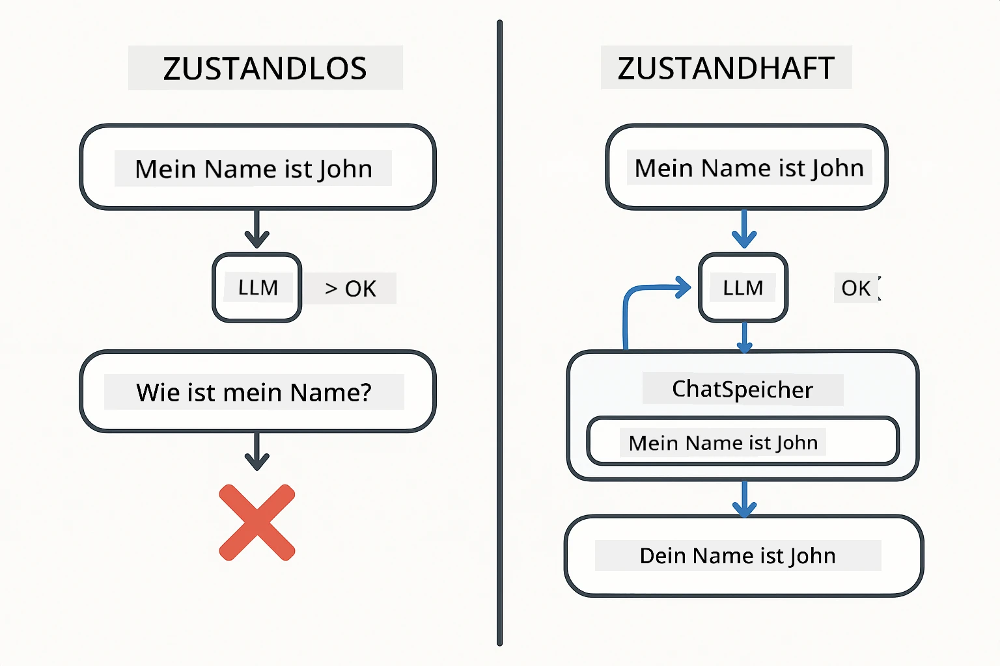
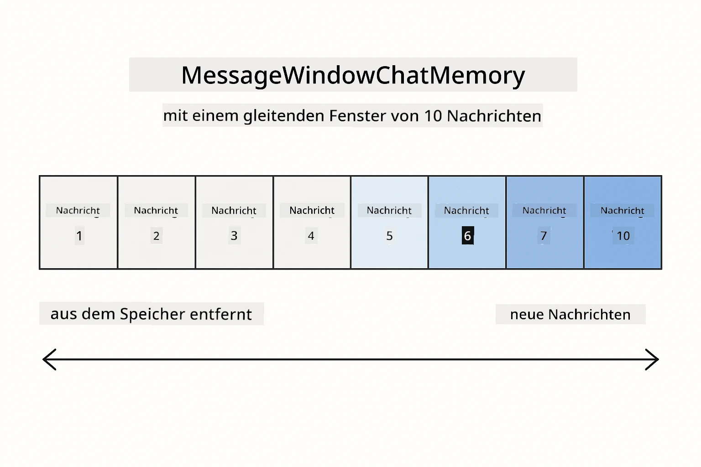
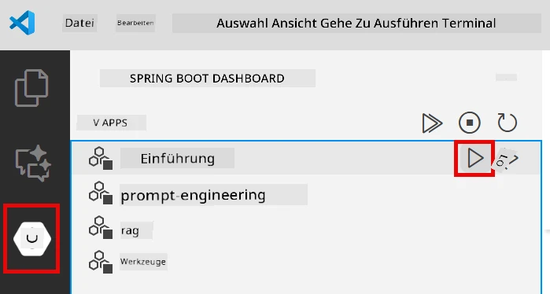
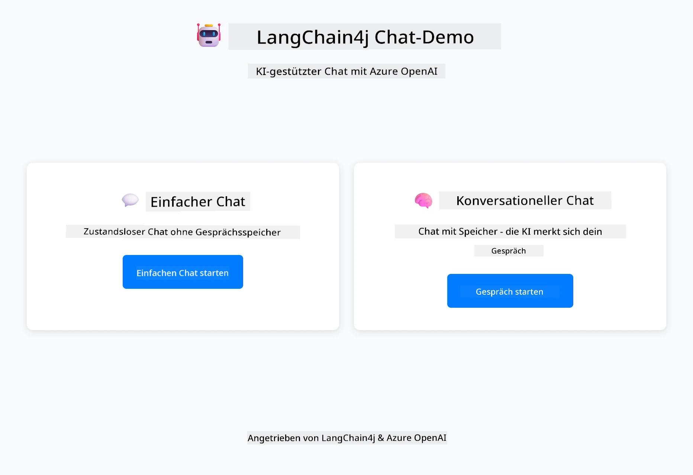
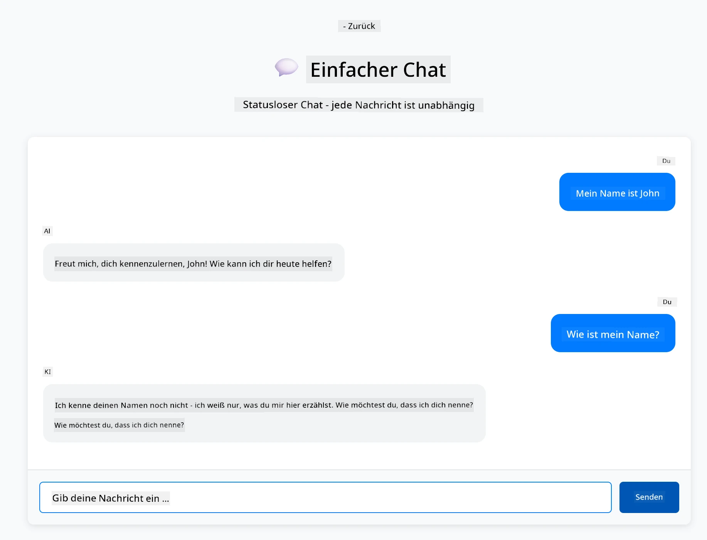
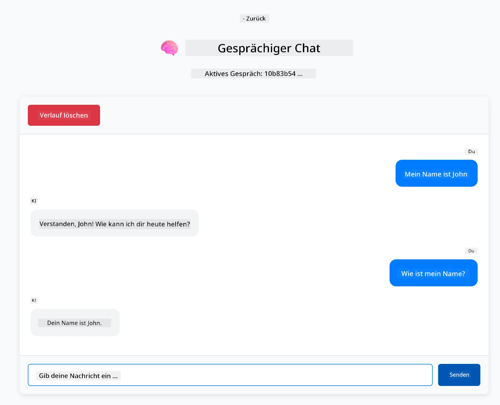

# Modul 01: Einstieg in LangChain4j

## Inhaltsverzeichnis

- [Video-Durchgang](#video-durchgang)
- [Was Sie lernen werden](#was-sie-lernen-werden)
- [Voraussetzungen](#voraussetzungen)
- [Verständnis des Kernproblems](#verständnis-des-kernproblems)
- [Verständnis von Tokens](#verständnis-von-tokens)
- [Wie Speicher funktioniert](#wie-speicher-funktioniert)
- [Wie dies LangChain4j nutzt](#wie-dies-langchain4j-nutzt)
- [Bereitstellen der Azure OpenAI Infrastruktur](#bereitstellen-der-azure-openai-infrastruktur)
- [Anwendung lokal ausführen](#anwendung-lokal-ausführen)
- [Verwendung der Anwendung](#verwendung-der-anwendung)
  - [Zustandsloser Chat (linkes Panel)](#zustandsloser-chat-linkes-panel)
  - [Zustandsbehafteter Chat (rechtes Panel)](#zustandsbehafteter-chat-rechtes-panel)
- [Nächste Schritte](#nächste-schritte)

## Video-Durchgang

Sehen Sie sich diese Live-Session an, die erklärt, wie Sie mit diesem Modul starten:

<a href="https://www.youtube.com/live/nl_troDm8rQ?si=6b85S8xGjWnT2fX9"></a>

## Was Sie lernen werden

Dies ist Ihr Einstiegspunkt mit LangChain4j und Azure OpenAI. Wir beginnen mit den Grundlagen und bauen produktionsähnliche Anwendungen. Dieses Modul konzentriert sich auf konversationelle KI, die den Kontext merkt und den Zustand beibehält – die grundlegenden Konzepte, auf denen alle späteren Module aufbauen.

Wir verwenden im gesamten Leitfaden Azure OpenAI's GPT-5.2, da dessen fortschrittliche Analysefähigkeiten das Verhalten verschiedener Muster besser sichtbar machen. Wenn Sie Speicher hinzufügen, sehen Sie den Unterschied deutlich. So verstehen Sie leichter, was jede Komponente zu Ihrer Anwendung beiträgt.

Sie erstellen eine Anwendung, die beide Muster demonstriert:

**Zustandsloser Chat** – Jede Anfrage ist unabhängig. Das Modell hat kein Gedächtnis vorheriger Nachrichten. Dies ist der einfachste Einstiegspunkt.

**Zustandsbehaftete Unterhaltung** – Jede Anfrage beinhaltet Konversationsverlauf. Das Modell behält Kontext über mehrere Gesprächsrunden. Dies ist für produktionsreife Anwendungen notwendig.

## Voraussetzungen

- Azure-Abonnement mit Azure OpenAI Zugriff
- Java 21, Maven 3.9+
- Azure CLI (https://learn.microsoft.com/en-us/cli/azure/install-azure-cli)
- Azure Developer CLI (azd) (https://learn.microsoft.com/en-us/azure/developer/azure-developer-cli/install-azd)

> **Hinweis:** Java, Maven, Azure CLI und Azure Developer CLI (azd) sind im bereitgestellten Devcontainer vorinstalliert.

> **Hinweis:** Dieses Modul verwendet GPT-5.2 auf Azure OpenAI. Die Bereitstellung wird automatisch über `azd up` konfiguriert – ändern Sie den Modellnamen im Code nicht.

## Verständnis des Kernproblems

Sprachmodelle sind zustandslos. Jeder API-Aufruf ist unabhängig. Wenn Sie "Mein Name ist John" schicken und dann fragen "Wie heißt mein Name?", hat das Modell keine Ahnung, dass Sie sich gerade vorgestellt haben. Es behandelt jede Anfrage, als sei es das erste Gespräch, das Sie je geführt haben.

Das ist für einfache Q&A okay, aber nutzlos für echte Anwendungen. Kundenservice-Bots müssen sich erinnern, was Sie ihnen gesagt haben. Persönliche Assistenten brauchen Kontext. Jede Unterhaltung mit mehreren Runden erfordert Speicher.

Das folgende Diagramm vergleicht die beiden Ansätze – links ein zustandsloser Aufruf, der Ihren Namen vergisst; rechts ein zustandsbehafteter Aufruf mit ChatMemory, das sich daran erinnert.



*Der Unterschied zwischen zustandslosen (unabhängigen Aufrufen) und zustandsbehafteten (kontextbewussten) Unterhaltungen*

## Verständnis von Tokens

Bevor wir in Unterhaltungen eintauchen, ist es wichtig, Tokens zu verstehen – die grundlegenden Einheiten von Text, die Sprachmodelle verarbeiten:


*Beispiel, wie Text in Tokens zerlegt wird – „I love AI!“ wird zu 4 separaten Verarbeitungseinheiten*

Tokens sind die Maßeinheit, mit der KI-Modelle Text messen und verarbeiten. Wörter, Satzzeichen und sogar Leerzeichen können Tokens sein. Ihr Modell hat ein Limit, wie viele Tokens es gleichzeitig verarbeiten kann (400.000 bei GPT-5.2, mit bis zu 272.000 Eingabe- und 128.000 Ausgabe-Tokens). Das Verständnis der Tokens hilft, die Gesprächslänge und Kosten zu steuern.

## Wie Speicher funktioniert

Chat-Speicher löst das Problem der Zustandslosigkeit, indem er den Gesprächsverlauf speichert. Bevor Ihre Anfrage an das Modell geschickt wird, fügt das Framework relevante vorherige Nachrichten voran. Wenn Sie fragen „Wie heißt mein Name?“, sendet das System tatsächlich die gesamte Gesprächshistorie, sodass das Modell sehen kann, dass Sie zuvor „Mein Name ist John“ gesagt haben.

LangChain4j stellt Speicherimplementierungen bereit, die das automatisch erledigen. Sie wählen, wie viele Nachrichten gespeichert werden sollen, und das Framework verwaltet das Kontextfenster. Das folgende Diagramm zeigt, wie MessageWindowChatMemory ein gleitendes Fenster der neuesten Nachrichten verwaltet.



*MessageWindowChatMemory verwaltet ein gleitendes Fenster der letzten Nachrichten und entfernt automatisch ältere*

## Wie dies LangChain4j nutzt

Dieses Modul integriert Spring Boot und fügt Gesprächsspeicher hinzu. So fügen sich die Teile zusammen:

**Abhängigkeiten** – Fügen Sie zwei LangChain4j-Bibliotheken hinzu:

```xml
<dependency>
    <groupId>dev.langchain4j</groupId>
    <artifactId>langchain4j</artifactId> <!-- Inherited from BOM in root pom.xml -->
</dependency>
<dependency>
    <groupId>dev.langchain4j</groupId>
    <artifactId>langchain4j-open-ai-official</artifactId> <!-- Inherited from BOM in root pom.xml -->
</dependency>
```

**Chat-Modell** – Konfigurieren Sie Azure OpenAI als Spring Bean ([LangChainConfig.java](../../../01-introduction/src/main/java/com/example/langchain4j/config/LangChainConfig.java)):

```java
@Bean
public OpenAiOfficialChatModel openAiOfficialChatModel() {
    return OpenAiOfficialChatModel.builder()
            .baseUrl(azureEndpoint)
            .apiKey(azureApiKey)
            .modelName(deploymentName)
            .timeout(Duration.ofMinutes(5))
            .maxRetries(3)
            .build();
}
```

Der Builder liest Anmeldeinformationen aus Umgebungsvariablen, die von `azd up` gesetzt werden. Mit `baseUrl` auf Ihren Azure-Endpunkt funktioniert der OpenAI-Client mit Azure OpenAI.

**Gesprächsspeicher** – Verfolgen Sie den Chat-Verlauf mit MessageWindowChatMemory ([ConversationService.java](../../../01-introduction/src/main/java/com/example/langchain4j/service/ConversationService.java)):

```java
ChatMemory memory = MessageWindowChatMemory.withMaxMessages(10);

memory.add(UserMessage.from("My name is John"));
memory.add(AiMessage.from("Nice to meet you, John!"));

memory.add(UserMessage.from("What's my name?"));
AiMessage aiMessage = chatModel.chat(memory.messages()).aiMessage();
memory.add(aiMessage);
```

Erstellen Sie Speicher mit `withMaxMessages(10)`, um die letzten 10 Nachrichten zu behalten. Fügen Sie Nachrichten von Nutzer und KI mit typisierten Wrappern hinzu: `UserMessage.from(text)` und `AiMessage.from(text)`. Rufen Sie den Verlauf mit `memory.messages()` ab und schicken Sie ihn ans Modell. Der Service speichert separate Speicherinstanzen pro Konversations-ID, sodass mehrere Nutzer gleichzeitig chatten können.

> **🤖 Probieren Sie es mit [GitHub Copilot](https://github.com/features/copilot) Chat:** Öffnen Sie [`ConversationService.java`](../../../01-introduction/src/main/java/com/example/langchain4j/service/ConversationService.java) und fragen Sie:
> - „Wie entscheidet MessageWindowChatMemory, welche Nachrichten verworfen werden, wenn das Fenster voll ist?“
> - „Kann ich eine benutzerdefinierte Speicherlösung mit Datenbank anstelle von In-Memory implementieren?“
> - „Wie füge ich eine Zusammenfassung hinzu, um alten Gesprächsverlauf zu komprimieren?“

Der zustandslose Chat-Endpunkt überspringt Speicher völlig – einfach `chatModel.chat(prompt)` wie im Schnellstart. Der zustandsbehaftete Endpunkt fügt Nachrichten zum Speicher hinzu, ruft Verlauf ab und sendet diesen Kontext mit jeder Anfrage. Gleiche Modellkonfiguration, unterschiedliche Muster.

## Bereitstellen der Azure OpenAI Infrastruktur

**Bash:**
```bash
cd 01-introduction
azd up  # Wählen Sie das Abonnement und den Standort aus (eastus2 empfohlen)
```

**PowerShell:**
```powershell
cd 01-introduction
azd up  # Wählen Sie Abonnement und Standort (eastus2 empfohlen)
```

> **Hinweis:** Wenn Sie einen Timeout-Fehler (`RequestConflict: Cannot modify resource ... provisioning state is not terminal`) erhalten, führen Sie einfach erneut `azd up` aus. Azure-Ressourcen können noch im Bereitstellungsprozess sein, und ein erneutes Ausführen ermöglicht den Abschluss, sobald sich die Ressourcen in einem Endzustand befinden.

Dies wird:
1. Eine Azure OpenAI-Ressource mit GPT-5.2 und text-embedding-3-small Modellen bereitstellen
2. Automatisch eine `.env`-Datei im Projektstamm mit Zugangsdaten erzeugen
3. Alle erforderlichen Umgebungsvariablen einrichten

**Probleme bei der Bereitstellung?** Siehe das [Infrastructure README](infra/README.md) für detaillierte Fehlerbehebung, einschließlich Konflikten mit Subdomain-Namen, manueller Azure-Portal-Bereitstellung und Modellkonfigurationshinweisen.

**Überprüfen, ob die Bereitstellung erfolgreich war:**

**Bash:**
```bash
cat ../.env  # Sollte AZURE_OPENAI_ENDPOINT, API_KEY usw. anzeigen.
```

**PowerShell:**
```powershell
Get-Content ..\.env  # Sollte AZURE_OPENAI_ENDPOINT, API_KEY usw. anzeigen.
```

> **Hinweis:** Der `azd up`-Befehl erzeugt die `.env`-Datei automatisch. Falls Sie diese später aktualisieren müssen, können Sie entweder die `.env`-Datei manuell bearbeiten oder sie durch Ausführen folgender Befehle neu generieren:
>
> **Bash:**
> ```bash
> cd ..
> bash .azd-env.sh
> ```
>
> **PowerShell:**
> ```powershell
> cd ..
> .\.azd-env.ps1
> ```


## Anwendung lokal ausführen

**Bereitstellung überprüfen:**

Stellen Sie sicher, dass die `.env`-Datei mit Azure-Zugangsdaten im Stammverzeichnis vorhanden ist. Führen Sie dies aus dem Modulverzeichnis (`01-introduction/`) aus:

**Bash:**
```bash
cat ../.env  # Sollte AZURE_OPENAI_ENDPOINT, API_KEY, DEPLOYMENT anzeigen
```

**PowerShell:**
```powershell
Get-Content ..\.env  # Sollte AZURE_OPENAI_ENDPOINT, API_KEY, DEPLOYMENT anzeigen
```


**Starten Sie die Anwendungen:**

**Option 1: Verwendung des Spring Boot Dashboards (empfohlen für VS Code-Nutzer)**

Der Devcontainer enthält die Spring Boot Dashboard-Erweiterung, die eine visuelle Schnittstelle zum Verwalten aller Spring Boot-Anwendungen bietet. Sie finden es in der Aktivitätsleiste links in VS Code (achten Sie auf das Spring Boot-Symbol).

Über das Spring Boot Dashboard können Sie:
- Alle verfügbaren Spring Boot-Anwendungen im Workspace sehen
- Anwendungen mit einem Klick starten/stoppen
- Echtzeit-Logs der Anwendungen ansehen
- Den Anwendungsstatus überwachen

Klicken Sie einfach auf den Start-Button neben „introduction“, um dieses Modul zu starten, oder starten Sie alle Module gleichzeitig.



*Das Spring Boot Dashboard in VS Code — starten, stoppen und überwachen Sie alle Module an einem Ort*

**Option 2: Verwendung von Shell-Skripten**

Starten Sie alle Webanwendungen (Module 01-04):

**Bash:**
```bash
cd ..  # Vom Stammverzeichnis
./start-all.sh
```

**PowerShell:**
```powershell
cd ..  # Vom Stammverzeichnis
.\start-all.ps1
```

Oder starten Sie nur dieses Modul:

**Bash:**
```bash
cd 01-introduction
./start.sh
```

**PowerShell:**
```powershell
cd 01-introduction
.\start.ps1
```


Beide Skripte laden automatisch Umgebungsvariablen aus der `.env`-Datei im Stammverzeichnis und bauen die JARs, falls diese nicht vorhanden sind.

> **Hinweis:** Wenn Sie lieber alle Module manuell bauen möchten, bevor Sie starten:
>
> **Bash:**
> ```bash
> cd ..  # Go to root directory
> mvn clean package -DskipTests
> ```
>
> **PowerShell:**
> ```powershell
> cd ..  # Go to root directory
> mvn clean package -DskipTests
> ```


Öffnen Sie http://localhost:8080 in Ihrem Browser.

**Zum Stoppen:**

**Bash:**
```bash
./stop.sh  # Nur dieses Modul
# Oder
cd .. && ./stop-all.sh  # Alle Module
```

**PowerShell:**
```powershell
.\stop.ps1  # Nur dieses Modul
# Oder
cd ..; .\stop-all.ps1  # Alle Module
```


## Verwendung der Anwendung

Die Anwendung bietet eine Weboberfläche mit zwei Chat-Implementierungen nebeneinander.



*Dashboard zeigt sowohl Simple Chat (zustandslos) als auch Conversational Chat (zustandsbehaftet)*

### Zustandsloser Chat (linkes Panel)

Probieren Sie das zuerst. Fragen Sie „Mein Name ist John“ und dann sofort „Wie heißt mein Name?“ Das Modell wird sich nicht erinnern, weil jede Nachricht unabhängig ist. Dies zeigt das Kernproblem der Grundintegration von Sprachmodellen – kein Gesprächskontext.



*KI merkt sich den Namen aus der vorherigen Nachricht nicht*

### Zustandsbehafteter Chat (rechtes Panel)

Versuchen Sie hier dieselbe Abfolge. Fragen Sie „Mein Name ist John“ und dann „Wie heißt mein Name?“ Diesmal erinnert das Modell sich. Der Unterschied ist MessageWindowChatMemory – es hält den Gesprächsverlauf und fügt ihn mit jeder Anfrage hinzu. So funktionieren produktive konversationelle KI-Anwendungen.



*KI erinnert sich an Ihren Namen aus dem früheren Gespräch*

Beide Panels verwenden dasselbe GPT-5.2-Modell. Der einzige Unterschied ist der Speicher. Das macht deutlich, was Speicher Ihrer Anwendung bringt und warum er für echte Anwendungsfälle unverzichtbar ist.

## Nächste Schritte

**Nächstes Modul:** [02-prompt-engineering - Prompt Engineering mit GPT-5.2](../02-prompt-engineering/README.md)

---

**Navigation:** [← Zurück zur Hauptseite](../README.md) | [Weiter: Modul 02 - Prompt Engineering →](../02-prompt-engineering/README.md)

---

<!-- CO-OP TRANSLATOR DISCLAIMER START -->
**Haftungsausschluss**:
Dieses Dokument wurde mit dem KI-Übersetzungsdienst [Co-op Translator](https://github.com/Azure/co-op-translator) übersetzt. Obwohl wir uns um Genauigkeit bemühen, beachten Sie bitte, dass automatisierte Übersetzungen Fehler oder Ungenauigkeiten enthalten können. Das Originaldokument in seiner Ursprungssprache gilt als maßgebliche Quelle. Bei kritischen Informationen wird eine professionelle menschliche Übersetzung empfohlen. Wir übernehmen keine Haftung für Missverständnisse oder Fehlinterpretationen, die aus der Verwendung dieser Übersetzung entstehen.
<!-- CO-OP TRANSLATOR DISCLAIMER END -->