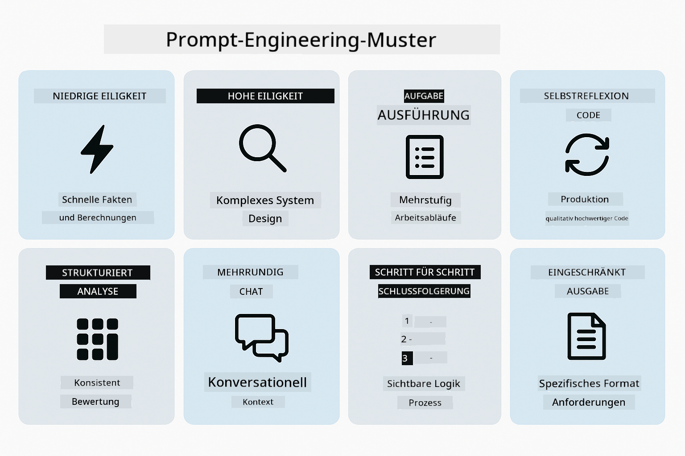
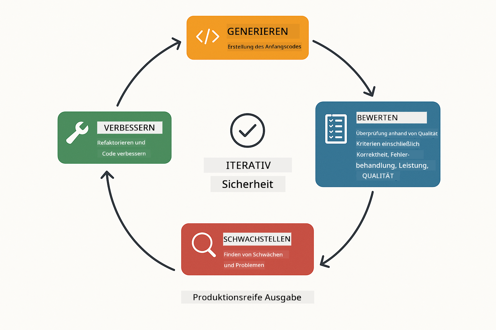
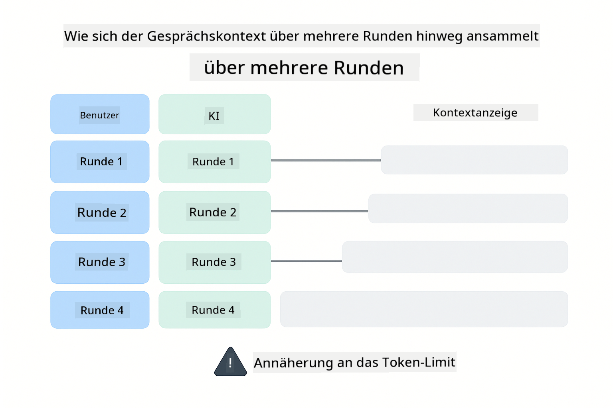
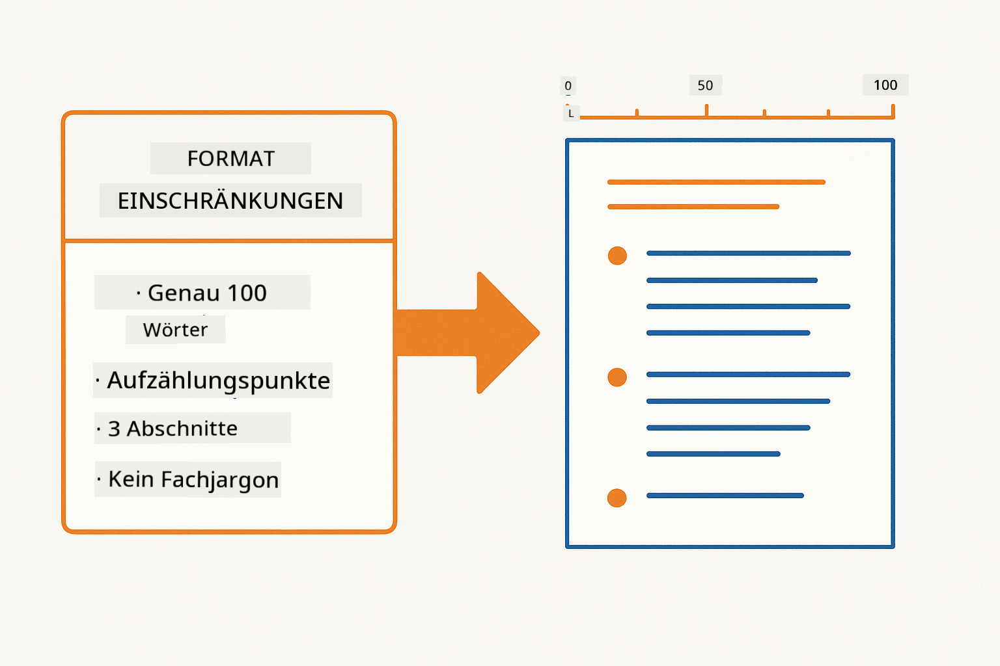
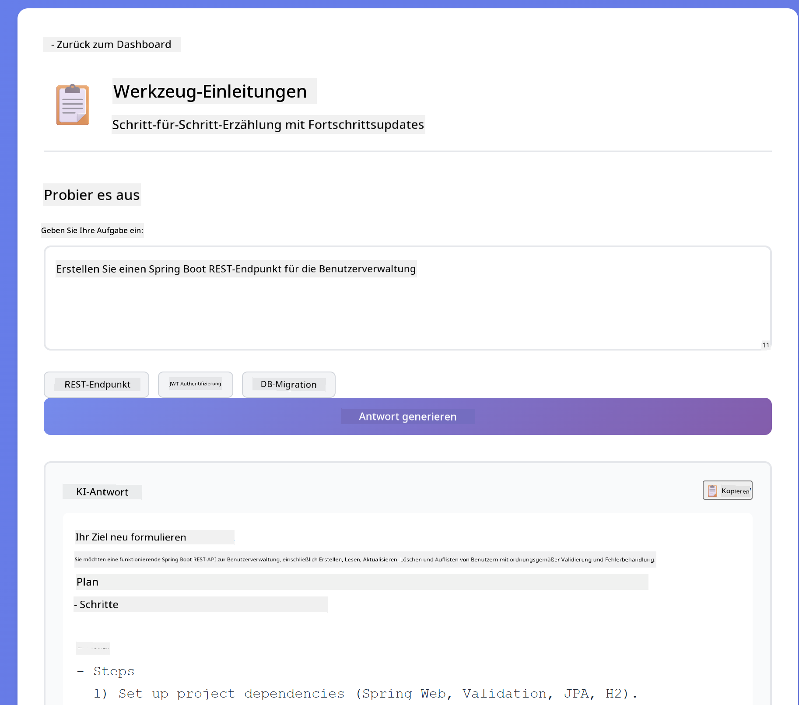
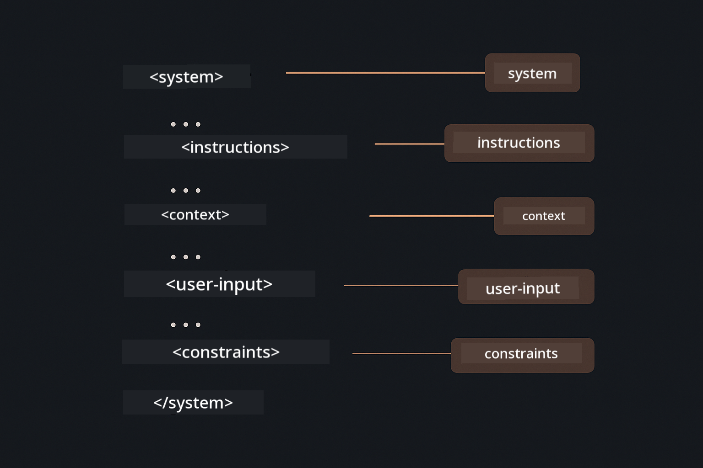

<!--
CO_OP_TRANSLATOR_METADATA:
{
  "original_hash": "8d787826cad7e92bf5cdbd116b1e6116",
  "translation_date": "2025-12-13T15:47:28+00:00",
  "source_file": "02-prompt-engineering/README.md",
  "language_code": "de"
}
-->
# Modul 02: Prompt Engineering mit GPT-5

## Inhaltsverzeichnis

- [Was Sie lernen werden](../../../02-prompt-engineering)
- [Voraussetzungen](../../../02-prompt-engineering)
- [Verständnis von Prompt Engineering](../../../02-prompt-engineering)
- [Wie dies LangChain4j verwendet](../../../02-prompt-engineering)
- [Die Kernmuster](../../../02-prompt-engineering)
- [Verwendung vorhandener Azure-Ressourcen](../../../02-prompt-engineering)
- [Anwendungs-Screenshots](../../../02-prompt-engineering)
- [Erkundung der Muster](../../../02-prompt-engineering)
  - [Niedrige vs hohe Eifer](../../../02-prompt-engineering)
  - [Aufgabenausführung (Tool-Preambles)](../../../02-prompt-engineering)
  - [Selbstreflektierender Code](../../../02-prompt-engineering)
  - [Strukturierte Analyse](../../../02-prompt-engineering)
  - [Mehrstufiger Chat](../../../02-prompt-engineering)
  - [Schritt-für-Schritt-Argumentation](../../../02-prompt-engineering)
  - [Eingeschränkte Ausgabe](../../../02-prompt-engineering)
- [Was Sie wirklich lernen](../../../02-prompt-engineering)
- [Nächste Schritte](../../../02-prompt-engineering)

## Was Sie lernen werden

Im vorherigen Modul haben Sie gesehen, wie Speicher konversationelle KI ermöglicht und GitHub-Modelle für grundlegende Interaktionen verwendet. Jetzt konzentrieren wir uns darauf, wie Sie Fragen stellen – also die Prompts selbst – mit Azure OpenAI's GPT-5. Die Art und Weise, wie Sie Ihre Prompts strukturieren, beeinflusst dramatisch die Qualität der Antworten, die Sie erhalten.

Wir verwenden GPT-5, weil es eine Steuerung des Denkprozesses einführt – Sie können dem Modell sagen, wie viel es vor der Antwort nachdenken soll. Das macht verschiedene Prompting-Strategien deutlicher und hilft Ihnen zu verstehen, wann Sie welche Methode einsetzen sollten. Außerdem profitieren wir von den geringeren Rate-Limits von Azure für GPT-5 im Vergleich zu GitHub-Modellen.

## Voraussetzungen

- Abgeschlossenes Modul 01 (Azure OpenAI-Ressourcen bereitgestellt)
- `.env`-Datei im Stammverzeichnis mit Azure-Zugangsdaten (erstellt durch `azd up` im Modul 01)

> **Hinweis:** Wenn Sie Modul 01 noch nicht abgeschlossen haben, folgen Sie dort zuerst den Bereitstellungsanweisungen.

## Verständnis von Prompt Engineering

Prompt Engineering bedeutet, Eingabetexte so zu gestalten, dass Sie konsistent die gewünschten Ergebnisse erhalten. Es geht nicht nur darum, Fragen zu stellen – sondern darum, Anfragen so zu strukturieren, dass das Modell genau versteht, was Sie wollen und wie es geliefert werden soll.

Stellen Sie sich vor, Sie geben einem Kollegen Anweisungen. „Behebe den Fehler“ ist vage. „Behebe die Nullzeiger-Ausnahme in UserService.java Zeile 45 durch Hinzufügen einer Nullprüfung“ ist spezifisch. Sprachmodelle funktionieren genauso – Spezifität und Struktur sind entscheidend.

## Wie dies LangChain4j verwendet

Dieses Modul demonstriert fortgeschrittene Prompting-Muster unter Verwendung derselben LangChain4j-Basis wie in den vorherigen Modulen, mit Fokus auf Prompt-Struktur und Steuerung des Denkprozesses.


*Wie LangChain4j Ihre Prompts mit Azure OpenAI GPT-5 verbindet*

**Abhängigkeiten** – Modul 02 verwendet die folgenden langchain4j-Abhängigkeiten, definiert in `pom.xml`:
```xml
<dependency>
    <groupId>dev.langchain4j</groupId>
    <artifactId>langchain4j</artifactId> <!-- Inherited from BOM in root pom.xml -->
</dependency>
<dependency>
    <groupId>dev.langchain4j</groupId>
    <artifactId>langchain4j-open-ai-official</artifactId> <!-- Inherited from BOM in root pom.xml -->
</dependency>
```

**OpenAiOfficialChatModel-Konfiguration** – [LangChainConfig.java](../../../02-prompt-engineering/src/main/java/com/example/langchain4j/prompts/config/LangChainConfig.java)

Das Chat-Modell wird manuell als Spring-Bean mit dem offiziellen OpenAI-Client konfiguriert, der Azure OpenAI-Endpunkte unterstützt. Der wesentliche Unterschied zu Modul 01 liegt darin, wie wir die an `chatModel.chat()` gesendeten Prompts strukturieren, nicht in der Modellauswahl selbst.

**System- und Benutzer-Nachrichten** – [Gpt5PromptService.java](../../../02-prompt-engineering/src/main/java/com/example/langchain4j/prompts/service/Gpt5PromptService.java)

LangChain4j trennt Nachrichtentypen zur besseren Übersicht. `SystemMessage` legt das Verhalten und den Kontext der KI fest (z. B. „Du bist ein Code-Reviewer“), während `UserMessage` die eigentliche Anfrage enthält. Diese Trennung ermöglicht es, das KI-Verhalten über verschiedene Benutzeranfragen hinweg konsistent zu halten.

```java
SystemMessage systemMsg = SystemMessage.from(
    "You are a helpful Java programming expert."
);

UserMessage userMsg = UserMessage.from(
    "Explain what a List is in Java"
);

String response = chatModel.chat(systemMsg, userMsg);
```


*SystemMessage liefert persistenten Kontext, während UserMessages einzelne Anfragen enthalten*

**MessageWindowChatMemory für Mehrfachrunden** – Für das Mehrfachrunden-Konversationsmuster verwenden wir `MessageWindowChatMemory` aus Modul 01 wieder. Jede Sitzung erhält eine eigene Speicherinstanz, die in einer `Map<String, ChatMemory>` gespeichert wird, sodass mehrere parallele Gespräche ohne Kontextvermischung möglich sind.

**Prompt-Vorlagen** – Der eigentliche Fokus liegt hier auf Prompt Engineering, nicht auf neuen LangChain4j-APIs. Jedes Muster (niedriger Eifer, hoher Eifer, Aufgabenausführung usw.) verwendet dieselbe Methode `chatModel.chat(prompt)`, aber mit sorgfältig strukturierten Prompt-Strings. Die XML-Tags, Anweisungen und Formatierungen sind alle Teil des Prompt-Texts, nicht LangChain4j-Funktionen.

**Steuerung des Denkprozesses** – Der Denkaufwand von GPT-5 wird durch Prompt-Anweisungen wie „maximal 2 Denkschritte“ oder „gründlich erkunden“ gesteuert. Dies sind Techniken des Prompt Engineerings, keine LangChain4j-Konfigurationen. Die Bibliothek liefert Ihre Prompts einfach an das Modell.

Die wichtigste Erkenntnis: LangChain4j stellt die Infrastruktur bereit (Modellverbindung über [LangChainConfig.java](../../../02-prompt-engineering/src/main/java/com/example/langchain4j/prompts/config/LangChainConfig.java), Speicher, Nachrichtenverwaltung über [Gpt5PromptService.java](../../../02-prompt-engineering/src/main/java/com/example/langchain4j/prompts/service/Gpt5PromptService.java)), während dieses Modul Ihnen beibringt, wie Sie innerhalb dieser Infrastruktur effektive Prompts erstellen.

## Die Kernmuster

Nicht alle Probleme erfordern denselben Ansatz. Manche Fragen brauchen schnelle Antworten, andere tiefes Nachdenken. Manche benötigen sichtbare Argumentation, andere nur Ergebnisse. Dieses Modul behandelt acht Prompting-Muster – jeweils optimiert für unterschiedliche Szenarien. Sie werden alle ausprobieren, um zu lernen, wann welcher Ansatz am besten funktioniert.



*Übersicht der acht Prompt Engineering-Muster und ihrer Anwendungsfälle*


*Niedriger Eifer (schnell, direkt) vs hoher Eifer (gründlich, explorativ) Denkansätze*

**Niedriger Eifer (Schnell & Fokussiert)** – Für einfache Fragen, bei denen Sie schnelle, direkte Antworten wollen. Das Modell führt minimale Argumentation durch – maximal 2 Schritte. Verwenden Sie dies für Berechnungen, Nachschlagen oder einfache Fragen.

```java
String prompt = """
    <reasoning_effort>low</reasoning_effort>
    <instruction>maximum 2 reasoning steps</instruction>
    
    What is 15% of 200?
    """;

String response = chatModel.chat(prompt);
```

> 💡 **Mit GitHub Copilot erkunden:** Öffnen Sie [`Gpt5PromptService.java`](../../../02-prompt-engineering/src/main/java/com/example/langchain4j/prompts/service/Gpt5PromptService.java) und fragen Sie:
> - „Was ist der Unterschied zwischen niedrigen und hohen Eifer-Prompting-Mustern?“
> - „Wie helfen die XML-Tags in Prompts, die Antwort der KI zu strukturieren?“
> - „Wann sollte ich Selbstreflexionsmuster vs direkte Anweisungen verwenden?“

**Hoher Eifer (Tief & Gründlich)** – Für komplexe Probleme, bei denen Sie eine umfassende Analyse wünschen. Das Modell erkundet gründlich und zeigt detaillierte Argumentation. Verwenden Sie dies für Systemdesign, Architekturentscheidungen oder komplexe Forschung.

```java
String prompt = """
    <reasoning_effort>high</reasoning_effort>
    <instruction>explore thoroughly, show detailed reasoning</instruction>
    
    Design a caching strategy for a high-traffic REST API.
    """;

String response = chatModel.chat(prompt);
```

**Aufgabenausführung (Schritt-für-Schritt-Fortschritt)** – Für mehrstufige Arbeitsabläufe. Das Modell liefert einen Plan vorab, beschreibt jeden Schritt während der Ausführung und gibt dann eine Zusammenfassung. Verwenden Sie dies für Migrationen, Implementierungen oder beliebige mehrstufige Prozesse.

```java
String prompt = """
    <task>Create a REST endpoint for user registration</task>
    <preamble>Provide an upfront plan</preamble>
    <narration>Narrate each step as you work</narration>
    <summary>Summarize what was accomplished</summary>
    """;

String response = chatModel.chat(prompt);
```

Chain-of-Thought-Prompting fordert das Modell explizit auf, seinen Denkprozess zu zeigen, was die Genauigkeit bei komplexen Aufgaben verbessert. Die Schritt-für-Schritt-Aufschlüsselung hilft sowohl Menschen als auch KI, die Logik zu verstehen.

> **🤖 Probieren Sie es mit [GitHub Copilot](https://github.com/features/copilot) Chat:** Fragen Sie zu diesem Muster:
> - „Wie würde ich das Aufgabenausführungsmuster für lang laufende Operationen anpassen?“
> - „Was sind Best Practices für die Strukturierung von Tool-Preambles in Produktionsanwendungen?“
> - „Wie kann ich Zwischenfortschritts-Updates in einer UI erfassen und anzeigen?“


*Planen → Ausführen → Zusammenfassen Arbeitsablauf für mehrstufige Aufgaben*

**Selbstreflektierender Code** – Für die Erzeugung von Produktionscodequalität. Das Modell generiert Code, prüft ihn anhand von Qualitätskriterien und verbessert ihn iterativ. Verwenden Sie dies beim Erstellen neuer Features oder Services.

```java
String prompt = """
    <task>Create an email validation service</task>
    <quality_criteria>
    - Correct logic and error handling
    - Best practices (clean code, proper naming)
    - Performance optimization
    - Security considerations
    </quality_criteria>
    <instruction>Generate code, evaluate against criteria, improve iteratively</instruction>
    """;

String response = chatModel.chat(prompt);
```



*Iterative Verbesserungsschleife – generieren, bewerten, Probleme identifizieren, verbessern, wiederholen*

**Strukturierte Analyse** – Für konsistente Bewertungen. Das Modell überprüft Code anhand eines festen Rahmens (Korrektheit, Praktiken, Leistung, Sicherheit). Verwenden Sie dies für Code-Reviews oder Qualitätsbewertungen.

```java
String prompt = """
    <code>
    public List getUsers() {
        return database.query("SELECT * FROM users");
    }
    </code>
    
    <framework>
    Evaluate using these categories:
    1. Correctness - Logic and functionality
    2. Best Practices - Code quality
    3. Performance - Efficiency concerns
    4. Security - Vulnerabilities
    </framework>
    """;

String response = chatModel.chat(prompt);
```

> **🤖 Probieren Sie es mit [GitHub Copilot](https://github.com/features/copilot) Chat:** Fragen Sie zur strukturierten Analyse:
> - „Wie kann ich den Analyse-Rahmen für verschiedene Arten von Code-Reviews anpassen?“
> - „Wie kann ich strukturierte Ausgaben programmatisch parsen und darauf reagieren?“
> - „Wie stelle ich konsistente Schweregrade über verschiedene Review-Sitzungen sicher?“


*Vier-Kategorien-Rahmen für konsistente Code-Reviews mit Schweregraden*

**Mehrstufiger Chat** – Für Gespräche, die Kontext benötigen. Das Modell erinnert sich an vorherige Nachrichten und baut darauf auf. Verwenden Sie dies für interaktive Hilfesitzungen oder komplexe Q&A.

```java
ChatMemory memory = MessageWindowChatMemory.withMaxMessages(10);

memory.add(UserMessage.from("What is Spring Boot?"));
AiMessage aiMessage1 = chatModel.chat(memory.messages()).aiMessage();
memory.add(aiMessage1);

memory.add(UserMessage.from("Show me an example"));
AiMessage aiMessage2 = chatModel.chat(memory.messages()).aiMessage();
memory.add(aiMessage2);
```



*Wie sich der Gesprächskontext über mehrere Runden ansammelt, bis das Token-Limit erreicht ist*

**Schritt-für-Schritt-Argumentation** – Für Probleme, die sichtbare Logik erfordern. Das Modell zeigt explizite Argumentation für jeden Schritt. Verwenden Sie dies für Mathematikaufgaben, Logikrätsel oder wenn Sie den Denkprozess verstehen müssen.

```java
String prompt = """
    <instruction>Show your reasoning step-by-step</instruction>
    
    If a train travels 120 km in 2 hours, then stops for 30 minutes,
    then travels another 90 km in 1.5 hours, what is the average speed
    for the entire journey including the stop?
    """;

String response = chatModel.chat(prompt);
```


*Aufschlüsselung von Problemen in explizite logische Schritte*

**Eingeschränkte Ausgabe** – Für Antworten mit spezifischen Formatvorgaben. Das Modell hält sich strikt an Format- und Längenregeln. Verwenden Sie dies für Zusammenfassungen oder wenn Sie eine präzise Ausgabestruktur benötigen.

```java
String prompt = """
    <constraints>
    - Exactly 100 words
    - Bullet point format
    - Technical terms only
    </constraints>
    
    Summarize the key concepts of machine learning.
    """;

String response = chatModel.chat(prompt);
```



*Durchsetzung spezifischer Format-, Längen- und Strukturvorgaben*

## Verwendung vorhandener Azure-Ressourcen

**Bereitstellung überprüfen:**

Stellen Sie sicher, dass die `.env`-Datei im Stammverzeichnis mit Azure-Zugangsdaten existiert (erstellt während Modul 01):
```bash
cat ../.env  # Sollte AZURE_OPENAI_ENDPOINT, API_KEY, DEPLOYMENT anzeigen
```

**Starten der Anwendung:**

> **Hinweis:** Wenn Sie bereits alle Anwendungen mit `./start-all.sh` aus Modul 01 gestartet haben, läuft dieses Modul bereits auf Port 8083. Sie können die Startbefehle unten überspringen und direkt zu http://localhost:8083 gehen.

**Option 1: Verwendung des Spring Boot Dashboards (empfohlen für VS Code-Nutzer)**

Der Dev-Container enthält die Erweiterung Spring Boot Dashboard, die eine visuelle Oberfläche zur Verwaltung aller Spring Boot-Anwendungen bietet. Sie finden sie in der Aktivitätsleiste links in VS Code (Suchen Sie nach dem Spring Boot-Symbol).

Im Spring Boot Dashboard können Sie:
- Alle verfügbaren Spring Boot-Anwendungen im Workspace sehen
- Anwendungen mit einem Klick starten/stoppen
- Anwendungsprotokolle in Echtzeit ansehen
- Anwendungsstatus überwachen

Klicken Sie einfach auf den Play-Button neben „prompt-engineering“, um dieses Modul zu starten, oder starten Sie alle Module gleichzeitig.


**Option 2: Verwendung von Shell-Skripten**

Starten Sie alle Webanwendungen (Module 01-04):

**Bash:**
```bash
cd ..  # Vom Stammverzeichnis
./start-all.sh
```

**PowerShell:**
```powershell
cd ..  # Vom Stammverzeichnis
.\start-all.ps1
```

Oder starten Sie nur dieses Modul:

**Bash:**
```bash
cd 02-prompt-engineering
./start.sh
```

**PowerShell:**
```powershell
cd 02-prompt-engineering
.\start.ps1
```

Beide Skripte laden automatisch Umgebungsvariablen aus der `.env`-Datei im Stammverzeichnis und bauen die JARs, falls sie nicht existieren.

> **Hinweis:** Wenn Sie alle Module manuell vor dem Start bauen möchten:
>
> **Bash:**
> ```bash
> cd ..  # Go to root directory
> mvn clean package -DskipTests
> ```
>
> **PowerShell:**
> ```powershell
> cd ..  # Go to root directory
> mvn clean package -DskipTests
> ```

Öffnen Sie http://localhost:8083 in Ihrem Browser.

**Zum Stoppen:**

**Bash:**
```bash
./stop.sh  # Nur dieses Modul
# Oder
cd .. && ./stop-all.sh  # Alle Module
```

**PowerShell:**
```powershell
.\stop.ps1  # Nur dieses Modul
# Oder
cd ..; .\stop-all.ps1  # Alle Module
```

## Anwendungs-Screenshots


*Das Haupt-Dashboard zeigt alle 8 Prompt Engineering-Muster mit ihren Eigenschaften und Anwendungsfällen*

## Erkundung der Muster

Die Weboberfläche ermöglicht es Ihnen, verschiedene Prompting-Strategien auszuprobieren. Jedes Muster löst unterschiedliche Probleme – testen Sie sie, um zu sehen, wann welcher Ansatz am besten funktioniert.

### Niedrige vs hohe Eifer

Stellen Sie eine einfache Frage wie „Was sind 15 % von 200?“ mit niedrigem Eifer. Sie erhalten eine sofortige, direkte Antwort. Stellen Sie nun eine komplexe Frage wie „Entwerfen Sie eine Caching-Strategie für eine stark frequentierte API“ mit hohem Eifer. Beobachten Sie, wie das Modell langsamer wird und detaillierte Argumentation liefert. Dasselbe Modell, dieselbe Frage-Struktur – aber der Prompt sagt ihm, wie viel es nachdenken soll.


*Kurze Berechnung mit minimaler Begründung*


*Umfassende Caching-Strategie (2,8MB)*

### Aufgabenausführung (Tool-Preambles)

Mehrstufige Workflows profitieren von einer Vorausplanung und Fortschrittsberichterstattung. Das Modell skizziert, was es tun wird, erläutert jeden Schritt und fasst dann die Ergebnisse zusammen.



*Erstellung eines REST-Endpunkts mit schrittweiser Erläuterung (3,9MB)*

### Selbstreflektierender Code

Versuche „Erstelle einen E-Mail-Validierungsdienst“. Anstatt nur Code zu generieren und zu stoppen, erzeugt das Modell Code, bewertet ihn anhand von Qualitätskriterien, erkennt Schwächen und verbessert ihn. Du wirst sehen, wie es iteriert, bis der Code Produktionsstandards erfüllt.


*Vollständiger E-Mail-Validierungsdienst (5,2MB)*

### Strukturierte Analyse

Code-Reviews benötigen konsistente Bewertungsrahmen. Das Modell analysiert Code anhand fester Kategorien (Korrektheit, Praktiken, Leistung, Sicherheit) mit Schweregraden.


*Framework-basierte Code-Review*

### Mehrstufiger Chat

Frage „Was ist Spring Boot?“ und stelle dann sofort die Folgefrage „Zeig mir ein Beispiel“. Das Modell erinnert sich an deine erste Frage und gibt dir ein spezifisches Spring-Boot-Beispiel. Ohne Gedächtnis wäre die zweite Frage zu vage.


*Kontextbewahrung über Fragen hinweg*

### Schritt-für-Schritt-Begründung

Wähle ein Mathematikproblem und probiere es mit Schritt-für-Schritt-Begründung und geringer Eifer aus. Geringer Eifer gibt dir nur die Antwort – schnell, aber undurchsichtig. Schritt-für-Schritt zeigt dir jede Berechnung und Entscheidung.


*Mathematikproblem mit expliziten Schritten*

### Eingeschränkte Ausgabe

Wenn du bestimmte Formate oder Wortzahlen brauchst, erzwingt dieses Muster strikte Einhaltung. Versuche, eine Zusammenfassung mit genau 100 Wörtern im Aufzählungsformat zu generieren.


*Maschinelles Lernen Zusammenfassung mit Formatkontrolle*

## Was du wirklich lernst

**Begründungsaufwand ändert alles**

GPT-5 lässt dich den Rechenaufwand über deine Eingaben steuern. Geringer Aufwand bedeutet schnelle Antworten mit minimaler Exploration. Hoher Aufwand bedeutet, dass das Modell sich Zeit nimmt, tief nachzudenken. Du lernst, den Aufwand an die Komplexität der Aufgabe anzupassen – verschwende keine Zeit mit einfachen Fragen, aber überstürze auch keine komplexen Entscheidungen.

**Struktur steuert Verhalten**

Fallen dir die XML-Tags in den Eingaben auf? Sie sind nicht dekorativ. Modelle folgen strukturierten Anweisungen zuverlässiger als Freitext. Wenn du mehrstufige Prozesse oder komplexe Logik brauchst, hilft Struktur dem Modell, den Überblick zu behalten, wo es ist und was als Nächstes kommt.



*Anatomie eines gut strukturierten Prompts mit klaren Abschnitten und XML-ähnlicher Organisation*

**Qualität durch Selbstevaluation**

Die selbstreflektierenden Muster funktionieren, indem Qualitätskriterien explizit gemacht werden. Anstatt zu hoffen, dass das Modell „es richtig macht“, sagst du ihm genau, was „richtig“ bedeutet: korrekte Logik, Fehlerbehandlung, Leistung, Sicherheit. Das Modell kann dann seine eigene Ausgabe bewerten und verbessern. So wird Codegenerierung von einer Lotterie zu einem Prozess.

**Kontext ist begrenzt**

Mehrstufige Gespräche funktionieren, indem die Nachrichtenhistorie mit jeder Anfrage einbezogen wird. Aber es gibt eine Grenze – jedes Modell hat eine maximale Token-Anzahl. Wenn Gespräche wachsen, brauchst du Strategien, um relevanten Kontext zu bewahren, ohne diese Grenze zu überschreiten. Dieses Modul zeigt dir, wie Gedächtnis funktioniert; später lernst du, wann du zusammenfassen, wann du vergessen und wann du abrufen solltest.

## Nächste Schritte

**Nächstes Modul:** [03-rag - RAG (Retrieval-Augmented Generation)](../03-rag/README.md)

---

**Navigation:** [← Vorheriges: Modul 01 - Einführung](../01-introduction/README.md) | [Zurück zur Übersicht](../README.md) | [Nächstes: Modul 03 - RAG →](../03-rag/README.md)

---

<!-- CO-OP TRANSLATOR DISCLAIMER START -->
**Haftungsausschluss**:  
Dieses Dokument wurde mit dem KI-Übersetzungsdienst [Co-op Translator](https://github.com/Azure/co-op-translator) übersetzt. Obwohl wir uns um Genauigkeit bemühen, beachten Sie bitte, dass automatisierte Übersetzungen Fehler oder Ungenauigkeiten enthalten können. Das Originaldokument in seiner Ursprungssprache gilt als maßgebliche Quelle. Für wichtige Informationen wird eine professionelle menschliche Übersetzung empfohlen. Wir übernehmen keine Haftung für Missverständnisse oder Fehlinterpretationen, die aus der Nutzung dieser Übersetzung entstehen.
<!-- CO-OP TRANSLATOR DISCLAIMER END -->