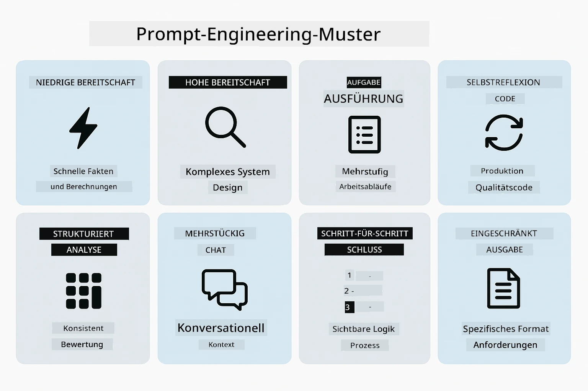
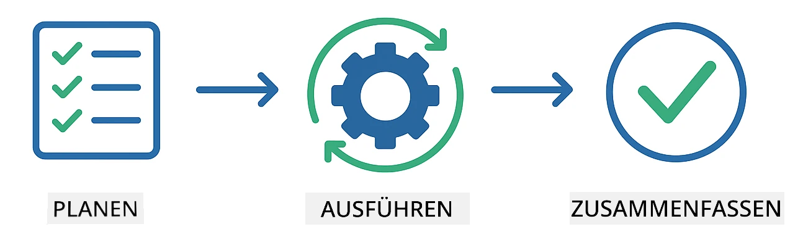
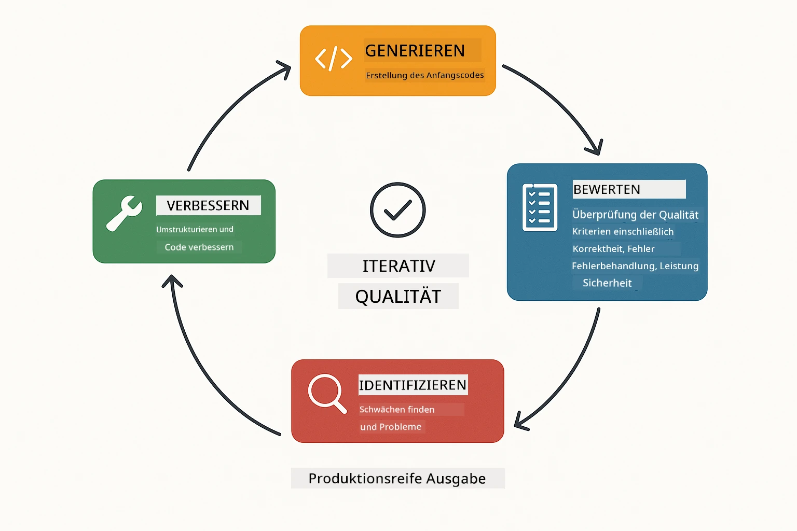
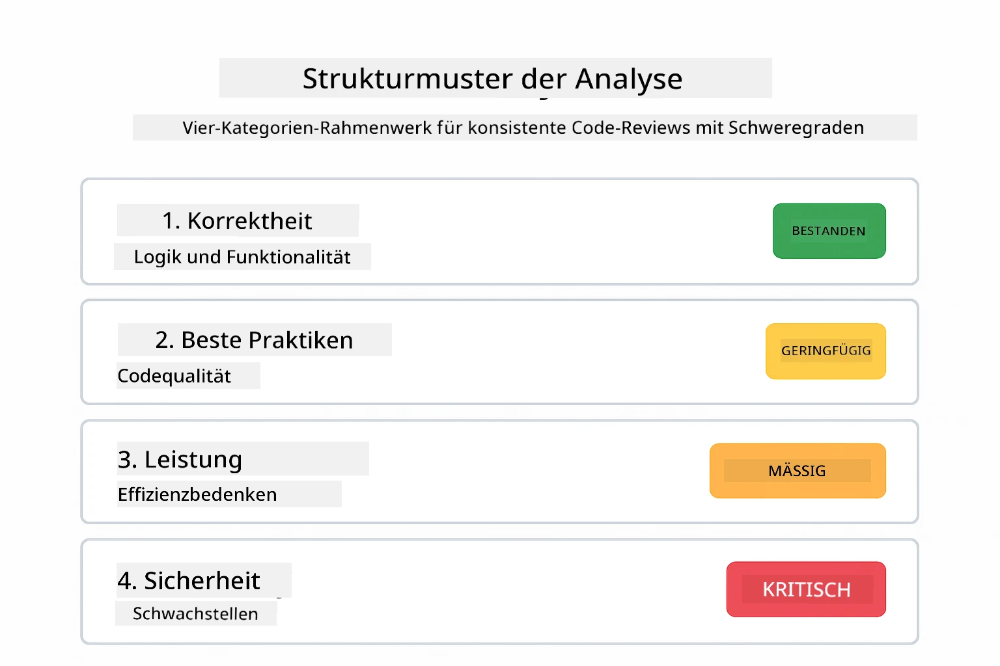
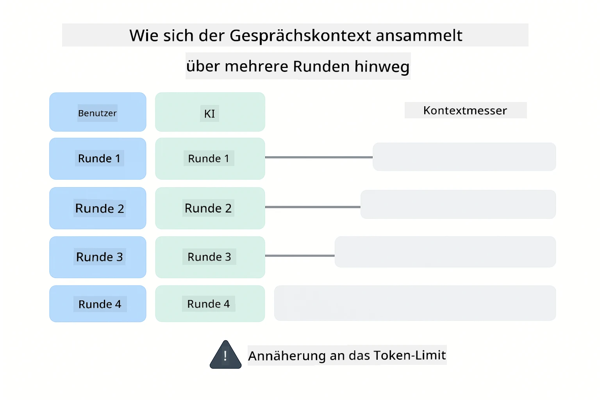
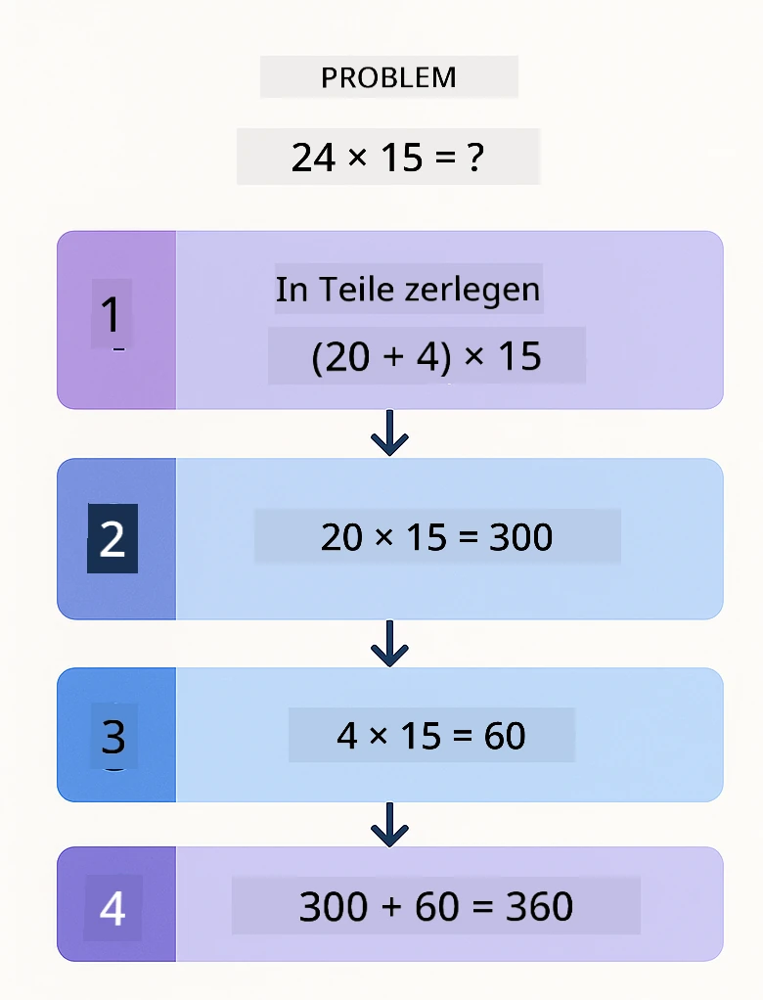
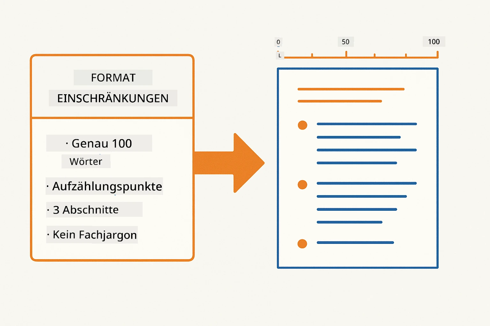
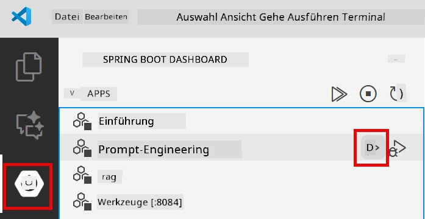
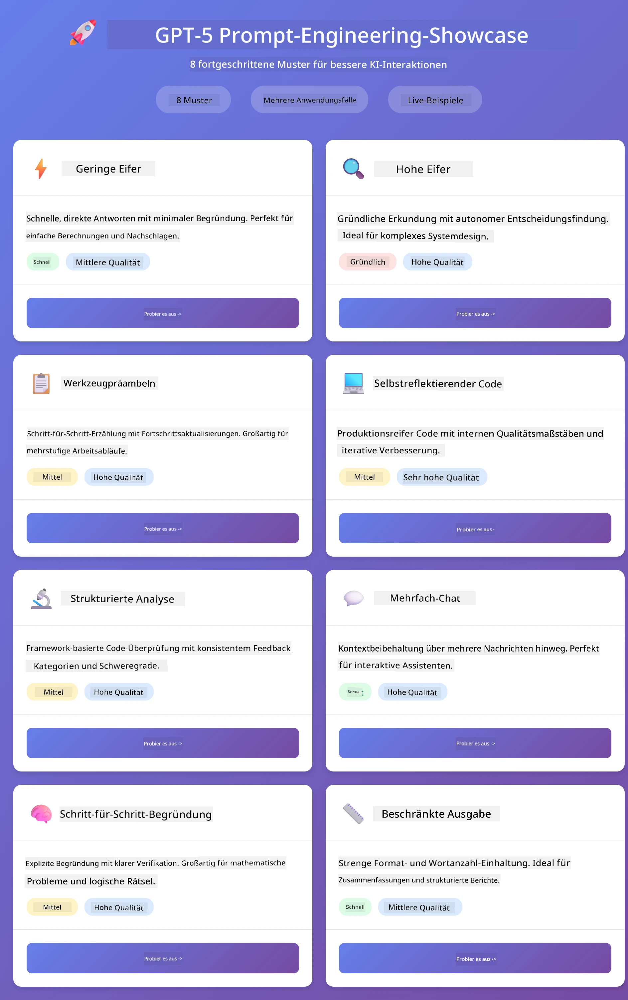
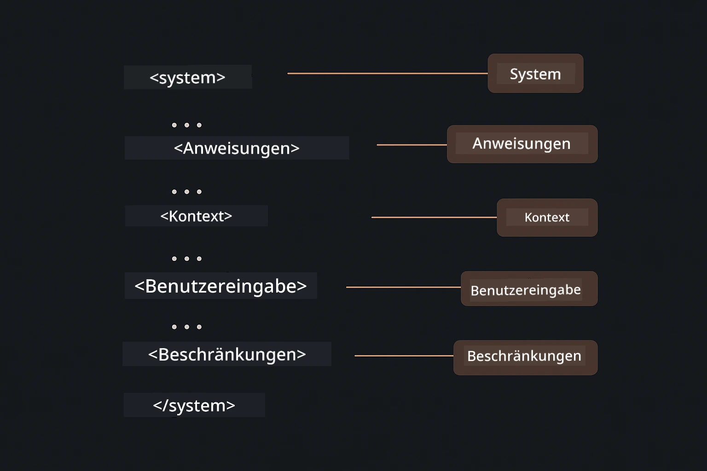

# Modul 02: Prompt Engineering mit GPT-5.2

## Inhaltsverzeichnis

- [Video-Durchgang](#video-durchgang)
- [Was Sie lernen werden](#was-sie-lernen-werden)
- [Voraussetzungen](#voraussetzungen)
- [Verständnis von Prompt Engineering](#verständnis-von-prompt-engineering)
- [Grundlagen des Prompt Engineering](#grundlagen-des-prompt-engineering)
  - [Zero-Shot Prompting](#zero-shot-prompting)
  - [Few-Shot Prompting](#few-shot-prompting)
  - [Chain of Thought](#chain-of-thought)
  - [Rollenbasiertes Prompting](#rollenbasiertes-prompting)
  - [Prompt-Vorlagen](#prompt-vorlagen)
- [Erweiterte Muster](#erweiterte-muster)
- [Anwendung ausführen](#anwendung-starten)
- [Anwendungsscreenshots](#anwendungsscreenshots)
- [Muster erkunden](#die-muster-erkunden)
  - [Niedrige vs hohe Eifer](#niedrige-vs-hohe-eagerness)
  - [Aufgabenausführung (Tool-Preambles)](#aufgabenausführung-werkzeugpräambeln)
  - [Selbstreflektierender Code](#selbstreflektierender-code)
  - [Strukturierte Analyse](#strukturierte-analyse)
  - [Mehrstufiger Chat](#mehrstufiger-chat)
  - [Schritt-für-Schritt-Schlussfolgerung](#schritt-für-schritt-argumentation)
  - [Beschränkte Ausgabe](#eingeschränkte-ausgabe)
- [Was Sie wirklich lernen](#was-sie-wirklich-lernen)
- [Nächste Schritte](#nächste-schritte)

## Video-Durchgang

Sehen Sie sich diese Live-Sitzung an, die erklärt, wie Sie mit diesem Modul beginnen:

<a href="https://www.youtube.com/live/PJ6aBaE6bog?si=LDshyBrTRodP-wke"></a>

## Was Sie lernen werden

Das folgende Diagramm bietet einen Überblick über die wichtigsten Themen und Fähigkeiten, die Sie in diesem Modul entwickeln werden – von Techniken zur Verfeinerung von Prompts bis zum Schritt-für-Schritt-Workflow, dem Sie folgen werden.


Im vorherigen Modul haben Sie gesehen, wie Speicher Konversations-KI mit Azure OpenAI ermöglicht. Jetzt konzentrieren wir uns darauf, wie Sie Fragen stellen – also die Prompts selbst – unter Verwendung von Azure OpenAI's GPT-5.2. Die Art, wie Sie Ihre Prompts strukturieren, beeinflusst maßgeblich die Qualität der Antworten, die Sie erhalten. Wir beginnen mit einer Überprüfung der grundlegenden Prompting-Techniken und gehen dann zu acht erweiterten Mustern über, die die Fähigkeiten von GPT-5.2 voll ausnutzen.

Wir verwenden GPT-5.2, weil es eine Steuerung des Denkprozesses einführt – Sie können dem Modell sagen, wie viel nachzudenken ist, bevor es antwortet. Das macht verschiedene Prompting-Strategien deutlicher und hilft Ihnen zu verstehen, wann Sie welche Methode einsetzen sollten.

## Voraussetzungen

- Abgeschlossenes Modul 01 (Azure OpenAI-Ressourcen bereitgestellt)
- `.env`-Datei im Stammverzeichnis mit Azure-Anmeldeinformationen (erstellt durch `azd up` in Modul 01)

> **Hinweis:** Wenn Sie Modul 01 noch nicht abgeschlossen haben, folgen Sie dort zuerst den Bereitstellungsanweisungen.

## Verständnis von Prompt Engineering

Im Kern ist Prompt Engineering der Unterschied zwischen vagen und präzisen Anweisungen, wie der folgende Vergleich zeigt.


Prompt Engineering bedeutet, Eingabetext so zu gestalten, dass Sie konsistent die Ergebnisse erhalten, die Sie benötigen. Es geht nicht nur darum, Fragen zu stellen – es geht darum, Anfragen so zu strukturieren, dass das Modell genau versteht, was Sie wollen und wie es geliefert werden soll.

Denken Sie daran wie an eine Anweisung an einen Kollegen. „Behebe den Fehler“ ist vage. „Behebe den NullPointerException in UserService.java Zeile 45 durch Hinzufügen einer Nullprüfung“ ist spezifisch. Sprachmodelle funktionieren genauso – Spezifität und Struktur sind entscheidend.

Das folgende Diagramm zeigt, wie LangChain4j in dieses Bild passt – indem es Ihre Prompt-Muster über SystemMessage und UserMessage Bausteine mit dem Modell verbindet.


LangChain4j stellt die Infrastruktur bereit – Modellverbindungen, Speicher und Nachrichtentypen – während Prompt-Muster nur sorgfältig strukturierter Text sind, den Sie durch diese Infrastruktur senden. Die wichtigsten Bausteine sind `SystemMessage` (die das Verhalten und die Rolle der KI festlegt) und `UserMessage` (die Ihre eigentliche Anfrage trägt).

## Grundlagen des Prompt Engineering

Die fünf Kerntechniken unten bilden die Grundlage für effektives Prompt Engineering. Jede behandelt einen anderen Aspekt, wie Sie mit Sprachmodellen kommunizieren.


Bevor wir zu den erweiterten Mustern dieses Moduls übergehen, sehen wir uns fünf grundlegende Prompting-Techniken an. Diese sind die Bausteine, die jeder Prompt Engineer kennen sollte.

### Zero-Shot Prompting

Der einfachste Ansatz: Geben Sie dem Modell eine direkte Anweisung ohne Beispiele. Das Modell verlässt sich vollständig auf sein Training, um die Aufgabe zu verstehen und auszuführen. Das funktioniert gut bei einfachen Anfragen, bei denen das erwartete Verhalten offensichtlich ist.


*Direkte Anweisung ohne Beispiele – das Modell leitet die Aufgabe allein aus der Anweisung ab*

```java
String prompt = "Classify this sentiment: 'I absolutely loved the movie!'";
String response = model.chat(prompt);
// Antwort: "Positiv"
```
  
**Wann zu verwenden:** Einfache Klassifikationen, direkte Fragen, Übersetzungen oder jede Aufgabe, die das Modell ohne zusätzliche Anleitung bewältigen kann.

### Few-Shot Prompting

Geben Sie Beispiele, die das Muster zeigen, dem das Modell folgen soll. Das Modell lernt das erwartete Eingabe-Ausgabe-Format anhand Ihrer Beispiele und wendet es auf neue Eingaben an. Das verbessert die Konsistenz stark bei Aufgaben, bei denen das gewünschte Format oder Verhalten nicht offensichtlich ist.


*Lernen von Beispielen – das Modell erkennt das Muster und überträgt es auf neue Eingaben*

```java
String prompt = """
    Classify the sentiment as positive, negative, or neutral.
    
    Examples:
    Text: "This product exceeded my expectations!" → Positive
    Text: "It's okay, nothing special." → Neutral
    Text: "Waste of money, very disappointed." → Negative
    
    Now classify this:
    Text: "Best purchase I've made all year!"
    """;
String response = model.chat(prompt);
```
  
**Wann zu verwenden:** Maßgeschneiderte Klassifikationen, konsistente Formatierung, domänenspezifische Aufgaben oder wenn Zero-Shot-Ergebnisse inkonsistent sind.

### Chain of Thought

Fordern Sie das Modell auf, seinen Denkprozess Schritt für Schritt zu zeigen. Statt sofort eine Antwort zu geben, zerlegt das Modell das Problem und arbeitet jede Teilaufgabe explizit ab. Das erhöht die Genauigkeit bei mathematischen, logischen und mehrstufigen Denkaufgaben.


*Schritt-für-Schritt-Schlussfolgerung – komplexe Probleme in explizite logische Schritte zerlegen*

```java
String prompt = """
    Problem: A store has 15 apples. They sell 8 apples and then 
    receive a shipment of 12 more apples. How many apples do they have now?
    
    Let's solve this step-by-step:
    """;
String response = model.chat(prompt);
// Das Modell zeigt: 15 - 8 = 7, dann 7 + 12 = 19 Äpfel
```
  
**Wann zu verwenden:** Mathematische Probleme, Logikrätsel, Debugging oder jede Aufgabe, bei der das Zeigen des Denkprozesses Genauigkeit und Vertrauen erhöht.

### Rollenbasiertes Prompting

Weisen Sie der KI vor der Fragestellung eine Persona oder Rolle zu. Das liefert Kontext, der Ton, Tiefe und Fokus der Antwort prägt. Ein „Softwarearchitekt“ gibt andere Ratschläge als ein „Junior-Entwickler“ oder ein „Sicherheitsauditor“.


*Festlegung von Kontext und Persona – dieselbe Frage erhält je nach zugewiesener Rolle unterschiedliche Antworten*

```java
String prompt = """
    You are an experienced software architect reviewing code.
    Provide a brief code review for this function:
    
    def calculate_total(items):
        total = 0
        for item in items:
            total = total + item['price']
        return total
    """;
String response = model.chat(prompt);
```
  
**Wann zu verwenden:** Code-Reviews, Nachhilfe, domänenspezifische Analysen oder wenn Sie Antworten brauchen, die auf ein bestimmtes Fachwissen oder eine Perspektive zugeschnitten sind.

### Prompt-Vorlagen

Erstellen Sie wiederverwendbare Prompts mit variablen Platzhaltern. Anstatt jedes Mal einen neuen Prompt zu schreiben, definieren Sie einmal eine Vorlage und füllen verschiedene Werte ein. Die `PromptTemplate` Klasse von LangChain4j macht das mit der Syntax `{{variable}}` einfach.


*Wiederverwendbare Prompts mit variablen Platzhaltern – eine Vorlage, viele Anwendungen*

```java
PromptTemplate template = PromptTemplate.from(
    "What's the best time to visit {{destination}} for {{activity}}?"
);

Prompt prompt = template.apply(Map.of(
    "destination", "Paris",
    "activity", "sightseeing"
));

String response = model.chat(prompt.text());
```
  
**Wann zu verwenden:** Wiederholte Abfragen mit unterschiedlichen Eingaben, Batch-Verarbeitung, Aufbau wiederverwendbarer KI-Workflows oder jede Situation, in der die Prompt-Struktur gleich bleibt, sich aber die Daten ändern.

---

Diese fünf Grundlagen geben Ihnen einen soliden Werkzeugkasten für die meisten Prompting-Aufgaben. Der Rest dieses Moduls baut darauf mit **acht erweiterten Mustern** auf, die GPT-5.2s Steuerung des Denkprozesses, Selbstevaluation und strukturierte Ausgaben nutzen.

## Erweiterte Muster

Nachdem die Grundlagen abgedeckt sind, kommen wir zu den acht erweiterten Mustern, die dieses Modul einzigartig machen. Nicht alle Probleme benötigen den gleichen Ansatz. Manche Fragen brauchen schnelle Antworten, andere tiefes Nachdenken. Einige brauchen sichtbare Überlegungen, andere nur Ergebnisse. Jedes Muster unten ist für ein anderes Szenario optimiert – und GPT-5.2s Steuerung der Denkprozesse macht die Unterschiede noch deutlicher.



*Übersicht der acht Prompt-Engineering-Muster und deren Anwendungsfälle*

GPT-5.2 fügt diesen Mustern noch eine Dimension hinzu: *Steuerung des Denkprozesses*. Der Slider unten zeigt, wie Sie den Denkaufwand des Modells anpassen können – von schnellen direkten Antworten bis zu tiefgehender Analyse.


*Mit der Steuerung des Denkprozesses von GPT-5.2 können Sie festlegen, wie viel das Modell denken soll – von schnellen direkten Antworten bis zur tiefgehenden Erkundung*

**Niedriger Eifer (Schnell & Fokussiert)** – Für einfache Fragen, bei denen Sie schnelle, direkte Antworten wollen. Das Modell denkt minimal – maximal 2 Schritte. Nutzen Sie das für Berechnungen, Abfragen oder einfache Fragen.

```java
String prompt = """
    <context_gathering>
    - Search depth: very low
    - Bias strongly towards providing a correct answer as quickly as possible
    - Usually, this means an absolute maximum of 2 reasoning steps
    - If you think you need more time, state what you know and what's uncertain
    </context_gathering>
    
    Problem: What is 15% of 200?
    
    Provide your answer:
    """;

String response = chatModel.chat(prompt);
```
  
> 💡 **Mit GitHub Copilot erkunden:** Öffnen Sie [`Gpt5PromptService.java`](../../../02-prompt-engineering/src/main/java/com/example/langchain4j/prompts/service/Gpt5PromptService.java) und fragen Sie:  
> - „Was ist der Unterschied zwischen low eagerness und high eagerness Prompting-Mustern?“  
> - „Wie helfen XML-Tags in Prompts, die Antwort der KI zu strukturieren?“  
> - „Wann sollte ich Selbstreflexionsmuster statt direkter Anweisungen verwenden?“

**Hoher Eifer (Tief & Gründlich)** – Für komplexe Probleme, bei denen Sie eine umfassende Analyse möchten. Das Modell arbeitet gründlich, zeigt detailliertes Nachdenken. Verwenden Sie das für Systemdesign, Architekturentscheidungen oder komplexe Forschungsarbeiten.

```java
String prompt = """
    Analyze this problem thoroughly and provide a comprehensive solution.
    Consider multiple approaches, trade-offs, and important details.
    Show your analysis and reasoning in your response.
    
    Problem: Design a caching strategy for a high-traffic REST API.
    """;

String response = chatModel.chat(prompt);
```
  
**Aufgabenausführung (Fortschritt Schritt für Schritt)** – Für mehrstufige Workflows. Das Modell gibt einen Plan im Voraus, beschreibt jeden Schritt beim Arbeiten und liefert dann eine Zusammenfassung. Nutzen Sie das für Migrationen, Implementierungen oder jeden mehrstufigen Prozess.

```java
String prompt = """
    <task_execution>
    1. First, briefly restate the user's goal in a friendly way
    
    2. Create a step-by-step plan:
       - List all steps needed
       - Identify potential challenges
       - Outline success criteria
    
    3. Execute each step:
       - Narrate what you're doing
       - Show progress clearly
       - Handle any issues that arise
    
    4. Summarize:
       - What was completed
       - Any important notes
       - Next steps if applicable
    </task_execution>
    
    <tool_preambles>
    - Always begin by rephrasing the user's goal clearly
    - Outline your plan before executing
    - Narrate each step as you go
    - Finish with a distinct summary
    </tool_preambles>
    
    Task: Create a REST endpoint for user registration
    
    Begin execution:
    """;

String response = chatModel.chat(prompt);
```
  
Chain-of-Thought Prompting fordert das Modell explizit auf, seinen Denkprozess zu zeigen, was die Genauigkeit bei komplexen Aufgaben verbessert. Die Schritt-für-Schritt-Zerlegung hilft sowohl Menschen als auch KI, die Logik zu verstehen.

> **🤖 Probieren Sie es mit [GitHub Copilot](https://github.com/features/copilot) Chat:** Fragen Sie zu diesem Muster:  
> - „Wie würde ich das Aufgabenausführungsmuster für lang laufende Operationen anpassen?“  
> - „Was sind Best Practices zur Strukturierung von Tool-Preambles in produktiven Anwendungen?“  
> - „Wie kann ich Zwischenfortschrittsupdates in einer UI erfassen und anzeigen?“

Das folgende Diagramm veranschaulicht diesen Plan → Ausführen → Zusammenfassen-Workflow.



*Plan → Ausführen → Zusammenfassen-Workflow für mehrstufige Aufgaben*

**Selbstreflektierender Code** – Für die Generierung von produktionsreifem Code. Das Modell erzeugt Code gemäß Produktionsstandards mit ordentlicher Fehlerbehandlung. Verwenden Sie das bei der Erstellung neuer Features oder Dienste.

```java
String prompt = """
    Generate Java code with production-quality standards: Create an email validation service
    Keep it simple and include basic error handling.
    """;

String response = chatModel.chat(prompt);
```
  
Das folgende Diagramm zeigt die iterative Verbesserungsschleife – generieren, bewerten, Schwachstellen identifizieren und verfeinern, bis der Code Produktionsstandards erfüllt.



*Iterative Verbesserungsschleife – generieren, bewerten, Probleme identifizieren, verbessern, wiederholen*

**Strukturierte Analyse** – Für konsistente Bewertungen. Das Modell überprüft Code anhand eines festen Rahmens (Korrektheit, Praktiken, Leistung, Sicherheit, Wartbarkeit). Verwenden Sie das für Code-Reviews oder Qualitätsbewertungen.

```java
String prompt = """
    <analysis_framework>
    You are an expert code reviewer. Analyze the code for:
    
    1. Correctness
       - Does it work as intended?
       - Are there logical errors?
    
    2. Best Practices
       - Follows language conventions?
       - Appropriate design patterns?
    
    3. Performance
       - Any inefficiencies?
       - Scalability concerns?
    
    4. Security
       - Potential vulnerabilities?
       - Input validation?
    
    5. Maintainability
       - Code clarity?
       - Documentation?
    
    <output_format>
    Provide your analysis in this structure:
    - Summary: One-sentence overall assessment
    - Strengths: 2-3 positive points
    - Issues: List any problems found with severity (High/Medium/Low)
    - Recommendations: Specific improvements
    </output_format>
    </analysis_framework>
    
    Code to analyze:
    ```
    public List getUsers() {
        return database.query("SELECT * FROM users");
    }
    ```
    Provide your structured analysis:
    """;

String response = chatModel.chat(prompt);
```
  
> **🤖 Probieren Sie es mit [GitHub Copilot](https://github.com/features/copilot) Chat:** Fragen Sie zur strukturierten Analyse:  
> - „Wie kann ich das Analyse-Framework für verschiedene Arten von Code-Reviews anpassen?“  
> - „Wie ist der beste Weg, um strukturierte Ausgaben programmatisch zu parsen und zu verarbeiten?“  
> - „Wie stelle ich konsistente Schweregrade über unterschiedliche Review-Sitzungen sicher?“

Das folgende Diagramm zeigt, wie dieses strukturierte Framework eine Code-Review in konsistente Kategorien mit Schweregraden gliedert.



*Framework für konsistente Code-Reviews mit Schweregrad-Leveln*

**Mehrstufiger Chat** – Für Unterhaltungen, die Kontext brauchen. Das Modell erinnert sich an frühere Nachrichten und baut darauf auf. Verwenden Sie das für interaktive Hilfesitzungen oder komplexes Q&A.

```java
ChatMemory memory = MessageWindowChatMemory.withMaxMessages(10);

memory.add(UserMessage.from("What is Spring Boot?"));
AiMessage aiMessage1 = chatModel.chat(memory.messages()).aiMessage();
memory.add(aiMessage1);

memory.add(UserMessage.from("Show me an example"));
AiMessage aiMessage2 = chatModel.chat(memory.messages()).aiMessage();
memory.add(aiMessage2);
```
  
Das folgende Diagramm visualisiert, wie sich der Gesprächskontext über mehrere Runden ansammelt und wie das mit dem Token-Limit des Modells zusammenhängt.



*Wie sich der Gesprächskontext über mehrere Runden ansammelt, bis das Token-Limit erreicht ist*

**Schritt-für-Schritt-Schlussfolgerung** – Für Probleme, die sichtbare Logik erfordern. Das Modell zeigt für jeden Schritt explizite Überlegungen. Verwenden Sie das für mathematische Probleme, Logikrätsel oder wenn Sie den Denkprozess verstehen möchten.

```java
String prompt = """
    <instruction>Show your reasoning step-by-step</instruction>
    
    If a train travels 120 km in 2 hours, then stops for 30 minutes,
    then travels another 90 km in 1.5 hours, what is the average speed
    for the entire journey including the stop?
    """;

String response = chatModel.chat(prompt);
```
  
Das folgende Diagramm zeigt, wie das Modell Probleme in explizite, nummerierte logische Schritte zerlegt.


*Probleme in explizite logische Schritte zerlegen*

**Eingeschränkte Ausgabe** – Für Antworten mit spezifischen Formatvorgaben. Das Modell hält sich strikt an Format- und Längenregeln. Verwenden Sie dies für Zusammenfassungen oder wenn Sie eine präzise Ausgabestruktur benötigen.

```java
String prompt = """
    <constraints>
    - Exactly 100 words
    - Bullet point format
    - Technical terms only
    </constraints>
    
    Summarize the key concepts of machine learning.
    """;

String response = chatModel.chat(prompt);
```
  
Das folgende Diagramm zeigt, wie Einschränkungen das Modell anleiten, Ausgaben zu erzeugen, die genau Ihren Format- und Längenvorgaben entsprechen.



*Spezifische Format-, Längen- und Strukturvorgaben erzwingen*

## Anwendung starten

**Bereitstellung überprüfen:**

Stellen Sie sicher, dass die `.env`-Datei im Stammverzeichnis mit Azure-Anmeldedaten vorhanden ist (erstellt während Modul 01). Führen Sie dies aus dem Modulverzeichnis (`02-prompt-engineering/`) aus:

**Bash:**  
```bash
cat ../.env  # Sollte AZURE_OPENAI_ENDPOINT, API_KEY, DEPLOYMENT anzeigen
```
  
**PowerShell:**  
```powershell
Get-Content ..\.env  # Sollte AZURE_OPENAI_ENDPOINT, API_KEY, DEPLOYMENT anzeigen
```
  
**Starten Sie die Anwendung:**

> **Hinweis:** Wenn Sie bereits alle Anwendungen mit `./start-all.sh` aus dem Stammverzeichnis gestartet haben (wie in Modul 01 beschrieben), läuft dieses Modul bereits auf Port 8083. Sie können die untenstehenden Startbefehle überspringen und direkt zu http://localhost:8083 gehen.

**Option 1: Nutzung des Spring Boot Dashboards (Empfohlen für VS Code Nutzer)**

Der Dev-Container enthält die Spring Boot Dashboard-Erweiterung, die eine visuelle Schnittstelle zum Verwalten aller Spring Boot Anwendungen bietet. Sie finden sie in der Aktivitätsleiste auf der linken Seite von VS Code (suchen Sie nach dem Spring Boot Symbol).

Im Spring Boot Dashboard können Sie:  
- Alle verfügbaren Spring Boot Anwendungen im Workspace sehen  
- Anwendungen mit einem Klick starten oder stoppen  
- Anwendungsprotokolle in Echtzeit ansehen  
- Den Anwendungsstatus überwachen

Klicken Sie einfach auf die Wiedergabetaste neben "prompt-engineering", um dieses Modul zu starten, oder starten Sie alle Module gleichzeitig.



*Das Spring Boot Dashboard in VS Code – starten, stoppen und überwachen Sie alle Module von einem Ort aus*

**Option 2: Nutzung von Shell-Skripten**

Starten Sie alle Webanwendungen (Module 01-04):

**Bash:**  
```bash
cd ..  # Vom Stammverzeichnis
./start-all.sh
```
  
**PowerShell:**  
```powershell
cd ..  # Vom Stammverzeichnis
.\start-all.ps1
```
  
Oder starten Sie nur dieses Modul:

**Bash:**  
```bash
cd 02-prompt-engineering
./start.sh
```
  
**PowerShell:**  
```powershell
cd 02-prompt-engineering
.\start.ps1
```
  
Beide Skripte laden automatisch Umgebungsvariablen aus der `.env`-Datei im Stammverzeichnis und bauen die JAR-Dateien, falls sie nicht existieren.

> **Hinweis:** Wenn Sie alle Module lieber manuell bauen möchten, bevor Sie starten:
>
> **Bash:**  
> ```bash
> cd ..  # Go to root directory
> mvn clean package -DskipTests
> ```
  
> **PowerShell:**  
> ```powershell
> cd ..  # Go to root directory
> mvn clean package -DskipTests
> ```
  
Öffnen Sie http://localhost:8083 in Ihrem Browser.

**Zum Stoppen:**

**Bash:**  
```bash
./stop.sh  # Nur dieses Modul
# Oder
cd .. && ./stop-all.sh  # Alle Module
```
  
**PowerShell:**  
```powershell
.\stop.ps1  # Nur dieses Modul
# Oder
cd ..; .\stop-all.ps1  # Alle Module
```
  
## Anwendungsscreenshots

Hier sehen Sie die Hauptoberfläche des Prompt Engineering Moduls, in dem Sie alle acht Muster nebeneinander ausprobieren können.



*Das Hauptdashboard zeigt alle 8 Prompt Engineering Muster mit deren Merkmalen und Anwendungsfällen*

## Die Muster erkunden

Die Weboberfläche ermöglicht Ihnen das Experimentieren mit verschiedenen Prompt-Strategien. Jedes Muster löst unterschiedliche Probleme – probieren Sie aus, wann welcher Ansatz glänzt.

> **Hinweis: Streaming vs. Nicht-Streaming** – Auf jeder Musterseite gibt es zwei Buttons: **🔴 Stream Response (Live)** und eine **Nicht-Streaming**-Option. Streaming nutzt Server-Sent Events (SSE), um Token in Echtzeit anzuzeigen, während das Modell sie generiert, sodass Sie den Fortschritt sofort sehen. Die Nicht-Streaming-Option wartet auf die vollständige Antwort, bevor sie angezeigt wird. Für Prompts, die tiefgründiges Denken erfordern (z.B. High Eagerness, Self-Reflecting Code), kann der Nicht-Streaming-Aufruf sehr lange dauern – manchmal Minuten – ohne sichtbares Feedback. **Verwenden Sie Streaming beim Experimentieren mit komplexen Prompts**, damit Sie das Modell arbeiten sehen und den Eindruck eines Timeouts vermeiden.  
>
> **Hinweis: Browseranforderung** – Die Streaming-Funktion nutzt die Fetch Streams API (`response.body.getReader()`), die einen vollständigen Browser erfordert (Chrome, Edge, Firefox, Safari). Sie funktioniert **nicht** im eingebauten Simple Browser von VS Code, da dessen Webview die ReadableStream API nicht unterstützt. Im Simple Browser funktionieren die Nicht-Streaming-Buttons normal – nur die Streaming-Buttons sind betroffen. Öffnen Sie http://localhost:8083 in einem externen Browser für das volle Erlebnis.

### Niedrige vs. hohe Eagerness

Stellen Sie eine einfache Frage wie „Was sind 15 % von 200?“ mit niedriger Eagerness. Sie erhalten eine sofortige, direkte Antwort. Nun fragen Sie etwas Komplexes wie „Entwerfen Sie eine Caching-Strategie für eine stark frequentierte API“ mit hoher Eagerness. Klicken Sie auf **🔴 Stream Response (Live)** und beobachten Sie, wie das Modell detaillierte Überlegungen Token für Token anzeigt. Dasselbe Modell, dieselbe Fragenstruktur – aber der Prompt sagt ihm, wie viel Denken es anstellen soll.

### Aufgabenausführung (Werkzeugpräambeln)

Mehrstufige Workflows profitieren von einer vorausgehenden Planung und Fortschrittserzählung. Das Modell skizziert, was es tun wird, erläutert jeden Schritt und fasst das Ergebnis zusammen.

### Selbstreflektierender Code

Probieren Sie „Erstelle einen Service zur E-Mail-Validierung“. Anstatt nur Code zu erzeugen und zu stoppen, generiert das Modell, bewertet ihn anhand von Qualitätskriterien, identifiziert Schwachstellen und verbessert ihn. Sie sehen, wie es iteriert, bis der Code Produktionsstandards erfüllt.

### Strukturierte Analyse

Code Reviews benötigen konsistente Bewertungsrahmen. Das Modell analysiert Code nach festen Kategorien (Korrektheit, Praktiken, Performance, Sicherheit) mit Schweregraden.

### Mehrstufiger Chat

Fragen Sie „Was ist Spring Boot?“ und anschließend „Zeig mir ein Beispiel“. Das Modell erinnert sich an Ihre erste Frage und liefert ein spezielles Spring Boot-Beispiel. Ohne Gedächtnis wäre die zweite Frage zu vage.

### Schritt-für-Schritt-Argumentation

Wählen Sie ein Matheproblem und probieren Sie es mit Schritt-für-Schritt-Argumentation und niedriger Eagerness. Niedrige Eagerness gibt die Antwort schnell, aber undurchsichtig. Schritt-für-Schritt zeigt jede Berechnung und Entscheidung.

### Eingeschränkte Ausgabe

Wenn Sie spezifische Formate oder Wortzahlen benötigen, sorgt dieses Muster für strikte Einhaltung. Versuchen Sie, eine Zusammenfassung mit genau 100 Wörtern in Aufzählungsformat zu erzeugen.

## Was Sie wirklich lernen

**Argumentationsaufwand ändert alles**

GPT-5.2 ermöglicht es Ihnen, den Rechenaufwand über Ihre Prompts zu steuern. Niedriger Aufwand bedeutet schnelle Antworten mit minimaler Exploration. Hoher Aufwand bedeutet, dass das Modell sich Zeit nimmt, tief zu denken. Sie lernen, den Aufwand an die Komplexität der Aufgabe anzupassen – verschwenden Sie keine Zeit mit einfachen Fragen, aber überstürzen Sie auch keine komplexen Entscheidungen.

**Struktur steuert Verhalten**

Fallen Ihnen die XML-Tags in den Prompts auf? Sie sind nicht dekorativ. Modelle folgen strukturierten Anweisungen zuverlässiger als Freitext. Wenn Sie mehrstufige Prozesse oder komplexe Logik benötigen, hilft Struktur dem Modell, den aktuellen Schritt und das Kommende zu verfolgen. Das folgende Diagramm zerlegt einen gut strukturierten Prompt und zeigt, wie Tags wie `<system>`, `<instructions>`, `<context>`, `<user-input>` und `<constraints>` Ihre Anweisungen in klare Abschnitte gliedern.



*Anatomie eines gut strukturierten Prompts mit klaren Abschnitten und XML-ähnlicher Organisation*

**Qualität durch Selbstevaluation**

Die selbstreflektierenden Muster arbeiten, indem Qualitätskriterien explizit gemacht werden. Statt zu hoffen, dass das Modell „es richtig macht“, sagen Sie ihm genau, was „richtig“ bedeutet: korrekte Logik, Fehlerbehandlung, Performance, Sicherheit. Das Modell kann dann seine eigene Ausgabe bewerten und verbessern. Das verwandelt Codeerstellung von einem Glücksspiel in einen Prozess.

**Kontext ist begrenzt**

Mehrstufige Gespräche funktionieren, indem Sie den Nachrichtenverlauf jeder Anfrage mitsenden. Aber es gibt eine Grenze – jedes Modell hat eine maximale Tokenanzahl. Wenn Gespräche wachsen, brauchen Sie Strategien, um relevanten Kontext zu behalten, ohne die Grenze zu überschreiten. Dieses Modul zeigt, wie Gedächtnis funktioniert; später lernen Sie, wann Sie zusammenfassen, vergessen oder abrufen sollen.

## Nächste Schritte

**Nächstes Modul:** [03-rag - RAG (Retrieval-Augmented Generation)](../03-rag/README.md)

---

**Navigation:** [← Vorheriges: Modul 01 – Einführung](../01-introduction/README.md) | [Zurück zum Hauptbereich](../README.md) | [Nächstes: Modul 03 – RAG →](../03-rag/README.md)

---

<!-- CO-OP TRANSLATOR DISCLAIMER START -->
**Haftungsausschluss**:
Dieses Dokument wurde mit dem KI-Übersetzungsdienst [Co-op Translator](https://github.com/Azure/co-op-translator) übersetzt. Obwohl wir uns um Genauigkeit bemühen, beachten Sie bitte, dass automatisierte Übersetzungen Fehler oder Ungenauigkeiten enthalten können. Das Originaldokument in seiner Ursprungssprache gilt als maßgebliche Quelle. Bei kritischen Informationen wird eine professionelle menschliche Übersetzung empfohlen. Wir übernehmen keine Haftung für Missverständnisse oder Fehlinterpretationen, die aus der Verwendung dieser Übersetzung entstehen.
<!-- CO-OP TRANSLATOR DISCLAIMER END -->