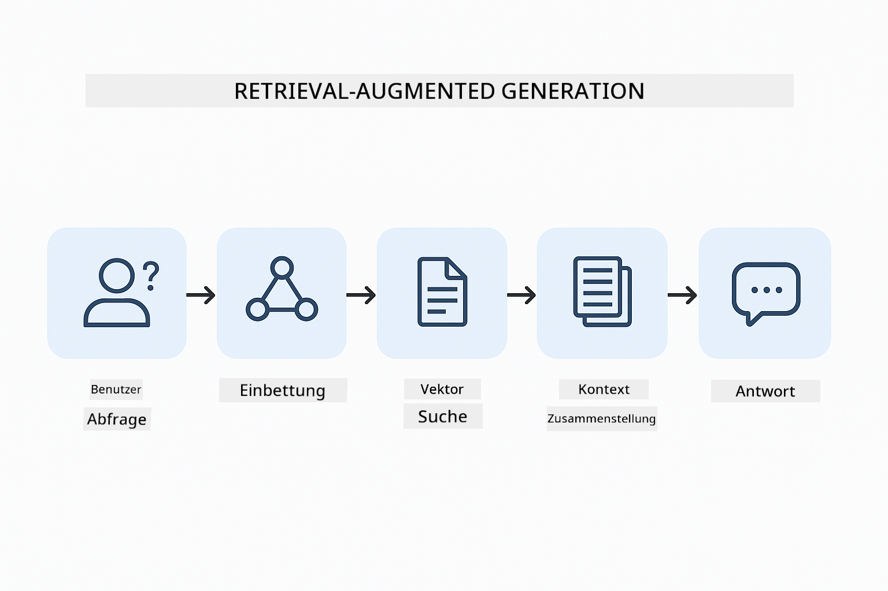
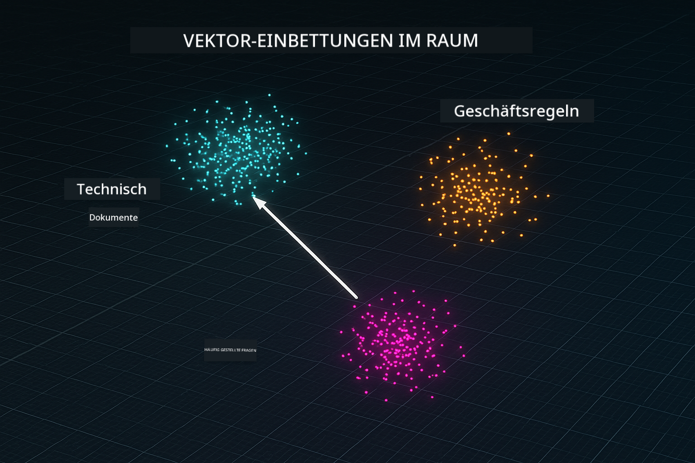
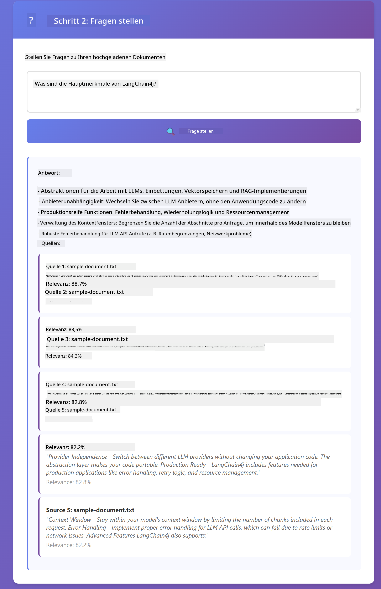

<!--
CO_OP_TRANSLATOR_METADATA:
{
  "original_hash": "f538a51cfd13147d40d84e936a0f485c",
  "translation_date": "2025-12-13T16:43:23+00:00",
  "source_file": "03-rag/README.md",
  "language_code": "de"
}
-->
# Modul 03: RAG (Retrieval-Augmented Generation)

## Inhaltsverzeichnis

- [Was Sie lernen werden](../../../03-rag)
- [Voraussetzungen](../../../03-rag)
- [Verständnis von RAG](../../../03-rag)
- [Wie es funktioniert](../../../03-rag)
  - [Dokumentenverarbeitung](../../../03-rag)
  - [Erstellung von Embeddings](../../../03-rag)
  - [Semantische Suche](../../../03-rag)
  - [Antwortgenerierung](../../../03-rag)
- [Anwendung starten](../../../03-rag)
- [Anwendung verwenden](../../../03-rag)
  - [Dokument hochladen](../../../03-rag)
  - [Fragen stellen](../../../03-rag)
  - [Quellenangaben prüfen](../../../03-rag)
  - [Mit Fragen experimentieren](../../../03-rag)
- [Wichtige Konzepte](../../../03-rag)
  - [Chunking-Strategie](../../../03-rag)
  - [Ähnlichkeitsscores](../../../03-rag)
  - [In-Memory-Speicherung](../../../03-rag)
  - [Verwaltung des Kontextfensters](../../../03-rag)
- [Wann RAG wichtig ist](../../../03-rag)
- [Nächste Schritte](../../../03-rag)

## Was Sie lernen werden

In den vorherigen Modulen haben Sie gelernt, wie man Gespräche mit KI führt und Ihre Prompts effektiv strukturiert. Aber es gibt eine grundlegende Einschränkung: Sprachmodelle wissen nur, was sie während des Trainings gelernt haben. Sie können keine Fragen zu den Richtlinien Ihres Unternehmens, Ihrer Projektdokumentation oder zu Informationen beantworten, auf die sie nicht trainiert wurden.

RAG (Retrieval-Augmented Generation) löst dieses Problem. Anstatt zu versuchen, dem Modell Ihre Informationen beizubringen (was teuer und unpraktisch ist), geben Sie ihm die Fähigkeit, in Ihren Dokumenten zu suchen. Wenn jemand eine Frage stellt, findet das System relevante Informationen und fügt sie in den Prompt ein. Das Modell antwortet dann basierend auf diesem abgerufenen Kontext.

Man kann sich RAG vorstellen wie eine Referenzbibliothek für das Modell. Wenn Sie eine Frage stellen, macht das System:

1. **Benutzeranfrage** – Sie stellen eine Frage
2. **Embedding** – Wandelt Ihre Frage in einen Vektor um
3. **Vektorsuche** – Findet ähnliche Dokumentenabschnitte
4. **Kontextzusammenstellung** – Fügt relevante Abschnitte dem Prompt hinzu
5. **Antwort** – LLM generiert eine Antwort basierend auf dem Kontext

Dies verankert die Antworten des Modells in Ihren tatsächlichen Daten, anstatt sich auf das Trainingswissen zu verlassen oder Antworten zu erfinden.



*RAG-Workflow – von der Benutzeranfrage über die semantische Suche bis zur kontextuellen Antwortgenerierung*

## Voraussetzungen

- Abgeschlossenes Modul 01 (Azure OpenAI-Ressourcen bereitgestellt)
- `.env`-Datei im Stammverzeichnis mit Azure-Zugangsdaten (erstellt durch `azd up` in Modul 01)

> **Hinweis:** Wenn Sie Modul 01 noch nicht abgeschlossen haben, folgen Sie dort zuerst den Bereitstellungsanweisungen.

## Wie es funktioniert

**Dokumentenverarbeitung** – [DocumentService.java](../../../03-rag/src/main/java/com/example/langchain4j/rag/service/DocumentService.java)

Wenn Sie ein Dokument hochladen, zerlegt das System es in Chunks – kleinere Stücke, die bequem in das Kontextfenster des Modells passen. Diese Chunks überlappen sich leicht, damit am Rand kein Kontext verloren geht.

```java
Document document = FileSystemDocumentLoader.loadDocument("sample-document.txt");

DocumentSplitter splitter = DocumentSplitters
    .recursive(300, 30, new OpenAiTokenizer());

List<TextSegment> segments = splitter.split(document);
```

> **🤖 Probieren Sie es mit [GitHub Copilot](https://github.com/features/copilot) Chat:** Öffnen Sie [`DocumentService.java`](../../../03-rag/src/main/java/com/example/langchain4j/rag/service/DocumentService.java) und fragen Sie:
> - "Wie teilt LangChain4j Dokumente in Chunks auf und warum ist Überlappung wichtig?"
> - "Was ist die optimale Chunk-Größe für verschiedene Dokumenttypen und warum?"
> - "Wie gehe ich mit Dokumenten in mehreren Sprachen oder mit spezieller Formatierung um?"

**Erstellung von Embeddings** – [LangChainRagConfig.java](../../../03-rag/src/main/java/com/example/langchain4j/rag/config/LangChainRagConfig.java)

Jeder Chunk wird in eine numerische Darstellung namens Embedding umgewandelt – im Wesentlichen ein mathematischer Fingerabdruck, der die Bedeutung des Textes erfasst. Ähnliche Texte erzeugen ähnliche Embeddings.

```java
@Bean
public EmbeddingModel embeddingModel() {
    return OpenAiOfficialEmbeddingModel.builder()
        .baseUrl(azureOpenAiEndpoint)
        .apiKey(azureOpenAiKey)
        .modelName(azureEmbeddingDeploymentName)
        .build();
}

EmbeddingStore<TextSegment> embeddingStore = 
    new InMemoryEmbeddingStore<>();
```



*Dokumente als Vektoren im Embedding-Raum dargestellt – ähnliche Inhalte gruppieren sich*

**Semantische Suche** – [RagService.java](../../../03-rag/src/main/java/com/example/langchain4j/rag/service/RagService.java)

Wenn Sie eine Frage stellen, wird auch Ihre Frage in ein Embedding umgewandelt. Das System vergleicht das Embedding Ihrer Frage mit allen Embeddings der Dokumentenabschnitte. Es findet die Abschnitte mit der größten semantischen Ähnlichkeit – nicht nur passende Schlüsselwörter, sondern tatsächliche Bedeutungsähnlichkeit.

```java
Embedding queryEmbedding = embeddingModel.embed(question).content();

List<EmbeddingMatch<TextSegment>> matches = 
    embeddingStore.findRelevant(queryEmbedding, 5, 0.7);

for (EmbeddingMatch<TextSegment> match : matches) {
    String relevantText = match.embedded().text();
    double score = match.score();
}
```

> **🤖 Probieren Sie es mit [GitHub Copilot](https://github.com/features/copilot) Chat:** Öffnen Sie [`RagService.java`](../../../03-rag/src/main/java/com/example/langchain4j/rag/service/RagService.java) und fragen Sie:
> - "Wie funktioniert die Ähnlichkeitssuche mit Embeddings und was bestimmt den Score?"
> - "Welchen Ähnlichkeitsschwellenwert sollte ich verwenden und wie beeinflusst er die Ergebnisse?"
> - "Wie gehe ich mit Fällen um, in denen keine relevanten Dokumente gefunden werden?"

**Antwortgenerierung** – [RagService.java](../../../03-rag/src/main/java/com/example/langchain4j/rag/service/RagService.java)

Die relevantesten Chunks werden in den Prompt an das Modell aufgenommen. Das Modell liest diese spezifischen Abschnitte und beantwortet Ihre Frage basierend auf diesen Informationen. Dies verhindert Halluzinationen – das Modell kann nur aus dem antworten, was vorliegt.

## Anwendung starten

**Bereitstellung überprüfen:**

Stellen Sie sicher, dass die `.env`-Datei im Stammverzeichnis mit Azure-Zugangsdaten existiert (wurde während Modul 01 erstellt):
```bash
cat ../.env  # Sollte AZURE_OPENAI_ENDPOINT, API_KEY, DEPLOYMENT anzeigen
```

**Anwendung starten:**

> **Hinweis:** Wenn Sie bereits alle Anwendungen mit `./start-all.sh` aus Modul 01 gestartet haben, läuft dieses Modul bereits auf Port 8081. Sie können die Startbefehle unten überspringen und direkt zu http://localhost:8081 gehen.

**Option 1: Verwendung des Spring Boot Dashboards (empfohlen für VS Code Nutzer)**

Der Dev-Container enthält die Erweiterung Spring Boot Dashboard, die eine visuelle Oberfläche zur Verwaltung aller Spring Boot Anwendungen bietet. Sie finden sie in der Aktivitätsleiste links in VS Code (Suchen Sie nach dem Spring Boot Symbol).

Im Spring Boot Dashboard können Sie:
- Alle verfügbaren Spring Boot Anwendungen im Workspace sehen
- Anwendungen mit einem Klick starten/stoppen
- Anwendungsprotokolle in Echtzeit ansehen
- Anwendungsstatus überwachen

Klicken Sie einfach auf den Play-Button neben „rag“, um dieses Modul zu starten, oder starten Sie alle Module gleichzeitig.


**Option 2: Verwendung von Shell-Skripten**

Starten Sie alle Webanwendungen (Module 01-04):

**Bash:**
```bash
cd ..  # Vom Stammverzeichnis
./start-all.sh
```

**PowerShell:**
```powershell
cd ..  # Vom Stammverzeichnis
.\start-all.ps1
```

Oder starten Sie nur dieses Modul:

**Bash:**
```bash
cd 03-rag
./start.sh
```

**PowerShell:**
```powershell
cd 03-rag
.\start.ps1
```

Beide Skripte laden automatisch Umgebungsvariablen aus der `.env`-Datei im Stammverzeichnis und bauen die JARs, falls sie nicht existieren.

> **Hinweis:** Wenn Sie alle Module manuell vor dem Start bauen möchten:
>
> **Bash:**
> ```bash
> cd ..  # Go to root directory
> mvn clean package -DskipTests
> ```
>
> **PowerShell:**
> ```powershell
> cd ..  # Go to root directory
> mvn clean package -DskipTests
> ```

Öffnen Sie http://localhost:8081 in Ihrem Browser.

**Zum Stoppen:**

**Bash:**
```bash
./stop.sh  # Nur dieses Modul
# Oder
cd .. && ./stop-all.sh  # Alle Module
```

**PowerShell:**
```powershell
.\stop.ps1  # Nur dieses Modul
# Oder
cd ..; .\stop-all.ps1  # Alle Module
```

## Anwendung verwenden

Die Anwendung bietet eine Weboberfläche zum Hochladen von Dokumenten und zum Stellen von Fragen.

<a href="images/rag-homepage.png"></a>

*Die RAG-Anwendungsoberfläche – Dokumente hochladen und Fragen stellen*

**Dokument hochladen**

Beginnen Sie mit dem Hochladen eines Dokuments – TXT-Dateien eignen sich am besten zum Testen. Eine `sample-document.txt` ist in diesem Verzeichnis enthalten, die Informationen über LangChain4j-Funktionen, RAG-Implementierung und Best Practices enthält – perfekt zum Testen des Systems.

Das System verarbeitet Ihr Dokument, zerlegt es in Chunks und erstellt für jeden Chunk Embeddings. Dies geschieht automatisch beim Hochladen.

**Fragen stellen**

Stellen Sie nun spezifische Fragen zum Dokumentinhalt. Versuchen Sie etwas Faktisches, das klar im Dokument steht. Das System sucht nach relevanten Chunks, fügt sie dem Prompt hinzu und generiert eine Antwort.

**Quellenangaben prüfen**

Beachten Sie, dass jede Antwort Quellenangaben mit Ähnlichkeitsscores enthält. Diese Scores (0 bis 1) zeigen, wie relevant jeder Chunk für Ihre Frage war. Höhere Scores bedeuten bessere Übereinstimmungen. So können Sie die Antwort mit dem Quellmaterial verifizieren.

<a href="images/rag-query-results.png"></a>

*Abfrageergebnisse mit Antwort, Quellenangaben und Relevanzscores*

**Mit Fragen experimentieren**

Probieren Sie verschiedene Fragetypen aus:
- Spezifische Fakten: „Was ist das Hauptthema?“
- Vergleiche: „Was ist der Unterschied zwischen X und Y?“
- Zusammenfassungen: „Fassen Sie die wichtigsten Punkte zu Z zusammen“

Beobachten Sie, wie sich die Relevanzscores ändern, je nachdem, wie gut Ihre Frage zum Dokumentinhalt passt.

## Wichtige Konzepte

**Chunking-Strategie**

Dokumente werden in 300-Token-Chunks mit 30 Token Überlappung aufgeteilt. Dieses Gleichgewicht stellt sicher, dass jeder Chunk genug Kontext hat, um sinnvoll zu sein, und gleichzeitig klein genug bleibt, um mehrere Chunks in einem Prompt unterzubringen.

**Ähnlichkeitsscores**

Scores reichen von 0 bis 1:
- 0,7–1,0: Hoch relevant, exakte Übereinstimmung
- 0,5–0,7: Relevant, guter Kontext
- Unter 0,5: Gefiltert, zu unähnlich

Das System ruft nur Chunks oberhalb der Mindestgrenze ab, um Qualität zu gewährleisten.

**In-Memory-Speicherung**

Dieses Modul verwendet zur Vereinfachung eine In-Memory-Speicherung. Beim Neustart der Anwendung gehen hochgeladene Dokumente verloren. Produktionssysteme nutzen persistente Vektordatenbanken wie Qdrant oder Azure AI Search.

**Verwaltung des Kontextfensters**

Jedes Modell hat ein maximales Kontextfenster. Sie können nicht jeden Chunk eines großen Dokuments einfügen. Das System ruft die Top N relevantesten Chunks ab (Standard 5), um innerhalb der Grenzen zu bleiben und dennoch genug Kontext für genaue Antworten zu bieten.

## Wann RAG wichtig ist

**Verwenden Sie RAG, wenn:**
- Fragen zu proprietären Dokumenten beantwortet werden sollen
- Informationen sich häufig ändern (Richtlinien, Preise, Spezifikationen)
- Genauigkeit mit Quellenangabe erforderlich ist
- Inhalte zu groß sind, um in einen einzelnen Prompt zu passen
- Sie überprüfbare, fundierte Antworten benötigen

**Verwenden Sie RAG nicht, wenn:**
- Fragen allgemeines Wissen erfordern, das das Modell bereits hat
- Echtzeitdaten benötigt werden (RAG arbeitet mit hochgeladenen Dokumenten)
- Inhalte klein genug sind, um direkt in Prompts eingefügt zu werden

## Nächste Schritte

**Nächstes Modul:** [04-tools - KI-Agenten mit Tools](../04-tools/README.md)

---

**Navigation:** [← Vorheriges: Modul 02 - Prompt Engineering](../02-prompt-engineering/README.md) | [Zurück zur Übersicht](../README.md) | [Nächstes: Modul 04 - Tools →](../04-tools/README.md)

---

<!-- CO-OP TRANSLATOR DISCLAIMER START -->
**Haftungsausschluss**:  
Dieses Dokument wurde mit dem KI-Übersetzungsdienst [Co-op Translator](https://github.com/Azure/co-op-translator) übersetzt. Obwohl wir uns um Genauigkeit bemühen, beachten Sie bitte, dass automatisierte Übersetzungen Fehler oder Ungenauigkeiten enthalten können. Das Originaldokument in seiner Ursprungssprache gilt als maßgebliche Quelle. Für wichtige Informationen wird eine professionelle menschliche Übersetzung empfohlen. Wir übernehmen keine Haftung für Missverständnisse oder Fehlinterpretationen, die aus der Nutzung dieser Übersetzung entstehen.
<!-- CO-OP TRANSLATOR DISCLAIMER END -->