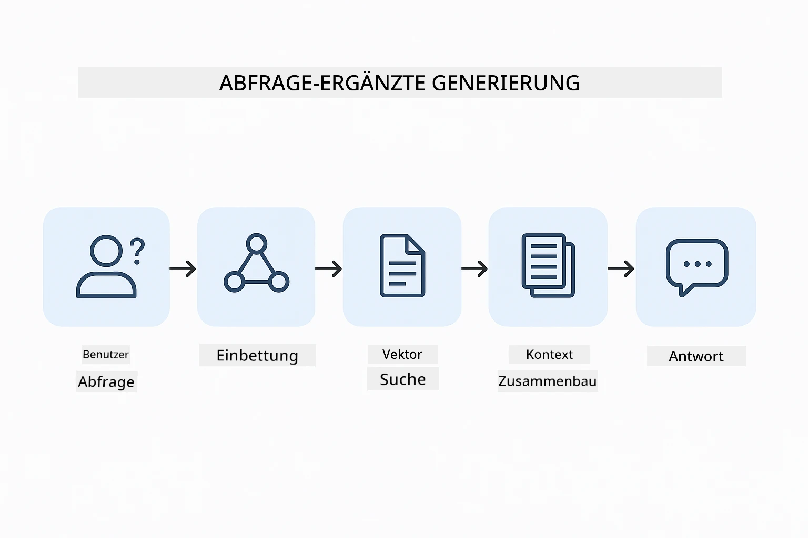
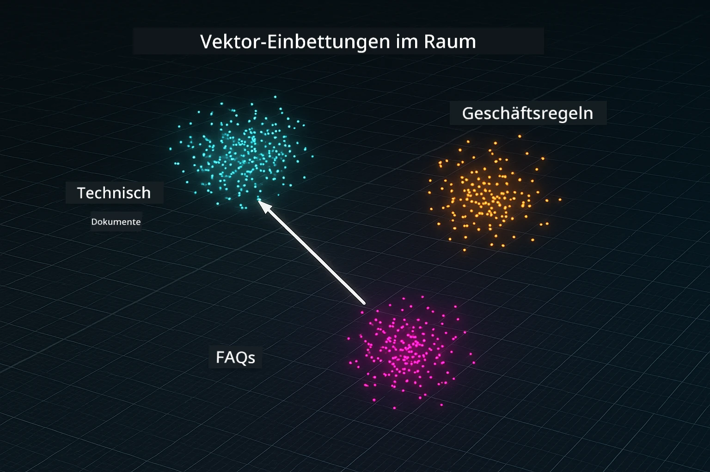
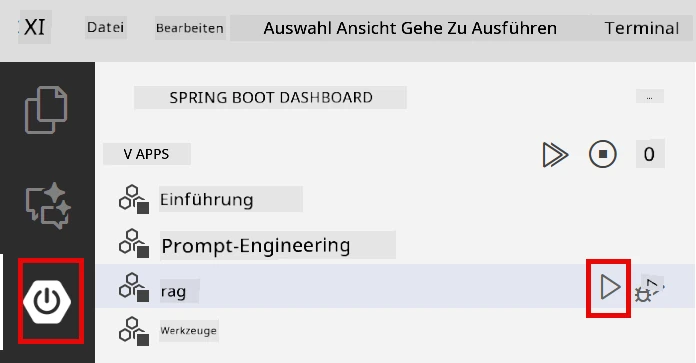
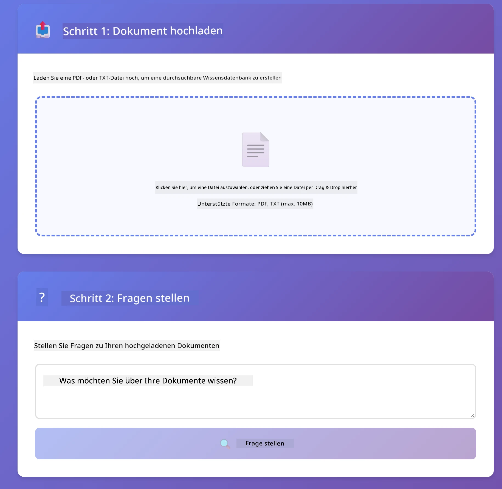
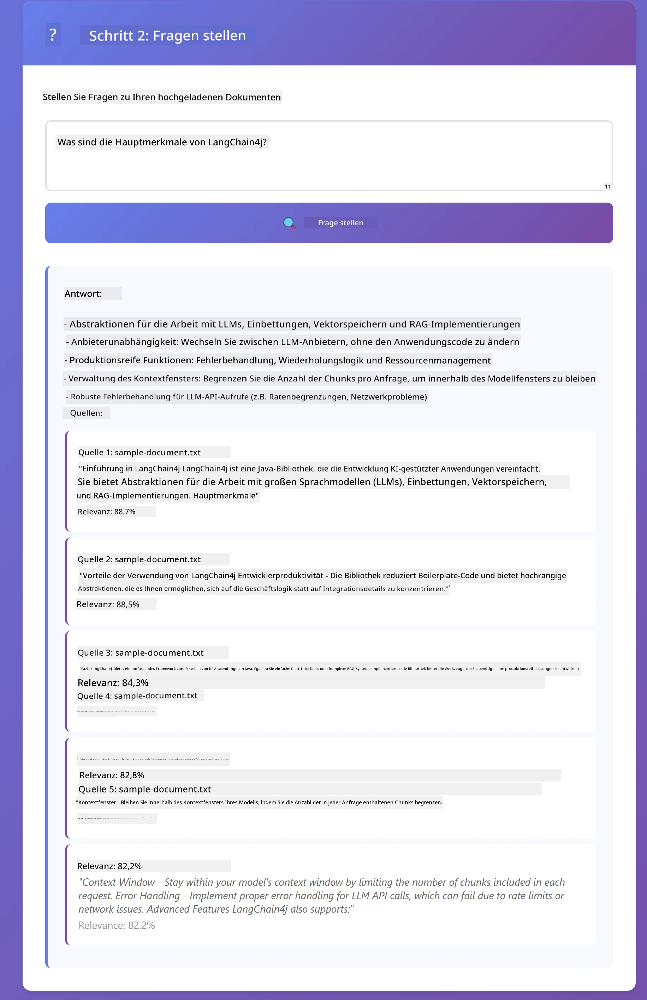

# Modul 03: RAG (Retrieval-Augmented Generation)

## Inhaltsverzeichnis

- [Video-Durchlauf](#video-durchlauf)
- [Was Sie lernen werden](#was-sie-lernen-werden)
- [Voraussetzungen](#voraussetzungen)
- [Verstehen von RAG](#verstehen-von-rag)
  - [Welchen RAG-Ansatz verwendet dieses Tutorial?](#welchen-rag-ansatz-verwendet-dieses-tutorial)
- [Wie es funktioniert](#wie-es-funktioniert)
  - [Dokumentenverarbeitung](#dokumentenverarbeitung)
  - [Erstellen von Embeddings](#erstellen-von-embeddings)
  - [Semantische Suche](#semantische-suche)
  - [Antwortgenerierung](#antwortgenerierung)
- [Anwendung ausführen](#anwendung-starten)
- [Verwendung der Anwendung](#nutzung-der-anwendung)
  - [Dokument hochladen](#dokument-hochladen)
  - [Fragen stellen](#fragen-stellen)
  - [Quellen nachprüfen](#quellverweise-prüfen)
  - [Mit Fragen experimentieren](#mit-fragen-experimentieren)
- [Schlüsselkonzepte](#schlüsselkonzepte)
  - [Chunking-Strategie](#chunking-strategie)
  - [Ähnlichkeitswerte](#ähnlichkeitsscores)
  - [In-Memory-Speicherung](#speicher-im-arbeitsspeicher)
  - [Management des Kontextfensters](#verwaltung-des-kontextfensters)
- [Wann RAG wichtig ist](#wann-rag-relevant-ist)
- [Nächste Schritte](#nächste-schritte)

## Video-Durchlauf

Sehen Sie sich diese Live-Session an, die erklärt, wie Sie mit diesem Modul starten:

<a href="https://www.youtube.com/watch?v=_olq75ZH_eY"></a>

## Was Sie lernen werden

In den vorherigen Modulen haben Sie gelernt, wie man Gespräche mit KI führt und Prompts effektiv strukturiert. Aber es gibt eine grundlegende Einschränkung: Sprachmodelle kennen nur das, was sie während des Trainings gelernt haben. Sie können keine Fragen zu den Richtlinien Ihres Unternehmens, Ihrer Projektdokumentation oder zu Informationen beantworten, die sie nicht trainiert wurden.

RAG (Retrieval-Augmented Generation) löst dieses Problem. Anstatt zu versuchen, dem Modell Ihre Informationen beizubringen (was teuer und unpraktisch ist), geben Sie ihm die Fähigkeit, Ihre Dokumente zu durchsuchen. Wenn jemand eine Frage stellt, findet das System relevante Informationen und fügt sie dem Prompt hinzu. Das Modell antwortet dann basierend auf diesem abgerufenen Kontext.

Denken Sie bei RAG daran, dem Modell eine Referenzbibliothek zu geben. Wenn Sie eine Frage stellen, tut das System Folgendes:

1. **Benutzeranfrage** – Sie stellen eine Frage  
2. **Embedding** – Wandelt Ihre Frage in einen Vektor um  
3. **Vektorsuche** – Findet ähnliche Dokumentabschnitte  
4. **Kontextzusammenstellung** – Fügt relevante Abschnitte dem Prompt hinzu  
5. **Antwort** – LLM generiert basierend auf dem Kontext eine Antwort  

Das verankert die Antworten des Modells in Ihren tatsächlichen Daten, statt sich auf Trainingswissen zu verlassen oder Antworten zu erfinden.

## Voraussetzungen

- Abgeschlossenes [Modul 01 – Einführung](../01-introduction/README.md) (Azure OpenAI-Ressourcen bereitgestellt, einschließlich des Embedding-Modells `text-embedding-3-small`)  
- `.env`-Datei im Stammverzeichnis mit Azure-Zugangsdaten (erstellt durch `azd up` in Modul 01)  

> **Hinweis:** Wenn Sie Modul 01 nicht abgeschlossen haben, folgen Sie zunächst den dortigen Bereitstellungsanweisungen. Der Befehl `azd up` stellt sowohl das GPT-Chatmodell als auch das Embedding-Modell bereit, das in diesem Modul verwendet wird.

## Verstehen von RAG

Das untenstehende Diagramm veranschaulicht das Kernkonzept: Anstatt sich nur auf das Trainingsmaterial des Modells zu verlassen, gibt RAG ihm eine Referenzbibliothek Ihrer Dokumente, die es vor jeder Antwort abruft.


*Dieses Diagramm zeigt den Unterschied zwischen einem Standard-LLM (das aus Trainingsdaten rät) und einem RAG-verbesserten LLM (das zunächst Ihre Dokumente konsultiert).*

So sind die Bausteine Ende-zu-Ende verbunden. Die Benutzerfrage durchläuft vier Stufen: Embedding, Vektorsuche, Kontextzusammenstellung und Antwortgenerierung – wobei jede auf der vorherigen aufbaut:



*Dieses Diagramm zeigt die Ende-zu-Ende RAG-Pipeline — eine Benutzeranfrage durchläuft Embedding, Vektorsuche, Kontextzusammenstellung und Antwortgenerierung.*

Der Rest dieses Moduls führt Sie detailliert durch jede Stufe mit ausführbarem und modifizierbarem Code.

### Welchen RAG-Ansatz verwendet dieses Tutorial?

LangChain4j bietet drei Wege, RAG umzusetzen, jeweils mit unterschiedlicher Abstraktionsebene. Das folgende Diagramm vergleicht sie nebeneinander:


*Dieses Diagramm vergleicht die drei LangChain4j RAG-Ansätze – Easy, Native und Advanced – zeigt deren Hauptkomponenten und wann man welchen nutzt.*

| Ansatz | Was er tut | Kompromiss |
|---|---|---|
| **Easy RAG** | Verbindet alles automatisch über `AiServices` und `ContentRetriever`. Sie annotieren ein Interface, hängen einen Retriever an, und LangChain4j übernimmt Einbettung, Suche und Prompt-Erstellung im Hintergrund. | Minimale Codezeilen, aber Sie sehen nicht, was intern passiert. |
| **Native RAG** | Sie rufen das Embedding-Modell, durchsuchen den Speicher, bauen den Prompt und generieren die Antwort explizit selbst – Schritt für Schritt. | Mehr Code, aber jede Stufe ist sichtbar und anpassbar. |
| **Advanced RAG** | Nutzt das `RetrievalAugmentor`-Framework mit modularen Query-Transformern, Routern, Re-Rankern und Content-Injectoren für produktionsreife Pipelines. | Maximale Flexibilität, aber deutlich komplexer. |

**Dieses Tutorial verwendet den Native-Ansatz.** Jeder Schritt der RAG-Pipeline – Einbettung der Anfrage, Durchsuchung des Vektorspeichers, Kontextzusammenstellung und Antwortgenerierung – wird explizit in [`RagService.java`](../../../03-rag/src/main/java/com/example/langchain4j/rag/service/RagService.java) beschrieben. Das ist bewusst gewählt: Als Lernressource ist es wichtiger, jede Phase zu sehen und zu verstehen, als minimalen Code zu schreiben. Sobald Sie komfortabel sind mit den Abläufen, können Sie auf Easy RAG für schnelle Prototypen oder Advanced RAG für Produktivsysteme umsteigen.

> **💡 Neugierig auf Easy RAG?** LangChain4j bietet auch einen *Easy RAG* Ansatz, bei dem `AiServices` und ein `ContentRetriever` Einbettung, Suche und Prompt-Erstellung automatisch übernehmen. Dieses Modul nimmt den expliziten Weg — es öffnet die Pipeline, damit Sie jede Stufe selbst sehen und steuern können.

Das folgende Diagramm zeigt die Easy RAG-Pipeline. Beachten Sie, wie `AiServices` und `EmbeddingStoreContentRetriever` die ganze Komplexität verstecken — Sie laden ein Dokument, hängen einen Retriever an und erhalten Antworten. Der Native-Ansatz dieses Moduls öffnet jede dieser verborgenen Stufen:


*Dieses Diagramm zeigt die Easy RAG-Pipeline. Vergleichen Sie dies mit dem Native-Ansatz aus diesem Modul: Easy RAG versteckt Einbettung, Abruf und Prompt-Erstellung hinter `AiServices` und `ContentRetriever` — Sie laden ein Dokument, hängen einen Retriever an und erhalten Antworten. Der Native-Ansatz hier öffnet diese Pipeline, so dass Sie jede Stufe (Einbetten, Suchen, Kontext zusammenstellen, generieren) selbst aufrufen und so volle Kontrolle und Sichtbarkeit erhalten.*

## Wie es funktioniert

Die RAG-Pipeline in diesem Modul zerfällt in vier Stufen, die bei jeder Benutzerfrage nacheinander ausgeführt werden. Zuerst wird ein hochgeladenes Dokument **geparst und in Chunks zerlegt**. Diese Chunks werden dann in **Vektor-Embeddings** umgewandelt und gespeichert, damit sie mathematisch verglichen werden können. Sobald eine Anfrage eintrifft, führt das System eine **semantische Suche** durch, um die relevantesten Chunks zu finden, und übergibt diese schließlich als Kontext an das LLM zur **Antwortgenerierung**. Die folgenden Abschnitte erläutern jede Stufe mit echtem Code und Diagrammen. Fangen wir mit dem ersten Schritt an.

### Dokumentenverarbeitung

[DocumentService.java](../../../03-rag/src/main/java/com/example/langchain4j/rag/service/DocumentService.java)

Wenn Sie ein Dokument hochladen, parst das System es (PDF oder Klartext), hängt Metadaten wie den Dateinamen an und zerlegt es danach in Chunks — kleinere Stücke, die bequem in das Kontextfenster des Modells passen. Diese Chunks überlappen leicht, damit kein Kontext an den Grenzen verloren geht.

```java
// Analysiere die hochgeladene Datei und verpacke sie in ein LangChain4j-Dokument
Document document = Document.from(content, metadata);

// Teile in 300-Token-Segmente mit 30-Token-Überlappung auf
DocumentSplitter splitter = DocumentSplitters
    .recursive(300, 30);

List<TextSegment> segments = splitter.split(document);
```
  
Das folgende Diagramm zeigt diesen Vorgang visuell. Beachten Sie, dass jeder Chunk einige Tokens mit seinen Nachbarn teilt — die 30-Token-Überlappung stellt sicher, dass kein wichtiger Kontext verloren geht:


*Dieses Diagramm zeigt ein Dokument, das in 300-Token-Chunks mit 30-Token-Überlappung zerlegt wird, um Kontext an Chunk-Grenzen zu erhalten.*

> **🤖 Probieren Sie es mit [GitHub Copilot](https://github.com/features/copilot) Chat:** Öffnen Sie [`DocumentService.java`](../../../03-rag/src/main/java/com/example/langchain4j/rag/service/DocumentService.java) und fragen Sie:  
> - "Wie zerlegt LangChain4j Dokumente in Chunks und warum ist Überlappung wichtig?"  
> - "Was ist die optimale Chunk-Größe für verschiedene Dokumenttypen und warum?"  
> - "Wie gehe ich mit Dokumenten in mehreren Sprachen oder mit spezieller Formatierung um?"

### Erstellen von Embeddings

[LangChainRagConfig.java](../../../03-rag/src/main/java/com/example/langchain4j/rag/config/LangChainRagConfig.java)

Jeder Chunk wird in eine numerische Repräsentation umgewandelt, die als Embedding bezeichnet wird — im Grunde ein Bedeutungs-in-Zahlen-Konverter. Das Embedding-Modell ist nicht "intelligent" wie ein Chatmodell; es kann keine Anweisungen folgen, nicht vernünftig argumentieren und keine Fragen beantworten. Was es kann, ist Text in einen mathematischen Raum zu mappen, in dem ähnliche Bedeutungen nahe beieinander liegen — „Auto“ nahe „Kraftfahrzeug“, „Rückerstattungsrichtlinie“ nahe „Geld zurück“. Man kann sich ein Chatmodell als eine Person vorstellen, mit der man sprechen kann; ein Embedding-Modell ist ein ultraschlaues Ablagesystem.

Das folgende Diagramm visualisiert dieses Konzept — Text geht rein, numerische Vektoren kommen raus, und ähnliche Bedeutungen erzeugen benachbarte Vektoren:


*Dieses Diagramm zeigt, wie ein Embedding-Modell Text in numerische Vektoren umwandelt, die ähnliche Bedeutungen – wie „Auto“ und „Kraftfahrzeug“ – im Vektorraum nahe beieinander platzieren.*

```java
@Bean
public EmbeddingModel embeddingModel() {
    return OpenAiOfficialEmbeddingModel.builder()
        .baseUrl(azureOpenAiEndpoint)
        .apiKey(azureOpenAiKey)
        .modelName(azureEmbeddingDeploymentName)
        .build();
}

EmbeddingStore<TextSegment> embeddingStore = 
    new InMemoryEmbeddingStore<>();
```
  
Das Klassendiagramm unten zeigt die zwei getrennten Abläufe in einer RAG-Pipeline und die LangChain4j-Klassen, die sie implementieren. Der **Ingestions-Flow** (läuft einmal beim Hochladen) zerlegt das Dokument, erzeugt Embeddings der Chunks und speichert sie über `.addAll()`. Der **Query-Flow** (läuft bei jeder Benutzeranfrage) erzeugt ein Embedding der Frage, durchsucht den Speicher via `.search()` und übergibt den passenden Kontext ans Chatmodell. Beide Flows treffen auf das gemeinsame Interface `EmbeddingStore<TextSegment>`:


*Dieses Diagramm zeigt die zwei Abläufe in einer RAG-Pipeline – Ingestion und Query – und wie sie über ein gemeinsames EmbeddingStore verbunden sind.*

Sobald die Embeddings gespeichert sind, clustert ähnlicher Inhalt natürlich im Vektorraum. Die Visualisierung unten zeigt, wie Dokumente zu verwandten Themen als nahe Punkte enden, was semantische Suche möglich macht:



*Diese Visualisierung zeigt, wie verwandte Dokumente im 3D-Vektorraum clustern, wobei Themen wie technische Dokumente, Geschäftsregeln und FAQs eigene Gruppen bilden.*

Wenn ein Nutzer sucht, führt das System vier Schritte aus: Dokumente einmal einbetten, die Anfrage bei jeder Suche einbetten, den Anfragevektor mit allen gespeicherten Vektoren anhand des Kosinus-Ähnlichkeitsmaßes vergleichen und die besten K-Chunk-Ergebnisse zurückgeben. Das folgende Diagramm erläutert jeden Schritt sowie die beteiligten LangChain4j-Klassen:


*Dieses Diagramm zeigt den vierstufigen Suchprozess mit Embeddings: Dokumente einbetten, Anfrage einbetten, Vektoren mit Kosinus-Ähnlichkeit vergleichen und die Top-K-Ergebnisse zurückgeben.*

### Semantische Suche

[RagService.java](../../../03-rag/src/main/java/com/example/langchain4j/rag/service/RagService.java)

Wenn Sie eine Frage stellen, wird auch Ihre Frage eingebettet. Das System vergleicht das Embedding Ihrer Frage mit allen Embeddings der Dokumentenchunks. Es findet die Chunks mit der semantisch ähnlichsten Bedeutung – nicht nur mit passenden Schlüsselwörtern, sondern tatsächlicher semantischer Übereinstimmung.

```java
Embedding queryEmbedding = embeddingModel.embed(question).content();

EmbeddingSearchRequest searchRequest = EmbeddingSearchRequest.builder()
    .queryEmbedding(queryEmbedding)
    .maxResults(5)
    .minScore(0.5)
    .build();

EmbeddingSearchResult<TextSegment> searchResult = embeddingStore.search(searchRequest);
List<EmbeddingMatch<TextSegment>> matches = searchResult.matches();

for (EmbeddingMatch<TextSegment> match : matches) {
    String relevantText = match.embedded().text();
    double score = match.score();
}
```
  
Das folgende Diagramm stellt semantische Suche der traditionellen Schlüsselwortsuche gegenüber. Eine Schlüsselwortsuche nach „Fahrzeug“ verpasst einen Chunk über „Autos und Lastwagen“, während die semantische Suche versteht, dass das dasselbe bedeutet, und ihn als hoch-relevantes Ergebnis zurückgibt:


*Dieses Diagramm vergleicht schlüsselwortbasierte Suche mit semantischer Suche und zeigt, wie semantische Suche konzeptuell verwandte Inhalte abruft, auch wenn exakte Schlüsselwörter unterschiedlich sind.*

Im Hintergrund wird Ähnlichkeit mittels Kosinus-Ähnlichkeit gemessen – im Grunde die Frage „zeigen diese zwei Pfeile in dieselbe Richtung?“ Zwei Chunks können völlig unterschiedliche Wörter verwenden, aber wenn sie dasselbe bedeuten, zeigen ihre Vektoren in dieselbe Richtung und erreichen einen Wert nahe 1.0:


*Dieses Diagramm veranschaulicht die Kosinusähnlichkeit als den Winkel zwischen Einbettungsvektoren — stärker ausgerichtete Vektoren erzielen Werte näher bei 1,0, was auf eine höhere semantische Ähnlichkeit hinweist.*

> **🤖 Probieren Sie es mit [GitHub Copilot](https://github.com/features/copilot) Chat aus:** Öffnen Sie [`RagService.java`](../../../03-rag/src/main/java/com/example/langchain4j/rag/service/RagService.java) und fragen Sie:
> - „Wie funktioniert die Ähnlichkeitssuche mit Einbettungen und was bestimmt den Score?“
> - „Welchen Ähnlichkeitsschwellenwert sollte ich verwenden und wie beeinflusst er die Ergebnisse?“
> - „Wie gehe ich mit Fällen um, in denen keine relevanten Dokumente gefunden werden?“

### Antwortgenerierung

[RagService.java](../../../03-rag/src/main/java/com/example/langchain4j/rag/service/RagService.java)

Die relevantesten Chunks werden zu einem strukturierten Prompt zusammengefügt, der explizite Anweisungen, den abgerufenen Kontext und die Frage des Nutzers enthält. Das Modell liest diese spezifischen Chunks und antwortet basierend auf diesen Informationen — es kann nur das verwenden, was ihm vorliegt, was Halluzinationen verhindert.

```java
String context = matches.stream()
    .map(match -> match.embedded().text())
    .collect(Collectors.joining("\n\n"));

String prompt = String.format("""
    Answer the question based on the following context.
    If the answer cannot be found in the context, say so.

    Context:
    %s

    Question: %s

    Answer:""", context, request.question());

String answer = chatModel.chat(prompt);
```

Das folgende Diagramm zeigt diese Zusammenstellung in Aktion — die bestbewerteten Chunks aus dem Suchschritt werden in die Prompt-Vorlage eingespeist, und das `OpenAiOfficialChatModel` generiert eine fundierte Antwort:


*Dieses Diagramm zeigt, wie die bestbewerteten Chunks zu einem strukturierten Prompt zusammengesetzt werden, damit das Modell eine fundierte Antwort aus Ihren Daten generieren kann.*

## Anwendung starten

**Bereitstellung überprüfen:**

Stellen Sie sicher, dass die `.env`-Datei im Stammverzeichnis mit Azure-Anmeldeinformationen vorhanden ist (wurde im Modul 01 erstellt). Führen Sie diesen Befehl im Modulverzeichnis (`03-rag/`) aus:

**Bash:**
```bash
cat ../.env  # Sollte AZURE_OPENAI_ENDPOINT, API_KEY, DEPLOYMENT anzeigen
```

**PowerShell:**
```powershell
Get-Content ..\.env  # Sollte AZURE_OPENAI_ENDPOINT, API_KEY, DEPLOYMENT anzeigen
```

**Starten Sie die Anwendung:**

> **Hinweis:** Wenn Sie bereits alle Anwendungen mit `./start-all.sh` vom Stammverzeichnis aus gestartet haben (wie im Modul 01 beschrieben), läuft dieses Modul bereits auf Port 8081. Sie können die Startbefehle unten überspringen und direkt http://localhost:8081 aufrufen.

**Option 1: Verwendung des Spring Boot Dashboards (Empfohlen für VS Code Benutzer)**

Der Dev-Container enthält die Spring Boot Dashboard-Erweiterung, die eine visuelle Oberfläche zur Verwaltung aller Spring Boot-Anwendungen bietet. Sie finden sie in der Aktivitätsleiste links in VS Code (suchen Sie das Spring Boot-Symbol).

Über das Spring Boot Dashboard können Sie:
- Alle verfügbaren Spring Boot-Anwendungen im Arbeitsbereich sehen
- Anwendungen mit einem einzigen Klick starten/stoppen
- Anwendungsprotokolle in Echtzeit anzeigen
- Anwendungsstatus überwachen

Klicken Sie einfach auf die Wiedergabetaste neben „rag“, um dieses Modul zu starten, oder starten Sie alle Module auf einmal.



*Dieser Screenshot zeigt das Spring Boot Dashboard in VS Code, wo Sie Anwendungen visuell starten, stoppen und überwachen können.*

**Option 2: Verwendung von Shell-Skripten**

Starten Sie alle Webanwendungen (Module 01-04):

**Bash:**
```bash
cd ..  # Vom Stammverzeichnis
./start-all.sh
```

**PowerShell:**
```powershell
cd ..  # Vom Stammverzeichnis
.\start-all.ps1
```

Oder starten Sie nur dieses Modul:

**Bash:**
```bash
cd 03-rag
./start.sh
```

**PowerShell:**
```powershell
cd 03-rag
.\start.ps1
```

Beide Skripte laden automatisch Umgebungsvariablen aus der `.env`-Datei im Stammverzeichnis und bauen die JARs, falls diese noch nicht existieren.

> **Hinweis:** Wenn Sie alle Module lieber manuell vor dem Start bauen möchten:
>
> **Bash:**
> ```bash
> cd ..  # Go to root directory
> mvn clean package -DskipTests
> ```
>
> **PowerShell:**
> ```powershell
> cd ..  # Go to root directory
> mvn clean package -DskipTests
> ```

Öffnen Sie http://localhost:8081 in Ihrem Browser.

**Zum Stoppen:**

**Bash:**
```bash
./stop.sh  # Nur dieses Modul
# Oder
cd .. && ./stop-all.sh  # Alle Module
```

**PowerShell:**
```powershell
.\stop.ps1  # Nur dieses Modul
# Oder
cd ..; .\stop-all.ps1  # Alle Module
```

## Nutzung der Anwendung

Die Anwendung bietet eine Web-Oberfläche zum Hochladen von Dokumenten und zum Stellen von Fragen.

<a href="images/rag-homepage.png"></a>

*Dieser Screenshot zeigt die RAG-Anwendungsoberfläche, in der Sie Dokumente hochladen und Fragen stellen können.*

### Dokument hochladen

Beginnen Sie mit dem Hochladen eines Dokuments – TXT-Dateien eignen sich zum Testen am besten. Eine `sample-document.txt` liegt in diesem Verzeichnis vor, die Informationen über LangChain4j-Funktionen, RAG-Implementierung und Best Practices enthält – perfekt zum Testen des Systems.

Das System verarbeitet Ihr Dokument, zerlegt es in Chunks und erstellt für jeden Chunk Einbettungen. Dies geschieht automatisch beim Hochladen.

### Fragen stellen

Stellen Sie nun spezifische Fragen zum Dokumentinhalt. Probieren Sie etwas Faktisches, das im Dokument klar angegeben ist. Das System sucht nach relevanten Chunks, bindet diese in den Prompt ein und generiert eine Antwort.

### Quellverweise prüfen

Jede Antwort enthält Quellverweise mit Ähnlichkeitsscores. Diese Scores (0 bis 1) zeigen an, wie relevant jeder Chunk für Ihre Frage war. Höhere Scores bedeuten bessere Übereinstimmungen. So können Sie die Antwort gegen die Originalquelle überprüfen.

<a href="images/rag-query-results.png"></a>

*Dieser Screenshot zeigt Abfrageergebnisse mit der generierten Antwort, Quellenhinweisen und Relevanzwerten für jeden abgerufenen Chunk.*

### Mit Fragen experimentieren

Probieren Sie verschiedene Fragetypen:
- Spezifische Fakten: „Was ist das Hauptthema?“
- Vergleiche: „Was ist der Unterschied zwischen X und Y?“
- Zusammenfassungen: „Fassen Sie die wichtigsten Punkte zu Z zusammen“

Beobachten Sie, wie sich die Relevanzwerte ändern, je nachdem, wie gut Ihre Frage zum Dokumentinhalt passt.

## Schlüsselkonzepte

### Chunking-Strategie

Dokumente werden in 300-Token-Chunks mit 30 Tokens Überlappung aufgeteilt. Dieses Gleichgewicht stellt sicher, dass jeder Chunk genug Kontext für Bedeutung enthält und gleichzeitig klein genug bleibt, um mehrere Chunks in einem Prompt unterzubringen.

### Ähnlichkeitsscores

Jeder abgerufene Chunk hat einen Ähnlichkeitsscore zwischen 0 und 1, der angibt, wie gut er zur Frage des Nutzers passt. Das folgende Diagramm visualisiert die Score-Bereiche und wie das System diese verwendet, um Ergebnisse zu filtern:


*Dieses Diagramm zeigt Score-Bereiche von 0 bis 1, mit einem Mindestschwellenwert von 0,5, der irrelevante Chunks herausfiltert.*

Scores reichen von 0 bis 1:
- 0,7–1,0: Hoch relevant, exakte Übereinstimmung
- 0,5–0,7: Relevant, guter Kontext
- Unter 0,5: Gefiltert, zu unterschiedlich

Das System ruft nur Chunks ab, die über dem Mindestschwellenwert liegen, um Qualität zu gewährleisten.

Einbettungen funktionieren gut, wenn Bedeutungen klar gruppiert sind, haben aber auch Schwachstellen. Das folgende Diagramm zeigt häufige Fehlerfälle — zu große Chunks erzeugen unscharfe Vektoren, zu kleine Chunks haben zu wenig Kontext, mehrdeutige Begriffe verweisen auf mehrere Gruppen, und exakte Übereinstimmungen (IDs, Teilenummern) funktionieren mit Einbettungen gar nicht:


*Dieses Diagramm zeigt typische Fehlerquellen bei Einbettungen: zu große Chunks, zu kleine Chunks, mehrdeutige Begriffe mit mehreren Zuordnungen und exakte Suchanfragen wie IDs.*

### Speicher im Arbeitsspeicher

Dieses Modul verwendet Speichern im Arbeitsspeicher aus Einfachheitsgründen. Beim Neustart der Anwendung gehen hochgeladene Dokumente verloren. Produktionssysteme verwenden persistente Vektordatenbanken wie Qdrant oder Azure AI Search.

### Verwaltung des Kontextfensters

Jedes Modell hat ein maximales Kontextfenster. Sie können nicht jeden Chunk eines großen Dokuments einbeziehen. Das System ruft die Top-N relevantesten Chunks ab (Standard 5), um innerhalb der Grenzen zu bleiben und gleichzeitig genug Kontext für genaue Antworten zu bieten.

## Wann RAG relevant ist

RAG ist nicht immer die richtige Methode. Die folgende Entscheidungshilfe hilft Ihnen zu bestimmen, wann RAG Mehrwert bringt und wann einfachere Ansätze — wie das direkte Einfügen von Inhalten in den Prompt oder die Nutzung des eingelernten Wissens des Modells — ausreichen:


*Dieses Diagramm zeigt eine Entscheidungshilfe, wann RAG Mehrwert bietet und wann einfachere Ansätze ausreichend sind.*

## Nächste Schritte

**Nächstes Modul:** [04-tools - KI-Agenten mit Tools](../04-tools/README.md)

---

**Navigation:** [← Vorheriges: Modul 02 - Prompt Engineering](../02-prompt-engineering/README.md) | [Zurück zur Übersicht](../README.md) | [Nächstes: Modul 04 - Tools →](../04-tools/README.md)

---

<!-- CO-OP TRANSLATOR DISCLAIMER START -->
**Haftungsausschluss**:
Dieses Dokument wurde mit dem KI-Übersetzungsdienst [Co-op Translator](https://github.com/Azure/co-op-translator) übersetzt. Obwohl wir uns um Genauigkeit bemühen, beachten Sie bitte, dass automatisierte Übersetzungen Fehler oder Ungenauigkeiten enthalten können. Das Originaldokument in seiner Ursprungssprache gilt als maßgebliche Quelle. Bei kritischen Informationen wird eine professionelle menschliche Übersetzung empfohlen. Wir übernehmen keine Haftung für Missverständnisse oder Fehlinterpretationen, die aus der Verwendung dieser Übersetzung entstehen.
<!-- CO-OP TRANSLATOR DISCLAIMER END -->