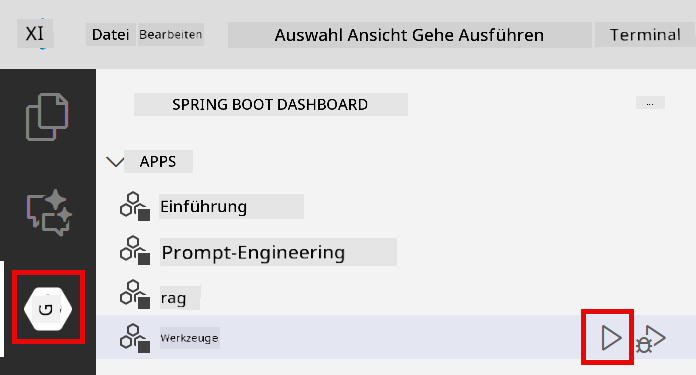
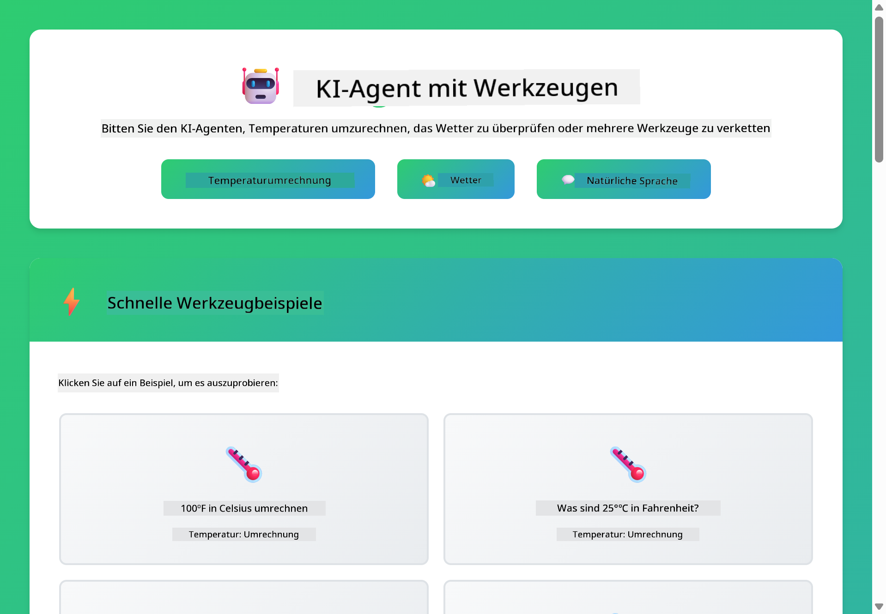

<!--
CO_OP_TRANSLATOR_METADATA:
{
  "original_hash": "13ec450c12cdd1a863baa2b778f27cd7",
  "translation_date": "2025-12-30T19:44:29+00:00",
  "source_file": "04-tools/README.md",
  "language_code": "de"
}
-->
# Modul 04: KI-Agenten mit Tools

## Table of Contents

- [Was Sie lernen werden](../../../04-tools)
- [Voraussetzungen](../../../04-tools)
- [Verständnis von KI-Agenten mit Tools](../../../04-tools)
- [Wie Tool-Aufrufe funktionieren](../../../04-tools)
  - [Tool-Definitionen](../../../04-tools)
  - [Entscheidungsfindung](../../../04-tools)
  - [Ausführung](../../../04-tools)
  - [Antwortgenerierung](../../../04-tools)
- [Verkettung von Tools](../../../04-tools)
- [Anwendung starten](../../../04-tools)
- [Verwendung der Anwendung](../../../04-tools)
  - [Einfache Tool-Verwendung ausprobieren](../../../04-tools)
  - [Tool-Verkettung testen](../../../04-tools)
  - [Konversationsverlauf ansehen](../../../04-tools)
  - [Das Schlussfolgern beobachten](../../../04-tools)
  - [Mit verschiedenen Anfragen experimentieren](../../../04-tools)
- [Kernkonzepte](../../../04-tools)
  - [ReAct-Muster (Schlussfolgern und Handeln)](../../../04-tools)
  - [Tool-Beschreibungen sind wichtig](../../../04-tools)
  - [Sitzungsverwaltung](../../../04-tools)
  - [Fehlerbehandlung](../../../04-tools)
- [Verfügbare Tools](../../../04-tools)
- [Wann man toolbasierte Agenten einsetzen sollte](../../../04-tools)
- [Nächste Schritte](../../../04-tools)

## Was Sie lernen werden

Bisher haben Sie gelernt, wie man Gespräche mit KI führt, Prompts effektiv strukturiert und Antworten in Ihren Dokumenten verankert. Es gibt jedoch noch eine grundlegende Einschränkung: Sprachmodelle können nur Text erzeugen. Sie können nicht das Wetter abrufen, Berechnungen durchführen, Datenbanken abfragen oder mit externen Systemen interagieren.

Tools ändern das. Indem Sie dem Modell Zugriff auf Funktionen geben, die es aufrufen kann, verwandeln Sie es von einem Textgenerator in einen Agenten, der Aktionen ausführen kann. Das Modell entscheidet, wann es ein Tool benötigt, welches Tool es verwenden soll und welche Parameter übergeben werden müssen. Ihr Code führt die Funktion aus und gibt das Ergebnis zurück. Das Modell integriert dieses Ergebnis in seine Antwort.

## Voraussetzungen

- Abgeschlossenes Modul 01 (Azure OpenAI-Ressourcen bereitgestellt)
- `.env` Datei im Stammverzeichnis mit Azure-Zugangsdaten (erstellt durch `azd up` in Modul 01)

> **Hinweis:** Wenn Sie Modul 01 nicht abgeschlossen haben, folgen Sie dort zuerst den Bereitstellungsanweisungen.

## Verständnis von KI-Agenten mit Tools

> **📝 Hinweis:** Der Begriff "agents" in diesem Modul bezieht sich auf KI-Assistenten, die mit der Fähigkeit ausgestattet sind, Tools aufzurufen. Dies unterscheidet sich von den **Agentic AI**-Mustern (autonome Agenten mit Planung, Gedächtnis und mehrstufigem Schlussfolgern), die wir in [Module 05: MCP](../05-mcp/README.md) behandeln werden.

Ein KI-Agent mit Tools folgt einem Muster des Schlussfolgerns und Handelns (ReAct):

1. Der Benutzer stellt eine Frage
2. Der Agent überlegt, was er wissen muss
3. Der Agent entscheidet, ob er ein Tool benötigt, um zu antworten
4. Falls ja, ruft der Agent das passende Tool mit den richtigen Parametern auf
5. Das Tool führt aus und liefert Daten zurück
6. Der Agent integriert das Ergebnis und liefert die endgültige Antwort


*Das ReAct-Muster – wie KI-Agenten zwischen Schlussfolgern und Handeln wechseln, um Probleme zu lösen*

Das geschieht automatisch. Sie definieren die Tools und deren Beschreibungen. Das Modell trifft die Entscheidungen darüber, wann und wie es sie verwendet.

## Wie Tool-Aufrufe funktionieren

**Tool-Definitionen** - [WeatherTool.java](../../../04-tools/src/main/java/com/example/langchain4j/agents/tools/WeatherTool.java) | [TemperatureTool.java](../../../04-tools/src/main/java/com/example/langchain4j/agents/tools/TemperatureTool.java)

Sie definieren Funktionen mit klaren Beschreibungen und Parameterspezifikationen. Das Modell sieht diese Beschreibungen in seinem System-Prompt und versteht, was jedes Tool macht.

```java
@Component
public class WeatherTool {
    
    @Tool("Get the current weather for a location")
    public String getCurrentWeather(@P("Location name") String location) {
        // Ihre Wetterabfrage-Logik
        return "Weather in " + location + ": 22°C, cloudy";
    }
}

@AiService
public interface Assistant {
    String chat(@MemoryId String sessionId, @UserMessage String message);
}

// Assistant wird von Spring Boot automatisch mit folgenden Komponenten verbunden:
// - ChatModel-Bean
// - Alle @Tool-Methoden aus @Component-Klassen
// - ChatMemoryProvider zur Sitzungsverwaltung
```

> **🤖 Try with [GitHub Copilot](https://github.com/features/copilot) Chat:** Open [`WeatherTool.java`](../../../04-tools/src/main/java/com/example/langchain4j/agents/tools/WeatherTool.java) and ask:
> - "How would I integrate a real weather API like OpenWeatherMap instead of mock data?"
> - "What makes a good tool description that helps the AI use it correctly?"
> - "How do I handle API errors and rate limits in tool implementations?"

**Entscheidungsfindung**

Wenn ein Benutzer fragt "What's the weather in Seattle?", erkennt das Modell, dass es das Weather-Tool benötigt. Es erstellt einen Funktionsaufruf mit dem Parameter location auf "Seattle".

**Ausführung** - [AgentService.java](../../../04-tools/src/main/java/com/example/langchain4j/agents/service/AgentService.java)

Spring Boot verdrahtet die deklarative `@AiService`-Schnittstelle automatisch mit allen registrierten Tools, und LangChain4j führt Tool-Aufrufe automatisch aus.

> **🤖 Try with [GitHub Copilot](https://github.com/features/copilot) Chat:** Open [`AgentService.java`](../../../04-tools/src/main/java/com/example/langchain4j/agents/service/AgentService.java) and ask:
> - "How does the ReAct pattern work and why is it effective for AI agents?"
> - "How does the agent decide which tool to use and in what order?"
> - "What happens if a tool execution fails - how should I handle errors robustly?"

**Antwortgenerierung**

Das Modell erhält die Wetterdaten und formatiert sie in eine natürliche Sprache als Antwort für den Benutzer.

### Warum deklarative AI-Services verwenden?

Dieses Modul verwendet die Spring Boot-Integration von LangChain4j mit deklarativen `@AiService`-Schnittstellen:

- **Spring Boot auto-wiring** - ChatModel und Tools werden automatisch injiziert
- **@MemoryId pattern** - Automatisches sitzungsbasiertes Gedächtnismanagement
- **Single instance** - Assistent wird einmal erstellt und wiederverwendet für bessere Performance
- **Type-safe execution** - Java-Methoden werden direkt mit Typkonvertierung aufgerufen
- **Multi-turn orchestration** - Handhabt Tool-Verkettung automatisch
- **Zero boilerplate** - Kein Boilerplate-Code wie manuelle AiServices.builder()-Aufrufe oder Memory-HashMaps

Alternative Ansätze (manuelle `AiServices.builder()`) erfordern mehr Code und bieten nicht die Vorteile der Spring Boot-Integration.

## Verkettung von Tools

**Tool-Verkettung** - Die KI kann mehrere Tools nacheinander aufrufen. Fragen Sie "What's the weather in Seattle and should I bring an umbrella?" und beobachten Sie, wie es `getCurrentWeather` aufruft und anschließend über Regenschutz nachdenkt.

<a href="images/tool-chaining.png"></a>

*Sequenzielle Tool-Aufrufe – die Ausgabe eines Tools fließt in die nächste Entscheidung ein*

**Elegante Ausfälle** - Fragen Sie nach dem Wetter in einer Stadt, die nicht in den Mock-Daten enthalten ist. Das Tool gibt eine Fehlermeldung zurück und die KI erklärt, dass sie nicht helfen kann. Tools schlagen sicher fehl.

Dies geschieht in einem einzigen Gesprächszug. Der Agent orchestriert mehrere Tool-Aufrufe autonom.

## Anwendung starten

**Bereitstellung überprüfen:**

Stellen Sie sicher, dass die `.env`-Datei im Stammverzeichnis mit Azure-Zugangsdaten vorhanden ist (wurde während Modul 01 erstellt):
```bash
cat ../.env  # Sollte AZURE_OPENAI_ENDPOINT, API_KEY, DEPLOYMENT anzeigen
```

**Anwendung starten:**

> **Hinweis:** Wenn Sie bereits alle Anwendungen mit `./start-all.sh` aus Modul 01 gestartet haben, läuft dieses Modul bereits auf Port 8084. Sie können die Startbefehle unten überspringen und direkt zu http://localhost:8084 gehen.

**Option 1: Verwendung des Spring Boot Dashboards (Empfohlen für VS Code-Nutzer)**

Der Dev-Container enthält die Spring Boot Dashboard-Erweiterung, die eine visuelle Oberfläche zum Verwalten aller Spring Boot-Anwendungen bietet. Sie finden sie in der Aktivitätsleiste links in VS Code (suchen Sie nach dem Spring Boot-Symbol).

Im Spring Boot Dashboard können Sie:
- Alle verfügbaren Spring Boot-Anwendungen im Workspace sehen
- Anwendungen mit einem Klick starten/stoppen
- Anwendungsprotokolle in Echtzeit anzeigen
- Anwendungsstatus überwachen

Klicken Sie einfach auf die Play-Schaltfläche neben "tools", um dieses Modul zu starten, oder starten Sie alle Module auf einmal.



**Option 2: Shell-Skripte verwenden**

Starten Sie alle Webanwendungen (Module 01-04):

**Bash:**
```bash
cd ..  # Vom Stammverzeichnis
./start-all.sh
```

**PowerShell:**
```powershell
cd ..  # Vom Stammverzeichnis
.\start-all.ps1
```

Oder starten Sie nur dieses Modul:

**Bash:**
```bash
cd 04-tools
./start.sh
```

**PowerShell:**
```powershell
cd 04-tools
.\start.ps1
```

Beide Skripte laden automatisch Umgebungsvariablen aus der Root-`.env`-Datei und bauen die JARs, falls sie nicht existieren.

> **Hinweis:** Wenn Sie lieber alle Module manuell bauen möchten, bevor Sie sie starten:
>
> **Bash:**
> ```bash
> cd ..  # Go to root directory
> mvn clean package -DskipTests
> ```
>
> **PowerShell:**
> ```powershell
> cd ..  # Go to root directory
> mvn clean package -DskipTests
> ```

Öffnen Sie http://localhost:8084 in Ihrem Browser.

**Zum Stoppen:**

**Bash:**
```bash
./stop.sh  # Nur dieses Modul
# Oder
cd .. && ./stop-all.sh  # Alle Module
```

**PowerShell:**
```powershell
.\stop.ps1  # Nur dieses Modul
# Oder
cd ..; .\stop-all.ps1  # Alle Module
```

## Verwendung der Anwendung

Die Anwendung bietet eine Weboberfläche, über die Sie mit einem KI-Agenten interagieren können, der Zugriff auf Wetter- und Temperaturkonvertierungs-Tools hat.

<a href="images/tools-homepage.png"></a>

*Die KI-Agenten-Tools-Oberfläche – schnelle Beispiele und Chat-Interface zur Interaktion mit Tools*

**Einfache Tool-Verwendung ausprobieren**

Beginnen Sie mit einer einfachen Anfrage: "Wandle 100 Grad Fahrenheit in Celsius um". Der Agent erkennt, dass er das Temperaturkonvertierungs-Tool benötigt, ruft es mit den richtigen Parametern auf und gibt das Ergebnis zurück. Achten Sie darauf, wie natürlich sich das anfühlt – Sie haben nicht spezifiziert, welches Tool zu verwenden ist oder wie man es aufruft.

**Tool-Verkettung testen**

Versuchen Sie nun etwas komplexeres: "What's the weather in Seattle and convert it to Fahrenheit?" Beobachten Sie, wie der Agent dies schrittweise abarbeitet. Zuerst holt er das Wetter (das Celsius zurückgibt), erkennt, dass es in Fahrenheit umgerechnet werden muss, ruft das Konvertierungstool auf und kombiniert beide Ergebnisse zu einer Antwort.

**Konversationsverlauf ansehen**

Die Chat-Oberfläche speichert den Gesprächsverlauf, sodass Sie mehrstufige Interaktionen führen können. Sie können alle vorherigen Anfragen und Antworten sehen, was das Nachverfolgen der Unterhaltung erleichtert und zeigt, wie der Agent Kontext über mehrere Austausche aufbaut.

<a href="images/tools-conversation-demo.png"></a>

*Mehrere Gesprächsrunden mit einfachen Konvertierungen, Wetterabfragen und Tool-Verkettung*

**Mit verschiedenen Anfragen experimentieren**

Probieren Sie verschiedene Kombinationen aus:
- Wetterabfragen: "Wie ist das Wetter in Tokyo?"
- Temperaturkonvertierungen: "Was sind 25°C in Kelvin?"
- Kombinierte Anfragen: "Prüfe das Wetter in Paris und sag mir, ob es über 20°C liegt"

Beachten Sie, wie der Agent natürliche Sprache interpretiert und sie auf passende Tool-Aufrufe abbildet.

## Kernkonzepte

**ReAct-Muster (Schlussfolgern und Handeln)**

Der Agent wechselt zwischen Schlussfolgern (Entscheiden, was zu tun ist) und Handeln (Tools verwenden). Dieses Muster ermöglicht autonomes Problemlösen statt nur das Befolgen von Anweisungen.

**Tool-Beschreibungen sind wichtig**

Die Qualität Ihrer Tool-Beschreibungen beeinflusst direkt, wie gut der Agent sie nutzt. Klare, spezifische Beschreibungen helfen dem Modell zu verstehen, wann und wie es jedes Tool aufrufen soll.

**Sitzungsverwaltung**

Die `@MemoryId`-Annotation ermöglicht automatisches sitzungsbasiertes Gedächtnismanagement. Jede Sitzungs-ID erhält ihre eigene `ChatMemory`-Instanz, die vom `ChatMemoryProvider`-Bean verwaltet wird, wodurch manuelle Gedächtnisverfolgung entfällt.

**Fehlerbehandlung**

Tools können fehlschlagen – APIs timen aus, Parameter können ungültig sein, externe Dienste fallen aus. Produktionsagenten benötigen Fehlerbehandlung, damit das Modell Probleme erklären oder Alternativen versuchen kann.

## Verfügbare Tools

**Weather Tools** (Mock-Daten zur Demonstration):
- Aktuelles Wetter für einen Ort abrufen
- Mehrtägige Vorhersage abrufen

**Temperaturkonvertierungs-Tools**:
- Celsius in Fahrenheit
- Fahrenheit in Celsius
- Celsius in Kelvin
- Kelvin in Celsius
- Fahrenheit in Kelvin
- Kelvin in Fahrenheit

Dies sind einfache Beispiele, aber das Muster lässt sich auf jede Funktion ausweiten: Datenbankabfragen, API-Aufrufe, Berechnungen, Dateioperationen oder Systembefehle.

## Wann man toolbasierte Agenten einsetzen sollte

**Verwenden Sie Tools, wenn:**
- Antworten Echtzeitdaten erfordern (Wetter, Aktienkurse, Inventar)
- Sie Berechnungen durchführen müssen, die über einfache Mathematik hinausgehen
- Sie auf Datenbanken oder APIs zugreifen müssen
- Aktionen ausgeführt werden sollen (E-Mails senden, Tickets erstellen, Datensätze aktualisieren)
- Mehrere Datenquellen kombiniert werden sollen

**Verwenden Sie keine Tools, wenn:**
- Fragen aus Allgemeinwissen beantwortet werden können
- Die Antwort rein konversational ist
- Tool-Latenz die Erfahrung zu stark verlangsamen würde

## Nächste Schritte

**Nächstes Modul:** [05-mcp - Model Context Protocol (MCP)](../05-mcp/README.md)

---

**Navigation:** [← Vorheriges: Modul 03 - RAG](../03-rag/README.md) | [Zurück zur Hauptseite](../README.md) | [Nächstes: Modul 05 - MCP →](../05-mcp/README.md)

---

<!-- CO-OP TRANSLATOR DISCLAIMER START -->
**Haftungsausschluss**:
Dieses Dokument wurde mithilfe des KI-Übersetzungsdienstes [Co-op Translator](https://github.com/Azure/co-op-translator) übersetzt. Obwohl wir uns um Genauigkeit bemühen, beachten Sie bitte, dass automatisierte Übersetzungen Fehler oder Ungenauigkeiten enthalten können. Das Originaldokument in seiner ursprünglichen Sprache ist die maßgebliche Quelle. Für wichtige Informationen wird eine professionelle menschliche Übersetzung empfohlen. Wir haften nicht für Missverständnisse oder Fehlinterpretationen, die sich aus der Verwendung dieser Übersetzung ergeben.
<!-- CO-OP TRANSLATOR DISCLAIMER END -->