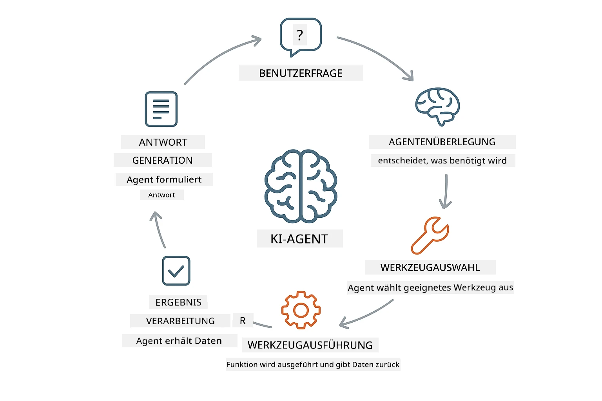
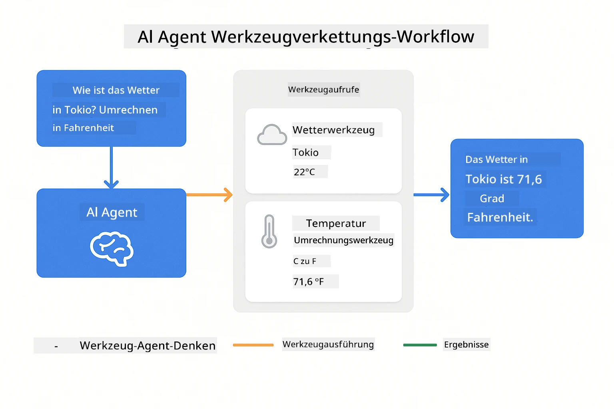

<!--
CO_OP_TRANSLATOR_METADATA:
{
  "original_hash": "844788938b26242f3cc54ce0d0951bea",
  "translation_date": "2026-01-05T21:28:26+00:00",
  "source_file": "04-tools/README.md",
  "language_code": "de"
}
-->
# Modul 04: KI-Agenten mit Tools

## Inhaltsverzeichnis

- [Was Sie lernen werden](../../../04-tools)
- [Voraussetzungen](../../../04-tools)
- [Verständnis von KI-Agenten mit Tools](../../../04-tools)
- [Wie Tool-Aufrufe funktionieren](../../../04-tools)
  - [Tool-Definitionen](../../../04-tools)
  - [Entscheidungsfindung](../../../04-tools)
  - [Ausführung](../../../04-tools)
  - [Antwortgenerierung](../../../04-tools)
- [Tool-Verkettung](../../../04-tools)
- [Anwendung starten](../../../04-tools)
- [Anwendung verwenden](../../../04-tools)
  - [Einfache Tool-Nutzung ausprobieren](../../../04-tools)
  - [Tool-Verkettung testen](../../../04-tools)
  - [Gesprächsverlauf ansehen](../../../04-tools)
  - [Mit verschiedenen Anfragen experimentieren](../../../04-tools)
- [Wichtige Konzepte](../../../04-tools)
  - [ReAct-Muster (Reasoning and Acting)](../../../04-tools)
  - [Tool-Beschreibungen sind wichtig](../../../04-tools)
  - [Sitzungsverwaltung](../../../04-tools)
  - [Fehlerbehandlung](../../../04-tools)
- [Verfügbare Tools](../../../04-tools)
- [Wann Tool-basierte Agenten verwenden](../../../04-tools)
- [Nächste Schritte](../../../04-tools)

## Was Sie lernen werden

Bisher haben Sie gelernt, wie man Gespräche mit KI führt, Prompts effektiv strukturiert und Antworten auf Ihre Dokumente bezieht. Aber es gibt eine grundlegende Einschränkung: Sprachmodelle können nur Text generieren. Sie können nicht das Wetter prüfen, Berechnungen durchführen, Datenbanken abfragen oder mit externen Systemen interagieren.

Tools ändern das. Indem Sie dem Modell Zugang zu Funktionen geben, die es aufrufen kann, verwandeln Sie es von einem Textgenerator in einen Agenten, der Aktionen ausführen kann. Das Modell entscheidet, wann es ein Tool benötigt, welches Tool verwendet wird und welche Parameter übergeben werden. Ihr Code führt die Funktion aus und gibt das Ergebnis zurück. Das Modell integriert dieses Ergebnis in seine Antwort.

## Voraussetzungen

- Abgeschlossenes Modul 01 (Azure OpenAI-Ressourcen bereitgestellt)
- `.env`-Datei im Stammverzeichnis mit Azure-Zugangsdaten (erstellt durch `azd up` in Modul 01)

> **Hinweis:** Wenn Sie Modul 01 nicht abgeschlossen haben, folgen Sie zunächst den bereitgestellten Anweisungen zur Bereitstellung dort.

## Verständnis von KI-Agenten mit Tools

> **📝 Hinweis:** Der Begriff „Agenten“ in diesem Modul bezieht sich auf KI-Assistenten mit Tool-Aufruf-Fähigkeiten. Dies unterscheidet sich von den **Agentic AI**-Mustern (autonome Agenten mit Planung, Gedächtnis und mehrstufigem Reasoning), die wir in [Modul 05: MCP](../05-mcp/README.md) behandeln werden.

Ein KI-Agent mit Tools folgt einem Muster von Überlegung und Handlung (ReAct):

1. Der Benutzer stellt eine Frage  
2. Der Agent überlegt, was er wissen muss  
3. Der Agent entscheidet, ob er ein Tool benötigt, um zu antworten  
4. Falls ja, ruft der Agent das passende Tool mit den richtigen Parametern auf  
5. Das Tool führt aus und liefert Daten zurück  
6. Der Agent integriert das Ergebnis und gibt die finale Antwort  



*Das ReAct-Muster – wie KI-Agenten zwischen Überlegung und Handlung wechseln, um Probleme zu lösen*

Dies geschieht automatisch. Sie definieren die Tools und deren Beschreibungen. Das Modell trifft die Entscheidungen darüber, wann und wie es sie verwendet.

## Wie Tool-Aufrufe funktionieren

### Tool-Definitionen

[WeatherTool.java](../../../04-tools/src/main/java/com/example/langchain4j/agents/tools/WeatherTool.java) | [TemperatureTool.java](../../../04-tools/src/main/java/com/example/langchain4j/agents/tools/TemperatureTool.java)

Sie definieren Funktionen mit klaren Beschreibungen und Parameterspezifikationen. Das Modell sieht diese Beschreibungen in seinem Systemprompt und versteht, was jedes Tool macht.

```java
@Component
public class WeatherTool {
    
    @Tool("Get the current weather for a location")
    public String getCurrentWeather(@P("Location name") String location) {
        // Ihre Wetterabfrage-Logik
        return "Weather in " + location + ": 22°C, cloudy";
    }
}

@AiService
public interface Assistant {
    String chat(@MemoryId String sessionId, @UserMessage String message);
}

// Der Assistent wird automatisch von Spring Boot verbunden mit:
// - ChatModel Bean
// - Alle @Tool-Methoden aus @Component-Klassen
// - ChatMemoryProvider für Sitzungsverwaltung
```

> **🤖 Probieren Sie es mit [GitHub Copilot](https://github.com/features/copilot) Chat:** Öffnen Sie [`WeatherTool.java`](../../../04-tools/src/main/java/com/example/langchain4j/agents/tools/WeatherTool.java) und fragen Sie:  
> - „Wie integriere ich eine echte Wetter-API wie OpenWeatherMap anstelle von Mock-Daten?“  
> - „Was macht eine gute Tool-Beschreibung aus, die der KI hilft, sie richtig zu nutzen?“  
> - „Wie gehe ich mit API-Fehlern und Rate Limits in Tool-Implementierungen um?“

### Entscheidungsfindung

Wenn ein Benutzer fragt „Wie ist das Wetter in Seattle?“, erkennt das Modell, dass es das Wetter-Tool benötigt. Es generiert einen Funktionsaufruf mit dem Standortparameter „Seattle“.

### Ausführung

[AgentService.java](../../../04-tools/src/main/java/com/example/langchain4j/agents/service/AgentService.java)

Spring Boot verdrahtet die deklarativen `@AiService`-Schnittstellen automatisch mit allen registrierten Tools, und LangChain4j führt die Tool-Aufrufe eigenständig aus.

> **🤖 Probieren Sie es mit [GitHub Copilot](https://github.com/features/copilot) Chat:** Öffnen Sie [`AgentService.java`](../../../04-tools/src/main/java/com/example/langchain4j/agents/service/AgentService.java) und fragen Sie:  
> - „Wie funktioniert das ReAct-Muster und warum ist es effektiv für KI-Agenten?“  
> - „Wie entscheidet der Agent, welches Tool er in welcher Reihenfolge verwendet?“  
> - „Was passiert, wenn die Ausführung eines Tools fehlschlägt – wie sollte ich Fehler robust behandeln?“

### Antwortgenerierung

Das Modell erhält die Wetterdaten und formatiert sie zu einer natürlichen Sprachantwort für den Benutzer.

### Warum deklarative KI-Services verwenden?

Dieses Modul nutzt LangChain4j’s Spring Boot-Integration mit deklarativen `@AiService`-Schnittstellen:

- **Spring Boot Auto-Wiring** – ChatModel und Tools werden automatisch injiziert  
- **`@MemoryId`-Muster** – Automatische speicherbasierte Sitzungsverwaltung  
- **Einzelinstanz** – Assistent wird einmal erstellt und für bessere Performance wiederverwendet  
- **Typsichere Ausführung** – Java-Methoden werden direkt mit Typumwandlung aufgerufen  
- **Mehrstufige Orchestrierung** – Handhabt Tool-Verkettung automatisch  
- **Kein Boilerplate** – Keine manuellen `AiServices.builder()`-Aufrufe oder Memory-HashMap

Alternative Ansätze (manuelle `AiServices.builder()`) erfordern mehr Code und verzichten auf Spring Boot-Integrationsvorteile.

## Tool-Verkettung

**Tool-Verkettung** – Die KI kann mehrere Tools nacheinander aufrufen. Stellen Sie die Frage „Wie ist das Wetter in Seattle und soll ich einen Regenschirm mitnehmen?“ und beobachten Sie, wie sie `getCurrentWeather` mit Überlegungen zum Regenschutz verknüpft.

<a href="images/tool-chaining.png"></a>

*Sequenzielle Tool-Aufrufe – die Ausgabe eines Tools fließt in die nächste Entscheidung ein*

**Elegante Fehlerschläge** – Bitten Sie um Wetterinformationen für eine Stadt, die nicht in den Mock-Daten steht. Das Tool gibt eine Fehlermeldung zurück und die KI erklärt, dass sie nicht helfen kann. Tools fallen sicher aus.

Dies geschieht in einem einzigen Gesprächszug. Der Agent orchestriert mehrere Tool-Aufrufe eigenständig.

## Anwendung starten

**Bereitstellung überprüfen:**

Stellen Sie sicher, dass die `.env`-Datei im Stammverzeichnis mit Azure-Zugangsdaten existiert (erstellt während Modul 01):  
```bash
cat ../.env  # Sollte AZURE_OPENAI_ENDPOINT, API_KEY, DEPLOYMENT anzeigen
```
  
**Anwendung starten:**

> **Hinweis:** Wenn Sie bereits alle Anwendungen mit `./start-all.sh` aus Modul 01 gestartet haben, läuft dieses Modul bereits auf Port 8084. Sie können die Startbefehle unten überspringen und direkt zu http://localhost:8084 wechseln.

**Option 1: Spring Boot Dashboard verwenden (Empfohlen für VS Code Nutzer)**

Der Dev-Container enthält die Spring Boot Dashboard-Erweiterung, welche eine visuelle Oberfläche zur Verwaltung aller Spring Boot-Anwendungen bietet. Sie finden sie in der Aktivitätsleiste links in VS Code (Symbol mit Spring Boot-Logo).

Im Spring Boot Dashboard können Sie:  
- Alle verfügbaren Spring Boot-Anwendungen im Workspace sehen  
- Anwendungen mit einem Klick starten/beenden  
- Anwendungsprotokolle in Echtzeit ansehen  
- Anwendungsstatus überwachen  

Klicken Sie einfach auf den Play-Button neben „tools“, um dieses Modul zu starten, oder starten Sie alle Module auf einmal.


**Option 2: Shell-Skripte verwenden**

Starten Sie alle Webanwendungen (Module 01–04):

**Bash:**  
```bash
cd ..  # Vom Root-Verzeichnis
./start-all.sh
```
  
**PowerShell:**  
```powershell
cd ..  # Vom Stammverzeichnis
.\start-all.ps1
```
  
Oder starten Sie nur dieses Modul:

**Bash:**  
```bash
cd 04-tools
./start.sh
```
  
**PowerShell:**  
```powershell
cd 04-tools
.\start.ps1
```
  
Beide Skripte laden automatisch Umgebungsvariablen aus der `.env`-Datei im Stammverzeichnis und bauen die JARs, falls diese nicht existieren.

> **Hinweis:** Falls Sie alle Module manuell vor dem Start bauen möchten:  
>  
> **Bash:**  
> ```bash
> cd ..  # Go to root directory
> mvn clean package -DskipTests
> ```
  
> **PowerShell:**  
> ```powershell
> cd ..  # Go to root directory
> mvn clean package -DskipTests
> ```
  
Öffnen Sie http://localhost:8084 im Browser.

**Zum Beenden:**

**Bash:**  
```bash
./stop.sh  # Nur dieses Modul
# Oder
cd .. && ./stop-all.sh  # Alle Module
```
  
**PowerShell:**  
```powershell
.\stop.ps1  # Nur dieses Modul
# Oder
cd ..; .\stop-all.ps1  # Alle Module
```
  
## Anwendung verwenden

Die Anwendung bietet eine Weboberfläche, auf der Sie mit einem KI-Agenten interagieren können, der Zugriff auf Wetter- und Temperaturumrechner-Tools hat.

<a href="images/tools-homepage.png"></a>

*Das KI-Agent Tools-Interface – schnelle Beispiele und Chat-Oberfläche zur Interaktion mit Tools*

### Einfache Tool-Nutzung ausprobieren

Beginnen Sie mit einer einfachen Anfrage: „Konvertiere 100 Grad Fahrenheit in Celsius“. Der Agent erkennt, dass er das Temperatur-Tool benötigt, ruft es mit den richtigen Parametern auf und gibt das Ergebnis zurück. Beachten Sie, wie natürlich das wirkt – Sie müssen nicht angeben, welches Tool verwendet oder wie es aufgerufen werden soll.

### Tool-Verkettung testen

Probieren Sie jetzt eine komplexere Frage: „Wie ist das Wetter in Seattle und konvertiere es in Fahrenheit?“ Beobachten Sie, wie der Agent das schrittweise bearbeitet. Er ruft zuerst die Wetterdaten ab (die in Celsius zurückgegeben werden), erkennt den Bedarf zur Umrechnung in Fahrenheit, nutzt das Umrechnungstool und kombiniert beide Ergebnisse in einer Antwort.

### Gesprächsverlauf ansehen

Die Chat-Oberfläche speichert den Gesprächsverlauf, sodass Sie mehrstufige Interaktionen führen können. Sie können alle bisherigen Anfragen und Antworten sehen, was es einfach macht, den Kontext zu verfolgen und zu verstehen, wie der Agent über mehrere Austausche Kontext aufbaut.

<a href="images/tools-conversation-demo.png"></a>

*Mehrstufiges Gespräch mit einfachen Umrechnungen, Wetterabfragen und Tool-Verkettung*

### Mit verschiedenen Anfragen experimentieren

Probieren Sie verschiedene Kombinationen:  
- Wetterabfragen: „Wie ist das Wetter in Tokio?“  
- Temperaturumrechnungen: „Was sind 25°C in Kelvin?“  
- Kombinierte Abfragen: „Prüfe das Wetter in Paris und sag mir, ob es über 20°C ist“  

Beachten Sie, wie der Agent natürliche Sprache interpretiert und in passende Tool-Aufrufe übersetzt.

## Wichtige Konzepte

### ReAct-Muster (Reasoning and Acting)

Der Agent wechselt zwischen Überlegung (Entscheiden, was zu tun ist) und Handeln (Tools verwenden). Dieses Muster ermöglicht autonomes Problemlösen anstatt nur auf Anweisungen zu reagieren.

### Tool-Beschreibungen sind wichtig

Die Qualität Ihrer Tool-Beschreibungen beeinflusst direkt, wie gut der Agent sie nutzt. Klare, spezifische Beschreibungen helfen dem Modell zu verstehen, wann und wie jedes Tool aufzurufen ist.

### Sitzungsverwaltung

Die Annotation `@MemoryId` ermöglicht automatische speicherbasierte Sitzungsverwaltung. Jede Sitzungs-ID erhält eine eigene `ChatMemory`-Instanz, verwaltet vom `ChatMemoryProvider`-Bean, was manuelle Speicherüberwachung überflüssig macht.

### Fehlerbehandlung

Tools können fehlschlagen – APIs können Zeitüberschreitungen haben, Parameter können ungültig sein, externe Dienste können ausfallen. Produktionsagenten benötigen Fehlerbehandlung, damit das Modell Probleme erklären oder Alternativen versuchen kann.

## Verfügbare Tools

**Wetter-Tools** (Mock-Daten für Demonstration):  
- Aktuelles Wetter für einen Standort abrufen  
- Mehrtägige Wettervorhersage abrufen  

**Temperatur-Umrechnungstools:**  
- Celsius zu Fahrenheit  
- Fahrenheit zu Celsius  
- Celsius zu Kelvin  
- Kelvin zu Celsius  
- Fahrenheit zu Kelvin  
- Kelvin zu Fahrenheit  

Dies sind einfache Beispiele, aber das Muster lässt sich auf jede Funktion erweitern: Datenbankabfragen, API-Aufrufe, Berechnungen, Dateioperationen oder Systembefehle.

## Wann Tool-basierte Agenten verwenden

**Tools verwenden, wenn:**  
- Antworten Echtzeitdaten benötigen (Wetter, Aktienkurse, Lagerbestände)  
- Sie Berechnungen über einfache Mathematik hinaus durchführen müssen  
- Datenbanken oder APIs abgefragt werden sollen  
- Aktionen auszuführen sind (E-Mails senden, Tickets erstellen, Datensätze aktualisieren)  
- Mehrere Datenquellen kombiniert werden sollen  

**Tools nicht verwenden, wenn:**  
- Fragen aus allgemeinem Wissen beantwortet werden können  
- Die Antwort rein konversationell ist  
- Tool-Latenzen das Erlebnis zu langsam machen würden  

## Nächste Schritte

**Nächstes Modul:** [05-mcp - Model Context Protocol (MCP)](../05-mcp/README.md)

---

**Navigation:** [← Vorheriges: Modul 03 - RAG](../03-rag/README.md) | [Zurück zur Hauptseite](../README.md) | [Nächstes: Modul 05 - MCP →](../05-mcp/README.md)

---

<!-- CO-OP TRANSLATOR DISCLAIMER START -->
**Haftungsausschluss**:  
Dieses Dokument wurde mithilfe des KI-Übersetzungsdienstes [Co-op Translator](https://github.com/Azure/co-op-translator) übersetzt. Obwohl wir uns um Genauigkeit bemühen, weisen wir darauf hin, dass automatisierte Übersetzungen Fehler oder Ungenauigkeiten enthalten können. Das Originaldokument in der Ursprungssprache ist als maßgebliche Quelle zu betrachten. Für wichtige Informationen wird eine professionelle menschliche Übersetzung empfohlen. Wir übernehmen keine Haftung für etwaige Missverständnisse oder Fehlinterpretationen, die durch die Nutzung dieser Übersetzung entstehen.
<!-- CO-OP TRANSLATOR DISCLAIMER END -->