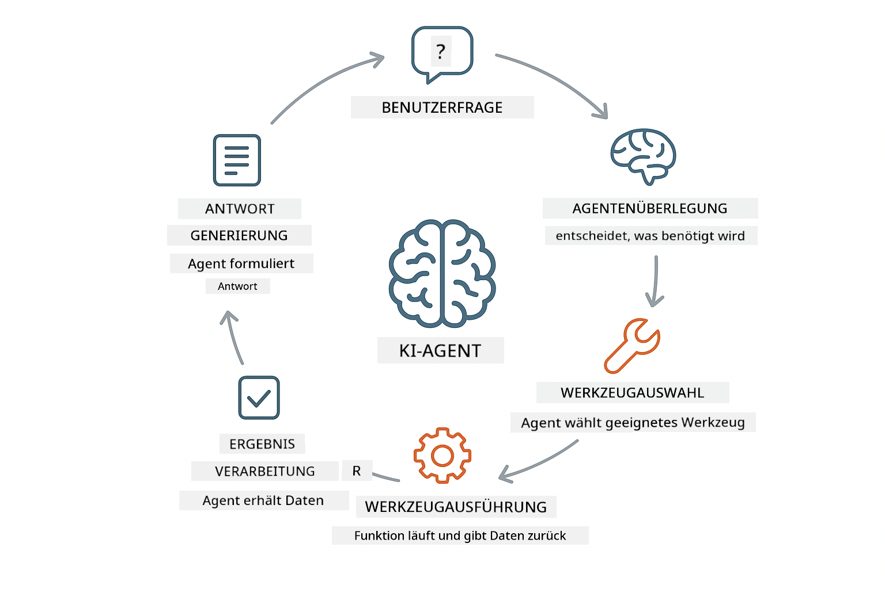
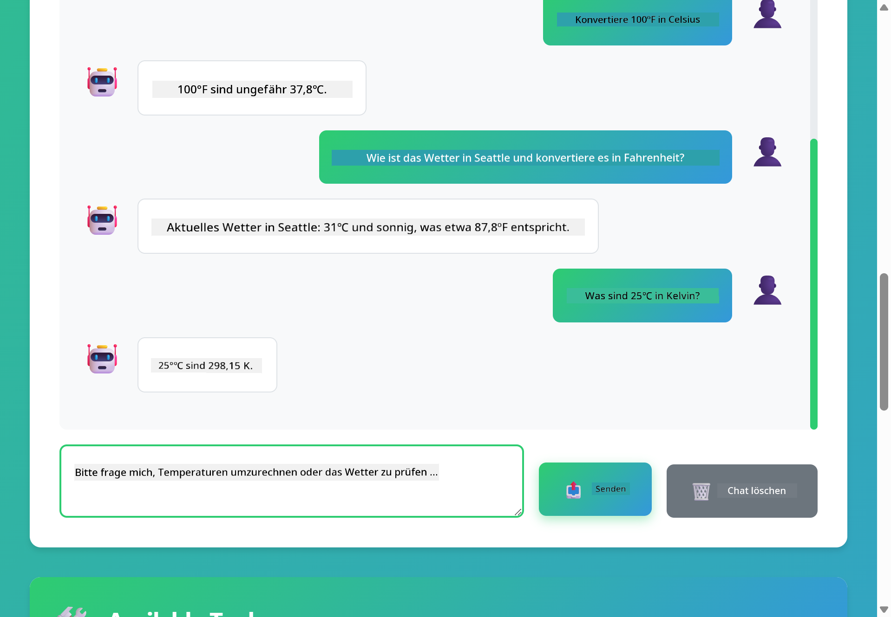

<!--
CO_OP_TRANSLATOR_METADATA:
{
  "original_hash": "aa23f106e7f53270924c9dd39c629004",
  "translation_date": "2025-12-13T18:21:25+00:00",
  "source_file": "04-tools/README.md",
  "language_code": "de"
}
-->
# Modul 04: KI-Agenten mit Tools

## Inhaltsverzeichnis

- [Was Sie lernen werden](../../../04-tools)
- [Voraussetzungen](../../../04-tools)
- [Verständnis von KI-Agenten mit Tools](../../../04-tools)
- [Wie Tool-Aufrufe funktionieren](../../../04-tools)
  - [Tool-Definitionen](../../../04-tools)
  - [Entscheidungsfindung](../../../04-tools)
  - [Ausführung](../../../04-tools)
  - [Antwortgenerierung](../../../04-tools)
- [Tool-Verkettung](../../../04-tools)
- [Anwendung starten](../../../04-tools)
- [Anwendung verwenden](../../../04-tools)
  - [Einfache Tool-Nutzung ausprobieren](../../../04-tools)
  - [Tool-Verkettung testen](../../../04-tools)
  - [Gesprächsverlauf ansehen](../../../04-tools)
  - [Das Nachdenken beobachten](../../../04-tools)
  - [Mit verschiedenen Anfragen experimentieren](../../../04-tools)
- [Wichtige Konzepte](../../../04-tools)
  - [ReAct-Muster (Reasoning and Acting)](../../../04-tools)
  - [Tool-Beschreibungen sind wichtig](../../../04-tools)
  - [Sitzungsverwaltung](../../../04-tools)
  - [Fehlerbehandlung](../../../04-tools)
- [Verfügbare Tools](../../../04-tools)
- [Wann man tool-basierte Agenten verwendet](../../../04-tools)
- [Nächste Schritte](../../../04-tools)

## Was Sie lernen werden

Bisher haben Sie gelernt, wie man Gespräche mit KI führt, Eingabeaufforderungen effektiv strukturiert und Antworten auf Ihre Dokumente stützt. Aber es gibt noch eine grundlegende Einschränkung: Sprachmodelle können nur Text generieren. Sie können nicht das Wetter prüfen, Berechnungen durchführen, Datenbanken abfragen oder mit externen Systemen interagieren.

Tools ändern das. Indem Sie dem Modell Zugriff auf Funktionen geben, die es aufrufen kann, verwandeln Sie es von einem Textgenerator in einen Agenten, der Aktionen ausführen kann. Das Modell entscheidet, wann es ein Tool benötigt, welches Tool es verwendet und welche Parameter es übergibt. Ihr Code führt die Funktion aus und gibt das Ergebnis zurück. Das Modell integriert dieses Ergebnis in seine Antwort.

## Voraussetzungen

- Abgeschlossenes Modul 01 (Azure OpenAI-Ressourcen bereitgestellt)
- `.env`-Datei im Stammverzeichnis mit Azure-Zugangsdaten (erstellt durch `azd up` in Modul 01)

> **Hinweis:** Wenn Sie Modul 01 noch nicht abgeschlossen haben, folgen Sie zuerst den dortigen Bereitstellungsanweisungen.

## Verständnis von KI-Agenten mit Tools

Ein KI-Agent mit Tools folgt einem Muster aus Nachdenken und Handeln (ReAct):

1. Der Benutzer stellt eine Frage
2. Der Agent überlegt, was er wissen muss
3. Der Agent entscheidet, ob er ein Tool zur Antwort benötigt
4. Falls ja, ruft der Agent das passende Tool mit den richtigen Parametern auf
5. Das Tool führt aus und liefert Daten zurück
6. Der Agent integriert das Ergebnis und gibt die finale Antwort



*Das ReAct-Muster – wie KI-Agenten zwischen Nachdenken und Handeln wechseln, um Probleme zu lösen*

Dies geschieht automatisch. Sie definieren die Tools und deren Beschreibungen. Das Modell übernimmt die Entscheidungsfindung, wann und wie es sie verwendet.

## Wie Tool-Aufrufe funktionieren

**Tool-Definitionen** – [WeatherTool.java](../../../04-tools/src/main/java/com/example/langchain4j/agents/tools/WeatherTool.java) | [TemperatureTool.java](../../../04-tools/src/main/java/com/example/langchain4j/agents/tools/TemperatureTool.java)

Sie definieren Funktionen mit klaren Beschreibungen und Parameterspezifikationen. Das Modell sieht diese Beschreibungen in seinem System-Prompt und versteht, was jedes Tool macht.

```java
@Component
public class WeatherTool {
    
    @Tool("Get the current weather for a location")
    public String getCurrentWeather(@P("Location name") String location) {
        // Ihre Wetterabfrage-Logik
        return "Weather in " + location + ": 22°C, cloudy";
    }
}

@AiService
public interface Assistant {
    String chat(@MemoryId String sessionId, @UserMessage String message);
}

// Der Assistent wird automatisch von Spring Boot verbunden mit:
// - ChatModel Bean
// - Alle @Tool-Methoden aus @Component-Klassen
// - ChatMemoryProvider für Sitzungsverwaltung
```

> **🤖 Probieren Sie es mit [GitHub Copilot](https://github.com/features/copilot) Chat:** Öffnen Sie [`WeatherTool.java`](../../../04-tools/src/main/java/com/example/langchain4j/agents/tools/WeatherTool.java) und fragen Sie:
> - „Wie würde ich eine echte Wetter-API wie OpenWeatherMap anstelle von Mock-Daten integrieren?“
> - „Was macht eine gute Tool-Beschreibung aus, die der KI hilft, es korrekt zu verwenden?“
> - „Wie gehe ich mit API-Fehlern und Rate Limits in Tool-Implementierungen um?“

**Entscheidungsfindung**

Wenn ein Benutzer fragt „Wie ist das Wetter in Seattle?“, erkennt das Modell, dass es das Wetter-Tool benötigt. Es generiert einen Funktionsaufruf mit dem Parameter Standort auf „Seattle“ gesetzt.

**Ausführung** – [AgentService.java](../../../04-tools/src/main/java/com/example/langchain4j/agents/service/AgentService.java)

Spring Boot verdrahtet automatisch die deklarative `@AiService`-Schnittstelle mit allen registrierten Tools, und LangChain4j führt Tool-Aufrufe automatisch aus.

> **🤖 Probieren Sie es mit [GitHub Copilot](https://github.com/features/copilot) Chat:** Öffnen Sie [`AgentService.java`](../../../04-tools/src/main/java/com/example/langchain4j/agents/service/AgentService.java) und fragen Sie:
> - „Wie funktioniert das ReAct-Muster und warum ist es effektiv für KI-Agenten?“
> - „Wie entscheidet der Agent, welches Tool er verwendet und in welcher Reihenfolge?“
> - „Was passiert, wenn die Ausführung eines Tools fehlschlägt – wie sollte ich Fehler robust behandeln?“

**Antwortgenerierung**

Das Modell erhält die Wetterdaten und formatiert sie in eine natürlichsprachliche Antwort für den Benutzer.

### Warum deklarative AI-Services verwenden?

Dieses Modul nutzt LangChain4js Spring Boot-Integration mit deklarativen `@AiService`-Schnittstellen:

- **Spring Boot Auto-Wiring** – ChatModel und Tools werden automatisch injiziert
- **@MemoryId-Muster** – Automatische sitzungsbasierte Speicherverwaltung
- **Einzelinstanz** – Assistent wird einmal erstellt und für bessere Leistung wiederverwendet
- **Typensichere Ausführung** – Java-Methoden werden direkt mit Typkonvertierung aufgerufen
- **Multi-Turn-Orchestrierung** – Handhabt Tool-Verkettung automatisch
- **Kein Boilerplate** – Keine manuellen AiServices.builder()-Aufrufe oder Memory-HashMaps

Alternative Ansätze (manuelles `AiServices.builder()`) erfordern mehr Code und verzichten auf die Vorteile der Spring Boot-Integration.

## Tool-Verkettung

**Tool-Verkettung** – Die KI kann mehrere Tools nacheinander aufrufen. Fragen Sie „Wie ist das Wetter in Seattle und soll ich einen Regenschirm mitnehmen?“ und beobachten Sie, wie es `getCurrentWeather` mit Überlegungen zur Regenausrüstung verknüpft.

<a href="images/tool-chaining.png"></a>

*Sequenzielle Tool-Aufrufe – die Ausgabe eines Tools fließt in die nächste Entscheidung ein*

**Sanfte Fehler** – Fragen Sie nach dem Wetter in einer Stadt, die nicht in den Mock-Daten enthalten ist. Das Tool gibt eine Fehlermeldung zurück, und die KI erklärt, dass sie nicht helfen kann. Tools schlagen sicher fehl.

Dies geschieht in einem einzigen Gesprächszug. Der Agent orchestriert mehrere Tool-Aufrufe autonom.

## Anwendung starten

**Bereitstellung überprüfen:**

Stellen Sie sicher, dass die `.env`-Datei im Stammverzeichnis mit Azure-Zugangsdaten existiert (wurde während Modul 01 erstellt):
```bash
cat ../.env  # Sollte AZURE_OPENAI_ENDPOINT, API_KEY, DEPLOYMENT anzeigen
```

**Anwendung starten:**

> **Hinweis:** Wenn Sie bereits alle Anwendungen mit `./start-all.sh` aus Modul 01 gestartet haben, läuft dieses Modul bereits auf Port 8084. Sie können die Startbefehle unten überspringen und direkt http://localhost:8084 aufrufen.

**Option 1: Verwendung des Spring Boot Dashboards (empfohlen für VS Code-Nutzer)**

Der Dev-Container enthält die Spring Boot Dashboard-Erweiterung, die eine visuelle Oberfläche zur Verwaltung aller Spring Boot-Anwendungen bietet. Sie finden sie in der Aktivitätsleiste links in VS Code (Suchen Sie nach dem Spring Boot-Symbol).

Im Spring Boot Dashboard können Sie:
- Alle verfügbaren Spring Boot-Anwendungen im Workspace sehen
- Anwendungen mit einem Klick starten/stoppen
- Anwendungsprotokolle in Echtzeit ansehen
- Anwendungsstatus überwachen

Klicken Sie einfach auf den Play-Button neben „tools“, um dieses Modul zu starten, oder starten Sie alle Module gleichzeitig.


**Option 2: Verwendung von Shell-Skripten**

Starten Sie alle Webanwendungen (Module 01-04):

**Bash:**
```bash
cd ..  # Vom Stammverzeichnis
./start-all.sh
```

**PowerShell:**
```powershell
cd ..  # Vom Stammverzeichnis
.\start-all.ps1
```

Oder starten Sie nur dieses Modul:

**Bash:**
```bash
cd 04-tools
./start.sh
```

**PowerShell:**
```powershell
cd 04-tools
.\start.ps1
```

Beide Skripte laden automatisch Umgebungsvariablen aus der `.env`-Datei im Stammverzeichnis und bauen die JARs, falls sie nicht existieren.

> **Hinweis:** Wenn Sie alle Module manuell vor dem Start bauen möchten:
>
> **Bash:**
> ```bash
> cd ..  # Go to root directory
> mvn clean package -DskipTests
> ```
>
> **PowerShell:**
> ```powershell
> cd ..  # Go to root directory
> mvn clean package -DskipTests
> ```

Öffnen Sie http://localhost:8084 in Ihrem Browser.

**Zum Stoppen:**

**Bash:**
```bash
./stop.sh  # Nur dieses Modul
# Oder
cd .. && ./stop-all.sh  # Alle Module
```

**PowerShell:**
```powershell
.\stop.ps1  # Nur dieses Modul
# Oder
cd ..; .\stop-all.ps1  # Alle Module
```

## Anwendung verwenden

Die Anwendung bietet eine Weboberfläche, über die Sie mit einem KI-Agenten interagieren können, der Zugriff auf Wetter- und Temperaturumrechnungstools hat.

<a href="images/tools-homepage.png"></a>

*Die AI Agent Tools-Oberfläche – schnelle Beispiele und Chat-Interface zur Interaktion mit Tools*

**Einfache Tool-Nutzung ausprobieren**

Beginnen Sie mit einer einfachen Anfrage: „Konvertiere 100 Grad Fahrenheit in Celsius“. Der Agent erkennt, dass er das Temperaturumrechnungstool benötigt, ruft es mit den richtigen Parametern auf und gibt das Ergebnis zurück. Beachten Sie, wie natürlich sich das anfühlt – Sie haben nicht angegeben, welches Tool verwendet werden soll oder wie es aufgerufen wird.

**Tool-Verkettung testen**

Probieren Sie nun etwas Komplexeres: „Wie ist das Wetter in Seattle und konvertiere es in Fahrenheit?“ Beobachten Sie, wie der Agent dies schrittweise bearbeitet. Er holt zuerst das Wetter (das in Celsius zurückgegeben wird), erkennt, dass er in Fahrenheit umrechnen muss, ruft das Umrechnungstool auf und kombiniert beide Ergebnisse in einer Antwort.

**Gesprächsverlauf ansehen**

Das Chat-Interface speichert den Gesprächsverlauf, sodass Sie mehrstufige Interaktionen führen können. Sie sehen alle vorherigen Anfragen und Antworten, was es einfach macht, das Gespräch nachzuvollziehen und zu verstehen, wie der Agent Kontext über mehrere Austausche aufbaut.

<a href="images/tools-conversation-demo.png"></a>

*Mehrstufiges Gespräch mit einfachen Umrechnungen, Wetterabfragen und Tool-Verkettung*

**Mit verschiedenen Anfragen experimentieren**

Probieren Sie verschiedene Kombinationen aus:
- Wetterabfragen: „Wie ist das Wetter in Tokio?“
- Temperaturumrechnungen: „Wie viel sind 25 °C in Kelvin?“
- Kombinierte Anfragen: „Prüfe das Wetter in Paris und sag mir, ob es über 20 °C ist“

Beachten Sie, wie der Agent natürliche Sprache interpretiert und in passende Tool-Aufrufe übersetzt.

## Wichtige Konzepte

**ReAct-Muster (Reasoning and Acting)**

Der Agent wechselt zwischen Nachdenken (Entscheiden, was zu tun ist) und Handeln (Tools verwenden). Dieses Muster ermöglicht autonomes Problemlösen statt nur auf Anweisungen zu reagieren.

**Tool-Beschreibungen sind wichtig**

Die Qualität Ihrer Tool-Beschreibungen beeinflusst direkt, wie gut der Agent sie verwendet. Klare, spezifische Beschreibungen helfen dem Modell zu verstehen, wann und wie es jedes Tool aufruft.

**Sitzungsverwaltung**

Die `@MemoryId`-Annotation ermöglicht automatische sitzungsbasierte Speicherverwaltung. Jede Sitzungs-ID erhält eine eigene `ChatMemory`-Instanz, die vom `ChatMemoryProvider`-Bean verwaltet wird, wodurch manuelles Speichermanagement entfällt.

**Fehlerbehandlung**

Tools können fehlschlagen – APIs können Zeitüberschreitungen haben, Parameter ungültig sein, externe Dienste ausfallen. Produktionsagenten benötigen Fehlerbehandlung, damit das Modell Probleme erklären oder Alternativen versuchen kann.

## Verfügbare Tools

**Wetter-Tools** (Mock-Daten zur Demonstration):
- Aktuelles Wetter für einen Ort abrufen
- Mehrtägige Vorhersage abrufen

**Temperaturumrechnungstools**:
- Celsius zu Fahrenheit
- Fahrenheit zu Celsius
- Celsius zu Kelvin
- Kelvin zu Celsius
- Fahrenheit zu Kelvin
- Kelvin zu Fahrenheit

Dies sind einfache Beispiele, aber das Muster lässt sich auf jede Funktion erweitern: Datenbankabfragen, API-Aufrufe, Berechnungen, Dateioperationen oder Systembefehle.

## Wann man tool-basierte Agenten verwendet

**Verwenden Sie Tools, wenn:**
- Antworten Echtzeitdaten erfordern (Wetter, Aktienkurse, Lagerbestand)
- Sie Berechnungen über einfache Mathematik hinaus durchführen müssen
- Zugriff auf Datenbanken oder APIs benötigt wird
- Aktionen ausgeführt werden sollen (E-Mails senden, Tickets erstellen, Datensätze aktualisieren)
- Mehrere Datenquellen kombiniert werden sollen

**Verwenden Sie keine Tools, wenn:**
- Fragen aus allgemeinem Wissen beantwortet werden können
- Die Antwort rein konversationell ist
- Tool-Latenz das Erlebnis zu langsam machen würde

## Nächste Schritte

**Nächstes Modul:** [05-mcp - Model Context Protocol (MCP)](../05-mcp/README.md)

---

**Navigation:** [← Vorheriges: Modul 03 - RAG](../03-rag/README.md) | [Zurück zur Übersicht](../README.md) | [Nächstes: Modul 05 - MCP →](../05-mcp/README.md)

---

<!-- CO-OP TRANSLATOR DISCLAIMER START -->
**Haftungsausschluss**:  
Dieses Dokument wurde mit dem KI-Übersetzungsdienst [Co-op Translator](https://github.com/Azure/co-op-translator) übersetzt. Obwohl wir uns um Genauigkeit bemühen, beachten Sie bitte, dass automatisierte Übersetzungen Fehler oder Ungenauigkeiten enthalten können. Das Originaldokument in seiner Ursprungssprache gilt als maßgebliche Quelle. Für wichtige Informationen wird eine professionelle menschliche Übersetzung empfohlen. Wir übernehmen keine Haftung für Missverständnisse oder Fehlinterpretationen, die aus der Nutzung dieser Übersetzung entstehen.
<!-- CO-OP TRANSLATOR DISCLAIMER END -->