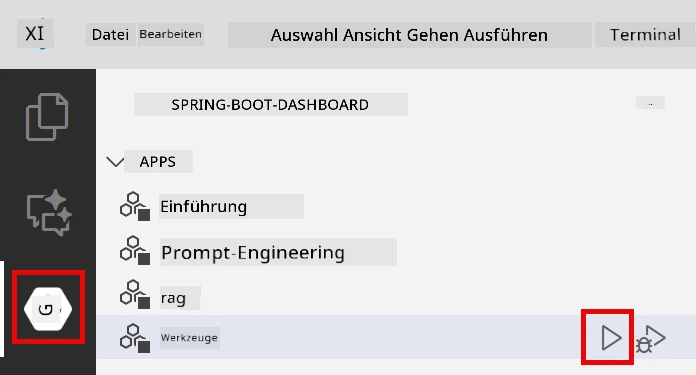
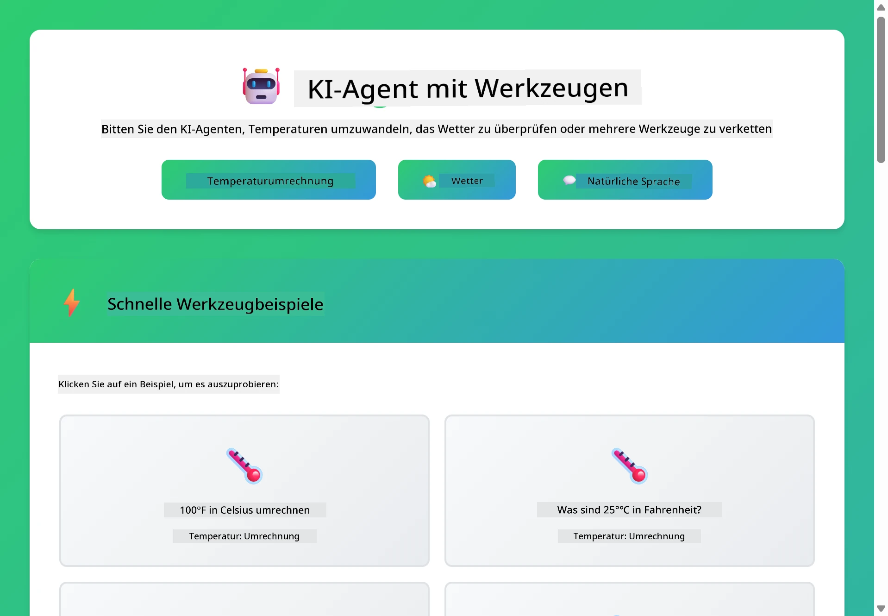
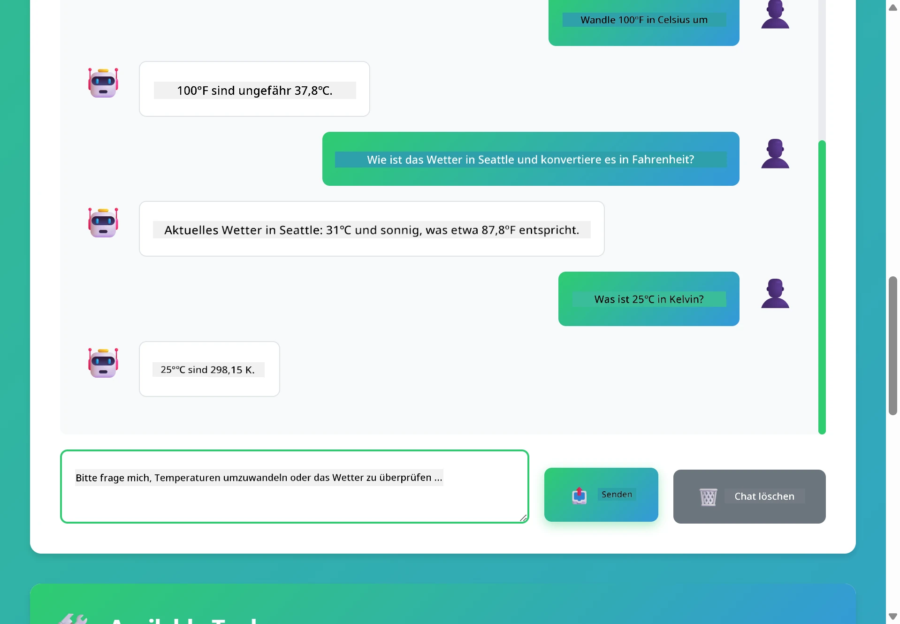

# Modul 04: KI-Agenten mit Tools

## Inhaltsverzeichnis

- [Video-Durchgang](#video-durchgang)
- [Was Sie lernen werden](#was-sie-lernen-werden)
- [Voraussetzungen](#voraussetzungen)
- [Verständnis von KI-Agenten mit Tools](#verständnis-von-ki-agenten-mit-tools)
- [Wie Tool-Aufrufe funktionieren](#wie-tool-aufrufe-funktionieren)
  - [Tool-Definitionen](#tool-definitionen)
  - [Entscheidungsfindung](#entscheidungsfindung)
  - [Ausführung](#ausführung)
  - [Antwortgenerierung](#antwortgenerierung)
  - [Architektur: Spring Boot Auto-Wiring](#architektur-spring-boot-auto-wiring)
- [Tool-Verkettung](#tool-verkettung)
- [Anwendung starten](#anwendung-starten)
- [Die Anwendung verwenden](#verwendung-der-anwendung)
  - [Einfaches Tool ausprobieren](#probiere-einfache-tool-anwendungen-aus)
  - [Tool-Verkettung testen](#teste-tool-verkettung)
  - [Gesprächsablauf ansehen](#sieh-dir-den-gesprächsverlauf-an)
  - [Mit verschiedenen Anfragen experimentieren](#experimentiere-mit-verschiedenen-anfragen)
- [Wichtige Konzepte](#zentrale-konzepte)
  - [ReAct-Muster (Reasoning and Acting)](#react-muster-reasoning-and-acting)
  - [Tool-Beschreibungen sind wichtig](#tool-beschreibungen-sind-wichtig)
  - [Sitzungsverwaltung](#sitzungsmanagement)
  - [Fehlerbehandlung](#fehlerbehandlung)
- [Verfügbare Tools](#verfügbare-tools)
- [Wann man tool-basierte Agenten verwendet](#wann-man-tool-basierte-agenten-verwendet)
- [Tools vs RAG](#tools-vs-rag)
- [Nächste Schritte](#nächste-schritte)

## Video-Durchgang

Sehen Sie sich diese Live-Sitzung an, die erklärt, wie Sie mit diesem Modul starten:

<a href="https://www.youtube.com/watch?v=O_J30kZc0rw"></a>

## Was Sie lernen werden

Bisher haben Sie gelernt, wie man Gespräche mit KI führt, Prompts effektiv strukturiert und Antworten an Ihre Dokumente anbindet. Aber es gibt noch eine grundlegende Einschränkung: Sprachmodelle können nur Text erzeugen. Sie können das Wetter nicht nachschlagen, keine Berechnungen durchführen, keine Datenbanken abfragen oder mit externen Systemen interagieren.

Tools ändern das. Indem Sie dem Modell Zugriff auf Funktionen geben, die es aufrufen kann, verwandeln Sie es von einem Textgenerator in einen Agenten, der Aktionen durchführen kann. Das Modell entscheidet, wann es ein Tool braucht, welches Tool es verwendet und welche Parameter es übergibt. Ihr Code führt die Funktion aus und liefert das Ergebnis zurück. Das Modell integriert dieses Ergebnis in seine Antwort.

## Voraussetzungen

- Abgeschlossenes [Modul 01 - Einführung](../01-introduction/README.md) (Azure OpenAI Ressourcen bereitgestellt)
- Empfohlene vorherige Module abgeschlossen (dieses Modul bezieht sich in der Tools-vs-RAG-Vergleich auf [RAG-Konzepte aus Modul 03](../03-rag/README.md))
- `.env` Datei im Stammverzeichnis mit Azure-Zugangsdaten (erstellt durch `azd up` in Modul 01)

> **Hinweis:** Wenn Sie Modul 01 noch nicht abgeschlossen haben, folgen Sie zunächst den dortigen Bereitstellungsanweisungen.

## Verständnis von KI-Agenten mit Tools

> **📝 Hinweis:** Der Begriff „Agenten“ in diesem Modul bezieht sich auf KI-Assistenten, die um Tool-Aufruf-Fähigkeiten erweitert sind. Dies unterscheidet sich von den **Agentic AI**-Mustern (autonome Agenten mit Planung, Gedächtnis und mehrstufigem Schlussfolgern), die wir in [Modul 05: MCP](../05-mcp/README.md) behandeln.

Ohne Tools kann ein Sprachmodell nur Text basierend auf seinen Trainingsdaten generieren. Fragt man es nach dem aktuellen Wetter, muss es raten. Mit Tools kann es eine Wetter-API aufrufen, Berechnungen durchführen oder eine Datenbank abfragen — und diese Echtzeit-Ergebnisse in seine Antwort einfließen lassen.


*Ohne Tools kann das Modell nur raten – mit Tools kann es APIs aufrufen, Berechnungen ausführen und Echtzeitdaten zurückgeben.*

Ein KI-Agent mit Tools folgt einem **Reasoning and Acting (ReAct)**-Muster. Das Modell reagiert nicht nur – es überlegt, was es braucht, handelt durch Aufruf eines Tools, beobachtet das Ergebnis und entscheidet dann, ob es erneut handeln oder die endgültige Antwort liefern soll:

1. **Überlegen** — Der Agent analysiert die Frage des Nutzers und bestimmt, welche Informationen er benötigt
2. **Handeln** — Der Agent wählt das richtige Tool aus, erstellt die korrekten Parameter und ruft es auf
3. **Beobachten** — Der Agent erhält die Ausgabe des Tools und bewertet das Ergebnis
4. **Wiederholen oder Antworten** — Wenn weitere Daten benötigt werden, wird die Schleife wiederholt; andernfalls wird eine natürliche Antwort formuliert


*Der ReAct-Zyklus — der Agent überlegt, was zu tun ist, handelt durch Tool-Aufruf, beobachtet das Ergebnis und wiederholt dies, bis er die endgültige Antwort geben kann.*

Dies geschieht automatisch. Sie definieren die Tools und deren Beschreibungen. Das Modell übernimmt die Entscheidungsfindung, wann und wie sie eingesetzt werden.

## Wie Tool-Aufrufe funktionieren

### Tool-Definitionen

[WeatherTool.java](../../../04-tools/src/main/java/com/example/langchain4j/agents/tools/WeatherTool.java) | [TemperatureTool.java](../../../04-tools/src/main/java/com/example/langchain4j/agents/tools/TemperatureTool.java)

Sie definieren Funktionen mit klaren Beschreibungen und Parameterspezifikationen. Das Modell sieht diese Beschreibungen im System-Prompt und versteht, wofür jedes Tool dient.

```java
@Component
public class WeatherTool {
    
    @Tool("Get the current weather for a location")
    public String getCurrentWeather(@P("Location name") String location) {
        // Ihre Logik zur Wetterabfrage
        return "Weather in " + location + ": 22°C, cloudy";
    }
}

@AiService
public interface Assistant {
    String chat(@MemoryId String sessionId, @UserMessage String message);
}

// Der Assistent wird automatisch von Spring Boot verbunden mit:
// - ChatModel-Bean
// - Alle @Tool-Methoden aus @Component-Klassen
// - ChatMemoryProvider für Sitzungsmanagement
```

Das folgende Diagramm erklärt jede Annotation und zeigt, wie jeder Teil der KI hilft zu verstehen, wann das Tool aufgerufen wird und welche Argumente übergeben werden:


*Anatomie einer Tool-Definition — @Tool sagt der KI, wann sie das Tool nutzen soll, @P beschreibt jeden Parameter, und @AiService verbindet alles beim Start.*

> **🤖 Probieren Sie es mit [GitHub Copilot](https://github.com/features/copilot) Chat:** Öffnen Sie [`WeatherTool.java`](../../../04-tools/src/main/java/com/example/langchain4j/agents/tools/WeatherTool.java) und fragen Sie:
> - „Wie integriere ich eine echte Wetter-API wie OpenWeatherMap anstelle von Mock-Daten?“
> - „Was macht eine gute Tool-Beschreibung aus, die der KI hilft, sie richtig zu nutzen?“
> - „Wie gehe ich mit API-Fehlern und Rate-Limits in Tool-Implementierungen um?“

### Entscheidungsfindung

Wenn ein Nutzer fragt „Wie ist das Wetter in Seattle?“, wählt das Modell nicht zufällig ein Tool aus. Es vergleicht die Absicht des Nutzers mit jeder Tool-Beschreibung, die ihm zur Verfügung steht, bewertet jede auf Relevanz und wählt die beste Übereinstimmung. Anschließend erzeugt es einen strukturierten Funktionsaufruf mit den richtigen Parametern – in diesem Fall mit `location` auf `"Seattle"` gesetzt.

Wenn kein Tool zur Anfrage passt, fällt das Modell auf seine eigenen Wissensbestände zurück. Wenn mehrere Tools passen, wählt es das spezifischste aus.


*Das Modell bewertet alle verfügbaren Tools anhand der Nutzerabsicht und wählt die beste Übereinstimmung aus – deshalb sind klare, präzise Tool-Beschreibungen so wichtig.*

### Ausführung

[AgentService.java](../../../04-tools/src/main/java/com/example/langchain4j/agents/service/AgentService.java)

Spring Boot verbindet automatisch das deklarative `@AiService`-Interface mit allen registrierten Tools, und LangChain4j führt Tool-Aufrufe automatisch aus. Im Hintergrund durchläuft ein Tool-Aufruf sechs Phasen — von der natürlichen Spracheingabe des Nutzers bis zur Antwort in natürlicher Sprache:


*Der End-to-End-Ablauf — der Nutzer stellt eine Frage, das Modell wählt ein Tool aus, LangChain4j führt es aus und das Modell verwebt das Ergebnis in eine natürliche Antwort.*

Im Hintergrund läuft `AiServices` dieselbe Tool-Aufruf-Schleife für jedes Tool – hier mit einem einfachen `Calculator` als Beispiel. Das folgende Sequenzdiagramm zeigt genau, was unter der Haube passiert:


*Die Tool-Aufruf-Schleife — `AiServices` sendet Ihre Nachricht und das Toolschema an das LLM, das LLM antwortet mit einem Funktionsaufruf wie `add(42, 58)`, LangChain4j führt die `Calculator`-Methode lokal aus und gibt das Ergebnis für die finale Antwort zurück.*

> **🤖 Probieren Sie es mit [GitHub Copilot](https://github.com/features/copilot) Chat:** Öffnen Sie [`AgentService.java`](../../../04-tools/src/main/java/com/example/langchain4j/agents/service/AgentService.java) und fragen Sie:
> - „Wie funktioniert das ReAct-Muster und warum ist es effektiv für KI-Agenten?“
> - „Wie entscheidet der Agent, welches Tool er in welcher Reihenfolge nutzt?“
> - „Was passiert, wenn die Ausführung eines Tools fehlschlägt – wie sollte ich Fehler robust handhaben?“

### Antwortgenerierung

Das Modell erhält die Wetterdaten und formatiert sie zu einer natürlichen Antwort für den Nutzer.

### Architektur: Spring Boot Auto-Wiring

Dieses Modul verwendet LangChain4js Spring Boot-Integration mit deklarativen `@AiService`-Interfaces. Beim Start entdeckt Spring Boot alle `@Component`s, die `@Tool`-Methoden enthalten, Ihre `ChatModel`-Bean und den `ChatMemoryProvider` – und verknüpft alles zu einem einzelnen `Assistant`-Interface ganz ohne Boilerplate-Code.


*Das @AiService-Interface verbindet ChatModel, Tool-Komponenten und Memory-Provider – Spring Boot übernimmt das Verkabeln automatisch.*

Hier der komplette Anforderungszyklus als Sequenzdiagramm – von der HTTP-Anfrage über Controller, Service und auto-verkabelten Proxy bis zur Tool-Ausführung und zurück:


*Der komplette Spring Boot-Anforderungszyklus — HTTP-Anfrage fließt über Controller und Service zum auto-verkabelten Assistant-Proxy, der LLM- und Tool-Aufrufe orchestriert.*

Wesentliche Vorteile dieses Ansatzes:

- **Spring Boot Auto-Wiring** — ChatModel und Tools werden automatisch injiziert
- **@MemoryId-Muster** — Automatisches Sitzungs-basiertes Speichermanagement
- **Einzelinstanz** — Assistant wird einmal erstellt und zur Leistungssteigerung wiederverwendet
- **Typensichere Ausführung** — Java-Methoden werden direkt mit Typkonvertierung aufgerufen
- **Mehrstufige Orchestrierung** — Handhabt Tool-Verkettung automatisch
- **Kein Boilerplate** — Keine manuellen `AiServices.builder()`-Aufrufe oder Memory-HashMaps

Alternative Ansätze (manuelles `AiServices.builder()`) erfordern mehr Code und bieten nicht die Vorteile der Spring Boot-Integration.

## Tool-Verkettung

**Tool-Verkettung** — Die wahre Stärke tool-basierter Agenten zeigt sich, wenn eine einzige Frage mehrere Tools benötigt. Fragt man „Wie ist das Wetter in Seattle in Fahrenheit?“, verkettet der Agent automatisch zwei Tools: Zuerst ruft er `getCurrentWeather` auf, um die Temperatur in Celsius zu erhalten, dann übergibt er diesen Wert an `celsiusToFahrenheit` zur Umrechnung – alles in einer einzigen Gesprächsrunde.


*Tool-Verkettung in Aktion — der Agent ruft zuerst getCurrentWeather auf, leitet das Celsius-Ergebnis an celsiusToFahrenheit weiter und liefert eine kombinierte Antwort.*

**Fehlereskalation vermeiden** — Fragt man das Wetter in einer Stadt, die nicht in den Mock-Daten ist, gibt das Tool eine Fehlermeldung zurück, und die KI erklärt, dass sie nicht helfen kann, anstatt abzustürzen. Tools versagen sicher. Das folgende Diagramm vergleicht beide Ansätze — mit ordentlicher Fehlerbehandlung fängt der Agent die Ausnahme ab und antwortet hilfreich, andernfalls stürzt die ganze Anwendung ab:


*Wenn ein Tool fehlschlägt, fängt der Agent den Fehler ab und gibt eine hilfreiche Erklärung, anstatt abzustürzen.*

Dies geschieht in einer einzigen Gesprächsrunde. Der Agent orchestriert mehrere Tool-Aufrufe autonom.

## Anwendung starten

**Bereitstellung überprüfen:**

Stellen Sie sicher, dass die `.env` Datei im Stammverzeichnis mit Azure-Zugangsdaten existiert (erstellt während Modul 01). Führen Sie dies im Modul-Verzeichnis (`04-tools/`) aus:

**Bash:**
```bash
cat ../.env  # Soll AZURE_OPENAI_ENDPOINT, API_KEY, DEPLOYMENT anzeigen
```

**PowerShell:**
```powershell
Get-Content ..\.env  # Sollte AZURE_OPENAI_ENDPOINT, API_KEY, DEPLOYMENT anzeigen
```

**Anwendung starten:**

> **Hinweis:** Wenn Sie bereits alle Anwendungen mit `./start-all.sh` vom Stammverzeichnis aus gestartet haben (wie in Modul 01 beschrieben), läuft dieses Modul bereits auf Port 8084. Sie können die Startbefehle unten überspringen und direkt http://localhost:8084 aufrufen.

**Option 1: Nutzung des Spring Boot Dashboards (empfohlen für VS Code Nutzer)**

Der Dev-Container enthält die Erweiterung Spring Boot Dashboard, die eine visuelle Oberfläche zur Verwaltung aller Spring Boot-Anwendungen bereitstellt. Sie finden sie in der Aktivitätsleiste links in VS Code (suchen Sie das Spring Boot-Symbol).

Im Spring Boot Dashboard können Sie:
- Alle verfügbaren Spring Boot-Anwendungen im Workspace sehen
- Anwendungen mit einem Klick starten/stoppen
- Anwendungsprotokolle in Echtzeit ansehen
- Anwendungsstatus überwachen

Klicken Sie einfach auf den Play-Button neben „tools“, um dieses Modul zu starten, oder starten Sie alle Module auf einmal.

So sieht das Spring Boot Dashboard in VS Code aus:


*Das Spring Boot Dashboard in VS Code — starte, stoppe und überwache alle Module an einem Ort*

**Option 2: Verwendung von Shell-Skripten**

Starte alle Webanwendungen (Module 01-04):

**Bash:**
```bash
cd ..  # Vom Stammverzeichnis
./start-all.sh
```

**PowerShell:**
```powershell
cd ..  # Aus dem Stammverzeichnis
.\start-all.ps1
```

Oder starte nur dieses Modul:

**Bash:**
```bash
cd 04-tools
./start.sh
```

**PowerShell:**
```powershell
cd 04-tools
.\start.ps1
```

Beide Skripte laden automatisch Umgebungsvariablen aus der Root-`.env`-Datei und bauen die JARs, falls diese noch nicht existieren.

> **Hinweis:** Falls du alle Module manuell bauen möchtest, bevor du sie startest:
>
> **Bash:**
> ```bash
> cd ..  # Go to root directory
> mvn clean package -DskipTests
> ```
>
> **PowerShell:**
> ```powershell
> cd ..  # Go to root directory
> mvn clean package -DskipTests
> ```

Öffne http://localhost:8084 in deinem Browser.

**Zum Stoppen:**

**Bash:**
```bash
./stop.sh  # Dieses Modul nur
# Oder
cd .. && ./stop-all.sh  # Alle Module
```

**PowerShell:**
```powershell
.\stop.ps1  # Nur dieses Modul
# Oder
cd ..; .\stop-all.ps1  # Alle Module
```

## Verwendung der Anwendung

Die Anwendung bietet eine Weboberfläche, über die du mit einem KI-Agenten interagieren kannst, der Zugriff auf Wetter- und Temperaturumrechnungstools hat. So sieht die Oberfläche aus — sie enthält Schnellstart-Beispiele und ein Chat-Panel zum Senden von Anfragen:

<a href="images/tools-homepage.png"></a>

*Die Oberfläche der AI Agent Tools - schnelle Beispiele und Chat-Interface zur Interaktion mit Tools*

### Probiere einfache Tool-Anwendungen aus

Beginne mit einer einfachen Anfrage: „Wandle 100 Grad Fahrenheit in Celsius um“. Der Agent erkennt, dass das Temperaturumrechnungstool benötigt wird, ruft es mit den richtigen Parametern auf und liefert das Ergebnis zurück. Beachte, wie natürlich das wirkt – du hast nicht angegeben, welches Tool genutzt oder wie es aufgerufen werden soll.

### Teste Tool-Verkettung

Probiere nun etwas Komplexeres: „Wie ist das Wetter in Seattle und wandle es in Fahrenheit um?“ Beobachte, wie der Agent das in Schritten abarbeitet. Zuerst holt er das Wetter (das in Celsius zurückgegeben wird), erkennt, dass eine Umrechnung nach Fahrenheit nötig ist, ruft das Umrechnungstool auf und kombiniert beide Ergebnisse in einer Antwort.

### Sieh dir den Gesprächsverlauf an

Das Chat-Interface speichert die Gesprächshistorie, sodass du mehrstufige Interaktionen führen kannst. Du kannst alle vorherigen Anfragen und Antworten sehen, was das Nachverfolgen des Gesprächs und das Verständnis erleichtert, wie der Agent Kontext über mehrere Austausche aufbaut.

<a href="images/tools-conversation-demo.png"></a>

*Mehrstufige Konversation mit einfachen Umrechnungen, Wetterabfragen und Tool-Verkettung*

### Experimentiere mit verschiedenen Anfragen

Teste verschiedene Kombinationen:
- Wetterabfragen: „Wie ist das Wetter in Tokio?“
- Temperaturumrechnungen: „Was sind 25 °C in Kelvin?“
- Kombinierte Anfragen: „Prüfe das Wetter in Paris und sag mir, ob es über 20 °C ist“

Beachte, wie der Agent natürliche Sprache interpretiert und passende Tool-Aufrufe daraus ableitet.

## Zentrale Konzepte

### ReAct-Muster (Reasoning and Acting)

Der Agent wechselt zwischen Nachdenken (Entscheiden, was zu tun ist) und Handeln (Tools verwenden). Dieses Muster ermöglicht autonome Problemlösung anstatt nur bloßer Reaktion auf Anweisungen.

### Tool-Beschreibungen sind wichtig

Die Qualität deiner Tool-Beschreibungen beeinflusst direkt, wie gut der Agent sie nutzt. Klare, spezifische Beschreibungen helfen dem Modell zu verstehen, wann und wie jedes Tool aufzurufen ist.

### Sitzungsmanagement

Die Annotation `@MemoryId` ermöglicht eine automatische speicherbasierte Sitzungsverwaltung. Jede Sitzungs-ID erhält eine eigene `ChatMemory`-Instanz, die vom `ChatMemoryProvider` verwaltet wird, sodass mehrere Nutzer gleichzeitig mit dem Agenten interagieren können, ohne dass sich ihre Gespräche vermischen. Die folgende Grafik zeigt, wie Nutzer anhand ihrer Sitzungs-IDs zu isolierten Speichern geleitet werden:


*Jede Sitzungs-ID führt zu einer getrennten Gesprächshistorie — Nutzer sehen niemals die Nachrichten anderer.*

### Fehlerbehandlung

Tools können ausfallen — APIs timeouten, Parameter könnten ungültig sein, externe Dienste fallen aus. Produktive Agenten brauchen Fehlerbehandlung, damit das Modell Probleme erklären oder Alternativen versuchen kann, anstatt die ganze Anwendung abstürzen zu lassen. Wenn ein Tool eine Ausnahme wirft, fängt LangChain4j diese ab und gibt die Fehlermeldung zurück an das Modell, welches dann das Problem in natürlicher Sprache erklären kann.

## Verfügbare Tools

Die folgende Grafik zeigt das breite Ökosystem an Tools, die du bauen kannst. Dieses Modul demonstriert Wetter- und Temperaturtools, aber das gleiche `@Tool`-Muster funktioniert für jede Java-Methode — von Datenbankabfragen bis hin zu Zahlungsabwicklung.


*Jede Java-Methode, die mit @Tool annotiert ist, wird für die KI verfügbar — das Muster erstreckt sich auf Datenbanken, APIs, E-Mail, Dateioperationen und mehr.*

## Wann man Tool-basierte Agenten verwendet

Nicht jede Anfrage benötigt Tools. Die Entscheidung hängt davon ab, ob die KI mit externen Systemen interagieren muss oder aus ihrem eigenen Wissen antworten kann. Der folgende Leitfaden fasst zusammen, wann Tools Mehrwert bieten und wann sie überflüssig sind:


*Eine schnelle Entscheidungshilfe — Tools sind für Echtzeitdaten, Berechnungen und Aktionen; allgemeines Wissen und kreative Aufgaben brauchen sie nicht.*

## Tools vs RAG

Module 03 und 04 erweitern beide die Fähigkeiten der KI, aber auf grundverschiedene Weise. RAG gibt dem Modell Zugriff auf **Wissen**, indem Dokumente abgerufen werden. Tools geben dem Modell die Fähigkeit, **Aktionen** auszuführen, indem Funktionen aufgerufen werden. Die folgende Grafik vergleicht beide Ansätze nebeneinander — vom Ablauf jedes Workflows bis zu den jeweiligen Vor- und Nachteilen:


*RAG holt Informationen aus statischen Dokumenten — Tools führen Aktionen aus und holen dynamische, Echtzeitdaten. Viele produktive Systeme kombinieren beides.*

In der Praxis kombinieren viele produktive Systeme beide Ansätze: RAG für das Verankern von Antworten in deiner Dokumentation, und Tools für das Abrufen von Live-Daten oder das Ausführen von Operationen.

## Nächste Schritte

**Nächstes Modul:** [05-mcp - Model Context Protocol (MCP)](../05-mcp/README.md)

---

**Navigation:** [← Vorheriges: Modul 03 - RAG](../03-rag/README.md) | [Zurück zum Hauptmenü](../README.md) | [Weiter: Modul 05 - MCP →](../05-mcp/README.md)

---

<!-- CO-OP TRANSLATOR DISCLAIMER START -->
**Haftungsausschluss**:
Dieses Dokument wurde mit dem KI-Übersetzungsdienst [Co-op Translator](https://github.com/Azure/co-op-translator) übersetzt. Obwohl wir uns um Genauigkeit bemühen, beachten Sie bitte, dass automatisierte Übersetzungen Fehler oder Ungenauigkeiten enthalten können. Das Originaldokument in seiner Ursprungssprache gilt als maßgebliche Quelle. Bei kritischen Informationen wird eine professionelle menschliche Übersetzung empfohlen. Wir übernehmen keine Haftung für Missverständnisse oder Fehlinterpretationen, die aus der Verwendung dieser Übersetzung entstehen.
<!-- CO-OP TRANSLATOR DISCLAIMER END -->