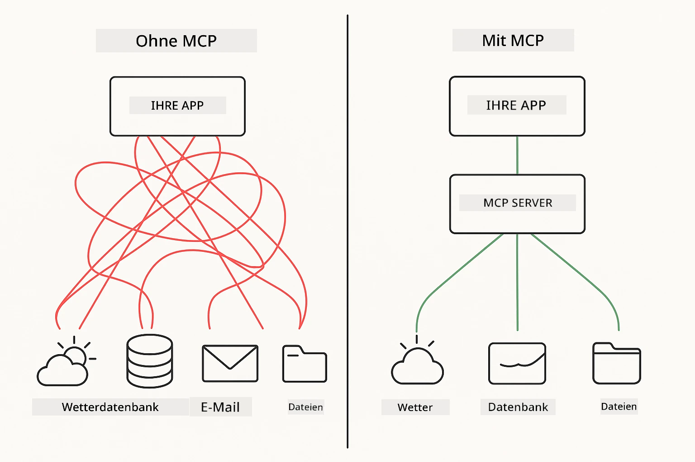
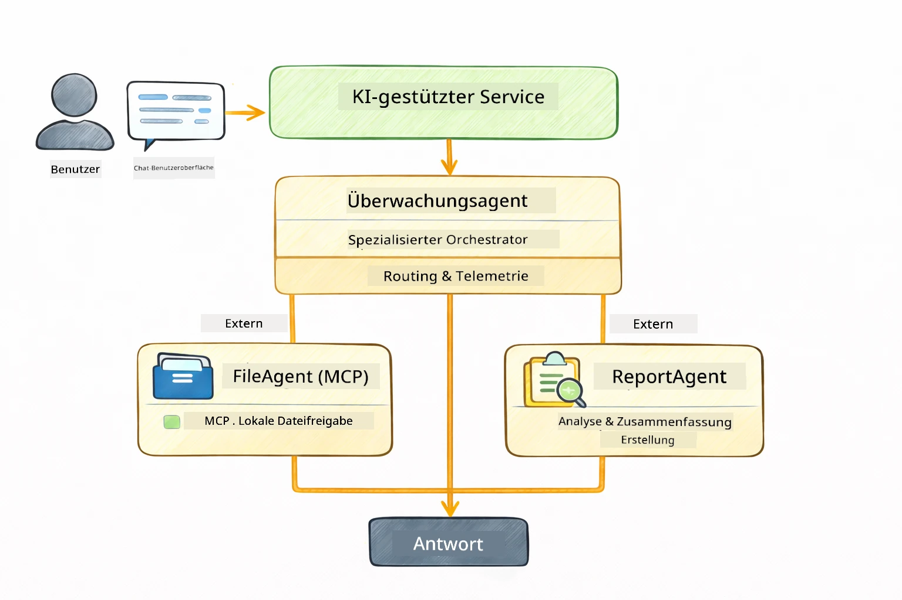

<!--
CO_OP_TRANSLATOR_METADATA:
{
  "original_hash": "6c816d130a1fa47570c11907e72d84ae",
  "translation_date": "2026-01-05T21:26:51+00:00",
  "source_file": "05-mcp/README.md",
  "language_code": "de"
}
-->
# Modul 05: Model Context Protocol (MCP)

## Inhaltsverzeichnis

- [Was Sie lernen werden](../../../05-mcp)
- [Was ist MCP?](../../../05-mcp)
- [Wie MCP funktioniert](../../../05-mcp)
- [Das Agentic-Modul](../../../05-mcp)
- [Beispiele ausführen](../../../05-mcp)
  - [Voraussetzungen](../../../05-mcp)
- [Schnellstart](../../../05-mcp)
  - [Dateioperationen (Stdio)](../../../05-mcp)
  - [Supervisor Agent](../../../05-mcp)
    - [Output verstehen](../../../05-mcp)
    - [Antwortstrategien](../../../05-mcp)
    - [Erklärung der Funktionen des Agentic-Moduls](../../../05-mcp)
- [Schlüsselkonzepte](../../../05-mcp)
- [Herzlichen Glückwunsch!](../../../05-mcp)
  - [Wie geht es weiter?](../../../05-mcp)

## Was Sie lernen werden

Sie haben konversationelle KI gebaut, Prompts gemeistert, Antworten in Dokumenten verankert und Agenten mit Tools erstellt. Doch all diese Tools waren speziell für Ihre Anwendung maßgeschneidert. Was wäre, wenn Sie Ihrer KI Zugang zu einem standardisierten Ökosystem von Tools geben könnten, die jeder erstellen und teilen kann? In diesem Modul lernen Sie genau das mit dem Model Context Protocol (MCP) und dem agentischen Modul von LangChain4j. Wir zeigen zunächst einen einfachen MCP-Dateileser und dann, wie er sich leicht in fortgeschrittene agentische Workflows mittels des Supervisor-Agenten-Musters integrieren lässt.

## Was ist MCP?

Das Model Context Protocol (MCP) bietet genau das – eine standardisierte Möglichkeit für KI-Anwendungen, externe Tools zu entdecken und zu nutzen. Statt für jede Datenquelle oder jeden Dienst benutzerdefinierte Integrationen zu schreiben, verbinden Sie sich mit MCP-Servern, die ihre Fähigkeiten in einheitlichem Format bereitstellen. Ihr KI-Agent kann dann diese Tools automatisch finden und verwenden.



*Vor MCP: Komplexe Punkt-zu-Punkt-Integrationen. Nach MCP: Ein Protokoll, unendliche Möglichkeiten.*

MCP löst ein grundlegendes Problem in der KI-Entwicklung: Jede Integration ist maßgeschneidert. Zugriff auf GitHub? Benutzerdefinierter Code. Dateien lesen? Benutzerdefinierter Code. Datenbank abfragen? Benutzerdefinierter Code. Und keine dieser Integrationen funktioniert mit anderen KI-Anwendungen.

MCP standardisiert das. Ein MCP-Server exponiert Werkzeuge mit klaren Beschreibungen und Schemata. Jeder MCP-Client kann sich verbinden, verfügbare Tools entdecken und sie nutzen. Einmal gebaut, überall verwendet.


*Model Context Protocol Architektur – standardisierte Werkzeugerkennung und Ausführung*

## Wie MCP funktioniert

**Server-Client-Architektur**

MCP verwendet ein Client-Server-Modell. Server bieten Werkzeuge an – zum Lesen von Dateien, Datenbankabfragen, API-Aufrufen. Clients (Ihre KI-Anwendung) verbinden sich mit Servern und nutzen deren Werkzeuge.

Um MCP mit LangChain4j zu verwenden, fügen Sie diese Maven-Abhängigkeit hinzu:

```xml
<dependency>
    <groupId>dev.langchain4j</groupId>
    <artifactId>langchain4j-mcp</artifactId>
    <version>${langchain4j.version}</version>
</dependency>
```

**Werkzeugentdeckung**

Wenn sich Ihr Client mit einem MCP-Server verbindet, fragt er: „Welche Tools hast du?“ Der Server antwortet mit einer Liste verfügbarer Werkzeuge, jeweils mit Beschreibung und Parameterschemata. Ihr KI-Agent kann dann entscheiden, welche Tools er basierend auf den Benutzeranfragen verwendet.

**Transportmechanismen**

MCP unterstützt verschiedene Transportmechanismen. Dieses Modul demonstriert den Stdio-Transport für lokale Prozesse:


*MCP-Transportmechanismen: HTTP für entfernte Server, Stdio für lokale Prozesse*

**Stdio** – [StdioTransportDemo.java](../../../05-mcp/src/main/java/com/example/langchain4j/mcp/StdioTransportDemo.java)

Für lokale Prozesse. Ihre Anwendung startet einen Server als Unterprozess und kommuniziert über Standard-Ein- und Ausgabe. Nützlich für Dateisystemzugriffe oder Kommandozeilentools.

```java
McpTransport stdioTransport = new StdioMcpTransport.Builder()
    .command(List.of(
        npmCmd, "exec",
        "@modelcontextprotocol/server-filesystem@2025.12.18",
        resourcesDir
    ))
    .logEvents(false)
    .build();
```

> **🤖 Probieren Sie es mit dem [GitHub Copilot](https://github.com/features/copilot) Chat:** Öffnen Sie [`StdioTransportDemo.java`](../../../05-mcp/src/main/java/com/example/langchain4j/mcp/StdioTransportDemo.java) und fragen Sie:
> - "Wie funktioniert der Stdio-Transport und wann sollte ich ihn im Vergleich zu HTTP verwenden?"
> - "Wie verwaltet LangChain4j den Lebenszyklus der gestarteten MCP-Serverprozesse?"
> - "Welche Sicherheitsaspekte gibt es, wenn die KI Zugriff auf das Dateisystem bekommt?"

## Das Agentic-Modul

Während MCP standardisierte Werkzeuge bereitstellt, ermöglicht LangChain4j’s **agentisches Modul** eine deklarative Art, Agenten zu bauen, die diese Werkzeuge orchestrieren. Die `@Agent`-Annotation und `AgenticServices` lassen Sie Agentenverhalten über Schnittstellen definieren, statt imperativen Code zu schreiben.

In diesem Modul erkunden Sie das **Supervisor Agent**-Muster — ein fortgeschrittener agentischer KI-Ansatz, bei dem ein „Supervisor“-Agent dynamisch entscheidet, welche Unteragenten auf Basis der Benutzeranfrage aufgerufen werden. Wir kombinieren beide Konzepte, indem wir einem unserer Unteragenten MCP-gestützte Dateizugriffs-Funktionalitäten geben.

Um das agentische Modul zu nutzen, fügen Sie diese Maven-Abhängigkeit hinzu:

```xml
<dependency>
    <groupId>dev.langchain4j</groupId>
    <artifactId>langchain4j-agentic</artifactId>
    <version>${langchain4j.mcp.version}</version>
</dependency>
```

> **⚠️ Experimentell:** Das Modul `langchain4j-agentic` ist **experimentell** und Änderungen vorbehalten. Die stabile Methode, KI-Assistenten zu bauen, bleibt `langchain4j-core` mit benutzerdefinierten Tools (Modul 04).

## Beispiele ausführen

### Voraussetzungen

- Java 21+, Maven 3.9+
- Node.js 16+ und npm (für MCP-Server)
- Umgebungsvariablen konfiguriert in `.env`-Datei (im Wurzelverzeichnis):
  - `AZURE_OPENAI_ENDPOINT`, `AZURE_OPENAI_API_KEY`, `AZURE_OPENAI_DEPLOYMENT` (wie in Modulen 01-04)

> **Hinweis:** Falls Sie Ihre Umgebungsvariablen noch nicht eingerichtet haben, siehe [Modul 00 - Schnellstart](../00-quick-start/README.md) für Anleitungen oder kopieren Sie `.env.example` nach `.env` im Wurzelverzeichnis und ergänzen Ihre Werte.

## Schnellstart

**Mit VS Code:** Klicken Sie im Explorer mit der rechten Maustaste auf eine beliebige Demo-Datei und wählen Sie **„Run Java“** aus, oder verwenden Sie die Startkonfigurationen im Panel "Ausführen und Debuggen" (stellen Sie sicher, dass Ihr Token zuerst in der `.env`-Datei eingetragen ist).

**Mit Maven:** Alternativ können Sie auch über die Kommandozeile die nachfolgenden Beispiele ausführen.

### Dateioperationen (Stdio)

Dies demonstriert lokal unterprozessbasierte Tools.

**✅ Keine Voraussetzungen nötig** – der MCP-Server wird automatisch gestartet.

**Start-Skripte verwenden (empfohlen):**

Die Start-Skripte laden Umgebungsvariablen automatisch aus der `.env`-Datei im Wurzelverzeichnis:

**Bash:**
```bash
cd 05-mcp
chmod +x start-stdio.sh
./start-stdio.sh
```

**PowerShell:**
```powershell
cd 05-mcp
.\start-stdio.ps1
```

**Mit VS Code:** Rechtsklick auf `StdioTransportDemo.java` und **„Run Java“** wählen (stellen Sie sicher, dass Ihre `.env`-Datei konfiguriert ist).

Die Anwendung startet automatisch einen MCP-Dateisystemserver und liest eine lokale Datei aus. Beachten Sie, wie das Management des Unterprozesses für Sie übernommen wird.

**Erwartete Ausgabe:**
```
Assistant response: The file provides an overview of LangChain4j, an open-source Java library
for integrating Large Language Models (LLMs) into Java applications...
```

### Supervisor Agent

Das **Supervisor Agent-Muster** ist eine **flexible** Form agentischer KI. Ein Supervisor nutzt ein LLM, um autonom zu entscheiden, welche Agenten basierend auf Benutzeranfragen aufgerufen werden. Im nächsten Beispiel kombinieren wir MCP-gestützten Dateizugriff mit einem LLM-Agenten zum Erstellen eines überwachten Ablaufs Dateilesen → Bericht generieren.

Im Demo liest `FileAgent` eine Datei mit MCP-Dateisystemtools, und `ReportAgent` erzeugt einen strukturierten Bericht mit einer Zusammenfassung (1 Satz), 3 Schlüsselpunkten und Empfehlungen. Der Supervisor steuert diesen Ablauf automatisch:



```
┌─────────────┐      ┌──────────────┐
│  FileAgent  │ ───▶ │ ReportAgent  │
│ (MCP tools) │      │  (pure LLM)  │
└─────────────┘      └──────────────┘
   outputKey:           outputKey:
  'fileContent'         'report'
```

Jeder Agent speichert seine Ausgabe im **Agentic Scope** (gemeinsamer Speicher), wodurch nachfolgende Agenten auf vorherige Ergebnisse zugreifen können. Das zeigt, wie MCP-Tools nahtlos in agentische Workflows integriert werden — der Supervisor muss nicht wissen, *wie* Dateien gelesen werden, nur dass `FileAgent` das kann.

#### Demo ausführen

Die Start-Skripte laden Umgebungsvariablen automatisch aus der `.env`-Datei im Wurzelverzeichnis:

**Bash:**
```bash
cd 05-mcp
chmod +x start-supervisor.sh
./start-supervisor.sh
```

**PowerShell:**
```powershell
cd 05-mcp
.\start-supervisor.ps1
```

**Mit VS Code:** Rechtsklick auf `SupervisorAgentDemo.java` und **„Run Java“** wählen (stellen Sie sicher, dass Ihre `.env`-Datei konfiguriert ist).

#### Wie der Supervisor funktioniert

```java
// Schritt 1: FileAgent liest Dateien mit MCP-Tools
FileAgent fileAgent = AgenticServices.agentBuilder(FileAgent.class)
        .chatModel(model)
        .toolProvider(mcpToolProvider)  // Verfügt über MCP-Tools für Dateioperationen
        .build();

// Schritt 2: ReportAgent erzeugt strukturierte Berichte
ReportAgent reportAgent = AgenticServices.agentBuilder(ReportAgent.class)
        .chatModel(model)
        .build();

// Supervisor koordiniert den Datei → Bericht Arbeitsablauf
SupervisorAgent supervisor = AgenticServices.supervisorBuilder()
        .chatModel(model)
        .subAgents(fileAgent, reportAgent)
        .responseStrategy(SupervisorResponseStrategy.LAST)  // Den endgültigen Bericht zurückgeben
        .build();

// Der Supervisor entscheidet, welche Agenten basierend auf der Anfrage aufgerufen werden sollen
String response = supervisor.invoke("Read the file at /path/file.txt and generate a report");
```

#### Antwortstrategien

Wenn Sie einen `SupervisorAgent` konfigurieren, legen Sie fest, wie er die endgültige Antwort für den Benutzer formuliert, nachdem die Unteragenten ihre Aufgaben abgeschlossen haben. Die verfügbaren Strategien sind:

| Strategie | Beschreibung |
|----------|-------------|
| **LAST** | Der Supervisor gibt die Ausgabe des zuletzt aufgerufenen Unteragenten oder Tools zurück. Das ist sinnvoll, wenn der letzte Agent im Workflow speziell zur Erzeugung der vollständigen Endantwort designed ist (z.B. ein „Summary Agent“ in einer Forschungs-Pipeline). |
| **SUMMARY** | Der Supervisor nutzt sein internes Sprachmodell (LLM), um eine Zusammenfassung der gesamten Interaktion und aller Unteragentenausgaben zu erstellen und gibt diese als finale Antwort zurück. Das liefert eine saubere, aggregierte Antwort an den Benutzer. |
| **SCORED** | Das System nutzt ein internes LLM, um sowohl die LAST-Antwort als auch die SUMMARY der Interaktion im Vergleich zur ursprünglichen Benutzeranfrage zu bewerten und gibt die Ausgabe mit der höheren Bewertung zurück. |

Siehe [SupervisorAgentDemo.java](../../../05-mcp/src/main/java/com/example/langchain4j/mcp/SupervisorAgentDemo.java) für die vollständige Implementierung.

> **🤖 Probieren Sie es mit dem [GitHub Copilot](https://github.com/features/copilot) Chat:** Öffnen Sie [`SupervisorAgentDemo.java`](../../../05-mcp/src/main/java/com/example/langchain4j/mcp/SupervisorAgentDemo.java) und fragen Sie:
> - „Wie entscheidet der Supervisor, welche Agenten aufzurufen sind?“
> - „Was ist der Unterschied zwischen Supervisor- und sequentiellen Workflow-Mustern?“
> - „Wie kann ich das Planungsverhalten des Supervisors anpassen?“

#### Output verstehen

Beim Ausführen der Demo sehen Sie eine strukturierte Darstellung, wie der Supervisor mehrere Agenten orchestriert. Das bedeutet jede Sektion:

```
======================================================================
  FILE → REPORT WORKFLOW DEMO
======================================================================

This demo shows a clear 2-step workflow: read a file, then generate a report.
The Supervisor orchestrates the agents automatically based on the request.
```

**Die Überschrift** stellt das Workflow-Konzept vor: eine fokussierte Pipeline vom Dateilesen zur Berichtserstellung.

```
--- WORKFLOW ---------------------------------------------------------
  ┌─────────────┐      ┌──────────────┐
  │  FileAgent  │ ───▶ │ ReportAgent  │
  │ (MCP tools) │      │  (pure LLM)  │
  └─────────────┘      └──────────────┘
   outputKey:           outputKey:
   'fileContent'        'report'

--- AVAILABLE AGENTS -------------------------------------------------
  [FILE]   FileAgent   - Reads files via MCP → stores in 'fileContent'
  [REPORT] ReportAgent - Generates structured report → stores in 'report'
```

**Workflow-Diagramm** zeigt den Datenfluss zwischen den Agenten. Jeder Agent hat eine bestimmte Rolle:
- **FileAgent** liest Dateien mit MCP-Tools und speichert den Rohinhalt in `fileContent`
- **ReportAgent** verwendet diesen Inhalt und erstellt einen strukturierten Bericht in `report`

```
--- USER REQUEST -----------------------------------------------------
  "Read the file at .../file.txt and generate a report on its contents"
```

**Benutzeranfrage** zeigt die Aufgabe. Der Supervisor analysiert diese und entscheidet, FileAgent → ReportAgent aufzurufen.

```
--- SUPERVISOR ORCHESTRATION -----------------------------------------
  The Supervisor decides which agents to invoke and passes data between them...

  +-- STEP 1: Supervisor chose -> FileAgent (reading file via MCP)
  |
  |   Input: .../file.txt
  |
  |   Result: LangChain4j is an open-source, provider-agnostic Java framework for building LLM...
  +-- [OK] FileAgent (reading file via MCP) completed

  +-- STEP 2: Supervisor chose -> ReportAgent (generating structured report)
  |
  |   Input: LangChain4j is an open-source, provider-agnostic Java framew...
  |
  |   Result: Executive Summary...
  +-- [OK] ReportAgent (generating structured report) completed
```

**Supervisor-Orchestrierung** zeigt den 2-Schritte-Ablauf in Aktion:
1. **FileAgent** liest die Datei via MCP und speichert den Inhalt
2. **ReportAgent** erhält den Inhalt und erstellt einen strukturierten Bericht

Der Supervisor traf diese Entscheidungen **autonom** basierend auf der Benutzeranfrage.

```
--- FINAL RESPONSE ---------------------------------------------------
Executive Summary
...

Key Points
...

Recommendations
...

--- AGENTIC SCOPE (Data Flow) ----------------------------------------
  Each agent stores its output for downstream agents to consume:
  * fileContent: LangChain4j is an open-source, provider-agnostic Java framework...
  * report: Executive Summary...
```

#### Erklärung der Funktionen des Agentic-Moduls

Das Beispiel demonstriert mehrere fortgeschrittene Funktionen des agentischen Moduls. Werfen wir einen genaueren Blick auf Agentic Scope und Agent Listener.

**Agentic Scope** zeigt den gemeinsamen Speicher, wo Agenten ihre Ergebnisse mittels `@Agent(outputKey="...")` gespeichert haben. Dies ermöglicht:
- Spätere Agenten greifen auf Ausgaben früherer Agenten zu
- Der Supervisor kann eine finale Antwort synthetisieren
- Sie können überprüfen, was jeder Agent produziert hat

```java
ResultWithAgenticScope<String> result = supervisor.invokeWithAgenticScope(request);
AgenticScope scope = result.agenticScope();
String fileContent = scope.readState("fileContent");  // Rohdateidaten von FileAgent
String report = scope.readState("report");            // Strukturierter Bericht von ReportAgent
```

**Agent Listener** ermöglichen die Überwachung und Fehlerbehebung der Agentenausführung. Die schrittweise Ausgabe in der Demo stammt von einem AgentListener, der bei jedem Agentenaufruf eingehängt ist:
- **beforeAgentInvocation** – Wird aufgerufen, wenn der Supervisor einen Agenten auswählt, damit Sie sehen, welcher Agent warum gewählt wurde
- **afterAgentInvocation** – Wird aufgerufen, wenn ein Agent fertig ist, und zeigt dessen Ergebnis
- **inheritedBySubagents** – Wenn wahr, überwacht der Listener alle Agenten in der Hierarchie

```java
AgentListener monitor = new AgentListener() {
    private int step = 0;
    
    @Override
    public void beforeAgentInvocation(AgentRequest request) {
        step++;
        System.out.println("  +-- STEP " + step + ": " + request.agentName());
    }
    
    @Override
    public void afterAgentInvocation(AgentResponse response) {
        System.out.println("  +-- [OK] " + response.agentName() + " completed");
    }
    
    @Override
    public boolean inheritedBySubagents() {
        return true; // An alle Unteragenten weiterleiten
    }
};
```

Neben dem Supervisor-Muster bietet das Modul `langchain4j-agentic` verschiedene leistungsfähige Workflow-Muster und Funktionen:

| Muster | Beschreibung | Anwendungsfall |
|---------|-------------|----------|
| **Sequentiell** | Agenten werden nacheinander ausgeführt, Ausgabe fließt zum nächsten | Pipelines: recherchieren → analysieren → berichten |
| **Parallel** | Agenten laufen gleichzeitig | Unabhängige Aufgaben: Wetter + Nachrichten + Aktien |
| **Schleife** | Wiederholt bis eine Bedingung erfüllt ist | Qualitätsbewertung: verfeinern bis Score ≥ 0.8 |
| **Bedingt** | Weiterleitung basierend auf Bedingungen | Klassifizieren → an Spezialagenten weiterleiten |
| **Mensch-in-der-Schleife** | Hinzufügen von menschlichen Kontrollpunkten | Freigabe-Workflows, Inhaltsprüfung |

## Schlüsselkonzepte

Nachdem Sie MCP und das agentische Modul im Einsatz erkundet haben, fassen wir zusammen, wann Sie welchen Ansatz verwenden.

**MCP** eignet sich ideal, wenn Sie bestehende Tool-Ökosysteme nutzen wollen, Tools bauen, die mehrere Anwendungen teilen können, Drittanbieter-Dienste mit Standardprotokollen integrieren wollen oder Tool-Implementierungen ohne Codeänderung austauschen möchten.

**Das agentische Modul** funktioniert am besten, wenn Sie deklarative Agenten-Definitionen mit `@Agent`-Annotationen wünschen, Workflow-Orchestrierung (sequentiell, Schleife, parallel) brauchen, lieber agentenbasierte Schnittstellendesigns anstelle von imperativem Code bevorzugen oder mehrere Agenten kombinieren, die Ausgaben über `outputKey` teilen.

**Das Supervisor-Agent-Muster** glänzt, wenn der Workflow vorher nicht vorhersagbar ist und das LLM entscheiden soll, wenn Sie mehrere spezialisierte Agenten mit dynamischer Orchestrierung haben, wenn Sie konversationelle Systeme bauen, die zu unterschiedlichen Fähigkeiten routen, oder wenn Sie das flexibelste, adaptivste Agentenverhalten wollen.
## Herzlichen Glückwunsch!

Du hast den LangChain4j für Einsteiger Kurs abgeschlossen. Du hast gelernt:

- Wie man konversationsfähige KI mit Gedächtnis baut (Modul 01)
- Prompt-Engineering-Muster für verschiedene Aufgaben (Modul 02)
- Antworten anhand deiner Dokumente mit RAG zu begründen (Modul 03)
- Grundlegende KI-Agenten (Assistenten) mit benutzerdefinierten Tools zu erstellen (Modul 04)
- Standardisierte Tools mit den LangChain4j MCP- und Agentic-Modulen zu integrieren (Modul 05)

### Was kommt als Nächstes?

Nachdem du die Module abgeschlossen hast, erkunde den [Testing Guide](../docs/TESTING.md), um LangChain4j-Testkonzepte in der Praxis zu sehen.

**Offizielle Ressourcen:**
- [LangChain4j Dokumentation](https://docs.langchain4j.dev/) – Umfassende Anleitungen und API-Referenz
- [LangChain4j GitHub](https://github.com/langchain4j/langchain4j) – Quellcode und Beispiele
- [LangChain4j Tutorials](https://docs.langchain4j.dev/tutorials/) – Schritt-für-Schritt-Anleitungen für verschiedene Anwendungsfälle

Danke, dass du diesen Kurs abgeschlossen hast!

---

**Navigation:** [← Zurück: Modul 04 - Tools](../04-tools/README.md) | [Zurück zur Übersicht](../README.md)

---

<!-- CO-OP TRANSLATOR DISCLAIMER START -->
**Haftungsausschluss**:  
Dieses Dokument wurde mit dem KI-Übersetzungsdienst [Co-op Translator](https://github.com/Azure/co-op-translator) übersetzt. Obwohl wir auf Genauigkeit achten, können automatisierte Übersetzungen Fehler oder Ungenauigkeiten enthalten. Das Originaldokument in seiner Ursprungssprache ist als maßgebliche Quelle zu betrachten. Für wichtige Informationen wird eine professionelle menschliche Übersetzung empfohlen. Wir übernehmen keine Haftung für Missverständnisse oder Fehlinterpretationen, die durch die Nutzung dieser Übersetzung entstehen.
<!-- CO-OP TRANSLATOR DISCLAIMER END -->