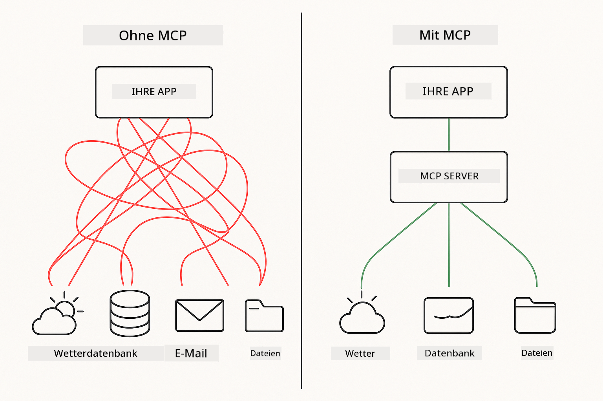
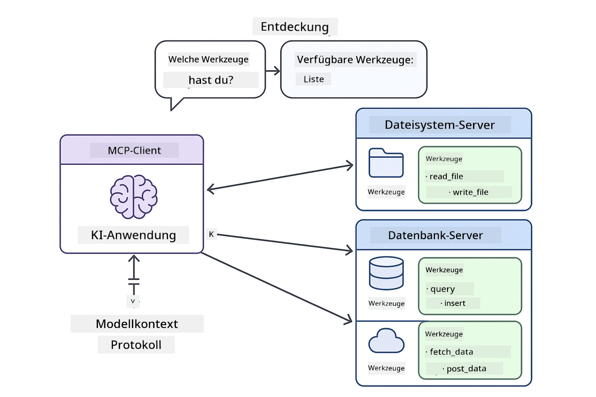
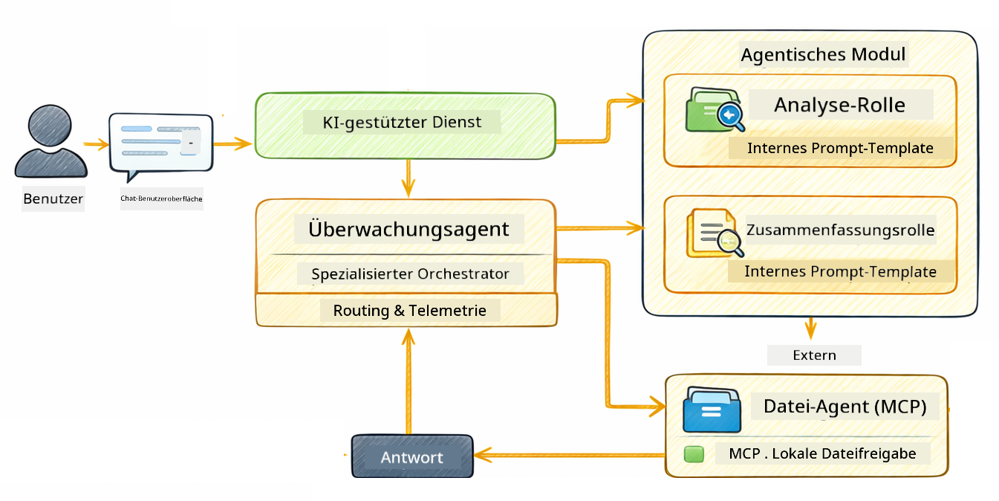

<!--
CO_OP_TRANSLATOR_METADATA:
{
  "original_hash": "f89f4c106d110e4943c055dd1a2f1dff",
  "translation_date": "2025-12-30T19:41:12+00:00",
  "source_file": "05-mcp/README.md",
  "language_code": "de"
}
-->
# Modul 05: Model Context Protocol (MCP)

## Inhaltsverzeichnis

- [What You'll Learn](../../../05-mcp)
- [What is MCP?](../../../05-mcp)
- [How MCP Works](../../../05-mcp)
- [The Agentic Module](../../../05-mcp)
- [Running the Examples](../../../05-mcp)
  - [Prerequisites](../../../05-mcp)
- [Quick Start](../../../05-mcp)
  - [File Operations (Stdio)](../../../05-mcp)
  - [Supervisor Agent](../../../05-mcp)
    - [Understanding the Output](../../../05-mcp)
    - [Explanation of Agentic Module Features](../../../05-mcp)
- [Key Concepts](../../../05-mcp)
- [Congratulations!](../../../05-mcp)
  - [What's Next?](../../../05-mcp)

## What You'll Learn

Sie haben konversationelle KI gebaut, Prompt-Engineering gemeistert, Antworten in Dokumente eingebettet und Agenten mit Tools erstellt. Aber all diese Tools waren speziell für Ihre Anwendung entwickelt. Was wäre, wenn Sie Ihrer KI Zugriff auf ein standardisiertes Ökosystem von Tools geben könnten, das jeder erstellen und teilen kann? In diesem Modul lernen Sie genau das mit dem Model Context Protocol (MCP) und dem agentic-Modul von LangChain4j. Zuerst zeigen wir einen einfachen MCP-Dateileser und dann, wie er sich leicht in fortgeschrittene agentische Workflows mit dem Supervisor-Agenten-Muster integrieren lässt.

## What is MCP?

Das Model Context Protocol (MCP) bietet genau das — eine standardisierte Methode, damit KI-Anwendungen externe Tools entdecken und nutzen können. Anstatt für jede Datenquelle oder jeden Dienst eigene Integrationen zu schreiben, verbinden Sie sich mit MCP-Servern, die ihre Fähigkeiten in einem konsistenten Format bereitstellen. Ihr KI-Agent kann diese Tools dann automatisch entdecken und verwenden.



*Vor MCP: Komplexe Punkt-zu-Punkt-Integrationen. Nach MCP: Ein Protokoll, endlose Möglichkeiten.*

MCP löst ein grundlegendes Problem in der KI-Entwicklung: Jede Integration ist maßgeschneidert. Möchten Sie auf GitHub zugreifen? Eigenentwicklung. Möchten Sie Dateien lesen? Eigenentwicklung. Möchten Sie eine Datenbank abfragen? Eigenentwicklung. Und keine dieser Integrationen funktioniert nahtlos mit anderen KI-Anwendungen.

MCP standardisiert das. Ein MCP-Server stellt Tools mit klaren Beschreibungen und Schemata bereit. Jeder MCP-Client kann sich verbinden, verfügbare Tools entdecken und sie nutzen. Einmal gebaut, überall nutzbar.



*Model Context Protocol-Architektur - standardisierte Tool-Erkennung und -Ausführung*

## How MCP Works

**Server-Client-Architektur**

MCP verwendet ein Client-Server-Modell. Server stellen Tools bereit - Dateien lesen, Datenbanken abfragen, APIs aufrufen. Clients (Ihre KI-Anwendung) verbinden sich mit Servern und nutzen deren Tools.

Um MCP mit LangChain4j zu verwenden, fügen Sie diese Maven-Abhängigkeit hinzu:

```xml
<dependency>
    <groupId>dev.langchain4j</groupId>
    <artifactId>langchain4j-mcp</artifactId>
    <version>${langchain4j.version}</version>
</dependency>
```

**Tool Discovery**

Wenn Ihr Client sich mit einem MCP-Server verbindet, fragt er: "Welche Tools habt ihr?" Der Server antwortet mit einer Liste verfügbarer Tools, jeweils mit Beschreibungen und Parameterschemata. Ihr KI-Agent kann dann basierend auf Benutzeranfragen entscheiden, welche Tools er verwenden möchte.

**Transportmechanismen**

MCP unterstützt verschiedene Transportmechanismen. Dieses Modul demonstriert den Stdio-Transport für lokale Prozesse:


*MCP-Transportmechanismen: HTTP für entfernte Server, Stdio für lokale Prozesse*

**Stdio** - [StdioTransportDemo.java](../../../05-mcp/src/main/java/com/example/langchain4j/mcp/StdioTransportDemo.java)

Für lokale Prozesse. Ihre Anwendung startet einen Server als Unterprozess und kommuniziert über Standard-Eingabe/Ausgabe. Nützlich für Dateisystemzugriffe oder Kommandozeilen-Tools.

```java
McpTransport stdioTransport = new StdioMcpTransport.Builder()
    .command(List.of(
        npmCmd, "exec",
        "@modelcontextprotocol/server-filesystem@2025.12.18",
        resourcesDir
    ))
    .logEvents(false)
    .build();
```

> **🤖 Try with [GitHub Copilot](https://github.com/features/copilot) Chat:** Open [`StdioTransportDemo.java`](../../../05-mcp/src/main/java/com/example/langchain4j/mcp/StdioTransportDemo.java) and ask:
> - "How does Stdio transport work and when should I use it vs HTTP?"
> - "How does LangChain4j manage the lifecycle of spawned MCP server processes?"
> - "What are the security implications of giving AI access to the file system?"

## The Agentic Module

Während MCP standardisierte Tools bereitstellt, bietet LangChain4j's **agentic module** eine deklarative Möglichkeit, Agenten zu bauen, die diese Tools orchestrieren. Die `@Agent`-Annotation und `AgenticServices` ermöglichen es Ihnen, das Verhalten von Agenten über Schnittstellen statt imperativen Code zu definieren.

In diesem Modul erkunden Sie das **Supervisor-Agenten-Muster** — einen fortgeschrittenen agentischen KI-Ansatz, bei dem ein "Supervisor"-Agent dynamisch entscheidet, welche Unteragenten er basierend auf Benutzeranfragen aufruft. Wir kombinieren beide Konzepte, indem wir einem unserer Unteragenten MCP-gestützte Dateizugriffs-Fähigkeiten geben.

Um das agentic-Modul zu verwenden, fügen Sie diese Maven-Abhängigkeit hinzu:

```xml
<dependency>
    <groupId>dev.langchain4j</groupId>
    <artifactId>langchain4j-agentic</artifactId>
    <version>${langchain4j.mcp.version}</version>
</dependency>
```

> **⚠️ Experimental:** Das `langchain4j-agentic`-Modul ist **experimentell** und kann sich ändern. Der stabile Weg, KI-Assistenten zu bauen, bleibt `langchain4j-core` mit benutzerdefinierten Tools (Modul 04).

## Running the Examples

### Prerequisites

- Java 21+, Maven 3.9+
- Node.js 16+ und npm (für MCP-Server)
- Umgebungsvariablen konfiguriert in der `.env`-Datei (aus dem Stammverzeichnis):
  - **For StdioTransportDemo:** `GITHUB_TOKEN` (GitHub Personal Access Token)
  - **For SupervisorAgentDemo:** `AZURE_OPENAI_ENDPOINT`, `AZURE_OPENAI_API_KEY`, `AZURE_OPENAI_DEPLOYMENT` (wie in Modulen 01-04)

> **Hinweis:** Wenn Sie Ihre Umgebungsvariablen noch nicht eingerichtet haben, siehe [Module 00 - Quick Start](../00-quick-start/README.md) für Anweisungen, oder kopieren Sie `.env.example` nach `.env` im Stammverzeichnis und füllen Sie Ihre Werte aus.

## Quick Start

**Verwendung von VS Code:** Klicken Sie einfach mit der rechten Maustaste auf eine Demo-Datei im Explorer und wählen Sie **"Run Java"**, oder verwenden Sie die Launch-Konfigurationen im Bereich "Run and Debug" (stellen Sie zuvor sicher, dass Sie Ihr Token in die `.env`-Datei eingefügt haben).

**Verwendung von Maven:** Alternativ können Sie die folgenden Beispiele von der Kommandozeile aus ausführen.

### File Operations (Stdio)

Dies demonstriert lokal subprocess-basierte Tools.

**✅ Keine Voraussetzungen erforderlich** - der MCP-Server wird automatisch gestartet.

**Verwendung von VS Code:** Rechtsklicken Sie auf `StdioTransportDemo.java` und wählen Sie **"Run Java"**.

**Verwendung von Maven:**

**Bash:**
```bash
export GITHUB_TOKEN=your_token_here
cd 05-mcp
mvn compile exec:java -Dexec.mainClass=com.example.langchain4j.mcp.StdioTransportDemo
```

**PowerShell:**
```powershell
$env:GITHUB_TOKEN=your_token_here
cd 05-mcp
mvn --% compile exec:java -Dexec.mainClass=com.example.langchain4j.mcp.StdioTransportDemo
```

Die Anwendung startet automatisch einen Dateisystem-MCP-Server und liest eine lokale Datei. Beachten Sie, wie die Verwaltung des Unterprozesses für Sie übernommen wird.

**Erwartete Ausgabe:**
```
Assistant response: The file provides an overview of LangChain4j, an open-source Java library
for integrating Large Language Models (LLMs) into Java applications...
```

### Supervisor Agent




Das **Supervisor-Agenten-Muster** ist eine **flexible** Form agentischer KI. Im Gegensatz zu deterministischen Workflows (sequenziell, Schleife, parallel) verwendet ein Supervisor ein LLM, um autonom zu entscheiden, welche Agenten basierend auf der Benutzeranfrage aufgerufen werden sollen.

**Kombination von Supervisor mit MCP:** In diesem Beispiel geben wir dem `FileAgent` Zugriff auf MCP-Dateisystemtools via `toolProvider(mcpToolProvider)`. Wenn ein Benutzer darum bittet, "eine Datei zu lesen und zu analysieren", analysiert der Supervisor die Anfrage und erstellt einen Ausführungsplan. Er leitet die Anfrage dann an `FileAgent` weiter, der das MCP-Tool `read_file` verwendet, um den Inhalt abzurufen. Der Supervisor übergibt diesen Inhalt an `AnalysisAgent` zur Interpretation und ruft optional `SummaryAgent` auf, um die Ergebnisse zusammenzufassen.

Dies zeigt, wie MCP-Tools nahtlos in agentische Workflows integriert werden — der Supervisor muss nicht wissen, *wie* Dateien gelesen werden, nur dass `FileAgent` dies kann. Der Supervisor passt sich dynamisch an verschiedene Arten von Anfragen an und gibt entweder die Antwort des letzten Agenten oder eine Zusammenfassung aller Operationen zurück.

**Verwendung der Startskripte (empfohlen):**

Die Startskripte laden automatisch Umgebungsvariablen aus der `.env`-Datei im Stammverzeichnis:

**Bash:**
```bash
cd 05-mcp
chmod +x start.sh
./start.sh
```

**PowerShell:**
```powershell
cd 05-mcp
.\start.ps1
```

**Verwendung von VS Code:** Rechtsklicken Sie auf `SupervisorAgentDemo.java` und wählen Sie **"Run Java"** (stellen Sie sicher, dass Ihre `.env`-Datei konfiguriert ist).

**Wie der Supervisor funktioniert:**

```java
// Mehrere Agenten mit spezifischen Fähigkeiten definieren
FileAgent fileAgent = AgenticServices.agentBuilder(FileAgent.class)
        .chatModel(model)
        .toolProvider(mcpToolProvider)  // Verfügt über MCP-Tools für Dateioperationen
        .build();

AnalysisAgent analysisAgent = AgenticServices.agentBuilder(AnalysisAgent.class)
        .chatModel(model)
        .build();

SummaryAgent summaryAgent = AgenticServices.agentBuilder(SummaryAgent.class)
        .chatModel(model)
        .build();

// Einen Supervisor erstellen, der diese Agenten orchestriert
SupervisorAgent supervisor = AgenticServices.supervisorBuilder()
        .chatModel(model)  // Das "planner"-Modell
        .subAgents(fileAgent, analysisAgent, summaryAgent)
        .responseStrategy(SupervisorResponseStrategy.SUMMARY)
        .build();

// Der Supervisor entscheidet autonom, welche Agenten aufgerufen werden
// Einfach eine Anfrage in natürlicher Sprache übergeben - das LLM plant die Ausführung
String response = supervisor.invoke("Read the file at /path/file.txt and analyze it");
```

Siehe [SupervisorAgentDemo.java](../../../05-mcp/src/main/java/com/example/langchain4j/mcp/SupervisorAgentDemo.java) für die vollständige Implementierung.

> **🤖 Try with [GitHub Copilot](https://github.com/features/copilot) Chat:** Open [`SupervisorAgentDemo.java`](../../../05-mcp/src/main/java/com/example/langchain4j/mcp/SupervisorAgentDemo.java) and ask:
> - "How does the Supervisor decide which agents to invoke?"
> - "What's the difference between Supervisor and Sequential workflow patterns?"
> - "How can I customize the Supervisor's planning behavior?"

#### Understanding the Output

Wenn Sie die Demo ausführen, sehen Sie einen strukturierten Durchgang, wie der Supervisor mehrere Agenten orchestriert. Das bedeutet jede Sektion:

```
======================================================================
  SUPERVISOR AGENT DEMO
======================================================================

This demo shows how a Supervisor Agent orchestrates multiple specialized agents.
The Supervisor uses an LLM to decide which agent to call based on the task.
```

**Die Kopfzeile** führt in die Demo ein und erklärt das Kernkonzept: Der Supervisor verwendet ein LLM (keine fest kodierten Regeln), um zu entscheiden, welche Agenten aufgerufen werden.

```
--- AVAILABLE AGENTS -------------------------------------------------
  [FILE]     FileAgent     - Reads files using MCP filesystem tools
  [ANALYZE]  AnalysisAgent - Analyzes content for structure, tone, and themes
  [SUMMARY]  SummaryAgent  - Creates concise summaries of content
```

**Verfügbare Agenten** zeigt die drei spezialisierten Agenten, aus denen der Supervisor wählen kann. Jeder Agent hat eine spezifische Fähigkeit:
- **FileAgent** kann Dateien mit MCP-Tools lesen (externe Fähigkeit)
- **AnalysisAgent** analysiert Inhalte (reine LLM-Fähigkeit)
- **SummaryAgent** erstellt Zusammenfassungen (reine LLM-Fähigkeit)

```
--- USER REQUEST -----------------------------------------------------
  "Read the file at .../file.txt and analyze what it's about"
```

**Benutzeranfrage** zeigt, was gefragt wurde. Der Supervisor muss dies parsen und entscheiden, welche Agenten aufzurufen sind.

```
--- SUPERVISOR ORCHESTRATION -----------------------------------------
  The Supervisor will now decide which agents to invoke and in what order...

  +-- STEP 1: Supervisor chose -> FileAgent (reading file via MCP)
  |
  |   Input: .../file.txt
  |
  |   Result: LangChain4j is an open-source Java library designed to simplify...
  +-- [OK] FileAgent (reading file via MCP) completed

  +-- STEP 2: Supervisor chose -> AnalysisAgent (analyzing content)
  |
  |   Input: LangChain4j is an open-source Java library...
  |
  |   Result: Structure: The content is organized into clear paragraphs that int...
  +-- [OK] AnalysisAgent (analyzing content) completed
```

**Supervisor-Orchestrierung** ist, wo die Magie passiert. Beobachten Sie:
1. Der Supervisor **wählte zuerst FileAgent**, weil die Anfrage "die Datei lesen" enthielt
2. FileAgent nutzte MCPs `read_file`-Tool, um den Dateiinhalt abzurufen
3. Der Supervisor **wählte dann AnalysisAgent** und übergab den Dateiinhalte an ihn
4. AnalysisAgent analysierte Struktur, Ton und Themen

Beachten Sie, dass der Supervisor diese Entscheidungen **autonom** basierend auf der Benutzeranfrage traf — kein fest codierter Workflow!

**Endantwort** ist die vom Supervisor synthetisierte Antwort, die die Ausgaben aller aufgerufenen Agenten kombiniert. Das Beispiel gibt den agentischen Scope aus und zeigt die von jedem Agenten gespeicherten Zusammenfassungs- und Analyseergebnisse.

```
--- FINAL RESPONSE ---------------------------------------------------
I read the contents of the file and analyzed its structure, tone, and key themes.
The file introduces LangChain4j as an open-source Java library for integrating
large language models...

--- AGENTIC SCOPE (Shared Memory) ------------------------------------
  Agents store their results in a shared scope for other agents to use:
  * summary: LangChain4j is an open-source Java library...
  * analysis: Structure: The content is organized into clear paragraphs that in...
```

### Explanation of Agentic Module Features

Das Beispiel demonstriert mehrere fortgeschrittene Funktionen des agentic-Moduls. Schauen wir uns Agentic Scope und Agent Listeners genauer an.

**Agentic Scope** zeigt den geteilten Speicher, in dem Agenten ihre Ergebnisse mit `@Agent(outputKey="...")` abgelegt haben. Dies ermöglicht:
- Dass spätere Agenten auf die Ausgaben früherer Agenten zugreifen
- Dass der Supervisor eine finale Antwort synthetisieren kann
- Dass Sie inspizieren können, was jeder Agent produziert hat

```java
ResultWithAgenticScope<String> result = supervisor.invokeWithAgenticScope(request);
AgenticScope scope = result.agenticScope();
String story = scope.readState("story");
List<AgentInvocation> history = scope.agentInvocations("analysisAgent");
```

**Agent Listeners** ermöglichen die Überwachung und das Debugging der Agentenausführung. Die Schritt-für-Schritt-Ausgabe, die Sie in der Demo sehen, stammt von einem AgentListener, der sich in jeden Agentenaufruf einklinkt:
- **beforeAgentInvocation** - Wird aufgerufen, wenn der Supervisor einen Agenten auswählt, sodass Sie sehen können, welcher Agent gewählt wurde und warum
- **afterAgentInvocation** - Wird aufgerufen, wenn ein Agent abgeschlossen ist, und zeigt dessen Ergebnis
- **inheritedBySubagents** - Wenn wahr, überwacht der Listener alle Agenten in der Hierarchie

```java
AgentListener monitor = new AgentListener() {
    private int step = 0;
    
    @Override
    public void beforeAgentInvocation(AgentRequest request) {
        step++;
        System.out.println("  +-- STEP " + step + ": " + request.agentName());
    }
    
    @Override
    public void afterAgentInvocation(AgentResponse response) {
        System.out.println("  +-- [OK] " + response.agentName() + " completed");
    }
    
    @Override
    public boolean inheritedBySubagents() {
        return true; // An alle Unteragenten weiterleiten
    }
};
```

Neben dem Supervisor-Muster bietet das `langchain4j-agentic`-Modul mehrere leistungsstarke Workflow-Muster und Funktionen:

| Muster | Beschreibung | Anwendungsfall |
|---------|-------------|----------|
| **Sequenziell** | Agenten nacheinander ausführen, Ausgabe fließt in den nächsten | Pipelines: Recherche → Analyse → Bericht |
| **Parallel** | Agenten gleichzeitig ausführen | Unabhängige Aufgaben: Wetter + Nachrichten + Aktien |
| **Schleife** | Iterieren, bis Bedingung erfüllt ist | Qualitätsbewertung: Verfeinern, bis Score ≥ 0,8 |
| **Bedingt** | Routing basierend auf Bedingungen | Klassifizieren → an Spezialisten-Agent weiterleiten |
| **Human-in-the-Loop** | Menschliche Checkpoints einfügen | Genehmigungsworkflows, Inhaltsprüfung |

## Key Concepts

**MCP** ist ideal, wenn Sie vorhandene Tool-Ökosysteme nutzen möchten, Tools bauen wollen, die mehrere Anwendungen teilen können, Drittanbieterdienste mit Standardprotokollen integrieren oder Tool-Implementierungen austauschen möchten, ohne den Code zu ändern.

**Das Agentic-Modul** eignet sich am besten, wenn Sie deklarative Agentendefinitionen mit `@Agent`-Annotationen wünschen, Workflow-Orchestrierung benötigen (sequenziell, Schleife, parallel), interface-basierte Agentenarchitekturen imperativem Code vorziehen oder mehrere Agenten kombinieren, die Ausgaben über `outputKey` teilen.

**Das Supervisor-Agenten-Muster** eignet sich hervorragend, wenn der Workflow im Voraus nicht vorhersehbar ist und Sie möchten, dass das LLM entscheidet, wenn Sie mehrere spezialisierte Agenten haben, die dynamisch orchestriert werden müssen, beim Aufbau konversationeller Systeme, die an verschiedene Fähigkeiten weiterleiten, oder wenn Sie das flexibelste, adaptivste Agentenverhalten wünschen.

## Congratulations!

Sie haben den LangChain4j for Beginners-Kurs abgeschlossen. Sie haben gelernt:

- Wie man konversationelle KI mit Memory baut (Modul 01)
- Prompt-Engineering-Muster für verschiedene Aufgaben (Modul 02)
- Antworten in Ihren Dokumenten mit RAG verankern (Modul 03)
- Erstellung grundlegender KI-Agenten (Assistenten) mit benutzerdefinierten Tools (Modul 04)
- Integration standardisierter Tools mit den LangChain4j MCP- und Agentic-Modulen (Modul 05)

### Was kommt als Nächstes?

Nachdem Sie die Module abgeschlossen haben, schauen Sie sich den [Testleitfaden](../docs/TESTING.md) an, um die Testkonzepte von LangChain4j in der Praxis zu sehen.

**Offizielle Ressourcen:**
- [LangChain4j Dokumentation](https://docs.langchain4j.dev/) - Umfassende Anleitungen und API-Referenz
- [LangChain4j GitHub](https://github.com/langchain4j/langchain4j) - Quellcode und Beispiele
- [LangChain4j Tutorials](https://docs.langchain4j.dev/tutorials/) - Schritt-für-Schritt-Anleitungen für verschiedene Anwendungsfälle

Vielen Dank, dass Sie diesen Kurs abgeschlossen haben!

---

**Navigation:** [← Zurück: Modul 04 - Tools](../04-tools/README.md) | [Zurück zur Hauptseite](../README.md)

---

<!-- CO-OP TRANSLATOR DISCLAIMER START -->
**Haftungsausschluss**:
Dieses Dokument wurde mithilfe des KI-Übersetzungsdienstes [Co-op Translator](https://github.com/Azure/co-op-translator) übersetzt. Obwohl wir uns um Genauigkeit bemühen, beachten Sie bitte, dass automatisierte Übersetzungen Fehler oder Ungenauigkeiten enthalten können. Das Originaldokument in seiner ursprünglichen Sprache ist als maßgebliche Quelle anzusehen. Bei kritischen Informationen wird eine professionelle menschliche Übersetzung empfohlen. Wir übernehmen keine Haftung für Missverständnisse oder Fehlinterpretationen, die aus der Verwendung dieser Übersetzung entstehen.
<!-- CO-OP TRANSLATOR DISCLAIMER END -->