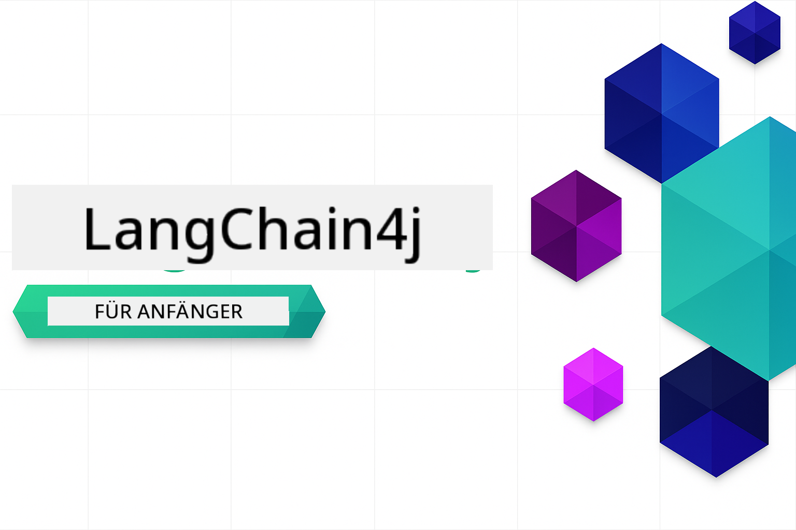
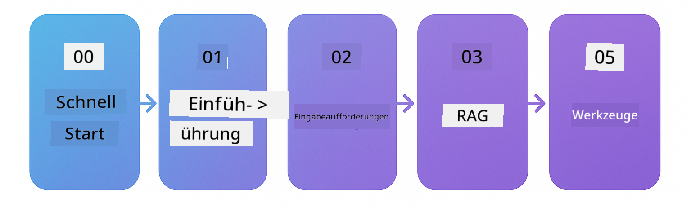

<!--
CO_OP_TRANSLATOR_METADATA:
{
  "original_hash": "1e85afe0b0ee47fc09b20442b0ee4ca5",
  "translation_date": "2025-12-23T08:16:14+00:00",
  "source_file": "README.md",
  "language_code": "de"
}
-->


### 🌐 Mehrsprachige Unterstützung

#### Unterstützt über GitHub Action (Automatisiert & immer aktuell)

<!-- CO-OP TRANSLATOR LANGUAGES TABLE START -->
[Arabisch](../ar/README.md) | [Bengalisch](../bn/README.md) | [Bulgarisch](../bg/README.md) | [Birmanisch (Myanmar)](../my/README.md) | [Chinesisch (Vereinfacht)](../zh/README.md) | [Chinesisch (Traditionell, Hongkong)](../hk/README.md) | [Chinesisch (Traditionell, Macau)](../mo/README.md) | [Chinesisch (Traditionell, Taiwan)](../tw/README.md) | [Kroatisch](../hr/README.md) | [Tschechisch](../cs/README.md) | [Dänisch](../da/README.md) | [Niederländisch](../nl/README.md) | [Estnisch](../et/README.md) | [Finnisch](../fi/README.md) | [Französisch](../fr/README.md) | [Deutsch](./README.md) | [Griechisch](../el/README.md) | [Hebräisch](../he/README.md) | [Hindi](../hi/README.md) | [Ungarisch](../hu/README.md) | [Indonesisch](../id/README.md) | [Italienisch](../it/README.md) | [Japanisch](../ja/README.md) | [Kannada](../kn/README.md) | [Koreanisch](../ko/README.md) | [Litauisch](../lt/README.md) | [Malaiisch](../ms/README.md) | [Malayalam](../ml/README.md) | [Marathi](../mr/README.md) | [Nepalesisch](../ne/README.md) | [Nigerianisches Pidgin](../pcm/README.md) | [Norwegisch](../no/README.md) | [Persisch (Farsi)](../fa/README.md) | [Polnisch](../pl/README.md) | [Portugiesisch (Brasilien)](../br/README.md) | [Portugiesisch (Portugal)](../pt/README.md) | [Punjabi (Gurmukhi)](../pa/README.md) | [Rumänisch](../ro/README.md) | [Russisch](../ru/README.md) | [Serbisch (Kyrillisch)](../sr/README.md) | [Slowakisch](../sk/README.md) | [Slowenisch](../sl/README.md) | [Spanisch](../es/README.md) | [Suaheli](../sw/README.md) | [Schwedisch](../sv/README.md) | [Tagalog (Filipino)](../tl/README.md) | [Tamil](../ta/README.md) | [Telugu](../te/README.md) | [Thailändisch](../th/README.md) | [Türkisch](../tr/README.md) | [Ukrainisch](../uk/README.md) | [Urdu](../ur/README.md) | [Vietnamesisch](../vi/README.md)
<!-- CO-OP TRANSLATOR LANGUAGES TABLE END -->

# LangChain4j für Einsteiger

Ein Kurs zum Erstellen von KI-Anwendungen mit LangChain4j und Azure OpenAI GPT-5, von einfachem Chat bis hin zu KI-Agenten.

**Neu bei LangChain4j?** Sieh dir das [Glossar](docs/GLOSSARY.md) für Definitionen wichtiger Begriffe und Konzepte an.

## Table of Contents

1. [Schnellstart](00-quick-start/README.md) - Erste Schritte mit LangChain4j
2. [Einführung](01-introduction/README.md) - Lerne die Grundlagen von LangChain4j
3. [Prompt-Engineering](02-prompt-engineering/README.md) - Meistere effektives Prompt-Design
4. [RAG (Retrieval-Augmented Generation)](03-rag/README.md) - Baue intelligente wissensbasierte Systeme
5. [Werkzeuge](04-tools/README.md) - Integriere externe Tools und APIs mit KI-Agenten
6. [MCP (Model Context Protocol)](05-mcp/README.md) - Arbeite mit dem Model Context Protocol
---

##  Lernpfad

> **Schnellstart**
>
> 1. Forke dieses Repository in dein GitHub-Konto
> 2. Klicke auf **Code** → Tab **Codespaces** → **...** → **Neu mit Optionen...**
> 3. Verwende die Standardeinstellungen – dadurch wird der für diesen Kurs erstellte Entwicklungscontainer ausgewählt
> 4. Klicke auf **Codespace erstellen**
> 5. Warte 5-10 Minuten, bis die Umgebung bereit ist
> 6. Springe direkt zum [Schnellstart](./00-quick-start/README.md), um loszulegen!
>
> **Möchtest du lokal klonen?**
>
> Dieses Repository enthält 50+ Sprachübersetzungen, die die Download-Größe erheblich erhöhen. Um ohne Übersetzungen zu klonen, verwende sparse checkout:
> ```bash
> git clone --filter=blob:none --sparse https://github.com/microsoft/LangChain4j-for-Beginners.git
> cd LangChain4j-for-Beginners
> git sparse-checkout set --no-cone '/*' '!translations' '!translated_images'
> ```
> Dies gibt dir alles, was du brauchst, um den Kurs mit einem deutlich schnelleren Download abzuschließen.

Beginne mit dem [Schnellstart](00-quick-start/README.md)-Modul und arbeite dich durch jedes Modul, um deine Fähigkeiten Schritt für Schritt aufzubauen. Du wirst grundlegende Beispiele ausprobieren, um die Grundlagen zu verstehen, bevor du zum [Einführungs](01-introduction/README.md)-Modul für einen tieferen Einblick mit GPT-5 übergehst.



Nachdem du die Module abgeschlossen hast, sieh dir den [Testing Guide](docs/TESTING.md) an, um LangChain4j-Testkonzepte in Aktion zu sehen.

> **Hinweis:** Dieses Training verwendet sowohl GitHub Models als auch Azure OpenAI. Die [Schnellstart](00-quick-start/README.md)- und [MCP](05-mcp/README.md)-Module verwenden GitHub Models (kein Azure-Abonnement erforderlich), während die Module 1–4 Azure OpenAI GPT-5 verwenden.


## Lernen mit GitHub Copilot

Um schnell mit dem Codieren zu beginnen, öffne dieses Projekt in einem GitHub Codespace oder deiner lokalen IDE mit dem bereitgestellten devcontainer. Der in diesem Kurs verwendete Devcontainer ist vorkonfiguriert mit GitHub Copilot für KI-Paarprogrammierung.

Jedes Codebeispiel enthält vorgeschlagene Fragen, die du GitHub Copilot stellen kannst, um dein Verständnis zu vertiefen. Achte auf die 💡/🤖 Hinweise in:

- **Kopfzeilen von Java-Dateien** - Fragen, die spezifisch für jedes Beispiel sind
- **Module-READMEs** - Erkundungsfragen nach Codebeispielen

**Wie zu verwenden:** Öffne eine beliebige Code-Datei und stelle Copilot die vorgeschlagenen Fragen. Es hat den vollständigen Kontext des Codes und kann erklären, erweitern und Alternativen vorschlagen.

Möchtest du mehr erfahren? Sieh dir [Copilot für KI-Paarprogrammierung](https://aka.ms/GitHubCopilotAI) an.


## Zusätzliche Ressourcen

<!-- CO-OP TRANSLATOR OTHER COURSES START -->
### LangChain
[](https://aka.ms/langchain4j-for-beginners)
[](https://aka.ms/langchainjs-for-beginners?WT.mc_id=m365-94501-dwahlin)

---

### Azure / Edge / MCP / Agents
[](https://github.com/microsoft/AZD-for-beginners?WT.mc_id=academic-105485-koreyst)
[](https://github.com/microsoft/edgeai-for-beginners?WT.mc_id=academic-105485-koreyst)
[](https://github.com/microsoft/mcp-for-beginners?WT.mc_id=academic-105485-koreyst)
[](https://github.com/microsoft/ai-agents-for-beginners?WT.mc_id=academic-105485-koreyst)

---
 
### Generative AI Series
[](https://github.com/microsoft/generative-ai-for-beginners?WT.mc_id=academic-105485-koreyst)
[-9333EA?style=for-the-badge&labelColor=E5E7EB&color=9333EA)](https://github.com/microsoft/Generative-AI-for-beginners-dotnet?WT.mc_id=academic-105485-koreyst)
[-C084FC?style=for-the-badge&labelColor=E5E7EB&color=C084FC)](https://github.com/microsoft/generative-ai-for-beginners-java?WT.mc_id=academic-105485-koreyst)
[-E879F9?style=for-the-badge&labelColor=E5E7EB&color=E879F9)](https://github.com/microsoft/generative-ai-with-javascript?WT.mc_id=academic-105485-koreyst)

---
 
### Core Learning
[](https://aka.ms/ml-beginners?WT.mc_id=academic-105485-koreyst)
[](https://aka.ms/datascience-beginners?WT.mc_id=academic-105485-koreyst)
[](https://aka.ms/ai-beginners?WT.mc_id=academic-105485-koreyst)
[](https://github.com/microsoft/Security-101?WT.mc_id=academic-96948-sayoung)
[](https://aka.ms/webdev-beginners?WT.mc_id=academic-105485-koreyst)
[](https://aka.ms/iot-beginners?WT.mc_id=academic-105485-koreyst)

[](https://github.com/microsoft/xr-development-for-beginners?WT.mc_id=academic-105485-koreyst)

---
 
### Copilot-Serie
[](https://aka.ms/GitHubCopilotAI?WT.mc_id=academic-105485-koreyst)
[](https://github.com/microsoft/mastering-github-copilot-for-dotnet-csharp-developers?WT.mc_id=academic-105485-koreyst)
[](https://github.com/microsoft/CopilotAdventures?WT.mc_id=academic-105485-koreyst)
<!-- CO-OP TRANSLATOR OTHER COURSES END -->

## Hilfe

Wenn Sie nicht weiterkommen oder Fragen zum Erstellen von KI-Anwendungen haben, treten Sie bei:

[](https://aka.ms/foundry/discord)

Wenn Sie Produktfeedback haben oder während der Entwicklung auf Fehler stoßen, besuchen Sie:

[](https://aka.ms/foundry/forum)

## Lizenz

MIT-Lizenz - Siehe die Datei [LICENSE](../../LICENSE) für Details.

---

<!-- CO-OP TRANSLATOR DISCLAIMER START -->
Haftungsausschluss:
Dieses Dokument wurde mithilfe des KI-Übersetzungsdienstes Co-op Translator (https://github.com/Azure/co-op-translator) übersetzt. Obwohl wir uns um Genauigkeit bemühen, können automatisierte Übersetzungen Fehler oder Ungenauigkeiten enthalten. Das Originaldokument in seiner Originalsprache ist als maßgebliche Quelle zu betrachten. Bei wichtigen Informationen wird eine professionelle menschliche Übersetzung empfohlen. Für Missverständnisse oder Fehlinterpretationen, die sich aus der Verwendung dieser Übersetzung ergeben, übernehmen wir keine Haftung.
<!-- CO-OP TRANSLATOR DISCLAIMER END -->