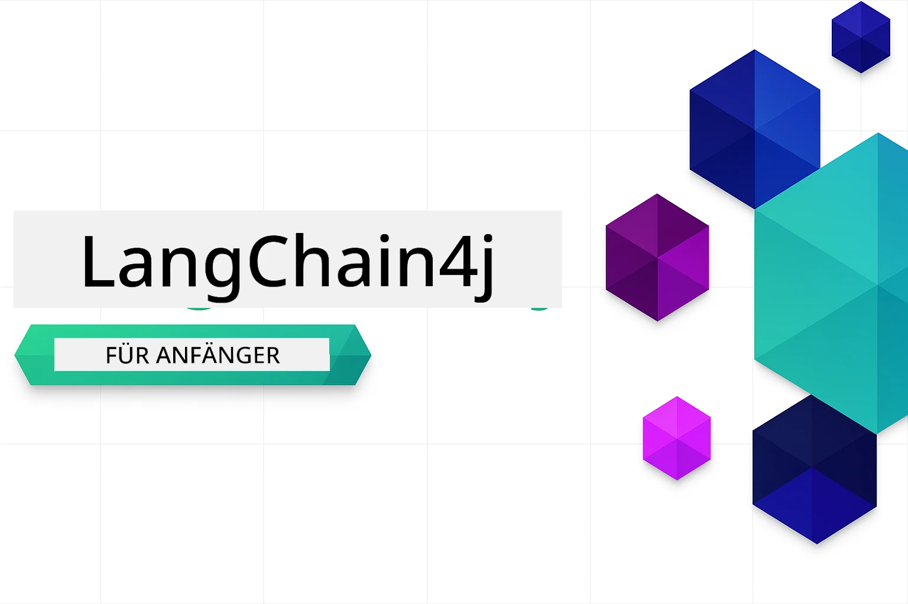

# LangChain4j für Anfänger

Ein Kurs zum Erstellen von KI-Anwendungen mit LangChain4j und Azure OpenAI GPT-5.2, vom einfachen Chat bis zu KI-Agenten.

### 🌐 Mehrsprachige Unterstützung

#### Unterstützt über GitHub Action (Automatisiert & Immer Aktuell)

<!-- CO-OP TRANSLATOR LANGUAGES TABLE START -->
[Arabisch](../ar/README.md) | [Bengalisch](../bn/README.md) | [Bulgarisch](../bg/README.md) | [Birma (Myanmar)](../my/README.md) | [Chinesisch (Vereinfacht)](../zh-CN/README.md) | [Chinesisch (Traditionell, Hongkong)](../zh-HK/README.md) | [Chinesisch (Traditionell, Macau)](../zh-MO/README.md) | [Chinesisch (Traditionell, Taiwan)](../zh-TW/README.md) | [Kroatisch](../hr/README.md) | [Tschechisch](../cs/README.md) | [Dänisch](../da/README.md) | [Niederländisch](../nl/README.md) | [Estnisch](../et/README.md) | [Finnisch](../fi/README.md) | [Französisch](../fr/README.md) | [Deutsch](./README.md) | [Griechisch](../el/README.md) | [Hebräisch](../he/README.md) | [Hindi](../hi/README.md) | [Ungarisch](../hu/README.md) | [Indonesisch](../id/README.md) | [Italienisch](../it/README.md) | [Japanisch](../ja/README.md) | [Kannada](../kn/README.md) | [Khmer](../km/README.md) | [Koreanisch](../ko/README.md) | [Litauisch](../lt/README.md) | [Malaiisch](../ms/README.md) | [Malayalam](../ml/README.md) | [Marathi](../mr/README.md) | [Nepalesisch](../ne/README.md) | [Nigerianisches Pidgin](../pcm/README.md) | [Norwegisch](../no/README.md) | [Persisch (Farsi)](../fa/README.md) | [Polnisch](../pl/README.md) | [Portugiesisch (Brasilien)](../pt-BR/README.md) | [Portugiesisch (Portugal)](../pt-PT/README.md) | [Punjabi (Gurmukhi)](../pa/README.md) | [Rumänisch](../ro/README.md) | [Russisch](../ru/README.md) | [Serbisch (Kyrillisch)](../sr/README.md) | [Slowakisch](../sk/README.md) | [Slowenisch](../sl/README.md) | [Spanisch](../es/README.md) | [Suaheli](../sw/README.md) | [Schwedisch](../sv/README.md) | [Tagalog (Filipino)](../tl/README.md) | [Tamil](../ta/README.md) | [Telugu](../te/README.md) | [Thailändisch](../th/README.md) | [Türkisch](../tr/README.md) | [Ukrainisch](../uk/README.md) | [Urdu](../ur/README.md) | [Vietnamesisch](../vi/README.md)

> **Bevorzugen Sie das lokale Klonen?**
>
> Dieses Repository enthält über 50 Sprachübersetzungen, die die Download-Größe erheblich erhöhen. Um ohne Übersetzungen zu klonen, verwenden Sie Sparse Checkout:
>
> **Bash / macOS / Linux:**
> ```bash
> git clone --filter=blob:none --sparse https://github.com/microsoft/LangChain4j-for-Beginners.git
> cd LangChain4j-for-Beginners
> git sparse-checkout set --no-cone '/*' '!translations' '!translated_images'
> ```
>
> **CMD (Windows):**
> ```cmd
> git clone --filter=blob:none --sparse https://github.com/microsoft/LangChain4j-for-Beginners.git
> cd LangChain4j-for-Beginners
> git sparse-checkout set --no-cone "/*" "!translations" "!translated_images"
> ```
>
> Dies gibt Ihnen alles, was Sie benötigen, um den Kurs mit einem viel schnelleren Download abzuschließen.
<!-- CO-OP TRANSLATOR LANGUAGES TABLE END -->

## Inhaltsverzeichnis

1. [Einführung](01-introduction/README.md) - Lernen Sie die Grundlagen von LangChain4j
2. [Prompt Engineering](02-prompt-engineering/README.md) - Meistern Sie effektives Prompt-Design
3. [RAG (Retrieval-Augmented Generation)](03-rag/README.md) - Erstellen Sie intelligente wissensbasierte Systeme
4. [Werkzeuge](04-tools/README.md) - Integrieren Sie externe Werkzeuge und einfache Assistenten
5. [MCP (Model Context Protocol)](05-mcp/README.md) - Arbeiten Sie mit dem Model Context Protocol (MCP) und agentischen Modulen

### Video-Durchgänge

Jedes Modul hat eine begleitende Live-Session, in der wir die Konzepte und den Code Schritt für Schritt durchgehen.

| Modul | Video |
|--------|-------|
| 01 - Einführung | [Erste Schritte mit LangChain4j](https://www.youtube.com/live/nl_troDm8rQ) |
| 02 - Prompt Engineering | [Prompt Engineering mit LangChain4j](https://www.youtube.com/live/PJ6aBaE6bog) |
| 03 - RAG | [RAG mit LangChain4j](https://www.youtube.com/watch?v=_olq75ZH_eY) |
| 04 - Werkzeuge & 05 - MCP | [KI-Agenten mit Werkzeugen und MCP](https://www.youtube.com/watch?v=O_J30kZc0rw) |

---

## Lernpfad

**Neu bei LangChain4j?** Sehen Sie sich das [Glossar](docs/GLOSSARY.md) für Definitionen wichtiger Begriffe und Konzepte an.

> **Schnellstart**

1. Forken Sie dieses Repository in Ihrem GitHub-Konto
2. Klicken Sie auf **Code** → **Codespaces** Tab → **...** → **Neu mit Optionen...**
3. Verwenden Sie die Standardwerte – dies wählt den für diesen Kurs erstellten Entwicklungscontainer aus
4. Klicken Sie auf **Codespace erstellen**
5. Warten Sie 5-10 Minuten, bis die Umgebung bereit ist
6. Gehen Sie direkt zur [Einführung](./01-introduction/README.md), um zu starten!

Nach Abschluss der Module erkunden Sie den [Testleitfaden](docs/TESTING.md), um LangChain4j-Testkonzepte in Aktion zu sehen.

> **Hinweis:** Diese Schulung verwendet Azure OpenAI. Starten Sie mit einem [KOSTENLOSEN Azure-Konto](https://aka.ms/azure-free-account), wenn Sie noch keines haben.


## Lernen mit GitHub Copilot

Um schnell mit dem Programmieren zu beginnen, öffnen Sie dieses Projekt in einem GitHub Codespace oder in Ihrer lokalen IDE mit dem bereitgestellten Devcontainer. Der in diesem Kurs verwendete Devcontainer ist vorkonfiguriert mit GitHub Copilot für AI-Paarprogrammierung.

Jedes Codebeispiel enthält vorgeschlagene Fragen, die Sie GitHub Copilot stellen können, um Ihr Verständnis zu vertiefen. Achten Sie auf die 💡/🤖 Hinweise in:

- **Java-Dateiköpfen** - Fragen, die spezifisch für jedes Beispiel sind
- **Modul-READMEs** - Erkundungsaufforderungen nach Codebeispielen

**Wie man es verwendet:** Öffnen Sie eine beliebige Code-Datei und stellen Sie Copilot die vorgeschlagenen Fragen. Es hat vollen Kontext des Codes und kann erklären, erweitern und Alternativen vorschlagen.

Möchten Sie mehr lernen? Sehen Sie sich [Copilot für AI-Paarprogrammierung](https://aka.ms/GitHubCopilotAI) an.


## Zusätzliche Ressourcen

<!-- CO-OP TRANSLATOR OTHER COURSES START -->
### LangChain
[](https://aka.ms/langchain4j-for-beginners)
[](https://aka.ms/langchainjs-for-beginners?WT.mc_id=m365-94501-dwahlin)
[](https://github.com/microsoft/langchain-for-beginners?WT.mc_id=m365-94501-dwahlin)
---

### Azure / Edge / MCP / Agenten
[](https://github.com/microsoft/AZD-for-beginners?WT.mc_id=academic-105485-koreyst)
[](https://github.com/microsoft/edgeai-for-beginners?WT.mc_id=academic-105485-koreyst)
[](https://github.com/microsoft/mcp-for-beginners?WT.mc_id=academic-105485-koreyst)
[](https://github.com/microsoft/ai-agents-for-beginners?WT.mc_id=academic-105485-koreyst)

---
 
### Generative KI-Serie
[](https://github.com/microsoft/generative-ai-for-beginners?WT.mc_id=academic-105485-koreyst)
[-9333EA?style=for-the-badge&labelColor=E5E7EB&color=9333EA)](https://github.com/microsoft/Generative-AI-for-beginners-dotnet?WT.mc_id=academic-105485-koreyst)
[-C084FC?style=for-the-badge&labelColor=E5E7EB&color=C084FC)](https://github.com/microsoft/generative-ai-for-beginners-java?WT.mc_id=academic-105485-koreyst)
[-E879F9?style=for-the-badge&labelColor=E5E7EB&color=E879F9)](https://github.com/microsoft/generative-ai-with-javascript?WT.mc_id=academic-105485-koreyst)

---
 
### Kernlernen
[](https://aka.ms/ml-beginners?WT.mc_id=academic-105485-koreyst)
[](https://aka.ms/datascience-beginners?WT.mc_id=academic-105485-koreyst)
[](https://aka.ms/ai-beginners?WT.mc_id=academic-105485-koreyst)
[](https://github.com/microsoft/Security-101?WT.mc_id=academic-96948-sayoung)

[](https://aka.ms/webdev-beginners?WT.mc_id=academic-105485-koreyst)
[](https://aka.ms/iot-beginners?WT.mc_id=academic-105485-koreyst)
[](https://github.com/microsoft/xr-development-for-beginners?WT.mc_id=academic-105485-koreyst)

---
 
### Copilot Serie
[](https://aka.ms/GitHubCopilotAI?WT.mc_id=academic-105485-koreyst)
[](https://github.com/microsoft/mastering-github-copilot-for-dotnet-csharp-developers?WT.mc_id=academic-105485-koreyst)
[](https://github.com/microsoft/CopilotAdventures?WT.mc_id=academic-105485-koreyst)
<!-- CO-OP TRANSLATOR OTHER COURSES END -->

## Hilfe erhalten

Wenn Sie nicht weiterkommen oder Fragen zum Erstellen von KI-Apps haben, treten Sie bei:

[](https://aka.ms/foundry/discord)

Wenn Sie Produktfeedback oder Fehler beim Erstellen haben, besuchen Sie:

[](https://aka.ms/foundry/forum)

## Lizenz

MIT-Lizenz – Details siehe [LICENSE](../../LICENSE) Datei.

---

<!-- CO-OP TRANSLATOR DISCLAIMER START -->
**Haftungsausschluss**:
Dieses Dokument wurde mit dem KI-Übersetzungsdienst [Co-op Translator](https://github.com/Azure/co-op-translator) übersetzt. Obwohl wir uns um Genauigkeit bemühen, beachten Sie bitte, dass automatisierte Übersetzungen Fehler oder Ungenauigkeiten enthalten können. Das Originaldokument in seiner Ursprungssprache gilt als maßgebliche Quelle. Bei kritischen Informationen wird eine professionelle menschliche Übersetzung empfohlen. Wir übernehmen keine Haftung für Missverständnisse oder Fehlinterpretationen, die aus der Verwendung dieser Übersetzung entstehen.
<!-- CO-OP TRANSLATOR DISCLAIMER END -->