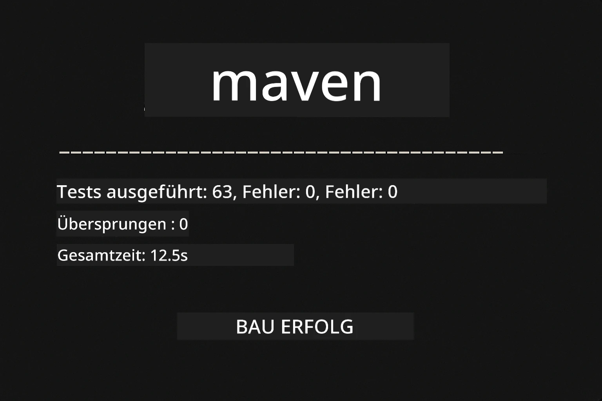
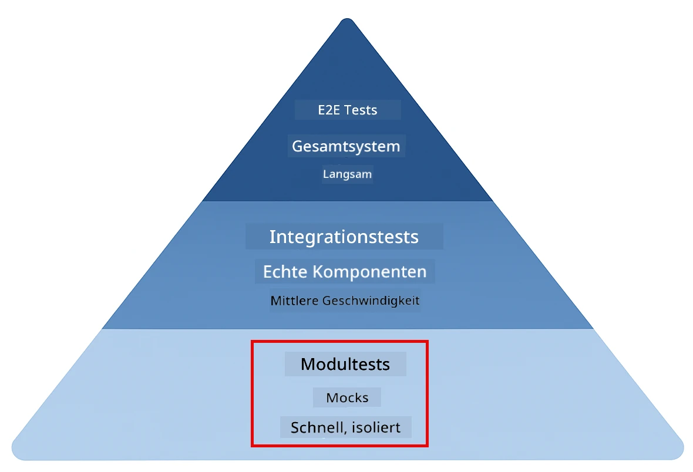
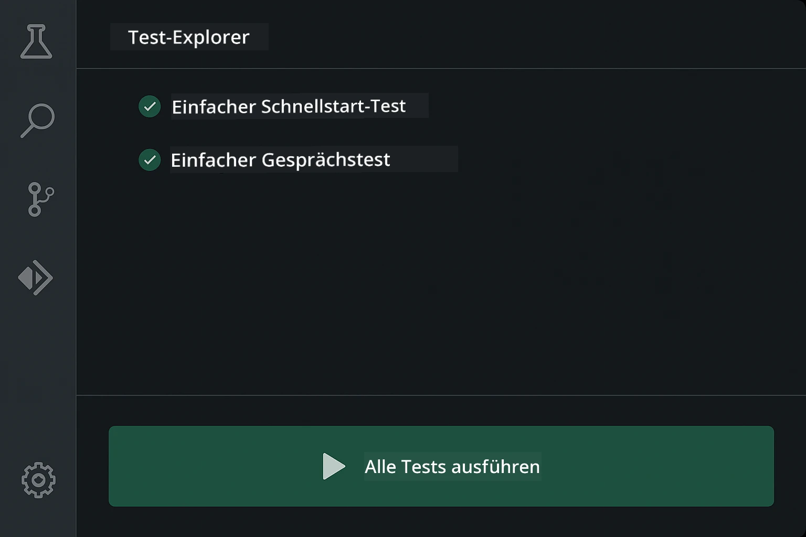
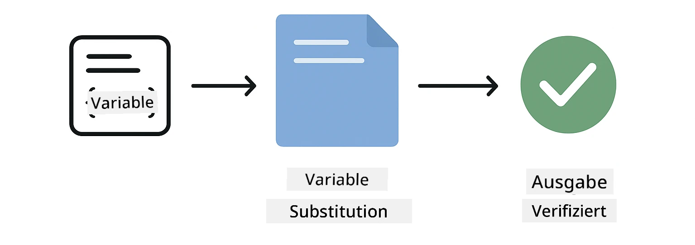
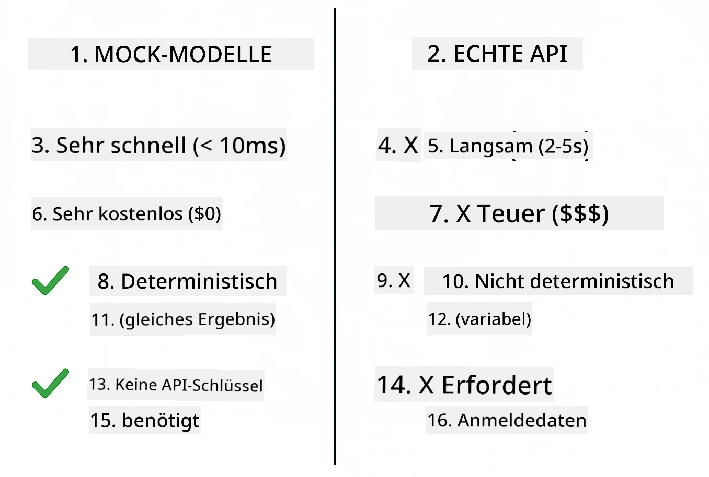
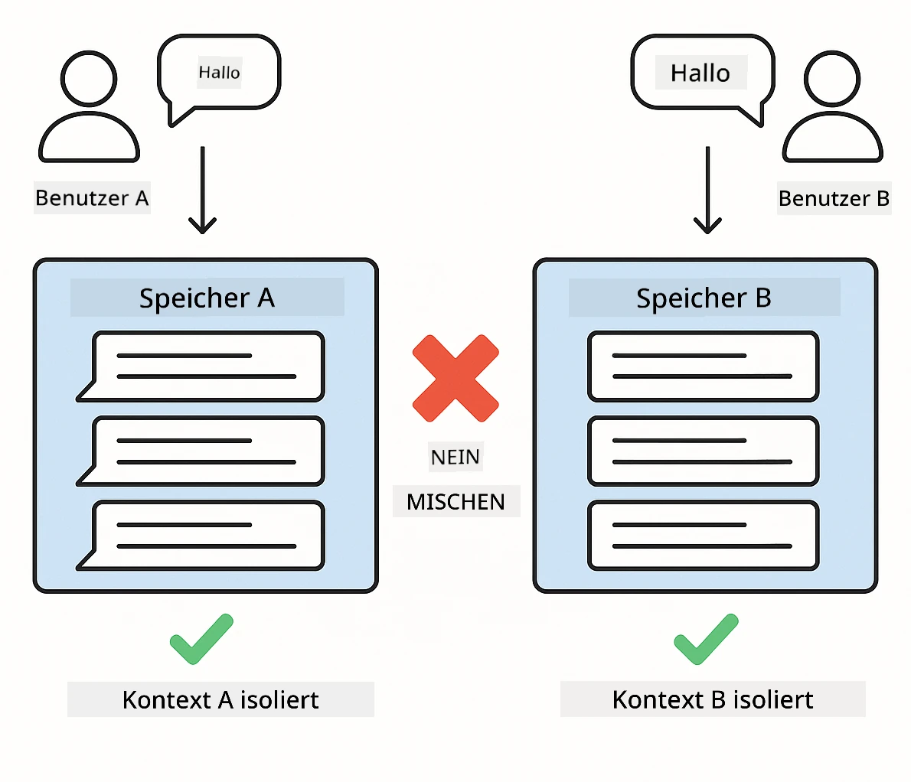
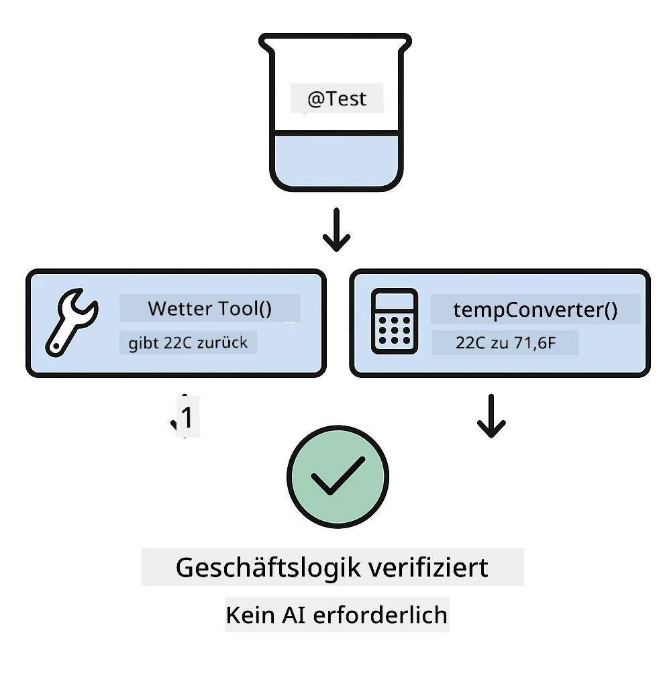

<!--
CO_OP_TRANSLATOR_METADATA:
{
  "original_hash": "ed93b3c14d58734ac10162967da958c1",
  "translation_date": "2025-12-30T19:50:27+00:00",
  "source_file": "docs/TESTING.md",
  "language_code": "de"
}
-->
# Testen von LangChain4j-Anwendungen

## Inhaltsverzeichnis

- [Quick Start](../../../docs)
- [Was die Tests abdecken](../../../docs)
- [Tests ausführen](../../../docs)
- [Tests in VS Code ausführen](../../../docs)
- [Testmuster](../../../docs)
- [Testphilosophie](../../../docs)
- [Nächste Schritte](../../../docs)

Dieser Leitfaden führt Sie durch die Tests, die zeigen, wie man KI-Anwendungen testet, ohne API-Schlüssel oder externe Dienste zu benötigen.

## Schnellstart

Führen Sie alle Tests mit einem einzigen Befehl aus:

**Bash:**
```bash
mvn test
```

**PowerShell:**
```powershell
mvn --% test
```



*Erfolgreiche Testausführung, bei der alle Tests ohne Fehler bestanden wurden*

## Was die Tests abdecken

Dieser Kurs konzentriert sich auf **Unit-Tests**, die lokal ausgeführt werden. Jeder Test demonstriert ein bestimmtes LangChain4j-Konzept isoliert.



*Testpyramide, die das Verhältnis zwischen Unit-Tests (schnell, isoliert), Integrationstests (reale Komponenten) und End-to-End-Tests zeigt. Dieses Training behandelt Unit-Tests.*

| Module | Tests | Fokus | Key Files |
|--------|-------|-------|-----------|
| **00 - Schnellstart** | 6 | Prompt-Vorlagen und Variablenersetzung | `SimpleQuickStartTest.java` |
| **01 - Einführung** | 8 | Konversationsspeicher und zustandsbehafteter Chat | `SimpleConversationTest.java` |
| **02 - Prompt-Engineering** | 12 | GPT-5-Muster, Eifer-Stufen, strukturierte Ausgabe | `SimpleGpt5PromptTest.java` |
| **03 - RAG** | 10 | Dokumentaufnahme, Embeddings, Ähnlichkeitssuche | `DocumentServiceTest.java` |
| **04 - Tools** | 12 | Function calling und Tool-Chaining | `SimpleToolsTest.java` |
| **05 - MCP** | 8 | Model Context Protocol mit Stdio-Transport | `SimpleMcpTest.java` |

## Tests ausführen

**Führen Sie alle Tests vom Projektstamm aus:**

**Bash:**
```bash
mvn test
```

**PowerShell:**
```powershell
mvn --% test
```

**Führen Sie Tests für ein bestimmtes Modul aus:**

**Bash:**
```bash
cd 01-introduction && mvn test
# Oder als root
mvn test -pl 01-introduction
```

**PowerShell:**
```powershell
cd 01-introduction; mvn --% test
# Oder als Root
mvn --% test -pl 01-introduction
```

**Führen Sie eine einzelne Testklasse aus:**

**Bash:**
```bash
mvn test -Dtest=SimpleConversationTest
```

**PowerShell:**
```powershell
mvn --% test -Dtest=SimpleConversationTest
```

**Führen Sie eine bestimmte Testmethode aus:**

**Bash:**
```bash
mvn test -Dtest=SimpleConversationTest#Gesprächsverlauf beibehalten
```

**PowerShell:**
```powershell
mvn --% test -Dtest=SimpleConversationTest#sollKonversationsverlaufBeibehalten
```

## Tests in VS Code ausführen

Wenn Sie Visual Studio Code verwenden, bietet der Test Explorer eine grafische Oberfläche zum Ausführen und Debuggen von Tests.



*VS Code Test-Explorer, der den Testbaum mit allen Java-Testklassen und einzelnen Testmethoden anzeigt*

**So führen Sie Tests in VS Code aus:**

1. Öffnen Sie den Test Explorer, indem Sie auf das Kolben-Symbol in der Aktivitätsleiste klicken
2. Erweitern Sie den Testbaum, um alle Module und Testklassen zu sehen
3. Klicken Sie auf die Wiedergabetaste neben einem Test, um ihn einzeln auszuführen
4. Klicken Sie auf "Run All Tests", um die gesamte Suite auszuführen
5. Klicken Sie mit der rechten Maustaste auf einen Test und wählen Sie "Debug Test", um Haltepunkte zu setzen und schrittweise durch den Code zu gehen

Der Test Explorer zeigt grüne Häkchen für bestandene Tests und liefert detaillierte Fehlermeldungen, wenn Tests fehlschlagen.

## Testmuster

### Muster 1: Testen von Prompt-Vorlagen

Das einfachste Muster testet Prompt-Vorlagen, ohne ein KI-Modell aufzurufen. Sie prüfen, dass die Variablenersetzung korrekt funktioniert und die Prompts wie erwartet formatiert sind.



*Testen von Prompt-Vorlagen, die den Ablauf der Variablenersetzung zeigen: Vorlage mit Platzhaltern → Werte angewendet → formatiertes Ausgabeergebnis überprüft*

```java
@Test
@DisplayName("Should format prompt template with variables")
void testPromptTemplateFormatting() {
    PromptTemplate template = PromptTemplate.from(
        "Best time to visit {{destination}} for {{activity}}?"
    );
    
    Prompt prompt = template.apply(Map.of(
        "destination", "Paris",
        "activity", "sightseeing"
    ));
    
    assertThat(prompt.text()).isEqualTo("Best time to visit Paris for sightseeing?");
}
```

Dieser Test befindet sich in `00-quick-start/src/test/java/com/example/langchain4j/quickstart/SimpleQuickStartTest.java`.

**Führen Sie ihn aus:**

**Bash:**
```bash
cd 00-quick-start && mvn test -Dtest=SimpleQuickStartTest#Test der Formatierung der Prompt-Vorlage
```

**PowerShell:**
```powershell
cd 00-quick-start; mvn --% test -Dtest=SimpleQuickStartTest#Test der Formatierung von Prompt-Vorlagen
```

### Muster 2: Mocking von Sprachmodellen

Beim Testen von Konversationslogik verwenden Sie Mockito, um gefälschte Modelle zu erstellen, die vorbestimmte Antworten zurückgeben. Dadurch werden die Tests schnell, kostenlos und deterministisch.



*Vergleich, der zeigt, warum Mocks für Tests bevorzugt werden: Sie sind schnell, kostenfrei, deterministisch und erfordern keine API-Schlüssel*

```java
@ExtendWith(MockitoExtension.class)
class SimpleConversationTest {
    
    private ConversationService conversationService;
    
    @Mock
    private OpenAiOfficialChatModel mockChatModel;
    
    @BeforeEach
    void setUp() {
        ChatResponse mockResponse = ChatResponse.builder()
            .aiMessage(AiMessage.from("This is a test response"))
            .build();
        when(mockChatModel.chat(anyList())).thenReturn(mockResponse);
        
        conversationService = new ConversationService(mockChatModel);
    }
    
    @Test
    void shouldMaintainConversationHistory() {
        String conversationId = conversationService.startConversation();
        
        ChatResponse mockResponse1 = ChatResponse.builder()
            .aiMessage(AiMessage.from("Response 1"))
            .build();
        ChatResponse mockResponse2 = ChatResponse.builder()
            .aiMessage(AiMessage.from("Response 2"))
            .build();
        ChatResponse mockResponse3 = ChatResponse.builder()
            .aiMessage(AiMessage.from("Response 3"))
            .build();
        
        when(mockChatModel.chat(anyList()))
            .thenReturn(mockResponse1)
            .thenReturn(mockResponse2)
            .thenReturn(mockResponse3);

        conversationService.chat(conversationId, "First message");
        conversationService.chat(conversationId, "Second message");
        conversationService.chat(conversationId, "Third message");

        List<ChatMessage> history = conversationService.getHistory(conversationId);
        assertThat(history).hasSize(6); // 3 Benutzernachrichten + 3 KI-Nachrichten
    }
}
```

Dieses Muster findet sich in `01-introduction/src/test/java/com/example/langchain4j/service/SimpleConversationTest.java`. Der Mock gewährleistet konsistentes Verhalten, sodass Sie die Speicherverwaltung korrekt verifizieren können.

### Muster 3: Testen der Konversationsisolation

Der Konversationsspeicher muss mehrere Benutzer getrennt halten. Dieser Test verifiziert, dass Kontexte nicht vermischt werden.



*Testen der Konversationsisolation, die separate Speichersysteme für verschiedene Benutzer zeigt, um Kontextvermischung zu verhindern*

```java
@Test
void shouldIsolateConversationsByid() {
    String conv1 = conversationService.startConversation();
    String conv2 = conversationService.startConversation();
    
    ChatResponse mockResponse = ChatResponse.builder()
        .aiMessage(AiMessage.from("Response"))
        .build();
    when(mockChatModel.chat(anyList())).thenReturn(mockResponse);

    conversationService.chat(conv1, "Message for conversation 1");
    conversationService.chat(conv2, "Message for conversation 2");

    List<ChatMessage> history1 = conversationService.getHistory(conv1);
    List<ChatMessage> history2 = conversationService.getHistory(conv2);
    
    assertThat(history1).hasSize(2);
    assertThat(history2).hasSize(2);
}
```

Jede Konversation führt ihre eigene, unabhängige Historie. In Produktionssystemen ist diese Isolation für Multi-User-Anwendungen kritisch.

### Muster 4: Tools unabhängig testen

Tools sind Funktionen, die die KI aufrufen kann. Testen Sie sie direkt, um sicherzustellen, dass sie unabhängig von KI-Entscheidungen korrekt funktionieren.



*Unabhängiges Testen von Tools, das die mock-basierte Ausführung von Tools ohne KI-Aufrufe zeigt, um die Geschäftslogik zu überprüfen*

```java
@Test
void shouldConvertCelsiusToFahrenheit() {
    TemperatureTool tempTool = new TemperatureTool();
    String result = tempTool.celsiusToFahrenheit(25.0);
    assertThat(result).containsPattern("77[.,]0°F");
}

@Test
void shouldDemonstrateToolChaining() {
    WeatherTool weatherTool = new WeatherTool();
    TemperatureTool tempTool = new TemperatureTool();

    String weatherResult = weatherTool.getCurrentWeather("Seattle");
    assertThat(weatherResult).containsPattern("\\d+°C");

    String conversionResult = tempTool.celsiusToFahrenheit(22.0);
    assertThat(conversionResult).containsPattern("71[.,]6°F");
}
```

Diese Tests aus `04-tools/src/test/java/com/example/langchain4j/agents/tools/SimpleToolsTest.java` validieren die Tool-Logik ohne KI-Beteiligung. Das Chaining-Beispiel zeigt, wie die Ausgabe eines Tools als Eingabe für ein anderes verwendet wird.

### Muster 5: In-Memory RAG-Tests

RAG-Systeme erfordern traditionell Vektor-Datenbanken und Embedding-Services. Das In-Memory-Muster ermöglicht es, die gesamte Pipeline ohne externe Abhängigkeiten zu testen.


*In-Memory-RAG-Testworkflow, der das Parsen von Dokumenten, die Speicherung von Embeddings und die Ähnlichkeitssuche ohne Datenbank zeigt*

```java
@Test
void testProcessTextDocument() {
    String content = "This is a test document.\nIt has multiple lines.";
    InputStream inputStream = new ByteArrayInputStream(content.getBytes(StandardCharsets.UTF_8));
    
    DocumentService.ProcessedDocument result = 
        documentService.processDocument(inputStream, "test.txt");

    assertNotNull(result);
    assertTrue(result.segments().size() > 0);
    assertEquals("test.txt", result.segments().get(0).metadata().getString("filename"));
}
```

Dieser Test aus `03-rag/src/test/java/com/example/langchain4j/rag/service/DocumentServiceTest.java` erstellt ein Dokument im Speicher und verifiziert Chunking und Metadatenverarbeitung.

### Muster 6: MCP-Integrationstests

Das MCP-Modul testet die Integration des Model Context Protocols unter Verwendung des stdio-Transports. Diese Tests verifizieren, dass Ihre Anwendung MCP-Server als Subprozesse starten und mit ihnen kommunizieren kann.

Die Tests in `05-mcp/src/test/java/com/example/langchain4j/mcp/SimpleMcpTest.java` validieren das Verhalten des MCP-Clients.

**Führen Sie sie aus:**

**Bash:**
```bash
cd 05-mcp && mvn test
```

**PowerShell:**
```powershell
cd 05-mcp; mvn --% test
```

## Testphilosophie

Testen Sie Ihren Code, nicht die KI. Ihre Tests sollten den von Ihnen geschriebenen Code validieren, indem sie prüfen, wie Prompts konstruiert werden, wie Speicher verwaltet wird und wie Tools ausgeführt werden. KI-Antworten variieren und sollten nicht Teil von Testassertionen sein. Fragen Sie sich, ob Ihre Prompt-Vorlage Variablen korrekt ersetzt, nicht, ob die KI die richtige Antwort gibt.

Verwenden Sie Mocks für Sprachmodelle. Sie sind externe Abhängigkeiten, die langsam, teuer und nicht deterministisch sind. Mocking macht Tests schnell (Millisekunden statt Sekunden), kostenfrei (keine API-Kosten) und deterministisch (immer dasselbe Ergebnis).

Halten Sie Tests unabhängig. Jeder Test sollte seine eigenen Daten einrichten, sich nicht auf andere Tests verlassen und nach sich selbst aufräumen. Tests sollten unabhängig von der Ausführungsreihenfolge bestehen.

Testen Sie Grenzfälle über den Happy Path hinaus. Probieren Sie leere Eingaben, sehr große Eingaben, Sonderzeichen, ungültige Parameter und Randbedingungen. Diese decken oft Fehler auf, die bei normaler Nutzung nicht sichtbar werden.

Verwenden Sie aussagekräftige Namen. Vergleichen Sie `shouldMaintainConversationHistoryAcrossMultipleMessages()` mit `test1()`. Der erste Name sagt genau, was getestet wird, und erleichtert das Debuggen von Fehlern erheblich.

## Nächste Schritte

Jetzt, da Sie die Testmuster verstanden haben, vertiefen Sie sich in jedes Modul:

- **[00 - Schnellstart](../00-quick-start/README.md)** - Beginnen Sie mit den Grundlagen von Prompt-Vorlagen
- **[01 - Einführung](../01-introduction/README.md)** - Erfahren Sie mehr über das Management des Konversationsspeichers
- **[02 - Prompt-Engineering](../02-prompt-engineering/README.md)** - Meistern Sie die GPT-5-Prompting-Muster
- **[03 - RAG](../03-rag/README.md)** - Erstellen Sie Retrieval-augmented-Generation-Systeme
- **[04 - Tools](../04-tools/README.md)** - Implementieren Sie Funktionsaufrufe und Tool-Chains
- **[05 - MCP](../05-mcp/README.md)** - Integrieren Sie das Model Context Protocol

Das README jedes Moduls bietet detaillierte Erklärungen der hier getesteten Konzepte.

---

**Navigation:** [← Zurück zur Hauptseite](../README.md)

---

<!-- CO-OP TRANSLATOR DISCLAIMER START -->
Haftungsausschluss:
Dieses Dokument wurde mithilfe des KI-Übersetzungsdienstes Co-op Translator (https://github.com/Azure/co-op-translator) übersetzt. Obwohl wir uns um Genauigkeit bemühen, beachten Sie bitte, dass automatische Übersetzungen Fehler oder Ungenauigkeiten enthalten können. Das Originaldokument in seiner Originalsprache ist als maßgebliche Quelle zu betrachten. Für kritische Informationen wird eine professionelle menschliche Übersetzung empfohlen. Wir übernehmen keine Haftung für Missverständnisse oder Fehlinterpretationen, die aus der Verwendung dieser Übersetzung entstehen.
<!-- CO-OP TRANSLATOR DISCLAIMER END -->