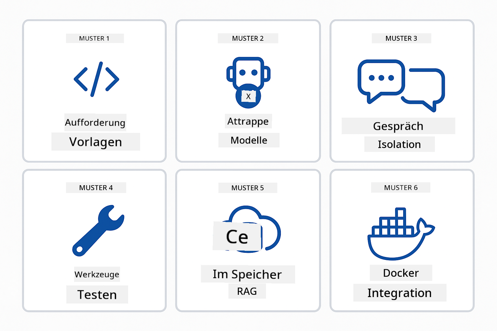
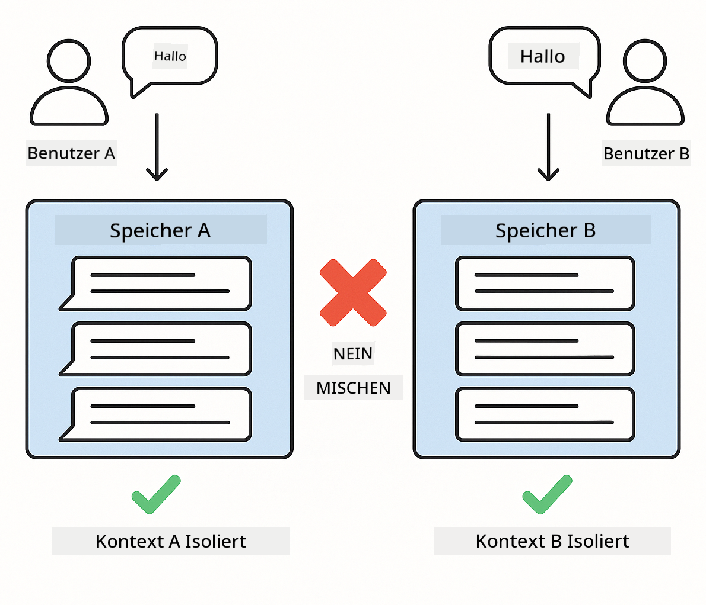
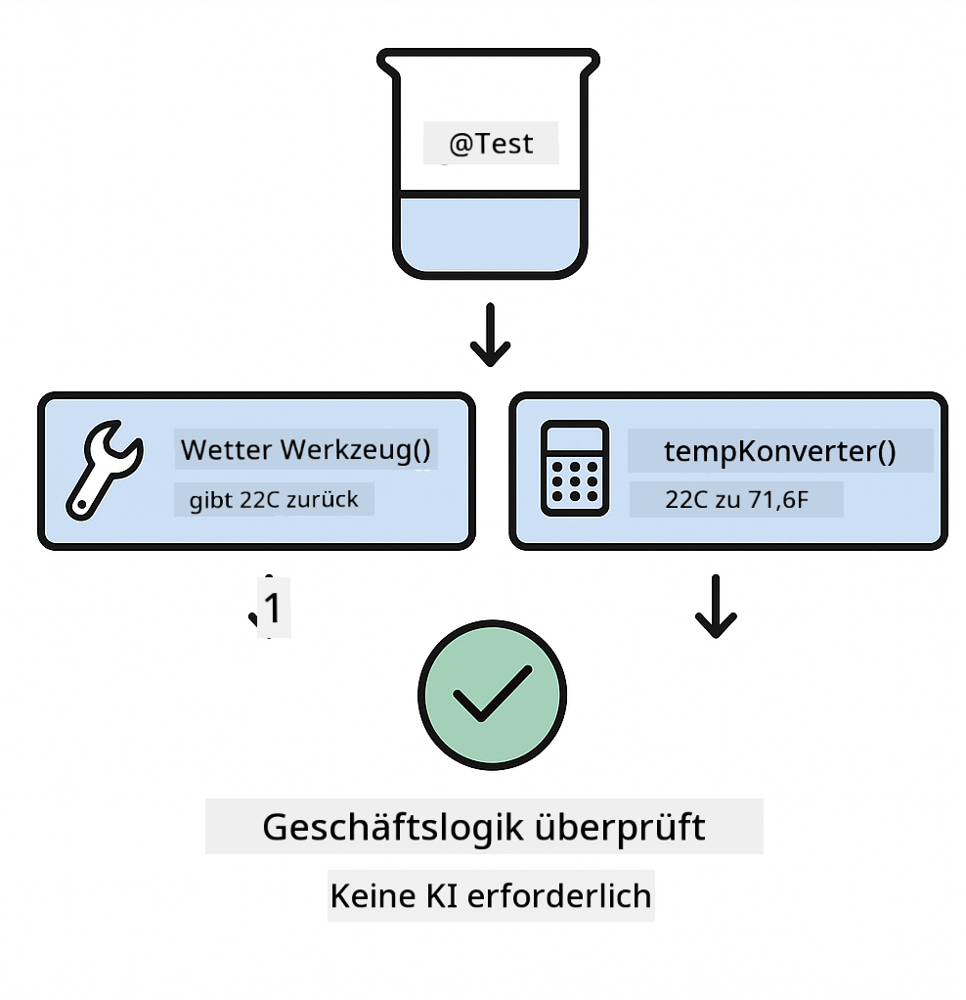
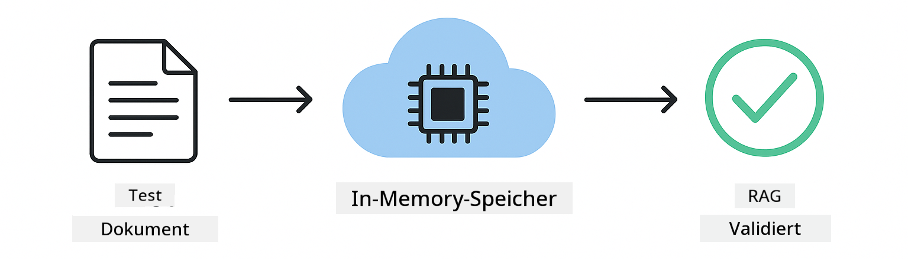

<!--
CO_OP_TRANSLATOR_METADATA:
{
  "original_hash": "b975537560c404d5f254331832811e78",
  "translation_date": "2025-12-13T20:34:20+00:00",
  "source_file": "docs/TESTING.md",
  "language_code": "de"
}
-->
# Testen von LangChain4j-Anwendungen

## Inhaltsverzeichnis

- [Schnellstart](../../../docs)
- [Was die Tests abdecken](../../../docs)
- [Tests ausführen](../../../docs)
- [Tests in VS Code ausführen](../../../docs)
- [Testmuster](../../../docs)
- [Testphilosophie](../../../docs)
- [Nächste Schritte](../../../docs)

Dieser Leitfaden führt Sie durch die Tests, die zeigen, wie man KI-Anwendungen testet, ohne API-Schlüssel oder externe Dienste zu benötigen.

## Schnellstart

Führen Sie alle Tests mit einem einzigen Befehl aus:

**Bash:**
```bash
mvn test
```

**PowerShell:**
```powershell
mvn --% test
```


*Erfolgreiche Testausführung, die zeigt, dass alle Tests ohne Fehler bestanden wurden*

## Was die Tests abdecken

Dieser Kurs konzentriert sich auf **Unit-Tests**, die lokal ausgeführt werden. Jeder Test demonstriert ein spezifisches LangChain4j-Konzept isoliert.


*Testpyramide, die das Gleichgewicht zwischen Unit-Tests (schnell, isoliert), Integrationstests (reale Komponenten) und End-to-End-Tests (vollständiges System mit Docker) zeigt. Dieses Training behandelt Unit-Tests.*

| Modul | Tests | Fokus | Wichtige Dateien |
|--------|-------|-------|-----------|
| **00 - Schnellstart** | 6 | Prompt-Vorlagen und Variablensubstitution | `SimpleQuickStartTest.java` |
| **01 - Einführung** | 8 | Gesprächsspeicher und zustandsbehafteter Chat | `SimpleConversationTest.java` |
| **02 - Prompt Engineering** | 12 | GPT-5-Muster, Eifer-Level, strukturierte Ausgabe | `SimpleGpt5PromptTest.java` |
| **03 - RAG** | 10 | Dokumentenaufnahme, Einbettungen, Ähnlichkeitssuche | `DocumentServiceTest.java` |
| **04 - Tools** | 12 | Funktionsaufrufe und Tool-Verkettung | `SimpleToolsTest.java` |
| **05 - MCP** | 15 | Model Context Protocol mit Docker | `SimpleMcpTest.java`, `McpDockerTransportTest.java` |

## Tests ausführen

**Alle Tests vom Root-Verzeichnis aus ausführen:**

**Bash:**
```bash
mvn test
```

**PowerShell:**
```powershell
mvn --% test
```

**Tests für ein bestimmtes Modul ausführen:**

**Bash:**
```bash
cd 01-introduction && mvn test
# Oder vom Stammverzeichnis
mvn test -pl 01-introduction
```

**PowerShell:**
```powershell
cd 01-introduction; mvn --% test
# Oder vom Stammverzeichnis
mvn --% test -pl 01-introduction
```

**Eine einzelne Testklasse ausführen:**

**Bash:**
```bash
mvn test -Dtest=SimpleConversationTest
```

**PowerShell:**
```powershell
mvn --% test -Dtest=SimpleConversationTest
```

**Eine bestimmte Testmethode ausführen:**

**Bash:**
```bash
mvn test -Dtest=SimpleConversationTest#sollteGesprächsverlaufBeibehalten
```

**PowerShell:**
```powershell
mvn --% test -Dtest=SimpleConversationTest#sollteGesprächsverlaufBeibehalten
```

## Tests in VS Code ausführen

Wenn Sie Visual Studio Code verwenden, bietet der Test-Explorer eine grafische Oberfläche zum Ausführen und Debuggen von Tests.


*VS Code Test-Explorer zeigt den Testbaum mit allen Java-Testklassen und einzelnen Testmethoden*

**So führen Sie Tests in VS Code aus:**

1. Öffnen Sie den Test-Explorer, indem Sie auf das Reagenzglas-Symbol in der Aktivitätsleiste klicken
2. Erweitern Sie den Testbaum, um alle Module und Testklassen zu sehen
3. Klicken Sie auf die Wiedergabetaste neben einem Test, um ihn einzeln auszuführen
4. Klicken Sie auf „Alle Tests ausführen“, um die gesamte Suite auszuführen
5. Klicken Sie mit der rechten Maustaste auf einen Test und wählen Sie „Test debuggen“, um Haltepunkte zu setzen und den Code schrittweise zu durchlaufen

Der Test-Explorer zeigt grüne Häkchen für bestandene Tests und liefert detaillierte Fehlermeldungen, wenn Tests fehlschlagen.

## Testmuster



*Sechs Testmuster für LangChain4j-Anwendungen: Prompt-Vorlagen, Mocking von Modellen, Gesprächs-Isolation, Tool-Tests, In-Memory RAG und Docker-Integration*

### Muster 1: Testen von Prompt-Vorlagen

Das einfachste Muster testet Prompt-Vorlagen, ohne ein KI-Modell aufzurufen. Sie überprüfen, ob die Variablensubstitution korrekt funktioniert und die Prompts wie erwartet formatiert sind.


*Testen von Prompt-Vorlagen, das den Ablauf der Variablensubstitution zeigt: Vorlage mit Platzhaltern → Werte angewendet → formatierte Ausgabe überprüft*

```java
@Test
@DisplayName("Should format prompt template with variables")
void testPromptTemplateFormatting() {
    PromptTemplate template = PromptTemplate.from(
        "Best time to visit {{destination}} for {{activity}}?"
    );
    
    Prompt prompt = template.apply(Map.of(
        "destination", "Paris",
        "activity", "sightseeing"
    ));
    
    assertThat(prompt.text()).isEqualTo("Best time to visit Paris for sightseeing?");
}
```

Dieser Test befindet sich in `00-quick-start/src/test/java/com/example/langchain4j/quickstart/SimpleQuickStartTest.java`.

**Ausführen:**

**Bash:**
```bash
cd 00-quick-start && mvn test -Dtest=SimpleQuickStartTest#testPromptTemplateFormatierung
```

**PowerShell:**
```powershell
cd 00-quick-start; mvn --% test -Dtest=SimpleQuickStartTest#testPromptTemplateFormatierung
```

### Muster 2: Mocking von Sprachmodellen

Beim Testen der Gesprächslogik verwenden Sie Mockito, um gefälschte Modelle zu erstellen, die vorbestimmte Antworten zurückgeben. Das macht Tests schnell, kostenlos und deterministisch.


*Vergleich, der zeigt, warum Mocks für Tests bevorzugt werden: Sie sind schnell, kostenlos, deterministisch und benötigen keine API-Schlüssel*

```java
@ExtendWith(MockitoExtension.class)
class SimpleConversationTest {
    
    private ConversationService conversationService;
    
    @Mock
    private OpenAiOfficialChatModel mockChatModel;
    
    @BeforeEach
    void setUp() {
        ChatResponse mockResponse = ChatResponse.builder()
            .aiMessage(AiMessage.from("This is a test response"))
            .build();
        when(mockChatModel.chat(anyList())).thenReturn(mockResponse);
        
        conversationService = new ConversationService(mockChatModel);
    }
    
    @Test
    void shouldMaintainConversationHistory() {
        String conversationId = conversationService.startConversation();
        
        ChatResponse mockResponse1 = ChatResponse.builder()
            .aiMessage(AiMessage.from("Response 1"))
            .build();
        ChatResponse mockResponse2 = ChatResponse.builder()
            .aiMessage(AiMessage.from("Response 2"))
            .build();
        ChatResponse mockResponse3 = ChatResponse.builder()
            .aiMessage(AiMessage.from("Response 3"))
            .build();
        
        when(mockChatModel.chat(anyList()))
            .thenReturn(mockResponse1)
            .thenReturn(mockResponse2)
            .thenReturn(mockResponse3);

        conversationService.chat(conversationId, "First message");
        conversationService.chat(conversationId, "Second message");
        conversationService.chat(conversationId, "Third message");

        List<ChatMessage> history = conversationService.getHistory(conversationId);
        assertThat(history).hasSize(6); // 3 Benutzer- + 3 KI-Nachrichten
    }
}
```

Dieses Muster erscheint in `01-introduction/src/test/java/com/example/langchain4j/service/SimpleConversationTest.java`. Das Mock sorgt für konsistentes Verhalten, sodass Sie überprüfen können, ob das Speichermanagement korrekt funktioniert.

### Muster 3: Testen der Gesprächs-Isolation

Der Gesprächsspeicher muss mehrere Benutzer getrennt halten. Dieser Test überprüft, dass Gespräche keine Kontexte vermischen.



*Testen der Gesprächs-Isolation, das separate Speicherbereiche für verschiedene Benutzer zeigt, um Kontextvermischung zu verhindern*

```java
@Test
void shouldIsolateConversationsByid() {
    String conv1 = conversationService.startConversation();
    String conv2 = conversationService.startConversation();
    
    ChatResponse mockResponse = ChatResponse.builder()
        .aiMessage(AiMessage.from("Response"))
        .build();
    when(mockChatModel.chat(anyList())).thenReturn(mockResponse);

    conversationService.chat(conv1, "Message for conversation 1");
    conversationService.chat(conv2, "Message for conversation 2");

    List<ChatMessage> history1 = conversationService.getHistory(conv1);
    List<ChatMessage> history2 = conversationService.getHistory(conv2);
    
    assertThat(history1).hasSize(2);
    assertThat(history2).hasSize(2);
}
```

Jedes Gespräch führt seine eigene unabhängige Historie. In Produktionssystemen ist diese Isolation für Multi-User-Anwendungen entscheidend.

### Muster 4: Tools unabhängig testen

Tools sind Funktionen, die die KI aufrufen kann. Testen Sie sie direkt, um sicherzustellen, dass sie unabhängig von KI-Entscheidungen korrekt funktionieren.



*Unabhängiges Testen von Tools, das die Ausführung von Mock-Tools ohne KI-Aufrufe zeigt, um die Geschäftslogik zu überprüfen*

```java
@Test
void shouldConvertCelsiusToFahrenheit() {
    TemperatureTool tempTool = new TemperatureTool();
    String result = tempTool.celsiusToFahrenheit(25.0);
    assertThat(result).containsPattern("77[.,]0°F");
}

@Test
void shouldDemonstrateToolChaining() {
    WeatherTool weatherTool = new WeatherTool();
    TemperatureTool tempTool = new TemperatureTool();

    String weatherResult = weatherTool.getCurrentWeather("Seattle");
    assertThat(weatherResult).containsPattern("\\d+°C");

    String conversionResult = tempTool.celsiusToFahrenheit(22.0);
    assertThat(conversionResult).containsPattern("71[.,]6°F");
}
```

Diese Tests aus `04-tools/src/test/java/com/example/langchain4j/agents/tools/SimpleToolsTest.java` validieren die Tool-Logik ohne KI-Beteiligung. Das Verkettungsbeispiel zeigt, wie die Ausgabe eines Tools in die Eingabe eines anderen fließt.

### Muster 5: In-Memory RAG-Test

RAG-Systeme benötigen traditionell Vektordatenbanken und Einbettungsdienste. Das In-Memory-Muster ermöglicht es, die gesamte Pipeline ohne externe Abhängigkeiten zu testen.



*In-Memory RAG-Testablauf, der Dokumentenparsing, Einbettungsspeicherung und Ähnlichkeitssuche zeigt, ohne eine Datenbank zu benötigen*

```java
@Test
void testProcessTextDocument() {
    String content = "This is a test document.\nIt has multiple lines.";
    InputStream inputStream = new ByteArrayInputStream(content.getBytes(StandardCharsets.UTF_8));
    
    DocumentService.ProcessedDocument result = 
        documentService.processDocument(inputStream, "test.txt");

    assertNotNull(result);
    assertTrue(result.segments().size() > 0);
    assertEquals("test.txt", result.segments().get(0).metadata().getString("filename"));
}
```

Dieser Test aus `03-rag/src/test/java/com/example/langchain4j/rag/service/DocumentServiceTest.java` erstellt ein Dokument im Speicher und überprüft Chunking und Metadatenverarbeitung.

### Muster 6: Integrationstests mit Docker

Einige Funktionen benötigen echte Infrastruktur. Das MCP-Modul verwendet Testcontainers, um Docker-Container für Integrationstests zu starten. Diese validieren, dass Ihr Code mit echten Diensten funktioniert und gleichzeitig Testisolation gewährleistet ist.


*MCP-Integrationstest mit Testcontainers, der den automatisierten Container-Lebenszyklus zeigt: Start, Testausführung, Stopp und Bereinigung*

Die Tests in `05-mcp/src/test/java/com/example/langchain4j/mcp/McpDockerTransportTest.java` erfordern, dass Docker läuft.

**Ausführen:**

**Bash:**
```bash
cd 05-mcp && mvn test
```

**PowerShell:**
```powershell
cd 05-mcp; mvn --% test
```

## Testphilosophie

Teste deinen Code, nicht die KI. Deine Tests sollten den von dir geschriebenen Code validieren, indem sie überprüfen, wie Prompts konstruiert werden, wie Speicher verwaltet wird und wie Tools ausgeführt werden. KI-Antworten variieren und sollten nicht Teil von Testbehauptungen sein. Frage dich, ob deine Prompt-Vorlage Variablen korrekt ersetzt, nicht ob die KI die richtige Antwort gibt.

Verwende Mocks für Sprachmodelle. Sie sind externe Abhängigkeiten, die langsam, teuer und nicht deterministisch sind. Mocking macht Tests schnell mit Millisekunden statt Sekunden, kostenlos ohne API-Kosten und deterministisch mit immer demselben Ergebnis.

Halte Tests unabhängig. Jeder Test sollte seine eigenen Daten einrichten, sich nicht auf andere Tests verlassen und sich selbst aufräumen. Tests sollten unabhängig von der Ausführungsreihenfolge bestehen.

Teste Randfälle über den Happy Path hinaus. Probiere leere Eingaben, sehr große Eingaben, Sonderzeichen, ungültige Parameter und Grenzwerte. Diese decken oft Fehler auf, die bei normaler Nutzung nicht sichtbar sind.

Verwende beschreibende Namen. Vergleiche `shouldMaintainConversationHistoryAcrossMultipleMessages()` mit `test1()`. Der erste Name sagt genau, was getestet wird, und erleichtert das Debuggen von Fehlern erheblich.

## Nächste Schritte

Jetzt, da Sie die Testmuster verstehen, vertiefen Sie sich in jedes Modul:

- **[00 - Schnellstart](../00-quick-start/README.md)** - Beginnen Sie mit den Grundlagen der Prompt-Vorlagen
- **[01 - Einführung](../01-introduction/README.md)** - Lernen Sie das Gesprächsspeichermanagement kennen
- **[02 - Prompt Engineering](../02-prompt-engineering/README.md)** - Meistern Sie GPT-5-Prompting-Muster
- **[03 - RAG](../03-rag/README.md)** - Bauen Sie retrieval-augmented generation Systeme
- **[04 - Tools](../04-tools/README.md)** - Implementieren Sie Funktionsaufrufe und Tool-Ketten
- **[05 - MCP](../05-mcp/README.md)** - Integrieren Sie Model Context Protocol mit Docker

Das README jedes Moduls bietet detaillierte Erklärungen der hier getesteten Konzepte.

---

**Navigation:** [← Zurück zur Hauptseite](../README.md)

---

<!-- CO-OP TRANSLATOR DISCLAIMER START -->
**Haftungsausschluss**:  
Dieses Dokument wurde mit dem KI-Übersetzungsdienst [Co-op Translator](https://github.com/Azure/co-op-translator) übersetzt. Obwohl wir uns um Genauigkeit bemühen, beachten Sie bitte, dass automatisierte Übersetzungen Fehler oder Ungenauigkeiten enthalten können. Das Originaldokument in seiner Ursprungssprache gilt als maßgebliche Quelle. Für wichtige Informationen wird eine professionelle menschliche Übersetzung empfohlen. Wir übernehmen keine Haftung für Missverständnisse oder Fehlinterpretationen, die aus der Nutzung dieser Übersetzung entstehen.
<!-- CO-OP TRANSLATOR DISCLAIMER END -->