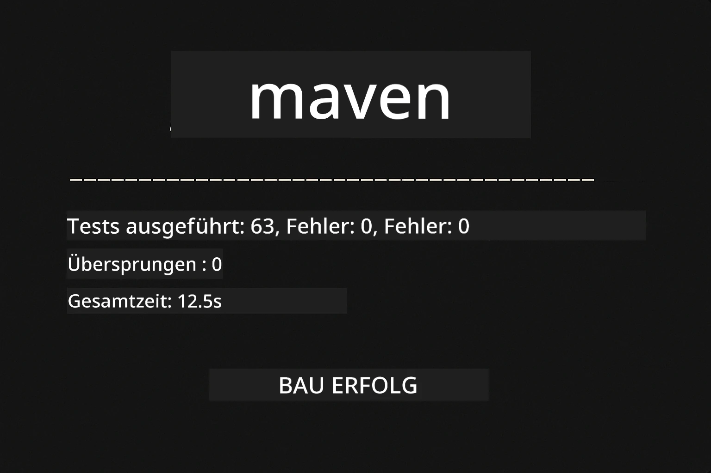
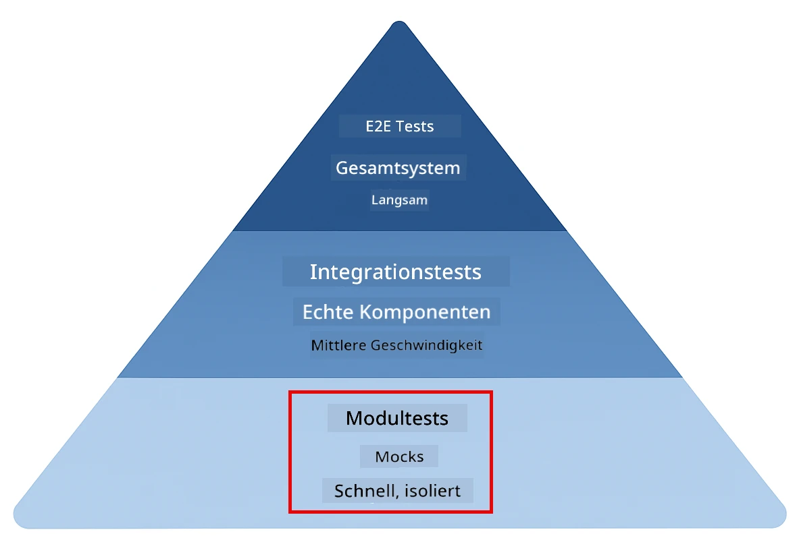
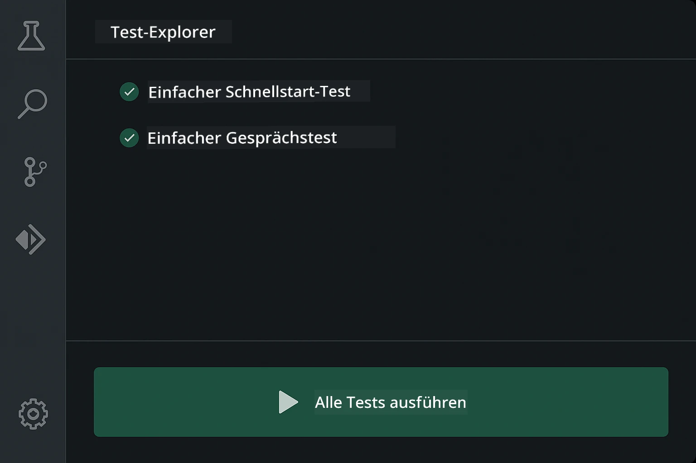
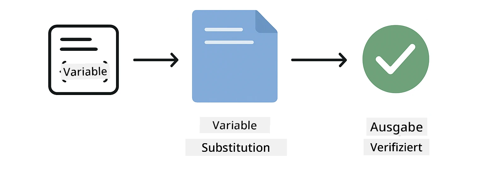
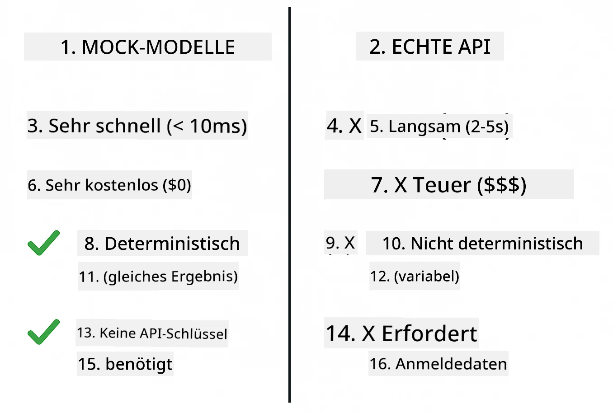
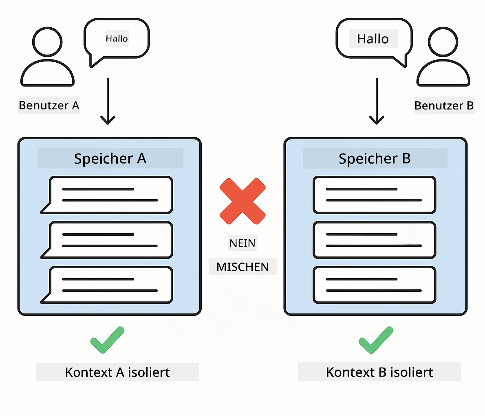
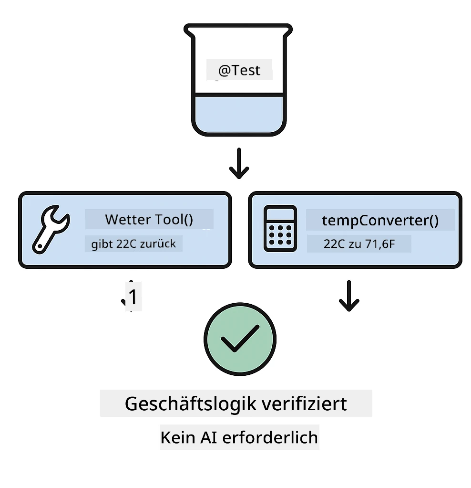
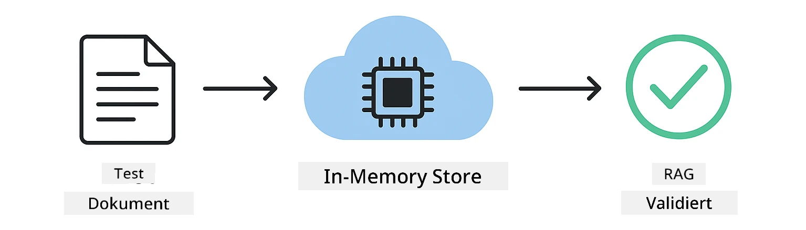

# Testen von LangChain4j-Anwendungen

## Inhaltsverzeichnis

- [Schnellstart](#schnellstart)
- [Was die Tests abdecken](#was-die-tests-abdecken)
- [Tests ausführen](#tests-ausführen)
- [Tests in VS Code ausführen](#tests-in-vs-code-ausführen)
- [Testmuster](#testmuster)
- [Testphilosophie](#testphilosophie)
- [Nächste Schritte](#nächste-schritte)

Dieser Leitfaden führt Sie durch die Tests, die zeigen, wie man KI-Anwendungen testet, ohne API-Schlüssel oder externe Dienste zu benötigen.

## Schnellstart

Führen Sie alle Tests mit einem einzigen Befehl aus:

**Bash:**
```bash
mvn test
```

**PowerShell:**
```powershell
mvn --% test
```

Wenn alle Tests bestehen, sollten Sie eine Ausgabe wie im Screenshot unten sehen — Tests werden fehlerfrei ausgeführt.



*Erfolgreiche Testausführung, die zeigt, dass alle Tests ohne Fehler bestanden wurden*

## Was die Tests abdecken

Dieser Kurs konzentriert sich auf **Unit-Tests**, die lokal ausgeführt werden. Jeder Test demonstriert ein spezifisches LangChain4j-Konzept isoliert. Die untenstehende Testpyramide zeigt, wo Unit-Tests passen — sie bilden die schnelle, zuverlässige Grundlage, auf der Ihre restliche Teststrategie aufbaut.



*Testpyramide, die das Gleichgewicht zwischen Unit-Tests (schnell, isoliert), Integrationstests (echte Komponenten) und End-to-End-Tests zeigt. Dieses Training behandelt Unit-Tests.*

| Modul | Tests | Fokus | Wichtige Dateien |
|--------|-------|-------|------------------|
| **01 - Einführung** | 8 | Gesprächsspeicher und zustandsorientierter Chat | `SimpleConversationTest.java` |
| **02 - Prompt Engineering** | 12 | GPT-5.2-Muster, Bereitschaftsgrade, strukturierte Ausgabe | `SimpleGpt5PromptTest.java` |
| **03 - RAG** | 10 | Dokumentenaufnahme, Einbettungen, Ähnlichkeitssuche | `DocumentServiceTest.java` |
| **04 - Tools** | 12 | Funktionsaufrufe und Werkzeugverkettung | `SimpleToolsTest.java` |
| **05 - MCP** | 8 | Model Context Protocol mit Stdio-Transport | `SimpleMcpTest.java` |

## Tests ausführen

**Alle Tests im Root-Verzeichnis ausführen:**

**Bash:**
```bash
mvn test
```

**PowerShell:**
```powershell
mvn --% test
```

**Tests für ein bestimmtes Modul ausführen:**

**Bash:**
```bash
cd 01-introduction && mvn test
# Oder vom Stammverzeichnis
mvn test -pl 01-introduction
```

**PowerShell:**
```powershell
cd 01-introduction; mvn --% test
# Oder vom Stamm
mvn --% test -pl 01-introduction
```

**Eine einzelne Testklasse ausführen:**

**Bash:**
```bash
mvn test -Dtest=SimpleConversationTest
```

**PowerShell:**
```powershell
mvn --% test -Dtest=SimpleConversationTest
```

**Eine spezifische Testmethode ausführen:**

**Bash:**
```bash
mvn test -Dtest=SimpleConversationTest#Soll die Gesprächshistorie beibehalten werden
```

**PowerShell:**
```powershell
mvn --% test -Dtest=SimpleConversationTest#sollte die Konversationshistorie beibehalten
```

## Tests in VS Code ausführen

Wenn Sie Visual Studio Code verwenden, bietet der Test-Explorer eine grafische Oberfläche zum Ausführen und Debuggen von Tests.



*VS Code Test Explorer zeigt den Testbaum mit allen Java-Testklassen und einzelnen Testmethoden*

**Um Tests in VS Code auszuführen:**

1. Öffnen Sie den Test-Explorer, indem Sie auf das Reagenzglas-Symbol in der Aktivitätsleiste klicken
2. Erweitern Sie den Testbaum, um alle Module und Testklassen zu sehen
3. Klicken Sie neben einem Test auf die Wiedergabetaste, um ihn einzeln auszuführen
4. Klicken Sie auf "Alle Tests ausführen", um die gesamte Suite zu starten
5. Rechtsklicken Sie auf einen Test und wählen Sie "Test debuggen", um Breakpoints zu setzen und den Code schrittweise zu durchlaufen

Der Test-Explorer zeigt grüne Häkchen bei bestandenen Tests und liefert detaillierte Fehlermeldungen, wenn Tests fehlschlagen.

## Testmuster

### Muster 1: Testen von Prompt-Vorlagen

Das einfachste Muster testet Prompt-Vorlagen, ohne ein KI-Modell aufzurufen. Sie überprüfen, dass die Variablenersetzung korrekt funktioniert und Prompts wie erwartet formatiert sind.



*Testen von Prompt-Vorlagen, das den Ablauf der Variablenersetzung zeigt: Vorlage mit Platzhaltern → Werte angewendet → formatierte Ausgabe geprüft*

```java
@Test
@DisplayName("Should format prompt template with variables")
void testPromptTemplateFormatting() {
    PromptTemplate template = PromptTemplate.from(
        "Best time to visit {{destination}} for {{activity}}?"
    );
    
    Prompt prompt = template.apply(Map.of(
        "destination", "Paris",
        "activity", "sightseeing"
    ));
    
    assertThat(prompt.text()).isEqualTo("Best time to visit Paris for sightseeing?");
}
```

Dieses Muster verifiziert, dass die Variablenersetzung korrekt funktioniert und Prompts wie erwartet formatiert sind — kein API-Schlüssel oder Modellaufruf erforderlich.

### Muster 2: Mocking von Sprachmodellen

Beim Testen der Gesprächslogik verwenden Sie Mockito, um gefälschte Modelle zu erstellen, die vorgegebene Antworten zurückgeben. Das macht Tests schnell, kostenlos und deterministisch.



*Vergleich, der zeigt, warum Mocks fürs Testen bevorzugt werden: Sie sind schnell, kostenlos, deterministisch und benötigen keine API-Schlüssel*

```java
@ExtendWith(MockitoExtension.class)
class SimpleConversationTest {
    
    private ConversationService conversationService;
    
    @Mock
    private OpenAiOfficialChatModel mockChatModel;
    
    @BeforeEach
    void setUp() {
        ChatResponse mockResponse = ChatResponse.builder()
            .aiMessage(AiMessage.from("This is a test response"))
            .build();
        when(mockChatModel.chat(anyList())).thenReturn(mockResponse);
        
        conversationService = new ConversationService(mockChatModel);
    }
    
    @Test
    void shouldMaintainConversationHistory() {
        String conversationId = conversationService.startConversation();
        
        ChatResponse mockResponse1 = ChatResponse.builder()
            .aiMessage(AiMessage.from("Response 1"))
            .build();
        ChatResponse mockResponse2 = ChatResponse.builder()
            .aiMessage(AiMessage.from("Response 2"))
            .build();
        ChatResponse mockResponse3 = ChatResponse.builder()
            .aiMessage(AiMessage.from("Response 3"))
            .build();
        
        when(mockChatModel.chat(anyList()))
            .thenReturn(mockResponse1)
            .thenReturn(mockResponse2)
            .thenReturn(mockResponse3);

        conversationService.chat(conversationId, "First message");
        conversationService.chat(conversationId, "Second message");
        conversationService.chat(conversationId, "Third message");

        List<ChatMessage> history = conversationService.getHistory(conversationId);
        assertThat(history).hasSize(6); // 3 Benutzer- + 3 KI-Nachrichten
    }
}
```

Dieses Muster erscheint in `01-introduction/src/test/java/com/example/langchain4j/service/SimpleConversationTest.java`. Das Mock sorgt für konsistentes Verhalten, damit Sie prüfen können, ob das Speicher-Management korrekt funktioniert.

### Muster 3: Testen der Gesprächs-Isolation

Das Gesprächsspeicher muss mehrere Nutzer trennen. Dieser Test prüft, dass Gespräche keine Kontexte vermischen.



*Testen der Gesprächs-Isolation zeigt separate Speicher für verschiedene Nutzer, um Kontextvermischung zu verhindern*

```java
@Test
void shouldIsolateConversationsByid() {
    String conv1 = conversationService.startConversation();
    String conv2 = conversationService.startConversation();
    
    ChatResponse mockResponse = ChatResponse.builder()
        .aiMessage(AiMessage.from("Response"))
        .build();
    when(mockChatModel.chat(anyList())).thenReturn(mockResponse);

    conversationService.chat(conv1, "Message for conversation 1");
    conversationService.chat(conv2, "Message for conversation 2");

    List<ChatMessage> history1 = conversationService.getHistory(conv1);
    List<ChatMessage> history2 = conversationService.getHistory(conv2);
    
    assertThat(history1).hasSize(2);
    assertThat(history2).hasSize(2);
}
```

Jedes Gespräch führt seinen eigenen unabhängigen Verlauf. In produktiven Systemen ist diese Isolation entscheidend für Mehrbenutzer-Anwendungen.

### Muster 4: Unabhängiges Testen von Tools

Tools sind Funktionen, die die KI aufrufen kann. Testen Sie sie direkt, um sicherzustellen, dass sie unabhängig von KI-Entscheidungen korrekt funktionieren.



*Unabhängiges Testen von Tools zeigt Mock-Tool-Ausführung ohne KI-Aufrufe zur Überprüfung der Geschäftslogik*

```java
@Test
void shouldConvertCelsiusToFahrenheit() {
    TemperatureTool tempTool = new TemperatureTool();
    String result = tempTool.celsiusToFahrenheit(25.0);
    assertThat(result).containsPattern("77[.,]0°F");
}

@Test
void shouldDemonstrateToolChaining() {
    WeatherTool weatherTool = new WeatherTool();
    TemperatureTool tempTool = new TemperatureTool();

    String weatherResult = weatherTool.getCurrentWeather("Seattle");
    assertThat(weatherResult).containsPattern("\\d+°C");

    String conversionResult = tempTool.celsiusToFahrenheit(22.0);
    assertThat(conversionResult).containsPattern("71[.,]6°F");
}
```

Diese Tests aus `04-tools/src/test/java/com/example/langchain4j/agents/tools/SimpleToolsTest.java` validieren die Logik von Tools ohne KI-Beteiligung. Das Verkettungsbeispiel zeigt, wie die Ausgabe eines Tools in den Eingabewert eines anderen fließt.

### Muster 5: In-Memory RAG Testing

RAG-Systeme erfordern traditionell Vektordatenbanken und Einbettungsdienste. Das In-Memory-Muster erlaubt das Testen der gesamten Pipeline ohne externe Abhängigkeiten.



*In-Memory-RAG-Test-Workflow zeigt Dokumentenanalyse, Einbettungsspeicherung und Ähnlichkeitssuche ohne Datenbankbedarf*

```java
@Test
void testProcessTextDocument() {
    String content = "This is a test document.\nIt has multiple lines.";
    InputStream inputStream = new ByteArrayInputStream(content.getBytes(StandardCharsets.UTF_8));
    
    DocumentService.ProcessedDocument result = 
        documentService.processDocument(inputStream, "test.txt");

    assertNotNull(result);
    assertTrue(result.segments().size() > 0);
    assertEquals("test.txt", result.segments().get(0).metadata().getString("filename"));
}
```

Dieser Test aus `03-rag/src/test/java/com/example/langchain4j/rag/service/DocumentServiceTest.java` erstellt ein Dokument im Speicher und prüft Chunking und Metadatenverarbeitung.

### Muster 6: MCP-Integrationstest

Das MCP-Modul testet die Integration des Model Context Protocols mit stdio-Transport. Diese Tests verifizieren, dass Ihre Anwendung MCP-Server als Unterprozesse starten und kommunizieren kann.

Die Tests in `05-mcp/src/test/java/com/example/langchain4j/mcp/SimpleMcpTest.java` validieren das Verhalten des MCP-Clients.

**Führen Sie sie aus:**

**Bash:**
```bash
cd 05-mcp && mvn test
```

**PowerShell:**
```powershell
cd 05-mcp; mvn --% test
```

## Testphilosophie

Testen Sie Ihren Code, nicht die KI. Ihre Tests sollten den von Ihnen geschriebenen Code validieren, indem sie prüfen, wie Prompts erstellt, wie Speicher verwaltet und wie Tools ausgeführt werden. KI-Antworten variieren und sollten nicht Teil von Testbehauptungen sein. Fragen Sie sich, ob Ihre Prompt-Vorlage Variablen korrekt ersetzt, nicht ob die KI die richtige Antwort gibt.

Verwenden Sie Mocks für Sprachmodelle. Diese sind externe Abhängigkeiten, die langsam, teuer und nicht deterministisch sind. Mocking macht Tests schnell mit Millisekunden statt Sekunden, kostenlos ohne API-Kosten und deterministisch mit dem gleichen Ergebnis jedes Mal.

Halten Sie Tests unabhängig. Jeder Test sollte seine eigenen Daten einrichten, sich nicht auf andere Tests verlassen und nach sich aufräumen. Tests sollten unabhängig von der Ausführungsreihenfolge bestehen.

Testen Sie auch Grenzfälle außerhalb des normalen Ablaufs. Probieren Sie leere Eingaben, sehr große Eingaben, Sonderzeichen, ungültige Parameter und Randbedingungen. Diese decken oft Fehler auf, die bei normaler Verwendung nicht sichtbar sind.

Verwenden Sie aussagekräftige Namen. Vergleichen Sie `shouldMaintainConversationHistoryAcrossMultipleMessages()` mit `test1()`. Der erste Name sagt genau, was getestet wird, was die Fehlersuche erheblich erleichtert.

## Nächste Schritte

Da Sie nun die Testmuster verstehen, tauchen Sie tiefer in jedes Modul ein:

- **[01 - Einführung](../01-introduction/README.md)** - Lernen Sie das Gesprächsspeicher-Management kennen
- **[02 - Prompt Engineering](../02/prompt-engineering/README.md)** - Meistern Sie GPT-5.2-Prompting-Muster
- **[03 - RAG](../03-rag/README.md)** - Bauen Sie Retrieval-Augmented Generation-Systeme
- **[04 - Tools](../04-tools/README.md)** - Implementieren Sie Funktionsaufrufe und Werkzeugketten
- **[05 - MCP](../05-mcp/README.md)** - Integrieren Sie das Model Context Protocol

Das README jedes Moduls bietet ausführliche Erklärungen zu den hier getesteten Konzepten.

---

**Navigation:** [← Zurück zur Hauptseite](../README.md)

---

<!-- CO-OP TRANSLATOR DISCLAIMER START -->
**Haftungsausschluss**:
Dieses Dokument wurde mit dem KI-Übersetzungsdienst [Co-op Translator](https://github.com/Azure/co-op-translator) übersetzt. Obwohl wir uns um Genauigkeit bemühen, beachten Sie bitte, dass automatisierte Übersetzungen Fehler oder Ungenauigkeiten enthalten können. Das Originaldokument in seiner Ursprungssprache gilt als maßgebliche Quelle. Bei kritischen Informationen wird eine professionelle menschliche Übersetzung empfohlen. Wir übernehmen keine Haftung für Missverständnisse oder Fehlinterpretationen, die aus der Verwendung dieser Übersetzung entstehen.
<!-- CO-OP TRANSLATOR DISCLAIMER END -->