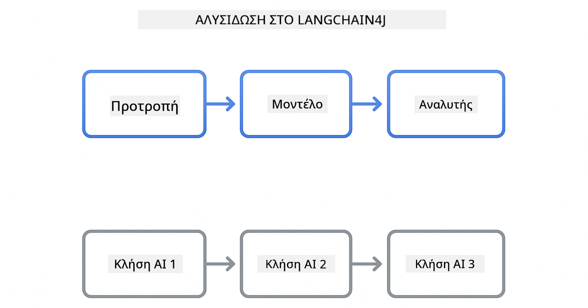
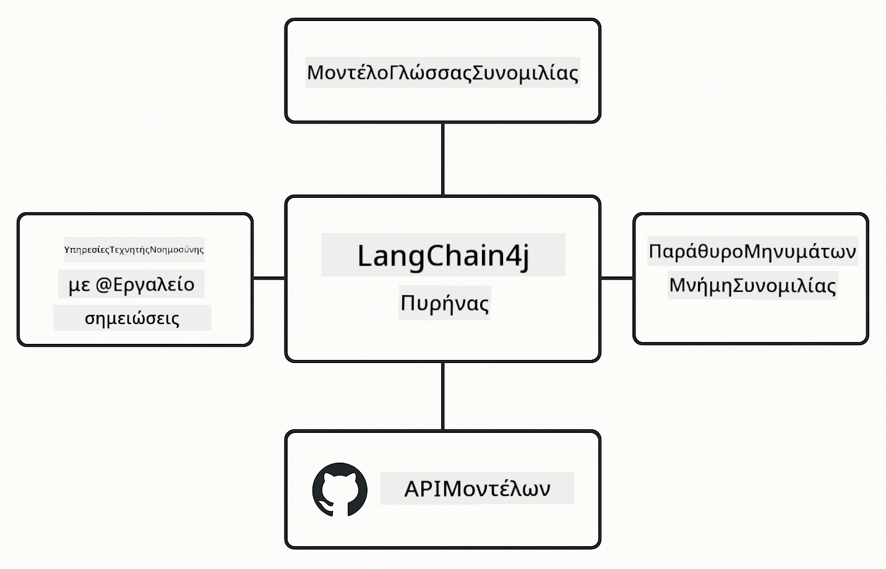

<!--
CO_OP_TRANSLATOR_METADATA:
{
  "original_hash": "377b3e3e6f8d02965bf0fbbc9ccb45c5",
  "translation_date": "2025-12-13T14:56:12+00:00",
  "source_file": "00-quick-start/README.md",
  "language_code": "el"
}
-->
# Module 00: Γρήγορη Εκκίνηση

## Πίνακας Περιεχομένων

- [Εισαγωγή](../../../00-quick-start)
- [Τι είναι το LangChain4j;](../../../00-quick-start)
- [Εξαρτήσεις LangChain4j](../../../00-quick-start)
- [Προαπαιτούμενα](../../../00-quick-start)
- [Ρύθμιση](../../../00-quick-start)
  - [1. Πάρε το GitHub Token σου](../../../00-quick-start)
  - [2. Ορισμός του Token σου](../../../00-quick-start)
- [Εκτέλεση των Παραδειγμάτων](../../../00-quick-start)
  - [1. Βασική Συνομιλία](../../../00-quick-start)
  - [2. Πρότυπα Προτροπών](../../../00-quick-start)
  - [3. Κλήση Συνάρτησης](../../../00-quick-start)
  - [4. Ερωτήσεις & Απαντήσεις Εγγράφων (RAG)](../../../00-quick-start)
- [Τι Δείχνει Κάθε Παράδειγμα](../../../00-quick-start)
- [Επόμενα Βήματα](../../../00-quick-start)
- [Αντιμετώπιση Προβλημάτων](../../../00-quick-start)

## Εισαγωγή

Αυτή η γρήγορη εκκίνηση έχει σκοπό να σε βοηθήσει να ξεκινήσεις με το LangChain4j όσο το δυνατόν πιο γρήγορα. Καλύπτει τα απόλυτα βασικά για την κατασκευή εφαρμογών AI με το LangChain4j και τα GitHub Models. Στα επόμενα modules θα χρησιμοποιήσεις το Azure OpenAI με το LangChain4j για να δημιουργήσεις πιο προηγμένες εφαρμογές.

## Τι είναι το LangChain4j;

Το LangChain4j είναι μια βιβλιοθήκη Java που απλοποιεί την κατασκευή εφαρμογών με τεχνητή νοημοσύνη. Αντί να ασχολείσαι με HTTP clients και ανάλυση JSON, δουλεύεις με καθαρές Java APIs.

Η "αλυσίδα" στο LangChain αναφέρεται στη σύνδεση πολλών συστατικών - μπορεί να συνδέσεις μια προτροπή με ένα μοντέλο και έναν αναλυτή, ή να συνδέσεις πολλαπλές κλήσεις AI όπου η έξοδος της μίας τροφοδοτεί την είσοδο της επόμενης. Αυτή η γρήγορη εκκίνηση εστιάζει στα βασικά πριν εξερευνήσει πιο σύνθετες αλυσίδες.



*Σύνδεση συστατικών στο LangChain4j - τα δομικά στοιχεία συνδέονται για να δημιουργήσουν ισχυρές ροές εργασίας AI*

Θα χρησιμοποιήσουμε τρία βασικά συστατικά:

**ChatLanguageModel** - Η διεπαφή για αλληλεπίδραση με μοντέλα AI. Καλείς `model.chat("prompt")` και λαμβάνεις μια απάντηση ως κείμενο. Χρησιμοποιούμε το `OpenAiOfficialChatModel` που λειτουργεί με endpoints συμβατά με OpenAI όπως τα GitHub Models.

**AiServices** - Δημιουργεί τύπου ασφαλείς διεπαφές υπηρεσιών AI. Ορίζεις μεθόδους, τις σχολιάζεις με `@Tool`, και το LangChain4j αναλαμβάνει τον συντονισμό. Το AI καλεί αυτόματα τις Java μεθόδους σου όταν χρειάζεται.

**MessageWindowChatMemory** - Διατηρεί το ιστορικό συνομιλίας. Χωρίς αυτό, κάθε αίτημα είναι ανεξάρτητο. Με αυτό, το AI θυμάται προηγούμενα μηνύματα και διατηρεί το πλαίσιο σε πολλούς γύρους.



*Αρχιτεκτονική LangChain4j - βασικά συστατικά που συνεργάζονται για να τροφοδοτήσουν τις εφαρμογές AI σου*

## Εξαρτήσεις LangChain4j

Αυτή η γρήγορη εκκίνηση χρησιμοποιεί δύο εξαρτήσεις Maven στο [`pom.xml`](../../../00-quick-start/pom.xml):

```xml
<!-- Core LangChain4j library -->
<dependency>
    <groupId>dev.langchain4j</groupId>
    <artifactId>langchain4j</artifactId> <!-- Inherited from BOM in root pom.xml -->
</dependency>

<!-- OpenAI integration (works with GitHub Models) -->
<dependency>
    <groupId>dev.langchain4j</groupId>
    <artifactId>langchain4j-open-ai-official</artifactId> <!-- Inherited from BOM in root pom.xml -->
</dependency>
```

Το module `langchain4j-open-ai-official` παρέχει την κλάση `OpenAiOfficialChatModel` που συνδέεται με APIs συμβατά με OpenAI. Τα GitHub Models χρησιμοποιούν το ίδιο format API, οπότε δεν χρειάζεται ειδικός προσαρμογέας - απλά δείξε το βασικό URL στο `https://models.github.ai/inference`.

## Προαπαιτούμενα

**Χρησιμοποιείς το Dev Container;** Το Java και το Maven είναι ήδη εγκατεστημένα. Χρειάζεσαι μόνο ένα GitHub Personal Access Token.

**Τοπική Ανάπτυξη:**
- Java 21+, Maven 3.9+
- GitHub Personal Access Token (οδηγίες παρακάτω)

> **Σημείωση:** Αυτό το module χρησιμοποιεί το `gpt-4.1-nano` από τα GitHub Models. Μην τροποποιήσεις το όνομα του μοντέλου στον κώδικα - είναι ρυθμισμένο να λειτουργεί με τα διαθέσιμα μοντέλα του GitHub.

## Ρύθμιση

### 1. Πάρε το GitHub Token σου

1. Πήγαινε στο [GitHub Settings → Personal Access Tokens](https://github.com/settings/personal-access-tokens)
2. Κάνε κλικ στο "Generate new token"
3. Ορίστε ένα περιγραφικό όνομα (π.χ., "LangChain4j Demo")
4. Ορίστε λήξη (συνιστώνται 7 ημέρες)
5. Στις "Account permissions", βρες το "Models" και όρισε σε "Read-only"
6. Κάνε κλικ στο "Generate token"
7. Αντέγραψε και αποθήκευσε το token σου - δεν θα το ξαναδείς

### 2. Ορισμός του Token σου

**Επιλογή 1: Χρήση VS Code (Συνιστάται)**

Αν χρησιμοποιείς VS Code, πρόσθεσε το token σου στο αρχείο `.env` στη ρίζα του έργου:

Αν το αρχείο `.env` δεν υπάρχει, κάνε αντιγραφή του `.env.example` σε `.env` ή δημιούργησε νέο `.env` στη ρίζα του έργου.

**Παράδειγμα αρχείου `.env`:**
```bash
# Στο /workspaces/LangChain4j-for-Beginners/.env
GITHUB_TOKEN=your_token_here
```

Μετά μπορείς απλά να κάνεις δεξί κλικ σε οποιοδήποτε demo αρχείο (π.χ., `BasicChatDemo.java`) στον Explorer και να επιλέξεις **"Run Java"** ή να χρησιμοποιήσεις τις ρυθμίσεις εκκίνησης από το πάνελ Run and Debug.

**Επιλογή 2: Χρήση Τερματικού**

Ορίστε το token ως μεταβλητή περιβάλλοντος:

**Bash:**
```bash
export GITHUB_TOKEN=your_token_here
```

**PowerShell:**
```powershell
$env:GITHUB_TOKEN=your_token_here
```

## Εκτέλεση των Παραδειγμάτων

**Χρήση VS Code:** Απλά κάνε δεξί κλικ σε οποιοδήποτε demo αρχείο στον Explorer και επίλεξε **"Run Java"**, ή χρησιμοποίησε τις ρυθμίσεις εκκίνησης από το πάνελ Run and Debug (βεβαιώσου ότι έχεις προσθέσει το token σου στο `.env` αρχείο πρώτα).

**Χρήση Maven:** Εναλλακτικά, μπορείς να τρέξεις από τη γραμμή εντολών:

### 1. Βασική Συνομιλία

**Bash:**
```bash
mvn compile exec:java -Dexec.mainClass=com.example.langchain4j.quickstart.BasicChatDemo
```

**PowerShell:**
```powershell
mvn --% compile exec:java -Dexec.mainClass=com.example.langchain4j.quickstart.BasicChatDemo
```

### 2. Πρότυπα Προτροπών

**Bash:**
```bash
mvn compile exec:java -Dexec.mainClass=com.example.langchain4j.quickstart.PromptEngineeringDemo
```

**PowerShell:**
```powershell
mvn --% compile exec:java -Dexec.mainClass=com.example.langchain4j.quickstart.PromptEngineeringDemo
```

Δείχνει zero-shot, few-shot, chain-of-thought, και role-based προτροπές.

### 3. Κλήση Συνάρτησης

**Bash:**
```bash
mvn compile exec:java -Dexec.mainClass=com.example.langchain4j.quickstart.ToolIntegrationDemo
```

**PowerShell:**
```powershell
mvn --% compile exec:java -Dexec.mainClass=com.example.langchain4j.quickstart.ToolIntegrationDemo
```

Το AI καλεί αυτόματα τις Java μεθόδους σου όταν χρειάζεται.

### 4. Ερωτήσεις & Απαντήσεις Εγγράφων (RAG)

**Bash:**
```bash
mvn compile exec:java -Dexec.mainClass=com.example.langchain4j.quickstart.SimpleReaderDemo
```

**PowerShell:**
```powershell
mvn --% compile exec:java -Dexec.mainClass=com.example.langchain4j.quickstart.SimpleReaderDemo
```

Κάνε ερωτήσεις σχετικά με το περιεχόμενο στο `document.txt`.

## Τι Δείχνει Κάθε Παράδειγμα

**Βασική Συνομιλία** - [BasicChatDemo.java](../../../00-quick-start/src/main/java/com/example/langchain4j/quickstart/BasicChatDemo.java)

Ξεκίνα εδώ για να δεις το LangChain4j στην πιο απλή μορφή του. Θα δημιουργήσεις ένα `OpenAiOfficialChatModel`, θα στείλεις μια προτροπή με `.chat()`, και θα λάβεις απάντηση. Αυτό δείχνει τα θεμέλια: πώς να αρχικοποιείς μοντέλα με προσαρμοσμένα endpoints και κλειδιά API. Μόλις καταλάβεις αυτό το μοτίβο, όλα τα υπόλοιπα χτίζονται πάνω σε αυτό.

```java
ChatLanguageModel model = OpenAiOfficialChatModel.builder()
    .baseUrl("https://models.github.ai/inference")
    .apiKey(System.getenv("GITHUB_TOKEN"))
    .modelName("gpt-4.1-nano")
    .build();

String response = model.chat("What is LangChain4j?");
System.out.println(response);
```

> **🤖 Δοκίμασε με [GitHub Copilot](https://github.com/features/copilot) Chat:** Άνοιξε το [`BasicChatDemo.java`](../../../00-quick-start/src/main/java/com/example/langchain4j/quickstart/BasicChatDemo.java) και ρώτησε:
> - "Πώς θα άλλαζα από GitHub Models σε Azure OpenAI σε αυτόν τον κώδικα;"
> - "Ποιοι άλλοι παράμετροι μπορώ να ρυθμίσω στο OpenAiOfficialChatModel.builder();"
> - "Πώς προσθέτω streaming απαντήσεις αντί να περιμένω την πλήρη απάντηση;"

**Μηχανική Προτροπών** - [PromptEngineeringDemo.java](../../../00-quick-start/src/main/java/com/example/langchain4j/quickstart/PromptEngineeringDemo.java)

Τώρα που ξέρεις πώς να μιλάς σε ένα μοντέλο, ας εξερευνήσουμε τι του λες. Αυτό το demo χρησιμοποιεί την ίδια ρύθμιση μοντέλου αλλά δείχνει τέσσερα διαφορετικά πρότυπα προτροπών. Δοκίμασε zero-shot προτροπές για άμεσες οδηγίες, few-shot προτροπές που μαθαίνουν από παραδείγματα, chain-of-thought προτροπές που αποκαλύπτουν βήματα λογικής, και role-based προτροπές που ορίζουν πλαίσιο. Θα δεις πώς το ίδιο μοντέλο δίνει δραματικά διαφορετικά αποτελέσματα ανάλογα με το πώς διατυπώνεις το αίτημά σου.

```java
PromptTemplate template = PromptTemplate.from(
    "What's the best time to visit {{destination}} for {{activity}}?"
);

Prompt prompt = template.apply(Map.of(
    "destination", "Paris",
    "activity", "sightseeing"
));

String response = model.chat(prompt.text());
```

> **🤖 Δοκίμασε με [GitHub Copilot](https://github.com/features/copilot) Chat:** Άνοιξε το [`PromptEngineeringDemo.java`](../../../00-quick-start/src/main/java/com/example/langchain4j/quickstart/PromptEngineeringDemo.java) και ρώτησε:
> - "Ποια είναι η διαφορά μεταξύ zero-shot και few-shot προτροπών, και πότε πρέπει να χρησιμοποιώ κάθε μία;"
> - "Πώς επηρεάζει η παράμετρος θερμοκρασίας τις απαντήσεις του μοντέλου;"
> - "Ποιες τεχνικές υπάρχουν για να αποτρέψω επιθέσεις prompt injection σε παραγωγή;"
> - "Πώς μπορώ να δημιουργήσω επαναχρησιμοποιήσιμα αντικείμενα PromptTemplate για κοινά πρότυπα;"

**Ενσωμάτωση Εργαλείων** - [ToolIntegrationDemo.java](../../../00-quick-start/src/main/java/com/example/langchain4j/quickstart/ToolIntegrationDemo.java)

Εδώ το LangChain4j γίνεται ισχυρό. Θα χρησιμοποιήσεις το `AiServices` για να δημιουργήσεις έναν βοηθό AI που μπορεί να καλεί τις Java μεθόδους σου. Απλά σχολίασε τις μεθόδους με `@Tool("περιγραφή")` και το LangChain4j αναλαμβάνει τα υπόλοιπα - το AI αποφασίζει αυτόματα πότε να χρησιμοποιήσει κάθε εργαλείο βάσει του τι ζητά ο χρήστης. Αυτό δείχνει την κλήση συναρτήσεων, μια βασική τεχνική για την κατασκευή AI που μπορεί να εκτελεί ενέργειες, όχι μόνο να απαντά σε ερωτήσεις.

```java
@Tool("Performs addition of two numeric values")
public double add(double a, double b) {
    return a + b;
}

MathAssistant assistant = AiServices.create(MathAssistant.class, model);
String response = assistant.chat("What is 25 plus 17?");
```

> **🤖 Δοκίμασε με [GitHub Copilot](https://github.com/features/copilot) Chat:** Άνοιξε το [`ToolIntegrationDemo.java`](../../../00-quick-start/src/main/java/com/example/langchain4j/quickstart/ToolIntegrationDemo.java) και ρώτησε:
> - "Πώς λειτουργεί η @Tool annotation και τι κάνει το LangChain4j με αυτήν πίσω από τα παρασκήνια;"
> - "Μπορεί το AI να καλέσει πολλαπλά εργαλεία διαδοχικά για να λύσει σύνθετα προβλήματα;"
> - "Τι συμβαίνει αν ένα εργαλείο πετάξει εξαίρεση - πώς πρέπει να χειριστώ τα σφάλματα;"
> - "Πώς θα ενσωμάτωνα ένα πραγματικό API αντί για αυτό το παράδειγμα αριθμομηχανής;"

**Ερωτήσεις & Απαντήσεις Εγγράφων (RAG)** - [SimpleReaderDemo.java](../../../00-quick-start/src/main/java/com/example/langchain4j/quickstart/SimpleReaderDemo.java)

Εδώ θα δεις τα θεμέλια του RAG (retrieval-augmented generation). Αντί να βασίζεσαι στα δεδομένα εκπαίδευσης του μοντέλου, φορτώνεις περιεχόμενο από το [`document.txt`](../../../00-quick-start/document.txt) και το συμπεριλαμβάνεις στην προτροπή. Το AI απαντά βάσει του εγγράφου σου, όχι της γενικής γνώσης του. Αυτό είναι το πρώτο βήμα για να χτίσεις συστήματα που μπορούν να δουλέψουν με τα δικά σου δεδομένα.

```java
Document document = FileSystemDocumentLoader.loadDocument("document.txt");
String content = document.text();

String prompt = "Based on this document: " + content + 
                "\nQuestion: What is the main topic?";
String response = model.chat(prompt);
```

> **Σημείωση:** Αυτή η απλή προσέγγιση φορτώνει ολόκληρο το έγγραφο στην προτροπή. Για μεγάλα αρχεία (>10KB), θα ξεπεράσεις τα όρια πλαισίου. Το Module 03 καλύπτει το κομμάτιασμα και την αναζήτηση με διανύσματα για παραγωγικά συστήματα RAG.

> **🤖 Δοκίμασε με [GitHub Copilot](https://github.com/features/copilot) Chat:** Άνοιξε το [`SimpleReaderDemo.java`](../../../00-quick-start/src/main/java/com/example/langchain4j/quickstart/SimpleReaderDemo.java) και ρώτησε:
> - "Πώς το RAG αποτρέπει τις παραισθήσεις AI σε σύγκριση με τη χρήση των δεδομένων εκπαίδευσης του μοντέλου;"
> - "Ποια είναι η διαφορά μεταξύ αυτής της απλής προσέγγισης και της χρήσης vector embeddings για ανάκτηση;"
> - "Πώς θα κλιμάκωνα αυτό για να χειριστώ πολλαπλά έγγραφα ή μεγαλύτερες βάσεις γνώσης;"
> - "Ποιες είναι οι βέλτιστες πρακτικές για τη δομή της προτροπής ώστε να διασφαλίσω ότι το AI χρησιμοποιεί μόνο το παρεχόμενο πλαίσιο;"

## Αποσφαλμάτωση

Τα παραδείγματα περιλαμβάνουν `.logRequests(true)` και `.logResponses(true)` για να δείχνουν τις κλήσεις API στην κονσόλα. Αυτό βοηθά στην αντιμετώπιση σφαλμάτων αυθεντικοποίησης, ορίων ρυθμού, ή απρόβλεπτων απαντήσεων. Αφαίρεσε αυτές τις σημαίες σε παραγωγή για να μειώσεις τον θόρυβο στα logs.

## Επόμενα Βήματα

**Επόμενο Module:** [01-introduction - Ξεκινώντας με LangChain4j και gpt-5 στο Azure](../01-introduction/README.md)

---

**Πλοήγηση:** [← Πίσω στην Κύρια Σελίδα](../README.md) | [Επόμενο: Module 01 - Εισαγωγή →](../01-introduction/README.md)

---

## Αντιμετώπιση Προβλημάτων

### Πρώτη Φορά Maven Build

**Πρόβλημα**: Η αρχική εντολή `mvn clean compile` ή `mvn package` παίρνει πολύ χρόνο (10-15 λεπτά)

**Αιτία**: Το Maven πρέπει να κατεβάσει όλες τις εξαρτήσεις του έργου (Spring Boot, βιβλιοθήκες LangChain4j, Azure SDKs, κλπ.) στην πρώτη κατασκευή.

**Λύση**: Αυτή είναι φυσιολογική συμπεριφορά. Οι επόμενες κατασκευές θα είναι πολύ πιο γρήγορες καθώς οι εξαρτήσεις αποθηκεύονται τοπικά. Ο χρόνος λήψης εξαρτάται από την ταχύτητα του δικτύου σου.

### Σύνταξη Εντολών Maven στο PowerShell

**Πρόβλημα**: Οι εντολές Maven αποτυγχάνουν με σφάλμα `Unknown lifecycle phase ".mainClass=..."`

**Αιτία**: Το PowerShell ερμηνεύει το `=` ως τελεστή ανάθεσης μεταβλητής, σπάζοντας τη σύνταξη ιδιοτήτων του Maven

**Λύση**: Χρησιμοποίησε τον τελεστή stop-parsing `--%` πριν την εντολή Maven:

**PowerShell:**
```powershell
mvn --% compile exec:java -Dexec.mainClass=com.example.langchain4j.quickstart.BasicChatDemo
```

**Bash:**
```bash
mvn compile exec:java -Dexec.mainClass=com.example.langchain4j.quickstart.BasicChatDemo
```

Ο τελεστής `--%` λέει στο PowerShell να περάσει όλα τα υπόλοιπα ορίσματα αυτούσια στο Maven χωρίς ερμηνεία.

### Εμφάνιση Emoji στο Windows PowerShell

**Πρόβλημα**: Οι απαντήσεις AI εμφανίζουν άχρηστους χαρακτήρες (π.χ., `????` ή `â??`) αντί για emoji στο PowerShell

**Αιτία**: Η προεπιλεγμένη κωδικοποίηση του PowerShell δεν υποστηρίζει UTF-8 emoji

**Λύση**: Τρέξε αυτή την εντολή πριν εκτελέσεις εφαρμογές Java:
```cmd
chcp 65001
```

Αυτό αναγκάζει την κωδικοποίηση UTF-8 στο τερματικό. Εναλλακτικά, χρησιμοποίησε το Windows Terminal που έχει καλύτερη υποστήριξη Unicode.

---

<!-- CO-OP TRANSLATOR DISCLAIMER START -->
**Αποποίηση ευθυνών**:  
Αυτό το έγγραφο έχει μεταφραστεί χρησιμοποιώντας την υπηρεσία αυτόματης μετάφρασης AI [Co-op Translator](https://github.com/Azure/co-op-translator). Παρόλο που επιδιώκουμε την ακρίβεια, παρακαλούμε να λάβετε υπόψη ότι οι αυτόματες μεταφράσεις ενδέχεται να περιέχουν λάθη ή ανακρίβειες. Το πρωτότυπο έγγραφο στη μητρική του γλώσσα πρέπει να θεωρείται η αυθεντική πηγή. Για κρίσιμες πληροφορίες, συνιστάται επαγγελματική ανθρώπινη μετάφραση. Δεν φέρουμε ευθύνη για τυχόν παρεξηγήσεις ή λανθασμένες ερμηνείες που προκύπτουν από τη χρήση αυτής της μετάφρασης.
<!-- CO-OP TRANSLATOR DISCLAIMER END -->