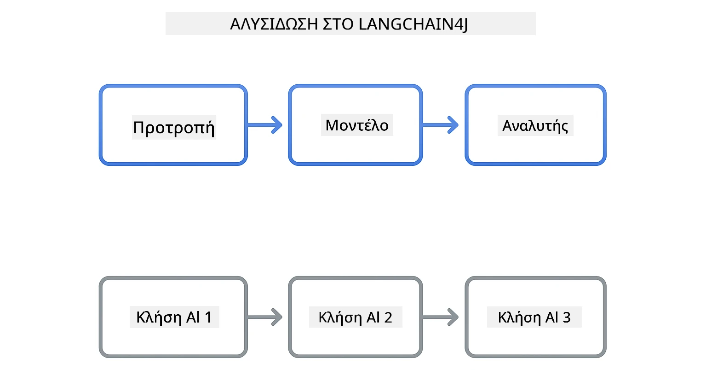

<!--
CO_OP_TRANSLATOR_METADATA:
{
  "original_hash": "22b5d7c8d7585325e38b37fd29eafe25",
  "translation_date": "2026-01-05T23:22:44+00:00",
  "source_file": "00-quick-start/README.md",
  "language_code": "el"
}
-->
# Module 00: Γρήγορη Εκκίνηση

## Περιεχόμενα

- [Εισαγωγή](../../../00-quick-start)
- [Τι είναι το LangChain4j;](../../../00-quick-start)
- [Εξαρτήσεις LangChain4j](../../../00-quick-start)
- [Προαπαιτούμενα](../../../00-quick-start)
- [Ρύθμιση](../../../00-quick-start)
  - [1. Πάρε το GitHub Token σου](../../../00-quick-start)
  - [2. Όρισε το Token σου](../../../00-quick-start)
- [Τρέξε τα Παραδείγματα](../../../00-quick-start)
  - [1. Βασική Συνομιλία](../../../00-quick-start)
  - [2. Σχέδια Prompt](../../../00-quick-start)
  - [3. Κλήση Συνάρτησης](../../../00-quick-start)
  - [4. Ερωτήσεις-Απαντήσεις Εγγράφου (RAG)](../../../00-quick-start)
  - [5. Υπεύθυνη Τεχνητή Νοημοσύνη](../../../00-quick-start)
- [Τι Δείχνει Κάθε Παράδειγμα](../../../00-quick-start)
- [Επόμενα Βήματα](../../../00-quick-start)
- [Επίλυση Προβλημάτων](../../../00-quick-start)

## Εισαγωγή

Αυτή η γρήγορη εκκίνηση έχει στόχο να σας βοηθήσει να ξεκινήσετε με το LangChain4j το ταχύτερο δυνατό. Καλύπτει τα απόλυτα βασικά για την κατασκευή εφαρμογών τεχνητής νοημοσύνης με LangChain4j και GitHub Models. Στα επόμενα modules θα χρησιμοποιήσετε το Azure OpenAI με το LangChain4j για να δημιουργήσετε πιο προηγμένες εφαρμογές.

## Τι είναι το LangChain4j;

Το LangChain4j είναι μια βιβλιοθήκη Java που απλοποιεί την κατασκευή εφαρμογών με τεχνητή νοημοσύνη. Αντί να ασχολείστε με HTTP clients και ανάλυση JSON, δουλεύετε με καθαρές Java APIs.

Η "αλυσίδα" στο LangChain αναφέρεται στη σύνδεση πολλών στοιχείων μεταξύ τους - μπορεί να συνδέσετε ένα prompt σε ένα μοντέλο, να ένα parser, ή να αλυσιδώνετε πολλές κλήσεις AI όπου η έξοδος της μιας τροφοδοτεί την επόμενη είσοδο. Αυτή η γρήγορη εκκίνηση εστιάζει στα θεμελιώδη, πριν εξερευνήσουμε πιο σύνθετες αλυσίδες.



*Σύνδεση στοιχείων στο LangChain4j - τα δομικά στοιχεία συνδέονται για να δημιουργήσουν ισχυρές ροές εργασίας AI*

Θα χρησιμοποιήσουμε τρία βασικά στοιχεία:

**ChatLanguageModel** - Η διεπαφή για αλληλεπίδραση με το μοντέλο AI. Καλείτε `model.chat("prompt")` και λαμβάνετε μια απάντηση κειμένου. Χρησιμοποιούμε το `OpenAiOfficialChatModel` που δουλεύει με endpoints συμβατά με OpenAI όπως τα GitHub Models.

**AiServices** - Δημιουργεί ασφαλείς τύπου διεπαφές υπηρεσιών AI. Ορίζετε μεθόδους, τις διακοσμείτε με `@Tool` και το LangChain4j αναλαμβάνει τον συντονισμό. Η AI καλεί αυτόματα τις Java μεθόδους σας όταν χρειάζεται.

**MessageWindowChatMemory** - Διατηρεί το ιστορικό της συνομιλίας. Χωρίς αυτό, κάθε αίτημα είναι ανεξάρτητο. Με αυτό, η AI θυμάται προηγούμενα μηνύματα και διατηρεί το πλαίσιο σε πολλές στροφές.


*Αρχιτεκτονική LangChain4j - βασικά στοιχεία που συνεργάζονται για να τροφοδοτήσουν τις AI εφαρμογές σας*

## Εξαρτήσεις LangChain4j

Αυτή η γρήγορη εκκίνηση χρησιμοποιεί δύο εξαρτήσεις Maven στο [`pom.xml`](../../../00-quick-start/pom.xml):

```xml
<!-- Core LangChain4j library -->
<dependency>
    <groupId>dev.langchain4j</groupId>
    <artifactId>langchain4j</artifactId> <!-- Inherited from BOM in root pom.xml -->
</dependency>

<!-- OpenAI integration (works with GitHub Models) -->
<dependency>
    <groupId>dev.langchain4j</groupId>
    <artifactId>langchain4j-open-ai-official</artifactId> <!-- Inherited from BOM in root pom.xml -->
</dependency>
```

Το module `langchain4j-open-ai-official` παρέχει την κλάση `OpenAiOfficialChatModel` που συνδέεται με APIs συμβατά με OpenAI. Τα GitHub Models χρησιμοποιούν το ίδιο API format, οπότε δεν χρειάζεται ειδικός adapter - απλώς δείξτε το βασικό URL σε `https://models.github.ai/inference`.

## Προαπαιτούμενα

**Χρησιμοποιείτε το Dev Container;** Το Java και το Maven είναι ήδη εγκατεστημένα. Χρειάζεστε μόνο ένα GitHub Personal Access Token.

**Τοπική Ανάπτυξη:**
- Java 21+, Maven 3.9+
- GitHub Personal Access Token (οδηγίες παρακάτω)

> **Σημείωση:** Αυτό το module χρησιμοποιεί το `gpt-4.1-nano` από τα GitHub Models. Μην τροποποιήσετε το όνομα του μοντέλου στον κώδικα - έχει διαμορφωθεί για να δουλεύει με τα διαθέσιμα μοντέλα του GitHub.

## Ρύθμιση

### 1. Πάρε το GitHub Token σου

1. Πήγαινε στο [GitHub Settings → Personal Access Tokens](https://github.com/settings/personal-access-tokens)
2. Κάνε κλικ στο "Generate new token"
3. Όρισε μια περιγραφική ονομασία (π.χ. "LangChain4j Demo")
4. Όρισε την λήξη (7 ημέρες συνιστάται)
5. Στις "Account permissions", βρες το "Models" και όρισε το σε "Read-only"
6. Κάνε κλικ στο "Generate token"
7. Αντέγραψε και αποθήκευσε το token σου - δεν θα το ξαναδείς

### 2. Όρισε το Token σου

**Επιλογή 1: Χρήση VS Code (Συνιστάται)**

Αν χρησιμοποιείς το VS Code, πρόσθεσε το token στο αρχείο `.env` στη ρίζα του project:

Αν το αρχείο `.env` δεν υπάρχει, αντιγράψε το `.env.example` στο `.env` ή δημιούργησε νέο `.env` αρχείο στη ρίζα του project.

**Παράδειγμα αρχείου `.env`:**
```bash
# Στο /workspaces/LangChain4j-for-Beginners/.env
GITHUB_TOKEN=your_token_here
```

Μετά μπορείς απλά να κάνεις δεξί κλικ σε οποιοδήποτε demo αρχείο (π.χ. `BasicChatDemo.java`) στο Explorer και να επιλέξεις **"Run Java"** ή να χρησιμοποιήσεις τις διαμορφώσεις εκκίνησης από τον πίνακα Run and Debug.

**Επιλογή 2: Χρήση Τερματικού**

Όρισε το token ως μεταβλητή περιβάλλοντος:

**Bash:**
```bash
export GITHUB_TOKEN=your_token_here
```

**PowerShell:**
```powershell
$env:GITHUB_TOKEN=your_token_here
```

## Τρέξε τα Παραδείγματα

**Χρήση VS Code:** Απλά κάνε δεξί κλικ σε οποιοδήποτε demo αρχείο στον Explorer και επίλεξε **"Run Java"**, ή χρησιμοποιήστε τις διαμορφώσεις εκκίνησης από τον πίνακα Run and Debug (βεβαιώσου ότι πρώτα έχεις προσθέσει το token στο `.env` αρχείο).

**Χρήση Maven:** Εναλλακτικά, μπορείς να τρέξεις από τη γραμμή εντολών:

### 1. Βασική Συνομιλία

**Bash:**
```bash
mvn compile exec:java -Dexec.mainClass=com.example.langchain4j.quickstart.BasicChatDemo
```

**PowerShell:**
```powershell
mvn --% compile exec:java -Dexec.mainClass=com.example.langchain4j.quickstart.BasicChatDemo
```

### 2. Σχέδια Prompt

**Bash:**
```bash
mvn compile exec:java -Dexec.mainClass=com.example.langchain4j.quickstart.PromptEngineeringDemo
```

**PowerShell:**
```powershell
mvn --% compile exec:java -Dexec.mainClass=com.example.langchain4j.quickstart.PromptEngineeringDemo
```

Δείχνει zero-shot, few-shot, chain-of-thought και role-based prompting.

### 3. Κλήση Συνάρτησης

**Bash:**
```bash
mvn compile exec:java -Dexec.mainClass=com.example.langchain4j.quickstart.ToolIntegrationDemo
```

**PowerShell:**
```powershell
mvn --% compile exec:java -Dexec.mainClass=com.example.langchain4j.quickstart.ToolIntegrationDemo
```

Η AI καλεί αυτόματα τις Java μεθόδους σας όταν χρειάζεται.

### 4. Ερωτήσεις-Απαντήσεις Εγγράφου (RAG)

**Bash:**
```bash
mvn compile exec:java -Dexec.mainClass=com.example.langchain4j.quickstart.SimpleReaderDemo
```

**PowerShell:**
```powershell
mvn --% compile exec:java -Dexec.mainClass=com.example.langchain4j.quickstart.SimpleReaderDemo
```

Κάντε ερωτήσεις για το περιεχόμενο του `document.txt`.

### 5. Υπεύθυνη Τεχνητή Νοημοσύνη

**Bash:**
```bash
mvn compile exec:java -Dexec.mainClass=com.example.langchain4j.quickstart.ResponsibleAIDemo
```

**PowerShell:**
```powershell
mvn --% compile exec:java -Dexec.mainClass=com.example.langchain4j.quickstart.ResponsibleAIDemo
```

Δείτε πώς τα φίλτρα ασφαλείας της AI μπλοκάρουν επιβλαβές περιεχόμενο.

## Τι Δείχνει Κάθε Παράδειγμα

**Βασική Συνομιλία** - [BasicChatDemo.java](../../../00-quick-start/src/main/java/com/example/langchain4j/quickstart/BasicChatDemo.java)

Ξεκινήστε εδώ για να δείτε το LangChain4j στην πιο απλή μορφή του. Θα δημιουργήσετε ένα `OpenAiOfficialChatModel`, θα στείλετε ένα prompt με `.chat()` και θα λάβετε απάντηση. Αυτό δείχνει το θεμέλιο: πώς να αρχικοποιήσετε μοντέλα με προσαρμοσμένα endpoints και API keys. Μόλις κατανοήσετε αυτό το μοτίβο, όλα τα υπόλοιπα χτίζονται πάνω του.

```java
ChatLanguageModel model = OpenAiOfficialChatModel.builder()
    .baseUrl("https://models.github.ai/inference")
    .apiKey(System.getenv("GITHUB_TOKEN"))
    .modelName("gpt-4.1-nano")
    .build();

String response = model.chat("What is LangChain4j?");
System.out.println(response);
```

> **🤖 Δοκίμασε με το [GitHub Copilot](https://github.com/features/copilot) Chat:** Άνοιξε το [`BasicChatDemo.java`](../../../00-quick-start/src/main/java/com/example/langchain4j/quickstart/BasicChatDemo.java) και ρώτησε:
> - "Πώς θα άλλαζα από GitHub Models σε Azure OpenAI σε αυτόν τον κώδικα;"
> - "Ποιοι άλλοι παράμετροι μπορώ να ρυθμίσω στο OpenAiOfficialChatModel.builder();"
> - "Πώς να προσθέσω streaming απαντήσεις αντί να περιμένω την πλήρη απάντηση;"

**Μηχανική Prompt** - [PromptEngineeringDemo.java](../../../00-quick-start/src/main/java/com/example/langchain4j/quickstart/PromptEngineeringDemo.java)

Τώρα που ξέρεις πώς να μιλάς σε ένα μοντέλο, ας εξερευνήσουμε τι του λες. Αυτό το demo χρησιμοποιεί την ίδια διαμόρφωση μοντέλου αλλά δείχνει τέσσερα διαφορετικά πρότυπα prompting. Δοκίμασε zero-shot prompts για άμεσες οδηγίες, few-shot prompts που μαθαίνουν από παραδείγματα, chain-of-thought prompts που αποκαλύπτουν βήματα λογικής, και role-based prompts που θέτουν το πλαίσιο. Θα δεις πώς το ίδιο μοντέλο δίνει εντελώς διαφορετικά αποτελέσματα ανάλογα με το πώς διατυπώνεις το αίτημά σου.

```java
PromptTemplate template = PromptTemplate.from(
    "What's the best time to visit {{destination}} for {{activity}}?"
);

Prompt prompt = template.apply(Map.of(
    "destination", "Paris",
    "activity", "sightseeing"
));

String response = model.chat(prompt.text());
```

> **🤖 Δοκίμασε με το [GitHub Copilot](https://github.com/features/copilot) Chat:** Άνοιξε το [`PromptEngineeringDemo.java`](../../../00-quick-start/src/main/java/com/example/langchain4j/quickstart/PromptEngineeringDemo.java) και ρώτησε:
> - "Ποια η διαφορά μεταξύ zero-shot και few-shot prompting, και πότε να χρησιμοποιώ το καθένα;"
> - "Πώς επηρεάζει το μοντέλο οι παράμετροι θερμοκρασίας;"
> - "Ποιες τεχνικές υπάρχουν για την αποτροπή επιθέσεων prompt injection στην παραγωγή;"
> - "Πώς μπορώ να δημιουργήσω επαναχρησιμοποιήσιμα PromptTemplate αντικείμενα για κοινά πρότυπα;"

**Ενσωμάτωση Εργαλείων** - [ToolIntegrationDemo.java](../../../00-quick-start/src/main/java/com/example/langchain4j/quickstart/ToolIntegrationDemo.java)

Εδώ γίνεται το LangChain4j ισχυρό. Θα χρησιμοποιήσεις το `AiServices` για να δημιουργήσεις έναν βοηθό AI που μπορεί να καλεί τις Java μεθόδους σου. Απλώς διακόσμησε τις μεθόδους με `@Tool("περιγραφή")` και το LangChain4j αναλαμβάνει τα υπόλοιπα - η AI αποφασίζει αυτόματα πότε να χρησιμοποιήσει κάθε εργαλείο ανάλογα με το τι ζητά ο χρήστης. Αυτό δείχνει την κλήση συναρτήσεων, μια βασική τεχνική για την κατασκευή AI που μπορεί να αναλαμβάνει ενέργειες, όχι μόνο να απαντά σε ερωτήσεις.

```java
@Tool("Performs addition of two numeric values")
public double add(double a, double b) {
    return a + b;
}

MathAssistant assistant = AiServices.create(MathAssistant.class, model);
String response = assistant.chat("What is 25 plus 17?");
```

> **🤖 Δοκίμασε με το [GitHub Copilot](https://github.com/features/copilot) Chat:** Άνοιξε το [`ToolIntegrationDemo.java`](../../../00-quick-start/src/main/java/com/example/langchain4j/quickstart/ToolIntegrationDemo.java) και ρώτησε:
> - "Πώς λειτουργεί ο διακοσμητής @Tool και τι κάνει το LangChain4j με αυτόν στο παρασκήνιο;"
> - "Μπορεί η AI να καλέσει πολλαπλά εργαλεία διαδοχικά για να επιλύσει σύνθετα προβλήματα;"
> - "Τι γίνεται αν ένα εργαλείο ρίξει εξαίρεση - πώς πρέπει να διαχειριστώ τα σφάλματα;"
> - "Πώς θα ενσωματώσω ένα πραγματικό API αντί για αυτό το παράδειγμα αριθμομηχανής;"

**Ερωτήσεις-Απαντήσεις Εγγράφου (RAG)** - [SimpleReaderDemo.java](../../../00-quick-start/src/main/java/com/example/langchain4j/quickstart/SimpleReaderDemo.java)

Εδώ θα δείτε τα θεμέλια του RAG (δημιουργία βελτιωμένη με ανάκτηση). Αντί να βασίζεστε στα εκπαιδευτικά δεδομένα του μοντέλου, φορτώνετε περιεχόμενο από το [`document.txt`](../../../00-quick-start/document.txt) και το συμπεριλαμβάνετε στο prompt. Η AI απαντά βάσει του εγγράφου σας, όχι της γενικής γνώσης της. Αυτό είναι το πρώτο βήμα για την κατασκευή συστημάτων που μπορούν να δουλέψουν με τα δικά σας δεδομένα.

```java
Document document = FileSystemDocumentLoader.loadDocument("document.txt");
String content = document.text();

String prompt = "Based on this document: " + content + 
                "\nQuestion: What is the main topic?";
String response = model.chat(prompt);
```

> **Σημείωση:** Αυτή η απλή προσέγγιση φορτώνει ολόκληρο το έγγραφο στο prompt. Για μεγάλα αρχεία (>10KB), θα ξεπεράσετε τα όρια context. Το Module 03 καλύπτει την κοπή σε τμήματα και την αναζήτηση διανυσμάτων για παραγωγικά συστήματα RAG.

> **🤖 Δοκίμασε με το [GitHub Copilot](https://github.com/features/copilot) Chat:** Άνοιξε το [`SimpleReaderDemo.java`](../../../00-quick-start/src/main/java/com/example/langchain4j/quickstart/SimpleReaderDemo.java) και ρώτησε:
> - "Πώς το RAG αποτρέπει τις παραισθήσεις της AI σε σύγκριση με τη χρήση των εκπαιδευτικών δεδομένων του μοντέλου;"
> - "Ποια η διαφορά μεταξύ αυτής της απλής προσέγγισης και της χρήσης vector embeddings για ανάκτηση;"
> - "Πώς θα κλιμακώνα τη διαχείριση πολλαπλών εγγράφων ή μεγαλύτερων βάσεων γνώσης;"
> - "Ποιες είναι οι βέλτιστες πρακτικές για τη δομή του prompt ώστε η AI να χρησιμοποιεί μόνο το παρεχόμενο πλαίσιο;"

**Υπεύθυνη Τεχνητή Νοημοσύνη** - [ResponsibleAIDemo.java](../../../00-quick-start/src/main/java/com/example/langchain4j/quickstart/ResponsibleAIDemo.java)

Κατασκευάστε ασφάλεια AI με πολλαπλά επίπεδα προστασίας. Αυτό το demo δείχνει δύο επίπεδα προστασίας που συνεργάζονται:

**Μέρος 1: LangChain4j Input Guardrails** - Μπλοκάρουν επικίνδυνα prompts πριν φτάσουν στο LLM. Δημιουργήστε προσαρμοσμένους φραγμούς που ελέγχουν για απαγορευμένες λέξεις ή μοτίβα. Αυτοί εκτελούνται στον κώδικά σας, άρα είναι γρήγοροι και δωρεάν.

```java
class DangerousContentGuardrail implements InputGuardrail {
    @Override
    public InputGuardrailResult validate(UserMessage userMessage) {
        String text = userMessage.singleText().toLowerCase();
        if (text.contains("explosives")) {
            return fatal("Blocked: contains prohibited keyword");
        }
        return success();
    }
}
```

**Μέρος 2: Φίλτρα Ασφαλείας Παρόχου** - Τα GitHub Models διαθέτουν ενσωματωμένα φίλτρα που πιάνουν ό,τι μπορεί να λείπει από τους δικούς σας φραγμούς. Θα δείτε αυστηρά μπλοκαρίσματα (HTTP 400 errors) για σοβαρές παραβιάσεις και μαλακές αρνήσεις όπου η AI ευγενικά αρνείται.

> **🤖 Δοκίμασε με το [GitHub Copilot](https://github.com/features/copilot) Chat:** Άνοιξε το [`ResponsibleAIDemo.java`](../../../00-quick-start/src/main/java/com/example/langchain4j/quickstart/ResponsibleAIDemo.java) και ρώτησε:
> - "Τι είναι το InputGuardrail και πώς θα φτιάξω το δικό μου;"
> - "Ποια η διαφορά μεταξύ αυστηρού μπλοκαρίσματος και μαλακής άρνησης;"
> - "Γιατί να χρησιμοποιώ και guardrails και φίλτρα παρόχου μαζί;"

## Επόμενα Βήματα

**Επόμενο Module:** [01-introduction - Ξεκινώντας με LangChain4j και gpt-5 στο Azure](../01-introduction/README.md)

---

**Πλοήγηση:** [← Πίσω στην Κύρια Σελίδα](../README.md) | [Επόμενο: Module 01 - Εισαγωγή →](../01-introduction/README.md)

---

## Επίλυση Προβλημάτων

### Πρώτη Κατασκευή Maven

**Πρόβλημα**: Πρώτο `mvn clean compile` ή `mvn package` διαρκεί πολύ (10-15 λεπτά)

**Αιτία**: Το Maven πρέπει να κατεβάσει όλες τις εξαρτήσεις του έργου (Spring Boot, LangChain4j βιβλιοθήκες, Azure SDK κλπ.) στην πρώτη κατασκευή.

**Λύση**: Αυτό είναι φυσιολογική συμπεριφορά. Οι επόμενες κατασκευές θα είναι πολύ πιο γρήγορες καθώς οι εξαρτήσεις αποθηκεύονται τοπικά. Ο χρόνος λήψης εξαρτάται από την ταχύτητα του δικτύου σας.

### Σύνταξη Εντολών Maven στο PowerShell

**Πρόβλημα**: Οι εντολές Maven αποτυγχάνουν με σφάλμα `Unknown lifecycle phase ".mainClass=..."`

**Αιτία**: Το PowerShell ερμηνεύει το `=` ως τελεστή ανάθεσης μεταβλητής, σπάζοντας τη σύνταξη ιδιοτήτων του Maven
**Λύση**: Χρησιμοποιήστε τον τελεστή διακοπής ανάλυσης `--%` πριν από την εντολή Maven:

**PowerShell:**
```powershell
mvn --% compile exec:java -Dexec.mainClass=com.example.langchain4j.quickstart.BasicChatDemo
```

**Bash:**
```bash
mvn compile exec:java -Dexec.mainClass=com.example.langchain4j.quickstart.BasicChatDemo
```

Ο τελεστής `--%` λέει στο PowerShell να περάσει όλα τα υπόλοιπα ορίσματα κυριολεκτικά στο Maven χωρίς ερμηνεία.

### Εμφάνιση Emoji στα Windows PowerShell

**Πρόβλημα**: Οι απαντήσεις AI δείχνουν άχρηστους χαρακτήρες (π.χ., `????` ή `â??`) αντί για emoji στο PowerShell

**Αιτία**: Η προεπιλεγμένη κωδικοποίηση του PowerShell δεν υποστηρίζει τα emoji UTF-8

**Λύση**: Εκτελέστε αυτήν την εντολή πριν εκτελέσετε εφαρμογές Java:
```cmd
chcp 65001
```

Αυτό επιβάλλει την κωδικοποίηση UTF-8 στο τερματικό. Εναλλακτικά, χρησιμοποιήστε το Windows Terminal που έχει καλύτερη υποστήριξη για Unicode.

### Εντοπισμός Σφαλμάτων Κλήσεων API

**Πρόβλημα**: Σφάλματα ταυτοποίησης, όρια ρυθμού ή ανεπιθύμητες απαντήσεις από το μοντέλο AI

**Λύση**: Τα παραδείγματα περιλαμβάνουν `.logRequests(true)` και `.logResponses(true)` για να εμφανίζουν κλήσεις API στην κονσόλα. Αυτό βοηθά στον εντοπισμό σφαλμάτων ταυτοποίησης, ορίων ρυθμού ή μη αναμενόμενων απαντήσεων. Αφαιρέστε αυτές τις σημαίες στην παραγωγή για να μειώσετε τον θόρυβο στο αρχείο καταγραφής.

---

<!-- CO-OP TRANSLATOR DISCLAIMER START -->
**Αποποίηση ευθυνών**:  
Αυτό το έγγραφο έχει μεταφραστεί χρησιμοποιώντας την υπηρεσία αυτόματης μετάφρασης AI [Co-op Translator](https://github.com/Azure/co-op-translator). Παρόλο που προσπαθούμε για ακρίβεια, παρακαλούμε λάβετε υπόψη ότι οι αυτόματες μεταφράσεις ενδέχεται να περιέχουν σφάλματα ή ανακρίβειες. Το πρωτότυπο έγγραφο στη γλώσσα του θεωρείται η αυθεντική πηγή. Για κρίσιμες πληροφορίες, συνιστάται επαγγελματική μετάφραση από ανθρώπους. Δεν φέρουμε ευθύνη για τυχόν παρεξηγήσεις ή λανθασμένες ερμηνείες που προκύπτουν από τη χρήση αυτής της μετάφρασης.
<!-- CO-OP TRANSLATOR DISCLAIMER END -->