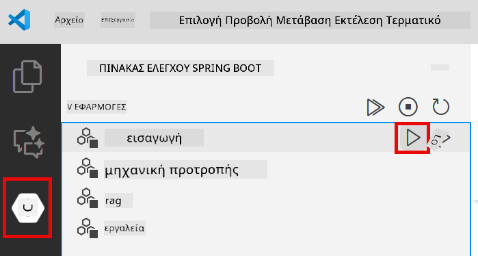
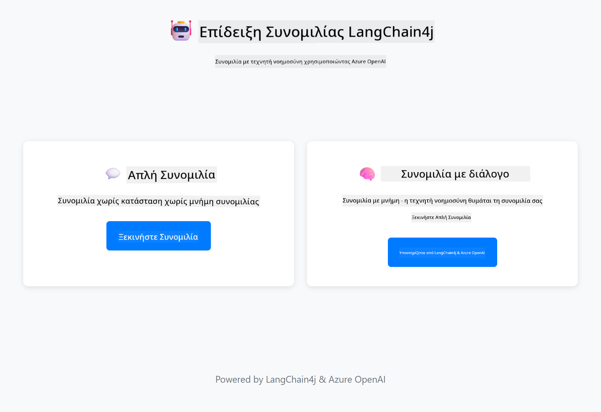

<!--
CO_OP_TRANSLATOR_METADATA:
{
  "original_hash": "c3e07ca58d0b8a3f47d3bf5728541e0a",
  "translation_date": "2025-12-13T13:36:53+00:00",
  "source_file": "01-introduction/README.md",
  "language_code": "el"
}
-->
# Module 01: Ξεκινώντας με το LangChain4j

## Περιεχόμενα

- [Τι θα μάθετε](../../../01-introduction)
- [Προαπαιτούμενα](../../../01-introduction)
- [Κατανόηση του βασικού προβλήματος](../../../01-introduction)
- [Κατανόηση των tokens](../../../01-introduction)
- [Πώς λειτουργεί η μνήμη](../../../01-introduction)
- [Πώς χρησιμοποιεί το LangChain4j](../../../01-introduction)
- [Ανάπτυξη υποδομής Azure OpenAI](../../../01-introduction)
- [Εκτέλεση της εφαρμογής τοπικά](../../../01-introduction)
- [Χρήση της εφαρμογής](../../../01-introduction)
  - [Συνομιλία χωρίς κατάσταση (Αριστερό πάνελ)](../../../01-introduction)
  - [Συνομιλία με κατάσταση (Δεξί πάνελ)](../../../01-introduction)
- [Επόμενα βήματα](../../../01-introduction)

## Τι θα μάθετε

Αν ολοκληρώσατε το γρήγορο ξεκίνημα, είδατε πώς να στέλνετε προτροπές και να λαμβάνετε απαντήσεις. Αυτή είναι η βάση, αλλά οι πραγματικές εφαρμογές χρειάζονται περισσότερα. Αυτό το module σας διδάσκει πώς να δημιουργήσετε συνομιλητική τεχνητή νοημοσύνη που θυμάται το πλαίσιο και διατηρεί κατάσταση - η διαφορά μεταξύ μιας επίδειξης μίας χρήσης και μιας εφαρμογής έτοιμης για παραγωγή.

Θα χρησιμοποιήσουμε το GPT-5 της Azure OpenAI σε όλο αυτόν τον οδηγό επειδή οι προηγμένες ικανότητες συλλογισμού του καθιστούν πιο εμφανείς τις συμπεριφορές των διαφόρων προτύπων. Όταν προσθέσετε μνήμη, θα δείτε καθαρά τη διαφορά. Αυτό καθιστά πιο εύκολη την κατανόηση του τι φέρνει κάθε συστατικό στην εφαρμογή σας.

Θα δημιουργήσετε μία εφαρμογή που δείχνει και τα δύο πρότυπα:

**Συνομιλία χωρίς κατάσταση** - Κάθε αίτημα είναι ανεξάρτητο. Το μοντέλο δεν έχει μνήμη προηγούμενων μηνυμάτων. Αυτό είναι το πρότυπο που χρησιμοποιήσατε στο γρήγορο ξεκίνημα.

**Συνομιλία με κατάσταση** - Κάθε αίτημα περιλαμβάνει το ιστορικό της συνομιλίας. Το μοντέλο διατηρεί το πλαίσιο σε πολλούς γύρους. Αυτό απαιτούν οι εφαρμογές παραγωγής.

## Προαπαιτούμενα

- Συνδρομή Azure με πρόσβαση στο Azure OpenAI
- Java 21, Maven 3.9+
- Azure CLI (https://learn.microsoft.com/en-us/cli/azure/install-azure-cli)
- Azure Developer CLI (azd) (https://learn.microsoft.com/en-us/azure/developer/azure-developer-cli/install-azd)

> **Σημείωση:** Java, Maven, Azure CLI και Azure Developer CLI (azd) είναι προεγκατεστημένα στο παρεχόμενο devcontainer.

> **Σημείωση:** Αυτό το module χρησιμοποιεί GPT-5 στο Azure OpenAI. Η ανάπτυξη ρυθμίζεται αυτόματα μέσω `azd up` - μην τροποποιήσετε το όνομα του μοντέλου στον κώδικα.

## Κατανόηση του βασικού προβλήματος

Τα γλωσσικά μοντέλα είναι χωρίς κατάσταση. Κάθε κλήση API είναι ανεξάρτητη. Αν στείλετε "Το όνομά μου είναι Γιάννης" και μετά ρωτήσετε "Ποιο είναι το όνομά μου;", το μοντέλο δεν έχει ιδέα ότι μόλις συστήσατε τον εαυτό σας. Αντιμετωπίζει κάθε αίτημα σαν να είναι η πρώτη συνομιλία που έχετε κάνει ποτέ.

Αυτό είναι εντάξει για απλές ερωτήσεις και απαντήσεις αλλά άχρηστο για πραγματικές εφαρμογές. Τα bots εξυπηρέτησης πελατών πρέπει να θυμούνται τι τους είπατε. Οι προσωπικοί βοηθοί χρειάζονται πλαίσιο. Κάθε συνομιλία πολλών γύρων απαιτεί μνήμη.


*Η διαφορά μεταξύ συνομιλιών χωρίς κατάσταση (ανεξάρτητες κλήσεις) και με κατάσταση (με επίγνωση πλαισίου)*

## Κατανόηση των tokens

Πριν βουτήξουμε στις συνομιλίες, είναι σημαντικό να κατανοήσουμε τα tokens - τις βασικές μονάδες κειμένου που επεξεργάζονται τα γλωσσικά μοντέλα:


*Παράδειγμα πώς το κείμενο χωρίζεται σε tokens - "I love AI!" γίνεται 4 ξεχωριστές μονάδες επεξεργασίας*

Τα tokens είναι ο τρόπος με τον οποίο τα μοντέλα AI μετρούν και επεξεργάζονται το κείμενο. Λέξεις, σημεία στίξης και ακόμα και κενά μπορεί να είναι tokens. Το μοντέλο σας έχει όριο στο πόσα tokens μπορεί να επεξεργαστεί ταυτόχρονα (400.000 για το GPT-5, με έως 272.000 tokens εισόδου και 128.000 tokens εξόδου). Η κατανόηση των tokens βοηθά στη διαχείριση του μήκους της συνομιλίας και του κόστους.

## Πώς λειτουργεί η μνήμη

Η μνήμη συνομιλίας λύνει το πρόβλημα της έλλειψης κατάστασης διατηρώντας το ιστορικό της συνομιλίας. Πριν στείλετε το αίτημά σας στο μοντέλο, το πλαίσιο προσθέτει τα σχετικά προηγούμενα μηνύματα. Όταν ρωτάτε "Ποιο είναι το όνομά μου;", το σύστημα στέλνει ολόκληρο το ιστορικό της συνομιλίας, επιτρέποντας στο μοντέλο να δει ότι προηγουμένως είπατε "Το όνομά μου είναι Γιάννης."

Το LangChain4j παρέχει υλοποιήσεις μνήμης που το διαχειρίζονται αυτό αυτόματα. Επιλέγετε πόσα μηνύματα να διατηρείτε και το πλαίσιο διαχειρίζεται το παράθυρο πλαισίου.


*Το MessageWindowChatMemory διατηρεί ένα κυλιόμενο παράθυρο πρόσφατων μηνυμάτων, απορρίπτοντας αυτόματα τα παλιά*

## Πώς χρησιμοποιεί το LangChain4j

Αυτό το module επεκτείνει το γρήγορο ξεκίνημα ενσωματώνοντας το Spring Boot και προσθέτοντας μνήμη συνομιλίας. Δείτε πώς συνδέονται τα κομμάτια:

**Εξαρτήσεις** - Προσθέστε δύο βιβλιοθήκες LangChain4j:

```xml
<dependency>
    <groupId>dev.langchain4j</groupId>
    <artifactId>langchain4j</artifactId> <!-- Inherited from BOM in root pom.xml -->
</dependency>
<dependency>
    <groupId>dev.langchain4j</groupId>
    <artifactId>langchain4j-open-ai-official</artifactId> <!-- Inherited from BOM in root pom.xml -->
</dependency>
```

**Μοντέλο συνομιλίας** - Ρυθμίστε το Azure OpenAI ως bean Spring ([LangChainConfig.java](../../../01-introduction/src/main/java/com/example/langchain4j/config/LangChainConfig.java)):

```java
@Bean
public OpenAiOfficialChatModel openAiOfficialChatModel() {
    return OpenAiOfficialChatModel.builder()
            .baseUrl(azureEndpoint)
            .apiKey(azureApiKey)
            .modelName(deploymentName)
            .timeout(Duration.ofMinutes(5))
            .maxRetries(3)
            .build();
}
```

Ο builder διαβάζει τα διαπιστευτήρια από μεταβλητές περιβάλλοντος που ορίζονται από το `azd up`. Η ρύθμιση του `baseUrl` στο endpoint Azure σας κάνει τον πελάτη OpenAI να λειτουργεί με το Azure OpenAI.

**Μνήμη συνομιλίας** - Παρακολουθήστε το ιστορικό συνομιλίας με το MessageWindowChatMemory ([ConversationService.java](../../../01-introduction/src/main/java/com/example/langchain4j/service/ConversationService.java)):

```java
ChatMemory memory = MessageWindowChatMemory.withMaxMessages(10);

memory.add(UserMessage.from("My name is John"));
memory.add(AiMessage.from("Nice to meet you, John!"));

memory.add(UserMessage.from("What's my name?"));
AiMessage aiMessage = chatModel.chat(memory.messages()).aiMessage();
memory.add(aiMessage);
```

Δημιουργήστε μνήμη με `withMaxMessages(10)` για να κρατάτε τα τελευταία 10 μηνύματα. Προσθέστε μηνύματα χρήστη και AI με τυποποιημένα wrappers: `UserMessage.from(text)` και `AiMessage.from(text)`. Ανακτήστε το ιστορικό με `memory.messages()` και στείλτε το στο μοντέλο. Η υπηρεσία αποθηκεύει ξεχωριστές περιπτώσεις μνήμης ανά αναγνωριστικό συνομιλίας, επιτρέποντας σε πολλούς χρήστες να συνομιλούν ταυτόχρονα.

> **🤖 Δοκιμάστε με [GitHub Copilot](https://github.com/features/copilot) Chat:** Ανοίξτε το [`ConversationService.java`](../../../01-introduction/src/main/java/com/example/langchain4j/service/ConversationService.java) και ρωτήστε:
> - "Πώς αποφασίζει το MessageWindowChatMemory ποια μηνύματα να απορρίψει όταν το παράθυρο είναι γεμάτο;"
> - "Μπορώ να υλοποιήσω προσαρμοσμένη αποθήκευση μνήμης χρησιμοποιώντας βάση δεδομένων αντί για μνήμη RAM;"
> - "Πώς θα πρόσθετα σύνοψη για να συμπιέσω το παλιό ιστορικό συνομιλίας;"

Το endpoint συνομιλίας χωρίς κατάσταση παραλείπει εντελώς τη μνήμη - απλά `chatModel.chat(prompt)` όπως στο γρήγορο ξεκίνημα. Το endpoint με κατάσταση προσθέτει μηνύματα στη μνήμη, ανακτά το ιστορικό και περιλαμβάνει αυτό το πλαίσιο με κάθε αίτημα. Ίδια ρύθμιση μοντέλου, διαφορετικά πρότυπα.

## Ανάπτυξη υποδομής Azure OpenAI

**Bash:**
```bash
cd 01-introduction
azd up  # Επιλέξτε συνδρομή και τοποθεσία (συνιστάται eastus2)
```

**PowerShell:**
```powershell
cd 01-introduction
azd up  # Επιλέξτε συνδρομή και τοποθεσία (συνιστάται eastus2)
```

> **Σημείωση:** Αν αντιμετωπίσετε σφάλμα χρονικού ορίου (`RequestConflict: Cannot modify resource ... provisioning state is not terminal`), απλά τρέξτε ξανά `azd up`. Οι πόροι Azure μπορεί να βρίσκονται ακόμα σε διαδικασία παροχής στο παρασκήνιο, και η επανάληψη επιτρέπει την ολοκλήρωση της ανάπτυξης μόλις οι πόροι φτάσουν σε τελικό στάδιο.

Αυτό θα:
1. Αναπτύξει πόρο Azure OpenAI με μοντέλα GPT-5 και text-embedding-3-small
2. Δημιουργήσει αυτόματα αρχείο `.env` στη ρίζα του έργου με διαπιστευτήρια
3. Ρυθμίσει όλες τις απαιτούμενες μεταβλητές περιβάλλοντος

**Έχετε προβλήματα ανάπτυξης;** Δείτε το [Infrastructure README](infra/README.md) για λεπτομερή αντιμετώπιση προβλημάτων, συμπεριλαμβανομένων συγκρούσεων ονομάτων υποτομέων, βημάτων χειροκίνητης ανάπτυξης στο Azure Portal και οδηγίες ρύθμισης μοντέλου.

**Επαληθεύστε ότι η ανάπτυξη πέτυχε:**

**Bash:**
```bash
cat ../.env  # Πρέπει να εμφανίζει το AZURE_OPENAI_ENDPOINT, το API_KEY, κ.λπ.
```

**PowerShell:**
```powershell
Get-Content ..\.env  # Πρέπει να εμφανίζει το AZURE_OPENAI_ENDPOINT, το API_KEY, κ.λπ.
```

> **Σημείωση:** Η εντολή `azd up` δημιουργεί αυτόματα το αρχείο `.env`. Αν χρειαστεί να το ενημερώσετε αργότερα, μπορείτε είτε να επεξεργαστείτε το αρχείο `.env` χειροκίνητα είτε να το αναδημιουργήσετε τρέχοντας:
>
> **Bash:**
> ```bash
> cd ..
> bash .azd-env.sh
> ```
>
> **PowerShell:**
> ```powershell
> cd ..
> .\.azd-env.ps1
> ```

## Εκτέλεση της εφαρμογής τοπικά

**Επαληθεύστε την ανάπτυξη:**

Βεβαιωθείτε ότι το αρχείο `.env` υπάρχει στον ριζικό φάκελο με τα διαπιστευτήρια Azure:

**Bash:**
```bash
cat ../.env  # Πρέπει να εμφανίζει το AZURE_OPENAI_ENDPOINT, API_KEY, DEPLOYMENT
```

**PowerShell:**
```powershell
Get-Content ..\.env  # Πρέπει να εμφανίζει το AZURE_OPENAI_ENDPOINT, API_KEY, DEPLOYMENT
```

**Εκκινήστε τις εφαρμογές:**

**Επιλογή 1: Χρήση Spring Boot Dashboard (Συνιστάται για χρήστες VS Code)**

Το dev container περιλαμβάνει την επέκταση Spring Boot Dashboard, που παρέχει οπτικό περιβάλλον για τη διαχείριση όλων των εφαρμογών Spring Boot. Μπορείτε να τη βρείτε στη γραμμή δραστηριοτήτων αριστερά στο VS Code (αναζητήστε το εικονίδιο Spring Boot).

Από το Spring Boot Dashboard, μπορείτε να:
- Δείτε όλες τις διαθέσιμες εφαρμογές Spring Boot στο χώρο εργασίας
- Ξεκινήσετε/σταματήσετε εφαρμογές με ένα κλικ
- Δείτε τα αρχεία καταγραφής εφαρμογών σε πραγματικό χρόνο
- Παρακολουθήσετε την κατάσταση της εφαρμογής

Απλά κάντε κλικ στο κουμπί αναπαραγωγής δίπλα στο "introduction" για να ξεκινήσετε αυτό το module, ή ξεκινήστε όλα τα modules μαζί.



**Επιλογή 2: Χρήση shell scripts**

Ξεκινήστε όλες τις web εφαρμογές (modules 01-04):

**Bash:**
```bash
cd ..  # Από τον ριζικό κατάλογο
./start-all.sh
```

**PowerShell:**
```powershell
cd ..  # Από τον ριζικό κατάλογο
.\start-all.ps1
```

Ή ξεκινήστε μόνο αυτό το module:

**Bash:**
```bash
cd 01-introduction
./start.sh
```

**PowerShell:**
```powershell
cd 01-introduction
.\start.ps1
```

Και τα δύο scripts φορτώνουν αυτόματα τις μεταβλητές περιβάλλοντος από το αρχείο `.env` στη ρίζα και θα δημιουργήσουν τα JARs αν δεν υπάρχουν.

> **Σημείωση:** Αν προτιμάτε να χτίσετε όλα τα modules χειροκίνητα πριν την εκκίνηση:
>
> **Bash:**
> ```bash
> cd ..  # Go to root directory
> mvn clean package -DskipTests
> ```
>
> **PowerShell:**
> ```powershell
> cd ..  # Go to root directory
> mvn clean package -DskipTests
> ```

Ανοίξτε http://localhost:8080 στον περιηγητή σας.

**Για να σταματήσετε:**

**Bash:**
```bash
./stop.sh  # Μόνο αυτό το module
# Ή
cd .. && ./stop-all.sh  # Όλα τα modules
```

**PowerShell:**
```powershell
.\stop.ps1  # Μόνο αυτό το module
# Ή
cd ..; .\stop-all.ps1  # Όλα τα modules
```

## Χρήση της εφαρμογής

Η εφαρμογή παρέχει ένα web περιβάλλον με δύο υλοποιήσεις συνομιλίας δίπλα-δίπλα.



*Πίνακας ελέγχου που δείχνει τις επιλογές Απλής Συνομιλίας (χωρίς κατάσταση) και Συνομιλίας με κατάσταση*

### Συνομιλία χωρίς κατάσταση (Αριστερό πάνελ)

Δοκιμάστε πρώτα αυτό. Ρωτήστε "Το όνομά μου είναι Γιάννης" και αμέσως μετά "Ποιο είναι το όνομά μου;". Το μοντέλο δεν θα θυμάται γιατί κάθε μήνυμα είναι ανεξάρτητο. Αυτό δείχνει το βασικό πρόβλημα με την απλή ενσωμάτωση γλωσσικού μοντέλου - έλλειψη πλαισίου συνομιλίας.


*Η AI δεν θυμάται το όνομά σας από το προηγούμενο μήνυμα*

### Συνομιλία με κατάσταση (Δεξί πάνελ)

Τώρα δοκιμάστε την ίδια ακολουθία εδώ. Ρωτήστε "Το όνομά μου είναι Γιάννης" και μετά "Ποιο είναι το όνομά μου;". Αυτή τη φορά θυμάται. Η διαφορά είναι το MessageWindowChatMemory - διατηρεί το ιστορικό συνομιλίας και το περιλαμβάνει με κάθε αίτημα. Έτσι λειτουργεί η παραγωγική συνομιλητική AI.


*Η AI θυμάται το όνομά σας από νωρίτερα στη συνομιλία*

Και τα δύο πάνελ χρησιμοποιούν το ίδιο μοντέλο GPT-5. Η μόνη διαφορά είναι η μνήμη. Αυτό καθιστά σαφές τι φέρνει η μνήμη στην εφαρμογή σας και γιατί είναι απαραίτητη για πραγματικές περιπτώσεις χρήσης.

## Επόμενα βήματα

**Επόμενο Module:** [02-prompt-engineering - Μηχανική Προτροπών με GPT-5](../02-prompt-engineering/README.md)

---

**Πλοήγηση:** [← Προηγούμενο: Module 00 - Γρήγορο Ξεκίνημα](../00-quick-start/README.md) | [Πίσω στην Αρχική](../README.md) | [Επόμενο: Module 02 - Μηχανική Προτροπών →](../02-prompt-engineering/README.md)

---

<!-- CO-OP TRANSLATOR DISCLAIMER START -->
**Αποποίηση ευθυνών**:  
Αυτό το έγγραφο έχει μεταφραστεί χρησιμοποιώντας την υπηρεσία αυτόματης μετάφρασης AI [Co-op Translator](https://github.com/Azure/co-op-translator). Παρόλο που επιδιώκουμε την ακρίβεια, παρακαλούμε να λάβετε υπόψη ότι οι αυτόματες μεταφράσεις ενδέχεται να περιέχουν λάθη ή ανακρίβειες. Το πρωτότυπο έγγραφο στη μητρική του γλώσσα πρέπει να θεωρείται η αυθεντική πηγή. Για κρίσιμες πληροφορίες, συνιστάται επαγγελματική ανθρώπινη μετάφραση. Δεν φέρουμε ευθύνη για τυχόν παρεξηγήσεις ή λανθασμένες ερμηνείες που προκύπτουν από τη χρήση αυτής της μετάφρασης.
<!-- CO-OP TRANSLATOR DISCLAIMER END -->