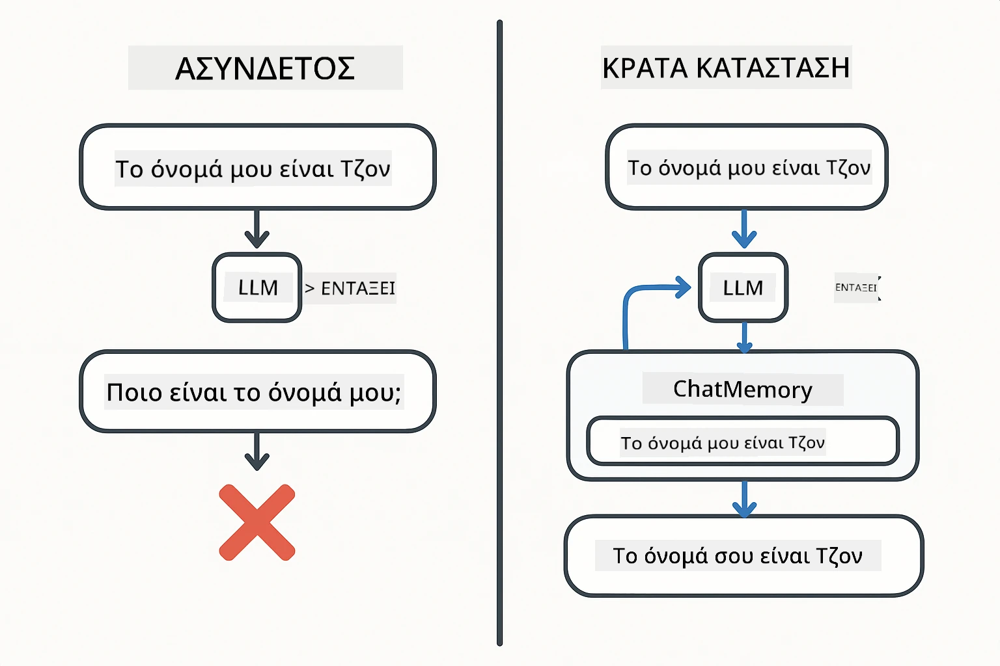
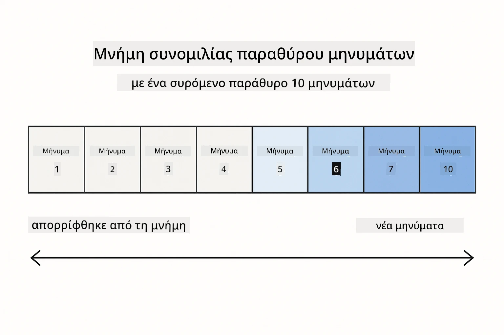
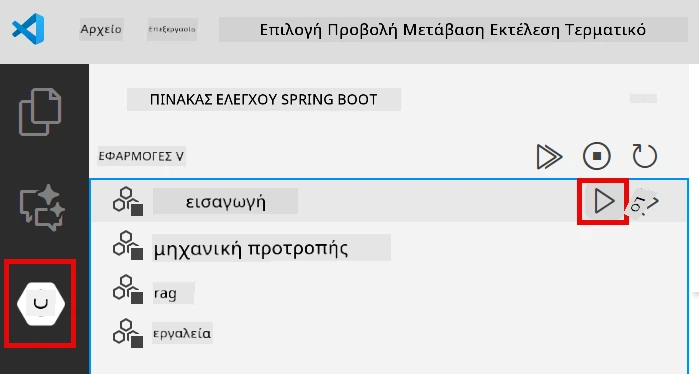
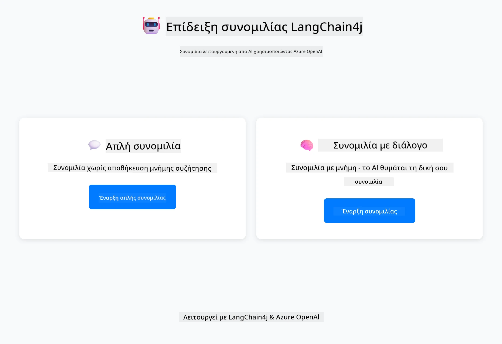
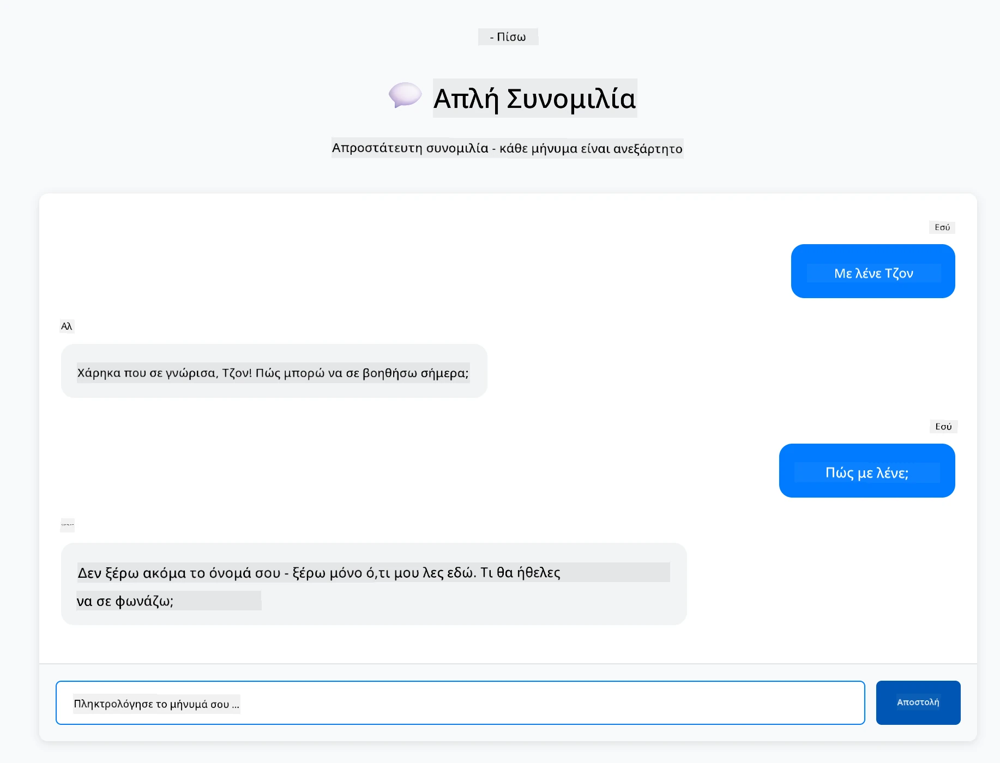
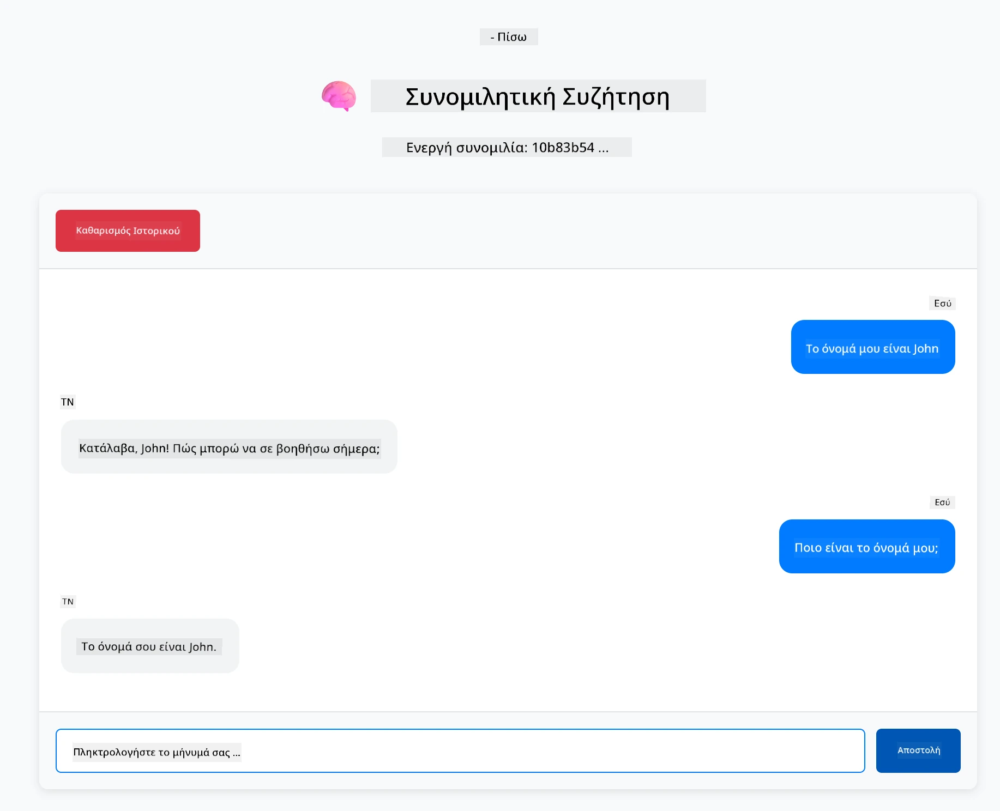

# Module 01: Ξεκινώντας με το LangChain4j

## Περιεχόμενα

- [Περιήγηση σε Βίντεο](#περιήγηση-σε-βίντεο)
- [Τι θα Μάθετε](#τι-θα-μάθετε)
- [Απαιτήσεις](#απαιτήσεις)
- [Κατανόηση του Βασικού Προβλήματος](#κατανόηση-του-βασικού-προβλήματος)
- [Κατανόηση των Tokens](#κατανόηση-των-tokens)
- [Πώς Λειτουργεί η Μνήμη](#πώς-λειτουργεί-η-μνήμη)
- [Πώς Χρησιμοποιείται το LangChain4j](#πώς-χρησιμοποιείται-το-langchain4j)
- [Ανάπτυξη Υποδομής Azure OpenAI](#ανάπτυξη-υποδομής-azure-openai)
- [Εκτέλεση της Εφαρμογής Τοπικά](#εκτέλεση-της-εφαρμογής-τοπικά)
- [Χρήση της Εφαρμογής](#χρήση-της-εφαρμογής)
  - [Άνευ Κατάστασης Συνομιλία (Αριστερό Πάνελ)](#άνευ-κατάστασης-συνομιλία-αριστερό-πάνελ)
  - [Κατάστασης Συνομιλία (Δεξί Πάνελ)](#κατάστασης-συνομιλία-δεξί-πάνελ)
- [Επόμενα Βήματα](#επόμενα-βήματα)

## Περιήγηση σε Βίντεο

Παρακολουθήστε αυτή τη ζωντανή παρουσίαση που εξηγεί πώς να ξεκινήσετε με αυτό το module:

<a href="https://www.youtube.com/live/nl_troDm8rQ?si=6b85S8xGjWnT2fX9"></a>

## Τι θα Μάθετε

Αυτή είναι η αφετηρία σας με το LangChain4j και το Azure OpenAI. Ξεκινάμε με τα βασικά και αρχίζουμε να κατασκευάζουμε εφαρμογές παραγωγικού επιπέδου. Αυτό το module εστιάζει στην συνομιλητική AI που θυμάται το πλαίσιο και διατηρεί κατάσταση — τις θεμελιώδεις έννοιες πάνω στις οποίες βασίζονται όλα τα μετέπειτα modules.

Θα χρησιμοποιήσουμε το GPT-5.2 του Azure OpenAI σε όλο τον οδηγό επειδή οι προηγμένες ικανότητες λογικής του καθιστούν τη συμπεριφορά διαφορετικών προτύπων πιο εμφανή. Όταν προσθέσετε μνήμη, θα δείτε καθαρά τη διαφορά. Αυτό καθιστά πιο εύκολη την κατανόηση τι φέρνει κάθε συνιστώσα στην εφαρμογή σας.

Θα δημιουργήσετε μία εφαρμογή που δείχνει και τα δύο πρότυπα:

**Άνευ Κατάστασης Συνομιλία** - Κάθε αίτημα είναι ανεξάρτητο. Το μοντέλο δεν θυμάται προηγούμενα μηνύματα. Αυτό είναι το απλούστερο σημείο εκκίνησης.

**Κατάστασης Συνομιλία** - Κάθε αίτημα περιλαμβάνει το ιστορικό συνομιλίας. Το μοντέλο διατηρεί το πλαίσιο σε πολλαπλές ανταλλαγές. Αυτό απαιτούν οι παραγωγικές εφαρμογές.

## Απαιτήσεις

- Συνδρομή Azure με πρόσβαση στο Azure OpenAI
- Java 21, Maven 3.9+ 
- Azure CLI (https://learn.microsoft.com/en-us/cli/azure/install-azure-cli)
- Azure Developer CLI (azd) (https://learn.microsoft.com/en-us/azure/developer/azure-developer-cli/install-azd)

> **Σημείωση:** Java, Maven, Azure CLI και Azure Developer CLI (azd) είναι προεγκατεστημένα στο παρεχόμενο devcontainer.

> **Σημείωση:** Αυτό το module χρησιμοποιεί το GPT-5.2 στο Azure OpenAI. Η ανάπτυξη ρυθμίζεται αυτόματα μέσω `azd up` - μην τροποποιήσετε το όνομα του μοντέλου στον κώδικα.

## Κατανόηση του Βασικού Προβλήματος

Τα μοντέλα γλώσσας είναι άνευ κατάστασης. Κάθε κλήση API είναι ανεξάρτητη. Αν στείλετε "Το όνομά μου είναι Γιάννης" και μετά ρωτήσετε "Ποιο είναι το όνομά μου;", το μοντέλο δεν έχει ιδέα ότι μόλις συστήσατε τον εαυτό σας. Θεωρεί κάθε αίτημα σαν να είναι η πρώτη συνομιλία που είχατε ποτέ.

Αυτό είναι επαρκές για απλές ερωτήσεις-απαντήσεις αλλά άχρηστο για πραγματικές εφαρμογές. Τα bots υποστήριξης πελατών χρειάζεται να θυμούνται τι τους είπατε. Οι προσωπικοί βοηθοί χρειάζονται πλαίσιο. Κάθε συνομιλία πολλαπλών βημάτων απαιτεί μνήμη.

Το παρακάτω διάγραμμα αντιπαραβάλλει τις δύο προσεγγίσεις — αριστερά, μια κλήση άνευ κατάστασης που ξεχνά το όνομά σας· δεξιά, μια κλήση με κατάσταση υποστηριζόμενη από ChatMemory που το θυμάται.



*Η διαφορά μεταξύ άνευ κατάστασης (ανεξάρτητες κλήσεις) και κατάστασης (επικείμενη στο πλαίσιο) συνομιλίες*

## Κατανόηση των Tokens

Πριν βουτήξετε στις συνομιλίες, είναι σημαντικό να κατανοήσετε τα tokens - τις βασικές μονάδες κειμένου που επεξεργάζονται τα μοντέλα γλώσσας:


*Παράδειγμα πώς το κείμενο διασπάται σε tokens - "I love AI!" γίνεται 4 ξεχωριστές μονάδες επεξεργασίας*

Τα tokens είναι το πώς τα μοντέλα AI μετρούν και επεξεργάζονται το κείμενο. Λέξεις, σημεία στίξης και ακόμα και κενά μπορεί να είναι tokens. Το μοντέλο σας έχει όριο πόσα tokens μπορεί να επεξεργαστεί ταυτόχρονα (400,000 για το GPT-5.2, με έως 272,000 εισοδικά tokens και 128,000 εξοδικά tokens). Η κατανόηση των tokens βοηθάει στη διαχείριση του μήκους της συνομιλίας και των κοστών.

## Πώς Λειτουργεί η Μνήμη

Η μνήμη συνομιλίας λύνει το πρόβλημα της άνευ κατάστασης φύσης διατηρώντας το ιστορικό της συνομιλίας. Πριν στείλετε το αίτημά σας στο μοντέλο, το πλαίσιο προθέτει σχετικά προηγούμενα μηνύματα. Όταν ρωτήσετε "Ποιο είναι το όνομά μου;", το σύστημα στέλνει στην πραγματικότητα ολόκληρο το ιστορικό συνομιλίας, επιτρέποντας στο μοντέλο να δει ότι είπατε προηγουμένως "Το όνομά μου είναι Γιάννης."

Το LangChain4j παρέχει υλοποιήσεις μνήμης που διαχειρίζονται αυτό αυτόματα. Επιλέγετε πόσα μηνύματα θα διατηρήσετε και το πλαίσιο διαχειρίζεται το παράθυρο πλαισίου (context window). Το διάγραμμα παρακάτω δείχνει πώς το MessageWindowChatMemory διατηρεί ένα κυλιόμενο παράθυρο πρόσφατων μηνυμάτων.



*Το MessageWindowChatMemory διατηρεί ένα κυλιόμενο παράθυρο πρόσφατων μηνυμάτων, απορρίπτοντας αυτόματα τα παλιά*

## Πώς Χρησιμοποιείται το LangChain4j

Αυτό το module ενσωματώνει το Spring Boot και προσθέτει μνήμη συνομιλίας. Δείτε πώς συνδέονται τα κομμάτια:

**Εξαρτήσεις** - Προσθέστε δύο βιβλιοθήκες LangChain4j:

```xml
<dependency>
    <groupId>dev.langchain4j</groupId>
    <artifactId>langchain4j</artifactId> <!-- Inherited from BOM in root pom.xml -->
</dependency>
<dependency>
    <groupId>dev.langchain4j</groupId>
    <artifactId>langchain4j-open-ai-official</artifactId> <!-- Inherited from BOM in root pom.xml -->
</dependency>
```

**Μοντέλο Συνομιλίας** - Διαμορφώστε το Azure OpenAI ως Spring bean ([LangChainConfig.java](../../../01-introduction/src/main/java/com/example/langchain4j/config/LangChainConfig.java)):

```java
@Bean
public OpenAiOfficialChatModel openAiOfficialChatModel() {
    return OpenAiOfficialChatModel.builder()
            .baseUrl(azureEndpoint)
            .apiKey(azureApiKey)
            .modelName(deploymentName)
            .timeout(Duration.ofMinutes(5))
            .maxRetries(3)
            .build();
}
```

Ο builder διαβάζει πιστοποιητικά από μεταβλητές περιβάλλοντος που ορίζει το `azd up`. Η ρύθμιση `baseUrl` στο τέλος του Azure endpoint σας κάνει τον OpenAI client να λειτουργεί με το Azure OpenAI.

**Μνήμη Συνομιλίας** - Παρακολουθήστε το ιστορικό συνομιλίας με MessageWindowChatMemory ([ConversationService.java](../../../01-introduction/src/main/java/com/example/langchain4j/service/ConversationService.java)):

```java
ChatMemory memory = MessageWindowChatMemory.withMaxMessages(10);

memory.add(UserMessage.from("My name is John"));
memory.add(AiMessage.from("Nice to meet you, John!"));

memory.add(UserMessage.from("What's my name?"));
AiMessage aiMessage = chatModel.chat(memory.messages()).aiMessage();
memory.add(aiMessage);
```

Δημιουργήστε μνήμη με το `withMaxMessages(10)` για να διατηρήσετε τα τελευταία 10 μηνύματα. Προσθέστε μηνύματα χρήστη και AI με τυποποιημένους wrappers: `UserMessage.from(text)` και `AiMessage.from(text)`. Ανακτήστε το ιστορικό με `memory.messages()` και στείλτε το στο μοντέλο. Η υπηρεσία αποθηκεύει ξεχωριστές στιγμές μνήμης ανά αναγνωριστικό συνομιλίας, επιτρέποντας σε πολλούς χρήστες να συνομιλούν ταυτόχρονα.

> **🤖 Δοκιμάστε με το [GitHub Copilot](https://github.com/features/copilot) Chat:** Ανοίξτε το [`ConversationService.java`](../../../01-introduction/src/main/java/com/example/langchain4j/service/ConversationService.java) και ρωτήστε:
> - "Πώς αποφασίζει το MessageWindowChatMemory ποια μηνύματα να απορρίψει όταν το παράθυρο είναι γεμάτο;"
> - "Μπορώ να υλοποιήσω προσαρμοσμένη αποθήκευση μνήμης χρησιμοποιώντας μια βάση δεδομένων αντί για in-memory;"
> - "Πώς θα πρόσθετα σύνοψη για συμπίεση παλαιάς ιστορίας συνομιλίας;"

Το endpoint άνευ κατάστασης παραλείπει τελείως τη μνήμη - απλά `chatModel.chat(prompt)` όπως στην γρήγορη εκκίνηση. Το endpoint κατάστασης προσθέτει μηνύματα στη μνήμη, ανακτά το ιστορικό και συμπεριλαμβάνει το πλαίσιο σε κάθε αίτημα. Ίδια διαμόρφωση μοντέλου, διαφορετικά πρότυπα.

## Ανάπτυξη Υποδομής Azure OpenAI

**Bash:**
```bash
cd 01-introduction
azd up  # Επιλέξτε συνδρομή και τοποθεσία (συνιστάται eastus2)
```

**PowerShell:**
```powershell
cd 01-introduction
azd up  # Επιλέξτε συνδρομή και τοποθεσία (προτεινόμενο το eastus2)
```

> **Σημείωση:** Αν αντιμετωπίσετε σφάλμα χρονικού ορίου (`RequestConflict: Cannot modify resource ... provisioning state is not terminal`), απλώς εκτελέστε ξανά `azd up`. Οι πόροι Azure μπορεί να αναπτύσσονται ακόμα στο παρασκήνιο, και η επανάληψη επιτρέπει την ολοκλήρωση ανάπτυξης όταν οι πόροι φτάσουν σε τελικό στάδιο.

Αυτό θα:
1. Αναπτύξει πόρο Azure OpenAI με μοντέλα GPT-5.2 και text-embedding-3-small
2. Δημιουργήσει αυτόματα το αρχείο `.env` στη ρίζα του project με πιστοποιητικά
3. Ρυθμίσει όλες τις απαιτούμενες μεταβλητές περιβάλλοντος

**Έχετε προβλήματα στην ανάπτυξη;** Δείτε το [README Υποδομής](infra/README.md) για λεπτομερή αντιμετώπιση προβλημάτων, συμπεριλαμβανομένων συγκρούσεων ονομάτων υποτομέων, χειροκίνητων βημάτων ανάπτυξης στο Azure Portal και οδηγιών διαμόρφωσης μοντέλου.

**Επιβεβαίωση επιτυχούς ανάπτυξης:**

**Bash:**
```bash
cat ../.env  # Θα πρέπει να εμφανίζει AZURE_OPENAI_ENDPOINT, API_KEY, κ.λπ.
```

**PowerShell:**
```powershell
Get-Content ..\.env  # Θα πρέπει να εμφανίζει το AZURE_OPENAI_ENDPOINT, το API_KEY, κ.λπ.
```

> **Σημείωση:** Η εντολή `azd up` δημιουργεί αυτόματα το αρχείο `.env`. Αν χρειαστεί να το ενημερώσετε αργότερα, μπορείτε είτε να επεξεργαστείτε το `.env` χειροκίνητα είτε να το αναδημιουργήσετε εκτελώντας:
>
> **Bash:**
> ```bash
> cd ..
> bash .azd-env.sh
> ```
>
> **PowerShell:**
> ```powershell
> cd ..
> .\.azd-env.ps1
> ```

## Εκτέλεση της Εφαρμογής Τοπικά

**Επιβεβαίωση ανάπτυξης:**

Βεβαιωθείτε ότι το αρχείο `.env` υπάρχει στον ριζικό κατάλογο με τα πιστοποιητικά Azure. Εκτελέστε αυτό από τον κατάλογο του module (`01-introduction/`):

**Bash:**
```bash
cat ../.env  # Πρέπει να εμφανίζει το AZURE_OPENAI_ENDPOINT, το API_KEY, το DEPLOYMENT
```

**PowerShell:**
```powershell
Get-Content ..\.env  # Πρέπει να εμφανίζει το AZURE_OPENAI_ENDPOINT, API_KEY, DEPLOYMENT
```

**Εκκίνηση των εφαρμογών:**

**Επιλογή 1: Χρήση Spring Boot Dashboard (Προτεινόμενο για χρήστες VS Code)**

Το dev container περιλαμβάνει την επέκταση Spring Boot Dashboard, που παρέχει οπτική διεπαφή για διαχείριση όλων των εφαρμογών Spring Boot. Μπορείτε να τη βρείτε στη γραμμή δραστηριοτήτων στην αριστερή πλευρά του VS Code (αναζητήστε το εικονίδιο Spring Boot).

Από το Spring Boot Dashboard μπορείτε να:
- Δείτε όλες τις διαθέσιμες εφαρμογές Spring Boot στο χώρο εργασίας
- Ξεκινήσετε/σταματήσετε εφαρμογές με ένα κλικ
- Δείτε logs εφαρμογών σε πραγματικό χρόνο
- Παρακολουθήσετε κατάσταση εφαρμογών

Απλά κάντε κλικ στο κουμπί αναπαραγωγής δίπλα στο "introduction" για να ξεκινήσετε αυτό το module ή ξεκινήστε όλα τα modules μαζί.



*Το Spring Boot Dashboard στο VS Code — εκκινήστε, σταματήστε και παρακολουθήστε όλα τα modules από ένα σημείο*

**Επιλογή 2: Χρήση shell scripts**

Ξεκινήστε όλες τις διαδικτυακές εφαρμογές (modules 01-04):

**Bash:**
```bash
cd ..  # Από τον ριζικό κατάλογο
./start-all.sh
```

**PowerShell:**
```powershell
cd ..  # Από τον ριζικό κατάλογο
.\start-all.ps1
```

Ή ξεκινήστε μόνο αυτό το module:

**Bash:**
```bash
cd 01-introduction
./start.sh
```

**PowerShell:**
```powershell
cd 01-introduction
.\start.ps1
```

Και τα δύο scripts φορτώνουν αυτόματα τις μεταβλητές περιβάλλοντος από το ριζικό αρχείο `.env` και θα χτίσουν τα JAR αν δεν υπάρχουν.

> **Σημείωση:** Αν προτιμάτε να χτίσετε όλα τα modules χειροκίνητα πριν την εκτέλεση:
>
> **Bash:**
> ```bash
> cd ..  # Go to root directory
> mvn clean package -DskipTests
> ```
>
> **PowerShell:**
> ```powershell
> cd ..  # Go to root directory
> mvn clean package -DskipTests
> ```

Ανοίξτε το http://localhost:8080 στον περιηγητή σας.

**Για να σταματήσετε:**

**Bash:**
```bash
./stop.sh  # Μόνο αυτό το μονάδα
# Ή
cd .. && ./stop-all.sh  # Όλες οι μονάδες
```

**PowerShell:**
```powershell
.\stop.ps1  # Μόνο αυτό το μοντέλο
# Ή
cd ..; .\stop-all.ps1  # Όλα τα μοντέλα
```

## Χρήση της Εφαρμογής

Η εφαρμογή παρέχει διεπαφή ιστού με δύο υλοποιήσεις συνομιλίας παράλληλα.



*Πίνακας επιλογών που δείχνει και τις δύο επιλογές: Απλή Συνομιλία (άνευ κατάστασης) και Συνομιλία (με κατάσταση)*

### Άνευ Κατάστασης Συνομιλία (Αριστερό Πάνελ)

Δοκιμάστε πρώτα αυτό. Πείτε "Το όνομά μου είναι Γιάννης" και αμέσως μετά ρωτήστε "Ποιο είναι το όνομά μου;". Το μοντέλο δεν θα το θυμάται γιατί κάθε μήνυμα είναι ανεξάρτητο. Αυτό δείχνει το βασικό πρόβλημα της απλής ενσωμάτωσης μοντέλων γλώσσας - έλλειψη πλαισίου συνομιλίας.



*Η AI δεν θυμάται το όνομά σας από το προηγούμενο μήνυμα*

### Κατάστασης Συνομιλία (Δεξί Πάνελ)

Τώρα δοκιμάστε την ίδια ακολουθία εδώ. Πείτε "Το όνομά μου είναι Γιάννης" και μετά "Ποιο είναι το όνομά μου;". Αυτή τη φορά το θυμάται. Η διαφορά είναι το MessageWindowChatMemory - διατηρεί το ιστορικό συνομιλίας και το περιλαμβάνει σε κάθε αίτημα. Αυτός είναι ο τρόπος που λειτουργεί η παραγωγική συνομιλητική AI.



*Η AI θυμάται το όνομά σας από νωρίτερα στη συνομιλία*

Και τα δύο πάνελ χρησιμοποιούν το ίδιο μοντέλο GPT-5.2. Η μόνη διαφορά είναι η μνήμη. Αυτό κάνει σαφές τι προσθέτει η μνήμη στην εφαρμογή σας και γιατί είναι απαραίτητη για πραγματικές περιπτώσεις χρήσης.

## Επόμενα Βήματα

**Επόμενο Module:** [02-prompt-engineering - Μηχανική Προτροπής με GPT-5.2](../02-prompt-engineering/README.md)

---

**Πλοήγηση:** [← Πίσω στην Κεντρική σελίδα](../README.md) | [Επόμενο: Module 02 - Μηχανική Προτροπής →](../02-prompt-engineering/README.md)

---

<!-- CO-OP TRANSLATOR DISCLAIMER START -->
**Αποποίηση ευθυνών**:
Αυτό το έγγραφο έχει μεταφραστεί χρησιμοποιώντας την υπηρεσία μετάφρασης με τεχνητή νοημοσύνη [Co-op Translator](https://github.com/Azure/co-op-translator). Ενώ επιδιώκουμε την ακρίβεια, παρακαλούμε να έχετε υπόψη ότι οι αυτοματοποιημένες μεταφράσεις ενδέχεται να περιέχουν λάθη ή ανακρίβειες. Το πρωτότυπο έγγραφο στη μητρική του γλώσσα πρέπει να θεωρείται η αυθεντική πηγή. Για κρίσιμες πληροφορίες, συνιστάται επαγγελματική ανθρώπινη μετάφραση. Δεν φέρουμε ευθύνη για τυχόν παρεξηγήσεις ή λανθασμένες ερμηνείες που προκύπτουν από τη χρήση αυτής της μετάφρασης.
<!-- CO-OP TRANSLATOR DISCLAIMER END -->