# Ενότητα 02: Μηχανική Προτροπών με GPT-5

## Πίνακας Περιεχομένων

- [Τι θα μάθετε](../../../02-prompt-engineering)
- [Προαπαιτούμενα](../../../02-prompt-engineering)
- [Κατανόηση της Μηχανικής Προτροπών](../../../02-prompt-engineering)
- [Πώς Χρησιμοποιεί το LangChain4j](../../../02-prompt-engineering)
- [Τα Βασικά Πρότυπα](../../../02-prompt-engineering)
- [Χρήση Υφιστάμενων Πόρων Azure](../../../02-prompt-engineering)
- [Στιγμιότυπα Εφαρμογής](../../../02-prompt-engineering)
- [Εξερεύνηση των Προτύπων](../../../02-prompt-engineering)
  - [Χαμηλός vs Υψηλός Ζήλος](../../../02-prompt-engineering)
  - [Εκτέλεση Εργασιών (Εισαγωγές Εργαλείων)](../../../02-prompt-engineering)
  - [Αυτο-Ανακλαστικός Κώδικας](../../../02-prompt-engineering)
  - [Δομημένη Ανάλυση](../../../02-prompt-engineering)
  - [Πολυ-Γύρος Συνομιλίας](../../../02-prompt-engineering)
  - [Βήμα-Βήμα Λογισμός](../../../02-prompt-engineering)
  - [Περιορισμένη Έξοδος](../../../02-prompt-engineering)
- [Τι Μαθαίνετε Πραγματικά](../../../02-prompt-engineering)
- [Επόμενα Βήματα](../../../02-prompt-engineering)

## Τι θα μάθετε

Στην προηγούμενη ενότητα, είδατε πώς η μνήμη επιτρέπει τη συνομιλιακή τεχνητή νοημοσύνη και χρησιμοποιήσατε τα Μοντέλα GitHub για βασικές αλληλεπιδράσεις. Τώρα θα εστιάσουμε στο πώς κάνετε ερωτήσεις - τις ίδιες τις προτροπές - χρησιμοποιώντας το GPT-5 του Azure OpenAI. Ο τρόπος που δομείτε τις προτροπές σας επηρεάζει δραματικά την ποιότητα των απαντήσεων που λαμβάνετε.

Θα χρησιμοποιήσουμε το GPT-5 επειδή εισάγει έλεγχο λογισμού - μπορείτε να πείτε στο μοντέλο πόσο να σκεφτεί πριν απαντήσει. Αυτό καθιστά πιο εμφανείς τις διαφορετικές στρατηγικές προτροπών και σας βοηθά να καταλάβετε πότε να χρησιμοποιήσετε κάθε προσέγγιση. Θα επωφεληθούμε επίσης από τα λιγότερα όρια ρυθμού του Azure για το GPT-5 σε σύγκριση με τα Μοντέλα GitHub.

## Προαπαιτούμενα

- Ολοκληρωμένη Ενότητα 01 (αναπτύχθηκαν πόροι Azure OpenAI)
- Αρχείο `.env` στον ριζικό κατάλογο με διαπιστευτήρια Azure (δημιουργήθηκε από `azd up` στην Ενότητα 01)

> **Σημείωση:** Αν δεν έχετε ολοκληρώσει την Ενότητα 01, ακολουθήστε πρώτα τις οδηγίες ανάπτυξης εκεί.

## Κατανόηση της Μηχανικής Προτροπών

Η μηχανική προτροπών αφορά το σχεδιασμό κειμένου εισόδου που σας δίνει σταθερά τα αποτελέσματα που χρειάζεστε. Δεν πρόκειται απλώς για το να κάνετε ερωτήσεις - πρόκειται για τη δομή των αιτημάτων ώστε το μοντέλο να καταλαβαίνει ακριβώς τι θέλετε και πώς να το παραδώσει.

Σκεφτείτε το σαν να δίνετε οδηγίες σε έναν συνάδελφο. "Διόρθωσε το σφάλμα" είναι ασαφές. "Διόρθωσε την εξαίρεση null pointer στο UserService.java στη γραμμή 45 προσθέτοντας έλεγχο null" είναι συγκεκριμένο. Τα γλωσσικά μοντέλα λειτουργούν με τον ίδιο τρόπο - η συγκεκριμενοποίηση και η δομή έχουν σημασία.

## Πώς Χρησιμοποιεί το LangChain4j

Αυτή η ενότητα παρουσιάζει προηγμένα πρότυπα προτροπών χρησιμοποιώντας το ίδιο θεμέλιο LangChain4j από τις προηγούμενες ενότητες, με έμφαση στη δομή προτροπών και τον έλεγχο λογισμού.

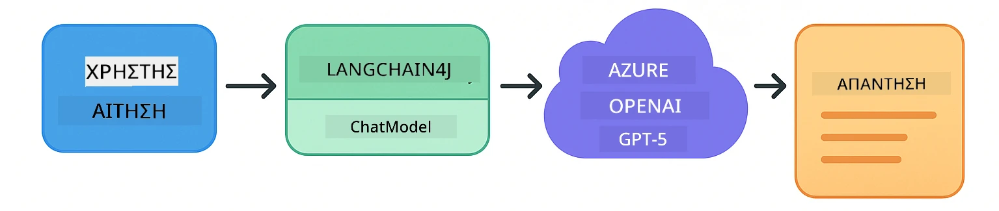

*Πώς το LangChain4j συνδέει τις προτροπές σας με το Azure OpenAI GPT-5*

**Εξαρτήσεις** - Η Ενότητα 02 χρησιμοποιεί τις ακόλουθες εξαρτήσεις langchain4j ορισμένες στο `pom.xml`:
```xml
<dependency>
    <groupId>dev.langchain4j</groupId>
    <artifactId>langchain4j</artifactId> <!-- Inherited from BOM in root pom.xml -->
</dependency>
<dependency>
    <groupId>dev.langchain4j</groupId>
    <artifactId>langchain4j-open-ai-official</artifactId> <!-- Inherited from BOM in root pom.xml -->
</dependency>
```

**Διαμόρφωση OpenAiOfficialChatModel** - [LangChainConfig.java](../../../02-prompt-engineering/src/main/java/com/example/langchain4j/prompts/config/LangChainConfig.java)

Το μοντέλο συνομιλίας διαμορφώνεται χειροκίνητα ως bean Spring χρησιμοποιώντας τον επίσημο πελάτη OpenAI, που υποστηρίζει τα σημεία πρόσβασης Azure OpenAI. Η βασική διαφορά από την Ενότητα 01 είναι ο τρόπος που δομούμε τις προτροπές που στέλνονται στο `chatModel.chat()`, όχι η ίδια η ρύθμιση του μοντέλου.

**Μηνύματα Συστήματος και Χρήστη** - [Gpt5PromptService.java](../../../02-prompt-engineering/src/main/java/com/example/langchain4j/prompts/service/Gpt5PromptService.java)

Το LangChain4j διαχωρίζει τους τύπους μηνυμάτων για σαφήνεια. Το `SystemMessage` ορίζει τη συμπεριφορά και το πλαίσιο της AI (όπως "Είσαι κριτής κώδικα"), ενώ το `UserMessage` περιέχει το πραγματικό αίτημα. Αυτός ο διαχωρισμός σας επιτρέπει να διατηρείτε συνεπή συμπεριφορά AI σε διαφορετικά ερωτήματα χρηστών.

```java
SystemMessage systemMsg = SystemMessage.from(
    "You are a helpful Java programming expert."
);

UserMessage userMsg = UserMessage.from(
    "Explain what a List is in Java"
);

String response = chatModel.chat(systemMsg, userMsg);
```

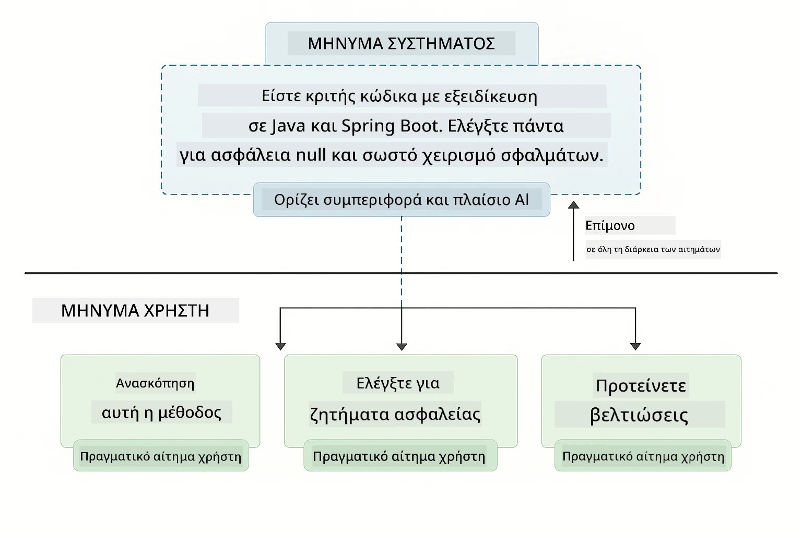

*Το SystemMessage παρέχει μόνιμο πλαίσιο ενώ τα UserMessages περιέχουν μεμονωμένα αιτήματα*

**MessageWindowChatMemory για Πολυ-Γύρους** - Για το πρότυπο πολυ-γύρου συνομιλίας, επαναχρησιμοποιούμε το `MessageWindowChatMemory` από την Ενότητα 01. Κάθε συνεδρία έχει τη δική της μνήμη αποθηκευμένη σε έναν `Map<String, ChatMemory>`, επιτρέποντας πολλαπλές ταυτόχρονες συνομιλίες χωρίς ανάμειξη πλαισίου.

**Πρότυπα Προτροπών** - Η πραγματική εστίαση εδώ είναι η μηχανική προτροπών, όχι νέες API του LangChain4j. Κάθε πρότυπο (χαμηλός ζήλος, υψηλός ζήλος, εκτέλεση εργασιών κ.λπ.) χρησιμοποιεί την ίδια μέθοδο `chatModel.chat(prompt)` αλλά με προσεκτικά δομημένες συμβολοσειρές προτροπών. Οι ετικέτες XML, οι οδηγίες και η μορφοποίηση είναι όλα μέρος του κειμένου της προτροπής, όχι χαρακτηριστικά του LangChain4j.

**Έλεγχος Λογισμού** - Η προσπάθεια λογισμού του GPT-5 ελέγχεται μέσω οδηγιών προτροπής όπως "μέγιστο 2 βήματα λογισμού" ή "εξερεύνησε διεξοδικά". Αυτές είναι τεχνικές μηχανικής προτροπών, όχι ρυθμίσεις LangChain4j. Η βιβλιοθήκη απλώς παραδίδει τις προτροπές σας στο μοντέλο.

Το βασικό συμπέρασμα: Το LangChain4j παρέχει την υποδομή (σύνδεση μοντέλου μέσω [LangChainConfig.java](../../../02-prompt-engineering/src/main/java/com/example/langchain4j/prompts/config/LangChainConfig.java), μνήμη, διαχείριση μηνυμάτων μέσω [Gpt5PromptService.java](../../../02-prompt-engineering/src/main/java/com/example/langchain4j/prompts/service/Gpt5PromptService.java)), ενώ αυτή η ενότητα σας διδάσκει πώς να δημιουργείτε αποτελεσματικές προτροπές μέσα σε αυτή την υποδομή.

## Τα Βασικά Πρότυπα

Δεν χρειάζονται όλα τα προβλήματα την ίδια προσέγγιση. Κάποιες ερωτήσεις χρειάζονται γρήγορες απαντήσεις, άλλες βαθιά σκέψη. Κάποιες χρειάζονται ορατό λογισμό, άλλες απλώς αποτελέσματα. Αυτή η ενότητα καλύπτει οκτώ πρότυπα προτροπών - το καθένα βελτιστοποιημένο για διαφορετικά σενάρια. Θα πειραματιστείτε με όλα για να μάθετε πότε λειτουργεί καλύτερα κάθε προσέγγιση.

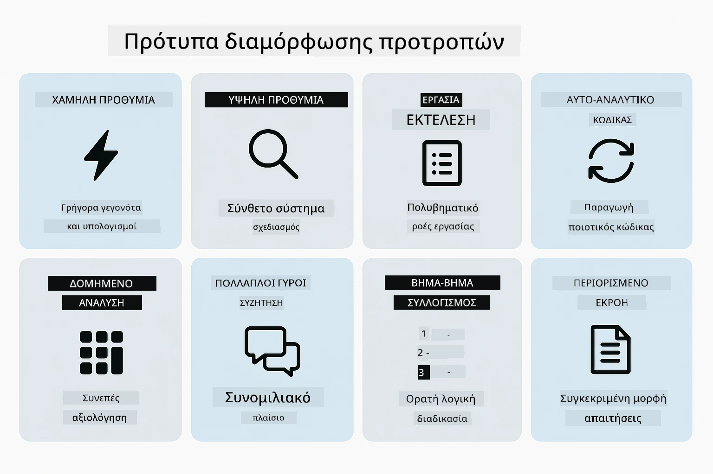

*Επισκόπηση των οκτώ προτύπων μηχανικής προτροπών και των περιπτώσεων χρήσης τους*

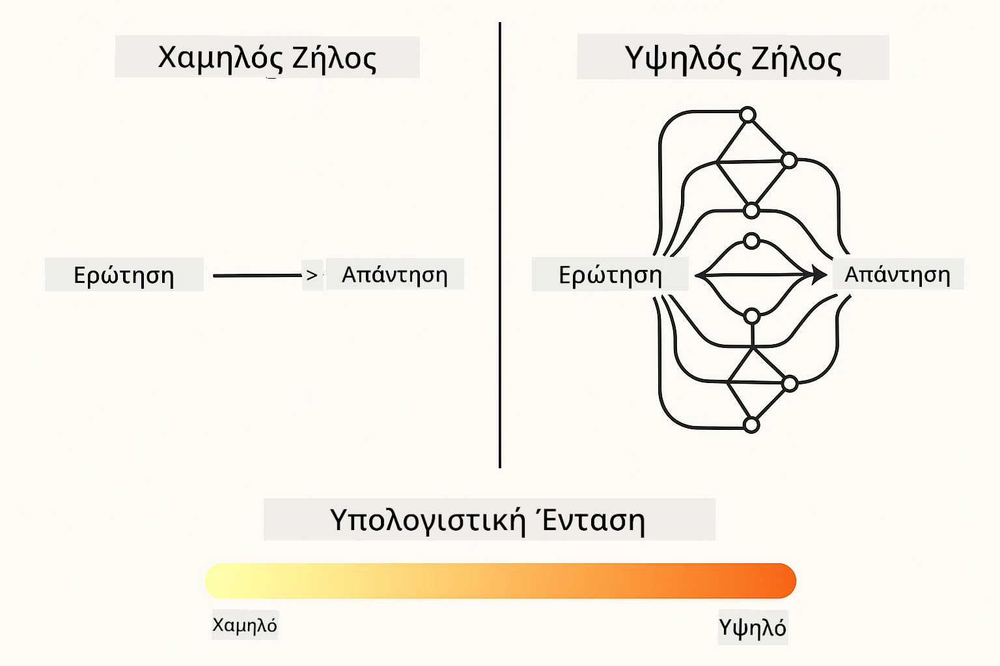

*Χαμηλός ζήλος (γρήγορος, άμεσος) vs Υψηλός ζήλος (διεξοδικός, εξερευνητικός) προσεγγίσεις λογισμού*

**Χαμηλός Ζήλος (Γρήγορος & Εστιασμένος)** - Για απλές ερωτήσεις όπου θέλετε γρήγορες, άμεσες απαντήσεις. Το μοντέλο κάνει ελάχιστο λογισμό - μέγιστο 2 βήματα. Χρησιμοποιήστε το για υπολογισμούς, αναζητήσεις ή απλές ερωτήσεις.

```java
String prompt = """
    <reasoning_effort>low</reasoning_effort>
    <instruction>maximum 2 reasoning steps</instruction>
    
    What is 15% of 200?
    """;

String response = chatModel.chat(prompt);
```

> 💡 **Εξερευνήστε με GitHub Copilot:** Ανοίξτε το [`Gpt5PromptService.java`](../../../02-prompt-engineering/src/main/java/com/example/langchain4j/prompts/service/Gpt5PromptService.java) και ρωτήστε:
> - "Ποια είναι η διαφορά μεταξύ των προτύπων προτροπής χαμηλού και υψηλού ζήλου;"
> - "Πώς βοηθούν οι ετικέτες XML στις προτροπές στη δομή της απάντησης της AI;"
> - "Πότε πρέπει να χρησιμοποιώ πρότυπα αυτο-αντανάκλασης έναντι άμεσων οδηγιών;"

**Υψηλός Ζήλος (Βαθύς & Διεξοδικός)** - Για σύνθετα προβλήματα όπου θέλετε ολοκληρωμένη ανάλυση. Το μοντέλο εξερευνά διεξοδικά και δείχνει λεπτομερή λογισμό. Χρησιμοποιήστε το για σχεδιασμό συστημάτων, αποφάσεις αρχιτεκτονικής ή σύνθετη έρευνα.

```java
String prompt = """
    <reasoning_effort>high</reasoning_effort>
    <instruction>explore thoroughly, show detailed reasoning</instruction>
    
    Design a caching strategy for a high-traffic REST API.
    """;

String response = chatModel.chat(prompt);
```

**Εκτέλεση Εργασιών (Πρόοδος Βήμα-Βήμα)** - Για ροές εργασίας πολλαπλών βημάτων. Το μοντέλο παρέχει ένα αρχικό σχέδιο, αφηγείται κάθε βήμα καθώς εργάζεται, και μετά δίνει μια περίληψη. Χρησιμοποιήστε το για μεταφορές, υλοποιήσεις ή οποιαδήποτε διαδικασία πολλαπλών βημάτων.

```java
String prompt = """
    <task>Create a REST endpoint for user registration</task>
    <preamble>Provide an upfront plan</preamble>
    <narration>Narrate each step as you work</narration>
    <summary>Summarize what was accomplished</summary>
    """;

String response = chatModel.chat(prompt);
```

Η προτροπή Chain-of-Thought ζητά ρητά από το μοντέλο να δείξει τη διαδικασία λογισμού του, βελτιώνοντας την ακρίβεια για σύνθετες εργασίες. Η ανάλυση βήμα-βήμα βοηθά τόσο τους ανθρώπους όσο και την AI να κατανοήσουν τη λογική.

> **🤖 Δοκιμάστε με [GitHub Copilot](https://github.com/features/copilot) Chat:** Ρωτήστε για αυτό το πρότυπο:
> - "Πώς θα προσαρμόσω το πρότυπο εκτέλεσης εργασιών για μακροχρόνιες λειτουργίες;"
> - "Ποιες είναι οι βέλτιστες πρακτικές για τη δομή εισαγωγών εργαλείων σε παραγωγικές εφαρμογές;"
> - "Πώς μπορώ να καταγράψω και να εμφανίσω ενδιάμεσες ενημερώσεις προόδου σε UI;"

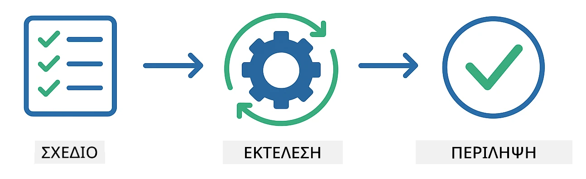

*Σχέδιο → Εκτέλεση → Περίληψη ροής εργασίας για εργασίες πολλαπλών βημάτων*

**Αυτο-Ανακλαστικός Κώδικας** - Για παραγωγή κώδικα ποιότητας παραγωγής. Το μοντέλο δημιουργεί κώδικα, τον ελέγχει με κριτήρια ποιότητας και τον βελτιώνει επαναληπτικά. Χρησιμοποιήστε το όταν δημιουργείτε νέες λειτουργίες ή υπηρεσίες.

```java
String prompt = """
    <task>Create an email validation service</task>
    <quality_criteria>
    - Correct logic and error handling
    - Best practices (clean code, proper naming)
    - Performance optimization
    - Security considerations
    </quality_criteria>
    <instruction>Generate code, evaluate against criteria, improve iteratively</instruction>
    """;

String response = chatModel.chat(prompt);
```

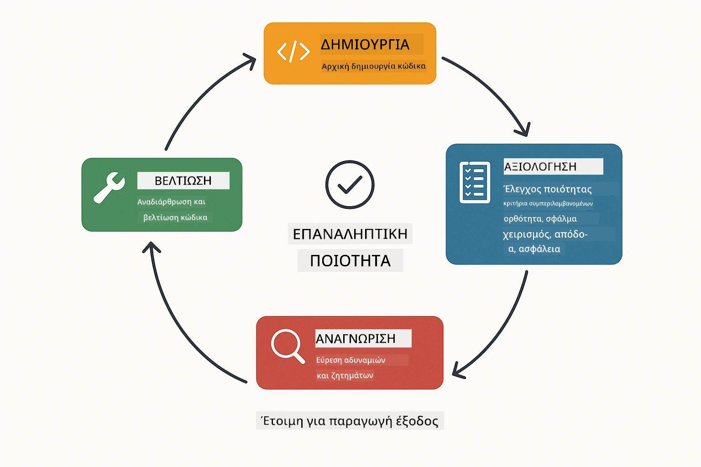

*Επαναληπτικός κύκλος βελτίωσης - δημιουργία, αξιολόγηση, εντοπισμός προβλημάτων, βελτίωση, επανάληψη*

**Δομημένη Ανάλυση** - Για συνεπή αξιολόγηση. Το μοντέλο ελέγχει κώδικα χρησιμοποιώντας ένα σταθερό πλαίσιο (ορθότητα, πρακτικές, απόδοση, ασφάλεια). Χρησιμοποιήστε το για κριτικές κώδικα ή αξιολογήσεις ποιότητας.

```java
String prompt = """
    <code>
    public List getUsers() {
        return database.query("SELECT * FROM users");
    }
    </code>
    
    <framework>
    Evaluate using these categories:
    1. Correctness - Logic and functionality
    2. Best Practices - Code quality
    3. Performance - Efficiency concerns
    4. Security - Vulnerabilities
    </framework>
    """;

String response = chatModel.chat(prompt);
```

> **🤖 Δοκιμάστε με [GitHub Copilot](https://github.com/features/copilot) Chat:** Ρωτήστε για δομημένη ανάλυση:
> - "Πώς μπορώ να προσαρμόσω το πλαίσιο ανάλυσης για διαφορετικούς τύπους κριτικών κώδικα;"
> - "Ποιος είναι ο καλύτερος τρόπος να αναλύω και να ενεργώ σε δομημένη έξοδο προγραμματιστικά;"
> - "Πώς διασφαλίζω συνεπή επίπεδα σοβαρότητας σε διαφορετικές συνεδρίες κριτικής;"

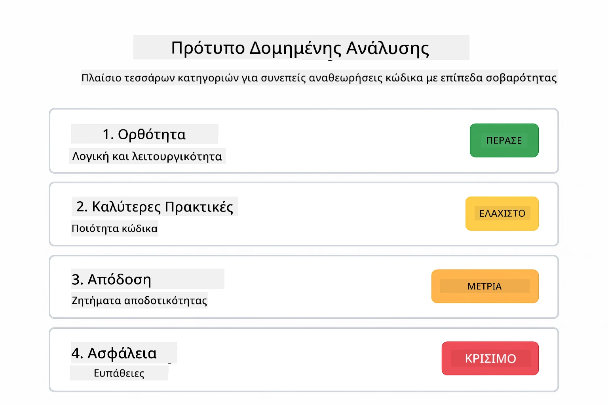

*Πλαίσιο τεσσάρων κατηγοριών για συνεπείς κριτικές κώδικα με επίπεδα σοβαρότητας*

**Πολυ-Γύρος Συνομιλίας** - Για συνομιλίες που χρειάζονται πλαίσιο. Το μοντέλο θυμάται προηγούμενα μηνύματα και χτίζει πάνω τους. Χρησιμοποιήστε το για διαδραστικές συνεδρίες βοήθειας ή σύνθετο Q&A.

```java
ChatMemory memory = MessageWindowChatMemory.withMaxMessages(10);

memory.add(UserMessage.from("What is Spring Boot?"));
AiMessage aiMessage1 = chatModel.chat(memory.messages()).aiMessage();
memory.add(aiMessage1);

memory.add(UserMessage.from("Show me an example"));
AiMessage aiMessage2 = chatModel.chat(memory.messages()).aiMessage();
memory.add(aiMessage2);
```

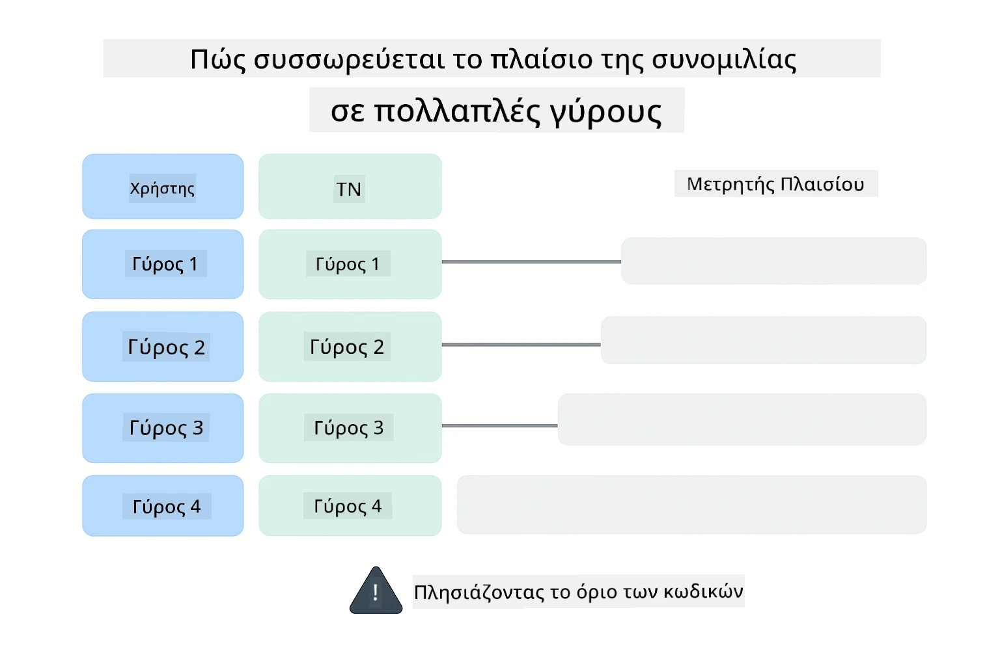

*Πώς συσσωρεύεται το πλαίσιο συνομιλίας σε πολλούς γύρους μέχρι να φτάσει το όριο tokens*

**Βήμα-Βήμα Λογισμός** - Για προβλήματα που απαιτούν ορατή λογική. Το μοντέλο δείχνει ρητό λογισμό για κάθε βήμα. Χρησιμοποιήστε το για μαθηματικά προβλήματα, λογικά παζλ ή όταν χρειάζεστε να κατανοήσετε τη διαδικασία σκέψης.

```java
String prompt = """
    <instruction>Show your reasoning step-by-step</instruction>
    
    If a train travels 120 km in 2 hours, then stops for 30 minutes,
    then travels another 90 km in 1.5 hours, what is the average speed
    for the entire journey including the stop?
    """;

String response = chatModel.chat(prompt);
```

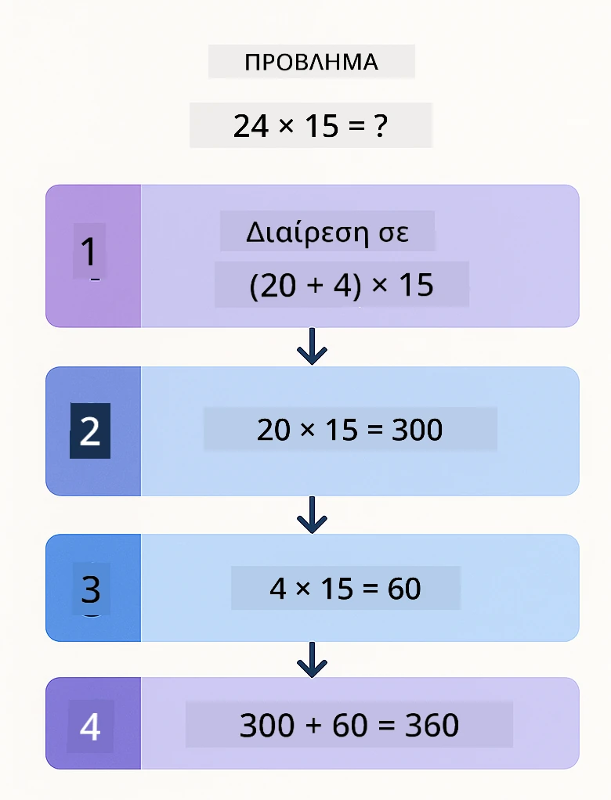

*Διάσπαση προβλημάτων σε ρητά λογικά βήματα*

**Περιορισμένη Έξοδος** - Για απαντήσεις με συγκεκριμένες απαιτήσεις μορφής. Το μοντέλο ακολουθεί αυστηρά κανόνες μορφής και μήκους. Χρησιμοποιήστε το για περιλήψεις ή όταν χρειάζεστε ακριβή δομή εξόδου.

```java
String prompt = """
    <constraints>
    - Exactly 100 words
    - Bullet point format
    - Technical terms only
    </constraints>
    
    Summarize the key concepts of machine learning.
    """;

String response = chatModel.chat(prompt);
```

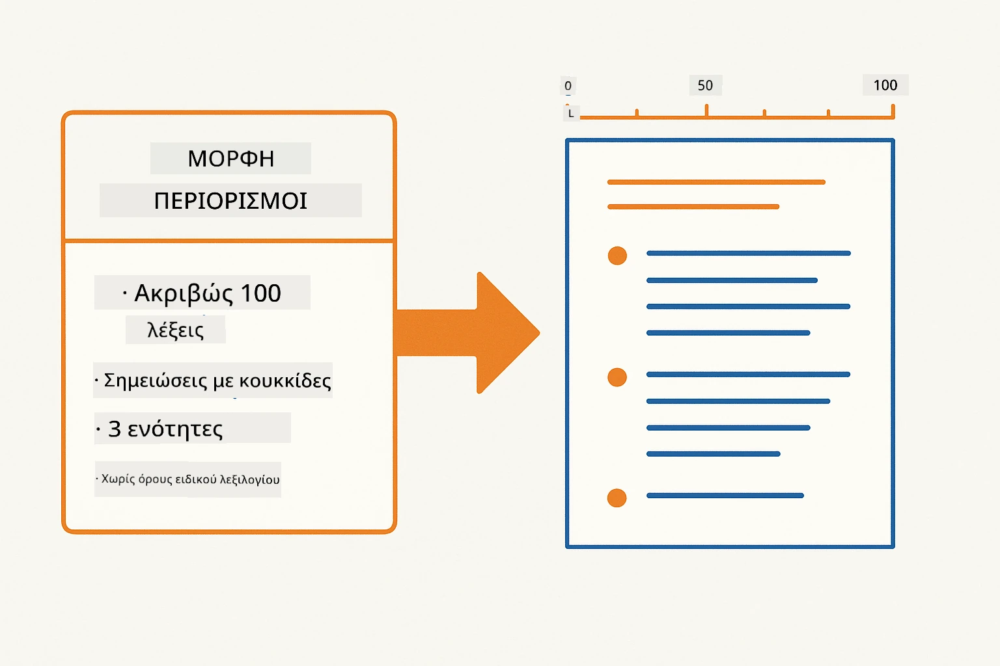

*Επιβολή συγκεκριμένων απαιτήσεων μορφής, μήκους και δομής*

## Χρήση Υφιστάμενων Πόρων Azure

**Επαλήθευση ανάπτυξης:**

Βεβαιωθείτε ότι το αρχείο `.env` υπάρχει στον ριζικό κατάλογο με διαπιστευτήρια Azure (δημιουργήθηκε κατά την Ενότητα 01):
```bash
cat ../.env  # Πρέπει να εμφανίζει το AZURE_OPENAI_ENDPOINT, API_KEY, DEPLOYMENT
```

**Εκκίνηση της εφαρμογής:**

> **Σημείωση:** Αν έχετε ήδη ξεκινήσει όλες τις εφαρμογές χρησιμοποιώντας `./start-all.sh` από την Ενότητα 01, αυτή η ενότητα τρέχει ήδη στη θύρα 8083. Μπορείτε να παραλείψετε τις εντολές εκκίνησης παρακάτω και να μεταβείτε απευθείας στο http://localhost:8083.

**Επιλογή 1: Χρήση Spring Boot Dashboard (Συνιστάται για χρήστες VS Code)**

Το dev container περιλαμβάνει την επέκταση Spring Boot Dashboard, που παρέχει οπτικό περιβάλλον για τη διαχείριση όλων των εφαρμογών Spring Boot. Μπορείτε να τη βρείτε στη γραμμή δραστηριοτήτων αριστερά στο VS Code (αναζητήστε το εικονίδιο Spring Boot).

Από το Spring Boot Dashboard, μπορείτε να:
- Δείτε όλες τις διαθέσιμες εφαρμογές Spring Boot στο χώρο εργασίας
- Ξεκινήσετε/σταματήσετε εφαρμογές με ένα κλικ
- Δείτε τα αρχεία καταγραφής εφαρμογών σε πραγματικό χρόνο
- Παρακολουθήσετε την κατάσταση εφαρμογών

Απλώς κάντε κλικ στο κουμπί αναπαραγωγής δίπλα στο "prompt-engineering" για να ξεκινήσετε αυτή την ενότητα, ή ξεκινήστε όλες τις ενότητες ταυτόχρονα.

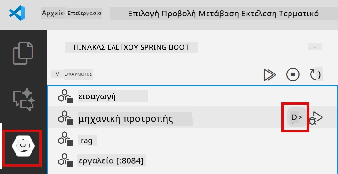

**Επιλογή 2: Χρήση shell scripts**

Ξεκινήστε όλες τις web εφαρμογές (ενότητες 01-04):

**Bash:**
```bash
cd ..  # Από τον ριζικό κατάλογο
./start-all.sh
```

**PowerShell:**
```powershell
cd ..  # Από τον ριζικό κατάλογο
.\start-all.ps1
```

Ή ξεκινήστε μόνο αυτή την ενότητα:

**Bash:**
```bash
cd 02-prompt-engineering
./start.sh
```

**PowerShell:**
```powershell
cd 02-prompt-engineering
.\start.ps1
```

Και τα δύο scripts φορτώνουν αυτόματα τις μεταβλητές περιβάλλοντος από το αρχείο `.env` στη ρίζα και θα δημιουργήσουν τα JAR αν δεν υπάρχουν.

> **Σημείωση:** Αν προτιμάτε να χτίσετε όλες τις ενότητες χειροκίνητα πριν την εκκίνηση:
>
> **Bash:**
> ```bash
> cd ..  # Go to root directory
> mvn clean package -DskipTests
> ```
>
> **PowerShell:**
> ```powershell
> cd ..  # Go to root directory
> mvn clean package -DskipTests
> ```

Ανοίξτε το http://localhost:8083 στον περιηγητή σας.

**Για να σταματήσετε:**

**Bash:**
```bash
./stop.sh  # Μόνο αυτό το module
# Ή
cd .. && ./stop-all.sh  # Όλα τα modules
```

**PowerShell:**
```powershell
.\stop.ps1  # Μόνο αυτό το module
# Ή
cd ..; .\stop-all.ps1  # Όλα τα modules
```

## Στιγμιότυπα Εφαρμογής

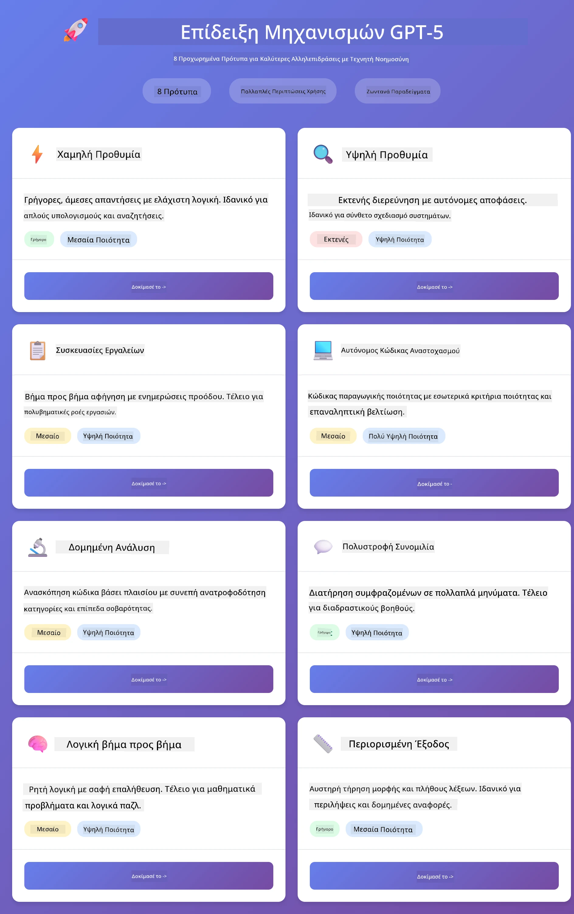

*Η κύρια κονσόλα που δείχνει και τα 8 πρότυπα μηχανικής προτροπών με τα χαρακτηριστικά και τις περιπτώσεις χρήσης τους*

## Εξερεύνηση των Προτύπων

Η διαδικτυακή διεπαφή σας επιτρέπει να πειραματιστείτε με διαφορετικές στρατηγικές προτροπών. Κάθε πρότυπο λύνει διαφορετικά προβλήματα - δοκιμάστε τα για να δείτε πότε λάμπει κάθε προσέγγιση.

### Χαμηλός vs Υψηλός Ζήλος

Κάντε μια απλή ερώτηση όπως "Ποιο είναι το 15% του 200;" χρησιμοποιώντας Χαμηλό Ζήλο. Θα λάβετε άμεση, απευθείας απάντηση. Τώρα ρωτήστε κάτι σύνθετο όπως "Σχεδίασε μια στρατηγική caching για ένα API με υψηλή κίνηση" χρησιμοποιώντας Υψηλό Ζήλο. Παρακολουθήστε πώς το μοντέλο επιβραδύνει και παρέχει λεπτομερή λογισμό. Ίδιο μοντέλο, ίδια δομή ερώτησης - αλλά η προτροπή του λέει πόσο να σκεφτεί.

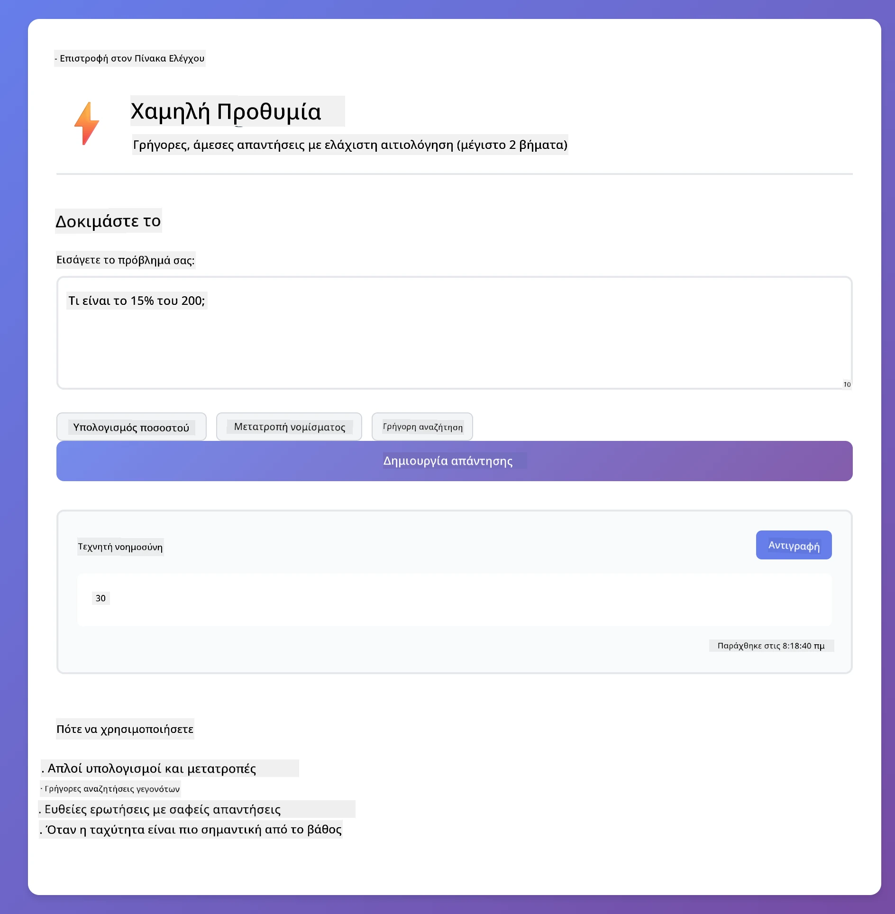
*Γρήγορος υπολογισμός με ελάχιστη λογική*

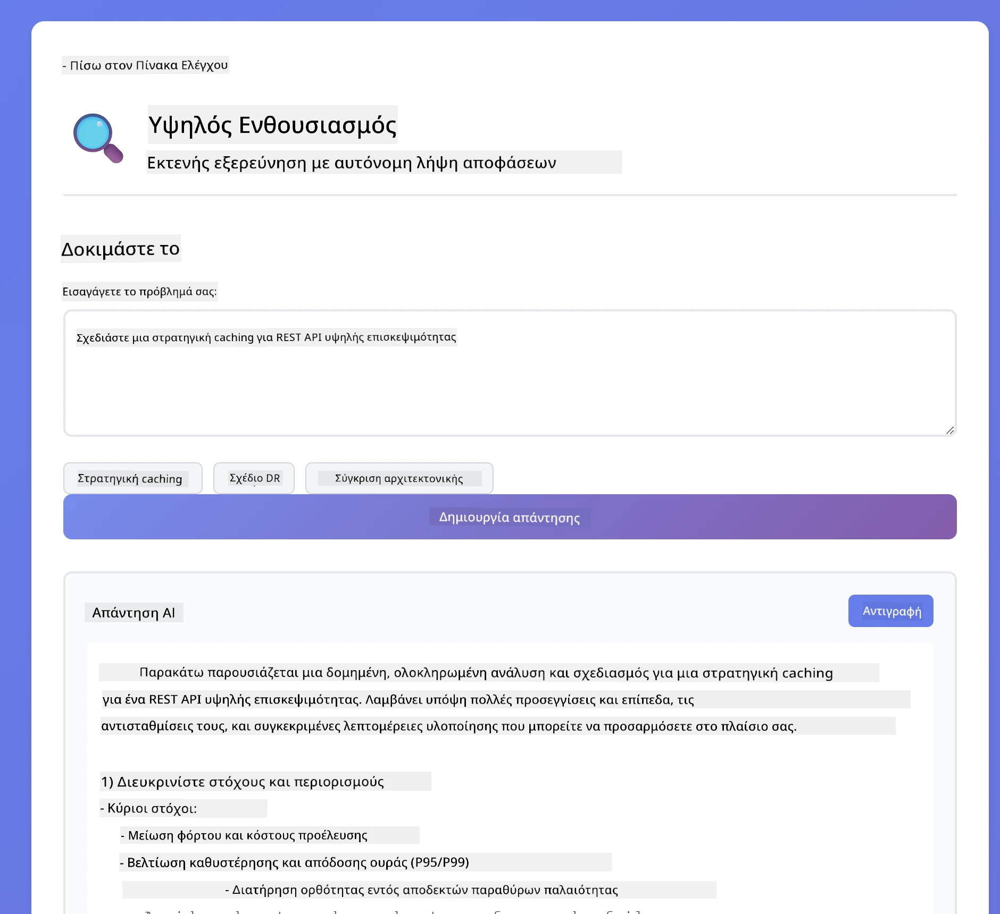

*Ολοκληρωμένη στρατηγική προσωρινής αποθήκευσης (2.8MB)*

### Εκτέλεση Εργασίας (Εισαγωγές Εργαλείων)

Οι πολυβηματικές ροές εργασίας ωφελούνται από τον προγραμματισμό εκ των προτέρων και την αφήγηση της προόδου. Το μοντέλο περιγράφει τι θα κάνει, αφηγείται κάθε βήμα και στη συνέχεια συνοψίζει τα αποτελέσματα.

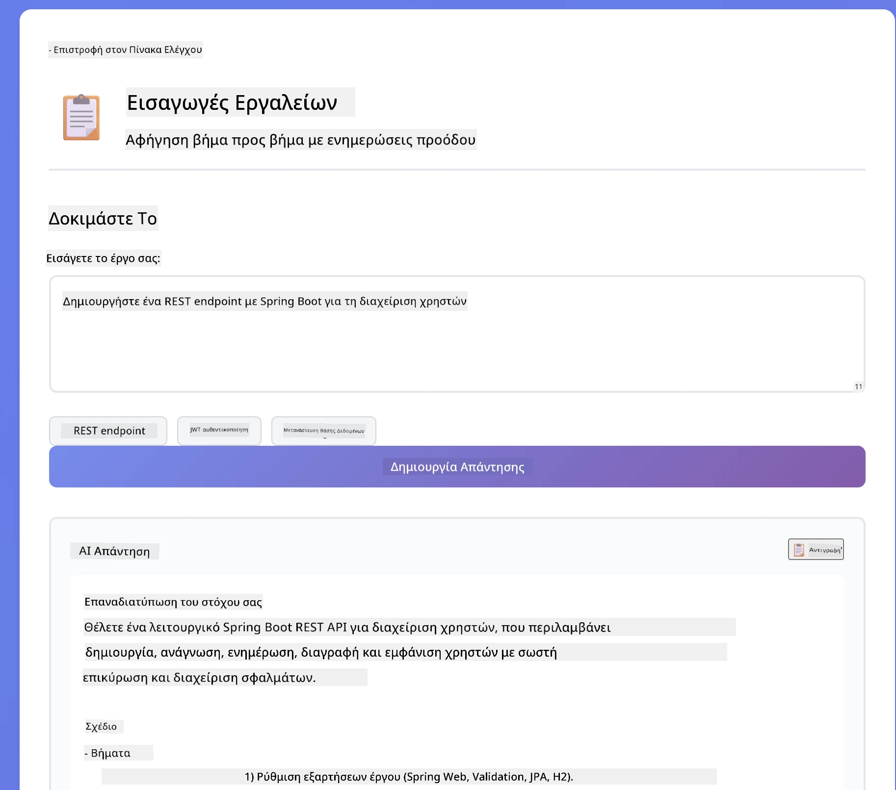

*Δημιουργία REST endpoint με αφήγηση βήμα προς βήμα (3.9MB)*

### Αυτο-ανακλαστικός Κώδικας

Δοκιμάστε "Δημιουργία υπηρεσίας επικύρωσης email". Αντί να παράγει απλώς κώδικα και να σταματά, το μοντέλο παράγει, αξιολογεί με βάση κριτήρια ποιότητας, εντοπίζει αδυναμίες και βελτιώνει. Θα δείτε να επαναλαμβάνει μέχρι ο κώδικας να πληροί τα πρότυπα παραγωγής.

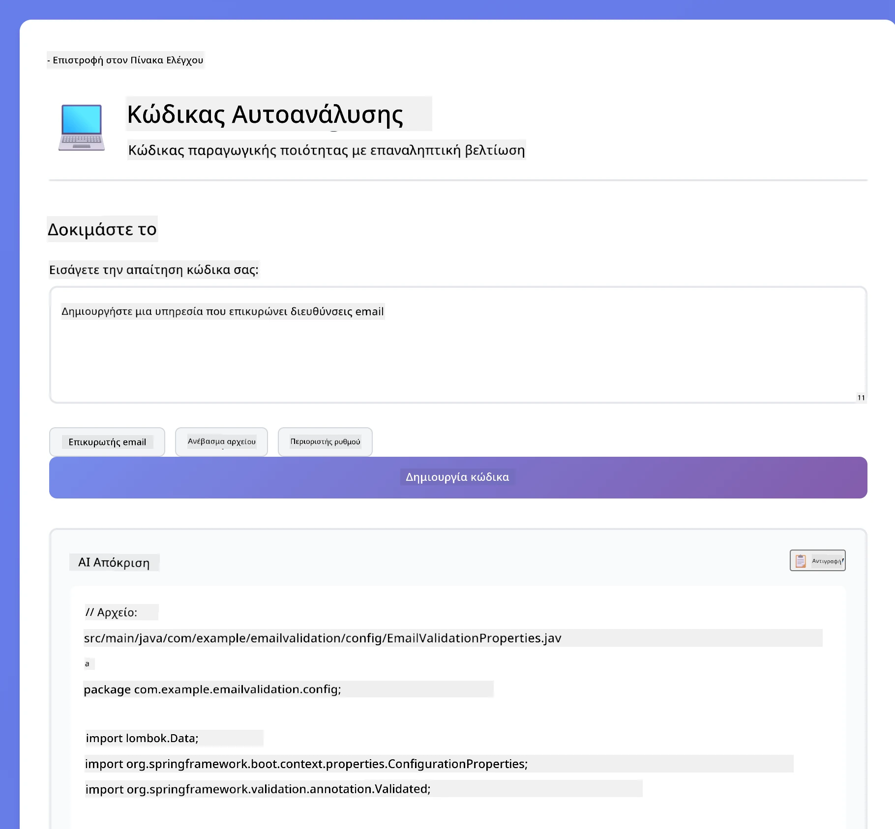

*Πλήρης υπηρεσία επικύρωσης email (5.2MB)*

### Δομημένη Ανάλυση

Οι ανασκοπήσεις κώδικα χρειάζονται συνεπή πλαίσια αξιολόγησης. Το μοντέλο αναλύει τον κώδικα χρησιμοποιώντας σταθερές κατηγορίες (ορθότητα, πρακτικές, απόδοση, ασφάλεια) με επίπεδα σοβαρότητας.

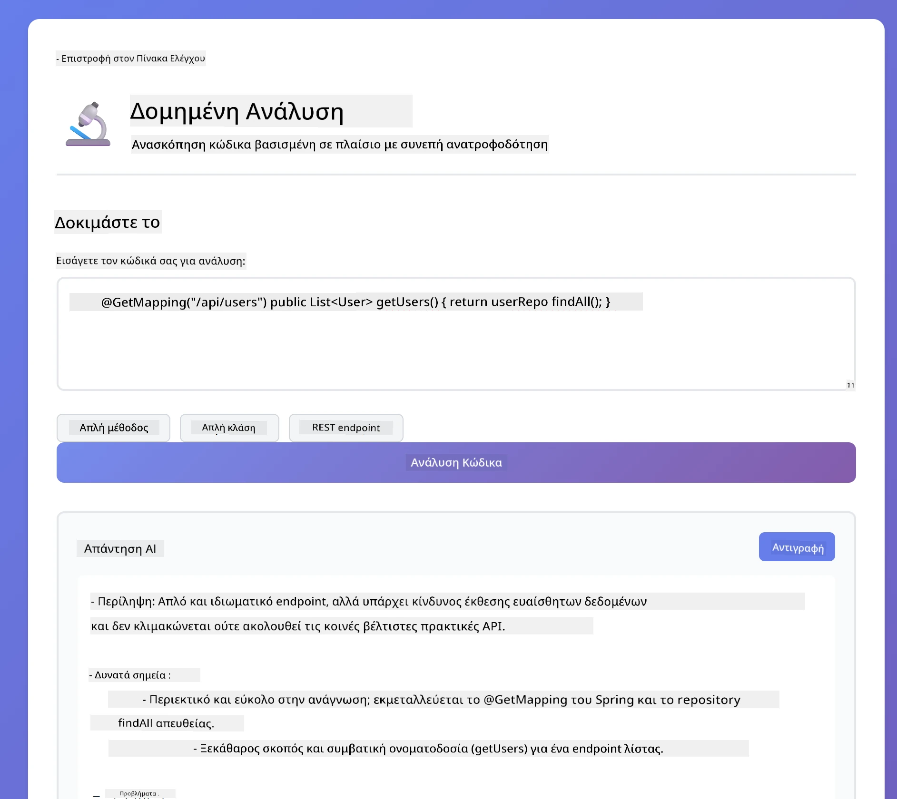

*Ανασκόπηση κώδικα βάσει πλαισίου*

### Συνομιλία Πολλαπλών Γύρων

Ρωτήστε "Τι είναι το Spring Boot;" και αμέσως μετά "Δείξε μου ένα παράδειγμα". Το μοντέλο θυμάται την πρώτη σας ερώτηση και σας δίνει συγκεκριμένα ένα παράδειγμα Spring Boot. Χωρίς μνήμη, η δεύτερη ερώτηση θα ήταν πολύ αόριστη.

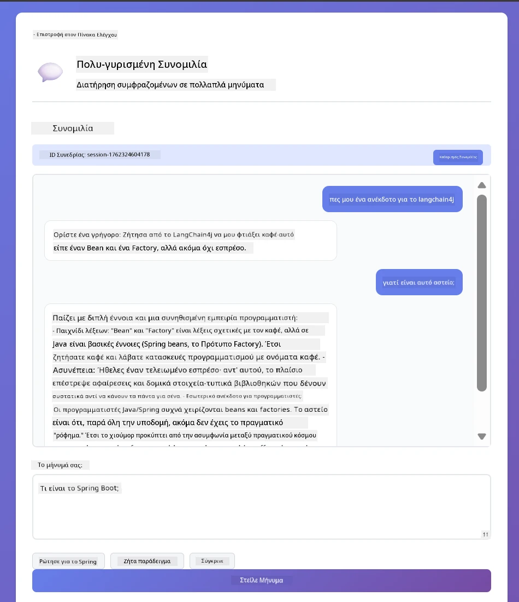

*Διατήρηση συμφραζομένων μεταξύ ερωτήσεων*

### Λογική Βήμα προς Βήμα

Επιλέξτε ένα μαθηματικό πρόβλημα και δοκιμάστε το με Λογική Βήμα προς Βήμα και Χαμηλό Ενθουσιασμό. Ο χαμηλός ενθουσιασμός απλώς σας δίνει την απάντηση - γρήγορα αλλά αδιαφανώς. Η λογική βήμα προς βήμα σας δείχνει κάθε υπολογισμό και απόφαση.

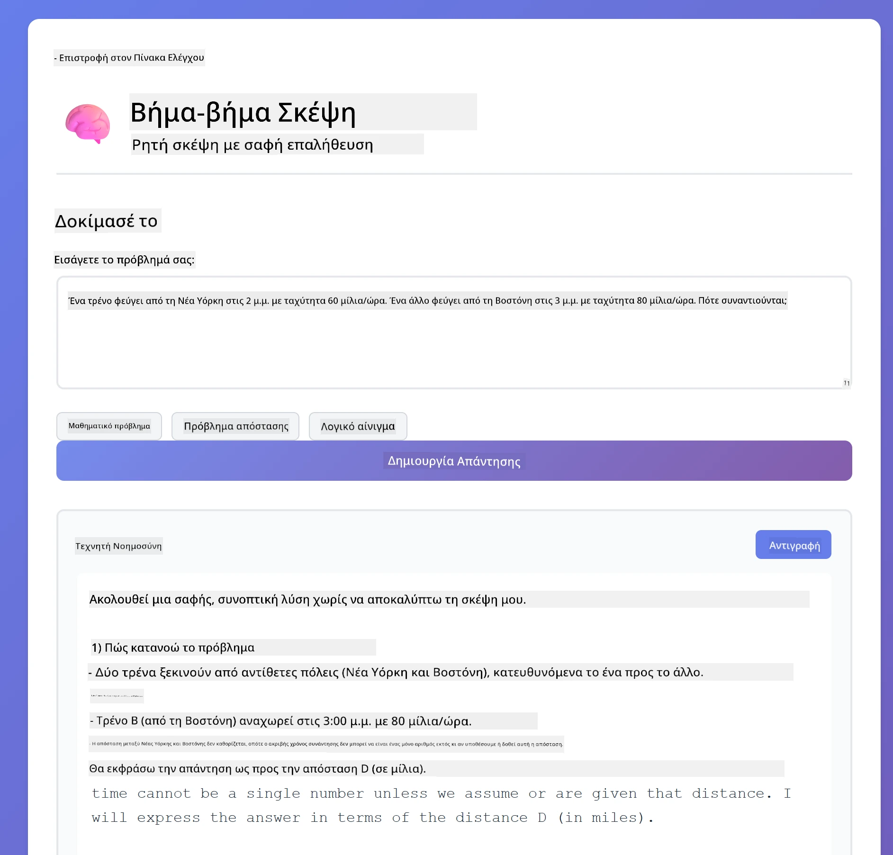

*Μαθηματικό πρόβλημα με ρητά βήματα*

### Περιορισμένη Έξοδος

Όταν χρειάζεστε συγκεκριμένες μορφές ή αριθμούς λέξεων, αυτό το μοτίβο επιβάλλει αυστηρή τήρηση. Δοκιμάστε να δημιουργήσετε μια περίληψη με ακριβώς 100 λέξεις σε μορφή κουκκίδων.

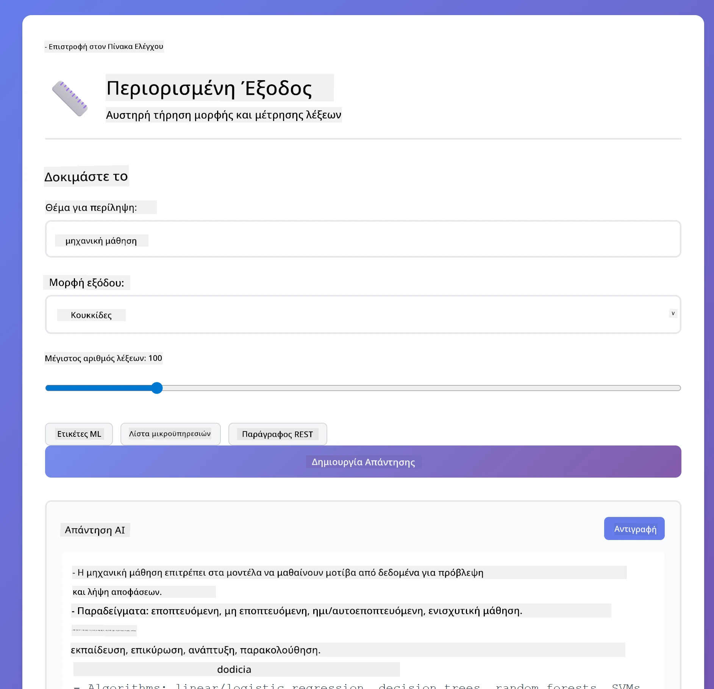

*Περίληψη μηχανικής μάθησης με έλεγχο μορφής*

## Τι Μαθαίνετε Πραγματικά

**Η Προσπάθεια Λογικής Αλλάζει Τα Πάντα**

Το GPT-5 σας επιτρέπει να ελέγχετε την υπολογιστική προσπάθεια μέσω των προτροπών σας. Η χαμηλή προσπάθεια σημαίνει γρήγορες απαντήσεις με ελάχιστη εξερεύνηση. Η υψηλή προσπάθεια σημαίνει ότι το μοντέλο αφιερώνει χρόνο για βαθιά σκέψη. Μαθαίνετε να ταιριάζετε την προσπάθεια με την πολυπλοκότητα της εργασίας - μην σπαταλάτε χρόνο σε απλές ερωτήσεις, αλλά μην βιάζεστε σε σύνθετες αποφάσεις.

**Η Δομή Καθοδηγεί τη Συμπεριφορά**

Παρατηρήστε τις ετικέτες XML στις προτροπές; Δεν είναι διακοσμητικές. Τα μοντέλα ακολουθούν δομημένες οδηγίες πιο αξιόπιστα από ελεύθερο κείμενο. Όταν χρειάζεστε πολυβηματικές διαδικασίες ή σύνθετη λογική, η δομή βοηθά το μοντέλο να παρακολουθεί πού βρίσκεται και τι ακολουθεί.

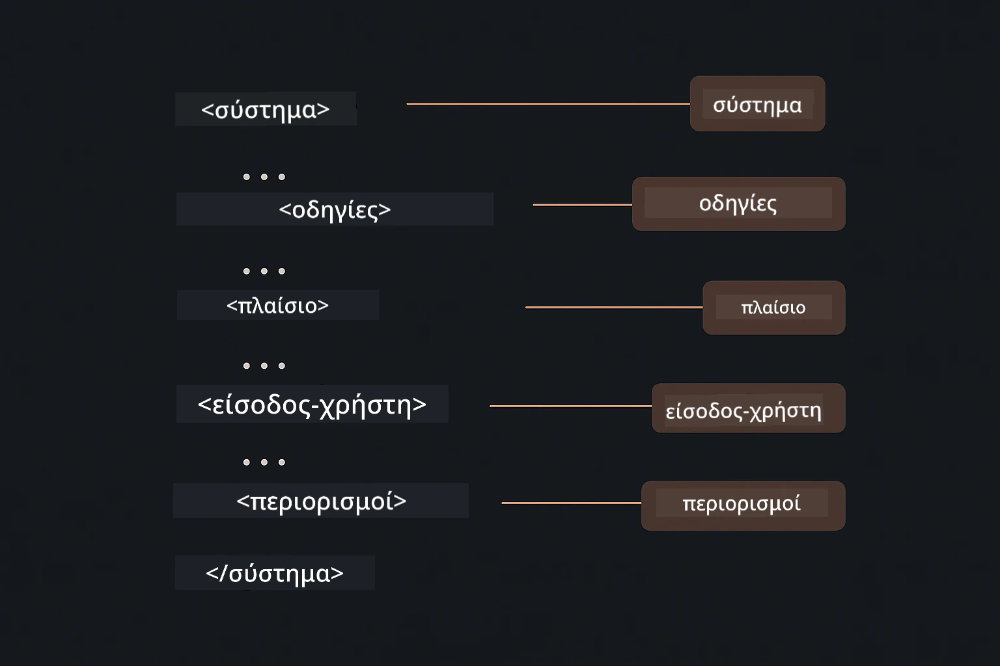

*Ανατομία μιας καλά δομημένης προτροπής με σαφείς ενότητες και οργάνωση τύπου XML*

**Ποιότητα Μέσω Αυτο-Αξιολόγησης**

Τα μοτίβα αυτο-ανακλαστικού κώδικα λειτουργούν κάνοντας τα κριτήρια ποιότητας ρητά. Αντί να ελπίζετε ότι το μοντέλο "το κάνει σωστά", του λέτε ακριβώς τι σημαίνει "σωστά": σωστή λογική, διαχείριση σφαλμάτων, απόδοση, ασφάλεια. Το μοντέλο μπορεί τότε να αξιολογήσει τη δική του έξοδο και να βελτιωθεί. Αυτό μετατρέπει τη δημιουργία κώδικα από λοταρία σε διαδικασία.

**Το Πλαίσιο Είναι Πεπερασμένο**

Οι συνομιλίες πολλαπλών γύρων λειτουργούν συμπεριλαμβάνοντας το ιστορικό μηνυμάτων σε κάθε αίτημα. Αλλά υπάρχει όριο - κάθε μοντέλο έχει μέγιστο αριθμό tokens. Καθώς οι συνομιλίες μεγαλώνουν, θα χρειαστείτε στρατηγικές για να κρατάτε το σχετικό πλαίσιο χωρίς να φτάνετε στο όριο. Αυτό το μάθημα σας δείχνει πώς λειτουργεί η μνήμη· αργότερα θα μάθετε πότε να συνοψίζετε, πότε να ξεχνάτε και πότε να ανακτάτε.

## Επόμενα Βήματα

**Επόμενο Μάθημα:** [03-rag - RAG (Αναζήτηση-Ενισχυμένη Γενιά)](../03-rag/README.md)

---

**Πλοήγηση:** [← Προηγούμενο: Μάθημα 01 - Εισαγωγή](../01-introduction/README.md) | [Πίσω στην Αρχική](../README.md) | [Επόμενο: Μάθημα 03 - RAG →](../03-rag/README.md)

---

<!-- CO-OP TRANSLATOR DISCLAIMER START -->
**Αποποίηση ευθυνών**:  
Αυτό το έγγραφο έχει μεταφραστεί χρησιμοποιώντας την υπηρεσία αυτόματης μετάφρασης AI [Co-op Translator](https://github.com/Azure/co-op-translator). Παρόλο που επιδιώκουμε την ακρίβεια, παρακαλούμε να λάβετε υπόψη ότι οι αυτόματες μεταφράσεις ενδέχεται να περιέχουν λάθη ή ανακρίβειες. Το πρωτότυπο έγγραφο στη μητρική του γλώσσα πρέπει να θεωρείται η αυθεντική πηγή. Για κρίσιμες πληροφορίες, συνιστάται επαγγελματική ανθρώπινη μετάφραση. Δεν φέρουμε ευθύνη για τυχόν παρεξηγήσεις ή λανθασμένες ερμηνείες που προκύπτουν από τη χρήση αυτής της μετάφρασης.
<!-- CO-OP TRANSLATOR DISCLAIMER END -->