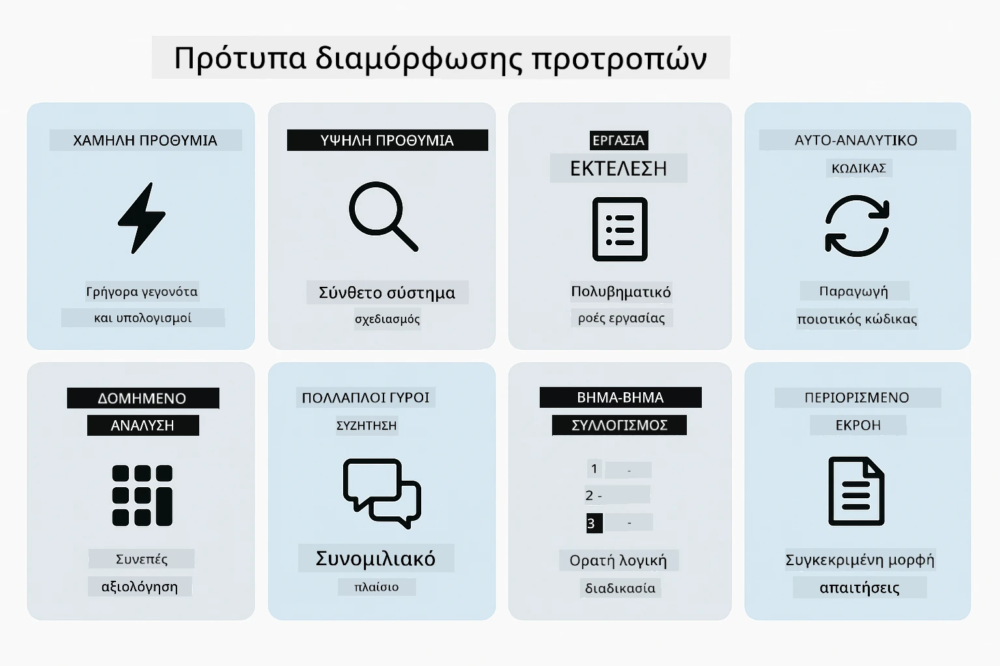
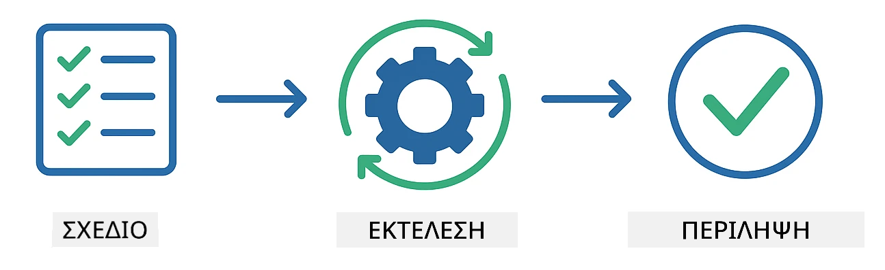
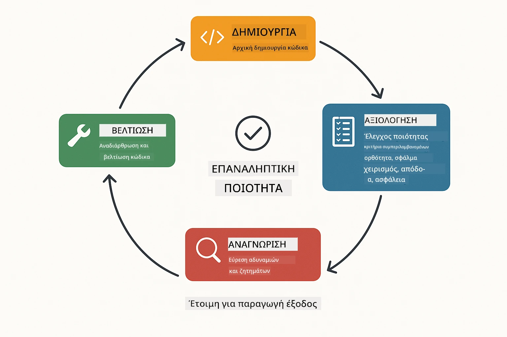
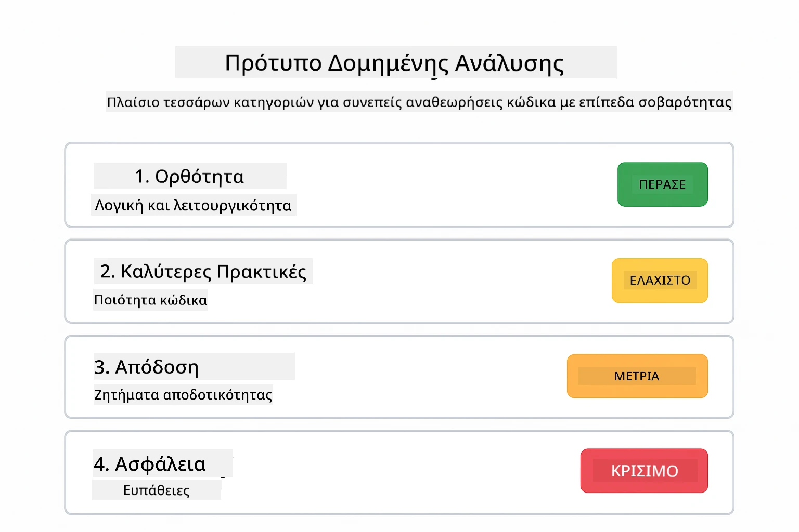
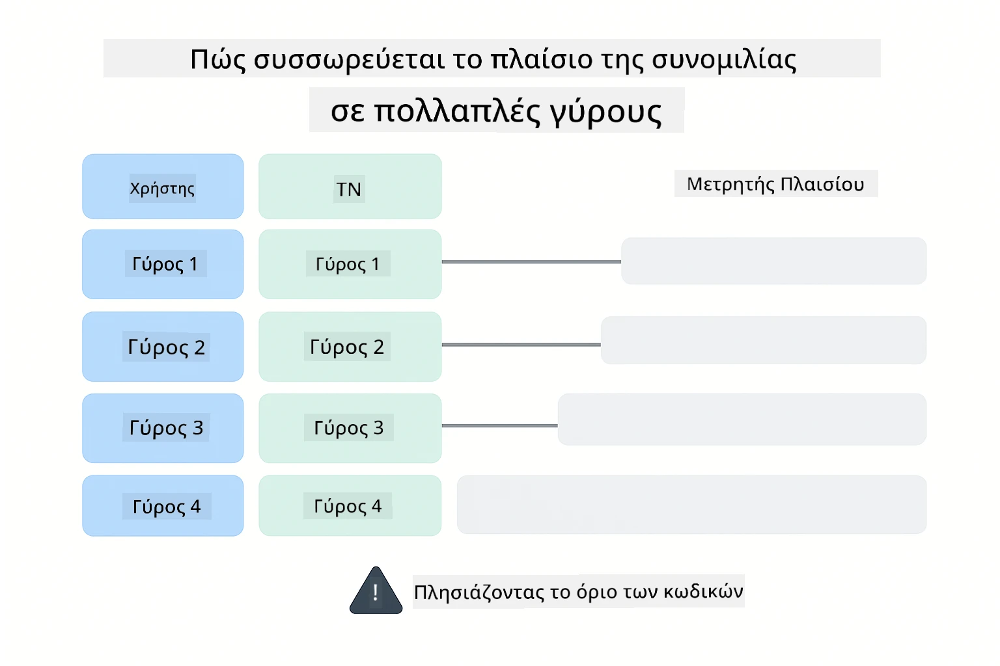
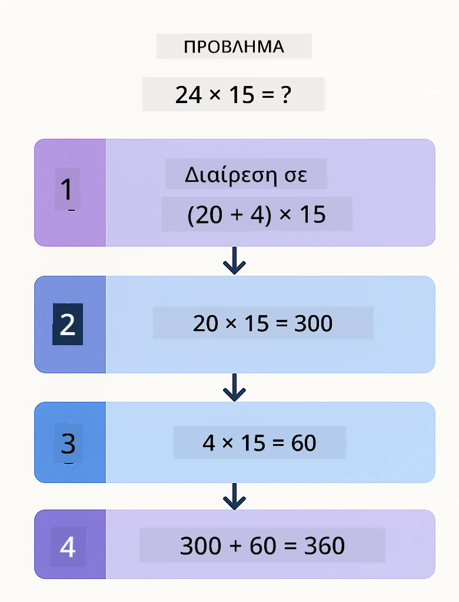
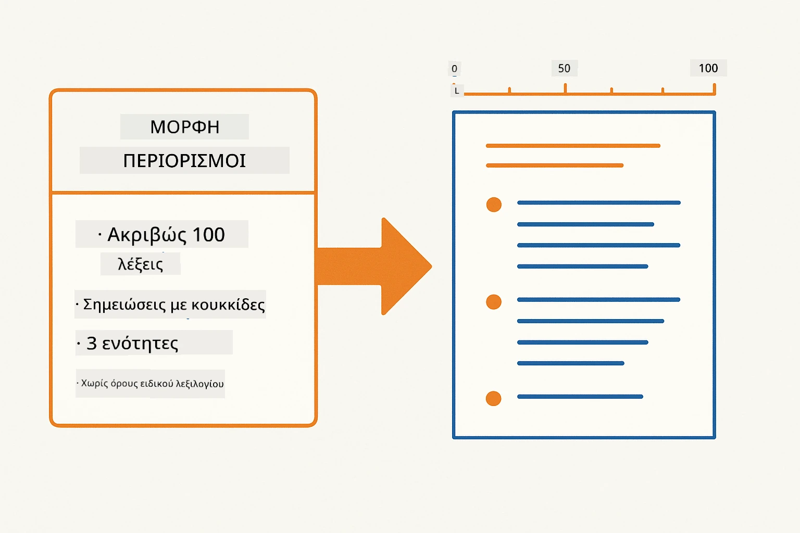
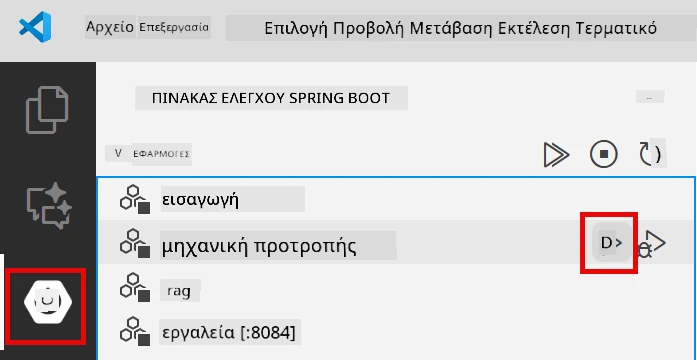
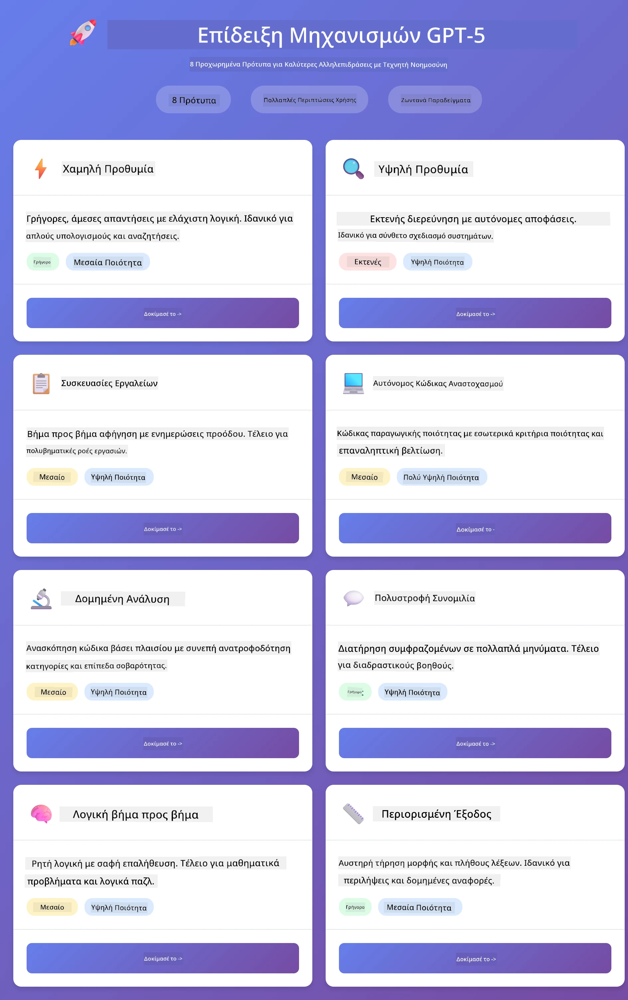
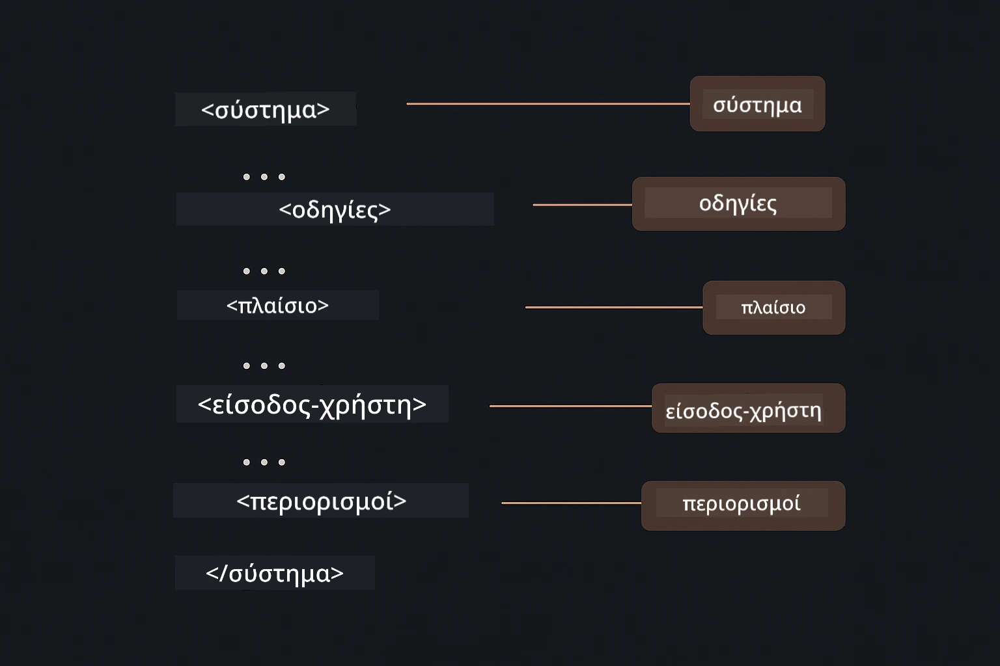

# Ενότητα 02: Μηχανική Προτροπής με GPT-5.2

## Περιεχόμενα

- [Οδηγός Βίντεο](#οδηγός-βίντεο)
- [Τι Θα Μάθετε](#τι-θα-μάθετε)
- [Προαπαιτούμενα](#προαπαιτούμενα)
- [Κατανόηση της Μηχανικής Προτροπής](#κατανόηση-της-μηχανικής-προτροπής)
- [Βασικά της Μηχανικής Προτροπής](#βασικά-της-μηχανικής-προτροπής)
  - [Μηδενική-Πρότυπη Προτροπή](#μηδενική-πρότυπη-προτροπή)
  - [Μερική-Πρότυπη Προτροπή](#μερική-πρότυπη-προτροπή)
  - [Αλυσιδωτή Σκέψη](#αλυσιδωτή-σκέψη)
  - [Προτροπή με Βάση Ρόλο](#προτροπή-με-βάση-ρόλο)
  - [Πρότυπα Προτροπών](#πρότυπα-προτροπών)
- [Προηγμένα Πρότυπα](#προηγμένα-πρότυπα)
- [Εκτέλεση της Εφαρμογής](#εκτέλεση-της-εφαρμογής)
- [Στιγμιότυπα Εφαρμογής](#στιγμιότυπα-εφαρμογής)
- [Εξερεύνηση των Προτύπων](#εξερεύνηση-των-μοτίβων)
  - [Χαμηλός έναντι Υψηλού Ζήλου](#χαμηλή-vs-υψηλή-προθυμία)
  - [Εκτέλεση Εργασίας (Προλόγοι Εργαλείων)](#εκτέλεση-εργασιών-εισαγωγικά-εργαλείων)
  - [Αυτο-Ανακλαστικός Κώδικας](#αυτοαξιολογούμενος-κώδικας)
  - [Δομημένη Ανάλυση](#δομημένη-ανάλυση)
  - [Πολλαπλός Γύρος Συνομιλίας](#πολυγλωσσική-συζήτηση)
  - [Βήμα-Βήμα Συλλογισμός](#συλλογιστική-βήμα-βήμα)
  - [Περιορισμένη Έξοδος](#περιορισμένη-έξοδος)
- [Τι Μαθαίνετε Πραγματικά](#τι-μάθετε-πραγματικά)
- [Επόμενα Βήματα](#επόμενα-βήματα)

## Οδηγός Βίντεο

Παρακολουθήστε αυτήν την ζωντανή συνεδρία που εξηγεί πώς να ξεκινήσετε με αυτήν την ενότητα:

<a href="https://www.youtube.com/live/PJ6aBaE6bog?si=LDshyBrTRodP-wke"></a>

## Τι Θα Μάθετε

Το παρακάτω διάγραμμα παρέχει μια επισκόπηση των βασικών θεμάτων και δεξιοτήτων που θα αναπτύξετε σε αυτήν την ενότητα — από τεχνικές βελτίωσης προτροπών έως τη βήμα-βήμα ροή εργασίας που θα ακολουθήσετε.


Στην προηγούμενη ενότητα είδατε πώς η μνήμη επιτρέπει τη συνομιλιακή ΤΝ με το Azure OpenAI. Τώρα θα επικεντρωθούμε στο πώς κάνετε ερωτήσεις — τις ίδιες τις προτροπές — χρησιμοποιώντας το GPT-5.2 του Azure OpenAI. Ο τρόπος που δομείτε τις προτροπές σας επηρεάζει δραματικά την ποιότητα των απαντήσεων που λαμβάνετε. Ξεκινάμε με μια επισκόπηση των βασικών τεχνικών προτροπών και στη συνέχεια προχωράμε σε οκτώ προχωρημένα πρότυπα που αξιοποιούν πλήρως τις δυνατότητες του GPT-5.2.

Θα χρησιμοποιήσουμε το GPT-5.2 γιατί εισάγει έλεγχο συλλογισμού - μπορείτε να πείτε στο μοντέλο πόση σκέψη να κάνει πριν απαντήσει. Αυτό καθιστά τις διάφορες στρατηγικές προτροπής πιο εμφανείς και σας βοηθά να κατανοήσετε πότε να χρησιμοποιείτε κάθε προσέγγιση.

## Προαπαιτούμενα

- Ολοκληρωμένη Ενότητα 01 (αναπτυγμένοι πόροι Azure OpenAI)
- Αρχείο `.env` στον ριζικό κατάλογο με τα διαπιστευτήρια Azure (δημιουργημένο με `azd up` στην Ενότητα 01)

> **Σημείωση:** Αν δεν έχετε ολοκληρώσει την Ενότητα 01, ακολουθήστε τις οδηγίες ανάπτυξης εκεί πρώτα.

## Κατανόηση της Μηχανικής Προτροπής

Στον πυρήνα της, η μηχανική προτροπής είναι η διαφορά μεταξύ ασαφών και ακριβών οδηγιών, όπως δείχνει η παρακάτω σύγκριση.


Η μηχανική προτροπής αφορά το σχεδιασμό του κειμένου εισόδου που σας παρέχει σταθερά τα αποτελέσματα που χρειάζεστε. Δεν πρόκειται απλά για τη διατύπωση ερωτήσεων - πρόκειται για τη δομή αιτημάτων ώστε το μοντέλο να κατανοεί ακριβώς τι θέλετε και πώς να το παραδώσει.

Σκεφτείτε το σαν να δίνετε οδηγίες σε έναν συνάδελφο. «Διόρθωσε το σφάλμα» είναι ασαφές. «Διόρθωσε την εξαίρεση null pointer στο UserService.java γραμμή 45 προσθέτοντας έναν έλεγχο null» είναι συγκεκριμένο. Τα μοντέλα γλώσσας λειτουργούν με τον ίδιο τρόπο - η ακρίβεια και η δομή έχουν σημασία.

Το παρακάτω διάγραμμα δείχνει πώς το LangChain4j εντάσσεται σε αυτήν την εικόνα — συνδέοντας τα πρότυπα προτροπών σας με το μοντέλο μέσω των δομικών στοιχείων SystemMessage και UserMessage.


Το LangChain4j παρέχει την υποδομή — συνδέσεις μοντέλου, μνήμη και τύπους μηνυμάτων — ενώ τα πρότυπα προτροπών είναι απλώς προσεκτικά δομημένα κείμενα που στέλνετε μέσα από αυτή την υποδομή. Τα βασικά δομικά στοιχεία είναι το `SystemMessage` (που ορίζει τη συμπεριφορά και το ρόλο της ΤΝ) και το `UserMessage` (που μεταφέρει το πραγματικό σας αίτημα).

## Βασικά της Μηχανικής Προτροπής

Οι πέντε βασικές τεχνικές που εμφανίζονται παρακάτω αποτελούν τη βάση της αποτελεσματικής μηχανικής προτροπής. Η κάθε μία αντιμετωπίζει μια διαφορετική πτυχή της επικοινωνίας σας με τα μοντέλα γλώσσας.


Πριν εμβαθύνετε στα προχωρημένα πρότυπα αυτής της ενότητας, ας δούμε πέντε θεμελιώδεις τεχνικές προτροπής. Αυτές είναι τα δομικά στοιχεία που κάθε μηχανικός προτροπών πρέπει να γνωρίζει.

### Μηδενική-Πρότυπη Προτροπή

Η απλούστερη προσέγγιση: δώστε στο μοντέλο μια άμεση οδηγία χωρίς παραδείγματα. Το μοντέλο βασίζεται αποκλειστικά στην εκπαίδευσή του για να κατανοήσει και να εκτελέσει την εργασία. Λειτουργεί καλά για απλά αιτήματα όπου η αναμενόμενη συμπεριφορά είναι προφανής.


*Άμεση οδηγία χωρίς παραδείγματα — το μοντέλο συμπεραίνει την εργασία μόνο από την οδηγία*

```java
String prompt = "Classify this sentiment: 'I absolutely loved the movie!'";
String response = model.chat(prompt);
// Απόκριση: "Θετικό"
```

**Πότε να χρησιμοποιείται:** Απλές ταξινομήσεις, άμεσες ερωτήσεις, μεταφράσεις ή οποιαδήποτε εργασία που το μοντέλο μπορεί να χειριστεί χωρίς πρόσθετη καθοδήγηση.

### Μερική-Πρότυπη Προτροπή

Παρέχετε παραδείγματα που δείχνουν το πρότυπο που θέλετε να ακολουθήσει το μοντέλο. Το μοντέλο μαθαίνει το αναμενόμενο μορφότυπο εισόδου-εξόδου από τα παραδείγματα και το εφαρμόζει σε νέες εισόδους. Αυτό βελτιώνει δραματικά τη συνέπεια σε εργασίες όπου η επιθυμητή μορφή ή συμπεριφορά δεν είναι προφανής.


*Μάθηση από παραδείγματα — το μοντέλο αναγνωρίζει το πρότυπο και το εφαρμόζει σε νέες εισόδους*

```java
String prompt = """
    Classify the sentiment as positive, negative, or neutral.
    
    Examples:
    Text: "This product exceeded my expectations!" → Positive
    Text: "It's okay, nothing special." → Neutral
    Text: "Waste of money, very disappointed." → Negative
    
    Now classify this:
    Text: "Best purchase I've made all year!"
    """;
String response = model.chat(prompt);
```

**Πότε να χρησιμοποιείται:** Προσαρμοσμένες ταξινομήσεις, συνεπής μορφοποίηση, εργασίες ειδικού τομέα ή όταν τα αποτελέσματα μηδενικής-πρότυπης προτροπής είναι ασυνεπή.

### Αλυσιδωτή Σκέψη

Ζητήστε από το μοντέλο να δείξει τη λογική του βήμα-βήμα. Αντί να πηδήξει απευθείας σε μια απάντηση, το μοντέλο αναλύει το πρόβλημα και προχωρά σε κάθε μέρος ρητά. Αυτό βελτιώνει την ακρίβεια σε μαθηματικά, λογική και πολύ-βηματικές εργασίες συλλογισμού.


*Βήμα-βήμα συλλογισμός — διάσπαση σύνθετων προβλημάτων σε ρητές λογικές ενότητες*

```java
String prompt = """
    Problem: A store has 15 apples. They sell 8 apples and then 
    receive a shipment of 12 more apples. How many apples do they have now?
    
    Let's solve this step-by-step:
    """;
String response = model.chat(prompt);
// Το μοντέλο δείχνει: 15 - 8 = 7, στη συνέχεια 7 + 12 = 19 μήλα
```

**Πότε να χρησιμοποιείται:** Μαθηματικά προβλήματα, λογικά παζλ, αποσφαλμάτωση ή οποιαδήποτε εργασία όπου η εμφάνιση της διαδικασίας συλλογισμού βελτιώνει την ακρίβεια και την αξιοπιστία.

### Προτροπή με Βάση Ρόλο

Ορίστε μια περσόνα ή ρόλο για την ΤΝ πριν κάνετε την ερώτησή σας. Αυτό παρέχει πλαίσιο που διαμορφώνει τον τόνο, το βάθος και την εστίαση της απάντησης. Ένας «αρχιτέκτονας λογισμικού» δίνει διαφορετικές συμβουλές από έναν «νεότερο προγραμματιστή» ή έναν «ελεγκτή ασφαλείας».


*Ορισμός πλαισίου και περσόνας — η ίδια ερώτηση λαμβάνει διαφορετική απάντηση ανάλογα με τον ορισμένο ρόλο*

```java
String prompt = """
    You are an experienced software architect reviewing code.
    Provide a brief code review for this function:
    
    def calculate_total(items):
        total = 0
        for item in items:
            total = total + item['price']
        return total
    """;
String response = model.chat(prompt);
```

**Πότε να χρησιμοποιείται:** Αναθεώρηση κώδικα, διδασκαλία, ανάλυση ειδικού τομέα ή όταν χρειάζεστε απαντήσεις προσαρμοσμένες σε συγκεκριμένο επίπεδο τεχνογνωσίας ή προοπτική.

### Πρότυπα Προτροπών

Δημιουργήστε επαναχρησιμοποιήσιμες προτροπές με μεταβλητές θέσεις. Αντί να γράφετε μια νέα προτροπή κάθε φορά, ορίστε ένα πρότυπο μία φορά και συμπληρώστε διαφορετικές τιμές. Η κλάση `PromptTemplate` του LangChain4j το καθιστά εύκολο με τη σύνταξη `{{variable}}`.


*Επαναχρησιμοποιήσιμες προτροπές με μεταβλητές — ένα πρότυπο, πολλές χρήσεις*

```java
PromptTemplate template = PromptTemplate.from(
    "What's the best time to visit {{destination}} for {{activity}}?"
);

Prompt prompt = template.apply(Map.of(
    "destination", "Paris",
    "activity", "sightseeing"
));

String response = model.chat(prompt.text());
```

**Πότε να χρησιμοποιείται:** Επανάληψη ερωτημάτων με διαφορετικές εισόδους, επεξεργασία παρτίδων, κατασκευή επαναχρησιμοποιήσιμων ροών εργασίας ΤΝ ή οποιοδήποτε σενάριο όπου η δομή της προτροπής παραμένει ίδια αλλά τα δεδομένα αλλάζουν.

---

Αυτά τα πέντε βασικά στοιχεία σας παρέχουν ένα στιβαρό σύνολο εργαλείων για τις περισσότερες εργασίες προτροπής. Το υπόλοιπο της ενότητας βασίζεται σε αυτά με **οκτώ προχωρημένα πρότυπα** που αξιοποιούν τον έλεγχο συλλογισμού, την αυτο-αξιολόγηση και τις δομημένες δυνατότητες εξόδου του GPT-5.2.

## Προηγμένα Πρότυπα

Με τα βασικά καλυμμένα, ας περάσουμε στα οκτώ προχωρημένα πρότυπα που καθιστούν αυτήν την ενότητα μοναδική. Όχι όλα τα προβλήματα χρειάζονται την ίδια προσέγγιση. Κάποιες ερωτήσεις θέλουν γρήγορες απαντήσεις, άλλες βαθιά σκέψη. Κάποιες απαιτούν ορατό συλλογισμό, άλλες μόνο αποτελέσματα. Κάθε πρότυπο παρακάτω είναι βελτιστοποιημένο για διαφορετικό σενάριο — και ο έλεγχος συλλογισμού του GPT-5.2 καθιστά τις διαφορές ακόμα πιο έντονες.



*Επισκόπηση των οκτώ προτύπων μηχανικής προτροπής και των περιπτώσεων χρήσης τους*

Το GPT-5.2 προσθέτει μια επιπλέον διάσταση σε αυτά τα πρότυπα: *έλεγχο συλλογισμού*. Ο παρακάτω ρυθμιστής δείχνει πώς μπορείτε να ρυθμίσετε την προσπάθεια σκέψης του μοντέλου — από γρήγορες, άμεσες απαντήσεις έως βαθιά, ολοκληρωμένη ανάλυση.


*Ο έλεγχος συλλογισμού του GPT-5.2 σας επιτρέπει να καθορίσετε πόση σκέψη πρέπει να κάνει το μοντέλο — από γρήγορες απαντήσεις έως βαθιά εξερεύνηση*

**Χαμηλός Ζήλος (Γρήγορο & Εστιασμένο)** - Για απλές ερωτήσεις όπου θέλετε γρήγορες, άμεσες απαντήσεις. Το μοντέλο κάνει ελάχιστο συλλογισμό - το πολύ 2 βήματα. Χρησιμοποιήστε το για υπολογισμούς, αναζητήσεις ή απλές ερωτήσεις.

```java
String prompt = """
    <context_gathering>
    - Search depth: very low
    - Bias strongly towards providing a correct answer as quickly as possible
    - Usually, this means an absolute maximum of 2 reasoning steps
    - If you think you need more time, state what you know and what's uncertain
    </context_gathering>
    
    Problem: What is 15% of 200?
    
    Provide your answer:
    """;

String response = chatModel.chat(prompt);
```

> 💡 **Εξερευνήστε με το GitHub Copilot:** Ανοίξτε το [`Gpt5PromptService.java`](../../../02-prompt-engineering/src/main/java/com/example/langchain4j/prompts/service/Gpt5PromptService.java) και ρωτήστε:
> - "Ποια είναι η διαφορά ανάμεσα σε πρότυπα χαμηλού και υψηλού ζήλου;"
> - "Πώς βοηθούν τα XML tags στη δομή της απάντησης της ΤΝ;"
> - "Πότε να χρησιμοποιώ πρότυπα αυτο-ανασκόπησης έναντι άμεσης οδηγίας;"

**Υψηλός Ζήλος (Βαθιά & Αναλυτικό)** - Για σύνθετα προβλήματα όπου θέλετε ολοκληρωμένη ανάλυση. Το μοντέλο εξερευνά διεξοδικά και δείχνει λεπτομερή συλλογισμό. Χρησιμοποιήστε το για σχεδιασμό συστήματος, αρχιτεκτονικές αποφάσεις ή πολύπλοκη έρευνα.

```java
String prompt = """
    Analyze this problem thoroughly and provide a comprehensive solution.
    Consider multiple approaches, trade-offs, and important details.
    Show your analysis and reasoning in your response.
    
    Problem: Design a caching strategy for a high-traffic REST API.
    """;

String response = chatModel.chat(prompt);
```

**Εκτέλεση Εργασίας (Πρόοδος Βήμα-Βήμα)** - Για ροές εργασίας με πολλά βήματα. Το μοντέλο παρέχει αρχικό σχεδιασμό, αφηγείται κάθε βήμα καθώς εργάζεται και στη συνέχεια δίνει περίληψη. Χρησιμοποιήστε το για μετακινήσεις, υλοποιήσεις ή οποιαδήποτε διαδικασία πολλαπλών βημάτων.

```java
String prompt = """
    <task_execution>
    1. First, briefly restate the user's goal in a friendly way
    
    2. Create a step-by-step plan:
       - List all steps needed
       - Identify potential challenges
       - Outline success criteria
    
    3. Execute each step:
       - Narrate what you're doing
       - Show progress clearly
       - Handle any issues that arise
    
    4. Summarize:
       - What was completed
       - Any important notes
       - Next steps if applicable
    </task_execution>
    
    <tool_preambles>
    - Always begin by rephrasing the user's goal clearly
    - Outline your plan before executing
    - Narrate each step as you go
    - Finish with a distinct summary
    </tool_preambles>
    
    Task: Create a REST endpoint for user registration
    
    Begin execution:
    """;

String response = chatModel.chat(prompt);
```

Η προτροπή αλυσιδωτής σκέψης ζητά ρητά από το μοντέλο να δείξει τη διαδικασία συλλογισμού του, βελτιώνοντας την ακρίβεια για σύνθετες εργασίες. Η διάσπαση βήμα-βήμα βοηθά ανθρώπους και ΤΝ να κατανοήσουν τη λογική.

> **🤖 Δοκιμάστε με συνομιλία [GitHub Copilot](https://github.com/features/copilot):** Ρωτήστε για αυτό το πρότυπο:
> - "Πώς θα προσαρμόσω το πρότυπο εκτέλεσης εργασίας για μακροχρόνιες λειτουργίες;"
> - "Ποιες είναι οι βέλτιστες πρακτικές για δομή προλόγων εργαλείων σε παραγωγικές εφαρμογές;"
> - "Πώς μπορώ να καταγράψω και να εμφανίσω ενδιάμεσα ενημερώσεις προόδου σε UI;"

Το παρακάτω διάγραμμα απεικονίζει αυτή τη ροή εργασίας Σχεδιασμός → Εκτέλεση → Περίληψη.



*Ροή εργασίας Σχεδιασμός → Εκτέλεση → Περίληψη για εργασίες πολλαπλών βημάτων*

**Αυτο-Ανακλαστικός Κώδικας** - Για παραγωγή κώδικα ποιότητας παραγωγής. Το μοντέλο παράγει κώδικα που ακολουθεί πρότυπα παραγωγής με σωστή διαχείριση σφαλμάτων. Χρησιμοποιήστε το όταν δημιουργείτε νέες λειτουργίες ή υπηρεσίες.

```java
String prompt = """
    Generate Java code with production-quality standards: Create an email validation service
    Keep it simple and include basic error handling.
    """;

String response = chatModel.chat(prompt);
```

Το παρακάτω διάγραμμα δείχνει αυτόν τον επαναληπτικό βρόχο βελτίωσης — παραγωγή, αξιολόγηση, εντοπισμός αδυναμιών και βελτίωση μέχρι ο κώδικας να ανταποκρίνεται στα πρότυπα παραγωγής.



*Επαναληπτικός βρόχος βελτίωσης - παραγωγή, αξιολόγηση, εντοπισμός θεμάτων, βελτίωση, επανάληψη*

**Δομημένη Ανάλυση** - Για συνεπή αξιολόγηση. Το μοντέλο αναθεωρεί κώδικα χρησιμοποιώντας ένα σταθερό πλαίσιο (σωστότητα, πρακτικές, απόδοση, ασφάλεια, διατηρησιμότητα). Χρησιμοποιήστε το για αναθεωρήσεις κώδικα ή αξιολογήσεις ποιότητας.

```java
String prompt = """
    <analysis_framework>
    You are an expert code reviewer. Analyze the code for:
    
    1. Correctness
       - Does it work as intended?
       - Are there logical errors?
    
    2. Best Practices
       - Follows language conventions?
       - Appropriate design patterns?
    
    3. Performance
       - Any inefficiencies?
       - Scalability concerns?
    
    4. Security
       - Potential vulnerabilities?
       - Input validation?
    
    5. Maintainability
       - Code clarity?
       - Documentation?
    
    <output_format>
    Provide your analysis in this structure:
    - Summary: One-sentence overall assessment
    - Strengths: 2-3 positive points
    - Issues: List any problems found with severity (High/Medium/Low)
    - Recommendations: Specific improvements
    </output_format>
    </analysis_framework>
    
    Code to analyze:
    ```
    public List getUsers() {
        return database.query("SELECT * FROM users");
    }
    ```
    Provide your structured analysis:
    """;

String response = chatModel.chat(prompt);
```

> **🤖 Δοκιμάστε με συνομιλία [GitHub Copilot](https://github.com/features/copilot):** Ρωτήστε για δομημένη ανάλυση:
> - "Πώς μπορώ να προσωποποιήσω το πλαίσιο ανάλυσης για διαφορετικούς τύπους αναθεωρήσεων κώδικα;"
> - "Ποιος είναι ο καλύτερος τρόπος για να αναλύσω και να ενεργήσω σε δομημένη έξοδο προγραμματιστικά;"
> - "Πώς εξασφαλίζω συνεπή επίπεδα σοβαρότητας σε διαφορετικές συνεδρίες αναθεώρησης;"

Το παρακάτω διάγραμμα δείχνει πώς αυτό το δομημένο πλαίσιο οργανώνει μια αναθεώρηση κώδικα σε συνεπείς κατηγορίες με επίπεδα σοβαρότητας.



*Πλαίσιο για συνεπείς αναθεωρήσεις κώδικα με επίπεδα σοβαρότητας*

**Πολλαπλός Γύρος Συνομιλίας** - Για συνομιλίες που χρειάζονται πλαίσιο. Το μοντέλο θυμάται προηγούμενα μηνύματα και χτίζει πάνω σε αυτά. Χρησιμοποιήστε το για διαδραστικές συνεδρίες βοήθειας ή σύνθετες ερωτήσεις-απαντήσεις.

```java
ChatMemory memory = MessageWindowChatMemory.withMaxMessages(10);

memory.add(UserMessage.from("What is Spring Boot?"));
AiMessage aiMessage1 = chatModel.chat(memory.messages()).aiMessage();
memory.add(aiMessage1);

memory.add(UserMessage.from("Show me an example"));
AiMessage aiMessage2 = chatModel.chat(memory.messages()).aiMessage();
memory.add(aiMessage2);
```

Το παρακάτω διάγραμμα απεικονίζει πώς συσσωρεύεται το πλαίσιο συνομιλίας με κάθε γύρο και πώς σχετίζεται με το όριο token του μοντέλου.



*Πώς συσσωρεύεται το πλαίσιο συνομιλίας σε πολλούς γύρους μέχρι να φτάσει το όριο token*

**Βήμα-Βήμα Συλλογισμός** - Για προβλήματα που απαιτούν ορατή λογική. Το μοντέλο δείχνει ρητή λογική για κάθε βήμα. Χρησιμοποιήστε το για μαθηματικά προβλήματα, λογικά παζλ ή όταν χρειάζεστε να κατανοήσετε τη διαδικασία σκέψης.

```java
String prompt = """
    <instruction>Show your reasoning step-by-step</instruction>
    
    If a train travels 120 km in 2 hours, then stops for 30 minutes,
    then travels another 90 km in 1.5 hours, what is the average speed
    for the entire journey including the stop?
    """;

String response = chatModel.chat(prompt);
```

Το παρακάτω διάγραμμα απεικονίζει πώς το μοντέλο διασπά προβλήματα σε ρητά, αριθμημένα λογικά βήματα.


*Αποσύνθεση προβλημάτων σε ρητά λογικά βήματα*

**Περιορισμένη Έξοδος** - Για απαντήσεις με συγκεκριμένες απαιτήσεις μορφοποίησης. Το μοντέλο ακολουθεί αυστηρά τους κανόνες μορφής και μήκους. Χρησιμοποιήστε το για περιλήψεις ή όταν χρειάζεστε ακριβή δομή εξόδου.

```java
String prompt = """
    <constraints>
    - Exactly 100 words
    - Bullet point format
    - Technical terms only
    </constraints>
    
    Summarize the key concepts of machine learning.
    """;

String response = chatModel.chat(prompt);
```

Το παρακάτω διάγραμμα δείχνει πώς οι περιορισμοί καθοδηγούν το μοντέλο να παράγει έξοδο που συμμορφώνεται αυστηρά με τις απαιτήσεις μορφής και μήκους σας.



*Επιβολή συγκεκριμένων απαιτήσεων μορφής, μήκους και δομής*

## Εκτέλεση της Εφαρμογής

**Επαλήθευση ανάπτυξης:**

Βεβαιωθείτε ότι το αρχείο `.env` υπάρχει στον κεντρικό κατάλογο με τα διαπιστευτήρια Azure (δημιουργήθηκε κατά το Module 01). Τρέξτε αυτό από τον κατάλογο του module (`02-prompt-engineering/`):

**Bash:**
```bash
cat ../.env  # Θα πρέπει να εμφανίζει AZURE_OPENAI_ENDPOINT, API_KEY, DEPLOYMENT
```

**PowerShell:**
```powershell
Get-Content ..\.env  # Πρέπει να εμφανίζει το AZURE_OPENAI_ENDPOINT, API_KEY, DEPLOYMENT
```

**Εκκίνηση της εφαρμογής:**

> **Σημείωση:** Αν έχετε ήδη ξεκινήσει όλες τις εφαρμογές χρησιμοποιώντας το `./start-all.sh` από τον κεντρικό κατάλογο (όπως περιγράφεται στο Module 01), αυτό το module τρέχει ήδη στην πόρτα 8083. Μπορείτε να παραλείψετε τις εντολές εκκίνησης παρακάτω και να πάτε απευθείας στο http://localhost:8083.

**Επιλογή 1: Χρήση του Spring Boot Dashboard (Συνιστάται για χρήστες VS Code)**

Το περιβάλλον ανάπτυξης περιλαμβάνει την επέκταση Spring Boot Dashboard, η οποία προσφέρει οπτική διεπαφή για τη διαχείριση όλων των εφαρμογών Spring Boot. Μπορείτε να το βρείτε στη Γραμμή Δραστηριοτήτων αριστερά στο VS Code (αναζητήστε το εικονίδιο Spring Boot).

Από το Spring Boot Dashboard, μπορείτε να:
- Δείτε όλες τις διαθέσιμες εφαρμογές Spring Boot στον χώρο εργασίας
- Ξεκινήσετε/σταματήσετε εφαρμογές με ένα κλικ
- Προβάλετε τα αρχεία καταγραφής εφαρμογών σε πραγματικό χρόνο
- Παρακολουθείτε την κατάσταση της εφαρμογής

Απλά κάντε κλικ στο κουμπί αναπαραγωγής δίπλα στο "prompt-engineering" για να ξεκινήσετε αυτό το module, ή ξεκινήστε όλα τα modules ταυτόχρονα.



*Το Spring Boot Dashboard στο VS Code — ξεκινήστε, σταματήστε και παρακολουθήστε όλα τα modules από ένα σημείο*

**Επιλογή 2: Χρήση scripts κελύφους**

Ξεκινήστε όλες τις web εφαρμογές (modules 01-04):

**Bash:**
```bash
cd ..  # Από τον ριζικό κατάλογο
./start-all.sh
```

**PowerShell:**
```powershell
cd ..  # Από τον ριζικό κατάλογο
.\start-all.ps1
```

Ή ξεκινήστε μόνο αυτό το module:

**Bash:**
```bash
cd 02-prompt-engineering
./start.sh
```

**PowerShell:**
```powershell
cd 02-prompt-engineering
.\start.ps1
```

Και τα δύο scripts φορτώνουν αυτόματα μεταβλητές περιβάλλοντος από το κεντρικό `.env` αρχείο και θα κατασκευάσουν τα JAR αν δεν υπάρχουν.

> **Σημείωση:** Αν προτιμάτε να χτίσετε όλα τα modules χειροκίνητα πριν την εκκίνηση:
>
> **Bash:**
> ```bash
> cd ..  # Go to root directory
> mvn clean package -DskipTests
> ```
>
> **PowerShell:**
> ```powershell
> cd ..  # Go to root directory
> mvn clean package -DskipTests
> ```

Ανοίξτε το http://localhost:8083 στον περιηγητή σας.

**Για να σταματήσετε:**

**Bash:**
```bash
./stop.sh  # Μόνο αυτό το module
# Ή
cd .. && ./stop-all.sh  # Όλα τα modules
```

**PowerShell:**
```powershell
.\stop.ps1  # Μόνο αυτό το module
# Ή
cd ..; .\stop-all.ps1  # Όλα τα module
```

## Στιγμιότυπα Εφαρμογής

Εδώ είναι η κύρια διεπαφή του module μηχανικής προτροπών, όπου μπορείτε να πειραματιστείτε με και τα οκτώ μοτίβα δίπλα-δίπλα.



*Ο κύριος πίνακας που εμφανίζει και τα 8 μοτίβα μηχανικής προτροπής με τα χαρακτηριστικά και τις χρήσεις τους*

## Εξερεύνηση των Μοτίβων

Η web διεπαφή σας επιτρέπει να πειραματιστείτε με διαφορετικές στρατηγικές προτροπής. Κάθε μοτίβο λύνει διαφορετικά προβλήματα - δοκιμάστε τα για να δείτε πότε λάμπει η κάθε προσέγγιση.

> **Σημείωση: Streaming vs Μη Streaming** — Κάθε σελίδα μοτίβου προσφέρει δύο κουμπιά: **🔴 Stream Response (Live)** και μία επιλογή **Μη-Streaming**. Το streaming χρησιμοποιεί Server-Sent Events (SSE) για να εμφανίζει tokens σε πραγματικό χρόνο καθώς το μοντέλο τα παράγει, ώστε να βλέπετε την πρόοδο αμέσως. Η μη-streaming επιλογή περιμένει ολόκληρη την απάντηση πριν την εμφανίσει. Για προτροπές που απαιτούν βαθύ συλλογισμό (π.χ., High Eagerness, Self-Reflecting Code), η μη-streaming κλήση μπορεί να διαρκέσει πολύ — μερικές φορές λεπτά — χωρίς ορατή ανατροφοδότηση. **Χρησιμοποιήστε streaming όταν πειραματίζεστε με σύνθετες προτροπές** ώστε να βλέπετε το μοντέλο να δουλεύει και να αποφύγετε την εντύπωση ότι η αίτηση έχει λήξει.
>
> **Σημείωση: Απαιτήσεις Περιηγητή** — Η λειτουργία streaming χρησιμοποιεί το Fetch Streams API (`response.body.getReader()`) που απαιτεί πλήρη περιηγητή (Chrome, Edge, Firefox, Safari). Δεν λειτουργεί στον ενσωματωμένο Simple Browser του VS Code, καθώς το webview του δεν υποστηρίζει το ReadableStream API. Αν χρησιμοποιείτε τον Simple Browser, τα κουμπιά μη-streaming δουλεύουν κανονικά — μόνο τα κουμπιά streaming επηρεάζονται. Ανοίξτε `http://localhost:8083` σε εξωτερικό περιηγητή για την πλήρη εμπειρία.

### Χαμηλή vs Υψηλή Προθυμία

Κάντε μια απλή ερώτηση όπως "Ποιο είναι το 15% του 200;" χρησιμοποιώντας Χαμηλή Προθυμία. Θα λάβετε άμεση, απευθείας απάντηση. Τώρα ρωτήστε κάτι σύνθετο όπως "Σχεδίασε μια στρατηγική caching για ένα API με υψηλή επισκεψιμότητα" χρησιμοποιώντας Υψηλή Προθυμία. Κάντε κλικ στο **🔴 Stream Response (Live)** και δείτε τη λεπτομερή συλλογιστική του μοντέλου να εμφανίζεται token-το-token. Ίδιο μοντέλο, ίδια δομή ερώτησης - αλλά η προτροπή του λέει πόσο να σκεφτεί.

### Εκτέλεση Εργασιών (Εισαγωγικά Εργαλείων)

Πολυβηματικές ροές εργασίας ωφελούνται από προμελέτη και αφήγηση προόδου. Το μοντέλο περιγράφει τι θα κάνει, ανακοινώνει κάθε βήμα, έπειτα συνοψίζει τα αποτελέσματα.

### Αυτοαξιολογούμενος Κώδικας

Δοκιμάστε "Δημιούργησε υπηρεσία επαλήθευσης email". Αντί απλά να παράγει κώδικα και να σταματά, το μοντέλο παράγει, αξιολογεί με κριτήρια ποιότητας, εντοπίζει αδυναμίες και βελτιώνει. Θα δείτε να επαναλαμβάνει μέχρι ο κώδικας να πληροί τα πρότυπα παραγωγής.

### Δομημένη Ανάλυση

Οι επανεξετάσεις κώδικα απαιτούν σταθερά πλαίσια αξιολόγησης. Το μοντέλο αναλύει κώδικα με προκαθορισμένες κατηγορίες (ορθότητα, πρακτικές, απόδοση, ασφάλεια) με επίπεδα σοβαρότητας.

### Πολυγλωσσική Συζήτηση

Ρωτήστε "Τι είναι το Spring Boot;" και αμέσως συνεχίστε με "Δείξε μου ένα παράδειγμα". Το μοντέλο θυμάται την πρώτη σας ερώτηση και δίνει συγκεκριμένο παράδειγμα Spring Boot. Χωρίς μνήμη, η δεύτερη ερώτηση θα ήταν αόριστη.

### Συλλογιστική Βήμα-Βήμα

Επιλέξτε ένα μαθηματικό πρόβλημα και δοκιμάστε το τόσο με τη Συλλογιστική Βήμα-Βήμα όσο και με τη Χαμηλή Προθυμία. Η χαμηλή προθυμία δίνει απλώς την απάντηση — γρήγορα αλλά αδιαφανώς. Το βήμα-βήμα σας δείχνει κάθε υπολογισμό και απόφαση.

### Περιορισμένη Έξοδος

Όταν χρειάζεστε συγκεκριμένες μορφές ή αριθμό λέξεων, αυτό το μοτίβο επιβάλλει αυστηρή συμμόρφωση. Δοκιμάστε να δημιουργήσετε μια περίληψη με ακριβώς 100 λέξεις σε μορφή κουκκίδων.

## Τι Μάθετε Πραγματικά

**Η Προσπάθεια Συλλογισμού Αλλάζει τα Πάντα**

Το GPT-5.2 σας επιτρέπει να ελέγχετε τον υπολογιστικό κόπο μέσω των προτροπών σας. Η χαμηλή προσπάθεια σημαίνει γρήγορες απαντήσεις με ελάχιστη διερεύνηση. Η υψηλή προσπάθεια σημαίνει ότι το μοντέλο αφιερώνει χρόνο σε βαθύ συλλογισμό. Μαθαίνετε να ταιριάζετε την προσπάθεια με την πολυπλοκότητα της εργασίας — μην χάνετε χρόνο σε απλές ερωτήσεις, αλλά μην βιάζεστε να πάρετε αποφάσεις σε σύνθετα ζητήματα.

**Η Δομή Καθοδηγεί τη Συμπεριφορά**

Παρατηρήσατε τις ετικέτες XML στις προτροπές; Δεν είναι διακοσμητικές. Τα μοντέλα ακολουθούν δομημένες οδηγίες πιο αξιόπιστα απ’ ό,τι ελεύθερο κείμενο. Όταν χρειάζεστε πολύβημες διαδικασίες ή πολύπλοκη λογική, η δομή βοηθά το μοντέλο να παρακολουθεί πού βρίσκεται και τι ακολουθεί. Το παρακάτω διάγραμμα διασπά μια καλά δομημένη προτροπή, δείχνοντας πώς οι ετικέτες όπως `<system>`, `<instructions>`, `<context>`, `<user-input>`, και `<constraints>` οργανώνουν τις οδηγίες σας σε σαφείς ενότητες.



*Ανατομία μιας καλά δομημένης προτροπής με σαφείς ενότητες και δομή τύπου XML*

**Ποιότητα Μέσω Αυτοαξιολόγησης**

Τα μοτίβα αυτοαξιολόγησης δουλεύουν κάνοντας ρητά τα κριτήρια ποιότητας. Αντί να ελπίζετε ότι το μοντέλο "το κάνει σωστά", του λέτε ακριβώς τι σημαίνει "σωστά": σωστή λογική, διαχείριση σφαλμάτων, απόδοση, ασφάλεια. Έπειτα το μοντέλο μπορεί να αξιολογήσει τη δική του έξοδο και να βελτιωθεί. Αυτό μετατρέπει τη δημιουργία κώδικα από λαχείο σε διαδικασία.

**Το Πλαίσιο Είναι Πεπερασμένο**

Οι πολυγλωσσικές συνομιλίες λειτουργούν συμπεριλαμβάνοντας το ιστορικό μηνυμάτων με κάθε αίτηση. Αλλά υπάρχει όριο - κάθε μοντέλο έχει μέγιστο αριθμό tokens. Καθώς οι συνομιλίες μεγαλώνουν, θα χρειαστείτε στρατηγικές για να διατηρείτε σχετικό πλαίσιο χωρίς να υπερβαίνετε το όριο. Αυτό το module σας δείχνει πώς λειτουργεί η μνήμη· αργότερα θα μάθετε πότε να συνοψίζετε, πότε να ξεχνάτε και πότε να ανακτάτε.

## Επόμενα Βήματα

**Επόμενο Module:** [03-rag - RAG (Αναζήτηση Αυξημένη Γεννήτρια)](../03-rag/README.md)

---

**Πλοήγηση:** [← Προηγούμενο: Module 01 - Εισαγωγή](../01-introduction/README.md) | [Επιστροφή στην Αρχική](../README.md) | [Επόμενο: Module 03 - RAG →](../03-rag/README.md)

---

<!-- CO-OP TRANSLATOR DISCLAIMER START -->
**Αποποίηση ευθυνών**:
Αυτό το έγγραφο έχει μεταφραστεί χρησιμοποιώντας την υπηρεσία μετάφρασης με τεχνητή νοημοσύνη [Co-op Translator](https://github.com/Azure/co-op-translator). Ενώ επιδιώκουμε την ακρίβεια, παρακαλούμε να έχετε υπόψη ότι οι αυτοματοποιημένες μεταφράσεις ενδέχεται να περιέχουν λάθη ή ανακρίβειες. Το πρωτότυπο έγγραφο στη μητρική του γλώσσα πρέπει να θεωρείται η αυθεντική πηγή. Για κρίσιμες πληροφορίες, συνιστάται επαγγελματική ανθρώπινη μετάφραση. Δεν φέρουμε ευθύνη για τυχόν παρεξηγήσεις ή λανθασμένες ερμηνείες που προκύπτουν από τη χρήση αυτής της μετάφρασης.
<!-- CO-OP TRANSLATOR DISCLAIMER END -->