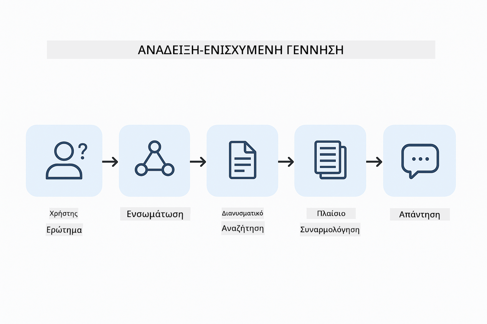
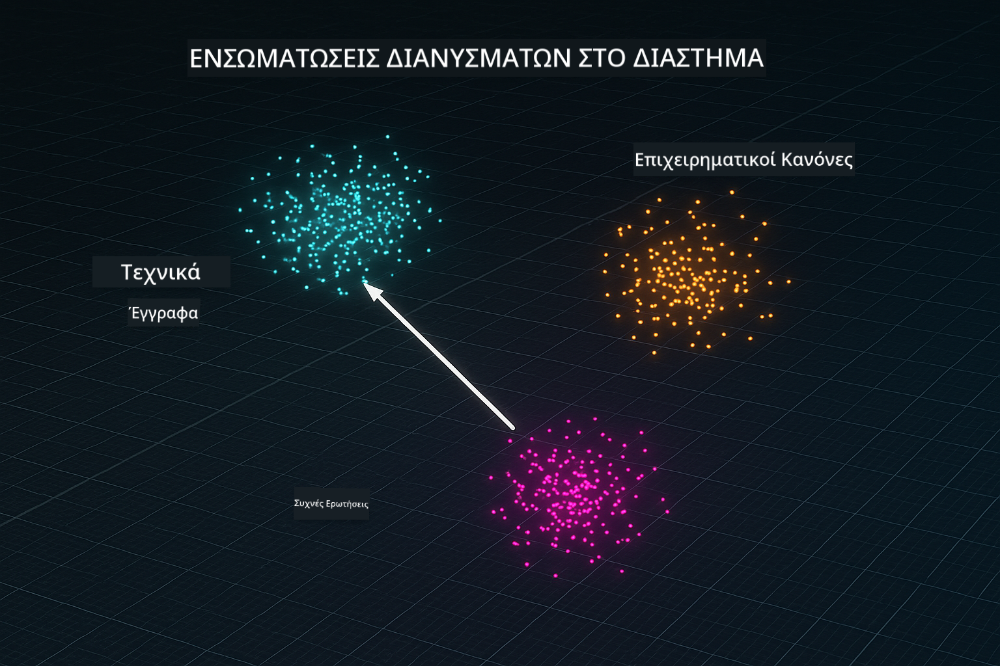

<!--
CO_OP_TRANSLATOR_METADATA:
{
  "original_hash": "81d087662fb3dd7b7124bce1a9c9ec86",
  "translation_date": "2026-01-05T23:24:23+00:00",
  "source_file": "03-rag/README.md",
  "language_code": "el"
}
-->
# Ενότητα 03: RAG (Γεννήτρια με Ανάκτηση)

## Πίνακας Περιεχομένων

- [Τι Θα Μάθετε](../../../03-rag)
- [Προαπαιτούμενα](../../../03-rag)
- [Κατανόηση του RAG](../../../03-rag)
- [Πώς Λειτουργεί](../../../03-rag)
  - [Επεξεργασία Εγγράφων](../../../03-rag)
  - [Δημιουργία Ενσωματώσεων](../../../03-rag)
  - [Σημασιολογική Αναζήτηση](../../../03-rag)
  - [Γεννήτρια Απαντήσεων](../../../03-rag)
- [Εκτέλεση της Εφαρμογής](../../../03-rag)
- [Χρήση της Εφαρμογής](../../../03-rag)
  - [Μεταφόρτωση Εγγράφου](../../../03-rag)
  - [Κάντε Ερωτήσεις](../../../03-rag)
  - [Έλεγχος Αναφορών Πηγών](../../../03-rag)
  - [Πειραματιστείτε με Ερωτήσεις](../../../03-rag)
- [Κρίσιμες Έννοιες](../../../03-rag)
  - [Στρατηγική Τμηματοποίησης](../../../03-rag)
  - [Βαθμολογίες Ομοιότητας](../../../03-rag)
  - [Αποθήκευση στη Μνήμη](../../../03-rag)
  - [Διαχείριση Παραθύρου Πλαισίου Συμφραζομένων](../../../03-rag)
- [Πότε Έχει Σημασία το RAG](../../../03-rag)
- [Επόμενα Βήματα](../../../03-rag)

## Τι Θα Μάθετε

Στις προηγούμενες ενότητες μάθατε πώς να έχετε συνομιλίες με AI και να δομείτε αποτελεσματικά τις εντολές σας. Όμως υπάρχει ένας βασικός περιορισμός: τα μοντέλα γλώσσας γνωρίζουν μόνο όσα έμαθαν κατά την εκπαίδευση. Δεν μπορούν να απαντήσουν σε ερωτήσεις για τις πολιτικές της εταιρείας σας, τα έγγραφα του έργου σας ή πληροφορίες που δεν έχουν εκπαιδευτεί να γνωρίζουν.

Το RAG (Γεννήτρια με Ανάκτηση) λύνει αυτό το πρόβλημα. Αντί να προσπαθείτε να διδάξετε στο μοντέλο τις δικές σας πληροφορίες (το οποίο είναι ακριβό και μη πρακτικό), του δίνετε τη δυνατότητα να αναζητά μέσα στα έγγραφά σας. Όταν κάποιος κάνει μια ερώτηση, το σύστημα βρίσκει σχετικές πληροφορίες και τις συμπεριλαμβάνει στην εντολή προς το μοντέλο. Το μοντέλο απαντά βάσει αυτού του ανακτημένου πλαισίου.

Σκεφτείτε το RAG σαν να δίνετε στο μοντέλο μια βιβλιοθήκη αναφορών. Όταν κάνετε μια ερώτηση, το σύστημα:

1. **Ερώτημα Χρήστη** - Κάνετε μια ερώτηση
2. **Ενσωμάτωση** - Μετατρέπει την ερώτησή σας σε διάνυσμα
3. **Αναζήτηση σε Διάνυσμα** - Βρίσκει παρόμοια τμήματα εγγράφου
4. **Σύνθεση Πλαισίου** - Προσθέτει σχετικά τμήματα στην εντολή
5. **Απάντηση** - Το LLM παράγει απάντηση βάσει του πλαισίου

Αυτό εδραιώνει τις απαντήσεις του μοντέλου στα πραγματικά σας δεδομένα αντί να βασίζεται μόνο στη γνώση της εκπαίδευσής του ή να επινοεί απαντήσεις.



*Ροή εργασίας RAG - από το ερώτημα χρήστη στη σημασιολογική αναζήτηση και τη γεννήτρια απαντήσεων συμφραζομένων*

## Προαπαιτούμενα

- Ολοκληρωμένη η Ενότητα 01 (αναπτυγμένοι πόροι Azure OpenAI)
- Αρχείο `.env` στον ριζικό φάκελο με στοιχεία Azure (δημιουργημένο από `azd up` στην Ενότητα 01)

> **Σημείωση:** Αν δεν έχετε ολοκληρώσει την Ενότητα 01, ακολουθήστε πρώτα τις οδηγίες ανάπτυξης εκεί.

## Πώς Λειτουργεί

### Επεξεργασία Εγγράφων

[DocumentService.java](../../../03-rag/src/main/java/com/example/langchain4j/rag/service/DocumentService.java)

Όταν ανεβάζετε ένα έγγραφο, το σύστημα το διασπά σε τμήματα - μικρότερα κομμάτια που χωράνε άνετα στο πλαίσιο συμφραζομένων του μοντέλου. Αυτά τα τμήματα καλύπτουν ελαφρώς το ένα το άλλο ώστε να μην χάσετε το πλαίσιο στα όρια.

```java
Document document = FileSystemDocumentLoader.loadDocument("sample-document.txt");

DocumentSplitter splitter = DocumentSplitters
    .recursive(300, 30, new OpenAiTokenizer());

List<TextSegment> segments = splitter.split(document);
```

> **🤖 Δοκιμάστε με [GitHub Copilot](https://github.com/features/copilot) Chat:** Ανοίξτε το [`DocumentService.java`](../../../03-rag/src/main/java/com/example/langchain4j/rag/service/DocumentService.java) και ρωτήστε:
> - "Πώς το LangChain4j διασπά τα έγγραφα σε τμήματα και γιατί είναι σημαντική η κάλυψη;"
> - "Ποιο είναι το ιδανικό μέγεθος τμήματος για διαφορετικούς τύπους εγγράφων και γιατί;"
> - "Πώς διαχειρίζομαι έγγραφα σε πολλές γλώσσες ή με ειδική μορφοποίηση;"

### Δημιουργία Ενσωματώσεων

[LangChainRagConfig.java](../../../03-rag/src/main/java/com/example/langchain4j/rag/config/LangChainRagConfig.java)

Κάθε τμήμα μετατρέπεται σε αριθμητική αναπαράσταση που ονομάζεται ενσωμάτωση - βασικά ένα μαθηματικό αποτύπωμα που αποτυπώνει το νόημα του κειμένου. Παρόμοιο κείμενο παράγει παρόμοιες ενσωματώσεις.

```java
@Bean
public EmbeddingModel embeddingModel() {
    return OpenAiOfficialEmbeddingModel.builder()
        .baseUrl(azureOpenAiEndpoint)
        .apiKey(azureOpenAiKey)
        .modelName(azureEmbeddingDeploymentName)
        .build();
}

EmbeddingStore<TextSegment> embeddingStore = 
    new InMemoryEmbeddingStore<>();
```



*Έγγραφα αναπαριστώνται ως διανύσματα στον χώρο ενσωμάτωσης - παρόμοιο περιεχόμενο ομαδοποιείται*

### Σημασιολογική Αναζήτηση

[RagService.java](../../../03-rag/src/main/java/com/example/langchain4j/rag/service/RagService.java)

Όταν κάνετε μια ερώτηση, η ερώτησή σας γίνεται επίσης ενσωμάτωση. Το σύστημα συγκρίνει την ενσωμάτωση της ερώτησής σας με όλες τις ενσωματώσεις των τμημάτων εγγράφου. Βρίσκει τα τμήματα με το πιο παρόμοιο νόημα - όχι μόνο αντιστοιχία όρων, αλλά πραγματική σημασιολογική ομοιότητα.

```java
Embedding queryEmbedding = embeddingModel.embed(question).content();

List<EmbeddingMatch<TextSegment>> matches = 
    embeddingStore.findRelevant(queryEmbedding, 5, 0.7);

for (EmbeddingMatch<TextSegment> match : matches) {
    String relevantText = match.embedded().text();
    double score = match.score();
}
```

> **🤖 Δοκιμάστε με [GitHub Copilot](https://github.com/features/copilot) Chat:** Ανοίξτε το [`RagService.java`](../../../03-rag/src/main/java/com/example/langchain4j/rag/service/RagService.java) και ρωτήστε:
> - "Πώς λειτουργεί η αναζήτηση ομοιότητας με ενσωματώσεις και τι καθορίζει τη βαθμολογία;"
> - "Ποιο όριο ομοιότητας πρέπει να χρησιμοποιώ και πώς επηρεάζει τα αποτελέσματα;"
> - "Πώς διαχειρίζομαι περιπτώσεις όπου δεν βρίσκονται σχετικά έγγραφα;"

### Γεννήτρια Απαντήσεων

[RagService.java](../../../03-rag/src/main/java/com/example/langchain4j/rag/service/RagService.java)

Τα πιο σχετικά τμήματα συμπεριλαμβάνονται στην εντολή προς το μοντέλο. Το μοντέλο διαβάζει αυτά τα συγκεκριμένα τμήματα και απαντά στην ερώτησή σας βάσει αυτής της πληροφορίας. Αυτό αποτρέπει τη δημιουργία ψευδών απαντήσεων - το μοντέλο μπορεί να απαντήσει μόνο βάσει όσων έχει μπροστά του.

## Εκτέλεση της Εφαρμογής

**Επαλήθευση ανάπτυξης:**

Εξασφαλίστε ότι το αρχείο `.env` υπάρχει στον ριζικό φάκελο με τα στοιχεία Azure (δημιουργήθηκε κατά την Ενότητα 01):
```bash
cat ../.env  # Πρέπει να εμφανίζει το AZURE_OPENAI_ENDPOINT, το API_KEY, το DEPLOYMENT
```

**Εκκίνηση εφαρμογής:**

> **Σημείωση:** Αν έχετε ήδη εκκινήσει όλες τις εφαρμογές με `./start-all.sh` από την Ενότητα 01, αυτή η ενότητα τρέχει ήδη στην πόρτα 8081. Μπορείτε να παραλείψετε τις παρακάτω εντολές εκκίνησης και να πάτε απευθείας στη διεύθυνση http://localhost:8081.

**Επιλογή 1: Χρήση Spring Boot Dashboard (Προτεινόμενο για χρήστες VS Code)**

Το περιβάλλον ανάπτυξης περιλαμβάνει την επέκταση Spring Boot Dashboard, που παρέχει οπτική διεπαφή για τη διαχείριση όλων των εφαρμογών Spring Boot. Την βρίσκετε στη γραμμή δραστηριοτήτων στα αριστερά του VS Code (αναζητήστε το εικονίδιο Spring Boot).

Από το Spring Boot Dashboard μπορείτε:
- Να δείτε όλες τις διαθέσιμες εφαρμογές Spring Boot στον χώρο εργασίας
- Να ξεκινήσετε/σταματήσετε εφαρμογές με ένα κλικ
- Να δείτε τα αρχεία καταγραφής εφαρμογής σε πραγματικό χρόνο
- Να παρακολουθήσετε την κατάσταση της εφαρμογής

Κάντε κλικ στο κουμπί αναπαραγωγής δίπλα στο "rag" για να ξεκινήσετε αυτή την ενότητα, ή ξεκινήστε όλες τις ενότητες ταυτόχρονα.


**Επιλογή 2: Χρήση shell scripts**

Εκκίνηση όλων των web εφαρμογών (ενότητες 01-04):

**Bash:**
```bash
cd ..  # Από τον ριζικό κατάλογο
./start-all.sh
```

**PowerShell:**
```powershell
cd ..  # Από τον ριζικό κατάλογο
.\start-all.ps1
```

Ή εκκίνηση μόνο αυτής της ενότητας:

**Bash:**
```bash
cd 03-rag
./start.sh
```

**PowerShell:**
```powershell
cd 03-rag
.\start.ps1
```

Και τα δύο σενάρια φορτώνουν αυτόματα τις μεταβλητές περιβάλλοντος από το αρχείο `.env` στη ρίζα και θα δημιουργήσουν τα αρχεία JAR αν δεν υπάρχουν.

> **Σημείωση:** Αν προτιμάτε να χτίσετε όλες τις ενότητες χειροκίνητα πριν την εκκίνηση:
>
> **Bash:**
> ```bash
> cd ..  # Go to root directory
> mvn clean package -DskipTests
> ```
>
> **PowerShell:**
> ```powershell
> cd ..  # Go to root directory
> mvn clean package -DskipTests
> ```

Ανοίξτε το http://localhost:8081 στον browser σας.

**Για διακοπή:**

**Bash:**
```bash
./stop.sh  # Μόνο αυτό το μοντέλο
# Ή
cd .. && ./stop-all.sh  # Όλα τα μοντέλα
```

**PowerShell:**
```powershell
.\stop.ps1  # Μόνο αυτό το module
# Ή
cd ..; .\stop-all.ps1  # Όλα τα modules
```

## Χρήση της Εφαρμογής

Η εφαρμογή παρέχει διεπαφή web για μεταφόρτωση εγγράφων και υποβολή ερωτήσεων.

<a href="images/rag-homepage.png"></a>

*Η διεπαφή εφαρμογής RAG - μεταφόρτωση εγγράφων και υποβολή ερωτήσεων*

### Μεταφόρτωση Εγγράφου

Ξεκινήστε ανεβάζοντας ένα έγγραφο - αρχεία TXT είναι ιδανικά για δοκιμές. Στον φάκελο αυτό υπάρχει το `sample-document.txt` που περιέχει πληροφορίες για τις δυνατότητες του LangChain4j, την υλοποίηση RAG και βέλτιστες πρακτικές - τέλειο για δοκιμάσεις του συστήματος.

Το σύστημα επεξεργάζεται το έγγραφό σας, το διασπά σε τμήματα και δημιουργεί ενσωματώσεις για κάθε τμήμα. Αυτό γίνεται αυτόματα όταν το ανεβάζετε.

### Κάντε Ερωτήσεις

Τώρα κάντε συγκεκριμένες ερωτήσεις για το περιεχόμενο του εγγράφου. Δοκιμάστε κάτι πραγματικό που αναφέρεται ξεκάθαρα στο έγγραφο. Το σύστημα αναζητεί σχετικά τμήματα, τα προσθέτει στην εντολή και παράγει απάντηση.

### Έλεγχος Αναφορών Πηγών

Σημειώστε ότι κάθε απάντηση περιλαμβάνει αναφορές πηγών με βαθμολογίες ομοιότητας. Αυτές οι βαθμολογίες (από 0 έως 1) δείχνουν πόσο σχετικό ήταν κάθε τμήμα με την ερώτησή σας. Υψηλότερες βαθμολογίες σημαίνουν καλύτερες αντιστοιχίες. Αυτό σας επιτρέπει να επαληθεύσετε την απάντηση βάσει του πρωτογενούς υλικού.

<a href="images/rag-query-results.png"></a>

*Αποτελέσματα ερωτήματος που δείχνουν απάντηση με αναφορές πηγών και βαθμολογίες συνάφειας*

### Πειραματιστείτε με Ερωτήσεις

Δοκιμάστε διαφορετικά είδη ερωτήσεων:
- Συγκεκριμένα γεγονότα: "Ποιο είναι το κύριο θέμα;"
- Συγκρίσεις: "Ποια η διαφορά μεταξύ Χ και Υ;"
- Περίληψεις: "Σύνοψη των βασικών σημείων για το Ζ"

Παρακολουθήστε πώς αλλάζουν οι βαθμολογίες συνάφειας ανάλογα με το πόσο καλά ταιριάζει η ερώτησή σας με το περιεχόμενο του εγγράφου.

## Κρίσιμες Έννοιες

### Στρατηγική Τμηματοποίησης

Τα έγγραφα διασπώνται σε τμήματα 300 tokens με επικάλυψη 30 tokens. Αυτή η ισορροπία εξασφαλίζει ότι κάθε τμήμα έχει αρκετό πλαίσιο για να είναι ουσιαστικό ενώ παραμένει αρκετά μικρό ώστε να χωρούν πολλά τμήματα σε μία εντολή.

### Βαθμολογίες Ομοιότητας

Οι βαθμολογίες κυμαίνονται από 0 έως 1:
- 0.7-1.0: Πολύ σχετικό, ακριβής αντιστοιχία
- 0.5-0.7: Σχετικό, καλό πλαίσιο
- Κάτω από 0.5: Φιλτράρεται, πολύ διαφορετικό

Το σύστημα ανακτά μόνο τμήματα πάνω από το ελάχιστο όριο για να διασφαλιστεί η ποιότητα.

### Αποθήκευση στη Μνήμη

Αυτή η ενότητα χρησιμοποιεί αποθήκευση στη μνήμη για απλότητα. Όταν επανεκκινείτε την εφαρμογή, τα ανεβασμένα έγγραφα χάνονται. Τα συστήματα παραγωγής χρησιμοποιούν επίμονα βάσεις δεδομένων διανυσμάτων όπως το Qdrant ή το Azure AI Search.

### Διαχείριση Παραθύρου Πλαισίου Συμφραζομένων

Κάθε μοντέλο έχει ένα μέγιστο παράθυρο πλαισίου συμφραζομένων. Δεν μπορείτε να συμπεριλάβετε όλα τα τμήματα ενός μεγάλου εγγράφου. Το σύστημα ανακτά τα 5 πιο σχετικά τμήματα (προεπιλεγμένα) για να παραμείνει εντός ορίων ενώ παρέχει αρκετό πλαίσιο για ακριβείς απαντήσεις.

## Πότε Έχει Σημασία το RAG

**Χρησιμοποιήστε το RAG όταν:**
- Απαντάτε σε ερωτήσεις για ιδιόκτητα έγγραφα
- Οι πληροφορίες αλλάζουν συχνά (πολιτικές, τιμές, προδιαγραφές)
- Απαιτείται ακρίβεια με αναφορά σε πηγές
- Το περιεχόμενο είναι πολύ μεγάλο για να χωρέσει σε μία εντολή
- Χρειάζεστε επαληθεύσιμες, τεκμηριωμένες απαντήσεις

**Μην χρησιμοποιείτε το RAG όταν:**
- Οι ερωτήσεις απαιτούν γενική γνώση που ήδη έχει το μοντέλο
- Απαιτούνται δεδομένα σε πραγματικό χρόνο (το RAG λειτουργεί με ανεβασμένα έγγραφα)
- Το περιεχόμενο είναι μικρό αρκετά για να συμπεριληφθεί απευθείας στις εντολές

## Επόμενα Βήματα

**Επόμενη Ενότητα:** [04-tools - AI Agents με Εργαλεία](../04-tools/README.md)

---

**Πλοήγηση:** [← Προηγούμενο: Ενότητα 02 - Μηχανική Εντολών](../02-prompt-engineering/README.md) | [Επιστροφή στην Αρχική](../README.md) | [Επόμενο: Ενότητα 04 - Εργαλεία →](../04-tools/README.md)

---

<!-- CO-OP TRANSLATOR DISCLAIMER START -->
**Αποποίηση Ευθυνών**:  
Αυτό το έγγραφο έχει μεταφραστεί χρησιμοποιώντας την υπηρεσία αυτόματης μετάφρασης AI [Co-op Translator](https://github.com/Azure/co-op-translator). Παρόλο που προσπαθούμε για ακρίβεια, παρακαλούμε να έχετε υπόψη ότι οι αυτόματες μεταφράσεις μπορεί να περιέχουν λάθη ή ανακρίβειες. Το πρωτότυπο έγγραφο στη μητρική του γλώσσα πρέπει να θεωρείται η έγκυρη πηγή. Για κρίσιμες πληροφορίες, συνιστάται επαγγελματική μετάφραση από ανθρώπους. Δεν φέρουμε ευθύνη για τυχόν παρεξηγήσεις ή λανθασμένες ερμηνείες που προκύπτουν από τη χρήση αυτής της μετάφρασης.
<!-- CO-OP TRANSLATOR DISCLAIMER END -->