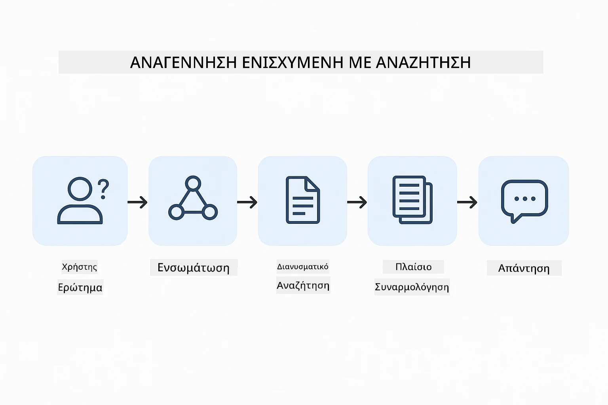
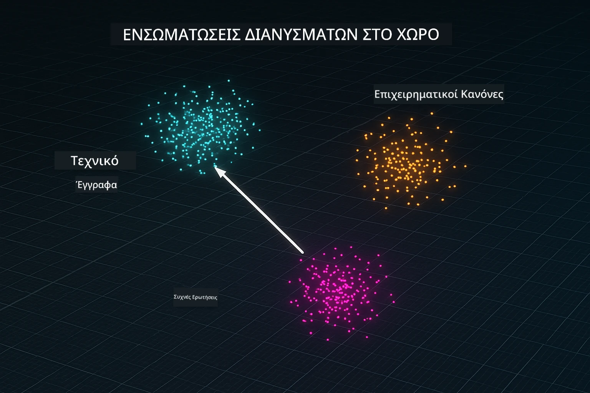
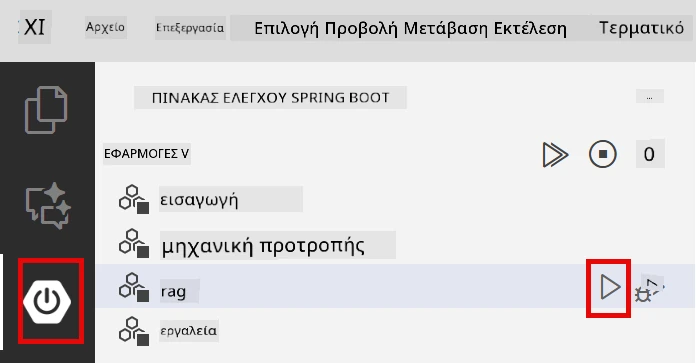
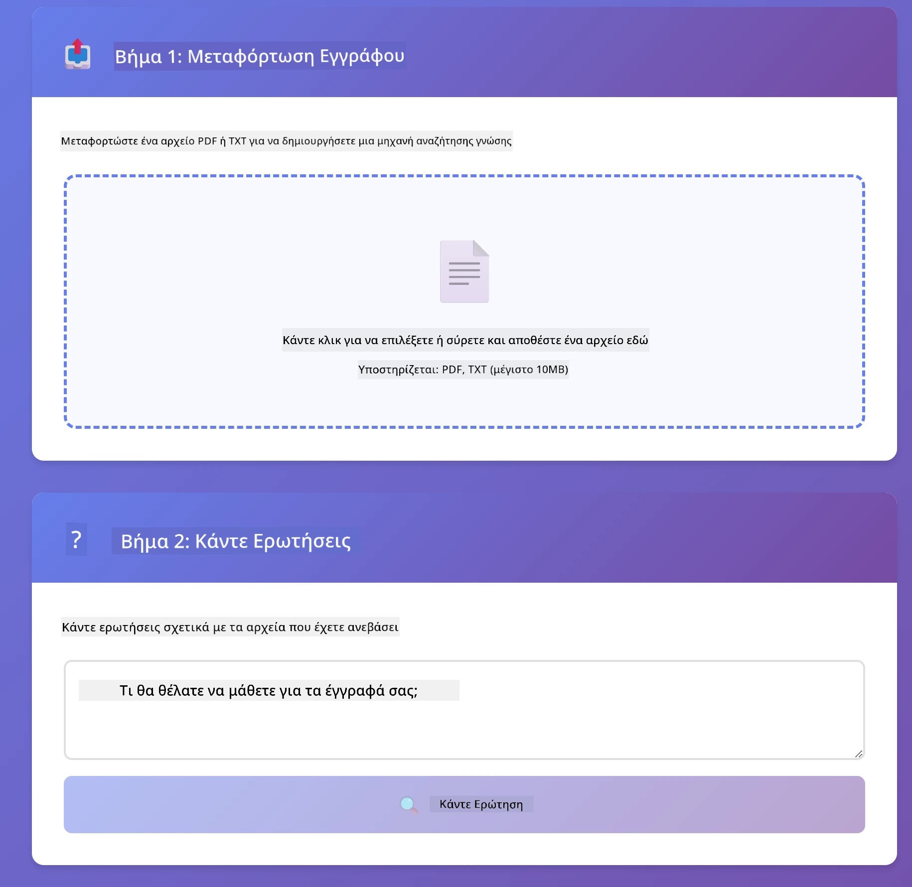
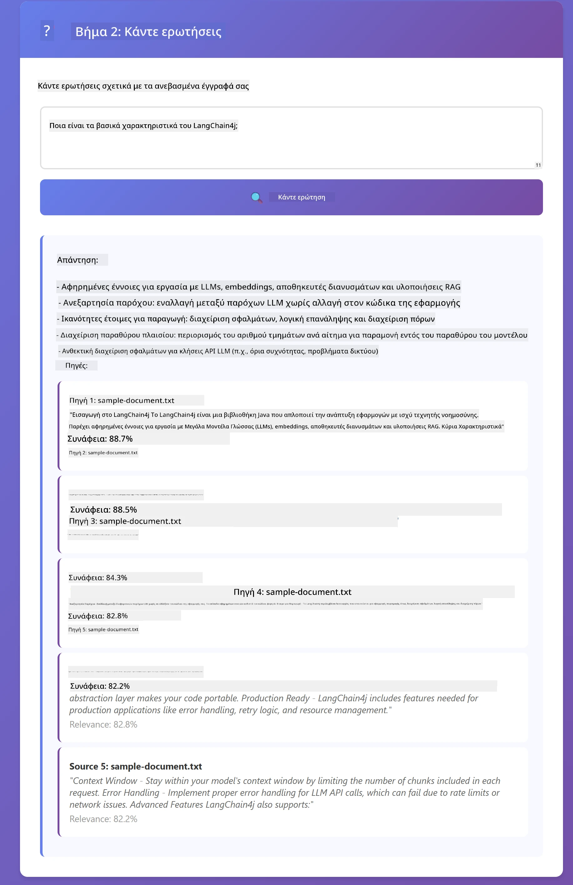

# Module 03: RAG (Γενετική με Ενισχυμένη Ανάκτηση)

## Table of Contents

- [Video Walkthrough](#video-walkthrough)
- [What You'll Learn](#what-youll-learn)
- [Prerequisites](#prerequisites)
- [Understanding RAG](#understanding-rag)
  - [Which RAG Approach Does This Tutorial Use?](#which-rag-approach-does-this-tutorial-use)
- [How It Works](#how-it-works)
  - [Document Processing](#document-processing)
  - [Creating Embeddings](#creating-embeddings)
  - [Semantic Search](#semantic-search)
  - [Answer Generation](#δημιουργία-απάντησης)
- [Run the Application](#εκτέλεση-της-εφαρμογής)
- [Using the Application](#χρήση-της-εφαρμογής)
  - [Upload a Document](#ανέβασμα-εγγράφου)
  - [Ask Questions](#κάντε-ερωτήσεις)
  - [Check Source References](#ελέγξτε-τις-πηγές-αναφορών)
  - [Experiment with Questions](#πειραματιστείτε-με-ερωτήσεις)
- [Key Concepts](#κύριες-έννοιες)
  - [Chunking Strategy](#στρατηγική-τμηματοποίησης)
  - [Similarity Scores](#βαθμολογίες-ομοιότητας)
  - [In-Memory Storage](#αποθήκευση-στο-μνήμης)
  - [Context Window Management](#διαχείριση-παραθύρου-πλαισίου)
- [When RAG Matters](#πότε-έχει-σημασία-η-rag)
- [Next Steps](#επόμενα-βήματα)

## Video Walkthrough

Παρακολουθήστε αυτήν τη ζωντανή παρουσίαση που εξηγεί πώς να ξεκινήσετε με αυτό το module:

<a href="https://www.youtube.com/watch?v=_olq75ZH_eY"></a>

## What You'll Learn

Στα προηγούμενα modules, μάθατε πώς να έχετε συνομιλίες με ΤΝ και να δομείτε αποτελεσματικά τις ερωτήσεις σας. Αλλά υπάρχει ένας θεμελιώδης περιορισμός: τα γλωσσικά μοντέλα γνωρίζουν μόνο ό,τι έχουν μάθει κατά την εκπαίδευση. Δεν μπορούν να απαντήσουν σε ερωτήσεις σχετικά με τις πολιτικές της εταιρείας σας, την τεκμηρίωση του έργου σας ή οποιαδήποτε πληροφορία δεν έχουν εκπαιδευτεί.

Το RAG (Γενετική με Ενισχυμένη Ανάκτηση) λύνει αυτό το πρόβλημα. Αντί να προσπαθείτε να διδάξετε στο μοντέλο τις πληροφορίες σας (που είναι ακριβό και ανέφικτο), του δίνετε τη δυνατότητα να αναζητήσει τα έγγραφά σας. Όταν κάποιος κάνει μια ερώτηση, το σύστημα βρίσκει σχετικές πληροφορίες και τις ενσωματώνει στο prompt. Το μοντέλο απαντά βάσει αυτού του ανακτημένου πλαισίου.

Σκεφτείτε το RAG σαν να δίνετε στο μοντέλο μια βιβλιοθήκη αναφοράς. Όταν κάνετε μια ερώτηση, το σύστημα:

1. **Ερώτηση Χρήστη** - Κάνετε μια ερώτηση  
2. **Ενσωμάτωση** - Μετατρέπει την ερώτησή σας σε διάνυσμα  
3. **Αναζήτηση Διανυσμάτων** - Βρίσκει παρόμοια τμήματα εγγράφων  
4. **Σύνθεση Πλαισίου** - Προσθέτει σχετικά τμήματα στο prompt  
5. **Απάντηση** - Το LLM παράγει απάντηση βάσει του πλαισίου  

Αυτό στηρίζει τις απαντήσεις του μοντέλου στα πραγματικά σας δεδομένα αντί να βασίζεται μόνο στη γνώση εκπαίδευσής του ή να εφεύρει απαντήσεις.

## Prerequisites

- Ολοκληρωμένο [Module 01 - Εισαγωγή](../01-introduction/README.md) (αναπτύχθηκαν πόροι Azure OpenAI, συμπεριλαμβανομένου του μοντέλου ενσωμάτωσης `text-embedding-3-small`)  
- Αρχείο `.env` στον ριζικό φάκελο με στοιχεία Azure (δημιουργημένο από `azd up` στο Module 01)  

> **Σημείωση:** Εάν δεν έχετε ολοκληρώσει το Module 01, ακολουθήστε πρώτα τις οδηγίες ανάπτυξης εκεί. Η εντολή `azd up` αναπτύσσει τόσο το μοντέλο chat GPT όσο και το μοντέλο ενσωμάτωσης που χρησιμοποιείται σε αυτό το module.

## Understanding RAG

Το παρακάτω διάγραμμα δείχνει τον βασικό πυρήνα: αντί να βασίζεται μόνο στα δεδομένα εκπαίδευσης του μοντέλου, το RAG του παρέχει μια βιβλιοθήκη αναφοράς των εγγράφων σας για να συμβουλευτεί πριν δημιουργήσει κάθε απάντηση.


*Αυτό το διάγραμμα δείχνει τη διαφορά μεταξύ ενός τυπικού LLM (που μαντεύει από τα δεδομένα εκπαίδευσης) και ενός LLM με ενίσχυση RAG (που συμβουλεύεται πρώτα τα έγγραφά σας).*

Ορίστε πώς συνδέονται όλα τα κομμάτια από άκρη σε άκρη. Η ερώτηση ενός χρήστη περνά μέσα από τέσσερα στάδια — ενσωμάτωση, αναζήτηση διανυσμάτων, σύνθεση πλαισίου και παραγωγή απάντησης — το καθένα βασισμένο στο προηγούμενο:



*Αυτό το διάγραμμα δείχνει τη ροή RAG από άκρη σε άκρη — μια ερώτηση χρήστη περνά μέσα από ενσωμάτωση, αναζήτηση διανυσμάτων, σύνθεση πλαισίου και παραγωγή απάντησης.*

Το υπόλοιπο του module περνά αναλυτικά από κάθε στάδιο, με κώδικα που μπορείτε να τρέξετε και να τροποποιήσετε.

### Which RAG Approach Does This Tutorial Use?

Το LangChain4j προσφέρει τρεις τρόπους υλοποίησης του RAG, ο καθένας με διαφορετικό επίπεδο αφαίρεσης. Το παρακάτω διάγραμμα τους συγκρίνει δίπλα-δίπλα:


*Αυτό το διάγραμμα συγκρίνει τις τρεις προσεγγίσεις RAG του LangChain4j — Easy, Native, και Advanced — δείχνοντας τα βασικά τους στοιχεία και πότε να χρησιμοποιεί κανείς καθεμία.*

| Προσέγγιση | Τι Κάνει | Ανταλλαγή |
|---|---|---|
| **Easy RAG** | Συνδέει τα πάντα αυτόματα μέσω `AiServices` και `ContentRetriever`. Σημειώνετε ένα interface, συνδέετε έναν retriever, και το LangChain4j διαχειρίζεται την ενσωμάτωση, αναζήτηση και σύνθεση prompt πίσω από τις σκηνές. | Ελάχιστος κώδικας, αλλά δεν βλέπετε τι συμβαίνει σε κάθε βήμα. |
| **Native RAG** | Καλείτε το μοντέλο ενσωμάτωσης, ψάχνετε στην αποθήκη, φτιάχνετε το prompt και παράγετε την απάντηση μόνοι σας — ένα ρητό βήμα τη φορά. | Περισσότερος κώδικας, αλλά κάθε στάδιο είναι ορατό και τροποποιήσιμο. |
| **Advanced RAG** | Χρησιμοποιεί το πλαίσιο `RetrievalAugmentor` με ρυθμιζόμενους μετατροπείς ερωτήσεων, διανομείς, επαναταξινομητές και ενσωματωτές περιεχομένου για παραγωγικές ροές. | Μέγιστη ευελιξία, αλλά σημαντικά μεγαλύτερη πολυπλοκότητα. |

**Αυτό το tutorial χρησιμοποιεί την προσέγγιση Native.** Κάθε βήμα της ροής RAG — ενσωμάτωση της ερώτησης, αναζήτηση στη βάση διανυσμάτων, σύνθεση του πλαισίου και παραγωγή απάντησης — γράφεται ρητά στο [`RagService.java`](../../../03-rag/src/main/java/com/example/langchain4j/rag/service/RagService.java). Αυτό είναι σκόπιμο: ως εκπαιδευτικό υλικό, είναι πιο σημαντικό να βλέπετε και να κατανοείτε κάθε στάδιο παρά να ελαχιστοποιείται ο κώδικας. Μόλις νιώσετε άνετα με τη λειτουργία των κομματιών, μπορείτε να περάσετε σε Easy RAG για γρήγορα πρωτότυπα ή Advanced RAG για συστήματα παραγωγής.

> **💡 Σας ενδιαφέρει το Easy RAG;** Το LangChain4j προσφέρει επίσης μια *Easy RAG* προσέγγιση όπου τα `AiServices` και ένας `ContentRetriever` διαχειρίζονται αυτόματα την ενσωμάτωση, την αναζήτηση και τη σύνθεση του prompt. Αυτό το module ακολουθεί μια πιο ρητή διαδρομή — σπάνε το σωλήνωση ώστε να βλέπετε και να ελέγχετε κάθε στάδιο μόνοι σας.

Το παρακάτω διάγραμμα δείχνει τη ροή Easy RAG. Παρατηρήστε πώς τα `AiServices` και `EmbeddingStoreContentRetriever` κρύβουν όλη την πολυπλοκότητα — φορτώνετε ένα έγγραφο, προσθέτετε έναν retriever και παίρνετε απαντήσεις. Η Native προσέγγιση σε αυτό το module ανοίγει κάθε κρυμμένο βήμα:


*Αυτό το διάγραμμα δείχνει τη ροή Easy RAG. Συγκρίνετε το με την Native προσέγγιση που χρησιμοποιείται σε αυτό το module: το Easy RAG κρύβει την ενσωμάτωση, την ανάκτηση και τη σύνθεση του prompt πίσω από τα `AiServices` και `ContentRetriever` — φόρτωνετε έγγραφο, προσθέτετε retriever και λαμβάνετε απαντήσεις. Η Native προσέγγιση σε αυτό το module ανοίγει τη ροή ώστε να καλείτε εσείς κάθε στάδιο (ενσωμάτωση, αναζήτηση, σύνθεση πλαισίου, παραγωγή) μόνοι σας, δίνοντάς σας πλήρη ορατότητα και έλεγχο.*

## How It Works

Η ροή RAG σε αυτό το module διασπάται σε τέσσερα στάδια που εκτελούνται διαδοχικά κάθε φορά που ένας χρήστης κάνει ερώτηση. Πρώτα, το ανέβασμα ενός εγγράφου **αναλύεται και χωρίζεται σε τμήματα** που είναι εύκολα στη διαχείριση. Αυτά τα τμήματα μετατρέπονται σε **ενσωματώσεις διανυσμάτων** και αποθηκεύονται ώστε να μπορούν να συγκριθούν μαθηματικά. Όταν φτάνει μια ερώτηση, το σύστημα εκτελεί μια **σημασιολογική αναζήτηση** για να βρει τα πιο σχετικά τμήματα και τελικά τα περνά ως πλαίσιο στο LLM για **παραγωγή απάντησης**. Οι ακόλουθες ενότητες αναλύουν κάθε στάδιο με πραγματικό κώδικα και διαγράμματα. Ας δούμε το πρώτο βήμα.

### Document Processing

[DocumentService.java](../../../03-rag/src/main/java/com/example/langchain4j/rag/service/DocumentService.java)

Όταν ανεβάζετε ένα έγγραφο, το σύστημα το αναλύει (PDF ή απλό κείμενο), συνδέει μεταδεδομένα όπως το όνομα αρχείου και στη συνέχεια το χωρίζει σε τμήματα — μικρότερα κομμάτια που χωράνε άνετα στο παράθυρο πλαισίου του μοντέλου. Αυτά τα τμήματα επικαλύπτονται ελαφρώς ώστε να μην χάνεται πλαίσιο στα όρια.

```java
// Αναλύστε το ανεβασμένο αρχείο και τυλίξτε το σε ένα έγγραφο LangChain4j
Document document = Document.from(content, metadata);

// Διαχωρίστε σε κομμάτια των 300 συμβόλων με επικάλυψη 30 συμβόλων
DocumentSplitter splitter = DocumentSplitters
    .recursive(300, 30);

List<TextSegment> segments = splitter.split(document);
```
  
Το παρακάτω διάγραμμα δείχνει πώς λειτουργεί αυτό οπτικά. Παρατηρήστε πώς κάθε τμήμα μοιράζεται κάποιους tokens με τους γείτονές του — η επικάλυψη 30 tokens διασφαλίζει ότι κανένα σημαντικό πλαίσιο δεν χάνεται ανάμεσα:


*Αυτό το διάγραμμα δείχνει ένα έγγραφο να χωρίζεται σε τμήματα των 300 tokens με επικάλυψη 30 tokens, διατηρώντας το πλαίσιο στα όρια των τμημάτων.*

> **🤖 Δοκιμάστε με το [GitHub Copilot](https://github.com/features/copilot) Chat:** Ανοίξτε το [`DocumentService.java`](../../../03-rag/src/main/java/com/example/langchain4j/rag/service/DocumentService.java) και ρωτήστε:  
> - "Πώς χωρίζει το LangChain4j τα έγγραφα σε τμήματα και γιατί είναι σημαντική η επικάλυψη;"  
> - "Ποιο είναι το βέλτιστο μέγεθος τμήματος για διαφορετικούς τύπους εγγράφων και γιατί;"  
> - "Πώς διαχειρίζομαι έγγραφα σε πολλές γλώσσες ή με ειδική μορφοποίηση;"

### Creating Embeddings

[LangChainRagConfig.java](../../../03-rag/src/main/java/com/example/langchain4j/rag/config/LangChainRagConfig.java)

Κάθε τμήμα μετατρέπεται σε μια αριθμητική αναπαράσταση που ονομάζεται ενσωμάτωση — ουσιαστικά ένας μετατροπέας νοήματος σε αριθμούς. Το μοντέλο ενσωμάτωσης δεν είναι "έξυπνο" όπως ένα μοντέλο chat· δεν μπορεί να ακολουθεί οδηγίες, να λογικοποιεί ή να απαντά σε ερωτήσεις. Αυτό που κάνει είναι να χαρτογραφεί το κείμενο σε έναν μαθηματικό χώρο όπου παρόμοια νοήματα βρίσκονται κοντά — "αυτοκίνητο" κοντά σε "όχημα," "πολιτική επιστροφών" κοντά σε "επιστροφή χρημάτων." Σκεφτείτε ένα μοντέλο chat ως άτομο με το οποίο μπορείτε να μιλήσετε· ένα μοντέλο ενσωμάτωσης είναι ένα εξαιρετικό σύστημα αρχειοθέτησης.

Το παρακάτω διάγραμμα απεικονίζει αυτήν την έννοια — το κείμενο μπαίνει, βγαίνουν αριθμητικά διανύσματα, και παρόμοια νοήματα παράγουν κοντινά διανύσματα:


*Αυτό το διάγραμμα δείχνει πώς ένα μοντέλο ενσωμάτωσης μετατρέπει κείμενο σε αριθμητικά διανύσματα, τοποθετώντας παρόμοια νοήματα — όπως "αυτοκίνητο" και "όχημα" — κοντά το ένα στο άλλο στον χώρο των διανυσμάτων.*

```java
@Bean
public EmbeddingModel embeddingModel() {
    return OpenAiOfficialEmbeddingModel.builder()
        .baseUrl(azureOpenAiEndpoint)
        .apiKey(azureOpenAiKey)
        .modelName(azureEmbeddingDeploymentName)
        .build();
}

EmbeddingStore<TextSegment> embeddingStore = 
    new InMemoryEmbeddingStore<>();
```
  
Το παρακάτω διάγραμμα κλάσεων δείχνει τις δύο ξεχωριστές ροές σε μια ροή RAG και τις κλάσεις LangChain4j που τις υλοποιούν. Η **ροή εισαγωγής** (τρέχει μία φορά κατά το ανέβασμα) χωρίζει το έγγραφο, ενσωματώνει τα τμήματα και τα αποθηκεύει μέσω `.addAll()`. Η **ροή ερώτησης** (τρέχει κάθε φορά που ο χρήστης ρωτά) ενσωματώνει την ερώτηση, ψάχνει στην αποθήκη μέσω `.search()` και περνά το σχετικό πλαίσιο στο μοντέλο chat. Και οι δύο ροές συναντώνται στο κοινό interface `EmbeddingStore<TextSegment>`:


*Αυτό το διάγραμμα δείχνει τις δύο ροές σε μια ροή RAG — εισαγωγής και ερώτησης — και πώς συνδέονται μέσω ενός κοινόχρηστου EmbeddingStore.*

Μόλις αποθηκευτούν οι ενσωματώσεις, το παρόμοιο περιεχόμενο συγκεντρώνεται φυσικά στον χώρο των διανυσμάτων. Η παρακάτω οπτικοποίηση δείχνει πώς έγγραφα για σχετικά θέματα καταλήγουν κοντά το ένα στο άλλο, πράγμα που κάνει δυνατή τη σημασιολογική αναζήτηση:



*Αυτή η οπτικοποίηση δείχνει πώς σχετικά έγγραφα συσσωρεύονται μαζί σε τρισδιάστατο χώρο διανυσμάτων, με θέματα όπως Τεχνικά Έγγραφα, Επιχειρηματικοί Κανόνες και FAQ να σχηματίζουν διακριτές ομάδες.*

Όταν ένας χρήστης ψάχνει, το σύστημα ακολουθεί τέσσερα βήματα: ενσωματώνει τα έγγραφα μία φορά, ενσωματώνει την ερώτηση σε κάθε αναζήτηση, συγκρίνει το διάνυσμα της ερώτησης με όλα τα αποθηκευμένα διανύσματα με χρήση της ομοιότητας συνημίτονου, και επιστρέφει τα τμήματα με την υψηλότερη βαθμολογία Top-K. Το παρακάτω διάγραμμα περνά κάθε βήμα και τις αντίστοιχες κλάσεις LangChain4j:


*Αυτό το διάγραμμα δείχνει τη διαδικασία αναζήτησης ενσωμάτωσης σε τέσσερα βήματα: ενσωμάτωση εγγράφων, ενσωμάτωση ερώτησης, σύγκριση διανυσμάτων με ομοιότητα συνημίτονου και επιστροφή των κορυφαίων αποτελεσμάτων.*

### Semantic Search

[RagService.java](../../../03-rag/src/main/java/com/example/langchain4j/rag/service/RagService.java)

Όταν κάνετε μια ερώτηση, και αυτή η ερώτηση γίνεται επίσης μια ενσωμάτωση. Το σύστημα συγκρίνει την ενσωμάτωση της ερώτησής σας με όλες τις ενσωματώσεις των τμημάτων εγγράφων. Βρίσκει τα τμήματα με τα πιο παρόμοια νοήματα — όχι απλώς μετρήσεις λέξεων-κλειδιών, αλλά πραγματική σημασιολογική ομοιότητα.

```java
Embedding queryEmbedding = embeddingModel.embed(question).content();

EmbeddingSearchRequest searchRequest = EmbeddingSearchRequest.builder()
    .queryEmbedding(queryEmbedding)
    .maxResults(5)
    .minScore(0.5)
    .build();

EmbeddingSearchResult<TextSegment> searchResult = embeddingStore.search(searchRequest);
List<EmbeddingMatch<TextSegment>> matches = searchResult.matches();

for (EmbeddingMatch<TextSegment> match : matches) {
    String relevantText = match.embedded().text();
    double score = match.score();
}
```
  
Το διάγραμμα παρακάτω αντιπαραβάλλει τη σημασιολογική αναζήτηση με την παραδοσιακή αναζήτηση λέξεων-κλειδιών. Μια αναζήτηση λέξεων-κλειδιών για "όχημα" χάνει ένα τμήμα για "αυτοκίνητα και φορτηγά," αλλά η σημασιολογική αναζήτηση καταλαβαίνει ότι σημαίνουν το ίδιο πράγμα και το επιστρέφει ως υψηλής βαθμολογίας ταίρι:


*Αυτό το διάγραμμα συγκρίνει την αναζήτηση με βάση λέξεις-κλειδιά με τη σημασιολογική αναζήτηση, δείχνοντας πώς η σημασιολογική αναζήτηση ανακτά περιεχόμενο που σχετίζεται εννοιολογικά ακόμα και όταν οι ακριβείς λέξεις-κλειδιά διαφέρουν.*

Στο εσωτερικό, η ομοιότητα μετριέται χρησιμοποιώντας την ομοιότητα συνημίτονου — που ρωτά ουσιαστικά "δείχνουν αυτά τα δύο βέλη στην ίδια κατεύθυνση;" Δύο τμήματα μπορεί να χρησιμοποιούν εντελώς διαφορετικές λέξεις, αλλά αν σημαίνουν το ίδιο, τα διανύσματά τους δείχνουν προς την ίδια κατεύθυνση και έχουν βαθμολογία κοντά στο 1.0:


*Αυτό το διάγραμμα απεικονίζει την ομοιότητα συνημιτόνου ως τη γωνία μεταξύ των διανυσμάτων ενσωμάτωσης — τα πιο ευθυγραμμισμένα διανύσματα έχουν βαθμολογία πιο κοντά στο 1.0, υποδηλώνοντας υψηλότερη σημασιολογική ομοιότητα.*

> **🤖 Δοκιμάστε με το [GitHub Copilot](https://github.com/features/copilot) Chat:** Ανοίξτε το [`RagService.java`](../../../03-rag/src/main/java/com/example/langchain4j/rag/service/RagService.java) και ρωτήστε:
> - "Πώς λειτουργεί η αναζήτηση ομοιότητας με τις ενσωματώσεις και τι καθορίζει τη βαθμολογία;"
> - "Ποιο όριο ομοιότητας πρέπει να χρησιμοποιήσω και πώς επηρεάζει τα αποτελέσματα;"
> - "Πώς χειρίζομαι περιπτώσεις όπου δεν βρέθηκαν σχετικά έγγραφα;"

### Δημιουργία Απάντησης

[RagService.java](../../../03-rag/src/main/java/com/example/langchain4j/rag/service/RagService.java)

Τα πιο σχετικά τμήματα συντίθενται σε μια δομημένη προτροπή που περιλαμβάνει ρητές οδηγίες, το ανακτηθέν περιεχόμενο και την ερώτηση του χρήστη. Το μοντέλο διαβάζει αυτά τα συγκεκριμένα τμήματα και απαντά βάσει αυτών των πληροφοριών — μπορεί να χρησιμοποιήσει μόνο ό,τι έχει μπροστά του, κάτι που αποτρέπει την παρερμηνεία.

```java
String context = matches.stream()
    .map(match -> match.embedded().text())
    .collect(Collectors.joining("\n\n"));

String prompt = String.format("""
    Answer the question based on the following context.
    If the answer cannot be found in the context, say so.

    Context:
    %s

    Question: %s

    Answer:""", context, request.question());

String answer = chatModel.chat(prompt);
```

Το παρακάτω διάγραμμα δείχνει αυτή τη σύνθεση σε δράση — τα κορυφαία τμήματα με τη μεγαλύτερη βαθμολογία από το βήμα αναζήτησης εισάγονται στο πρότυπο προτροπής, και το `OpenAiOfficialChatModel` παράγει μια τεκμηριωμένη απάντηση:


*Αυτό το διάγραμμα δείχνει πώς τα κορυφαία σε βαθμολογία τμήματα συναρμολογούνται σε μια δομημένη προτροπή, επιτρέποντας στο μοντέλο να παράγει μια τεκμηριωμένη απάντηση από τα δεδομένα σας.*

## Εκτέλεση της Εφαρμογής

**Επιβεβαίωση ανάπτυξης:**

Βεβαιωθείτε ότι το αρχείο `.env` υπάρχει στον ριζικό κατάλογο με διαπιστευτήρια Azure (δημιουργήθηκε κατά τη διάρκεια του Module 01). Εκτελέστε αυτό από το φάκελο του module (`03-rag/`):

**Bash:**
```bash
cat ../.env  # Θα πρέπει να εμφανίζει τα AZURE_OPENAI_ENDPOINT, API_KEY, DEPLOYMENT
```

**PowerShell:**
```powershell
Get-Content ..\.env  # Θα πρέπει να εμφανίζει AZURE_OPENAI_ENDPOINT, API_KEY, DEPLOYMENT
```

**Εκκινήστε την εφαρμογή:**

> **Σημείωση:** Εάν έχετε ήδη ξεκινήσει όλες τις εφαρμογές χρησιμοποιώντας το `./start-all.sh` από τον ριζικό κατάλογο (όπως περιγράφεται στο Module 01), αυτό το module ήδη τρέχει στην θύρα 8081. Μπορείτε να παραλείψετε τις εντολές εκκίνησης παρακάτω και να πάτε απευθείας στο http://localhost:8081.

**Επιλογή 1: Χρήση του Spring Boot Dashboard (Προτεινόμενο για χρήστες VS Code)**

Το περιβάλλον ανάπτυξης περιλαμβάνει την επέκταση Spring Boot Dashboard, που παρέχει ένα οπτικό περιβάλλον για τη διαχείριση όλων των εφαρμογών Spring Boot. Μπορείτε να το βρείτε στη γραμμή δραστηριοτήτων στα αριστερά του VS Code (αναζητήστε το εικονίδιο Spring Boot).

Από το Spring Boot Dashboard, μπορείτε να:
- Δείτε όλες τις διαθέσιμες εφαρμογές Spring Boot στο χώρο εργασίας
- Ξεκινήσετε/σταματήσετε εφαρμογές με ένα κλικ
- Προβάλετε τα αρχεία καταγραφής εφαρμογών σε πραγματικό χρόνο
- Παρακολουθήσετε την κατάσταση της εφαρμογής

Απλά κάντε κλικ στο κουμπί play δίπλα στο "rag" για να ξεκινήσετε αυτό το module, ή ξεκινήστε όλα τα modules μαζί.



*Αυτή η οθόνη δείχνει το Spring Boot Dashboard στο VS Code, όπου μπορείτε να ξεκινήσετε, να σταματήσετε και να παρακολουθήσετε τις εφαρμογές οπτικά.*

**Επιλογή 2: Χρήση shell scripts**

Ξεκινήστε όλες τις web εφαρμογές (modules 01-04):

**Bash:**
```bash
cd ..  # Από τον ριζικό κατάλογο
./start-all.sh
```

**PowerShell:**
```powershell
cd ..  # Από τον ριζικό κατάλογο
.\start-all.ps1
```

Ή ξεκινήστε μόνο αυτό το module:

**Bash:**
```bash
cd 03-rag
./start.sh
```

**PowerShell:**
```powershell
cd 03-rag
.\start.ps1
```

Και τα δύο scripts φορτώνουν αυτόματα τις μεταβλητές περιβάλλοντος από το ριζικό αρχείο `.env` και θα κατασκευάσουν τα JAR εάν δεν υπάρχουν.

> **Σημείωση:** Εάν προτιμάτε να κατασκευάσετε όλα τα modules χειροκίνητα πριν από την εκκίνηση:
>
> **Bash:**
> ```bash
> cd ..  # Go to root directory
> mvn clean package -DskipTests
> ```
>
> **PowerShell:**
> ```powershell
> cd ..  # Go to root directory
> mvn clean package -DskipTests
> ```

Ανοίξτε το http://localhost:8081 στον φυλλομετρητή σας.

**Για να σταματήσετε:**

**Bash:**
```bash
./stop.sh  # Μόνο αυτό το module
# Ή
cd .. && ./stop-all.sh  # Όλα τα modules
```

**PowerShell:**
```powershell
.\stop.ps1  # Μόνο αυτό το module
# Ή
cd ..; .\stop-all.ps1  # Όλα τα modules
```

## Χρήση της Εφαρμογής

Η εφαρμογή παρέχει ένα διαδικτυακό περιβάλλον για ανέβασμα εγγράφων και ερωτήσεις.

<a href="images/rag-homepage.png"></a>

*Αυτή η εικόνα οθόνης δείχνει το περιβάλλον της εφαρμογής RAG όπου ανεβάζετε έγγραφα και κάνετε ερωτήσεις.*

### Ανέβασμα Εγγράφου

Ξεκινήστε ανεβάζοντας ένα έγγραφο — τα αρχεία TXT λειτουργούν καλύτερα για δοκιμές. Ένα `sample-document.txt` παρέχεται σε αυτόν τον κατάλογο που περιέχει πληροφορίες για τις λειτουργίες του LangChain4j, την υλοποίηση RAG και τις βέλτιστες πρακτικές — ιδανικό για δοκιμή του συστήματος.

Το σύστημα επεξεργάζεται το έγγραφο, το σπάει σε τμήματα και δημιουργεί ενσωματώσεις για κάθε τμήμα. Αυτό συμβαίνει αυτόματα κατά το ανέβασμα.

### Κάντε Ερωτήσεις

Τώρα κάντε συγκεκριμένες ερωτήσεις σχετικά με το περιεχόμενο του εγγράφου. Δοκιμάστε κάτι γεγονότα που αναφέρονται ρητά στο έγγραφο. Το σύστημα αναζητά σχετικά τμήματα, τα περιλαμβάνει στην προτροπή και παράγει μια απάντηση.

### Ελέγξτε τις Πηγές Αναφορών

Παρατηρήστε ότι κάθε απάντηση περιλαμβάνει αναφορές πηγών με βαθμολογίες ομοιότητας. Αυτές οι βαθμολογίες (από 0 έως 1) δείχνουν πόσο σχετικό ήταν κάθε τμήμα με την ερώτησή σας. Οι υψηλότερες βαθμολογίες σημαίνουν καλύτερες αντιστοιχίες. Αυτό σας επιτρέπει να επαληθεύσετε την απάντηση με βάση το πρωτογενές υλικό.

<a href="images/rag-query-results.png"></a>

*Αυτή η εικόνα οθόνης δείχνει τα αποτελέσματα ερωτημάτων με την παραγόμενη απάντηση, τις αναφορές πηγών και τις βαθμολογίες σχετικότητας για κάθε ανακτηθέν τμήμα.*

### Πειραματιστείτε με Ερωτήσεις

Δοκιμάστε διαφορετικά είδη ερωτήσεων:
- Συγκεκριμένα γεγονότα: "Ποιο είναι το κύριο θέμα;"
- Συγκρίσεις: "Ποια είναι η διαφορά μεταξύ X και Y;"
- Περίληψη: "Συνοψίστε τα βασικά σημεία σχετικά με το Z"

Παρατηρήστε πώς αλλάζουν οι βαθμολογίες σχετικότητας βάσει το πόσο καλά ταιριάζει η ερώτησή σας με το περιεχόμενο του εγγράφου.

## Κύριες Έννοιες

### Στρατηγική Τμηματοποίησης

Τα έγγραφα χωρίζονται σε τμήματα 300 tokens με 30 tokens επικάλυψη. Αυτό το ισοζύγιο διασφαλίζει ότι κάθε τμήμα έχει αρκετό περιεχόμενο για να είναι ουσιαστικό, ενώ παραμένει ικανό να περιλάβει πολλαπλά τμήματα σε μια προτροπή.

### Βαθμολογίες Ομοιότητας

Κάθε ανακτηθέν τμήμα συνοδεύεται από βαθμολογία ομοιότητας μεταξύ 0 και 1 που δείχνει πόσο στενά ταιριάζει με την ερώτηση του χρήστη. Το παρακάτω διάγραμμα απεικονίζει τα εύρη βαθμολογίας και πώς το σύστημα τα χρησιμοποιεί για να φιλτράρει τα αποτελέσματα:


*Αυτό το διάγραμμα δείχνει τα εύρη βαθμολογίας από 0 έως 1, με ένα ελάχιστο όριο 0.5 που φιλτράρει τα άσχετα τμήματα.*

Οι βαθμολογίες κυμαίνονται από 0 έως 1:
- 0.7-1.0: Πολύ σχετικά, ακριβής αντιστοιχία
- 0.5-0.7: Σχετικά, καλό πλαίσιο
- Κάτω από 0.5: Φιλτράρεται, πολύ διαφορετικό

Το σύστημα ανακτά μόνο τμήματα πάνω από το ελάχιστο όριο για να εξασφαλίσει ποιότητα.

Οι ενσωματώσεις δουλεύουν καλά όταν οι έννοιες συγκεντρώνονται καθαρά, αλλά έχουν αδύνατα σημεία. Το παρακάτω διάγραμμα δείχνει τις συνηθισμένες αποτυχίες — τμήματα που είναι πολύ μεγάλα παράγουν θολά διανύσματα, τμήματα πολύ μικρά στερούνται πλαισίου, αμβλυμμένες έννοιες δείχνουν σε πολλαπλές ομάδες, και αναζητήσεις ακριβούς αντιστοιχίας (IDs, αριθμοί ανταλλακτικών) δεν δουλεύουν καθόλου με τις ενσωματώσεις:


*Αυτό το διάγραμμα δείχνει κοινές αποτυχίες ενσωμάτωσης: τμήματα πολύ μεγάλα, τμήματα πολύ μικρά, ασαφείς όροι που δείχνουν σε πολλαπλές ομάδες, και αναζητήσεις ακριβούς αντιστοιχίας όπως ID.*

### Αποθήκευση Στο Μνήμης

Αυτό το module χρησιμοποιεί αποθήκευση στη μνήμη για απλότητα. Όταν επανεκκινήσετε την εφαρμογή, τα ανεβασμένα έγγραφα χάνονται. Συστήματα παραγωγής χρησιμοποιούν επίμονες βάσεις δεδομένων διανυσμάτων όπως οι Qdrant ή Azure AI Search.

### Διαχείριση Παραθύρου Πλαισίου

Κάθε μοντέλο έχει ένα μέγιστο παράθυρο πλαισίου. Δεν μπορείτε να συμπεριλάβετε κάθε τμήμα από ένα μεγάλο έγγραφο. Το σύστημα ανακτά τα κορυφαία Ν πιο σχετικά τμήματα (εξ ορισμού 5) για να παραμένει εντός ορίων ενώ παρέχει αρκετό πλαίσιο για ακριβείς απαντήσεις.

## Πότε Έχει Σημασία η RAG

Η RAG δεν είναι πάντα η κατάλληλη προσέγγιση. Ο παρακάτω οδηγός απόφασης σας βοηθά να αποφασίσετε πότε η RAG προσθέτει αξία αντί πότε απλούστερες προσεγγίσεις — όπως η απευθείας συμπερίληψη περιεχομένου στην προτροπή ή η βασιζόμενη στη γνώση του μοντέλου — επαρκούν:


*Αυτό το διάγραμμα δείχνει έναν οδηγό απόφασης για το πότε η RAG προσθέτει αξία σε σχέση με το πότε αρκούν απλούστερες προσεγγίσεις.*

## Επόμενα Βήματα

**Επόμενο Module:** [04-tools - AI Agents with Tools](../04-tools/README.md)

---

**Πλοήγηση:** [← Προηγούμενο: Module 02 - Prompt Engineering](../02-prompt-engineering/README.md) | [Πίσω στην Αρχική](../README.md) | [Επόμενο: Module 04 - Tools →](../04-tools/README.md)

---

<!-- CO-OP TRANSLATOR DISCLAIMER START -->
**Αποποίηση ευθυνών**:
Αυτό το έγγραφο έχει μεταφραστεί χρησιμοποιώντας την υπηρεσία μετάφρασης με τεχνητή νοημοσύνη [Co-op Translator](https://github.com/Azure/co-op-translator). Ενώ επιδιώκουμε την ακρίβεια, παρακαλούμε να έχετε υπόψη ότι οι αυτοματοποιημένες μεταφράσεις ενδέχεται να περιέχουν λάθη ή ανακρίβειες. Το πρωτότυπο έγγραφο στη μητρική του γλώσσα πρέπει να θεωρείται η αυθεντική πηγή. Για κρίσιμες πληροφορίες, συνιστάται επαγγελματική ανθρώπινη μετάφραση. Δεν φέρουμε ευθύνη για τυχόν παρεξηγήσεις ή λανθασμένες ερμηνείες που προκύπτουν από τη χρήση αυτής της μετάφρασης.
<!-- CO-OP TRANSLATOR DISCLAIMER END -->