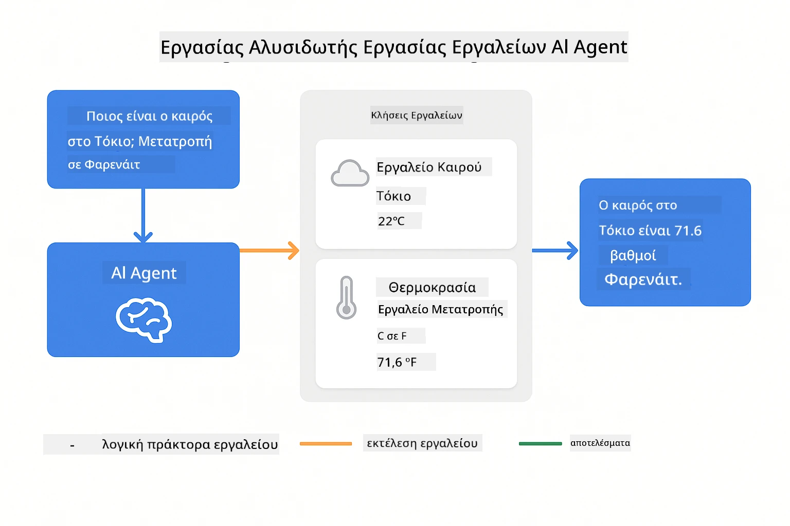
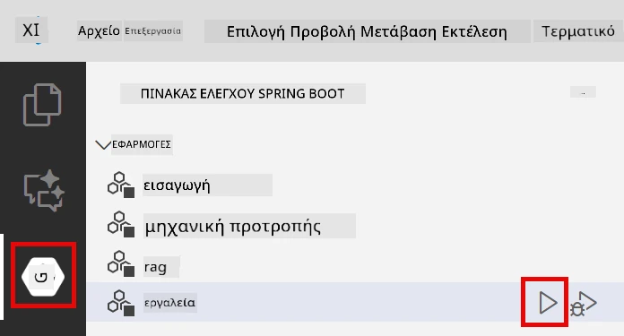

<!--
CO_OP_TRANSLATOR_METADATA:
{
  "original_hash": "844788938b26242f3cc54ce0d0951bea",
  "translation_date": "2026-01-05T23:28:30+00:00",
  "source_file": "04-tools/README.md",
  "language_code": "el"
}
-->
# Ενότητα 04: Πράκτορες AI με Εργαλεία

## Πίνακας Περιεχομένων

- [Τι θα μάθετε](../../../04-tools)
- [Προαπαιτούμενα](../../../04-tools)
- [Κατανόηση των Πρακτόρων AI με Εργαλεία](../../../04-tools)
- [Πώς Λειτουργεί η Κλήση Εργαλείων](../../../04-tools)
  - [Ορισμοί Εργαλείων](../../../04-tools)
  - [Λήψη Αποφάσεων](../../../04-tools)
  - [Εκτέλεση](../../../04-tools)
  - [Δημιουργία Απάντησης](../../../04-tools)
- [Αλυσιδωτή Χρήση Εργαλείων](../../../04-tools)
- [Εκτέλεση της Εφαρμογής](../../../04-tools)
- [Χρήση της Εφαρμογής](../../../04-tools)
  - [Δοκιμή Απλής Χρήσης Εργαλείων](../../../04-tools)
  - [Δοκιμή Αλυσιδωτής Χρήσης Εργαλείων](../../../04-tools)
  - [Προβολή Ροής Συνομιλίας](../../../04-tools)
  - [Πειραματισμός με Διάφορα Αιτήματα](../../../04-tools)
- [Κύριες Έννοιες](../../../04-tools)
  - [Πρότυπο ReAct (Σκέψη και Δράση)](../../../04-tools)
  - [Οι Περιγραφές των Εργαλείων Μετράνε](../../../04-tools)
  - [Διαχείριση Συνεδρίας](../../../04-tools)
  - [Διαχείριση Σφαλμάτων](../../../04-tools)
- [Διαθέσιμα Εργαλεία](../../../04-tools)
- [Πότε να Χρησιμοποιήσετε Πράκτορες με Βάση Εργαλεία](../../../04-tools)
- [Επόμενα Βήματα](../../../04-tools)

## Τι θα μάθετε

Μέχρι τώρα, έχετε μάθει πώς να έχετε συνομιλίες με AI, να δομείτε αποτελεσματικά τα ερεθίσματα, και να στηρίζετε τις απαντήσεις σας στα έγγραφα. Αλλά υπάρχει ακόμα ένας βασικός περιορισμός: τα μοντέλα γλώσσας μπορούν να παράγουν μόνο κείμενο. Δεν μπορούν να ελέγξουν τον καιρό, να κάνουν υπολογισμούς, να κάνουν ερωτήματα σε βάσεις δεδομένων ή να αλληλεπιδράσουν με εξωτερικά συστήματα.

Τα εργαλεία αλλάζουν αυτό. Δίνοντας στο μοντέλο πρόσβαση σε λειτουργίες που μπορεί να καλεί, το μετατρέπετε από γεννήτρια κειμένου σε πράκτορα που μπορεί να αναλαμβάνει δράσεις. Το μοντέλο αποφασίζει πότε χρειάζεται ένα εργαλείο, ποιο εργαλείο να χρησιμοποιήσει, και τι παραμέτρους να περάσει. Ο κώδικάς σας εκτελεί τη λειτουργία και επιστρέφει το αποτέλεσμα. Το μοντέλο ενσωματώνει αυτό το αποτέλεσμα στην απάντησή του.

## Προαπαιτούμενα

- Ολοκληρωμένη Ενότητα 01 (αναπτύχθηκαν πόροι Azure OpenAI)
- Αρχείο `.env` στον ριζικό κατάλογο με διαπιστευτήρια Azure (δημιουργημένο από `azd up` στην Ενότητα 01)

> **Σημείωση:** Αν δεν έχετε ολοκληρώσει την Ενότητα 01, ακολουθήστε πρώτα τις οδηγίες ανάπτυξης εκεί.

## Κατανόηση των Πρακτόρων AI με Εργαλεία

> **📝 Σημείωση:** Ο όρος "πράκτορες" σε αυτήν την ενότητα αναφέρεται σε βοηθούς AI με ενισχυμένες δυνατότητες κλήσης εργαλείων. Αυτό διαφέρει από τα πρότυπα **Agentic AI** (αυτόνομοι πράκτορες με σχεδίαση, μνήμη και πολύβητη σκέψη) που θα καλύψουμε στην [Ενότητα 05: MCP](../05-mcp/README.md).

Ένας πράκτορας AI με εργαλεία ακολουθεί ένα πρότυπο σκέψης και δράσης (ReAct):

1. Ο χρήστης θέτει μια ερώτηση
2. Ο πράκτορας συλλογίζεται τι χρειάζεται να μάθει
3. Ο πράκτορας αποφασίζει αν χρειάζεται εργαλείο για να απαντήσει
4. Αν ναι, ο πράκτορας καλεί το κατάλληλο εργαλείο με τις σωστές παραμέτρους
5. Το εργαλείο εκτελείται και επιστρέφει δεδομένα
6. Ο πράκτορας ενσωματώνει το αποτέλεσμα και παρέχει την τελική απάντηση


*Το πρότυπο ReAct - πώς οι πράκτορες AI εναλλάσσονται μεταξύ σκέψης και δράσης για την επίλυση προβλημάτων*

Αυτό συμβαίνει αυτόματα. Εσείς ορίζετε τα εργαλεία και τις περιγραφές τους. Το μοντέλο αναλαμβάνει τη λήψη αποφάσεων για το πότε και πώς να τα χρησιμοποιεί.

## Πώς Λειτουργεί η Κλήση Εργαλείων

### Ορισμοί Εργαλείων

[WeatherTool.java](../../../04-tools/src/main/java/com/example/langchain4j/agents/tools/WeatherTool.java) | [TemperatureTool.java](../../../04-tools/src/main/java/com/example/langchain4j/agents/tools/TemperatureTool.java)

Ορίζετε λειτουργίες με σαφείς περιγραφές και προδιαγραφές παραμέτρων. Το μοντέλο βλέπει αυτές τις περιγραφές στην εντολή συστήματος και καταλαβαίνει τι κάνει κάθε εργαλείο.

```java
@Component
public class WeatherTool {
    
    @Tool("Get the current weather for a location")
    public String getCurrentWeather(@P("Location name") String location) {
        // Η λογική αναζήτησης καιρού σας
        return "Weather in " + location + ": 22°C, cloudy";
    }
}

@AiService
public interface Assistant {
    String chat(@MemoryId String sessionId, @UserMessage String message);
}

// Ο βοηθός συνδέεται αυτόματα από το Spring Boot με:
// - Bean μοντέλου συνομιλίας
// - Όλες οι μέθοδοι @Tool από κλάσεις @Component
// - Παροχέας μνήμης συνομιλίας για διαχείριση συνεδριών
```

> **🤖 Δοκιμάστε με [GitHub Copilot](https://github.com/features/copilot) Chat:** Ανοίξτε το [`WeatherTool.java`](../../../04-tools/src/main/java/com/example/langchain4j/agents/tools/WeatherTool.java) και ρωτήστε:
> - "Πώς θα ενσωματώσω ένα πραγματικό API καιρού όπως το OpenWeatherMap αντί για ψεύτικα δεδομένα;"
> - "Τι κάνει μια καλή περιγραφή εργαλείου που βοηθά το AI να το χρησιμοποιήσει σωστά;"
> - "Πώς διαχειρίζομαι τα σφάλματα API και τα όρια κλήσεων στις υλοποιήσεις εργαλείων;"

### Λήψη Αποφάσεων

Όταν ένας χρήστης ρωτά "Ποιος είναι ο καιρός στο Σιάτλ;", το μοντέλο αναγνωρίζει ότι χρειάζεται το εργαλείο καιρού. Δημιουργεί μια κλήση λειτουργίας με την παράμετρο τοποθεσίας ορισμένη σε "Seattle".

### Εκτέλεση

[AgentService.java](../../../04-tools/src/main/java/com/example/langchain4j/agents/service/AgentService.java)

Το Spring Boot συνδέει αυτόματα το δηλωτικό interface `@AiService` με όλα τα εγγεγραμμένα εργαλεία, και το LangChain4j εκτελεί τις κλήσεις εργαλείων αυτόματα.

> **🤖 Δοκιμάστε με [GitHub Copilot](https://github.com/features/copilot) Chat:** Ανοίξτε το [`AgentService.java`](../../../04-tools/src/main/java/com/example/langchain4j/agents/service/AgentService.java) και ρωτήστε:
> - "Πώς λειτουργεί το πρότυπο ReAct και γιατί είναι αποτελεσματικό για πράκτορες AI;"
> - "Πώς αποφασίζει ο πράκτορας ποιο εργαλείο να χρησιμοποιήσει και σε ποια σειρά;"
> - "Τι συμβαίνει αν αποτύχει η εκτέλεση ενός εργαλείου - πώς πρέπει να διαχειρίζομαι τα σφάλματα με αξιοπιστία;"

### Δημιουργία Απάντησης

Το μοντέλο λαμβάνει τα δεδομένα καιρού και τα μορφοποιεί σε μια απάντηση φυσικής γλώσσας προς τον χρήστη.

### Γιατί να Χρησιμοποιήσετε Δηλωτικές Υπηρεσίες AI;

Αυτή η ενότητα χρησιμοποιεί το LangChain4j ενσωματωμένο με Spring Boot και δηλωτικά interface `@AiService`:

- **Αυτόματη διασύνδεση Spring Boot** - Εισάγονται αυτόματα το ChatModel και τα εργαλεία
- **Πρότυπο `@MemoryId`** - Αυτόματη διαχείριση μνήμης ανά συνεδρία
- **Μοναδική παρουσία** - Ο βοηθός δημιουργείται μία φορά και επαναχρησιμοποιείται για καλύτερη απόδοση
- **Εκτέλεση με ασφάλεια τύπων** - Κλήσεις Java με απευθείας μετατροπή τύπων
- **Διαχείριση πολλαπλών βημάτων** - Χειρίζεται αλυσιδωτές κλήσεις εργαλείων αυτόματα
- **Μηδενικό boilerplate** - Χωρίς χειροκίνητες κλήσεις AiServices.builder() ή HashMap διαχείρισης μνήμης

Εναλλακτικές προσεγγίσεις (χειροκίνητο `AiServices.builder()`) απαιτούν περισσότερο κώδικα και στερούνται των πλεονεκτημάτων ενσωμάτωσης Spring Boot.

## Αλυσιδωτή Χρήση Εργαλείων

**Αλυσιδωτή Χρήση Εργαλείων** - Το AI μπορεί να καλέσει πολλαπλά εργαλεία διαδοχικά. Ρωτήστε "Ποιος είναι ο καιρός στο Σιάτλ και να έχω μαζί μου ομπρέλα;" και δείτε το να αλυσιδώνει το `getCurrentWeather` με συλλογισμούς σχετικά με την ομπρέλα.

<a href="images/tool-chaining.png"></a>

*Διαδοχικές κλήσεις εργαλείων - η έξοδος ενός εργαλείου τροφοδοτεί τη συνέχεια της απόφασης*

**Ομαλή Αντιμετώπιση Αποτυχιών** - Ρωτήστε για καιρό σε μια πόλη που δεν υπάρχει στα ψεύτικα δεδομένα. Το εργαλείο επιστρέφει μήνυμα σφάλματος και το AI εξηγεί ότι δεν μπορεί να βοηθήσει. Τα εργαλεία αποτυγχάνουν με ασφάλεια.

Αυτό συμβαίνει σε μία μόνο γύρα συνομιλίας. Ο πράκτορας διαχειρίζεται αυτόνομα πολλαπλές κλήσεις εργαλείων.

## Εκτέλεση της Εφαρμογής

**Επαλήθευση ανάπτυξης:**

Βεβαιωθείτε ότι το αρχείο `.env` υπάρχει στον ριζικό κατάλογο με διαπιστευτήρια Azure (δημιουργημένο στην Ενότητα 01):
```bash
cat ../.env  # Πρέπει να εμφανίζει το AZURE_OPENAI_ENDPOINT, το API_KEY, το DEPLOYMENT
```

**Εκκίνηση της εφαρμογής:**

> **Σημείωση:** Αν έχετε ήδη ξεκινήσει όλες τις εφαρμογές με `./start-all.sh` από την Ενότητα 01, αυτή η ενότητα τρέχει ήδη στην θύρα 8084. Μπορείτε να παραλείψετε τις παρακάτω εντολές και να πάτε απευθείας στο http://localhost:8084.

**Επιλογή 1: Χρήση Spring Boot Dashboard (Συνιστάται για χρήστες VS Code)**

Το dev container περιλαμβάνει την επέκταση Spring Boot Dashboard, που παρέχει οπτικό περιβάλλον διαχείρισης όλων των εφαρμογών Spring Boot. Το βρίσκετε στο Activity Bar αριστερά στο VS Code (αναζητήστε το εικονίδιο Spring Boot).

Από το Spring Boot Dashboard μπορείτε να:
- Δείτε όλες τις διαθέσιμες εφαρμογές Spring Boot στον χώρο εργασίας
- Ξεκινήσετε/σταματήσετε εφαρμογές με ένα κλικ
- Δείτε τα logs εφαρμογών σε πραγματικό χρόνο
- Παρακολουθήσετε την κατάσταση εφαρμογών

Απλά πατήστε το κουμπί αναπαραγωγής δίπλα στο "tools" για να ξεκινήσετε αυτή τη μονάδα ή ξεκινήστε όλες τις μονάδες μαζί.



**Επιλογή 2: Χρήση shell scripts**

Ξεκινήστε όλες τις web εφαρμογές (εγχειρίδια 01-04):

**Bash:**
```bash
cd ..  # Από τον ριζικό κατάλογο
./start-all.sh
```

**PowerShell:**
```powershell
cd ..  # Από τον ριζικό κατάλογο
.\start-all.ps1
```

Ή ξεκινήστε μόνο αυτή τη μονάδα:

**Bash:**
```bash
cd 04-tools
./start.sh
```

**PowerShell:**
```powershell
cd 04-tools
.\start.ps1
```

Και τα δύο σενάρια φορτώνουν αυτόματα τις μεταβλητές περιβάλλοντος από το αρχείο `.env` στη ρίζα και θα χτίσουν τα JAR αν δεν υπάρχουν.

> **Σημείωση:** Αν προτιμάτε να χτίσετε όλες τις μονάδες χειροκίνητα πριν την εκκίνηση:
>
> **Bash:**
> ```bash
> cd ..  # Go to root directory
> mvn clean package -DskipTests
> ```
>
> **PowerShell:**
> ```powershell
> cd ..  # Go to root directory
> mvn clean package -DskipTests
> ```

Ανοίξτε το http://localhost:8084 στον περιηγητή σας.

**Για να σταματήσετε:**

**Bash:**
```bash
./stop.sh  # Μόνο αυτό το module
# Ή
cd .. && ./stop-all.sh  # Όλα τα modules
```

**PowerShell:**
```powershell
.\stop.ps1  # Μόνο αυτό το μονάδα
# Ή
cd ..; .\stop-all.ps1  # Όλες οι μονάδες
```

## Χρήση της Εφαρμογής

Η εφαρμογή παρέχει μια web διεπαφή όπου μπορείτε να αλληλεπιδράσετε με έναν πράκτορα AI που έχει πρόσβαση σε εργαλεία καιρού και μετατροπής θερμοκρασίας.

<a href="images/tools-homepage.png"></a>

*Η διεπαφή εργαλείων AI Agent - γρήγορα παραδείγματα και περιβάλλον συνομιλίας για αλληλεπίδραση με εργαλεία*

### Δοκιμή Απλής Χρήσης Εργαλείων

Ξεκινήστε με ένα απλό αίτημα: "Μετέτρεψε 100 βαθμούς Φαρενάιτ σε Κελσίου". Ο πράκτορας αναγνωρίζει ότι χρειάζεται το εργαλείο μετατροπής θερμοκρασίας, το καλεί με τις σωστές παραμέτρους και επιστρέφει το αποτέλεσμα. Παρατηρήστε πόσο φυσικό είναι αυτό – δεν καθορίσατε ποιο εργαλείο να χρησιμοποιηθεί ή πώς να το καλέσει.

### Δοκιμή Αλυσιδωτής Χρήσης Εργαλείων

Τώρα δοκιμάστε κάτι πιο σύνθετο: "Ποιος είναι ο καιρός στο Σιάτλ και μετέτρεψέ τον σε Φαρενάιτ;" Παρακολουθήστε τον πράκτορα να το επεξεργάζεται βήμα-βήμα. Πρώτα λαμβάνει τον καιρό (σε Κελσίου), αναγνωρίζει ότι πρέπει να μετατρέψει σε Φαρενάιτ, καλεί το εργαλείο μετατροπής, και συνδυάζει τα δύο αποτελέσματα σε μία απάντηση.

### Προβολή Ροής Συνομιλίας

Η διεπαφή συνομιλίας κρατά ιστορικό συνομιλιών, επιτρέποντάς σας να έχετε πολυβητες αλληλεπιδράσεις. Μπορείτε να δείτε όλα τα προηγούμενα ερωτήματα και απαντήσεις, διευκολύνοντας την παρακολούθηση της συνομιλίας και την κατανόηση του πώς ο πράκτορας δημιουργεί το πλαίσιο σε πολλές ανταλλαγές.

<a href="images/tools-conversation-demo.png"></a>

*Πολυβητη συνομιλία που δείχνει απλές μετατροπές, αναζητήσεις καιρού και αλυσιδωτή χρήση εργαλείων*

### Πειραματισμός με Διάφορα Αιτήματα

Δοκιμάστε διάφορους συνδυασμούς:
- Αναζητήσεις καιρού: "Ποιος είναι ο καιρός στο Τόκιο;"
- Μετατροπές θερμοκρασίας: "Τι είναι 25°C σε Κέλβιν;"
- Συνδυαστικά ερωτήματα: "Έλεγξε τον καιρό στο Παρίσι και πες μου αν είναι πάνω από 20°C"

Παρατηρήστε πώς ο πράκτορας ερμηνεύει τη φυσική γλώσσα και την αντιστοιχίζει στις κατάλληλες κλήσεις εργαλείων.

## Κύριες Έννοιες

### Πρότυπο ReAct (Σκέψη και Δράση)

Ο πράκτορας εναλλάσσεται μεταξύ σκέψης (απόφαση τι να κάνει) και δράσης (χρήση εργαλείων). Αυτό το πρότυπο επιτρέπει την αυτόνομη επίλυση προβλημάτων αντί απλώς την ανταπόκριση σε εντολές.

### Οι Περιγραφές των Εργαλείων Μετράνε

Η ποιότητα των περιγραφών των εργαλείων επηρεάζει άμεσα το πόσο καλά τα χρησιμοποιεί ο πράκτορας. Καθαρές, συγκεκριμένες περιγραφές βοηθούν το μοντέλο να καταλάβει πότε και πώς να καλεί κάθε εργαλείο.

### Διαχείριση Συνεδρίας

Η σημείωση `@MemoryId` επιτρέπει αυτόματη διαχείριση μνήμης ανά συνεδρία. Κάθε αναγνωριστικό συνεδρίας λαμβάνει το δικό του στιγμιότυπο `ChatMemory` που διαχειρίζεται το bean `ChatMemoryProvider`, εξαλείφοντας την ανάγκη χειροκίνητης παρακολούθησης μνήμης.

### Διαχείριση Σφαλμάτων

Τα εργαλεία μπορεί να αποτύχουν – API μπορεί να κάνουν timeout, οι παράμετροι να είναι άκυροι, εξωτερικές υπηρεσίες να πέφτουν. Οι πράκτορες παραγωγής χρειάζονται διαχείριση σφαλμάτων ώστε το μοντέλο να μπορεί να εξηγεί προβλήματα ή να δοκιμάζει εναλλακτικές.

## Διαθέσιμα Εργαλεία

**Εργαλεία Καιρού** (ψεύτικα δεδομένα για επίδειξη):
- Λήψη τρέχοντος καιρού για μια τοποθεσία
- Πρόβλεψη καιρού για πολλές μέρες

**Εργαλεία Μετατροπής Θερμοκρασίας**:
- Κελσίου σε Φαρενάιτ
- Φαρενάιτ σε Κελσίου
- Κελσίου σε Κέλβιν
- Κέλβιν σε Κελσίου
- Φαρενάιτ σε Κέλβιν
- Κέλβιν σε Φαρενάιτ

Αυτά είναι απλά παραδείγματα, αλλά το πρότυπο επεκτείνεται σε οποιαδήποτε λειτουργία: ερωτήματα βάσης δεδομένων, κλήσεις API, υπολογισμούς, λειτουργίες αρχείων ή εντολές συστήματος.

## Πότε να Χρησιμοποιήσετε Πράκτορες με Βάση Εργαλεία

**Χρησιμοποιήστε εργαλεία όταν:**
- Η απάντηση απαιτεί δεδομένα σε πραγματικό χρόνο (καιρός, τιμές μετοχών, αποθέματα)
- Χρειάζεται να κάνετε υπολογισμούς πέρα από απλή αριθμητική
- Πρόσβαση σε βάσεις δεδομένων ή APIs
- Ανάληψη δράσεων (αποστολή email, δημιουργία αιτημάτων, ενημέρωση καταγραφών)
- Συνδυασμός πολλαπλών πηγών δεδομένων

**Μην χρησιμοποιείτε εργαλεία όταν:**
- Οι ερωτήσεις απαντιούνται από γενικές γνώσεις
- Η απάντηση είναι καθαρά συνομιλιακή
- Η καθυστέρηση από τα εργαλεία θα έκανε την εμπειρία υπερβολικά αργή

## Επόμενα Βήματα

**Επόμενη Ενότητα:** [05-mcp - Πρωτόκολλο Περιεχομένου Μοντέλου (MCP)](../05-mcp/README.md)

---

**Πλοήγηση:** [← Προηγούμενο: Ενότητα 03 - RAG](../03-rag/README.md) | [Πίσω στην Αρχική](../README.md) | [Επόμενο: Ενότητα 05 - MCP →](../05-mcp/README.md)

---

<!-- CO-OP TRANSLATOR DISCLAIMER START -->
**Αποποίηση ευθυνών**:  
Αυτό το έγγραφο έχει μεταφραστεί χρησιμοποιώντας την υπηρεσία αυτόματης μετάφρασης AI [Co-op Translator](https://github.com/Azure/co-op-translator). Παρά τις προσπάθειές μας για ακρίβεια, παρακαλούμε να γνωρίζετε ότι οι αυτόματες μεταφράσεις μπορεί να περιέχουν λάθη ή ανακρίβειες. Το πρωτότυπο έγγραφο στη γλώσσα του θεωρείται η αυθεντική πηγή. Για κρίσιμες πληροφορίες, συνιστάται επαγγελματική ανθρώπινη μετάφραση. Δεν φέρουμε ευθύνη για τυχόν παρεξηγήσεις ή παρανοήσεις που προκύπτουν από τη χρήση αυτής της μετάφρασης.
<!-- CO-OP TRANSLATOR DISCLAIMER END -->