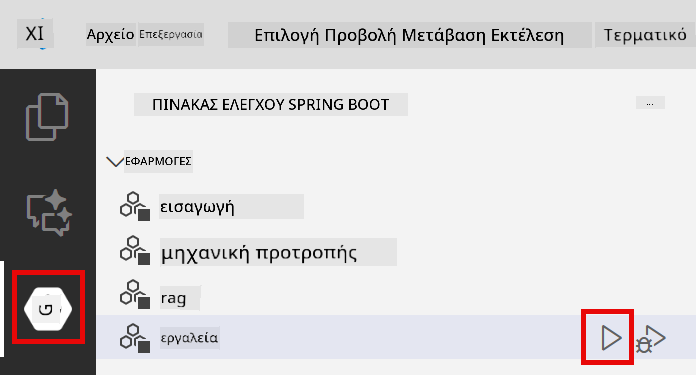
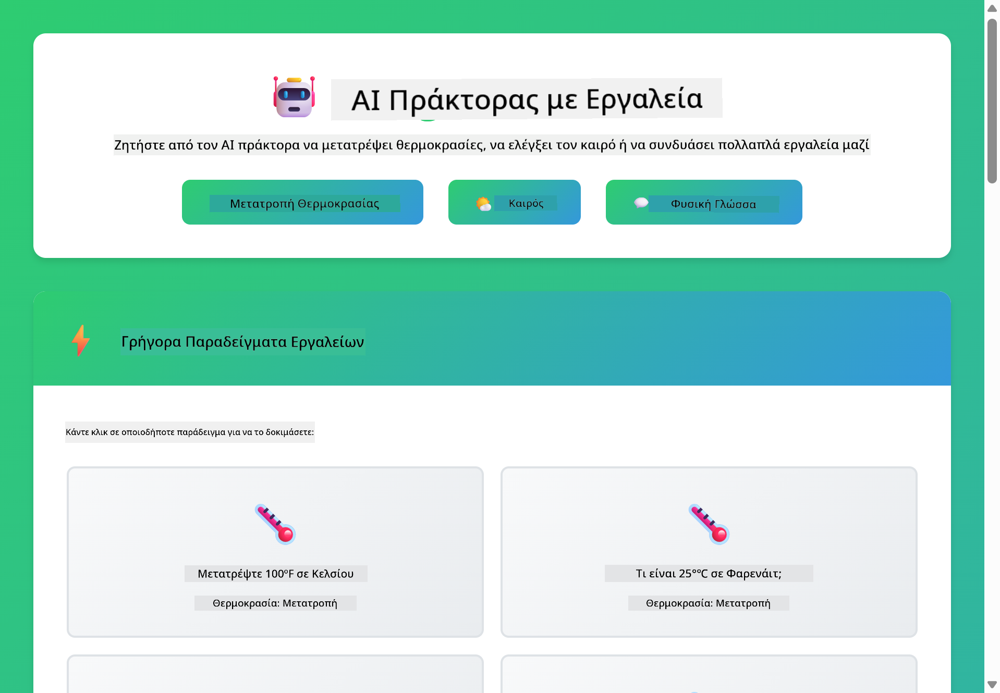
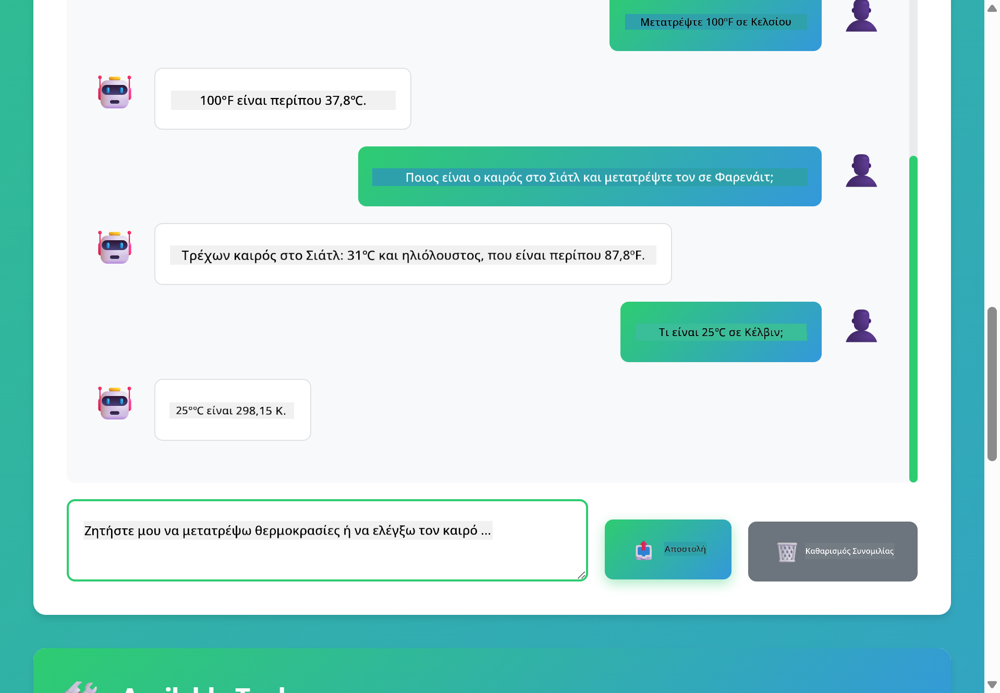

<!--
CO_OP_TRANSLATOR_METADATA:
{
  "original_hash": "13ec450c12cdd1a863baa2b778f27cd7",
  "translation_date": "2025-12-31T00:50:23+00:00",
  "source_file": "04-tools/README.md",
  "language_code": "el"
}
-->
# Module 04: Πράκτορες AI με Εργαλεία

## Πίνακας Περιεχομένων

- [Τι θα μάθετε](../../../04-tools)
- [Προαπαιτούμενα](../../../04-tools)
- [Κατανόηση των Πρακτόρων AI με Εργαλεία](../../../04-tools)
- [Πώς λειτουργεί η κλήση εργαλείων](../../../04-tools)
  - [Ορισμοί Εργαλείων](../../../04-tools)
  - [Λήψη Αποφάσεων](../../../04-tools)
  - [Εκτέλεση](../../../04-tools)
  - [Δημιουργία Απάντησης](../../../04-tools)
- [Σύνδεση Εργαλείων](../../../04-tools)
- [Εκτέλεση της Εφαρμογής](../../../04-tools)
- [Χρήση της Εφαρμογής](../../../04-tools)
  - [Δοκιμάστε Απλή Χρήση Εργαλείων](../../../04-tools)
  - [Δοκιμάστε Σύνδεση Εργαλείων](../../../04-tools)
  - [Δείτε τη Ροή Συζήτησης](../../../04-tools)
  - [Παρατηρήστε τον συλλογισμό](../../../04-tools)
  - [Πειραματιστείτε με Διάφορα Αιτήματα](../../../04-tools)
- [Κύριες Έννοιες](../../../04-tools)
  - [Πρότυπο ReAct (Συλλογισμός και Δράση)](../../../04-tools)
  - [Οι Περιγραφές Εργαλείων Έχουν Σημασία](../../../04-tools)
  - [Διαχείριση Συνεδρίας](../../../04-tools)
  - [Διαχείριση Σφαλμάτων](../../../04-tools)
- [Διαθέσιμα Εργαλεία](../../../04-tools)
- [Πότε να Χρησιμοποιήσετε Πράκτορες με Εργαλεία](../../../04-tools)
- [Επόμενα Βήματα](../../../04-tools)

## Τι θα μάθετε

Μέχρι τώρα, έχετε μάθει πώς να έχετε συνομιλίες με την AI, να δομείτε αποτελεσματικά τα prompts και να τεκμηριώνετε τις απαντήσεις σας με βάση τα έγγραφά σας. Αλλά υπάρχει ακόμα ένας βασικός περιορισμός: τα γλωσσικά μοντέλα μπορούν να παράγουν μόνο κείμενο. Δεν μπορούν να ελέγξουν τον καιρό, να εκτελέσουν υπολογισμούς, να κάνουν ερωτήματα σε βάσεις δεδομένων ή να αλληλεπιδράσουν με εξωτερικά συστήματα.

Τα εργαλεία αλλάζουν αυτό. Δίνοντας στο μοντέλο πρόσβαση σε συναρτήσεις που μπορεί να καλεί, το μετατρέπετε από γεννήτρια κειμένου σε έναν πράκτορα που μπορεί να πραγματοποιεί ενέργειες. Το μοντέλο αποφασίζει πότε χρειάζεται ένα εργαλείο, ποιο εργαλείο να χρησιμοποιήσει και ποιες παραμέτρους να περάσει. Ο κώδικάς σας εκτελεί τη συνάρτηση και επιστρέφει το αποτέλεσμα. Το μοντέλο ενσωματώνει αυτό το αποτέλεσμα στην απάντησή του.

## Προαπαιτούμενα

- Ολοκλήρωση Module 01 (αναπτύχθηκαν πόροι Azure OpenAI)
- Αρχείο `.env` στον ριζικό κατάλογο με διαπιστευτήρια Azure (δημιουργήθηκε από `azd up` στο Module 01)

> **Σημείωση:** Αν δεν έχετε ολοκληρώσει το Module 01, ακολουθήστε πρώτα τις οδηγίες ανάπτυξης εκεί.

## Κατανόηση των Πρακτόρων AI με Εργαλεία

> **📝 Σημείωση:** Ο όρος "πράκτορες" σε αυτό το module αναφέρεται σε βοηθούς AI που έχουν ενισχυθεί με δυνατότητες κλήσης εργαλείων. Αυτό διαφέρει από τα **Agentic AI** πρότυπα (αυτόνομοι πράκτορες με σχεδιασμό, μνήμη και πολυσταδιακή συλλογιστική) που θα καλύψουμε στο [Module 05: MCP](../05-mcp/README.md).

Ένας πράκτορας AI με εργαλεία ακολουθεί ένα πρότυπο συλλογισμού και δράσης (ReAct):

1. Ο χρήστης κάνει μια ερώτηση
2. Ο πράκτορας συλλογίζεται τι χρειάζεται να γνωρίζει
3. Ο πράκτορας αποφασίζει αν χρειάζεται ένα εργαλείο για να απαντήσει
4. Αν ναι, ο πράκτορας καλεί το κατάλληλο εργαλείο με τις σωστές παραμέτρους
5. Το εργαλείο εκτελείται και επιστρέφει δεδομένα
6. Ο πράκτορας ενσωματώνει το αποτέλεσμα και παρέχει την τελική απάντηση


*Το πρότυπο ReAct - πώς οι πράκτορες AI εναλλάσσονται μεταξύ συλλογισμού και δράσης για να λύσουν προβλήματα*

Αυτό συμβαίνει αυτόματα. Εσείς ορίζετε τα εργαλεία και τις περιγραφές τους. Το μοντέλο αναλαμβάνει τη λήψη αποφάσεων για το πότε και πώς να τα χρησιμοποιήσει.

## Πώς λειτουργεί η κλήση εργαλείων

**Ορισμοί Εργαλείων** - [WeatherTool.java](../../../04-tools/src/main/java/com/example/langchain4j/agents/tools/WeatherTool.java) | [TemperatureTool.java](../../../04-tools/src/main/java/com/example/langchain4j/agents/tools/TemperatureTool.java)

Ορίζετε συναρτήσεις με σαφείς περιγραφές και προδιαγραφές παραμέτρων. Το μοντέλο βλέπει αυτές τις περιγραφές στο system prompt του και κατανοεί τι κάνει κάθε εργαλείο.

```java
@Component
public class WeatherTool {
    
    @Tool("Get the current weather for a location")
    public String getCurrentWeather(@P("Location name") String location) {
        // Η λογική αναζήτησης του καιρού σας
        return "Weather in " + location + ": 22°C, cloudy";
    }
}

@AiService
public interface Assistant {
    String chat(@MemoryId String sessionId, @UserMessage String message);
}

// Ο βοηθός συνδέεται αυτόματα από το Spring Boot με:
// - το bean ChatModel
// - Όλες οι μέθοδοι @Tool από κλάσεις @Component
// - ChatMemoryProvider για διαχείριση συνεδριών
```

> **🤖 Δοκιμάστε με [GitHub Copilot](https://github.com/features/copilot) Chat:** Open [`WeatherTool.java`](../../../04-tools/src/main/java/com/example/langchain4j/agents/tools/WeatherTool.java) and ask:
> - "Πώς θα ενσωμάτωνα ένα πραγματικό API καιρού όπως το OpenWeatherMap αντί για ψευδοδεδομένα;"
> - "Τι κάνει μια καλή περιγραφή εργαλείου που βοηθά την AI να το χρησιμοποιήσει σωστά;"
> - "Πώς χειρίζομαι σφάλματα API και όρια ρυθμού (rate limits) στην υλοποίηση εργαλείων;"

**Λήψη Αποφάσεων**

Όταν ένας χρήστης ρωτάει "Τι καιρό κάνει στο Seattle;", το μοντέλο αναγνωρίζει ότι χρειάζεται το εργαλείο καιρού. Δημιουργεί μια κλήση συνάρτησης με την παράμετρο τοποθεσίας ορισμένη σε "Seattle".

**Εκτέλεση** - [AgentService.java](../../../04-tools/src/main/java/com/example/langchain4j/agents/service/AgentService.java)

Το Spring Boot κάνει auto-wire στη δηλωτική διεπαφή `@AiService` με όλα τα καταχωρημένα εργαλεία, και το LangChain4j εκτελεί τις κλήσεις εργαλείων αυτόματα.

> **🤖 Δοκιμάστε με [GitHub Copilot](https://github.com/features/copilot) Chat:** Open [`AgentService.java`](../../../04-tools/src/main/java/com/example/langchain4j/agents/service/AgentService.java) and ask:
> - "Πώς λειτουργεί το πρότυπο ReAct και γιατί είναι αποτελεσματικό για πράκτορες AI;"
> - "Πώς αποφασίζει ο πράκτορας ποιο εργαλείο να χρησιμοποιήσει και με ποια σειρά;"
> - "Τι συμβαίνει αν η εκτέλεση ενός εργαλείου αποτύχει - πώς πρέπει να χειριστώ τα σφάλματα με αξιοπιστία;"

**Δημιουργία Απάντησης**

Το μοντέλο λαμβάνει τα δεδομένα του καιρού και τα διαμορφώνει σε μια φυσική απάντηση για τον χρήστη.

### Γιατί να χρησιμοποιήσετε δηλωτικές υπηρεσίες AI;

Αυτό το module χρησιμοποιεί την ενσωμάτωση του LangChain4j με Spring Boot και δηλωτικές διεπαφές `@AiService`:

- **Spring Boot auto-wiring** - Το ChatModel και τα εργαλεία εισάγονται αυτόματα
- **@MemoryId pattern** - Αυτόματη διαχείριση μνήμης βάσει συνεδρίας
- **Single instance** - Ο βοηθός δημιουργείται μία φορά και επαναχρησιμοποιείται για καλύτερη απόδοση
- **Type-safe execution** - Κλήσεις μεθόδων Java απευθείας με μετατροπή τύπων
- **Ορχήστρωση πολλών γύρων** - Διαχειρίζεται την αλυσιδωτή χρήση εργαλείων αυτόματα
- **Μηδενικό boilerplate** - Χωρίς χειροκίνητες κλήσεις AiServices.builder() ή HashMap μνήμης

Εναλλακτικές προσεγγίσεις (χειροκίνητο `AiServices.builder()`) απαιτούν περισσότερο κώδικα και στερούνται των πλεονεκτημάτων ενσωμάτωσης του Spring Boot.

## Σύνδεση Εργαλείων

**Σύνδεση Εργαλείων** - Ο πράκτορας AI μπορεί να καλέσει πολλαπλά εργαλεία σε αλληλουχία. Ρωτήστε "Τι καιρό κάνει στο Seattle και πρέπει να πάρω ομπρέλα;" και δείτε πώς συνδυάζει το `getCurrentWeather` με συλλογισμό για εξοπλισμό βροχής.

<a href="images/tool-chaining.png"></a>

*Διαδοχικές κλήσεις εργαλείων - η έξοδος ενός εργαλείου τροφοδοτεί την επόμενη απόφαση*

**Ελεγχόμενες Αποτυχίες** - Ζητήστε τον καιρό σε μια πόλη που δεν υπάρχει στα ψευδοδεδομένα. Το εργαλείο επιστρέφει μήνυμα σφάλματος και η AI εξηγεί ότι δεν μπορεί να βοηθήσει. Τα εργαλεία αποτυγχάνουν με ασφάλεια.

Αυτό συμβαίνει σε μία μόνο στροφή της συνομιλίας. Ο πράκτορας ορχηστρώνει πολλαπλές κλήσεις εργαλείων αυτόνομα.

## Εκτέλεση της Εφαρμογής

**Επαλήθευση ανάπτυξης:**

Βεβαιωθείτε ότι το αρχείο `.env` υπάρχει στον ριζικό κατάλογο με διαπιστευτήρια Azure (δημιουργήθηκε κατά το Module 01):
```bash
cat ../.env  # Πρέπει να εμφανίζει AZURE_OPENAI_ENDPOINT, API_KEY, DEPLOYMENT
```

**Εκκίνηση της εφαρμογής:**

> **Σημείωση:** Αν έχετε ήδη ξεκινήσει όλες τις εφαρμογές χρησιμοποιώντας `./start-all.sh` από το Module 01, αυτό το module τρέχει ήδη στην θύρα 8084. Μπορείτε να παραλείψετε τις εντολές εκκίνησης παρακάτω και να μεταβείτε απευθείας στο http://localhost:8084.

**Επιλογή 1: Χρήση του Spring Boot Dashboard (Συνιστάται για χρήστες VS Code)**

Το dev container περιλαμβάνει την επέκταση Spring Boot Dashboard, που παρέχει ένα οπτικό περιβάλλον για τη διαχείριση όλων των εφαρμογών Spring Boot. Μπορείτε να τη βρείτε στη γραμμή δραστηριοτήτων στην αριστερή πλευρά του VS Code (ψάξτε για το εικονίδιο Spring Boot).

Από το Spring Boot Dashboard, μπορείτε να:
- Δείτε όλες τις διαθέσιμες εφαρμογές Spring Boot στο workspace
- Εκκινήσετε/σταματήσετε εφαρμογές με ένα κλικ
- Δείτε τα logs της εφαρμογής σε πραγματικό χρόνο
- Παρακολουθήσετε την κατάσταση της εφαρμογής

Απλά κάντε κλικ στο κουμπί play δίπλα στο "tools" για να ξεκινήσετε αυτό το module, ή ξεκινήστε όλα τα modules ταυτόχρονα.



**Επιλογή 2: Χρήση shell scripts**

Ξεκινήστε όλες τις web εφαρμογές (modules 01-04):

**Bash:**
```bash
cd ..  # Από τον ριζικό κατάλογο
./start-all.sh
```

**PowerShell:**
```powershell
cd ..  # Από τον ριζικό κατάλογο
.\start-all.ps1
```

Ή ξεκινήστε μόνο αυτό το module:

**Bash:**
```bash
cd 04-tools
./start.sh
```

**PowerShell:**
```powershell
cd 04-tools
.\start.ps1
```

Και τα δύο scripts φορτώνουν αυτόματα μεταβλητές περιβάλλοντος από το αρχείο `.env` στον ριζικό κατάλογο και θα χτίσουν τα JARs αν δεν υπάρχουν.

> **Σημείωση:** Αν προτιμάτε να χτίσετε όλα τα modules χειροκίνητα πριν την εκκίνηση:
>
> **Bash:**
> ```bash
> cd ..  # Go to root directory
> mvn clean package -DskipTests
> ```
>
> **PowerShell:**
> ```powershell
> cd ..  # Go to root directory
> mvn clean package -DskipTests
> ```

Ανοίξτε το http://localhost:8084 στον περιηγητή σας.

**Για να σταματήσετε:**

**Bash:**
```bash
./stop.sh  # Μόνο αυτή η μονάδα
# Ή
cd .. && ./stop-all.sh  # Όλες οι μονάδες
```

**PowerShell:**
```powershell
.\stop.ps1  # Μόνο αυτή η μονάδα
# Ή
cd ..; .\stop-all.ps1  # Όλες οι μονάδες
```

## Χρήση της Εφαρμογής

Η εφαρμογή παρέχει μια web διεπαφή όπου μπορείτε να αλληλεπιδράσετε με έναν πράκτορα AI που έχει πρόσβαση σε εργαλεία καιρού και μετατροπής θερμοκρασίας.

<a href="images/tools-homepage.png"></a>

*Η διεπαφή Εργαλείων Πράκτορα AI - γρήγορα παραδείγματα και διεπαφή chat για αλληλεπίδραση με εργαλεία*

**Δοκιμάστε Απλή Χρήση Εργαλείων**

Ξεκινήστε με ένα απλό αίτημα: "Μετατρέψτε 100 βαθμούς Fahrenheit σε Celsius". Ο πράκτορας αναγνωρίζει ότι χρειάζεται το εργαλείο μετατροπής θερμοκρασίας, το καλεί με τις σωστές παραμέτρους και επιστρέφει το αποτέλεσμα. Παρατηρήστε πόσο φυσικό είναι αυτό — δεν χρειάστηκε να καθορίσετε ποιο εργαλείο να χρησιμοποιήσει ή πώς να το καλέσει.

**Δοκιμάστε Σύνδεση Εργαλείων**

Τώρα δοκιμάστε κάτι πιο σύνθετο: "Τι καιρό κάνει στο Seattle και μετατρέψτε τον σε Fahrenheit;" Παρατηρήστε τον πράκτορα να το επεξεργάζεται σε βήματα. Πρώτα παίρνει τον καιρό (που επιστρέφει σε Κελσίου), αναγνωρίζει ότι πρέπει να το μετατρέψει σε Φαρενάιτ, καλεί το εργαλείο μετατροπής και συνδυάζει και τα δύο αποτελέσματα σε μία απάντηση.

**Δείτε τη Ροή Συζήτησης**

Η διεπαφή chat διατηρεί το ιστορικό συνομιλίας, επιτρέποντάς σας να έχετε πολυστροφή αλληλεπίδραση. Μπορείτε να δείτε όλες τις προηγούμενες ερωτήσεις και απαντήσεις, καθιστώντας εύκολο να παρακολουθείτε τη συνομιλία και να κατανοείτε πώς ο πράκτορας χτίζει το context σε πολλαπλές ανταλλαγές.

<a href="images/tools-conversation-demo.png"></a>

*Πολυστροφή συνομιλία που δείχνει απλές μετατροπές, αναζητήσεις καιρού και σύνδεση εργαλείων*

**Πειραματιστείτε με Διάφορα Αιτήματα**

Δοκιμάστε διάφορους συνδυασμούς:
- Αναζητήσεις καιρού: "Τι καιρό κάνει στο Tokyo;"
- Μετατροπές θερμοκρασίας: "Τι είναι 25°C σε Kelvin;"
- Συνδυασμένα ερωτήματα: "Ελέγξτε τον καιρό στο Paris και πείτε μου αν είναι πάνω από 20°C"

Παρατηρήστε πώς ο πράκτορας ερμηνεύει τη φυσική γλώσσα και την απεικονίζει σε κατάλληλες κλήσεις εργαλείων.

## Κύριες Έννοιες

**Πρότυπο ReAct (Συλλογισμός και Δράση)**

Ο πράκτορας εναλλάσσεται μεταξύ συλλογισμού (αποφασίζοντας τι πρέπει να κάνει) και δράσης (χρησιμοποιώντας εργαλεία). Αυτό το πρότυπο επιτρέπει την αυτόνομη επίλυση προβλημάτων αντί απλώς την εκτέλεση οδηγιών.

**Οι Περιγραφές Εργαλείων Έχουν Σημασία**

Η ποιότητα των περιγραφών των εργαλείων επηρεάζει άμεσα το πόσο καλά τα χρησιμοποιεί ο πράκτορας. Σαφείς, συγκεκριμένες περιγραφές βοηθούν το μοντέλο να κατανοήσει πότε και πώς να καλέσει κάθε εργαλείο.

**Διαχείριση Συνεδρίας**

Η ανάρτηση `@MemoryId` επιτρέπει αυτόματη διαχείριση μνήμης βάσει συνεδρίας. Κάθε session ID αποκτά το δικό του `ChatMemory` instance που διαχειρίζεται το bean `ChatMemoryProvider`, εξαλείφοντας την ανάγκη χειροκίνητης παρακολούθησης μνήμης.

**Διαχείριση Σφαλμάτων**

Τα εργαλεία μπορούν να αποτύχουν - timeout APIs, παράμετροι μπορεί να είναι άκυρες, εξωτερικές υπηρεσίες να πέσουν. Οι παραγωγικοί πράκτορες χρειάζονται χειρισμό σφαλμάτων ώστε το μοντέλο να μπορεί να εξηγήσει προβλήματα ή να δοκιμάσει εναλλακτικές.

## Διαθέσιμα Εργαλεία

**Εργαλεία Καιρού** (ψευδοδεδομένα για επίδειξη):
- Λήψη τρέχοντος καιρού για μια τοποθεσία
- Λήψη προβλέψεων πολλών ημερών

**Εργαλεία Μετατροπής Θερμοκρασίας**:
- Κελσίου σε Φαρενάιτ
- Φαρενάιτ σε Κελσίου
- Κελσίου σε Kelvin
- Kelvin σε Κελσίου
- Φαρενάιτ σε Kelvin
- Kelvin σε Φαρενάιτ

Αυτά είναι απλά παραδείγματα, αλλά το πρότυπο εκτείνεται σε οποιαδήποτε λειτουργία: ερωτήματα βάσεων δεδομένων, κλήσεις API, υπολογισμοί, λειτουργίες αρχείων ή εντολές συστήματος.

## Πότε να Χρησιμοποιήσετε Πράκτορες με Εργαλεία

**Χρησιμοποιήστε εργαλεία όταν:**
- Η απάντηση απαιτεί δεδομένα σε πραγματικό χρόνο (καιρός, τιμές μετοχών, απόθεμα)
- Πρέπει να εκτελέσετε υπολογισμούς πέρα από απλή αριθμητική
- Πρόσβαση σε βάσεις δεδομένων ή APIs
- Ενέργειες (αποστολή emails, δημιουργία tickets, ενημέρωση εγγραφών)
- Συνδυασμός πολλαπλών πηγών δεδομένων

**Μην χρησιμοποιείτε εργαλεία όταν:**
- Οι ερωτήσεις μπορούν να απαντηθούν από γενικές γνώσεις
- Η απάντηση είναι καθαρά συνομιλητική
- Η καθυστέρηση των εργαλείων θα κάνει την εμπειρία πολύ αργή

## Επόμενα Βήματα

**Επόμενο Module:** [05-mcp - Model Context Protocol (MCP)](../05-mcp/README.md)

---

**Πλοήγηση:** [← Προηγούμενο: Module 03 - RAG](../03-rag/README.md) | [Πίσω στην Αρχική](../README.md) | [Επόμενο: Module 05 - MCP →](../05-mcp/README.md)

---

<!-- CO-OP TRANSLATOR DISCLAIMER START -->
Αποποίηση ευθυνών:
Αυτό το έγγραφο έχει μεταφραστεί χρησιμοποιώντας την υπηρεσία αυτόματης μετάφρασης με τεχνητή νοημοσύνη [Co-op Translator](https://github.com/Azure/co-op-translator). Παρότι καταβάλλουμε προσπάθειες για ακρίβεια, παρακαλούμε να σημειώσετε ότι οι αυτοματοποιημένες μεταφράσεις ενδέχεται να περιέχουν λάθη ή ανακρίβειες. Το πρωτότυπο έγγραφο στη γλώσσα στην οποία συντάχθηκε πρέπει να θεωρείται η αυθεντική πηγή. Για κρίσιμες πληροφορίες συνιστάται επαγγελματική μετάφραση από εξειδικευμένο ανθρώπινο μεταφραστή. Δεν φέρουμε ευθύνη για τυχόν παρεξηγήσεις ή λανθασμένες ερμηνείες που προκύπτουν από τη χρήση αυτής της μετάφρασης.
<!-- CO-OP TRANSLATOR DISCLAIMER END -->