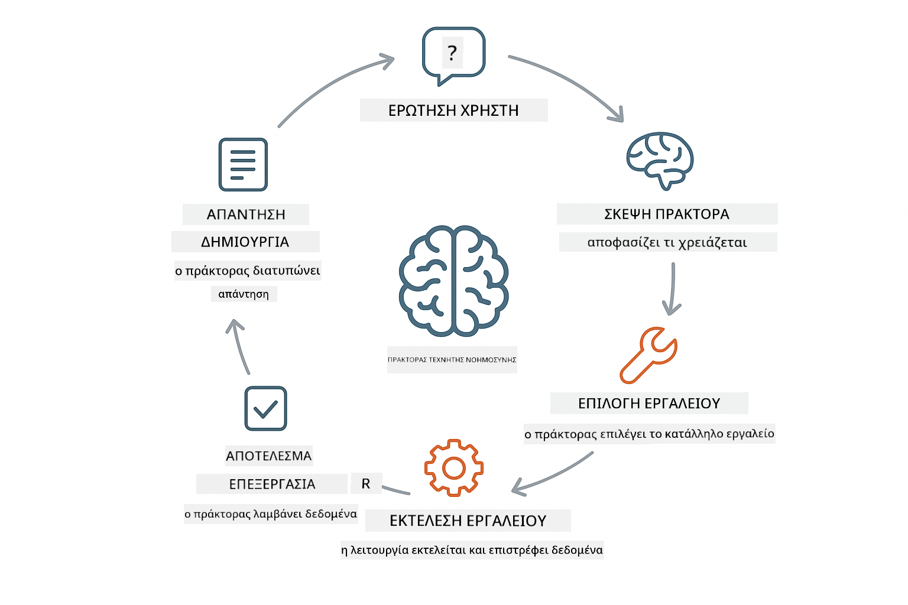

<!--
CO_OP_TRANSLATOR_METADATA:
{
  "original_hash": "aa23f106e7f53270924c9dd39c629004",
  "translation_date": "2025-12-13T18:55:25+00:00",
  "source_file": "04-tools/README.md",
  "language_code": "el"
}
-->
# Ενότητα 04: Πράκτορες Τεχνητής Νοημοσύνης με Εργαλεία

## Πίνακας Περιεχομένων

- [Τι θα μάθετε](../../../04-tools)
- [Προαπαιτούμενα](../../../04-tools)
- [Κατανόηση Πρακτόρων ΤΝ με Εργαλεία](../../../04-tools)
- [Πώς Λειτουργεί η Κλήση Εργαλείων](../../../04-tools)
  - [Ορισμοί Εργαλείων](../../../04-tools)
  - [Λήψη Αποφάσεων](../../../04-tools)
  - [Εκτέλεση](../../../04-tools)
  - [Δημιουργία Απάντησης](../../../04-tools)
- [Αλυσιδωτή Χρήση Εργαλείων](../../../04-tools)
- [Εκτέλεση της Εφαρμογής](../../../04-tools)
- [Χρήση της Εφαρμογής](../../../04-tools)
  - [Δοκιμή Απλής Χρήσης Εργαλείου](../../../04-tools)
  - [Δοκιμή Αλυσιδωτής Χρήσης Εργαλείων](../../../04-tools)
  - [Προβολή Ροής Συνομιλίας](../../../04-tools)
  - [Παρατήρηση της Λογικής](../../../04-tools)
  - [Πειραματισμός με Διάφορα Αιτήματα](../../../04-tools)
- [Κύριες Έννοιες](../../../04-tools)
  - [Πρότυπο ReAct (Λογική και Δράση)](../../../04-tools)
  - [Σημασία Περιγραφών Εργαλείων](../../../04-tools)
  - [Διαχείριση Συνεδρίας](../../../04-tools)
  - [Διαχείριση Σφαλμάτων](../../../04-tools)
- [Διαθέσιμα Εργαλεία](../../../04-tools)
- [Πότε να Χρησιμοποιείτε Πράκτορες με Εργαλεία](../../../04-tools)
- [Επόμενα Βήματα](../../../04-tools)

## Τι θα μάθετε

Μέχρι τώρα, έχετε μάθει πώς να έχετε συνομιλίες με ΤΝ, να δομείτε αποτελεσματικά τα prompts και να βασίζετε τις απαντήσεις σας στα έγγραφά σας. Αλλά υπάρχει ακόμα ένας θεμελιώδης περιορισμός: τα γλωσσικά μοντέλα μπορούν μόνο να παράγουν κείμενο. Δεν μπορούν να ελέγξουν τον καιρό, να κάνουν υπολογισμούς, να ερωτήσουν βάσεις δεδομένων ή να αλληλεπιδράσουν με εξωτερικά συστήματα.

Τα εργαλεία αλλάζουν αυτό. Δίνοντας στο μοντέλο πρόσβαση σε λειτουργίες που μπορεί να καλέσει, το μετατρέπετε από γεννήτρια κειμένου σε πράκτορα που μπορεί να αναλάβει δράσεις. Το μοντέλο αποφασίζει πότε χρειάζεται ένα εργαλείο, ποιο εργαλείο να χρησιμοποιήσει και ποια παραμέτρους να περάσει. Ο κώδικάς σας εκτελεί τη λειτουργία και επιστρέφει το αποτέλεσμα. Το μοντέλο ενσωματώνει αυτό το αποτέλεσμα στην απάντησή του.

## Προαπαιτούμενα

- Ολοκληρωμένη Ενότητα 01 (αναπτύχθηκαν πόροι Azure OpenAI)
- Αρχείο `.env` στον ριζικό φάκελο με διαπιστευτήρια Azure (δημιουργήθηκε από `azd up` στην Ενότητα 01)

> **Σημείωση:** Αν δεν έχετε ολοκληρώσει την Ενότητα 01, ακολουθήστε πρώτα τις οδηγίες ανάπτυξης εκεί.

## Κατανόηση Πρακτόρων ΤΝ με Εργαλεία

Ένας πράκτορας ΤΝ με εργαλεία ακολουθεί ένα πρότυπο λογικής και δράσης (ReAct):

1. Ο χρήστης κάνει μια ερώτηση
2. Ο πράκτορας σκέφτεται τι χρειάζεται να μάθει
3. Ο πράκτορας αποφασίζει αν χρειάζεται εργαλείο για να απαντήσει
4. Αν ναι, καλεί το κατάλληλο εργαλείο με τις σωστές παραμέτρους
5. Το εργαλείο εκτελείται και επιστρέφει δεδομένα
6. Ο πράκτορας ενσωματώνει το αποτέλεσμα και παρέχει την τελική απάντηση



*Το πρότυπο ReAct - πώς οι πράκτορες ΤΝ εναλλάσσονται μεταξύ λογικής και δράσης για να λύσουν προβλήματα*

Αυτό συμβαίνει αυτόματα. Εσείς ορίζετε τα εργαλεία και τις περιγραφές τους. Το μοντέλο αναλαμβάνει τη λήψη αποφάσεων για το πότε και πώς να τα χρησιμοποιήσει.

## Πώς Λειτουργεί η Κλήση Εργαλείων

**Ορισμοί Εργαλείων** - [WeatherTool.java](../../../04-tools/src/main/java/com/example/langchain4j/agents/tools/WeatherTool.java) | [TemperatureTool.java](../../../04-tools/src/main/java/com/example/langchain4j/agents/tools/TemperatureTool.java)

Ορίζετε συναρτήσεις με σαφείς περιγραφές και προδιαγραφές παραμέτρων. Το μοντέλο βλέπει αυτές τις περιγραφές στο σύστημα prompt και κατανοεί τι κάνει κάθε εργαλείο.

```java
@Component
public class WeatherTool {
    
    @Tool("Get the current weather for a location")
    public String getCurrentWeather(@P("Location name") String location) {
        // Η λογική αναζήτησης καιρού σας
        return "Weather in " + location + ": 22°C, cloudy";
    }
}

@AiService
public interface Assistant {
    String chat(@MemoryId String sessionId, @UserMessage String message);
}

// Ο Βοηθός συνδέεται αυτόματα από το Spring Boot με:
// - Το bean ChatModel
// - Όλες τις μεθόδους @Tool από τις κλάσεις @Component
// - Τον ChatMemoryProvider για διαχείριση συνεδριών
```

> **🤖 Δοκιμάστε με [GitHub Copilot](https://github.com/features/copilot) Chat:** Ανοίξτε το [`WeatherTool.java`](../../../04-tools/src/main/java/com/example/langchain4j/agents/tools/WeatherTool.java) και ρωτήστε:
> - "Πώς θα ενσωμάτωνα ένα πραγματικό API καιρού όπως το OpenWeatherMap αντί για ψεύτικα δεδομένα;"
> - "Τι κάνει μια καλή περιγραφή εργαλείου που βοηθά την ΤΝ να το χρησιμοποιήσει σωστά;"
> - "Πώς διαχειρίζομαι σφάλματα API και όρια ρυθμού στις υλοποιήσεις εργαλείων;"

**Λήψη Αποφάσεων**

Όταν ένας χρήστης ρωτά "Ποιος είναι ο καιρός στο Σιάτλ;", το μοντέλο αναγνωρίζει ότι χρειάζεται το εργαλείο καιρού. Δημιουργεί μια κλήση συνάρτησης με την παράμετρο τοποθεσίας ορισμένη σε "Seattle".

**Εκτέλεση** - [AgentService.java](../../../04-tools/src/main/java/com/example/langchain4j/agents/service/AgentService.java)

Το Spring Boot συνδέει αυτόματα το δηλωτικό interface `@AiService` με όλα τα καταχωρημένα εργαλεία, και το LangChain4j εκτελεί τις κλήσεις εργαλείων αυτόματα.

> **🤖 Δοκιμάστε με [GitHub Copilot](https://github.com/features/copilot) Chat:** Ανοίξτε το [`AgentService.java`](../../../04-tools/src/main/java/com/example/langchain4j/agents/service/AgentService.java) και ρωτήστε:
> - "Πώς λειτουργεί το πρότυπο ReAct και γιατί είναι αποτελεσματικό για πράκτορες ΤΝ;"
> - "Πώς αποφασίζει ο πράκτορας ποιο εργαλείο να χρησιμοποιήσει και με ποια σειρά;"
> - "Τι συμβαίνει αν αποτύχει η εκτέλεση ενός εργαλείου - πώς πρέπει να διαχειριστώ τα σφάλματα με αξιοπιστία;"

**Δημιουργία Απάντησης**

Το μοντέλο λαμβάνει τα δεδομένα καιρού και τα μορφοποιεί σε φυσική γλώσσα για τον χρήστη.

### Γιατί να Χρησιμοποιήσετε Δηλωτικές Υπηρεσίες ΤΝ;

Αυτή η ενότητα χρησιμοποιεί την ενσωμάτωση LangChain4j με Spring Boot και δηλωτικά interfaces `@AiService`:

- **Αυτόματη σύνδεση Spring Boot** - ChatModel και εργαλεία εγχέονται αυτόματα
- **Πρότυπο @MemoryId** - Αυτόματη διαχείριση μνήμης ανά συνεδρία
- **Μοναδική παρουσία** - Ο βοηθός δημιουργείται μία φορά και επαναχρησιμοποιείται για καλύτερη απόδοση
- **Εκτέλεση με ασφάλεια τύπων** - Κλήσεις Java με άμεση μετατροπή τύπων
- **Πολυ-στροφική ορχήστρωση** - Διαχειρίζεται αυτόματα την αλυσιδωτή χρήση εργαλείων
- **Μηδενικό boilerplate** - Χωρίς χειροκίνητες κλήσεις AiServices.builder() ή HashMap μνήμης

Εναλλακτικές προσεγγίσεις (χειροκίνητο `AiServices.builder()`) απαιτούν περισσότερο κώδικα και χάνουν τα οφέλη της ενσωμάτωσης Spring Boot.

## Αλυσιδωτή Χρήση Εργαλείων

**Αλυσιδωτή Χρήση Εργαλείων** - Η ΤΝ μπορεί να καλέσει πολλαπλά εργαλεία διαδοχικά. Ρωτήστε "Ποιος είναι ο καιρός στο Σιάτλ και πρέπει να πάρω ομπρέλα;" και δείτε να συνδυάζει το `getCurrentWeather` με λογική για τον εξοπλισμό βροχής.

<a href="images/tool-chaining.png"></a>

*Διαδοχικές κλήσεις εργαλείων - η έξοδος ενός εργαλείου τροφοδοτεί την επόμενη απόφαση*

**Ομαλή Αποτυχία** - Ζητήστε καιρό σε μια πόλη που δεν υπάρχει στα ψεύτικα δεδομένα. Το εργαλείο επιστρέφει μήνυμα σφάλματος και η ΤΝ εξηγεί ότι δεν μπορεί να βοηθήσει. Τα εργαλεία αποτυγχάνουν με ασφάλεια.

Αυτό συμβαίνει σε μία μόνο στροφή συνομιλίας. Ο πράκτορας οργανώνει αυτόνομα πολλαπλές κλήσεις εργαλείων.

## Εκτέλεση της Εφαρμογής

**Επαλήθευση ανάπτυξης:**

Βεβαιωθείτε ότι το αρχείο `.env` υπάρχει στον ριζικό φάκελο με διαπιστευτήρια Azure (δημιουργήθηκε κατά την Ενότητα 01):
```bash
cat ../.env  # Πρέπει να εμφανίζει το AZURE_OPENAI_ENDPOINT, API_KEY, DEPLOYMENT
```

**Εκκίνηση της εφαρμογής:**

> **Σημείωση:** Αν έχετε ήδη ξεκινήσει όλες τις εφαρμογές με `./start-all.sh` από την Ενότητα 01, αυτή η ενότητα τρέχει ήδη στην θύρα 8084. Μπορείτε να παραλείψετε τις εντολές εκκίνησης παρακάτω και να μεταβείτε απευθείας στο http://localhost:8084.

**Επιλογή 1: Χρήση Spring Boot Dashboard (Συνιστάται για χρήστες VS Code)**

Το dev container περιλαμβάνει την επέκταση Spring Boot Dashboard, που παρέχει οπτική διεπαφή για τη διαχείριση όλων των εφαρμογών Spring Boot. Την βρίσκετε στη γραμμή δραστηριοτήτων αριστερά στο VS Code (αναζητήστε το εικονίδιο Spring Boot).

Από το Spring Boot Dashboard μπορείτε:
- Να δείτε όλες τις διαθέσιμες εφαρμογές Spring Boot στο χώρο εργασίας
- Να ξεκινήσετε/σταματήσετε εφαρμογές με ένα κλικ
- Να δείτε τα αρχεία καταγραφής σε πραγματικό χρόνο
- Να παρακολουθείτε την κατάσταση της εφαρμογής

Απλά κάντε κλικ στο κουμπί αναπαραγωγής δίπλα στο "tools" για να ξεκινήσετε αυτή την ενότητα, ή ξεκινήστε όλες τις ενότητες μαζί.


**Επιλογή 2: Χρήση shell scripts**

Ξεκινήστε όλες τις web εφαρμογές (ενότητες 01-04):

**Bash:**
```bash
cd ..  # Από τον ριζικό κατάλογο
./start-all.sh
```

**PowerShell:**
```powershell
cd ..  # Από τον ριζικό κατάλογο
.\start-all.ps1
```

Ή ξεκινήστε μόνο αυτή την ενότητα:

**Bash:**
```bash
cd 04-tools
./start.sh
```

**PowerShell:**
```powershell
cd 04-tools
.\start.ps1
```

Και τα δύο scripts φορτώνουν αυτόματα τις μεταβλητές περιβάλλοντος από το αρχείο `.env` στον ριζικό φάκελο και θα δημιουργήσουν τα JAR αν δεν υπάρχουν.

> **Σημείωση:** Αν προτιμάτε να χτίσετε όλες τις ενότητες χειροκίνητα πριν την εκκίνηση:
>
> **Bash:**
> ```bash
> cd ..  # Go to root directory
> mvn clean package -DskipTests
> ```
>
> **PowerShell:**
> ```powershell
> cd ..  # Go to root directory
> mvn clean package -DskipTests
> ```

Ανοίξτε το http://localhost:8084 στον περιηγητή σας.

**Για να σταματήσετε:**

**Bash:**
```bash
./stop.sh  # Μόνο αυτό το module
# Ή
cd .. && ./stop-all.sh  # Όλα τα modules
```

**PowerShell:**
```powershell
.\stop.ps1  # Μόνο αυτό το module
# Ή
cd ..; .\stop-all.ps1  # Όλα τα modules
```

## Χρήση της Εφαρμογής

Η εφαρμογή παρέχει μια web διεπαφή όπου μπορείτε να αλληλεπιδράσετε με έναν πράκτορα ΤΝ που έχει πρόσβαση σε εργαλεία καιρού και μετατροπής θερμοκρασίας.

<a href="images/tools-homepage.png"></a>

*Η διεπαφή Εργαλείων Πράκτορα ΤΝ - γρήγορα παραδείγματα και διεπαφή συνομιλίας για αλληλεπίδραση με εργαλεία*

**Δοκιμή Απλής Χρήσης Εργαλείου**

Ξεκινήστε με ένα απλό αίτημα: "Μετατρέψτε 100 βαθμούς Φαρενάιτ σε Κελσίου". Ο πράκτορας αναγνωρίζει ότι χρειάζεται το εργαλείο μετατροπής θερμοκρασίας, το καλεί με τις σωστές παραμέτρους και επιστρέφει το αποτέλεσμα. Παρατηρήστε πόσο φυσικό είναι - δεν καθορίσατε ποιο εργαλείο να χρησιμοποιήσει ή πώς να το καλέσει.

**Δοκιμή Αλυσιδωτής Χρήσης Εργαλείων**

Τώρα δοκιμάστε κάτι πιο σύνθετο: "Ποιος είναι ο καιρός στο Σιάτλ και μετατρέψτε τον σε Φαρενάιτ;" Δείτε τον πράκτορα να το επεξεργάζεται βήμα-βήμα. Πρώτα παίρνει τον καιρό (που επιστρέφει σε Κελσίου), αναγνωρίζει ότι πρέπει να μετατρέψει σε Φαρενάιτ, καλεί το εργαλείο μετατροπής και συνδυάζει τα δύο αποτελέσματα σε μία απάντηση.

**Προβολή Ροής Συνομιλίας**

Η διεπαφή συνομιλίας διατηρεί το ιστορικό, επιτρέποντάς σας να έχετε αλληλεπιδράσεις πολλαπλών στροφών. Μπορείτε να δείτε όλα τα προηγούμενα ερωτήματα και απαντήσεις, καθιστώντας εύκολη την παρακολούθηση της συνομιλίας και την κατανόηση του πώς ο πράκτορας χτίζει το πλαίσιο μέσα από πολλαπλές ανταλλαγές.

<a href="images/tools-conversation-demo.png"></a>

*Πολυ-στροφική συνομιλία που δείχνει απλές μετατροπές, αναζητήσεις καιρού και αλυσιδωτή χρήση εργαλείων*

**Πειραματισμός με Διάφορα Αιτήματα**

Δοκιμάστε διάφορους συνδυασμούς:
- Αναζητήσεις καιρού: "Ποιος είναι ο καιρός στο Τόκιο;"
- Μετατροπές θερμοκρασίας: "Τι είναι 25°C σε Κέλβιν;"
- Συνδυασμένα ερωτήματα: "Ελέγξτε τον καιρό στο Παρίσι και πείτε μου αν είναι πάνω από 20°C"

Παρατηρήστε πώς ο πράκτορας ερμηνεύει τη φυσική γλώσσα και τη μεταφράζει σε κατάλληλες κλήσεις εργαλείων.

## Κύριες Έννοιες

**Πρότυπο ReAct (Λογική και Δράση)**

Ο πράκτορας εναλλάσσεται μεταξύ λογικής (απόφαση τι να κάνει) και δράσης (χρήση εργαλείων). Αυτό το πρότυπο επιτρέπει αυτόνομη επίλυση προβλημάτων αντί απλής ανταπόκρισης σε εντολές.

**Σημασία Περιγραφών Εργαλείων**

Η ποιότητα των περιγραφών των εργαλείων επηρεάζει άμεσα το πόσο καλά τα χρησιμοποιεί ο πράκτορας. Καθαρές, συγκεκριμένες περιγραφές βοηθούν το μοντέλο να καταλάβει πότε και πώς να καλέσει κάθε εργαλείο.

**Διαχείριση Συνεδρίας**

Η ανάλωση `@MemoryId` ενεργοποιεί αυτόματη διαχείριση μνήμης ανά συνεδρία. Κάθε αναγνωριστικό συνεδρίας λαμβάνει τη δική του `ChatMemory` που διαχειρίζεται το bean `ChatMemoryProvider`, εξαλείφοντας την ανάγκη χειροκίνητης παρακολούθησης μνήμης.

**Διαχείριση Σφαλμάτων**

Τα εργαλεία μπορεί να αποτύχουν - τα API μπορεί να έχουν χρονικά όρια, οι παράμετροι να είναι άκυροι, οι εξωτερικές υπηρεσίες να πέσουν. Οι πράκτορες παραγωγής χρειάζονται διαχείριση σφαλμάτων ώστε το μοντέλο να μπορεί να εξηγεί προβλήματα ή να δοκιμάζει εναλλακτικές.

## Διαθέσιμα Εργαλεία

**Εργαλεία Καιρού** (ψεύτικα δεδομένα για επίδειξη):
- Λήψη τρέχοντος καιρού για μια τοποθεσία
- Λήψη πρόγνωσης πολλών ημερών

**Εργαλεία Μετατροπής Θερμοκρασίας**:
- Κελσίου σε Φαρενάιτ
- Φαρενάιτ σε Κελσίου
- Κελσίου σε Κέλβιν
- Κέλβιν σε Κελσίου
- Φαρενάιτ σε Κέλβιν
- Κέλβιν σε Φαρενάιτ

Αυτά είναι απλά παραδείγματα, αλλά το πρότυπο επεκτείνεται σε οποιαδήποτε λειτουργία: ερωτήματα βάσεων δεδομένων, κλήσεις API, υπολογισμούς, λειτουργίες αρχείων ή εντολές συστήματος.

## Πότε να Χρησιμοποιείτε Πράκτορες με Εργαλεία

**Χρησιμοποιήστε εργαλεία όταν:**
- Η απάντηση απαιτεί δεδομένα σε πραγματικό χρόνο (καιρός, τιμές μετοχών, αποθέματα)
- Χρειάζεται να κάνετε υπολογισμούς πέρα από απλή αριθμητική
- Πρόσβαση σε βάσεις δεδομένων ή APIs
- Ανάληψη δράσεων (αποστολή email, δημιουργία αιτημάτων, ενημέρωση εγγραφών)
- Συνδυασμός πολλαπλών πηγών δεδομένων

**Μην χρησιμοποιείτε εργαλεία όταν:**
- Οι ερωτήσεις μπορούν να απαντηθούν από γενικές γνώσεις
- Η απάντηση είναι καθαρά συνομιλιακή
- Η καθυστέρηση εργαλείων θα έκανε την εμπειρία πολύ αργή

## Επόμενα Βήματα

**Επόμενη Ενότητα:** [05-mcp - Πρωτόκολλο Πλαισίου Μοντέλου (MCP)](../05-mcp/README.md)

---

**Πλοήγηση:** [← Προηγούμενο: Ενότητα 03 - RAG](../03-rag/README.md) | [Πίσω στην Αρχική](../README.md) | [Επόμενο: Ενότητα 05 - MCP →](../05-mcp/README.md)

---

<!-- CO-OP TRANSLATOR DISCLAIMER START -->
**Αποποίηση ευθυνών**:  
Αυτό το έγγραφο έχει μεταφραστεί χρησιμοποιώντας την υπηρεσία αυτόματης μετάφρασης AI [Co-op Translator](https://github.com/Azure/co-op-translator). Παρόλο που επιδιώκουμε την ακρίβεια, παρακαλούμε να λάβετε υπόψη ότι οι αυτόματες μεταφράσεις ενδέχεται να περιέχουν λάθη ή ανακρίβειες. Το πρωτότυπο έγγραφο στη μητρική του γλώσσα πρέπει να θεωρείται η αυθεντική πηγή. Για κρίσιμες πληροφορίες, συνιστάται επαγγελματική ανθρώπινη μετάφραση. Δεν φέρουμε ευθύνη για τυχόν παρεξηγήσεις ή λανθασμένες ερμηνείες που προκύπτουν από τη χρήση αυτής της μετάφρασης.
<!-- CO-OP TRANSLATOR DISCLAIMER END -->