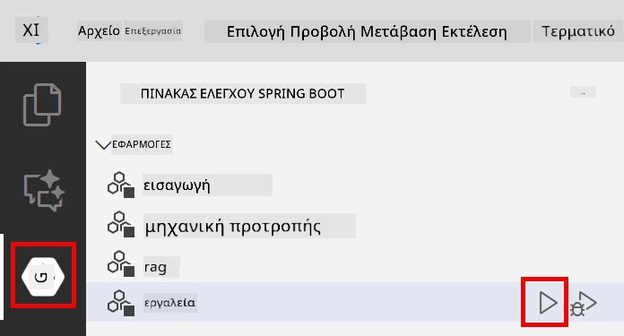
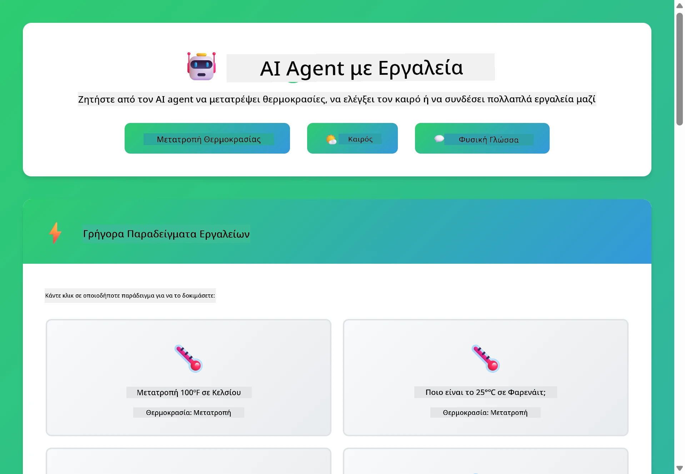
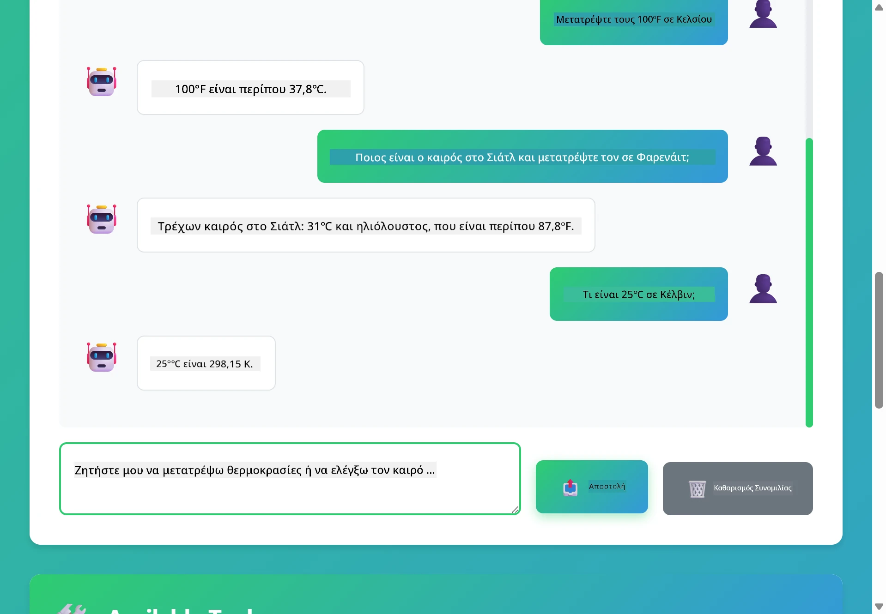

# Ενότητα 04: AI Πράκτορες με Εργαλεία

## Πίνακας Περιεχομένων

- [Περιήγηση σε Βίντεο](#περιήγηση-σε-βίντεο)
- [Τι Θα Μάθετε](#τι-θα-μάθετε)
- [Προαπαιτούμενα](#προαπαιτούμενα)
- [Κατανόηση των AI Πρακτόρων με Εργαλεία](#κατανόηση-των-ai-πρακτόρων-με-εργαλεία)
- [Πώς Λειτουργεί η Κλήση Εργαλείων](#πώς-λειτουργεί-η-κλήση-εργαλείων)
  - [Ορισμοί Εργαλείων](#ορισμοί-εργαλείων)
  - [Λήψη Αποφάσεων](#λήψη-αποφάσεων)
  - [Εκτέλεση](#εκτέλεση)
  - [Δημιουργία Απάντησης](#δημιουργία-απάντησης)
  - [Αρχιτεκτονική: Αυτόματη Δρομολόγηση Spring Boot](#αρχιτεκτονική-αυτόματη-δρομολόγηση-spring-boot)
- [Αλυσιδωτή Χρήση Εργαλείων](#αλυσιδωτή-χρήση-εργαλείων)
- [Εκτέλεση της Εφαρμογής](#εκτέλεση-της-εφαρμογής)
- [Χρήση της Εφαρμογής](#χρήση-της-εφαρμογής)
  - [Δοκιμή Απλής Χρήσης Εργαλείου](#δοκιμάστε-απλή-χρήση-εργαλείου)
  - [Δοκιμή Αλυσιδωτής Χρήσης Εργαλείων](#δοκιμάστε-αλυσιδωτή-χρήση-εργαλείων)
  - [Δείτε τη Ροή της Συνομιλίας](#δείτε-τη-ροή-της-συνομιλίας)
  - [Πειραματιστείτε με Διάφορα Αιτήματα](#πειραματιστείτε-με-διάφορα-αιτήματα)
- [Βασικές Έννοιες](#κύριες-έννοιες)
  - [Πρότυπο ReAct (Λογική και Δράση)](#πρότυπο-react-σκέψη-και-δράση)
  - [Σημασία Περιγραφών Εργαλείων](#σημασία-περιγραφών-εργαλείων)
  - [Διαχείριση Συνεδρίας](#διαχείριση-συνεδρίας)
  - [Διαχείριση Σφαλμάτων](#διαχείριση-σφαλμάτων)
- [Διαθέσιμα Εργαλεία](#διαθέσιμα-εργαλεία)
- [Πότε να Χρησιμοποιείτε Πράκτορες Βασισμένους σε Εργαλεία](#πότε-να-χρησιμοποιείτε-πράκτορες-με-βάση-τα-εργαλεία)
- [Εργαλεία έναντι RAG](#εργαλεία-vs-rag)
- [Επόμενα Βήματα](#επόμενα-βήματα)

## Περιήγηση σε Βίντεο

Παρακολουθήστε αυτήν τη ζωντανή συνεδρία που εξηγεί πώς να ξεκινήσετε με αυτή την ενότητα:

<a href="https://www.youtube.com/watch?v=O_J30kZc0rw"></a>

## Τι Θα Μάθετε

Μέχρι τώρα, έχετε μάθει πώς να έχετε συνομιλίες με AI, να δομείτε αποτελεσματικά τις εντολές, και να εδραιώνετε τις απαντήσεις σας στα έγγραφά σας. Αλλά υπάρχει ακόμα ένας βασικός περιορισμός: τα γλωσσικά μοντέλα μπορούν μόνο να παράγουν κείμενο. Δεν μπορούν να ελέγξουν τον καιρό, να κάνουν υπολογισμούς, να ερωτήσουν βάσεις δεδομένων ή να αλληλεπιδράσουν με εξωτερικά συστήματα.

Τα εργαλεία αλλάζουν αυτό. Δίνοντας στο μοντέλο πρόσβαση σε λειτουργίες που μπορεί να καλέσει, το μετατρέπετε από ένα εργαλείο παραγωγής κειμένου σε έναν πράκτορα που μπορεί να αναλαμβάνει δράσεις. Το μοντέλο αποφασίζει πότε χρειάζεται ένα εργαλείο, ποιο εργαλείο να χρησιμοποιήσει και ποια παραμέτρους να περάσει. Ο κώδικάς σας εκτελεί τη λειτουργία και επιστρέφει το αποτέλεσμα. Το μοντέλο ενσωματώνει αυτό το αποτέλεσμα στην απάντησή του.

## Προαπαιτούμενα

- Ολοκληρωμένη [Ενότητα 01 - Εισαγωγή](../01-introduction/README.md) (αναπτύχθηκαν πόροι Azure OpenAI)
- Συνιστάται να έχετε ολοκληρώσει τις προηγούμενες ενότητες (αυτή η ενότητα αναφέρεται σε [έννοιες RAG από την Ενότητα 03](../03-rag/README.md) στην σύγκριση Εργαλείων vs RAG)
- Αρχείο `.env` στον βασικό κατάλογο με διαπιστευτήρια Azure (δημιουργήθηκε από `azd up` στην Ενότητα 01)

> **Σημείωση:** Αν δεν έχετε ολοκληρώσει την Ενότητα 01, ακολουθήστε πρώτα τις οδηγίες ανάπτυξης εκεί.

## Κατανόηση των AI Πρακτόρων με Εργαλεία

> **📝 Σημείωση:** Ο όρος "πράκτορες" σε αυτή την ενότητα αναφέρεται σε βοηθούς AI ενισχυμένους με δυνατότητες κλήσης εργαλείων. Αυτό διαφέρει από τα πρότυπα **Agentic AI** (αυτόνομοι πράκτορες με σχεδιασμό, μνήμη και λογική πολλαπλών βημάτων) που θα καλυφθούν στην [Ενότητα 05: MCP](../05-mcp/README.md).

Χωρίς εργαλεία, ένα γλωσσικό μοντέλο μπορεί μόνο να παράγει κείμενο από τα εκπαιδευτικά του δεδομένα. Ζητήστε του πληροφορίες για τον τρέχοντα καιρό, και πρέπει να μαντέψει. Δώστε του εργαλεία και μπορεί να καλέσει ένα API καιρού, να εκτελέσει υπολογισμούς, ή να ρωτήσει μια βάση δεδομένων — και μετά να ενσωματώσει αυτά τα πραγματικά αποτελέσματα στην απάντησή του.


*Χωρίς εργαλεία το μοντέλο μπορεί μόνο να μαντέψει — με εργαλεία μπορεί να καλέσει APIs, να κάνει υπολογισμούς και να επιστρέψει δεδομένα σε πραγματικό χρόνο.*

Ένας πράκτορας AI με εργαλεία ακολουθεί ένα πρότυπο **Λογικής και Δράσης (ReAct)**. Το μοντέλο δεν απλώς απαντά — σκέφτεται τι χρειάζεται, ενεργεί καλώντας ένα εργαλείο, παρατηρεί το αποτέλεσμα, και μετά αποφασίζει αν θα δράσει ξανά ή θα δώσει την τελική απάντηση:

1. **Λογική** — Ο πράκτορας αναλύει την ερώτηση του χρήστη και καθορίζει ποια πληροφορία χρειάζεται
2. **Δράση** — Ο πράκτορας επιλέγει το σωστό εργαλείο, δημιουργεί τις σωστές παραμέτρους και το καλεί
3. **Παρατήρηση** — Ο πράκτορας λαμβάνει το αποτέλεσμα του εργαλείου και αξιολογεί την έκβαση
4. **Επανάληψη ή Απάντηση** — Αν χρειάζονται περισσότερα δεδομένα, ο πράκτορας επιστρέφει στην αρχή· αλλιώς συντάσσει μια απάντηση σε φυσική γλώσσα


*Ο κύκλος ReAct — ο πράκτορας σκέφτεται τι πρέπει να κάνει, ενεργεί καλώντας ένα εργαλείο, παρατηρεί το αποτέλεσμα και επαναλαμβάνει μέχρι να δώσει την τελική απάντηση.*

Αυτό συμβαίνει αυτόματα. Ορίζετε τα εργαλεία και τις περιγραφές τους. Το μοντέλο αναλαμβάνει τη λήψη αποφάσεων για το πότε και πώς θα τα χρησιμοποιήσει.

## Πώς Λειτουργεί η Κλήση Εργαλείων

### Ορισμοί Εργαλείων

[WeatherTool.java](../../../04-tools/src/main/java/com/example/langchain4j/agents/tools/WeatherTool.java) | [TemperatureTool.java](../../../04-tools/src/main/java/com/example/langchain4j/agents/tools/TemperatureTool.java)

Ορίζετε συναρτήσεις με σαφείς περιγραφές και προδιαγραφές παραμέτρων. Το μοντέλο βλέπει αυτές τις περιγραφές στο prompt συστήματος και κατανοεί τι κάνει κάθε εργαλείο.

```java
@Component
public class WeatherTool {
    
    @Tool("Get the current weather for a location")
    public String getCurrentWeather(@P("Location name") String location) {
        // Η λογική αναζήτησης καιρού σας
        return "Weather in " + location + ": 22°C, cloudy";
    }
}

@AiService
public interface Assistant {
    String chat(@MemoryId String sessionId, @UserMessage String message);
}

// Ο Βοηθός συνδέεται αυτόματα από το Spring Boot με:
// - Bean ChatModel
// - Όλες οι μέθοδοι @Tool από κλάσεις @Component
// - ChatMemoryProvider για διαχείριση συνεδρίας
```

Το παρακάτω διάγραμμα αναλύει κάθε σημείωση και δείχνει πώς κάθε μέρος βοηθά το AI να καταλάβει πότε να καλέσει το εργαλείο και ποια ορίσματα να περάσει:


*Ανατομία ορισμού εργαλείου — το @Tool λέει στο AI πότε να το χρησιμοποιήσει, το @P περιγράφει κάθε παράμετρο, και το @AiService συνδέει τα πάντα κατά την εκκίνηση.*

> **🤖 Δοκιμάστε με [GitHub Copilot](https://github.com/features/copilot) Chat:** Ανοίξτε το [`WeatherTool.java`](../../../04-tools/src/main/java/com/example/langchain4j/agents/tools/WeatherTool.java) και ρωτήστε:
> - "Πώς θα ενσωμάτωνα ένα πραγματικό API καιρού όπως το OpenWeatherMap αντί για ψεύτικα δεδομένα;"
> - "Τι κάνει μια καλή περιγραφή εργαλείου που βοηθά το AI να το χρησιμοποιεί σωστά;"
> - "Πώς χειρίζομαι σφάλματα API και όρια ρυθμού στις υλοποιήσεις εργαλείων;"

### Λήψη Αποφάσεων

Όταν ένας χρήστης ρωτά "Ποιος είναι ο καιρός στο Σιάτλ;", το μοντέλο δεν διαλέγει τυχαία ένα εργαλείο. Συγκρίνει την πρόθεση του χρήστη με κάθε περιγραφή εργαλείου που έχει στη διάθεσή του, βαθμολογεί το καθένα για συνάφεια, και επιλέγει την καλύτερη αντιστοίχιση. Μετά παράγει μια δομημένη κλήση λειτουργίας με τις σωστές παραμέτρους — σε αυτή την περίπτωση, ορίζοντας το `location` σε `"Seattle"`.

Αν κανένα εργαλείο δεν ταιριάζει στο αίτημα του χρήστη, το μοντέλο επιστρέφει απάντηση από τη δική του γνώση. Αν ταιριάζουν πολλά εργαλεία, επιλέγει το πιο συγκεκριμένο.


*Το μοντέλο αξιολογεί κάθε διαθέσιμο εργαλείο με βάση την πρόθεση του χρήστη και επιλέγει την καλύτερη αντιστοίχιση — γι’ αυτό είναι σημαντικό να γράφετε σαφείς, συγκεκριμένες περιγραφές εργαλείων.*

### Εκτέλεση

[AgentService.java](../../../04-tools/src/main/java/com/example/langchain4j/agents/service/AgentService.java)

Το Spring Boot δρομολογεί αυτόματα τη δηλωτική διεπαφή `@AiService` με όλα τα εγγεγραμμένα εργαλεία, και το LangChain4j εκτελεί τις κλήσεις εργαλείων αυτόματα. Στο παρασκήνιο, μια ολοκληρωμένη κλήση εργαλείου περνάει από έξι στάδια — από την ερώτηση του χρήστη σε φυσική γλώσσα έως την απάντηση σε φυσική γλώσσα:


*Η πλήρης ροή — ο χρήστης κάνει μια ερώτηση, το μοντέλο επιλέγει ένα εργαλείο, το LangChain4j το εκτελεί και το μοντέλο ενσωματώνει το αποτέλεσμα σε φυσική απάντηση.*

Στο παρασκήνιο, το `AiServices` τρέχει τον ίδιο βρόχο κλήσης εργαλείων για κάθε εργαλείο — εδώ απεικονίζεται με έναν απλό `Calculator`. Το παρακάτω διάγραμμα ακολουθίας δείχνει ακριβώς τι συμβαίνει:


*Ο βρόχος κλήσης εργαλείου — το `AiServices` στέλνει το μήνυμά σας και το σχήμα εργαλείων στο LLM, το LLM απαντά με κλήση λειτουργίας όπως `add(42, 58)`, το LangChain4j εκτελεί τη μέθοδο `Calculator` τοπικά και επιστρέφει το αποτέλεσμα για την τελική απάντηση.*

> **🤖 Δοκιμάστε με [GitHub Copilot](https://github.com/features/copilot) Chat:** Ανοίξτε το [`AgentService.java`](../../../04-tools/src/main/java/com/example/langchain4j/agents/service/AgentService.java) και ρωτήστε:
> - "Πώς δουλεύει το πρότυπο ReAct και γιατί είναι αποτελεσματικό για πράκτορες AI;"
> - "Πώς αποφασίζει ο πράκτορας ποιο εργαλείο να χρησιμοποιήσει και με ποια σειρά;"
> - "Τι γίνεται αν αποτύχει μια εκτέλεση εργαλείου - πώς να χειριστώ τα σφάλματα σωστά;"

### Δημιουργία Απάντησης

Το μοντέλο λαμβάνει τα δεδομένα καιρού και τα μορφοποιεί σε μια απάντηση σε φυσική γλώσσα για τον χρήστη.

### Αρχιτεκτονική: Αυτόματη Δρομολόγηση Spring Boot

Αυτή η ενότητα χρησιμοποιεί την ενσωμάτωση LangChain4j με το Spring Boot και τις δηλωτικές διεπαφές `@AiService`. Κατά την εκκίνηση το Spring Boot εντοπίζει κάθε `@Component` που περιέχει μεθόδους `@Tool`, το bean `ChatModel`, και τον `ChatMemoryProvider` — και τα δρομολογεί όλα σε μια ενιαία διεπαφή `Assistant` χωρίς παραλληλισμούς κώδικα.


*Η διεπαφή @AiService δένει μαζί το ChatModel, τα συστατικά εργαλείων και τον πάροχο μνήμης — το Spring Boot χειρίζεται όλη τη δρομολόγηση αυτόματα.*

Εδώ είναι ο πλήρης κύκλος ζωής του αιτήματος ως διάγραμμα ακολουθίας — από το HTTP αίτημα, μέσα από τον controller, την υπηρεσία και τον αυτόματα δρομολογημένο proxy, μέχρι την εκτέλεση του εργαλείου και πίσω:


*Ο πλήρης κύκλος ζωής αιτήματος Spring Boot — το αίτημα HTTP περνά μέσα από τον controller και την υπηρεσία προς τον αυτόματα δρομολογημένο proxy Assistant, που οργανώνει το LLM και τις κλήσεις εργαλειών αυτόματα.*

Κύρια οφέλη αυτής της προσέγγισης:

- **Αυτόματη δρομολόγηση Spring Boot** — ChatModel και εργαλεία εγχέονται αυτόματα
- **Πρότυπο @MemoryId** — Αυτόματη διαχείριση μνήμης βάσει συνεδρίας
- **Μοναδική περίπτωση** — Ο Assistant δημιουργείται μία φορά και επαναχρησιμοποιείται για καλύτερη απόδοση
- **Εκτέλεση με τύπους ασφαλείς** — Κλήση Java μεθόδων απευθείας με μετατροπή τύπων
- **Διαχείριση πολλαπλών βημάτων** — Αντιμετωπίζει αυτόματα την αλυσιδωτή χρήση εργαλείων
- **Μηδενικός παραλληλισμός** — Δεν απαιτούνται χειροκίνητες κλήσεις `AiServices.builder()` ή memory HashMap

Εναλλακτικές προσεγγίσεις (χειροκίνητο `AiServices.builder()`) απαιτούν περισσότερο κώδικα και χάνουν τα οφέλη της ενσωμάτωσης Spring Boot.

## Αλυσιδωτή Χρήση Εργαλείων

**Αλυσιδωτή Χρήση Εργαλείων** — Η πραγματική δύναμη των πράκτορων βασισμένων σε εργαλεία φαίνεται όταν μια ερώτηση απαιτεί πολλά εργαλεία. Ρωτήστε "Ποιος είναι ο καιρός στο Σιάτλ σε Φαρενάιτ;" και ο πράκτορας αλυσιδωτά συνδυάζει δύο εργαλεία: πρώτα καλεί το `getCurrentWeather` για να πάρει τη θερμοκρασία σε Κελσίου, μετά περνά αυτή την τιμή στο `celsiusToFahrenheit` για μετατροπή — όλα σε μια συνομιλία.


*Αλυσιδωτή χρήση εργαλείων σε δράση — ο πράκτορας πρώτα καλεί το getCurrentWeather, μετά περνά το αποτέλεσμα σε Κελσίου στο celsiusToFahrenheit και δίνει συνδυασμένη απάντηση.*

**Απαλά Σφάλματα** — Ζητήστε τον καιρό σε μια πόλη που δεν υπάρχει στα ψεύτικα δεδομένα. Το εργαλείο επιστρέφει μήνυμα σφάλματος και το AI εξηγεί ότι δεν μπορεί να βοηθήσει αντί να καταρρεύσει η εφαρμογή. Τα εργαλεία αποτυγχάνουν με ασφάλεια. Το παρακάτω διάγραμμα συγκρίνει τις δύο προσεγγίσεις — με σωστή διαχείριση σφαλμάτων, ο πράκτορας πιάνει την εξαίρεση και απαντά χρήσιμα, ενώ χωρίς αυτή η εφαρμογή καταρρέει:


*Όταν αποτυγχάνει ένα εργαλείο, ο πράκτορας πιάνει το σφάλμα και απαντά με χρήσιμη εξήγηση αντί να καταρρεύσει.*

Αυτό συμβαίνει σε μια μόνο συνομιλία. Ο πράκτορας οργανώνει αυτόνομα πολλαπλές κλήσεις εργαλείων.

## Εκτέλεση της Εφαρμογής

**Επιβεβαίωση ανάπτυξης:**

Βεβαιωθείτε ότι το αρχείο `.env` υπάρχει στον αρχικό φάκελο με διαπιστευτήρια Azure (δημιουργήθηκε κατά την Ενότητα 01). Εκτελέστε από το φάκελο της ενότητας (`04-tools/`):

**Bash:**
```bash
cat ../.env  # Θα πρέπει να εμφανίζει το AZURE_OPENAI_ENDPOINT, το API_KEY, το DEPLOYMENT
```

**PowerShell:**
```powershell
Get-Content ..\.env  # Πρέπει να εμφανίζει το AZURE_OPENAI_ENDPOINT, API_KEY, DEPLOYMENT
```

**Εκκίνηση της εφαρμογής:**

> **Σημείωση:** Αν έχετε ήδη ξεκινήσει όλες τις εφαρμογές χρησιμοποιώντας το `./start-all.sh` από τον αρχικό φάκελο (όπως περιγράφεται στην Ενότητα 01), αυτή η ενότητα ήδη τρέχει στη θύρα 8084. Μπορείτε να παραλείψετε τις εντολές εκκίνησης παρακάτω και να μεταβείτε απευθείας στο http://localhost:8084.

**Επιλογή 1: Χρήση του Spring Boot Dashboard (Συνιστάται για χρήστες VS Code)**

Το περιβάλλον ανάπτυξης περιλαμβάνει την επέκταση Spring Boot Dashboard, που παρέχει οπτικό περιβάλλον για τη διαχείριση όλων των εφαρμογών Spring Boot. Μπορείτε να τη βρείτε στη γραμμή δραστηριότητας αριστερά στο VS Code (αναζητήστε το εικονίδιο Spring Boot).

Από το Spring Boot Dashboard, μπορείτε:
- Να δείτε όλες τις διαθέσιμες εφαρμογές Spring Boot στον χώρο εργασίας
- Να ξεκινήσετε/σταματήσετε εφαρμογές με ένα κλικ
- Να δείτε logs εφαρμογών σε πραγματικό χρόνο
- Να παρακολουθείτε την κατάσταση των εφαρμογών

Απλώς κάντε κλικ στο κουμπί αναπαραγωγής δίπλα στο "tools" για να ξεκινήσει αυτή η ενότητα, ή να ξεκινήσετε όλες τις ενότητες μαζί.

Δείτε πώς εμφανίζεται το Spring Boot Dashboard στο VS Code:


*Ο Πίνακας Ελέγχου Spring Boot στο VS Code — εκκίνηση, διακοπή και παρακολούθηση όλων των μονάδων από ένα μέρος*

**Επιλογή 2: Χρήση shell scripts**

Εκκίνηση όλων των web εφαρμογών (μονάδες 01-04):

**Bash:**
```bash
cd ..  # Από τον ριζικό κατάλογο
./start-all.sh
```

**PowerShell:**
```powershell
cd ..  # Από τον ριζικό κατάλογο
.\start-all.ps1
```

Ή εκκίνηση μόνο αυτής της μονάδας:

**Bash:**
```bash
cd 04-tools
./start.sh
```

**PowerShell:**
```powershell
cd 04-tools
.\start.ps1
```

Και τα δύο scripts φορτώνουν αυτόματα τις μεταβλητές περιβάλλοντος από το αρχείο root `.env` και θα δημιουργήσουν τα JARs αν δεν υπάρχουν.

> **Σημείωση:** Αν προτιμάτε να δημιουργήσετε όλες τις μονάδες χειροκίνητα πριν την εκκίνηση:
>
> **Bash:**
> ```bash
> cd ..  # Go to root directory
> mvn clean package -DskipTests
> ```
>
> **PowerShell:**
> ```powershell
> cd ..  # Go to root directory
> mvn clean package -DskipTests
> ```

Ανοίξτε http://localhost:8084 στον περιηγητή σας.

**Για διακοπή:**

**Bash:**
```bash
./stop.sh  # Μόνο αυτό το μοντέλο
# Ή
cd .. && ./stop-all.sh  # Όλα τα μοντέλα
```

**PowerShell:**
```powershell
.\stop.ps1  # Μόνο αυτό το μονάδα
# Ή
cd ..; .\stop-all.ps1  # Όλες οι μονάδες
```

## Χρήση της Εφαρμογής

Η εφαρμογή παρέχει μια web διεπαφή όπου μπορείτε να αλληλεπιδράσετε με έναν AI πράκτορα που έχει πρόσβαση σε εργαλεία καιρού και μετατροπής θερμοκρασίας. Δείτε πώς φαίνεται η διεπαφή — περιλαμβάνει παραδείγματα γρήγορης εκκίνησης και πλαίσιο συνομιλίας για αποστολή αιτημάτων:

<a href="images/tools-homepage.png"></a>

*Η διεπαφή Εργαλείων AI Πράκτορα - γρήγορα παραδείγματα και πλαίσιο συνομιλίας για αλληλεπίδραση με τα εργαλεία*

### Δοκιμάστε Απλή Χρήση Εργαλείου

Ξεκινήστε με ένα απλό αίτημα: "Μετατρέψτε 100 βαθμούς Φαρενάιτ σε Κελσίου". Ο πράκτορας αναγνωρίζει ότι χρειάζεται το εργαλείο μετατροπής θερμοκρασίας, το καλεί με τις σωστές παραμέτρους και επιστρέφει το αποτέλεσμα. Παρατηρήστε πόσο φυσικό φαίνεται — δεν ορίσατε ποιο εργαλείο να χρησιμοποιηθεί ή πώς να το καλέσετε.

### Δοκιμάστε Αλυσιδωτή Χρήση Εργαλείων

Τώρα δοκιμάστε κάτι πιο περίπλοκο: "Ποιος είναι ο καιρός στο Σιάτλ και μετατρέψτε τον σε Φαρενάιτ;" Παρακολουθήστε τον πράκτορα να εργάζεται βήμα-βήμα. Πρώτα παίρνει τον καιρό (που επιστρέφει σε Κελσίου), αναγνωρίζει ότι χρειάζεται να μετατρέψει σε Φαρενάιτ, καλεί το εργαλείο μετατροπής και συνδυάζει τα δύο αποτελέσματα σε μία απάντηση.

### Δείτε τη Ροή της Συνομιλίας

Η διεπαφή συνομιλίας διατηρεί το ιστορικό της συνομιλίας, επιτρέποντάς σας να έχετε αλληλεπιδράσεις πολλών γύρων. Μπορείτε να δείτε όλα τα προηγούμενα ερωτήματα και απαντήσεις, κάνοντας εύκολο το να παρακολουθείτε τη συνομιλία και να κατανοείτε πώς ο πράκτορας χτίζει το πλαίσιο μέσα από πολλαπλές ανταλλαγές.

<a href="images/tools-conversation-demo.png"></a>

*Συνομιλία πολλών γύρων που δείχνει απλές μετατροπές, αναζητήσεις καιρού και αλυσιδωτή χρήση εργαλείων*

### Πειραματιστείτε με Διάφορα Αιτήματα

Δοκιμάστε διάφορους συνδυασμούς:
- Αναζητήσεις καιρού: "Ποιος είναι ο καιρός στο Τόκιο;"
- Μετατροπές θερμοκρασίας: "Πόσο είναι 25°C σε Κέλβιν;"
- Συνδυασμένα ερωτήματα: "Ελέγξτε τον καιρό στο Παρίσι και πείτε μου αν είναι πάνω από 20°C"

Παρατηρήστε πώς ο πράκτορας ερμηνεύει τη φυσική γλώσσα και τη χαρτογραφεί σε κατάλληλες κλήσεις εργαλείων.

## Κύριες Έννοιες

### Πρότυπο ReAct (Σκέψη και Δράση)

Ο πράκτορας εναλλάσσεται μεταξύ σκέψης (αποφασίζοντας τι να κάνει) και δράσης (χρησιμοποιώντας εργαλεία). Αυτό το πρότυπο επιτρέπει αυτόνομη επίλυση προβλημάτων αντί απλώς να ανταποκρίνεται σε οδηγίες.

### Σημασία Περιγραφών Εργαλείων

Η ποιότητα των περιγραφών των εργαλείων σας επηρεάζει άμεσα το πόσο καλά τα χρησιμοποιεί ο πράκτορας. Καθαρές, συγκεκριμένες περιγραφές βοηθούν το μοντέλο να κατανοεί πότε και πώς να καλεί κάθε εργαλείο.

### Διαχείριση Συνεδρίας

Η `@MemoryId` ανάρτηση επιτρέπει αυτόματη διαχείριση μνήμης βάσει συνεδρίας. Κάθε αναγνωριστικό συνεδρίας λαμβάνει δική του `ChatMemory` παρουσία που διαχειρίζεται το bean `ChatMemoryProvider`, έτσι πολλοί χρήστες μπορούν να αλληλεπιδράσουν με τον πράκτορα ταυτόχρονα χωρίς να αναμειγνύονται οι συνομιλίες τους. Το παρακάτω διάγραμμα δείχνει πώς πολλοί χρήστες κατευθύνονται σε απομονωμένα καταστήματα μνήμης βάσει των αναγνωριστικών συνεδρίας τους:


*Κάθε αναγνωριστικό συνεδρίας αντιστοιχίζεται σε απομονωμένο ιστορικό συνομιλίας — οι χρήστες δεν βλέπουν ποτέ τα μηνύματα ο ένας του άλλου.*

### Διαχείριση Σφαλμάτων

Τα εργαλεία μπορεί να αποτύχουν — οι API έχουν χρονικό όριο, παράμετροι μπορεί να είναι άκυρες, εξωτερικές υπηρεσίες να πέσουν. Οι παραγωγικοί πράκτορες χρειάζονται χειρισμό σφαλμάτων ώστε το μοντέλο να μπορεί να εξηγεί προβλήματα ή να προσπαθεί εναλλακτικές αντί να καταρρέει ολόκληρη η εφαρμογή. Όταν ένα εργαλείο πετάει εξαίρεση, το LangChain4j την πιάνει και τροφοδοτεί το μήνυμα σφάλματος πίσω στο μοντέλο, που τότε μπορεί να εξηγήσει το πρόβλημα σε φυσική γλώσσα.

## Διαθέσιμα Εργαλεία

Το παρακάτω διάγραμμα δείχνει το εκτενές οικοσύστημα εργαλείων που μπορείτε να δημιουργήσετε. Αυτή η μονάδα παρουσιάζει εργαλεία καιρού και θερμοκρασίας, αλλά το ίδιο πρότυπο `@Tool` λειτουργεί για οποιαδήποτε μέθοδο Java — από ερωτήματα βάσεων δεδομένων μέχρι επεξεργασία πληρωμών.


*Οποιαδήποτε μέθοδος Java με την ανάρτηση @Tool γίνεται διαθέσιμη για τον AI — το πρότυπο επεκτείνεται σε βάσεις δεδομένων, APIs, email, λειτουργίες αρχείων και άλλα.*

## Πότε να Χρησιμοποιείτε Πράκτορες με Βάση τα Εργαλεία

Όχι κάθε αίτημα χρειάζεται εργαλεία. Η απόφαση εξαρτάται από το αν ο AI χρειάζεται να αλληλεπιδράσει με εξωτερικά συστήματα ή μπορεί να απαντήσει από τη δική του γνώση. Ο παρακάτω οδηγός συνοψίζει πότε τα εργαλεία προσθέτουν αξία και πότε δεν είναι απαραίτητα:


*Ένας γρήγορος οδηγός απόφασης — τα εργαλεία είναι για δεδομένα σε πραγματικό χρόνο, υπολογισμούς και ενέργειες· η γενική γνώση και δημιουργικές εργασίες δεν τα χρειάζονται.*

## Εργαλεία vs RAG

Οι μονάδες 03 και 04 επεκτείνουν ό,τι μπορεί να κάνει ο AI, αλλά με θεμελιωδώς διαφορετικούς τρόπους. Το RAG δίνει στο μοντέλο πρόσβαση σε **γνώση** ανακτώντας έγγραφα. Τα εργαλεία δίνουν στο μοντέλο τη δυνατότητα να κάνει **ενέργειες** καλώντας λειτουργίες. Το παρακάτω διάγραμμα συγκρίνει αυτές τις δύο προσεγγίσεις παράλληλα — από τον τρόπο λειτουργίας της κάθε ροής εργασίας μέχρι τα ανταλλάγματα μεταξύ τους:


*Το RAG ανακτά πληροφορίες από στατικά έγγραφα — τα Εργαλεία εκτελούν ενέργειες και φέρνουν δυναμικά, ζωντανά δεδομένα. Πολλά παραγωγικά συστήματα συνδυάζουν και τα δύο.*

Στην πράξη, πολλά παραγωγικά συστήματα συνδυάζουν και τις δύο προσεγγίσεις: RAG για να στηρίξουν απαντήσεις στην τεκμηρίωσή σας, και Εργαλεία για να φέρνουν ζωντανά δεδομένα ή να εκτελούν λειτουργίες.

## Επόμενα Βήματα

**Επόμενη Μονάδα:** [05-mcp - Πρωτόκολλο Συμφραζόμενου Μοντέλου (MCP)](../05-mcp/README.md)

---

**Πλοήγηση:** [← Προηγούμενο: Μονάδα 03 - RAG](../03-rag/README.md) | [Πίσω στην Αρχική](../README.md) | [Επόμενο: Μονάδα 05 - MCP →](../05-mcp/README.md)

---

<!-- CO-OP TRANSLATOR DISCLAIMER START -->
**Αποποίηση ευθυνών**:
Αυτό το έγγραφο έχει μεταφραστεί χρησιμοποιώντας την υπηρεσία μετάφρασης με τεχνητή νοημοσύνη [Co-op Translator](https://github.com/Azure/co-op-translator). Ενώ επιδιώκουμε την ακρίβεια, παρακαλούμε να έχετε υπόψη ότι οι αυτοματοποιημένες μεταφράσεις ενδέχεται να περιέχουν λάθη ή ανακρίβειες. Το πρωτότυπο έγγραφο στη μητρική του γλώσσα πρέπει να θεωρείται η αυθεντική πηγή. Για κρίσιμες πληροφορίες, συνιστάται επαγγελματική ανθρώπινη μετάφραση. Δεν φέρουμε ευθύνη για τυχόν παρεξηγήσεις ή λανθασμένες ερμηνείες που προκύπτουν από τη χρήση αυτής της μετάφρασης.
<!-- CO-OP TRANSLATOR DISCLAIMER END -->