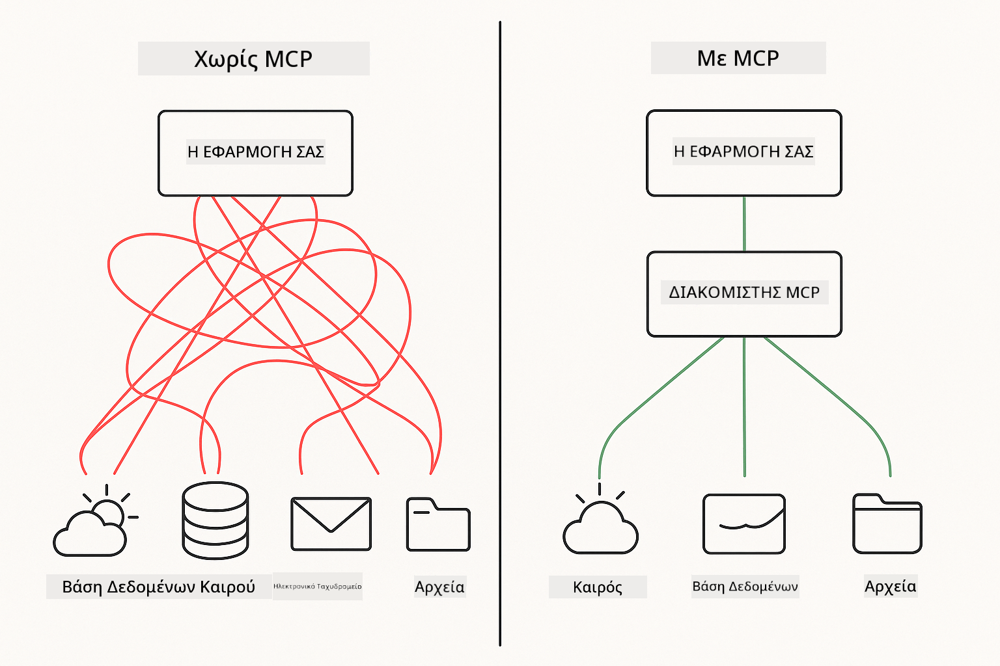
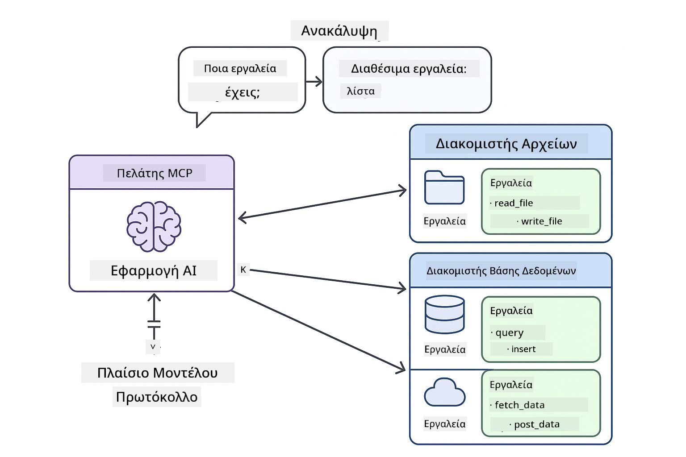

<!--
CO_OP_TRANSLATOR_METADATA:
{
  "original_hash": "c25ec1f10ef156c53e190cdf8b0711ab",
  "translation_date": "2025-12-13T17:53:01+00:00",
  "source_file": "05-mcp/README.md",
  "language_code": "el"
}
-->
# Module 05: Πρωτόκολλο Πλαισίου Μοντέλου (MCP)

## Περιεχόμενα

- [Τι θα μάθετε](../../../05-mcp)
- [Κατανόηση του MCP](../../../05-mcp)
- [Πώς λειτουργεί το MCP](../../../05-mcp)
  - [Αρχιτεκτονική Πελάτη-Εξυπηρετητή](../../../05-mcp)
  - [Ανακάλυψη Εργαλείων](../../../05-mcp)
  - [Μηχανισμοί Μεταφοράς](../../../05-mcp)
- [Προαπαιτούμενα](../../../05-mcp)
- [Τι καλύπτει αυτό το module](../../../05-mcp)
- [Γρήγορη Εκκίνηση](../../../05-mcp)
  - [Παράδειγμα 1: Απομακρυσμένη Αριθμομηχανή (Streamable HTTP)](../../../05-mcp)
  - [Παράδειγμα 2: Ενέργειες Αρχείων (Stdio)](../../../05-mcp)
  - [Παράδειγμα 3: Ανάλυση Git (Docker)](../../../05-mcp)
- [Κύριες Έννοιες](../../../05-mcp)
  - [Επιλογή Μεταφοράς](../../../05-mcp)
  - [Ανακάλυψη Εργαλείων](../../../05-mcp)
  - [Διαχείριση Συνεδρίας](../../../05-mcp)
  - [Θέματα Διαλειτουργικότητας](../../../05-mcp)
- [Πότε να χρησιμοποιήσετε το MCP](../../../05-mcp)
- [Οικοσύστημα MCP](../../../05-mcp)
- [Συγχαρητήρια!](../../../05-mcp)
  - [Τι ακολουθεί;](../../../05-mcp)
- [Αντιμετώπιση Προβλημάτων](../../../05-mcp)

## Τι θα μάθετε

Έχετε δημιουργήσει συνομιλητική τεχνητή νοημοσύνη, έχετε κατακτήσει τα prompts, έχετε βασίσει τις απαντήσεις σε έγγραφα και έχετε δημιουργήσει πράκτορες με εργαλεία. Αλλά όλα αυτά τα εργαλεία ήταν προσαρμοσμένα για την συγκεκριμένη εφαρμογή σας. Τι θα γινόταν αν μπορούσατε να δώσετε στην τεχνητή νοημοσύνη σας πρόσβαση σε ένα τυποποιημένο οικοσύστημα εργαλείων που ο καθένας μπορεί να δημιουργήσει και να μοιραστεί;

Το Πρωτόκολλο Πλαισίου Μοντέλου (MCP) παρέχει ακριβώς αυτό - έναν τυποποιημένο τρόπο για εφαρμογές AI να ανακαλύπτουν και να χρησιμοποιούν εξωτερικά εργαλεία. Αντί να γράφετε προσαρμοσμένες ενσωματώσεις για κάθε πηγή δεδομένων ή υπηρεσία, συνδέεστε σε MCP εξυπηρετητές που εκθέτουν τις δυνατότητές τους σε συνεπή μορφή. Ο πράκτοράς σας AI μπορεί τότε να ανακαλύψει και να χρησιμοποιήσει αυτά τα εργαλεία αυτόματα.



*Πριν το MCP: Πολύπλοκες ενσωματώσεις σημείο προς σημείο. Μετά το MCP: Ένα πρωτόκολλο, ατελείωτες δυνατότητες.*

## Κατανόηση του MCP

Το MCP λύνει ένα θεμελιώδες πρόβλημα στην ανάπτυξη AI: κάθε ενσωμάτωση είναι προσαρμοσμένη. Θέλετε πρόσβαση στο GitHub; Προσαρμοσμένος κώδικας. Θέλετε να διαβάσετε αρχεία; Προσαρμοσμένος κώδικας. Θέλετε να κάνετε ερωτήματα σε βάση δεδομένων; Προσαρμοσμένος κώδικας. Και καμία από αυτές τις ενσωματώσεις δεν λειτουργεί με άλλες εφαρμογές AI.

Το MCP τυποποιεί αυτό. Ένας MCP εξυπηρετητής εκθέτει εργαλεία με σαφείς περιγραφές και σχήματα. Οποιοσδήποτε MCP πελάτης μπορεί να συνδεθεί, να ανακαλύψει διαθέσιμα εργαλεία και να τα χρησιμοποιήσει. Φτιάξτε μία φορά, χρησιμοποιήστε παντού.



*Αρχιτεκτονική Πρωτοκόλλου Πλαισίου Μοντέλου - τυποποιημένη ανακάλυψη και εκτέλεση εργαλείων*

## Πώς λειτουργεί το MCP

**Αρχιτεκτονική Πελάτη-Εξυπηρετητή**

Το MCP χρησιμοποιεί μοντέλο πελάτη-εξυπηρετητή. Οι εξυπηρετητές παρέχουν εργαλεία - ανάγνωση αρχείων, ερωτήματα βάσεων δεδομένων, κλήσεις API. Οι πελάτες (η εφαρμογή AI σας) συνδέονται στους εξυπηρετητές και χρησιμοποιούν τα εργαλεία τους.

**Ανακάλυψη Εργαλείων**

Όταν ο πελάτης σας συνδέεται σε έναν MCP εξυπηρετητή, ρωτάει "Τι εργαλεία έχετε;" Ο εξυπηρετητής απαντά με μια λίστα διαθέσιμων εργαλείων, το καθένα με περιγραφές και σχήματα παραμέτρων. Ο πράκτοράς σας AI μπορεί τότε να αποφασίσει ποια εργαλεία θα χρησιμοποιήσει βάσει των αιτημάτων του χρήστη.

**Μηχανισμοί Μεταφοράς**

Το MCP ορίζει δύο μηχανισμούς μεταφοράς: HTTP για απομακρυσμένους εξυπηρετητές, Stdio για τοπικές διεργασίες (συμπεριλαμβανομένων των κοντέινερ Docker):


*Μηχανισμοί μεταφοράς MCP: HTTP για απομακρυσμένους εξυπηρετητές, Stdio για τοπικές διεργασίες (συμπεριλαμβανομένων κοντέινερ Docker)*

**Streamable HTTP** - [StreamableHttpDemo.java](../../../05-mcp/src/main/java/com/example/langchain4j/mcp/StreamableHttpDemo.java)

Για απομακρυσμένους εξυπηρετητές. Η εφαρμογή σας κάνει αιτήματα HTTP σε έναν εξυπηρετητή που τρέχει κάπου στο δίκτυο. Χρησιμοποιεί Server-Sent Events για επικοινωνία σε πραγματικό χρόνο.

```java
McpTransport httpTransport = new StreamableHttpMcpTransport.Builder()
    .url("http://localhost:3001/mcp")
    .timeout(Duration.ofSeconds(60))
    .logRequests(true)
    .logResponses(true)
    .build();
```

> **🤖 Δοκιμάστε με [GitHub Copilot](https://github.com/features/copilot) Chat:** Ανοίξτε το [`StreamableHttpDemo.java`](../../../05-mcp/src/main/java/com/example/langchain4j/mcp/StreamableHttpDemo.java) και ρωτήστε:
> - "Πώς διαφέρει το MCP από την άμεση ενσωμάτωση εργαλείων όπως στο Module 04;"
> - "Ποια είναι τα οφέλη της χρήσης MCP για κοινή χρήση εργαλείων μεταξύ εφαρμογών;"
> - "Πώς διαχειρίζομαι αποτυχίες σύνδεσης ή χρονικά όρια στους MCP εξυπηρετητές;"

**Stdio** - [StdioTransportDemo.java](../../../05-mcp/src/main/java/com/example/langchain4j/mcp/StdioTransportDemo.java)

Για τοπικές διεργασίες. Η εφαρμογή σας δημιουργεί έναν εξυπηρετητή ως υποδιεργασία και επικοινωνεί μέσω τυπικής εισόδου/εξόδου. Χρήσιμο για πρόσβαση στο σύστημα αρχείων ή εργαλεία γραμμής εντολών.

```java
McpTransport stdioTransport = new StdioMcpTransport.Builder()
    .command(List.of(
        npmCmd, "exec",
        "@modelcontextprotocol/server-filesystem@0.6.2",
        resourcesDir
    ))
    .logEvents(false)
    .build();
```

> **🤖 Δοκιμάστε με [GitHub Copilot](https://github.com/features/copilot) Chat:** Ανοίξτε το [`StdioTransportDemo.java`](../../../05-mcp/src/main/java/com/example/langchain4j/mcp/StdioTransportDemo.java) και ρωτήστε:
> - "Πώς λειτουργεί η μεταφορά Stdio και πότε πρέπει να τη χρησιμοποιώ αντί για HTTP;"
> - "Πώς διαχειρίζεται το LangChain4j τον κύκλο ζωής των διεργασιών MCP εξυπηρετητή που δημιουργούνται;"
> - "Ποιες είναι οι επιπτώσεις ασφαλείας από το να δίνω στην AI πρόσβαση στο σύστημα αρχείων;"

**Docker (χρησιμοποιεί Stdio)** - [GitRepositoryAnalyzer.java](../../../05-mcp/src/main/java/com/example/langchain4j/mcp/GitRepositoryAnalyzer.java)

Για υπηρεσίες σε κοντέινερ. Χρησιμοποιεί τη μεταφορά stdio για επικοινωνία με κοντέινερ Docker μέσω `docker run`. Κατάλληλο για πολύπλοκες εξαρτήσεις ή απομονωμένα περιβάλλοντα.

```java
McpTransport dockerTransport = new StdioMcpTransport.Builder()
    .command(List.of(
        "docker", "run",
        "-e", "GITHUB_PERSONAL_ACCESS_TOKEN=" + System.getenv("GITHUB_TOKEN"),
        "-v", volumeMapping,
        "-i", "mcp/git"
    ))
    .logEvents(true)
    .build();
```

> **🤖 Δοκιμάστε με [GitHub Copilot](https://github.com/features/copilot) Chat:** Ανοίξτε το [`GitRepositoryAnalyzer.java`](../../../05-mcp/src/main/java/com/example/langchain4j/mcp/GitRepositoryAnalyzer.java) και ρωτήστε:
> - "Πώς απομονώνει η μεταφορά Docker τους MCP εξυπηρετητές και ποια είναι τα οφέλη;"
> - "Πώς ρυθμίζω τα volume mounts για να μοιράζομαι δεδομένα μεταξύ host και MCP κοντέινερ;"
> - "Ποιες είναι οι βέλτιστες πρακτικές για τη διαχείριση του κύκλου ζωής MCP εξυπηρετητών βασισμένων σε Docker σε παραγωγή;"

## Εκτέλεση των Παραδειγμάτων

### Προαπαιτούμενα

- Java 21+, Maven 3.9+
- Node.js 16+ και npm (για MCP εξυπηρετητές)
- **Docker Desktop** - Πρέπει να είναι **ΕΝΕΡΓΟ** για το Παράδειγμα 3 (όχι μόνο εγκατεστημένο)
- Προσωπικό Access Token GitHub ρυθμισμένο στο αρχείο `.env` (από Module 00)

> **Σημείωση:** Αν δεν έχετε ρυθμίσει ακόμα το token GitHub, δείτε το [Module 00 - Γρήγορη Εκκίνηση](../00-quick-start/README.md) για οδηγίες.

> **⚠️ Χρήστες Docker:** Πριν τρέξετε το Παράδειγμα 3, βεβαιωθείτε ότι το Docker Desktop τρέχει με `docker ps`. Αν δείτε σφάλματα σύνδεσης, ξεκινήστε το Docker Desktop και περιμένετε ~30 δευτερόλεπτα για την εκκίνηση.

## Γρήγορη Εκκίνηση

**Χρήση VS Code:** Απλά κάντε δεξί κλικ σε οποιοδήποτε demo αρχείο στον Explorer και επιλέξτε **"Run Java"**, ή χρησιμοποιήστε τις ρυθμίσεις εκκίνησης από το πάνελ Run and Debug (βεβαιωθείτε ότι έχετε προσθέσει το token σας στο αρχείο `.env` πρώτα).

**Χρήση Maven:** Εναλλακτικά, μπορείτε να τρέξετε από τη γραμμή εντολών με τα παραδείγματα παρακάτω.

**⚠️ Σημαντικό:** Κάποια παραδείγματα έχουν προαπαιτούμενα (όπως να ξεκινήσετε MCP εξυπηρετητή ή να φτιάξετε Docker images). Ελέγξτε τις απαιτήσεις κάθε παραδείγματος πριν την εκτέλεση.

### Παράδειγμα 1: Απομακρυσμένη Αριθμομηχανή (Streamable HTTP)

Αυτό δείχνει ενσωμάτωση εργαλείων μέσω δικτύου.

**⚠️ Προαπαιτούμενο:** Πρέπει να ξεκινήσετε πρώτα τον MCP εξυπηρετητή (δείτε το Τερματικό 1 παρακάτω).

**Τερματικό 1 - Εκκίνηση MCP εξυπηρετητή:**

**Bash:**
```bash
git clone https://github.com/modelcontextprotocol/servers.git
cd servers/src/everything
npm install
node dist/streamableHttp.js
```

**PowerShell:**
```powershell
git clone https://github.com/modelcontextprotocol/servers.git
cd servers/src/everything
npm install
node dist/streamableHttp.js
```

**Τερματικό 2 - Εκτέλεση παραδείγματος:**

**Χρήση VS Code:** Κάντε δεξί κλικ στο `StreamableHttpDemo.java` και επιλέξτε **"Run Java"**.

**Χρήση Maven:**

**Bash:**
```bash
export GITHUB_TOKEN=your_token_here
cd 05-mcp
mvn compile exec:java -Dexec.mainClass=com.example.langchain4j.mcp.StreamableHttpDemo
```

**PowerShell:**
```powershell
$env:GITHUB_TOKEN=your_token_here
cd 05-mcp
mvn --% compile exec:java -Dexec.mainClass=com.example.langchain4j.mcp.StreamableHttpDemo
```

Παρακολουθήστε τον πράκτορα να ανακαλύπτει διαθέσιμα εργαλεία και μετά χρησιμοποιήστε την αριθμομηχανή για πρόσθεση.

### Παράδειγμα 2: Ενέργειες Αρχείων (Stdio)

Αυτό δείχνει εργαλεία βασισμένα σε τοπικές υποδιεργασίες.

**✅ Δεν απαιτούνται προαπαιτούμενα** - ο MCP εξυπηρετητής δημιουργείται αυτόματα.

**Χρήση VS Code:** Κάντε δεξί κλικ στο `StdioTransportDemo.java` και επιλέξτε **"Run Java"**.

**Χρήση Maven:**

**Bash:**
```bash
export GITHUB_TOKEN=your_token_here
cd 05-mcp
mvn compile exec:java -Dexec.mainClass=com.example.langchain4j.mcp.StdioTransportDemo
```

**PowerShell:**
```powershell
$env:GITHUB_TOKEN=your_token_here
cd 05-mcp
mvn --% compile exec:java -Dexec.mainClass=com.example.langchain4j.mcp.StdioTransportDemo
```

Η εφαρμογή δημιουργεί αυτόματα έναν MCP εξυπηρετητή συστήματος αρχείων και διαβάζει ένα τοπικό αρχείο. Παρατηρήστε πώς γίνεται η διαχείριση της υποδιεργασίας για εσάς.

**Αναμενόμενη έξοδος:**
```
Assistant response: The content of the file is "Kaboom!".
```

### Παράδειγμα 3: Ανάλυση Git (Docker)

Αυτό δείχνει εξυπηρετητές εργαλείων σε κοντέινερ.

**⚠️ Προαπαιτούμενα:** 
1. **Το Docker Desktop πρέπει να είναι ΕΝΕΡΓΟ** (όχι μόνο εγκατεστημένο)
2. **Χρήστες Windows:** Συνιστάται λειτουργία WSL 2 (Ρυθμίσεις Docker Desktop → Γενικά → "Use the WSL 2 based engine"). Η λειτουργία Hyper-V απαιτεί χειροκίνητη ρύθμιση κοινής χρήσης αρχείων.
3. Πρέπει να φτιάξετε πρώτα το Docker image (δείτε το Τερματικό 1 παρακάτω)

**Επαλήθευση ότι το Docker τρέχει:**

**Bash:**
```bash
docker ps  # Θα πρέπει να εμφανίζει τη λίστα κοντέινερ, όχι σφάλμα
```

**PowerShell:**
```powershell
docker ps  # Θα πρέπει να εμφανίζει τη λίστα κοντέινερ, όχι σφάλμα
```

Αν δείτε σφάλμα όπως "Cannot connect to Docker daemon" ή "The system cannot find the file specified", ξεκινήστε το Docker Desktop και περιμένετε να ολοκληρωθεί η εκκίνηση (~30 δευτερόλεπτα).

**Αντιμετώπιση προβλημάτων:**
- Αν η AI αναφέρει κενό αποθετήριο ή έλλειψη αρχείων, το volume mount (`-v`) δεν λειτουργεί.
- **Χρήστες Windows με Hyper-V:** Προσθέστε τον φάκελο του έργου στις Ρυθμίσεις Docker Desktop → Πόροι → Κοινή χρήση αρχείων, και μετά κάντε επανεκκίνηση του Docker Desktop.
- **Συνιστώμενη λύση:** Μεταβείτε σε λειτουργία WSL 2 για αυτόματη κοινή χρήση αρχείων (Ρυθμίσεις → Γενικά → ενεργοποιήστε "Use the WSL 2 based engine").

**Τερματικό 1 - Δημιουργία Docker image:**

**Bash:**
```bash
cd servers/src/git
docker build -t mcp/git .
```

**PowerShell:**
```powershell
cd servers/src/git
docker build -t mcp/git .
```

**Τερματικό 2 - Εκτέλεση αναλυτή:**

**Χρήση VS Code:** Κάντε δεξί κλικ στο `GitRepositoryAnalyzer.java` και επιλέξτε **"Run Java"**.

**Χρήση Maven:**

**Bash:**
```bash
export GITHUB_TOKEN=your_token_here
cd 05-mcp
mvn compile exec:java -Dexec.mainClass=com.example.langchain4j.mcp.GitRepositoryAnalyzer
```

**PowerShell:**
```powershell
$env:GITHUB_TOKEN=your_token_here
cd 05-mcp
mvn --% compile exec:java -Dexec.mainClass=com.example.langchain4j.mcp.GitRepositoryAnalyzer
```

Η εφαρμογή εκκινεί ένα Docker κοντέινερ, προσαρτά το αποθετήριό σας και αναλύει τη δομή και το περιεχόμενο του αποθετηρίου μέσω του πράκτορα AI.

## Κύριες Έννοιες

**Επιλογή Μεταφοράς**

Επιλέξτε ανάλογα με το πού βρίσκονται τα εργαλεία σας:
- Απομακρυσμένες υπηρεσίες → Streamable HTTP
- Τοπικό σύστημα αρχείων → Stdio
- Πολύπλοκες εξαρτήσεις → Docker

**Ανακάλυψη Εργαλείων**

Οι MCP πελάτες ανακαλύπτουν αυτόματα τα διαθέσιμα εργαλεία κατά τη σύνδεση. Ο πράκτοράς σας AI βλέπει τις περιγραφές εργαλείων και αποφασίζει ποια θα χρησιμοποιήσει βάσει του αιτήματος του χρήστη.

**Διαχείριση Συνεδρίας**

Η μεταφορά Streamable HTTP διατηρεί συνεδρίες, επιτρέποντας διαδραστικές αλληλεπιδράσεις με απομακρυσμένους εξυπηρετητές. Οι μεταφορές Stdio και Docker είναι συνήθως χωρίς κατάσταση.

**Θέματα Διαλειτουργικότητας**

Τα παραδείγματα χειρίζονται αυτόματα τις διαφορές πλατφόρμας (διαφορές εντολών Windows vs Unix, μετατροπές διαδρομών για Docker). Αυτό είναι σημαντικό για παραγωγικές αναπτύξεις σε διαφορετικά περιβάλλοντα.

## Πότε να χρησιμοποιήσετε το MCP

**Χρησιμοποιήστε το MCP όταν:**
- Θέλετε να αξιοποιήσετε υπάρχοντα οικοσυστήματα εργαλείων
- Δημιουργείτε εργαλεία που θα χρησιμοποιηθούν από πολλές εφαρμογές
- Ενσωματώνετε υπηρεσίες τρίτων με τυποποιημένα πρωτόκολλα
- Χρειάζεστε να αλλάζετε υλοποιήσεις εργαλείων χωρίς αλλαγές κώδικα

**Χρησιμοποιήστε προσαρμοσμένα εργαλεία (Module 04) όταν:**
- Δημιουργείτε λειτουργικότητα ειδική για την εφαρμογή σας
- Η απόδοση είναι κρίσιμη (το MCP προσθέτει επιβάρυνση)
- Τα εργαλεία σας είναι απλά και δεν θα ξαναχρησιμοποιηθούν
- Χρειάζεστε πλήρη έλεγχο στην εκτέλεση


## Οικοσύστημα MCP

Το Πρωτόκολλο Πλαισίου Μοντέλου είναι ένα ανοιχτό πρότυπο με ένα αναπτυσσόμενο οικοσύστημα:

- Επίσημοι MCP εξυπηρετητές για κοινές εργασίες (σύστημα αρχείων, Git, βάσεις δεδομένων)
- Εξυπηρετητές που συνεισφέρουν από την κοινότητα για διάφορες υπηρεσίες
- Τυποποιημένες περιγραφές εργαλείων και σχήματα
- Διαλειτουργικότητα μεταξύ πλαισίων (λειτουργεί με οποιονδήποτε MCP πελάτη)

Αυτή η τυποποίηση σημαίνει ότι εργαλεία φτιαγμένα για μια εφαρμογή AI λειτουργούν και με άλλες, δημιουργώντας ένα κοινό οικοσύστημα δυνατοτήτων.

## Συγχαρητήρια!

Ολοκληρώσατε το μάθημα LangChain4j για Αρχάριους. Έχετε μάθει:

- Πώς να φτιάχνετε συνομιλητική AI με μνήμη (Module 01)
- Πρότυπα μηχανικής prompts για διάφορες εργασίες (Module 02)
- Βάση απαντήσεων στα έγγραφά σας με RAG (Module 03)
- Δημιουργία πρακτόρων AI με προσαρμοσμένα εργαλεία (Module 04)
- Ενσωμάτωση τυποποιημένων εργαλείων μέσω MCP (Module 05)

Τώρα έχετε τα θεμέλια για να φτιάξετε παραγωγικές εφαρμογές AI. Οι έννοιες που μάθατε ισχύουν ανεξάρτητα από συγκεκριμένα πλαίσια ή μοντέλα - είναι θεμελιώδη πρότυπα στην μηχανική AI.

### Τι ακολουθεί;

Μετά την ολοκλήρωση των modules, εξερευνήστε τον [Οδηγό Δοκιμών](../docs/TESTING.md) για να δείτε τις έννοιες δοκιμών LangChain4j σε δράση.

**Επίσημοι Πόροι:**
- [Τεκμηρίωση LangChain4j](https://docs.langchain4j.dev/) - Αναλυτικοί οδηγοί και αναφορά API
- [LangChain4j GitHub](https://github.com/langchain4j/langchain4j) - Κώδικας πηγής και παραδείγματα
- [Tutorials LangChain4j](https://docs.langchain4j.dev/tutorials/) - Οδηγοί βήμα-βήμα για διάφορες χρήσεις

Ευχαριστούμε που ολοκληρώσατε αυτό το μάθημα!

---

**Πλοήγηση:** [← Προηγούμενο: Module 04 - Εργαλεία](../04-tools/README.md) | [Πίσω στην Αρχική](../README.md)

---

## Αντιμετώπιση Προβλημάτων

### Σύνταξη Εντολής Maven στο PowerShell
**Πρόβλημα**: Οι εντολές Maven αποτυγχάνουν με σφάλμα `Unknown lifecycle phase ".mainClass=..."`

**Αιτία**: Το PowerShell ερμηνεύει το `=` ως τελεστή ανάθεσης μεταβλητής, διακόπτοντας τη σύνταξη ιδιοτήτων του Maven

**Λύση**: Χρησιμοποιήστε τον τελεστή διακοπής ανάλυσης `--%` πριν από την εντολή Maven:

**PowerShell:**
```powershell
mvn --% compile exec:java -Dexec.mainClass=com.example.langchain4j.mcp.StreamableHttpDemo
```

**Bash:**
```bash
mvn compile exec:java -Dexec.mainClass=com.example.langchain4j.mcp.StreamableHttpDemo
```

Ο τελεστής `--%` λέει στο PowerShell να περάσει όλα τα υπόλοιπα ορίσματα κυριολεκτικά στο Maven χωρίς ερμηνεία.

### Προβλήματα Σύνδεσης Docker

**Πρόβλημα**: Οι εντολές Docker αποτυγχάνουν με "Cannot connect to Docker daemon" ή "The system cannot find the file specified"

**Αιτία**: Το Docker Desktop δεν εκτελείται ή δεν έχει ολοκληρώσει πλήρως την εκκίνηση

**Λύση**: 
1. Εκκινήστε το Docker Desktop
2. Περιμένετε περίπου 30 δευτερόλεπτα για πλήρη εκκίνηση
3. Επαληθεύστε με `docker ps` (πρέπει να εμφανίζει λίστα κοντέινερ, όχι σφάλμα)
4. Στη συνέχεια εκτελέστε το παράδειγμά σας

### Προβλήματα Τοποθέτησης Όγκου Docker στα Windows

**Πρόβλημα**: Ο αναλυτής αποθετηρίου Git αναφέρει κενό αποθετήριο ή απουσία αρχείων

**Αιτία**: Η τοποθέτηση όγκου (`-v`) δεν λειτουργεί λόγω ρυθμίσεων κοινής χρήσης αρχείων

**Λύση**:
- **Συνιστάται:** Μεταβείτε σε λειτουργία WSL 2 (Ρυθμίσεις Docker Desktop → Γενικά → "Use the WSL 2 based engine")
- **Εναλλακτικά (Hyper-V):** Προσθέστε τον κατάλογο έργου στις Ρυθμίσεις Docker Desktop → Πόροι → Κοινή χρήση αρχείων, και μετά επανεκκινήστε το Docker Desktop

---

<!-- CO-OP TRANSLATOR DISCLAIMER START -->
**Αποποίηση ευθυνών**:  
Αυτό το έγγραφο έχει μεταφραστεί χρησιμοποιώντας την υπηρεσία αυτόματης μετάφρασης AI [Co-op Translator](https://github.com/Azure/co-op-translator). Παρόλο που επιδιώκουμε την ακρίβεια, παρακαλούμε να λάβετε υπόψη ότι οι αυτόματες μεταφράσεις ενδέχεται να περιέχουν λάθη ή ανακρίβειες. Το πρωτότυπο έγγραφο στη γλώσσα του θεωρείται η αυθεντική πηγή. Για κρίσιμες πληροφορίες, συνιστάται επαγγελματική ανθρώπινη μετάφραση. Δεν φέρουμε ευθύνη για τυχόν παρεξηγήσεις ή λανθασμένες ερμηνείες που προκύπτουν από τη χρήση αυτής της μετάφρασης.
<!-- CO-OP TRANSLATOR DISCLAIMER END -->