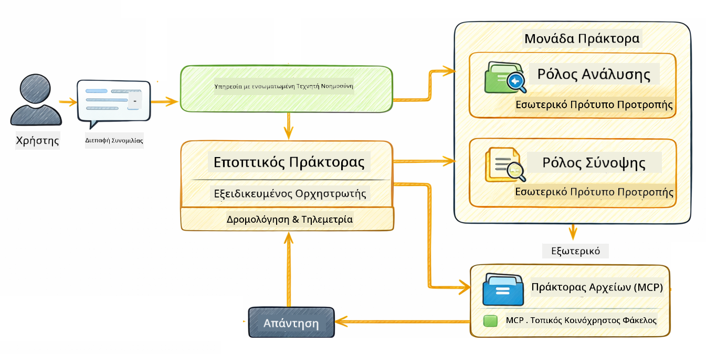

<!--
CO_OP_TRANSLATOR_METADATA:
{
  "original_hash": "f89f4c106d110e4943c055dd1a2f1dff",
  "translation_date": "2025-12-31T00:47:33+00:00",
  "source_file": "05-mcp/README.md",
  "language_code": "el"
}
-->
# Ενότητα 05: Πρωτόκολλο Πλαισίου Μοντέλου (MCP)

## Περιεχόμενα

- [Τι θα μάθετε](../../../05-mcp)
- [Τι είναι το MCP;](../../../05-mcp)
- [Πώς λειτουργεί το MCP](../../../05-mcp)
- [Η agentic μονάδα](../../../05-mcp)
- [Εκτέλεση των παραδειγμάτων](../../../05-mcp)
  - [Απαιτούμενα](../../../05-mcp)
- [Γρήγορη Έναρξη](../../../05-mcp)
  - [Λειτουργίες αρχείων (Stdio)](../../../05-mcp)
  - [Supervisor Agent](../../../05-mcp)
    - [Κατανόηση της εξόδου](../../../05-mcp)
    - [Επεξήγηση λειτουργιών της agentic μονάδας](../../../05-mcp)
- [Κύριες Έννοιες](../../../05-mcp)
- [Συγχαρητήρια!](../../../05-mcp)
  - [Τι ακολουθεί;](../../../05-mcp)

## Τι θα μάθετε

Έχετε δημιουργήσει συνομιλητική τεχνητή νοημοσύνη, έχετε κατακτήσει τις προτροπές, έχετε αγκυρώσει απαντήσεις σε έγγραφα και έχετε δημιουργήσει agents με εργαλεία. Αλλά όλα αυτά τα εργαλεία ήταν προσαρμοσμένα για την ειδική εφαρμογή σας. Τι θα γινόταν αν θα μπορούσατε να δώσετε στην τεχνητή νοημοσύνη σας πρόσβαση σε ένα τυποποιημένο οικοσύστημα εργαλείων που οποιοσδήποτε μπορεί να δημιουργήσει και να μοιραστεί; Σε αυτή την ενότητα, θα μάθετε πώς να το κάνετε με το Πρωτόκολλο Πλαισίου Μοντέλου (MCP) και τη μονάδα agentic του LangChain4j. Πρώτα παρουσιάζουμε έναν απλό αναγνώστη αρχείων MCP και στη συνέχεια δείχνουμε πώς ενσωματώνεται εύκολα σε προηγμένες ροές εργασίας agentic χρησιμοποιώντας το μοτίβο Supervisor Agent.

## Τι είναι το MCP;

Το Πρωτόκολλο Πλαισίου Μοντέλου (MCP) παρέχει ακριβώς αυτό - έναν τυποποιημένο τρόπο για εφαρμογές AI να ανακαλύπτουν και να χρησιμοποιούν εξωτερικά εργαλεία. Αντί να γράφετε προσαρμοσμένες ενσωματώσεις για κάθε πηγή δεδομένων ή υπηρεσία, συνδέεστε σε διακομιστές MCP που εκθέτουν τις δυνατότητές τους σε ένα συνεπές φορμά. Ο agent AI σας μπορεί τότε να ανακαλύψει και να χρησιμοποιήσει αυτά τα εργαλεία αυτόματα.


*Πριν το MCP: Πολύπλοκες σημείο-προς-σημείο ενσωματώσεις. Μετά το MCP: Ένα πρωτόκολλο, ατελείωτες δυνατότητες.*

Το MCP λύνει ένα θεμελιώδες πρόβλημα στην ανάπτυξη AI: κάθε ενσωμάτωση είναι προσαρμοσμένη. Θέλετε πρόσβαση στο GitHub; Προσαρμοσμένος κώδικας. Θέλετε να διαβάσετε αρχεία; Προσαρμοσμένος κώδικας. Θέλετε να κάνετε ερώτημα σε βάση δεδομένων; Προσαρμοσμένος κώδικας. Και καμία από αυτές τις ενσωματώσεις δεν λειτουργεί με άλλες εφαρμογές AI.

Το MCP το τυποποιεί αυτό. Ένας διακομιστής MCP εκθέτει εργαλεία με σαφείς περιγραφές και σχήματα παραμέτρων. Οποιοσδήποτε πελάτης MCP μπορεί να συνδεθεί, να ανακαλύψει τα διαθέσιμα εργαλεία και να τα χρησιμοποιήσει. Φτιάξτε μία φορά, χρησιμοποιήστε παντού.


*Αρχιτεκτονική Model Context Protocol - τυποποιημένη ανακάλυψη και εκτέλεση εργαλείων*

## Πώς λειτουργεί το MCP

**Αρχιτεκτονική Διακομιστή-Πελάτη**

Το MCP χρησιμοποιεί ένα μοντέλο πελάτη-διακομιστή. Οι διακομιστές παρέχουν εργαλεία - ανάγνωση αρχείων, ερωτήματα σε βάσεις δεδομένων, κλήσεις API. Οι πελάτες (η εφαρμογή AI σας) συνδέονται στους διακομιστές και χρησιμοποιούν τα εργαλεία τους.

Για να χρησιμοποιήσετε το MCP με το LangChain4j, προσθέστε αυτή την εξάρτηση Maven:

```xml
<dependency>
    <groupId>dev.langchain4j</groupId>
    <artifactId>langchain4j-mcp</artifactId>
    <version>${langchain4j.version}</version>
</dependency>
```

**Ανακάλυψη Εργαλείων**

Όταν ο πελάτης σας συνδέεται σε έναν διακομιστή MCP, ρωτάει "Τι εργαλεία έχετε;" Ο διακομιστής απαντά με μια λίστα διαθέσιμων εργαλείων, το καθένα με περιγραφές και σχήματα παραμέτρων. Ο agent AI σας μπορεί τότε να αποφασίσει ποια εργαλεία θα χρησιμοποιήσει βάσει των αιτημάτων του χρήστη.

**Μηχανισμοί Μεταφοράς**

Το MCP υποστηρίζει διαφορετικούς μηχανισμούς μεταφοράς. Αυτή η ενότητα παρουσιάζει τον μεταφορά Stdio για τοπικές διεργασίες:


*Μηχανισμοί μεταφοράς MCP: HTTP για απομακρυσμένους διακομιστές, Stdio για τοπικές διεργασίες*

**Stdio** - [StdioTransportDemo.java](../../../05-mcp/src/main/java/com/example/langchain4j/mcp/StdioTransportDemo.java)

Για τοπικές διεργασίες. Η εφαρμογή σας δημιουργεί έναν διακομιστή ως subprocess και επικοινωνεί μέσω standard input/output. Χρήσιμο για πρόσβαση στο σύστημα αρχείων ή εργαλεία γραμμής εντολών.

```java
McpTransport stdioTransport = new StdioMcpTransport.Builder()
    .command(List.of(
        npmCmd, "exec",
        "@modelcontextprotocol/server-filesystem@2025.12.18",
        resourcesDir
    ))
    .logEvents(false)
    .build();
```

> **🤖 Δοκιμάστε με [GitHub Copilot](https://github.com/features/copilot) Chat:** Ανοίξτε [`StdioTransportDemo.java`](../../../05-mcp/src/main/java/com/example/langchain4j/mcp/StdioTransportDemo.java) και ρωτήστε:
> - "Πώς λειτουργεί η μεταφορά Stdio και πότε πρέπει να τη χρησιμοποιήσω σε σύγκριση με το HTTP;"
> - "Πώς διαχειρίζεται το LangChain4j τον κύκλο ζωής των διεργασιών διακομιστή MCP που δημιουργούνται;"
> - "Ποιες είναι οι επιπτώσεις ασφαλείας του να δίνεται στην AI πρόσβαση στο σύστημα αρχείων;"

## Η agentic μονάδα

Ενώ το MCP παρέχει τυποποιημένα εργαλεία, η **agentic μονάδα** του LangChain4j παρέχει έναν δηλωτικό τρόπο για τη δημιουργία agents που ορχηστρώνουν αυτά τα εργαλεία. Η annotation `@Agent` και οι `AgenticServices` σας επιτρέπουν να ορίσετε τη συμπεριφορά του agent μέσω διεπαφών αντί για επεμβατικό κώδικα.

Σε αυτή την ενότητα, θα εξερευνήσετε το μοτίβο **Supervisor Agent** — μια προηγμένη προσέγγιση agentic AI όπου ένας "επόπτης" agent αποφασίζει δυναμικά ποιοι υπο-agents θα κληθούν βάσει των αιτημάτων του χρήστη. Θα συνδυάσουμε και τις δύο έννοιες δίνοντας σε έναν από τους υπο-agents δυνατότητες πρόσβασης σε αρχεία μέσω MCP.

Για να χρησιμοποιήσετε την agentic μονάδα, προσθέστε αυτή την εξάρτηση Maven:

```xml
<dependency>
    <groupId>dev.langchain4j</groupId>
    <artifactId>langchain4j-agentic</artifactId>
    <version>${langchain4j.mcp.version}</version>
</dependency>
```

> **⚠️ Πειραματικό:** Το module `langchain4j-agentic` είναι **πειραματικό** και υπόκειται σε αλλαγές. Ο σταθερός τρόπος για να κατασκευάσετε βοηθούς AI παραμένει το `langchain4j-core` με προσαρμοσμένα εργαλεία (Ενότητα 04).

## Εκτέλεση των παραδειγμάτων

### Απαιτούμενα

- Java 21+, Maven 3.9+
- Node.js 16+ και npm (για διακομιστές MCP)
- Μεταβλητές περιβάλλοντος ρυθμισμένες στο αρχείο `.env` (από τον ριζικό φάκελο):
  - **Για StdioTransportDemo:** `GITHUB_TOKEN` (GitHub Personal Access Token)
  - **Για SupervisorAgentDemo:** `AZURE_OPENAI_ENDPOINT`, `AZURE_OPENAI_API_KEY`, `AZURE_OPENAI_DEPLOYMENT` (ίδια με τις Ενοτητες 01-04)

> **Σημείωση:** Αν δεν έχετε ρυθμίσει ακόμα τις μεταβλητές περιβάλλοντος, δείτε [Module 00 - Quick Start](../00-quick-start/README.md) για οδηγίες, ή αντιγράψτε `.env.example` σε `.env` στον ριζικό φάκελο και συμπληρώστε τις τιμές σας.

## Γρήγορη Έναρξη

**Χρήση VS Code:** Απλώς κάντε δεξί κλικ σε οποιοδήποτε αρχείο demo στον Explorer και επιλέξτε **"Run Java"**, ή χρησιμοποιήστε τις ρυθμίσεις εκκίνησης από τον πίνακα Run and Debug (βεβαιωθείτε ότι έχετε προσθέσει το token στο αρχείο `.env` πρώτα).

**Χρήση Maven:** Εναλλακτικά, μπορείτε να εκτελέσετε από τη γραμμή εντολών με τα παραδείγματα παρακάτω.

### Λειτουργίες αρχείων (Stdio)

Αυτό δείχνει εργαλεία βασισμένα σε τοπικά subprocess.

**✅ Δεν απαιτούνται προαπαιτούμενα** - ο διακομιστής MCP δημιουργείται αυτόματα.

**Χρήση VS Code:** Κάντε δεξί κλικ στο `StdioTransportDemo.java` και επιλέξτε **"Run Java"**.

**Χρήση Maven:**

**Bash:**
```bash
export GITHUB_TOKEN=your_token_here
cd 05-mcp
mvn compile exec:java -Dexec.mainClass=com.example.langchain4j.mcp.StdioTransportDemo
```

**PowerShell:**
```powershell
$env:GITHUB_TOKEN=your_token_here
cd 05-mcp
mvn --% compile exec:java -Dexec.mainClass=com.example.langchain4j.mcp.StdioTransportDemo
```

Η εφαρμογή δημιουργεί αυτόματα έναν διακομιστή MCP για το σύστημα αρχείων και διαβάζει ένα τοπικό αρχείο. Παρατηρήστε πώς η διαχείριση του subprocess γίνεται για εσάς.

**Αναμενόμενη έξοδος:**
```
Assistant response: The file provides an overview of LangChain4j, an open-source Java library
for integrating Large Language Models (LLMs) into Java applications...
```

### Supervisor Agent




Το μοτίβο **Supervisor Agent** είναι μια **ευέλικτη** μορφή agentic AI. Σε αντίθεση με ντετερμινιστικές ροές εργασίας (διαδοχικές, βρόχος, παράλληλες), ένας Επόπτης χρησιμοποιεί ένα LLM για να αποφασίσει αυτόνομα ποιους agents θα κληθεί ανάλογα με το αίτημα του χρήστη.

**Συνδυάζοντας Supervisor με MCP:** Σε αυτό το παράδειγμα, δίνουμε στον `FileAgent` πρόσβαση σε εργαλεία του συστήματος αρχείων MCP μέσω `toolProvider(mcpToolProvider)`. Όταν ένας χρήστης ζητήσει να "διαβάσει και να αναλύσει ένα αρχείο", ο Supervisor αναλύει το αίτημα και δημιουργεί ένα σχέδιο εκτέλεσης. Στη συνέχεια προωθεί το αίτημα στον `FileAgent`, ο οποίος χρησιμοποιεί το εργαλείο MCP `read_file` για να ανακτήσει το περιεχόμενο. Ο Supervisor μεταβιβάζει αυτό το περιεχόμενο στον `AnalysisAgent` για ερμηνεία, και προαιρετικά καλεί τον `SummaryAgent` για σύνοψη των αποτελεσμάτων.

Αυτό δείχνει πώς τα εργαλεία MCP ενσωματώνονται ομαλά σε agentic ροές εργασίας — ο Supervisor δεν χρειάζεται να ξέρει το *πώς* διαβάζονται τα αρχεία, μόνο ότι ο `FileAgent` μπορεί να το κάνει. Ο Supervisor προσαρμόζεται δυναμικά σε διαφορετικούς τύπους αιτημάτων και επιστρέφει είτε την τελευταία απάντηση του agent είτε μια σύνοψη όλων των λειτουργιών.

**Χρήση των script εκκίνησης (Συνιστάται):**

Τα script εκκίνησης φορτώνουν αυτόματα τις μεταβλητές περιβάλλοντος από το ριζικό `.env` αρχείο:

**Bash:**
```bash
cd 05-mcp
chmod +x start.sh
./start.sh
```

**PowerShell:**
```powershell
cd 05-mcp
.\start.ps1
```

**Χρήση VS Code:** Κάντε δεξί κλικ στο `SupervisorAgentDemo.java` και επιλέξτε **"Run Java"** (βεβαιωθείτε ότι το αρχείο `.env` είναι ρυθμισμένο).

**Πώς λειτουργεί ο Supervisor:**

```java
// Ορίστε πολλαπλούς πράκτορες με συγκεκριμένες δυνατότητες
FileAgent fileAgent = AgenticServices.agentBuilder(FileAgent.class)
        .chatModel(model)
        .toolProvider(mcpToolProvider)  // Διαθέτει εργαλεία MCP για λειτουργίες αρχείων
        .build();

AnalysisAgent analysisAgent = AgenticServices.agentBuilder(AnalysisAgent.class)
        .chatModel(model)
        .build();

SummaryAgent summaryAgent = AgenticServices.agentBuilder(SummaryAgent.class)
        .chatModel(model)
        .build();

// Δημιουργήστε έναν Επόπτη που συντονίζει αυτούς τους πράκτορες
SupervisorAgent supervisor = AgenticServices.supervisorBuilder()
        .chatModel(model)  // Το μοντέλο "planner"
        .subAgents(fileAgent, analysisAgent, summaryAgent)
        .responseStrategy(SupervisorResponseStrategy.SUMMARY)
        .build();

// Ο Επόπτης αποφασίζει αυτόνομα ποιους πράκτορες θα ενεργοποιήσει
// Απλώς περάστε ένα αίτημα σε φυσική γλώσσα - το LLM σχεδιάζει την εκτέλεση
String response = supervisor.invoke("Read the file at /path/file.txt and analyze it");
```

Δείτε [SupervisorAgentDemo.java](../../../05-mcp/src/main/java/com/example/langchain4j/mcp/SupervisorAgentDemo.java) για την πλήρη υλοποίηση.

> **🤖 Δοκιμάστε με [GitHub Copilot](https://github.com/features/copilot) Chat:** Ανοίξτε [`SupervisorAgentDemo.java`](../../../05-mcp/src/main/java/com/example/langchain4j/mcp/SupervisorAgentDemo.java) και ρωτήστε:
> - "Πώς αποφασίζει ο Supervisor ποια agents να καλέσει;"
> - "Ποια είναι η διαφορά μεταξύ του Supervisor και των μοτίβων ροής εργασίας Sequential;"
> - "Πώς μπορώ να προσαρμόσω τη συμπεριφορά σχεδιασμού (planning) του Supervisor;"

#### Κατανόηση της εξόδου

Όταν εκτελέσετε το demo, θα δείτε ένα δομημένο walkthrough του πώς ο Supervisor ορχηστρώνει πολλούς agents. Αυτό σημαίνει κάθε τμήμα:

```
======================================================================
  SUPERVISOR AGENT DEMO
======================================================================

This demo shows how a Supervisor Agent orchestrates multiple specialized agents.
The Supervisor uses an LLM to decide which agent to call based on the task.
```

**Η κεφαλίδα** εισάγει το demo και εξηγεί την κεντρική ιδέα: ο Supervisor χρησιμοποιεί ένα LLM (όχι σκληροκωδικοποιημένους κανόνες) για να αποφασίσει ποιοι agents θα κληθούν.

```
--- AVAILABLE AGENTS -------------------------------------------------
  [FILE]     FileAgent     - Reads files using MCP filesystem tools
  [ANALYZE]  AnalysisAgent - Analyzes content for structure, tone, and themes
  [SUMMARY]  SummaryAgent  - Creates concise summaries of content
```

**Διαθέσιμοι Agents** εμφανίζει τους τρεις εξειδικευμένους agents που μπορεί να επιλέξει ο Supervisor. Κάθε agent έχει μια συγκεκριμένη ικανότητα:
- **FileAgent** μπορεί να διαβάσει αρχεία χρησιμοποιώντας εργαλεία MCP (εξωτερική δυνατότητα)
- **AnalysisAgent** αναλύει περιεχόμενο (καθαρή δυνατότητα LLM)
- **SummaryAgent** δημιουργεί σύνοψη (καθαρή δυνατότητα LLM)

```
--- USER REQUEST -----------------------------------------------------
  "Read the file at .../file.txt and analyze what it's about"
```

**Αίτημα Χρήστη** δείχνει τι ζητήθηκε. Ο Supervisor πρέπει να το αναλύσει και να αποφασίσει ποιοι agents θα κληθούν.

```
--- SUPERVISOR ORCHESTRATION -----------------------------------------
  The Supervisor will now decide which agents to invoke and in what order...

  +-- STEP 1: Supervisor chose -> FileAgent (reading file via MCP)
  |
  |   Input: .../file.txt
  |
  |   Result: LangChain4j is an open-source Java library designed to simplify...
  +-- [OK] FileAgent (reading file via MCP) completed

  +-- STEP 2: Supervisor chose -> AnalysisAgent (analyzing content)
  |
  |   Input: LangChain4j is an open-source Java library...
  |
  |   Result: Structure: The content is organized into clear paragraphs that int...
  +-- [OK] AnalysisAgent (analyzing content) completed
```

**Ορχήστρωση Supervisor** είναι όπου συμβαίνει το μαγικό. Δείτε πώς:
1. Ο Supervisor **επέλεξε πρώτα τον FileAgent** επειδή το αίτημα ανέφερε "διάβασε το αρχείο"
2. Ο FileAgent χρησιμοποίησε το εργαλείο MCP `read_file` για να ανακτήσει το περιεχόμενο του αρχείου
3. Ο Supervisor στη συνέχεια **επέλεξε τον AnalysisAgent** και πέρασε σε αυτόν το περιεχόμενο του αρχείου
4. Ο AnalysisAgent ανέλυσε τη δομή, τον τόνο και τα θέματα

Παρατηρήστε ότι ο Supervisor πήρε αυτές τις αποφάσεις **αυτόνομα** βάσει του αιτήματος του χρήστη — χωρίς σκληροκωδικοποιημένη ροή εργασίας!

**Τελική Απάντηση** είναι η συνθετική απάντηση του Supervisor, συνδυάζοντας τις εξόδους από όλους τους agents που κλήθηκαν. Το παράδειγμα εμφανίζει το agentic scope με τη σύνοψη και τα αποτελέσματα ανάλυσης που αποθηκεύτηκαν από κάθε agent.

```
--- FINAL RESPONSE ---------------------------------------------------
I read the contents of the file and analyzed its structure, tone, and key themes.
The file introduces LangChain4j as an open-source Java library for integrating
large language models...

--- AGENTIC SCOPE (Shared Memory) ------------------------------------
  Agents store their results in a shared scope for other agents to use:
  * summary: LangChain4j is an open-source Java library...
  * analysis: Structure: The content is organized into clear paragraphs that in...
```

### Επεξήγηση λειτουργιών της agentic μονάδας

Το παράδειγμα καταδεικνύει αρκετές προηγμένες λειτουργίες της agentic μονάδας. Ας ρίξουμε μια πιο κοντινή ματιά στο Agentic Scope και στα Agent Listeners.

**Agentic Scope** δείχνει τη μοιραζόμενη μνήμη όπου οι agents αποθήκευσαν τα αποτελέσματά τους χρησιμοποιώντας `@Agent(outputKey="...")`. Αυτό επιτρέπει:
- Σε μεταγενέστερους agents να έχουν πρόσβαση στις εξόδους προηγούμενων agents
- Στον Supervisor να συνθέσει μια τελική απάντηση
- Σε εσάς να εξετάσετε τι παρήγαγε κάθε agent

```java
ResultWithAgenticScope<String> result = supervisor.invokeWithAgenticScope(request);
AgenticScope scope = result.agenticScope();
String story = scope.readState("story");
List<AgentInvocation> history = scope.agentInvocations("analysisAgent");
```

**Agent Listeners** επιτρέπουν την παρακολούθηση και τον εντοπισμό σφαλμάτων κατά την εκτέλεση των agents. Η βήμα-προς-βήμα έξοδος που βλέπετε στο demo προέρχεται από έναν AgentListener που συνδέεται σε κάθε κλήση agent:
- **beforeAgentInvocation** - Καλείται όταν ο Supervisor επιλέγει έναν agent, επιτρέποντάς σας να δείτε ποιος agent επιλέχθηκε και γιατί
- **afterAgentInvocation** - Καλείται όταν ένας agent ολοκληρώσει, δείχνοντας το αποτέλεσμα του
- **inheritedBySubagents** - Όταν είναι true, ο listener παρακολουθεί όλους τους agents στην ιεραρχία

```java
AgentListener monitor = new AgentListener() {
    private int step = 0;
    
    @Override
    public void beforeAgentInvocation(AgentRequest request) {
        step++;
        System.out.println("  +-- STEP " + step + ": " + request.agentName());
    }
    
    @Override
    public void afterAgentInvocation(AgentResponse response) {
        System.out.println("  +-- [OK] " + response.agentName() + " completed");
    }
    
    @Override
    public boolean inheritedBySubagents() {
        return true; // Διαδώστε σε όλους τους υπο-πράκτορες
    }
};
```

Εκτός από το μοτίβο Supervisor, το module `langchain4j-agentic` παρέχει αρκετά ισχυρά μοτίβα ροής εργασίας και λειτουργίες:

| Pattern | Description | Use Case |
|---------|-------------|----------|
| **Sequential** | Execute agents in order, output flows to next | Pipelines: research → analyze → report |
| **Parallel** | Run agents simultaneously | Independent tasks: weather + news + stocks |
| **Loop** | Iterate until condition met | Quality scoring: refine until score ≥ 0.8 |
| **Conditional** | Route based on conditions | Classify → route to specialist agent |
| **Human-in-the-Loop** | Add human checkpoints | Approval workflows, content review |

## Κύριες Έννοιες

**Το MCP** είναι ιδανικό όταν θέλετε να αξιοποιήσετε υπάρχοντα οικοσυστήματα εργαλείων, να δημιουργήσετε εργαλεία που μπορούν να μοιραστούν πολλές εφαρμογές, να ενσωματώσετε υπηρεσίες τρίτων με τυπικά πρωτόκολλα, ή να αντικαταστήσετε υλοποιήσεις εργαλείων χωρίς να αλλάξετε κώδικα.

**Η agentic μονάδα** λειτουργεί καλύτερα όταν θέλετε δηλωτικούς ορισμούς agents με annotations `@Agent`, χρειάζεστε ορχήστρωση ροών εργασίας (διαδοχική, βρόχος, παράλληλη), προτιμάτε σχεδίαση agents με βάση διεπαφές αντί για επεμβατικό κώδικα, ή συνδυάζετε πολλούς agents που μοιράζονται εξόδους μέσω `outputKey`.

**Το μοτίβο Supervisor Agent** ξεχωρίζει όταν η ροή εργασίας δεν είναι προβλέψιμη εκ των προτέρων και θέλετε το LLM να αποφασίζει, όταν έχετε πολλούς εξειδικευμένους agents που χρειάζονται δυναμική ορχήστρωση, όταν δημιουργείτε συνομιλητικά συστήματα που δρομολογούν σε διαφορετικές δυνατότητες, ή όταν θέλετε την πιο ευέλικτη, προσαρμοστική συμπεριφορά agent.

## Συγχαρητήρια!

Έχετε ολοκληρώσει το μάθημα LangChain4j για αρχάριους. Έχετε μάθει:

- Πώς να δημιουργείτε συνομιλητική τεχνητή νοημοσύνη με μνήμη (Ενότητα 01)
- Πρότυπα μηχανικής προτροπών για διάφορες εργασίες (Ενότητα 02)
- Αγκύρωση απαντήσεων στα έγγραφά σας με RAG (Ενότητα 03)
- Δημιουργία βασικών agents AI (βοηθών) με προσαρμοσμένα εργαλεία (Ενότητα 04)
- Ενσωμάτωση τυποποιημένων εργαλείων με το LangChain4j MCP και τις Agentic μονάδες (Module 05)

### Τι ακολουθεί;

Μετά την ολοκλήρωση των μονάδων, εξερευνήστε τον [Οδηγό Δοκιμών](../docs/TESTING.md) για να δείτε τις έννοιες δοκιμών του LangChain4j στην πράξη.

**Επίσημοι Πόροι:**
- [Τεκμηρίωση LangChain4j](https://docs.langchain4j.dev/) - Εκτενείς οδηγοί και αναφορά API
- [GitHub του LangChain4j](https://github.com/langchain4j/langchain4j) - Πηγαίος κώδικας και παραδείγματα
- [Σεμινάρια LangChain4j](https://docs.langchain4j.dev/tutorials/) - Οδηγοί βήμα προς βήμα για διάφορες περιπτώσεις χρήσης

Σας ευχαριστούμε που ολοκληρώσατε αυτό το μάθημα!

---

**Navigation:** [← Previous: Module 04 - Tools](../04-tools/README.md) | [Back to Main](../README.md)

---

<!-- CO-OP TRANSLATOR DISCLAIMER START -->
**Αποποίηση ευθυνών**:
Αυτό το έγγραφο έχει μεταφραστεί χρησιμοποιώντας την υπηρεσία μετάφρασης με τεχνητή νοημοσύνη [Co-op Translator](https://github.com/Azure/co-op-translator). Παρόλο που επιδιώκουμε την ακρίβεια, παρακαλούμε να έχετε υπόψη ότι οι αυτοματοποιημένες μεταφράσεις ενδέχεται να περιέχουν λάθη ή ανακρίβειες. Το πρωτότυπο έγγραφο στην αρχική του γλώσσα πρέπει να θεωρείται η αυθεντική πηγή. Για κρίσιμες πληροφορίες συνιστάται επαγγελματική μετάφραση από ανθρώπινο μεταφραστή. Δεν φέρουμε ευθύνη για τυχόν παρεξηγήσεις ή λανθασμένες ερμηνείες που προκύπτουν από τη χρήση αυτής της μετάφρασης.
<!-- CO-OP TRANSLATOR DISCLAIMER END -->