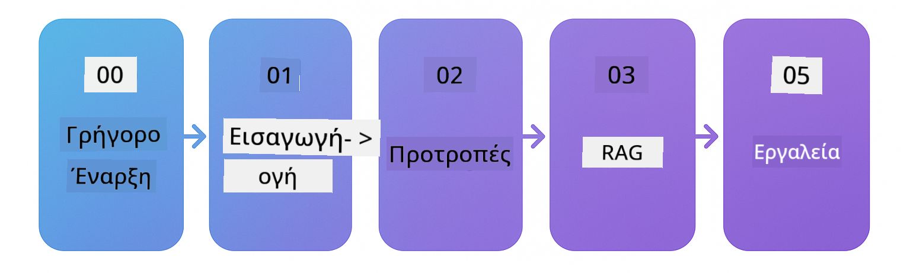

<!--
CO_OP_TRANSLATOR_METADATA:
{
  "original_hash": "8b9c4243c12488872afffa00f0092467",
  "translation_date": "2025-12-15T14:32:52+00:00",
  "source_file": "README.md",
  "language_code": "el"
}
-->

### 🌐 Υποστήριξη Πολλών Γλωσσών

#### Υποστηρίζεται μέσω GitHub Action (Αυτοματοποιημένο & Πάντα Ενημερωμένο)

<!-- CO-OP TRANSLATOR LANGUAGES TABLE START -->
[Αραβικά](../ar/README.md) | [Μπενγκάλι](../bn/README.md) | [Βουλγαρικά](../bg/README.md) | [Βιρμανικά (Μιανμάρ)](../my/README.md) | [Κινέζικα (Απλοποιημένα)](../zh/README.md) | [Κινέζικα (Παραδοσιακά, Χονγκ Κονγκ)](../hk/README.md) | [Κινέζικα (Παραδοσιακά, Μακάο)](../mo/README.md) | [Κινέζικα (Παραδοσιακά, Ταϊβάν)](../tw/README.md) | [Κροατικά](../hr/README.md) | [Τσέχικα](../cs/README.md) | [Δανικά](../da/README.md) | [Ολλανδικά](../nl/README.md) | [Εσθονικά](../et/README.md) | [Φινλανδικά](../fi/README.md) | [Γαλλικά](../fr/README.md) | [Γερμανικά](../de/README.md) | [Ελληνικά](./README.md) | [Εβραϊκά](../he/README.md) | [Χίντι](../hi/README.md) | [Ουγγρικά](../hu/README.md) | [Ινδονησιακά](../id/README.md) | [Ιταλικά](../it/README.md) | [Ιαπωνικά](../ja/README.md) | [Κανάντα](../kn/README.md) | [Κορεατικά](../ko/README.md) | [Λιθουανικά](../lt/README.md) | [Μαλαϊκά](../ms/README.md) | [Μαλαγιαλάμ](../ml/README.md) | [Μαράθι](../mr/README.md) | [Νεπάλι](../ne/README.md) | [Νιγηριανή Πίτζιν](../pcm/README.md) | [Νορβηγικά](../no/README.md) | [Περσικά (Φαρσί)](../fa/README.md) | [Πολωνικά](../pl/README.md) | [Πορτογαλικά (Βραζιλία)](../br/README.md) | [Πορτογαλικά (Πορτογαλία)](../pt/README.md) | [Πουντζάμπι (Γκουρμούκι)](../pa/README.md) | [Ρουμανικά](../ro/README.md) | [Ρωσικά](../ru/README.md) | [Σερβικά (Κυριλλικά)](../sr/README.md) | [Σλοβακικά](../sk/README.md) | [Σλοβενικά](../sl/README.md) | [Ισπανικά](../es/README.md) | [Σουαχίλι](../sw/README.md) | [Σουηδικά](../sv/README.md) | [Ταγκάλογκ (Φιλιππινέζικα)](../tl/README.md) | [Ταμίλ](../ta/README.md) | [Τελούγκου](../te/README.md) | [Ταϊλανδικά](../th/README.md) | [Τουρκικά](../tr/README.md) | [Ουκρανικά](../uk/README.md) | [Ουρντού](../ur/README.md) | [Βιετναμέζικα](../vi/README.md)
<!-- CO-OP TRANSLATOR LANGUAGES TABLE END -->

# LangChain4j για Αρχάριους

Ένα μάθημα για την κατασκευή εφαρμογών AI με LangChain4j και Azure OpenAI GPT-5, από βασική συνομιλία έως πράκτορες AI.

**Νέος στο LangChain4j;** Δείτε το [Γλωσσάρι](docs/GLOSSARY.md) για ορισμούς βασικών όρων και εννοιών.

## Πίνακας Περιεχομένων

1. [Γρήγορη Εκκίνηση](00-quick-start/README.md) - Ξεκινήστε με το LangChain4j  
2. [Εισαγωγή](01-introduction/README.md) - Μάθετε τα βασικά του LangChain4j  
3. [Μηχανική Προτροπής](02-prompt-engineering/README.md) - Κατακτήστε τον αποτελεσματικό σχεδιασμό προτροπών  
4. [RAG (Ανάκτηση-Ενισχυμένη Γενιά)](03-rag/README.md) - Δημιουργήστε έξυπνα συστήματα βασισμένα στη γνώση  
5. [Εργαλεία](04-tools/README.md) - Ενσωματώστε εξωτερικά εργαλεία και APIs με πράκτορες AI  
6. [MCP (Πρωτόκολλο Πλαισίου Μοντέλου)](05-mcp/README.md) - Εργαστείτε με το Πρωτόκολλο Πλαισίου Μοντέλου  
---

## Διαδρομή Μάθησης

Ξεκινήστε με το [Γρήγορη Εκκίνηση](00-quick-start/README.md) και προχωρήστε σε κάθε ενότητα για να αναπτύξετε τις δεξιότητές σας βήμα-βήμα. Θα δοκιμάσετε βασικά παραδείγματα για να κατανοήσετε τα θεμέλια πριν προχωρήσετε στην ενότητα [Εισαγωγή](01-introduction/README.md) για μια πιο βαθιά εμβάθυνση με το GPT-5.

Μετά την ολοκλήρωση των ενοτήτων, εξερευνήστε τον [Οδηγό Δοκιμών](docs/TESTING.md) για να δείτε τις έννοιες δοκιμών του LangChain4j σε δράση.

> **Σημείωση:** Αυτή η εκπαίδευση χρησιμοποιεί τόσο τα Μοντέλα GitHub όσο και το Azure OpenAI. Οι ενότητες [Γρήγορη Εκκίνηση](00-quick-start/README.md) και [MCP](05-mcp/README.md) χρησιμοποιούν Μοντέλα GitHub (δεν απαιτείται συνδρομή Azure), ενώ οι ενότητες 1-4 χρησιμοποιούν Azure OpenAI GPT-5.

## Μάθηση με το GitHub Copilot

Για να ξεκινήσετε γρήγορα τον προγραμματισμό, ανοίξτε αυτό το έργο σε έναν GitHub Codespace ή στο τοπικό σας IDE με το παρεχόμενο devcontainer. Το devcontainer που χρησιμοποιείται σε αυτό το μάθημα είναι προδιαμορφωμένο με το GitHub Copilot για προγραμματισμό AI σε ζευγάρι.

Κάθε παράδειγμα κώδικα περιλαμβάνει προτεινόμενες ερωτήσεις που μπορείτε να κάνετε στο GitHub Copilot για να εμβαθύνετε την κατανόησή σας. Αναζητήστε τις ενδείξεις 💡/🤖 σε:

- **Κεφαλίδες αρχείων Java** - Ερωτήσεις ειδικές για κάθε παράδειγμα  
- **README των ενοτήτων** - Ερωτήσεις εξερεύνησης μετά από παραδείγματα κώδικα  

**Πώς να το χρησιμοποιήσετε:** Ανοίξτε οποιοδήποτε αρχείο κώδικα και κάντε τις προτεινόμενες ερωτήσεις στο Copilot. Έχει πλήρες πλαίσιο του κώδικα και μπορεί να εξηγήσει, να επεκτείνει και να προτείνει εναλλακτικές.

Θέλετε να μάθετε περισσότερα; Δείτε το [Copilot για Προγραμματισμό AI σε Ζευγάρι](https://aka.ms/GitHubCopilotAI).

## Πρόσθετοι Πόροι 

### LangChain

---

### Azure / Edge / MCP / Πράκτορες

---
 
### Σειρά Γενετικής Τεχνητής Νοημοσύνης

[-9333EA?style=for-the-badge&labelColor=E5E7EB&color=9333EA)](https://github.com/microsoft/Generative-AI-for-beginners-dotnet?WT.mc_id=academic-105485-koreyst)
[-C084FC?style=for-the-badge&labelColor=E5E7EB&color=C084FC)](https://github.com/microsoft/generative-ai-for-beginners-java?WT.mc_id=academic-105485-koreyst)
[-E879F9?style=for-the-badge&labelColor=E5E7EB&color=E879F9)](https://github.com/microsoft/generative-ai-with-javascript?WT.mc_id=academic-105485-koreyst)

---
 
### Βασική Μάθηση

---
 
### Σειρά Copilot

## Λήψη Βοήθειας

Εάν κολλήσετε ή έχετε οποιεσδήποτε ερωτήσεις σχετικά με την κατασκευή εφαρμογών AI, συμμετάσχετε:

Εάν έχετε σχόλια για το προϊόν ή σφάλματα κατά την κατασκευή, επισκεφθείτε:

## Άδεια

Άδεια MIT - Δείτε το αρχείο [LICENSE](../../LICENSE) για λεπτομέρειες.

---

<!-- CO-OP TRANSLATOR DISCLAIMER START -->
**Αποποίηση ευθυνών**:  
Αυτό το έγγραφο έχει μεταφραστεί χρησιμοποιώντας την υπηρεσία αυτόματης μετάφρασης AI [Co-op Translator](https://github.com/Azure/co-op-translator). Παρόλο που επιδιώκουμε την ακρίβεια, παρακαλούμε να λάβετε υπόψη ότι οι αυτόματες μεταφράσεις ενδέχεται να περιέχουν λάθη ή ανακρίβειες. Το πρωτότυπο έγγραφο στη μητρική του γλώσσα πρέπει να θεωρείται η αυθεντική πηγή. Για κρίσιμες πληροφορίες, συνιστάται επαγγελματική ανθρώπινη μετάφραση. Δεν φέρουμε ευθύνη για τυχόν παρεξηγήσεις ή λανθασμένες ερμηνείες που προκύπτουν από τη χρήση αυτής της μετάφρασης.
<!-- CO-OP TRANSLATOR DISCLAIMER END -->