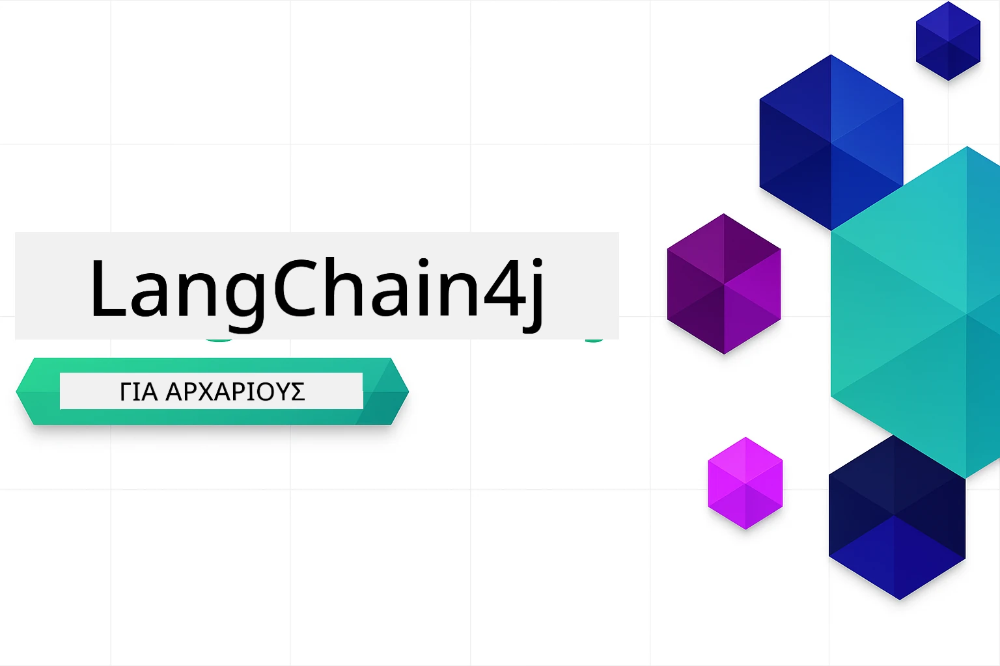

# LangChain4j για Αρχάριους

Ένα μάθημα για την κατασκευή εφαρμογών AI με LangChain4j και Azure OpenAI GPT-5.2, από βασική συνομιλία έως πράκτορες AI.

### 🌐 Υποστήριξη Πολλών Γλωσσών

#### Υποστηρίζεται μέσω GitHub Action (Αυτόματη & Πάντα Ενημερωμένη)

<!-- CO-OP TRANSLATOR LANGUAGES TABLE START -->
[Arabic](../ar/README.md) | [Bengali](../bn/README.md) | [Bulgarian](../bg/README.md) | [Burmese (Myanmar)](../my/README.md) | [Chinese (Simplified)](../zh-CN/README.md) | [Chinese (Traditional, Hong Kong)](../zh-HK/README.md) | [Chinese (Traditional, Macau)](../zh-MO/README.md) | [Chinese (Traditional, Taiwan)](../zh-TW/README.md) | [Croatian](../hr/README.md) | [Czech](../cs/README.md) | [Danish](../da/README.md) | [Dutch](../nl/README.md) | [Estonian](../et/README.md) | [Finnish](../fi/README.md) | [French](../fr/README.md) | [German](../de/README.md) | [Greek](./README.md) | [Hebrew](../he/README.md) | [Hindi](../hi/README.md) | [Hungarian](../hu/README.md) | [Indonesian](../id/README.md) | [Italian](../it/README.md) | [Japanese](../ja/README.md) | [Kannada](../kn/README.md) | [Khmer](../km/README.md) | [Korean](../ko/README.md) | [Lithuanian](../lt/README.md) | [Malay](../ms/README.md) | [Malayalam](../ml/README.md) | [Marathi](../mr/README.md) | [Nepali](../ne/README.md) | [Nigerian Pidgin](../pcm/README.md) | [Norwegian](../no/README.md) | [Persian (Farsi)](../fa/README.md) | [Polish](../pl/README.md) | [Portuguese (Brazil)](../pt-BR/README.md) | [Portuguese (Portugal)](../pt-PT/README.md) | [Punjabi (Gurmukhi)](../pa/README.md) | [Romanian](../ro/README.md) | [Russian](../ru/README.md) | [Serbian (Cyrillic)](../sr/README.md) | [Slovak](../sk/README.md) | [Slovenian](../sl/README.md) | [Spanish](../es/README.md) | [Swahili](../sw/README.md) | [Swedish](../sv/README.md) | [Tagalog (Filipino)](../tl/README.md) | [Tamil](../ta/README.md) | [Telugu](../te/README.md) | [Thai](../th/README.md) | [Turkish](../tr/README.md) | [Ukrainian](../uk/README.md) | [Urdu](../ur/README.md) | [Vietnamese](../vi/README.md)

> **Προτιμάτε τοπική κλωνοποίηση;**
>
> Αποθετήριο περιλαμβάνει πάνω από 50 μεταφράσεις γλωσσών που αυξάνουν σημαντικά το μέγεθος λήψης. Για κλωνοποίηση χωρίς μεταφράσεις, χρησιμοποιήστε sparse checkout:
>
> **Bash / macOS / Linux:**
> ```bash
> git clone --filter=blob:none --sparse https://github.com/microsoft/LangChain4j-for-Beginners.git
> cd LangChain4j-for-Beginners
> git sparse-checkout set --no-cone '/*' '!translations' '!translated_images'
> ```
>
> **CMD (Windows):**
> ```cmd
> git clone --filter=blob:none --sparse https://github.com/microsoft/LangChain4j-for-Beginners.git
> cd LangChain4j-for-Beginners
> git sparse-checkout set --no-cone "/*" "!translations" "!translated_images"
> ```
>
> Αυτό σας δίνει ό,τι χρειάζεστε για να ολοκληρώσετε το μάθημα με πολύ πιο γρήγορη λήψη.
<!-- CO-OP TRANSLATOR LANGUAGES TABLE END -->

## Πίνακας Περιεχομένων

1. [Εισαγωγή](01-introduction/README.md) - Μάθετε τα βασικά του LangChain4j
2. [Μηχανική Προτροπών](02-prompt-engineering/README.md) - Κατακτήστε τον αποτελεσματικό σχεδιασμό προτροπών
3. [RAG (Γεννήτρια Αναζήτησης)](03-rag/README.md) - Δημιουργήστε ευφυή συστήματα γνώσης
4. [Εργαλεία](04-tools/README.md) - Ενσωματώστε εξωτερικά εργαλεία και απλούς βοηθούς
5. [MCP (Πρωτόκολλο Πλαισίου Μοντέλου)](05-mcp/README.md) - Εργαστείτε με το Πρωτόκολλο Πλαισίου Μοντέλου (MCP) και τα μονάδα Πρακτόρων

### Βίντεο Καθοδήγησης

Κάθε ενότητα έχει μια συνοδευτική ζωντανή συνεδρία όπου περιηγούμαστε βήμα προς βήμα τις έννοιες και τον κώδικα.

| Ενότητα | Βίντεο |
|--------|-------|
| 01 - Εισαγωγή | [Ξεκινώντας με το LangChain4j](https://www.youtube.com/live/nl_troDm8rQ) |
| 02 - Μηχανική Προτροπών | [Μηχανική Προτροπών με LangChain4j](https://www.youtube.com/live/PJ6aBaE6bog) |
| 03 - RAG | [RAG με LangChain4j](https://www.youtube.com/watch?v=_olq75ZH_eY) |
| 04 - Εργαλεία & 05 - MCP | [Πράκτορες AI με Εργαλεία και MCP](https://www.youtube.com/watch?v=O_J30kZc0rw) |

---

## Μαθησιακή Διαδρομή

**Νέος στο LangChain4j;** Δείτε το [Λεξιλόγιο](docs/GLOSSARY.md) για ορισμούς βασικών όρων και εννοιών.

> **Γρήγορη Εκκίνηση**

1. Κάντε fork αυτό το αποθετήριο στον λογαριασμό σας στο GitHub
2. Κάντε κλικ **Code** → καρτέλα **Codespaces** → **...** → **Νέο με επιλογές...**
3. Χρησιμοποιήστε τις προεπιλογές – αυτό θα επιλέξει το Development container που δημιουργήθηκε για αυτό το μάθημα
4. Κάντε κλικ **Δημιουργία codespace**
5. Περιμένετε 5-10 λεπτά για να ετοιμαστεί το περιβάλλον
6. Μεταβείτε κατευθείαν στην [Εισαγωγή](./01-introduction/README.md) για να ξεκινήσετε!

Μετά την ολοκλήρωση των ενοτήτων, εξερευνήστε τον [Οδηγό Δοκιμών](docs/TESTING.md) για να δείτε τις έννοιες δοκιμών LangChain4j εν δράσει.

> **Σημείωση:** Αυτή η εκπαίδευση χρησιμοποιεί Azure OpenAI. Ξεκινήστε με έναν [ΔΩΡΕΑΝ λογαριασμό Azure](https://aka.ms/azure-free-account) αν δεν έχετε ήδη.


## Μάθηση με GitHub Copilot

Για να ξεκινήσετε γρήγορα τον προγραμματισμό, ανοίξτε αυτό το έργο σε GitHub Codespace ή στον τοπικό IDE σας με το παρεχόμενο devcontainer. Το devcontainer που χρησιμοποιείται σε αυτό το μάθημα έρχεται προ-διαμορφωμένο με GitHub Copilot για προγραμματισμό AI σε ζευγάρι.

Κάθε παράδειγμα κώδικα περιλαμβάνει προτεινόμενες ερωτήσεις που μπορείτε να κάνετε στον GitHub Copilot για να εμβαθύνετε την κατανόησή σας. Αναζητήστε τα εικονίδια 💡/🤖 στα:

- **Κεφαλίδες αρχείων Java** - Ερωτήσεις ειδικές για κάθε παράδειγμα
- **README των ενοτήτων** - Εξερευνητικές προτροπές μετά από παραδείγματα κώδικα

**Πώς να χρησιμοποιήσετε:** Ανοίξτε οποιοδήποτε αρχείο κώδικα και κάντε στον Copilot τις προτεινόμενες ερωτήσεις. Διαθέτει πλήρες πλαίσιο για τον κώδικα και μπορεί να εξηγήσει, να επεκτείνει και να προτείνει εναλλακτικές λύσεις.

Θέλετε να μάθετε περισσότερα; Δείτε το [Copilot για προγραμματισμό AI σε ζευγάρι](https://aka.ms/GitHubCopilotAI).


## Πρόσθετοι Πόροι

<!-- CO-OP TRANSLATOR OTHER COURSES START -->
### LangChain
[](https://aka.ms/langchain4j-for-beginners)
[](https://aka.ms/langchainjs-for-beginners?WT.mc_id=m365-94501-dwahlin)
[](https://github.com/microsoft/langchain-for-beginners?WT.mc_id=m365-94501-dwahlin)
---

### Azure / Edge / MCP / Πράκτορες
[](https://github.com/microsoft/AZD-for-beginners?WT.mc_id=academic-105485-koreyst)
[](https://github.com/microsoft/edgeai-for-beginners?WT.mc_id=academic-105485-koreyst)
[](https://github.com/microsoft/mcp-for-beginners?WT.mc_id=academic-105485-koreyst)
[](https://github.com/microsoft/ai-agents-for-beginners?WT.mc_id=academic-105485-koreyst)

---
 
### Σειρά Γενετικής Τεχνητής Νοημοσύνης
[](https://github.com/microsoft/generative-ai-for-beginners?WT.mc_id=academic-105485-koreyst)
[-9333EA?style=for-the-badge&labelColor=E5E7EB&color=9333EA)](https://github.com/microsoft/Generative-AI-for-beginners-dotnet?WT.mc_id=academic-105485-koreyst)
[-C084FC?style=for-the-badge&labelColor=E5E7EB&color=C084FC)](https://github.com/microsoft/generative-ai-for-beginners-java?WT.mc_id=academic-105485-koreyst)
[-E879F9?style=for-the-badge&labelColor=E5E7EB&color=E879F9)](https://github.com/microsoft/generative-ai-with-javascript?WT.mc_id=academic-105485-koreyst)

---
 
### Βασική Μάθηση
[](https://aka.ms/ml-beginners?WT.mc_id=academic-105485-koreyst)
[](https://aka.ms/datascience-beginners?WT.mc_id=academic-105485-koreyst)
[](https://aka.ms/ai-beginners?WT.mc_id=academic-105485-koreyst)
[](https://github.com/microsoft/Security-101?WT.mc_id=academic-96948-sayoung)
[](https://aka.ms/webdev-beginners?WT.mc_id=academic-105485-koreyst)
[](https://aka.ms/iot-beginners?WT.mc_id=academic-105485-koreyst)
[](https://github.com/microsoft/xr-development-for-beginners?WT.mc_id=academic-105485-koreyst)

---
 
### Σειρά Copilot
[](https://aka.ms/GitHubCopilotAI?WT.mc_id=academic-105485-koreyst)
[](https://github.com/microsoft/mastering-github-copilot-for-dotnet-csharp-developers?WT.mc_id=academic-105485-koreyst)
[](https://github.com/microsoft/CopilotAdventures?WT.mc_id=academic-105485-koreyst)
<!-- CO-OP TRANSLATOR OTHER COURSES END -->

## Λήψη Βοήθειας

Εάν κολλήσετε ή έχετε ερωτήσεις σχετικά με την ανάπτυξη εφαρμογών AI, εγγραφείτε:

[](https://aka.ms/foundry/discord)

Εάν έχετε σχόλια για το προϊόν ή σφάλματα κατά την ανάπτυξη, επισκεφτείτε:

[](https://aka.ms/foundry/forum)

## Άδεια

Άδεια MIT - Δείτε το αρχείο [LICENSE](../../LICENSE) για λεπτομέρειες.

---

<!-- CO-OP TRANSLATOR DISCLAIMER START -->
**Αποποίηση ευθυνών**:
Αυτό το έγγραφο έχει μεταφραστεί χρησιμοποιώντας την υπηρεσία μετάφρασης με τεχνητή νοημοσύνη [Co-op Translator](https://github.com/Azure/co-op-translator). Ενώ επιδιώκουμε την ακρίβεια, παρακαλούμε να έχετε υπόψη ότι οι αυτοματοποιημένες μεταφράσεις ενδέχεται να περιέχουν λάθη ή ανακρίβειες. Το πρωτότυπο έγγραφο στη μητρική του γλώσσα πρέπει να θεωρείται η αυθεντική πηγή. Για κρίσιμες πληροφορίες, συνιστάται επαγγελματική ανθρώπινη μετάφραση. Δεν φέρουμε ευθύνη για τυχόν παρεξηγήσεις ή λανθασμένες ερμηνείες που προκύπτουν από τη χρήση αυτής της μετάφρασης.
<!-- CO-OP TRANSLATOR DISCLAIMER END -->