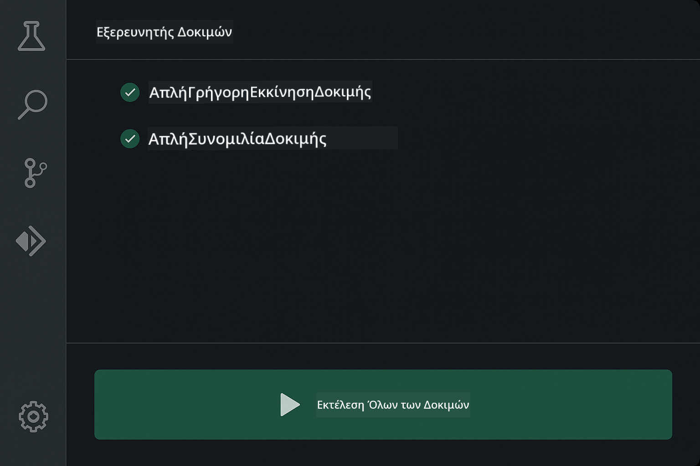
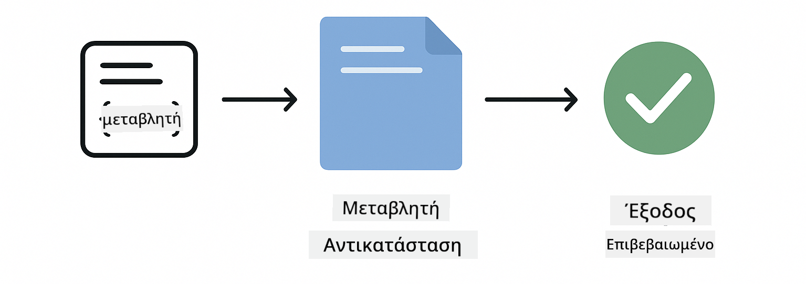
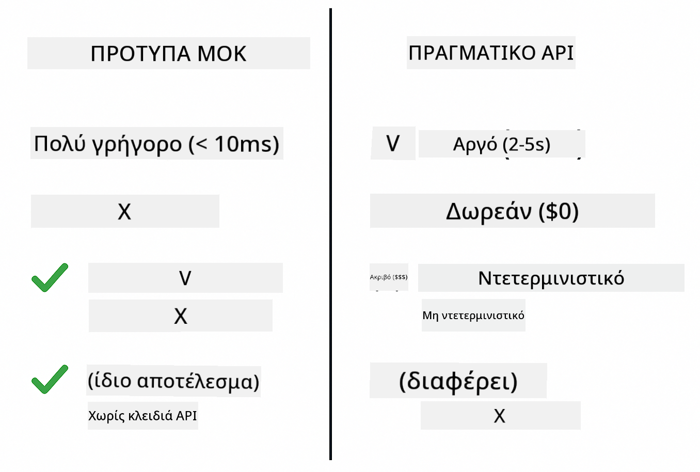
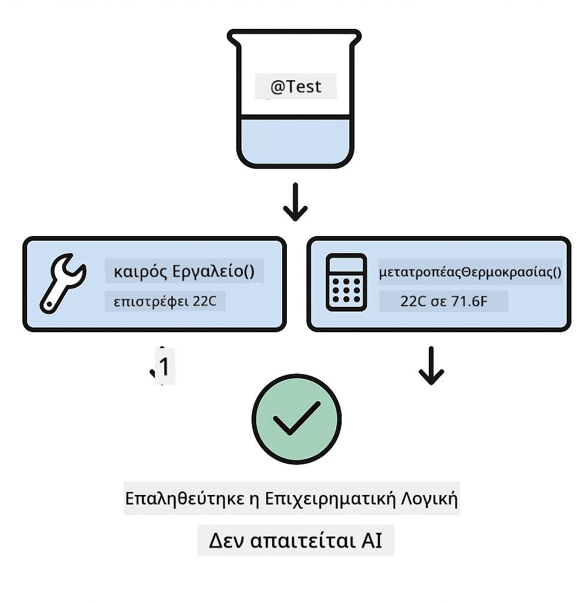
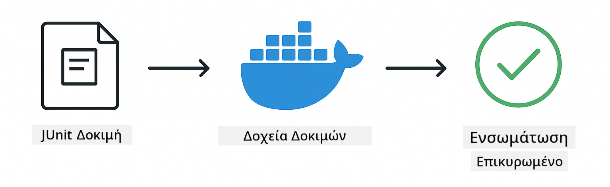

<!--
CO_OP_TRANSLATOR_METADATA:
{
  "original_hash": "b975537560c404d5f254331832811e78",
  "translation_date": "2025-12-13T21:02:43+00:00",
  "source_file": "docs/TESTING.md",
  "language_code": "el"
}
-->
# Δοκιμή Εφαρμογών LangChain4j

## Πίνακας Περιεχομένων

- [Γρήγορη Εκκίνηση](../../../docs)
- [Τι Καλύπτουν οι Δοκιμές](../../../docs)
- [Εκτέλεση των Δοκιμών](../../../docs)
- [Εκτέλεση Δοκιμών στο VS Code](../../../docs)
- [Πρότυπα Δοκιμών](../../../docs)
- [Φιλοσοφία Δοκιμών](../../../docs)
- [Επόμενα Βήματα](../../../docs)

Αυτός ο οδηγός σας καθοδηγεί μέσα από τις δοκιμές που δείχνουν πώς να δοκιμάζετε εφαρμογές AI χωρίς να απαιτούνται κλειδιά API ή εξωτερικές υπηρεσίες.

## Γρήγορη Εκκίνηση

Εκτελέστε όλες τις δοκιμές με μία εντολή:

**Bash:**
```bash
mvn test
```

**PowerShell:**
```powershell
mvn --% test
```


*Επιτυχημένη εκτέλεση δοκιμών που δείχνει όλες τις δοκιμές να περνούν χωρίς αποτυχίες*

## Τι Καλύπτουν οι Δοκιμές

Αυτό το μάθημα εστιάζει σε **μονάδες δοκιμών** που εκτελούνται τοπικά. Κάθε δοκιμή παρουσιάζει μια συγκεκριμένη έννοια του LangChain4j απομονωμένα.


*Πυραμίδα δοκιμών που δείχνει την ισορροπία μεταξύ μονάδων δοκιμών (γρήγορες, απομονωμένες), δοκιμών ολοκλήρωσης (πραγματικά συστατικά) και δοκιμών end-to-end (ολόκληρο σύστημα με Docker). Αυτή η εκπαίδευση καλύπτει τη μονάδα δοκιμών.*

| Ενότητα | Δοκιμές | Εστίαση | Κύρια Αρχεία |
|--------|-------|-------|-----------|
| **00 - Γρήγορη Εκκίνηση** | 6 | Πρότυπα προτροπών και αντικατάσταση μεταβλητών | `SimpleQuickStartTest.java` |
| **01 - Εισαγωγή** | 8 | Μνήμη συνομιλίας και κατάσταση συνομιλίας | `SimpleConversationTest.java` |
| **02 - Μηχανική Προτροπών** | 12 | Πρότυπα GPT-5, επίπεδα επιθυμίας, δομημένη έξοδος | `SimpleGpt5PromptTest.java` |
| **03 - RAG** | 10 | Εισαγωγή εγγράφων, ενσωματώσεις, αναζήτηση ομοιότητας | `DocumentServiceTest.java` |
| **04 - Εργαλεία** | 12 | Κλήση λειτουργιών και αλυσίδωση εργαλείων | `SimpleToolsTest.java` |
| **05 - MCP** | 15 | Πρωτόκολλο Πλαισίου Μοντέλου με Docker | `SimpleMcpTest.java`, `McpDockerTransportTest.java` |

## Εκτέλεση των Δοκιμών

**Εκτελέστε όλες τις δοκιμές από τη ρίζα:**

**Bash:**
```bash
mvn test
```

**PowerShell:**
```powershell
mvn --% test
```

**Εκτέλεση δοκιμών για συγκεκριμένη ενότητα:**

**Bash:**
```bash
cd 01-introduction && mvn test
# Ή από τη ρίζα
mvn test -pl 01-introduction
```

**PowerShell:**
```powershell
cd 01-introduction; mvn --% test
# Ή από τη ρίζα
mvn --% test -pl 01-introduction
```

**Εκτέλεση μιας μεμονωμένης κλάσης δοκιμών:**

**Bash:**
```bash
mvn test -Dtest=SimpleConversationTest
```

**PowerShell:**
```powershell
mvn --% test -Dtest=SimpleConversationTest
```

**Εκτέλεση συγκεκριμένης μεθόδου δοκιμής:**

**Bash:**
```bash
mvn test -Dtest=SimpleConversationTest#θα πρέπει να διατηρεί το ιστορικό συνομιλίας
```

**PowerShell:**
```powershell
mvn --% test -Dtest=SimpleConversationTest#θα πρέπει να διατηρεί το ιστορικό συνομιλίας
```

## Εκτέλεση Δοκιμών στο VS Code

Αν χρησιμοποιείτε το Visual Studio Code, ο Εξερευνητής Δοκιμών παρέχει γραφικό περιβάλλον για την εκτέλεση και αποσφαλμάτωση δοκιμών.



*Εξερευνητής Δοκιμών VS Code που δείχνει το δέντρο δοκιμών με όλες τις κλάσεις δοκιμών Java και μεμονωμένες μεθόδους δοκιμών*

**Για να εκτελέσετε δοκιμές στο VS Code:**

1. Ανοίξτε τον Εξερευνητή Δοκιμών κάνοντας κλικ στο εικονίδιο του δοκιμαστικού σωλήνα στη γραμμή δραστηριοτήτων
2. Αναπτύξτε το δέντρο δοκιμών για να δείτε όλες τις ενότητες και τις κλάσεις δοκιμών
3. Κάντε κλικ στο κουμπί αναπαραγωγής δίπλα σε οποιαδήποτε δοκιμή για να την εκτελέσετε μεμονωμένα
4. Κάντε κλικ στο "Εκτέλεση Όλων των Δοκιμών" για να εκτελέσετε ολόκληρο το σύνολο
5. Κάντε δεξί κλικ σε οποιαδήποτε δοκιμή και επιλέξτε "Αποσφαλμάτωση Δοκιμής" για να ορίσετε σημεία διακοπής και να προχωρήσετε βήμα-βήμα στον κώδικα

Ο Εξερευνητής Δοκιμών δείχνει πράσινα σημάδια ελέγχου για τις περασμένες δοκιμές και παρέχει λεπτομερή μηνύματα αποτυχίας όταν οι δοκιμές αποτυγχάνουν.

## Πρότυπα Δοκιμών


*Έξι πρότυπα δοκιμών για εφαρμογές LangChain4j: πρότυπα προτροπών, ψευδομοντέλα, απομόνωση συνομιλίας, δοκιμή εργαλείων, RAG εντός μνήμης, και ενσωμάτωση Docker*

### Πρότυπο 1: Δοκιμή Προτύπων Προτροπών

Το απλούστερο πρότυπο δοκιμάζει πρότυπα προτροπών χωρίς να καλεί κανένα μοντέλο AI. Επαληθεύετε ότι η αντικατάσταση μεταβλητών λειτουργεί σωστά και οι προτροπές μορφοποιούνται όπως αναμένεται.



*Δοκιμή προτύπων προτροπών που δείχνει τη ροή αντικατάστασης μεταβλητών: πρότυπο με θέσεις κράτησης → εφαρμοσμένες τιμές → επαληθευμένη μορφοποιημένη έξοδος*

```java
@Test
@DisplayName("Should format prompt template with variables")
void testPromptTemplateFormatting() {
    PromptTemplate template = PromptTemplate.from(
        "Best time to visit {{destination}} for {{activity}}?"
    );
    
    Prompt prompt = template.apply(Map.of(
        "destination", "Paris",
        "activity", "sightseeing"
    ));
    
    assertThat(prompt.text()).isEqualTo("Best time to visit Paris for sightseeing?");
}
```

Αυτή η δοκιμή βρίσκεται στο `00-quick-start/src/test/java/com/example/langchain4j/quickstart/SimpleQuickStartTest.java`.

**Εκτελέστε την:**

**Bash:**
```bash
cd 00-quick-start && mvn test -Dtest=SimpleQuickStartTest#μορφοποίησηΠροτύπουΠροτροπήςΔοκιμής
```

**PowerShell:**
```powershell
cd 00-quick-start; mvn --% test -Dtest=SimpleQuickStartTest#μορφοποίησηΠροτύπουΠροτροπήςΔοκιμής
```

### Πρότυπο 2: Ψευδομοντέλα Γλωσσικών Μοντέλων

Κατά τη δοκιμή της λογικής συνομιλίας, χρησιμοποιήστε το Mockito για να δημιουργήσετε ψεύτικα μοντέλα που επιστρέφουν προκαθορισμένες απαντήσεις. Αυτό κάνει τις δοκιμές γρήγορες, δωρεάν και ντετερμινιστικές.



*Σύγκριση που δείχνει γιατί προτιμώνται τα ψευδομοντέλα για δοκιμές: είναι γρήγορα, δωρεάν, ντετερμινιστικά και δεν απαιτούν κλειδιά API*

```java
@ExtendWith(MockitoExtension.class)
class SimpleConversationTest {
    
    private ConversationService conversationService;
    
    @Mock
    private OpenAiOfficialChatModel mockChatModel;
    
    @BeforeEach
    void setUp() {
        ChatResponse mockResponse = ChatResponse.builder()
            .aiMessage(AiMessage.from("This is a test response"))
            .build();
        when(mockChatModel.chat(anyList())).thenReturn(mockResponse);
        
        conversationService = new ConversationService(mockChatModel);
    }
    
    @Test
    void shouldMaintainConversationHistory() {
        String conversationId = conversationService.startConversation();
        
        ChatResponse mockResponse1 = ChatResponse.builder()
            .aiMessage(AiMessage.from("Response 1"))
            .build();
        ChatResponse mockResponse2 = ChatResponse.builder()
            .aiMessage(AiMessage.from("Response 2"))
            .build();
        ChatResponse mockResponse3 = ChatResponse.builder()
            .aiMessage(AiMessage.from("Response 3"))
            .build();
        
        when(mockChatModel.chat(anyList()))
            .thenReturn(mockResponse1)
            .thenReturn(mockResponse2)
            .thenReturn(mockResponse3);

        conversationService.chat(conversationId, "First message");
        conversationService.chat(conversationId, "Second message");
        conversationService.chat(conversationId, "Third message");

        List<ChatMessage> history = conversationService.getHistory(conversationId);
        assertThat(history).hasSize(6); // 3 μηνύματα χρήστη + 3 μηνύματα AI
    }
}
```

Αυτό το πρότυπο εμφανίζεται στο `01-introduction/src/test/java/com/example/langchain4j/service/SimpleConversationTest.java`. Το ψευδομοντέλο εξασφαλίζει συνεπή συμπεριφορά ώστε να μπορείτε να επαληθεύσετε ότι η διαχείριση μνήμης λειτουργεί σωστά.

### Πρότυπο 3: Δοκιμή Απομόνωσης Συνομιλίας

Η μνήμη συνομιλίας πρέπει να κρατά πολλούς χρήστες ξεχωριστούς. Αυτή η δοκιμή επαληθεύει ότι οι συνομιλίες δεν αναμειγνύουν τα συμφραζόμενα.


*Δοκιμή απομόνωσης συνομιλίας που δείχνει ξεχωριστές αποθήκες μνήμης για διαφορετικούς χρήστες για να αποτραπεί η ανάμειξη συμφραζομένων*

```java
@Test
void shouldIsolateConversationsByid() {
    String conv1 = conversationService.startConversation();
    String conv2 = conversationService.startConversation();
    
    ChatResponse mockResponse = ChatResponse.builder()
        .aiMessage(AiMessage.from("Response"))
        .build();
    when(mockChatModel.chat(anyList())).thenReturn(mockResponse);

    conversationService.chat(conv1, "Message for conversation 1");
    conversationService.chat(conv2, "Message for conversation 2");

    List<ChatMessage> history1 = conversationService.getHistory(conv1);
    List<ChatMessage> history2 = conversationService.getHistory(conv2);
    
    assertThat(history1).hasSize(2);
    assertThat(history2).hasSize(2);
}
```

Κάθε συνομιλία διατηρεί το δικό της ανεξάρτητο ιστορικό. Σε παραγωγικά συστήματα, αυτή η απομόνωση είναι κρίσιμη για εφαρμογές πολλαπλών χρηστών.

### Πρότυπο 4: Δοκιμή Εργαλείων Ανεξάρτητα

Τα εργαλεία είναι λειτουργίες που μπορεί να καλέσει το AI. Δοκιμάστε τα απευθείας για να βεβαιωθείτε ότι λειτουργούν σωστά ανεξάρτητα από τις αποφάσεις του AI.



*Δοκιμή εργαλείων ανεξάρτητα που δείχνει εκτέλεση ψευδοεργαλείου χωρίς κλήσεις AI για επαλήθευση της επιχειρηματικής λογικής*

```java
@Test
void shouldConvertCelsiusToFahrenheit() {
    TemperatureTool tempTool = new TemperatureTool();
    String result = tempTool.celsiusToFahrenheit(25.0);
    assertThat(result).containsPattern("77[.,]0°F");
}

@Test
void shouldDemonstrateToolChaining() {
    WeatherTool weatherTool = new WeatherTool();
    TemperatureTool tempTool = new TemperatureTool();

    String weatherResult = weatherTool.getCurrentWeather("Seattle");
    assertThat(weatherResult).containsPattern("\\d+°C");

    String conversionResult = tempTool.celsiusToFahrenheit(22.0);
    assertThat(conversionResult).containsPattern("71[.,]6°F");
}
```

Αυτές οι δοκιμές από το `04-tools/src/test/java/com/example/langchain4j/agents/tools/SimpleToolsTest.java` επικυρώνουν τη λογική εργαλείων χωρίς εμπλοκή AI. Το παράδειγμα αλυσίδωσης δείχνει πώς η έξοδος ενός εργαλείου τροφοδοτεί την είσοδο ενός άλλου.

### Πρότυπο 5: Δοκιμή RAG Εντός Μνήμης

Τα συστήματα RAG παραδοσιακά απαιτούν βάσεις δεδομένων διανυσμάτων και υπηρεσίες ενσωμάτωσης. Το πρότυπο εντός μνήμης σας επιτρέπει να δοκιμάσετε ολόκληρο τον αγωγό χωρίς εξωτερικές εξαρτήσεις.


*Ροή εργασίας δοκιμής RAG εντός μνήμης που δείχνει ανάλυση εγγράφων, αποθήκευση ενσωματώσεων και αναζήτηση ομοιότητας χωρίς να απαιτείται βάση δεδομένων*

```java
@Test
void testProcessTextDocument() {
    String content = "This is a test document.\nIt has multiple lines.";
    InputStream inputStream = new ByteArrayInputStream(content.getBytes(StandardCharsets.UTF_8));
    
    DocumentService.ProcessedDocument result = 
        documentService.processDocument(inputStream, "test.txt");

    assertNotNull(result);
    assertTrue(result.segments().size() > 0);
    assertEquals("test.txt", result.segments().get(0).metadata().getString("filename"));
}
```

Αυτή η δοκιμή από το `03-rag/src/test/java/com/example/langchain4j/rag/service/DocumentServiceTest.java` δημιουργεί ένα έγγραφο στη μνήμη και επαληθεύει το κομμάτιασμα και τη διαχείριση μεταδεδομένων.

### Πρότυπο 6: Δοκιμή Ολοκλήρωσης με Docker

Ορισμένες λειτουργίες χρειάζονται πραγματική υποδομή. Η ενότητα MCP χρησιμοποιεί Testcontainers για να εκκινήσει κοντέινερ Docker για δοκιμές ολοκλήρωσης. Αυτές επικυρώνουν ότι ο κώδικάς σας λειτουργεί με πραγματικές υπηρεσίες διατηρώντας την απομόνωση των δοκιμών.



*Δοκιμή ολοκλήρωσης MCP με Testcontainers που δείχνει αυτοματοποιημένο κύκλο ζωής κοντέινερ: εκκίνηση, εκτέλεση δοκιμών, διακοπή και καθαρισμός*

Οι δοκιμές στο `05-mcp/src/test/java/com/example/langchain4j/mcp/McpDockerTransportTest.java` απαιτούν να τρέχει το Docker.

**Εκτελέστε τις:**

**Bash:**
```bash
cd 05-mcp && mvn test
```

**PowerShell:**
```powershell
cd 05-mcp; mvn --% test
```

## Φιλοσοφία Δοκιμών

Δοκιμάστε τον κώδικά σας, όχι το AI. Οι δοκιμές σας πρέπει να επικυρώνουν τον κώδικα που γράφετε ελέγχοντας πώς κατασκευάζονται οι προτροπές, πώς διαχειρίζεται η μνήμη και πώς εκτελούνται τα εργαλεία. Οι απαντήσεις του AI ποικίλλουν και δεν πρέπει να αποτελούν μέρος των ισχυρισμών των δοκιμών. Ρωτήστε τον εαυτό σας αν το πρότυπο προτροπής αντικαθιστά σωστά τις μεταβλητές, όχι αν το AI δίνει τη σωστή απάντηση.

Χρησιμοποιήστε ψευδομοντέλα για γλωσσικά μοντέλα. Είναι εξωτερικές εξαρτήσεις που είναι αργές, ακριβές και μη ντετερμινιστικές. Η χρήση ψευδομοντέλων κάνει τις δοκιμές γρήγορες με χιλιοστά του δευτερολέπτου αντί για δευτερόλεπτα, δωρεάν χωρίς κόστος API, και ντετερμινιστικές με το ίδιο αποτέλεσμα κάθε φορά.

Κρατήστε τις δοκιμές ανεξάρτητες. Κάθε δοκιμή πρέπει να δημιουργεί τα δικά της δεδομένα, να μην βασίζεται σε άλλες δοκιμές και να καθαρίζει μετά τον εαυτό της. Οι δοκιμές πρέπει να περνούν ανεξάρτητα από τη σειρά εκτέλεσης.

Δοκιμάστε ακραίες περιπτώσεις πέρα από την ευτυχή διαδρομή. Δοκιμάστε κενές εισόδους, πολύ μεγάλες εισόδους, ειδικούς χαρακτήρες, μη έγκυρες παραμέτρους και οριακές συνθήκες. Αυτά συχνά αποκαλύπτουν σφάλματα που η κανονική χρήση δεν εκθέτει.

Χρησιμοποιήστε περιγραφικά ονόματα. Συγκρίνετε το `shouldMaintainConversationHistoryAcrossMultipleMessages()` με το `test1()`. Το πρώτο σας λέει ακριβώς τι δοκιμάζεται, κάνοντας την αποσφαλμάτωση αποτυχιών πολύ πιο εύκολη.

## Επόμενα Βήματα

Τώρα που κατανοείτε τα πρότυπα δοκιμών, εμβαθύνετε σε κάθε ενότητα:

- **[00 - Γρήγορη Εκκίνηση](../00-quick-start/README.md)** - Ξεκινήστε με τα βασικά των προτύπων προτροπών
- **[01 - Εισαγωγή](../01-introduction/README.md)** - Μάθετε τη διαχείριση μνήμης συνομιλίας
- **[02 - Μηχανική Προτροπών](../02-prompt-engineering/README.md)** - Εξοικειωθείτε με τα πρότυπα προτροπών GPT-5
- **[03 - RAG](../03-rag/README.md)** - Δημιουργήστε συστήματα ανάκτησης-ενισχυμένης παραγωγής
- **[04 - Εργαλεία](../04-tools/README.md)** - Υλοποιήστε κλήσεις λειτουργιών και αλυσίδες εργαλείων
- **[05 - MCP](../05-mcp/README.md)** - Ενσωματώστε το Πρωτόκολλο Πλαισίου Μοντέλου με Docker

Το README κάθε ενότητας παρέχει λεπτομερείς εξηγήσεις των εννοιών που δοκιμάζονται εδώ.

---

**Πλοήγηση:** [← Πίσω στην Κύρια Σελίδα](../README.md)

---

<!-- CO-OP TRANSLATOR DISCLAIMER START -->
**Αποποίηση ευθυνών**:  
Αυτό το έγγραφο έχει μεταφραστεί χρησιμοποιώντας την υπηρεσία αυτόματης μετάφρασης AI [Co-op Translator](https://github.com/Azure/co-op-translator). Παρόλο που επιδιώκουμε την ακρίβεια, παρακαλούμε να λάβετε υπόψη ότι οι αυτόματες μεταφράσεις ενδέχεται να περιέχουν λάθη ή ανακρίβειες. Το πρωτότυπο έγγραφο στη μητρική του γλώσσα πρέπει να θεωρείται η αυθεντική πηγή. Για κρίσιμες πληροφορίες, συνιστάται επαγγελματική ανθρώπινη μετάφραση. Δεν φέρουμε ευθύνη για τυχόν παρεξηγήσεις ή λανθασμένες ερμηνείες που προκύπτουν από τη χρήση αυτής της μετάφρασης.
<!-- CO-OP TRANSLATOR DISCLAIMER END -->