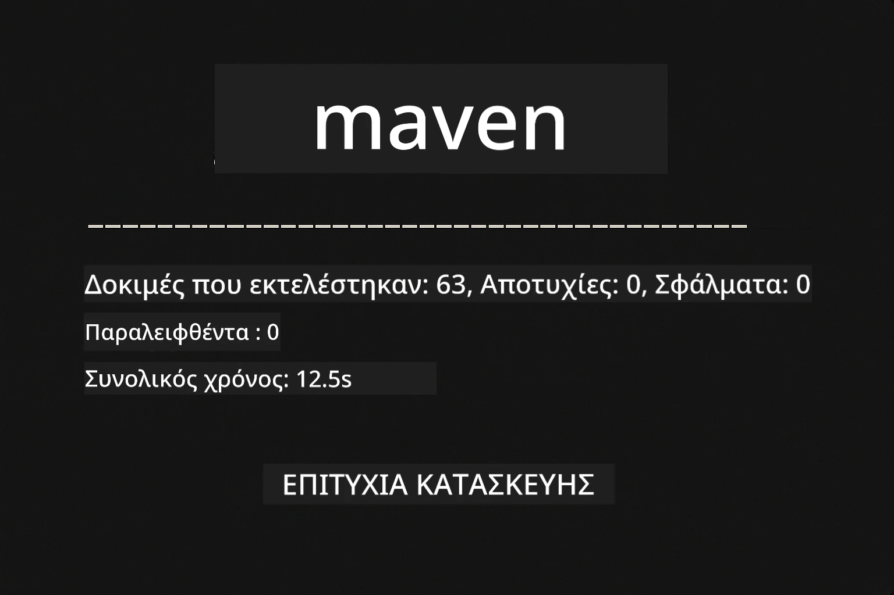
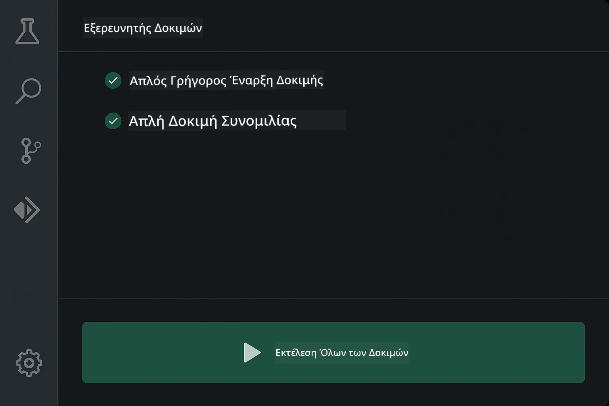
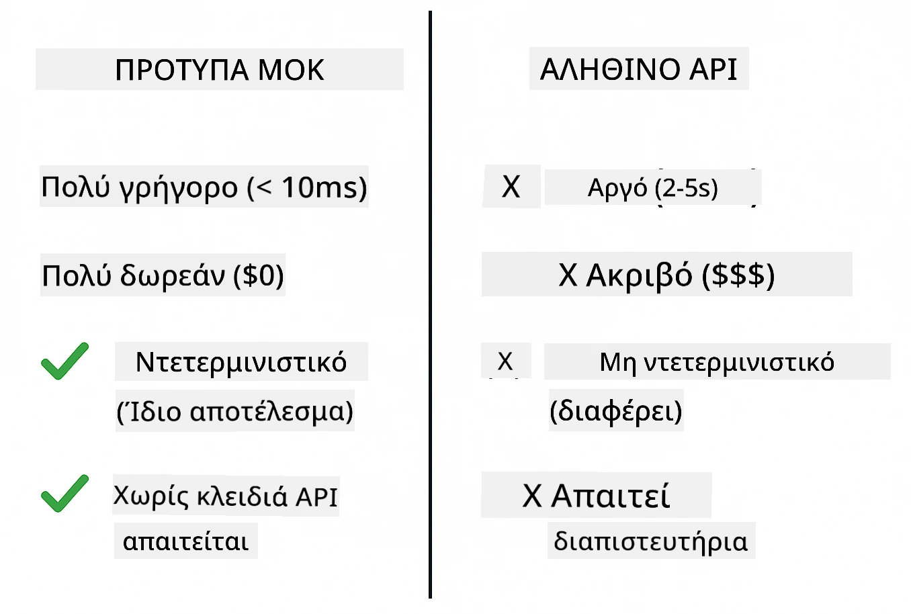
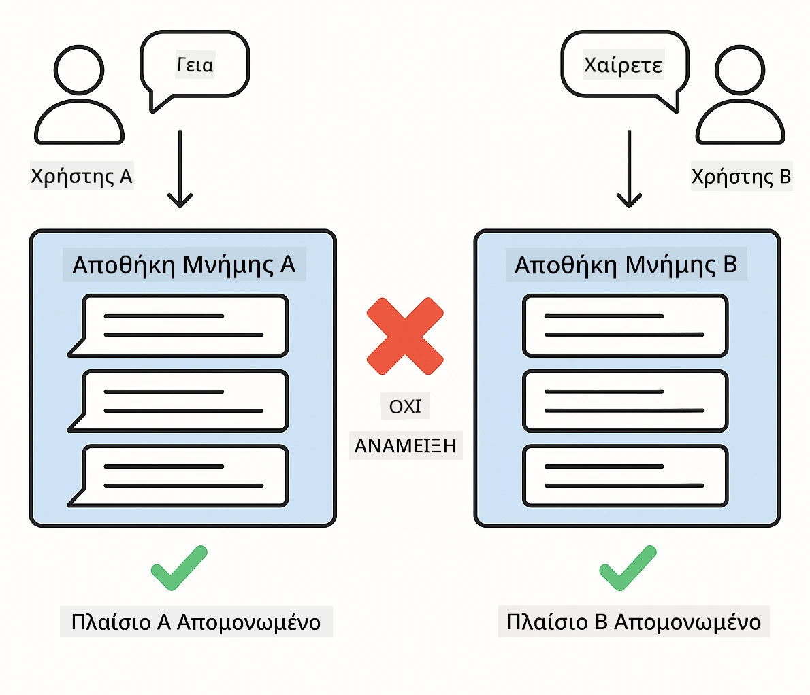
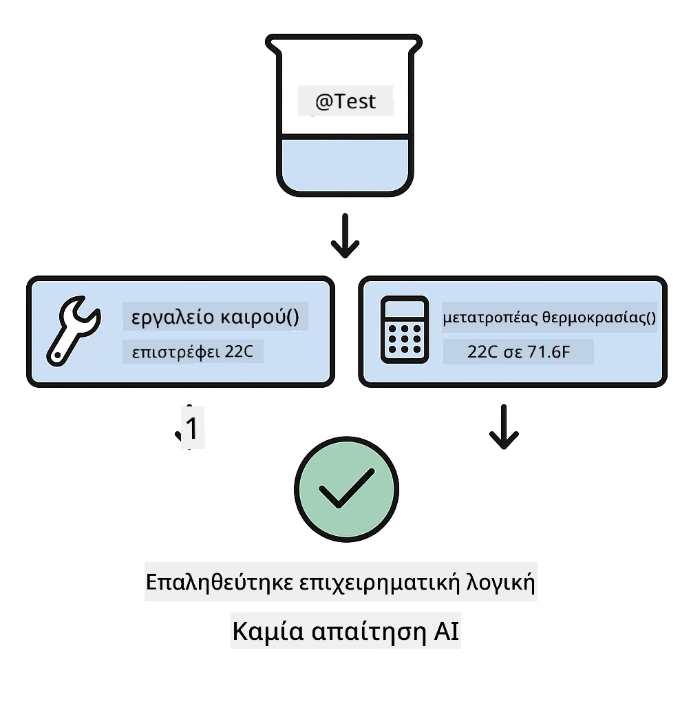
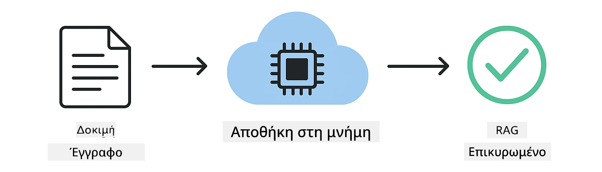

# Δοκιμάζοντας Εφαρμογές LangChain4j

## Table of Contents

- [Γρήγορη Εκκίνηση](../../../docs)
- [Τι Καλύπτουν οι Δοκιμές](../../../docs)
- [Εκτέλεση των Δοκιμών](../../../docs)
- [Εκτέλεση Δοκιμών στο VS Code](../../../docs)
- [Πρότυπα Δοκιμών](../../../docs)
- [Φιλοσοφία Δοκιμών](../../../docs)
- [Επόμενα Βήματα](../../../docs)

Αυτός ο οδηγός σας καθοδηγεί στις δοκιμές που δείχνουν πώς να δοκιμάζετε εφαρμογές AI χωρίς να απαιτούνται κλειδιά API ή εξωτερικές υπηρεσίες.

## Γρήγορη Εκκίνηση

Εκτελέστε όλες τις δοκιμές με μία εντολή:

**Bash:**
```bash
mvn test
```

**PowerShell:**
```powershell
mvn --% test
```



*Επιτυχής εκτέλεση δοκιμών που δείχνει όλες τις δοκιμές να περνούν χωρίς αποτυχίες*

## Τι Καλύπτουν οι Δοκιμές

Αυτός ο οδηγός επικεντρώνεται στις **δοκιμές μονάδας** που εκτελούνται τοπικά. Κάθε δοκιμή δείχνει μια συγκεκριμένη έννοια του LangChain4j απομονωμένα.


*Η πυραμίδα δοκιμών που δείχνει την ισορροπία μεταξύ δοκιμών μονάδας (γρήγορες, απομονωμένες), δοκιμών ενσωμάτωσης (πραγματικά συστατικά) και end-to-end δοκιμών. Αυτή η εκπαίδευση καλύπτει τις δοκιμές μονάδας.*

| Μονάδα | Δοκιμές | Εστίαση | Κύρια Αρχεία |
|--------|-------|-------|-----------|
| **00 - Γρήγορη Εκκίνηση** | 6 | Πρότυπα προτροπών και υποκατάσταση μεταβλητών | `SimpleQuickStartTest.java` |
| **01 - Εισαγωγή** | 8 | Μνήμη συνομιλίας και συνομιλία με κατάσταση | `SimpleConversationTest.java` |
| **02 - Μηχανική Προτροπών** | 12 | Πρότυπα GPT-5, επίπεδα προθυμίας, δομημένη έξοδος | `SimpleGpt5PromptTest.java` |
| **03 - RAG** | 10 | Εισαγωγή εγγράφων, embeddings, αναζήτηση ομοιότητας | `DocumentServiceTest.java` |
| **04 - Εργαλεία** | 12 | Κλήση συναρτήσεων και αλυσίδωση εργαλείων | `SimpleToolsTest.java` |
| **05 - MCP** | 8 | Model Context Protocol με μεταφορά stdio | `SimpleMcpTest.java` |

## Εκτέλεση των Δοκιμών

**Εκτελέστε όλες τις δοκιμές από τη ριζική διαδρομή:**

**Bash:**
```bash
mvn test
```

**PowerShell:**
```powershell
mvn --% test
```

**Εκτελέστε δοκιμές για μια συγκεκριμένη μονάδα:**

**Bash:**
```bash
cd 01-introduction && mvn test
# Ή από το root
mvn test -pl 01-introduction
```

**PowerShell:**
```powershell
cd 01-introduction; mvn --% test
# Ή από τη ρίζα
mvn --% test -pl 01-introduction
```

**Εκτελέστε μια μεμονωμένη κλάση δοκιμών:**

**Bash:**
```bash
mvn test -Dtest=SimpleConversationTest
```

**PowerShell:**
```powershell
mvn --% test -Dtest=SimpleConversationTest
```

**Εκτελέστε μια συγκεκριμένη μέθοδο δοκιμής:**

**Bash:**
```bash
mvn test -Dtest=SimpleConversationTest#πρέπει να διατηρεί το ιστορικό συνομιλιών
```

**PowerShell:**
```powershell
mvn --% test -Dtest=SimpleConversationTest#πρέπει να διατηρεί το ιστορικό συνομιλίας
```

## Εκτέλεση Δοκιμών στο VS Code

Αν χρησιμοποιείτε το Visual Studio Code, το Test Explorer παρέχει μια γραφική διεπαφή για την εκτέλεση και τον εντοπισμό σφαλμάτων των δοκιμών.



*Ο Test Explorer του VS Code δείχνει το δέντρο δοκιμών με όλες τις Java κλάσεις δοκιμών και τις μεμονωμένες μεθόδους δοκιμών*

**Για να εκτελέσετε δοκιμές στο VS Code:**

1. Ανοίξτε τον Test Explorer κάνοντας κλικ στο εικονίδιο με το δοκιμαστικό σωλήνα στη Γραμμή Δραστηριοτήτων
2. Αναπτύξτε το δέντρο δοκιμών για να δείτε όλες τις μονάδες και τις κλάσεις δοκιμών
3. Κάντε κλικ στο κουμπί αναπαραγωγής δίπλα σε οποιαδήποτε δοκιμή για να την εκτελέσετε μεμονωμένα
4. Κάντε κλικ στο "Εκτέλεση Όλων των Δοκιμών" για να εκτελέσετε ολόκληρο το σύνολο
5. Δεξί κλικ σε οποιαδήποτε δοκιμή και επιλέξτε "Αποσφαλμάτωση Δοκιμής" για να ορίσετε σημεία διακοπής και να εκτελέσετε βήμα προς βήμα τον κώδικα

Ο Test Explorer εμφανίζει πράσινα σημάδια ελέγχου για τις περασμένες δοκιμές και παρέχει λεπτομερή μηνύματα αποτυχίας όταν αποτυγχάνουν δοκιμές.

## Πρότυπα Δοκιμών

### Πρότυπο 1: Δοκιμή Προτύπων Προτροπών

Το απλούστερο πρότυπο δοκιμάζει πρότυπα προτροπών χωρίς να καλεί κανένα μοντέλο AI. Επαληθεύετε ότι η υποκατάσταση μεταβλητών λειτουργεί σωστά και οι προτροπές μορφοποιούνται όπως αναμένεται.


*Δοκιμή προτύπων προτροπών που δείχνει τη ροή υποκατάστασης μεταβλητών: πρότυπο με δείκτες θέσης → εφαρμογή τιμών → επαλήθευση μορφοποιημένης εξόδου*

```java
@Test
@DisplayName("Should format prompt template with variables")
void testPromptTemplateFormatting() {
    PromptTemplate template = PromptTemplate.from(
        "Best time to visit {{destination}} for {{activity}}?"
    );
    
    Prompt prompt = template.apply(Map.of(
        "destination", "Paris",
        "activity", "sightseeing"
    ));
    
    assertThat(prompt.text()).isEqualTo("Best time to visit Paris for sightseeing?");
}
```

Αυτή η δοκιμή βρίσκεται στο `00-quick-start/src/test/java/com/example/langchain4j/quickstart/SimpleQuickStartTest.java`.

**Εκτελέστε την:**

**Bash:**
```bash
cd 00-quick-start && mvn test -Dtest=SimpleQuickStartTest#Δοκιμή μορφοποίησης προτύπου προτροπής
```

**PowerShell:**
```powershell
cd 00-quick-start; mvn --% test -Dtest=SimpleQuickStartTest#Δοκιμή μορφοποίησης προτύπου προτροπής
```

### Πρότυπο 2: Μίμηση Μοντέλων Γλώσσας

Όταν δοκιμάζετε τη λογική συνομιλίας, χρησιμοποιήστε το Mockito για να δημιουργήσετε ψεύτικα μοντέλα που επιστρέφουν προκαθορισμένες απαντήσεις. Αυτό κάνει τις δοκιμές γρήγορες, δωρεάν και ντετερμινιστικές.



*Σύγκριση που δείχνει γιατί προτιμώνται τα mocks για δοκιμές: είναι γρήγορα, δωρεάν, ντετερμινιστικά και δεν απαιτούν κλειδιά API*

```java
@ExtendWith(MockitoExtension.class)
class SimpleConversationTest {
    
    private ConversationService conversationService;
    
    @Mock
    private OpenAiOfficialChatModel mockChatModel;
    
    @BeforeEach
    void setUp() {
        ChatResponse mockResponse = ChatResponse.builder()
            .aiMessage(AiMessage.from("This is a test response"))
            .build();
        when(mockChatModel.chat(anyList())).thenReturn(mockResponse);
        
        conversationService = new ConversationService(mockChatModel);
    }
    
    @Test
    void shouldMaintainConversationHistory() {
        String conversationId = conversationService.startConversation();
        
        ChatResponse mockResponse1 = ChatResponse.builder()
            .aiMessage(AiMessage.from("Response 1"))
            .build();
        ChatResponse mockResponse2 = ChatResponse.builder()
            .aiMessage(AiMessage.from("Response 2"))
            .build();
        ChatResponse mockResponse3 = ChatResponse.builder()
            .aiMessage(AiMessage.from("Response 3"))
            .build();
        
        when(mockChatModel.chat(anyList()))
            .thenReturn(mockResponse1)
            .thenReturn(mockResponse2)
            .thenReturn(mockResponse3);

        conversationService.chat(conversationId, "First message");
        conversationService.chat(conversationId, "Second message");
        conversationService.chat(conversationId, "Third message");

        List<ChatMessage> history = conversationService.getHistory(conversationId);
        assertThat(history).hasSize(6); // 3 μηνύματα χρήστη + 3 μηνύματα τεχνητής νοημοσύνης
    }
}
```

Αυτό το πρότυπο εμφανίζεται στο `01-introduction/src/test/java/com/example/langchain4j/service/SimpleConversationTest.java`. Το mock διασφαλίζει συνεπή συμπεριφορά ώστε να μπορείτε να επαληθεύσετε ότι η διαχείριση μνήμης λειτουργεί σωστά.

### Πρότυπο 3: Δοκιμή Απομόνωσης Συνομιλίας

Η μνήμη συνομιλίας πρέπει να κρατά πολλούς χρήστες ξεχωριστά. Αυτή η δοκιμή επαληθεύει ότι οι συνομιλίες δεν αναμειγνύουν τα συμφραζόμενα.



*Δοκιμή απομόνωσης συνομιλίας που δείχνει ξεχωριστά καταστήματα μνήμης για διαφορετικούς χρήστες ώστε να αποτραπεί η ανάμειξη συμφραζομένων*

```java
@Test
void shouldIsolateConversationsByid() {
    String conv1 = conversationService.startConversation();
    String conv2 = conversationService.startConversation();
    
    ChatResponse mockResponse = ChatResponse.builder()
        .aiMessage(AiMessage.from("Response"))
        .build();
    when(mockChatModel.chat(anyList())).thenReturn(mockResponse);

    conversationService.chat(conv1, "Message for conversation 1");
    conversationService.chat(conv2, "Message for conversation 2");

    List<ChatMessage> history1 = conversationService.getHistory(conv1);
    List<ChatMessage> history2 = conversationService.getHistory(conv2);
    
    assertThat(history1).hasSize(2);
    assertThat(history2).hasSize(2);
}
```

Κάθε συνομιλία διατηρεί το δικό της ανεξάρτητο ιστορικό. Σε συστήματα παραγωγής, αυτή η απομόνωση είναι κρίσιμη για εφαρμογές πολλών χρηστών.

### Πρότυπο 4: Δοκιμή Εργαλείων Ανεξάρτητα

Τα εργαλεία είναι συναρτήσεις που μπορεί να καλέσει το AI. Δοκιμάστε τα απευθείας για να βεβαιωθείτε ότι λειτουργούν σωστά ανεξάρτητα από τις αποφάσεις του AI.



*Δοκιμή εργαλείων ανεξάρτητα που δείχνει εκτέλεση mock εργαλείου χωρίς κλήσεις AI για να επαληθευτεί η επιχειρηματική λογική*

```java
@Test
void shouldConvertCelsiusToFahrenheit() {
    TemperatureTool tempTool = new TemperatureTool();
    String result = tempTool.celsiusToFahrenheit(25.0);
    assertThat(result).containsPattern("77[.,]0°F");
}

@Test
void shouldDemonstrateToolChaining() {
    WeatherTool weatherTool = new WeatherTool();
    TemperatureTool tempTool = new TemperatureTool();

    String weatherResult = weatherTool.getCurrentWeather("Seattle");
    assertThat(weatherResult).containsPattern("\\d+°C");

    String conversionResult = tempTool.celsiusToFahrenheit(22.0);
    assertThat(conversionResult).containsPattern("71[.,]6°F");
}
```

Αυτές οι δοκιμές από `04-tools/src/test/java/com/example/langchain4j/agents/tools/SimpleToolsTest.java` επαληθεύουν τη λογική των εργαλείων χωρίς εμπλοκή του AI. Το παράδειγμα αλυσίδωσης δείχνει πώς η έξοδος ενός εργαλείου τροφοδοτεί την είσοδο ενός άλλου.

### Πρότυπο 5: Δοκιμή RAG Εντός Μνήμης

Τα συστήματα RAG παραδοσιακά απαιτούν βάσεις δεδομένων διανυσμάτων και υπηρεσίες ενσωμάτωσης. Το πρότυπο εντός μνήμης σας επιτρέπει να δοκιμάσετε ολόκληρο το pipeline χωρίς εξωτερικές εξαρτήσεις.



*Ροή εργασίας δοκιμών RAG εντός μνήμης που δείχνει ανάλυση εγγράφων, αποθήκευση embeddings και αναζήτηση ομοιότητας χωρίς απαίτηση βάσης δεδομένων*

```java
@Test
void testProcessTextDocument() {
    String content = "This is a test document.\nIt has multiple lines.";
    InputStream inputStream = new ByteArrayInputStream(content.getBytes(StandardCharsets.UTF_8));
    
    DocumentService.ProcessedDocument result = 
        documentService.processDocument(inputStream, "test.txt");

    assertNotNull(result);
    assertTrue(result.segments().size() > 0);
    assertEquals("test.txt", result.segments().get(0).metadata().getString("filename"));
}
```

Αυτή η δοκιμή από `03-rag/src/test/java/com/example/langchain4j/rag/service/DocumentServiceTest.java` δημιουργεί ένα έγγραφο στη μνήμη και επαληθεύει το chunking και τη διαχείριση μεταδεδομένων.

### Πρότυπο 6: Δοκιμές Ενσωμάτωσης MCP

Το module MCP δοκιμάζει την ενσωμάτωση του Model Context Protocol χρησιμοποιώντας μεταφορά stdio. Αυτές οι δοκιμές επαληθεύουν ότι η εφαρμογή σας μπορεί να ξεκινήσει και να επικοινωνήσει με MCP servers ως subprocesses.

Οι δοκιμές στο `05-mcp/src/test/java/com/example/langchain4j/mcp/SimpleMcpTest.java` επαληθεύουν τη συμπεριφορά του MCP client.

**Εκτελέστε τις:**

**Bash:**
```bash
cd 05-mcp && mvn test
```

**PowerShell:**
```powershell
cd 05-mcp; mvn --% test
```

## Φιλοσοφία Δοκιμών

Δοκιμάστε τον κώδικά σας, όχι το AI. Οι δοκιμές σας θα πρέπει να επαληθεύουν τον κώδικα που γράφετε ελέγχοντας πώς κατασκευάζονται οι προτροπές, πώς διαχειρίζεται η μνήμη και πώς εκτελούνται τα εργαλεία. Οι απαντήσεις του AI ποικίλουν και δεν θα πρέπει να αποτελούν μέρος των ισχυρισμών των δοκιμών. Ρωτήστε τον εαυτό σας αν το πρότυπο προτροπής σας υποκαθιστά σωστά τις μεταβλητές, όχι αν το AI δίνει τη σωστή απάντηση.

Χρησιμοποιήστε mocks για τα μοντέλα γλώσσας. Είναι εξωτερικές εξαρτήσεις που είναι αργές, δαπανηρές και μη ντετερμινιστικές. Η μίμηση κάνει τις δοκιμές γρήγορες σε χιλιοστά του δευτερολέπτου αντί για δευτερόλεπτα, δωρεάν χωρίς κόστος API και ντετερμινιστικές με το ίδιο αποτέλεσμα κάθε φορά.

Κρατήστε τις δοκιμές ανεξάρτητες. Κάθε δοκιμή πρέπει να δημιουργεί τα δικά της δεδομένα, να μην βασίζεται σε άλλες δοκιμές και να καθαρίζει μετά από τον εαυτό της. Οι δοκιμές πρέπει να περνούν ανεξάρτητα από τη σειρά εκτέλεσης.

Δοκιμάστε περιπτώσεις άκρων πέρα από την ευτυχισμένη διαδρομή. Δοκιμάστε κενές εισόδους, πολύ μεγάλες εισόδους, ειδικούς χαρακτήρες, μη έγκυρες παραμέτρους και συνθήκες ορίων. Αυτές συχνά αποκαλύπτουν σφάλματα που η κανονική χρήση δεν εμφανίζει.

Χρησιμοποιήστε περιγραφικά ονόματα. Συγκρίνετε `shouldMaintainConversationHistoryAcrossMultipleMessages()` με `test1()`. Το πρώτο σας λέει ακριβώς τι δοκιμάζεται, κάνοντας τον εντοπισμό σφαλμάτων πολύ ευκολότερο.

## Επόμενα Βήματα

Τώρα που κατανοείτε τα πρότυπα δοκιμών, εξερευνήστε περαιτέρω κάθε μονάδα:

- **[00 - Γρήγορη Εκκίνηση](../00-quick-start/README.md)** - Ξεκινήστε με τα βασικά των προτύπων προτροπών
- **[01 - Εισαγωγή](../01-introduction/README.md)** - Μάθετε διαχείριση μνήμης συνομιλίας
- **[02 - Μηχανική Προτροπών](../02-prompt-engineering/README.md)** - Κατακτήστε τα πρότυπα προτροπής GPT-5
- **[03 - RAG](../03-rag/README.md)** - Δημιουργήστε συστήματα retrieval-augmented generation
- **[04 - Εργαλεία](../04-tools/README.md)** - Υλοποιήστε κλήσεις συναρτήσεων και αλυσίδες εργαλείων
- **[05 - MCP](../05-mcp/README.md)** - Ενσωματώστε το Model Context Protocol

Το README κάθε μονάδας παρέχει λεπτομερείς εξηγήσεις των εννοιών που δοκιμάζονται εδώ.

---

**Πλοήγηση:** [← Πίσω στο Κύριο](../README.md)

---

<!-- CO-OP TRANSLATOR DISCLAIMER START -->
Αποποίηση ευθύνης:
Αυτό το έγγραφο έχει μεταφραστεί με χρήση υπηρεσίας αυτόματης μετάφρασης με τεχνητή νοημοσύνη [Co-op Translator](https://github.com/Azure/co-op-translator). Παρόλο που επιδιώκουμε την ακρίβεια, λάβετε υπόψη ότι οι αυτοματοποιημένες μεταφράσεις ενδέχεται να περιέχουν λάθη ή ανακρίβειες. Το αρχικό έγγραφο στην πρωτότυπη γλώσσα πρέπει να θεωρείται η επίσημη πηγή. Για κρίσιμες πληροφορίες, συνιστάται επαγγελματική ανθρώπινη μετάφραση. Δεν φέρουμε καμία ευθύνη για τυχόν παρεξηγήσεις ή λανθασμένες ερμηνείες που προκύπτουν από τη χρήση αυτής της μετάφρασης.
<!-- CO-OP TRANSLATOR DISCLAIMER END -->