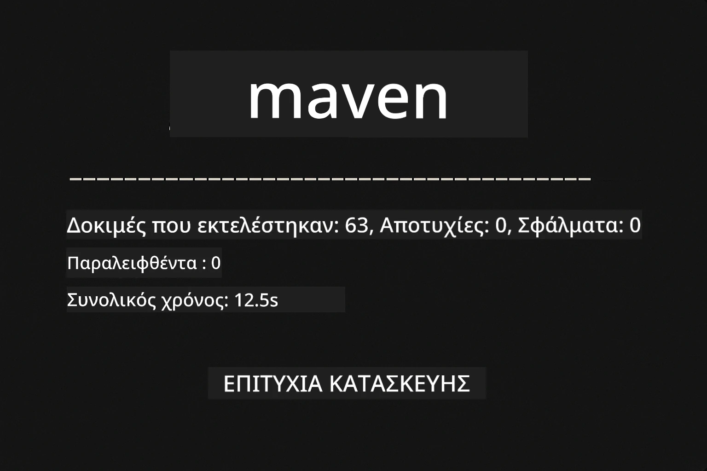
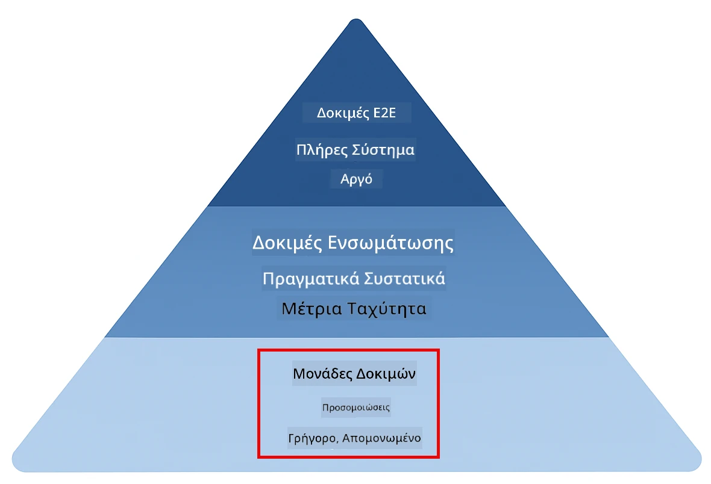
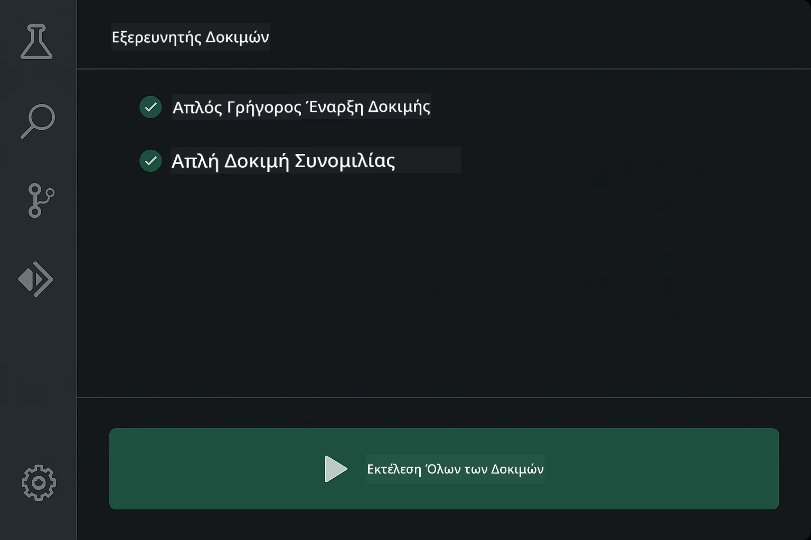
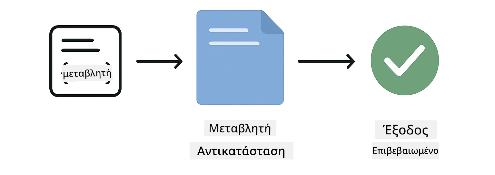
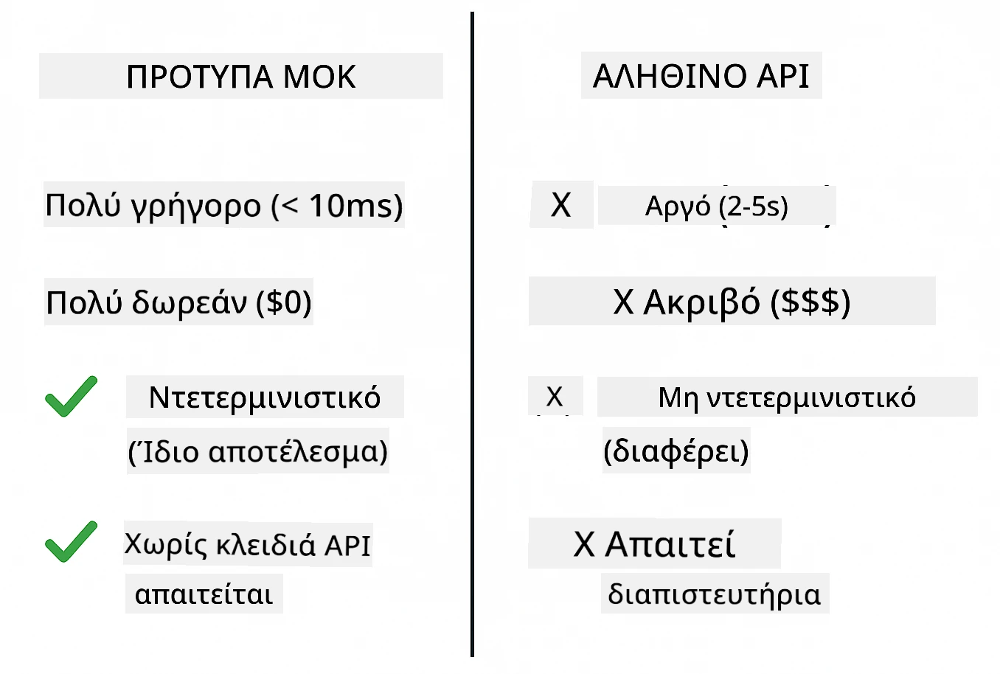
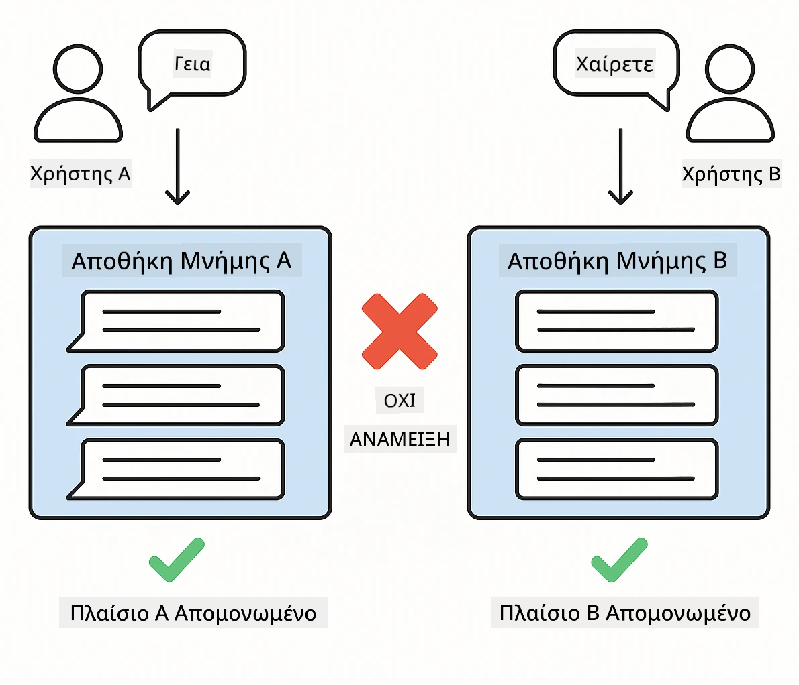
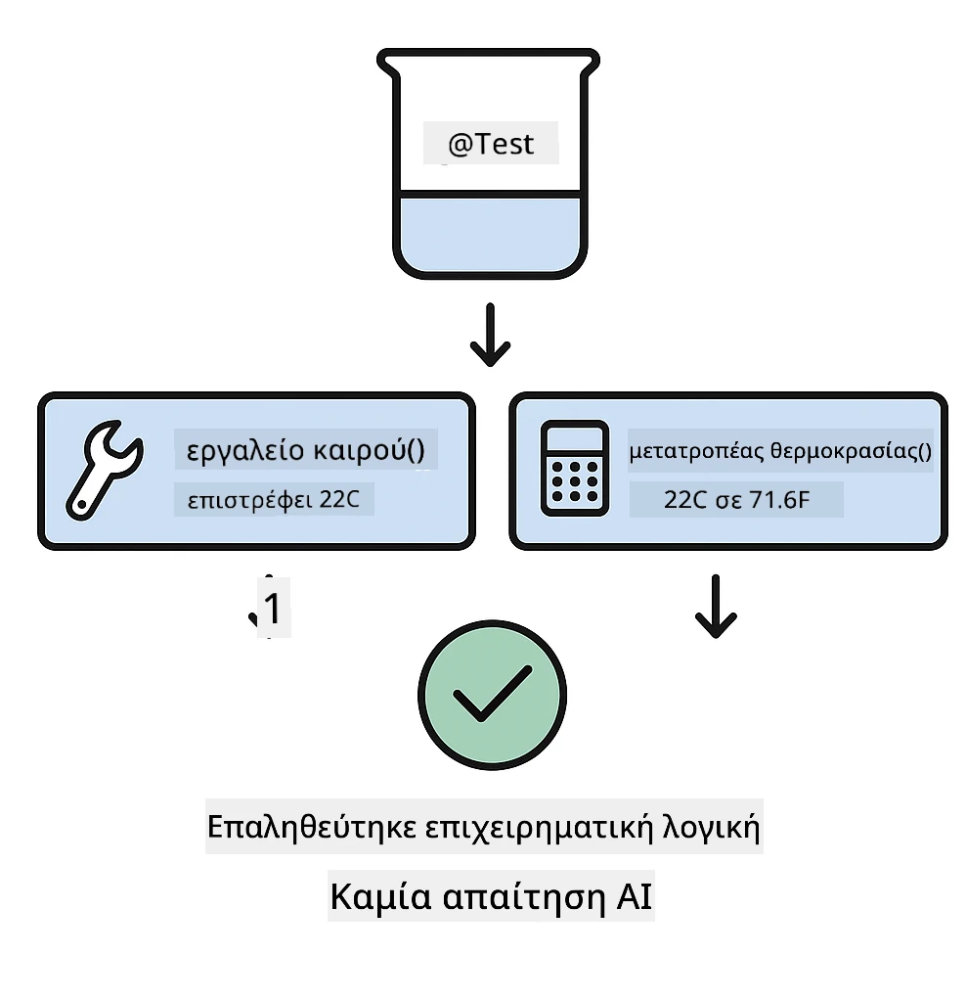
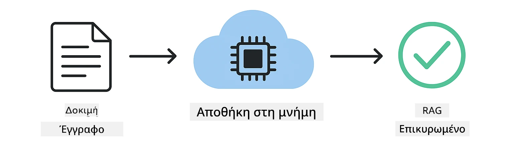

# Δοκιμή Εφαρμογών LangChain4j

## Πίνακας Περιεχομένων

- [Γρήγορη Εκκίνηση](#γρήγορη-εκκίνηση)
- [Τι Καλύπτουν οι Δοκιμές](#τι-καλύπτουν-οι-δοκιμές)
- [Εκτέλεση των Δοκιμών](#εκτέλεση-των-δοκιμών)
- [Εκτέλεση Δοκιμών στο VS Code](#εκτέλεση-δοκιμών-στο-vs-code)
- [Μοτίβα Δοκιμών](#μοτίβα-δοκιμών)
- [Φιλοσοφία Δοκιμών](#φιλοσοφία-δοκιμών)
- [Επόμενα Βήματα](#επόμενα-βήματα)

Αυτός ο οδηγός σας καθοδηγεί μέσα από τις δοκιμές που δείχνουν πώς να δοκιμάσετε εφαρμογές AI χωρίς να απαιτούνται κλειδιά API ή εξωτερικές υπηρεσίες.

## Γρήγορη Εκκίνηση

Εκτελέστε όλες τις δοκιμές με μία εντολή:

**Bash:**
```bash
mvn test
```

**PowerShell:**
```powershell
mvn --% test
```

Όταν όλες οι δοκιμές περάσουν, θα πρέπει να δείτε έξοδο όπως το στιγμιότυπο παρακάτω — οι δοκιμές εκτελούνται χωρίς αποτυχίες.



*Επιτυχής εκτέλεση δοκιμών που δείχνει όλες τις δοκιμές να περνούν χωρίς αποτυχίες*

## Τι Καλύπτουν οι Δοκιμές

Αυτό το μάθημα εστιάζει σε **μονάδες δοκιμών** που εκτελούνται τοπικά. Κάθε δοκιμή παρουσιάζει μια συγκεκριμένη έννοια LangChain4j απομονωμένη. Η πυραμίδα δοκιμών παρακάτω δείχνει πού εντάσσονται οι μονάδες δοκιμών — αποτελούν τη γρήγορη, αξιόπιστη βάση πάνω στην οποία χτίζεται η υπόλοιπη στρατηγική δοκιμών σας.



*Πυραμίδα δοκιμών που δείχνει την ισορροπία μεταξύ μονάδων δοκιμών (γρήγορες, απομονωμένες), δοκιμών ολοκλήρωσης (πραγματικά στοιχεία) και δοκιμών end-to-end. Αυτή η εκπαίδευση καλύπτει τη μονάδα δοκιμών.*

| Ενότητα | Δοκιμές | Εστίαση | Κύρια Αρχεία |
|--------|-------|-------|-----------|
| **01 - Εισαγωγή** | 8 | Μνήμη συνομιλίας και συνομιλία με κατάσταση | `SimpleConversationTest.java` |
| **02 - Μηχανική Prompt** | 12 | Πρότυπα GPT-5.2, επίπεδα ενθουσιασμού, δομημένη έξοδος | `SimpleGpt5PromptTest.java` |
| **03 - RAG** | 10 | Εισαγωγή εγγράφων, ενσωματώσεις, αναζήτηση ομοιότητας | `DocumentServiceTest.java` |
| **04 - Εργαλεία** | 12 | Κλήση λειτουργιών και αλυσιδωτές λειτουργίες εργαλείων | `SimpleToolsTest.java` |
| **05 - MCP** | 8 | Πρωτόκολλο Πλαισίου Μοντέλου με μεταφορά Stdio | `SimpleMcpTest.java` |

## Εκτέλεση των Δοκιμών

**Εκτελέστε όλες τις δοκιμές από τη ρίζα:**

**Bash:**
```bash
mvn test
```

**PowerShell:**
```powershell
mvn --% test
```

**Εκτέλεση δοκιμών για συγκεκριμένη ενότητα:**

**Bash:**
```bash
cd 01-introduction && mvn test
# Ή από τη ρίζα
mvn test -pl 01-introduction
```

**PowerShell:**
```powershell
cd 01-introduction; mvn --% test
# Ή από τη ρίζα
mvn --% test -pl 01-introduction
```

**Εκτέλεση μιας μόνο κλάσης δοκιμής:**

**Bash:**
```bash
mvn test -Dtest=SimpleConversationTest
```

**PowerShell:**
```powershell
mvn --% test -Dtest=SimpleConversationTest
```

**Εκτέλεση συγκεκριμένης μεθόδου δοκιμής:**

**Bash:**
```bash
mvn test -Dtest=SimpleConversationTest#θα πρέπει να διατηρεί το ιστορικό συνομιλίας
```

**PowerShell:**
```powershell
mvn --% test -Dtest=SimpleConversationTest#θα πρέπει να διατηρεί το ιστορικό συνομιλίας
```

## Εκτέλεση Δοκιμών στο VS Code

Αν χρησιμοποιείτε το Visual Studio Code, ο Test Explorer προσφέρει γραφική διεπαφή για την εκτέλεση και αποσφαλμάτωση των δοκιμών.



*Ο Εξερευνητής Δοκιμών του VS Code δείχνει το δέντρο δοκιμών με όλες τις κλάσεις δοκιμής Java και τις μεμονωμένες μεθόδους δοκιμών*

**Για να εκτελέσετε δοκιμές στο VS Code:**

1. Ανοίξτε τον Εξερευνητή Δοκιμών κάνοντας κλικ στο εικονίδιο δοκιμαστικού σωλήνα στη γραμμή δραστηριότητας
2. Αναπτύξτε το δέντρο δοκιμών για να δείτε όλες τις ενότητες και τις κλάσεις δοκιμών
3. Κάντε κλικ στο κουμπί αναπαραγωγής δίπλα σε οποιαδήποτε δοκιμή για να την τρέξετε μεμονωμένα
4. Κάντε κλικ στο "Run All Tests" για να εκτελέσετε ολόκληρο το σύνολο
5. Δεξί κλικ σε οποιαδήποτε δοκιμή και επιλέξτε "Debug Test" για να ορίσετε σημεία διακοπής και να εκτελέσετε βήμα προς βήμα τον κώδικα

Ο Εξερευνητής Δοκιμών εμφανίζει πράσινες επιβεβαιώσεις για τις περασμένες δοκιμές και παρέχει λεπτομερή μηνύματα αποτυχίας όταν οι δοκιμές αποτυγχάνουν.

## Μοτίβα Δοκιμών

### Μοτίβο 1: Δοκιμή Προτύπων Prompt

Το απλούστερο μοτίβο δοκιμάζει πρότυπα prompt χωρίς να καλεί κανένα μοντέλο AI. Επαληθεύετε ότι η αντικατάσταση μεταβλητών λειτουργεί σωστά και ότι τα prompts μορφοποιούνται όπως αναμένεται.



*Δοκιμή προτύπων prompt που δείχνει ροή αντικατάστασης μεταβλητών: πρότυπο με θέσεις κράτησης → εφαρμόζονται τιμές → επαληθεύεται η μορφοποιημένη έξοδος*

```java
@Test
@DisplayName("Should format prompt template with variables")
void testPromptTemplateFormatting() {
    PromptTemplate template = PromptTemplate.from(
        "Best time to visit {{destination}} for {{activity}}?"
    );
    
    Prompt prompt = template.apply(Map.of(
        "destination", "Paris",
        "activity", "sightseeing"
    ));
    
    assertThat(prompt.text()).isEqualTo("Best time to visit Paris for sightseeing?");
}
```

Αυτό το μοτίβο επαληθεύει ότι η αντικατάσταση μεταβλητών λειτουργεί σωστά και τα prompts μορφοποιούνται όπως αναμένεται — χωρίς απαίτηση κλειδιού API ή κλήσης μοντέλου.

### Μοτίβο 2: Προσομοίωση Μοντέλων Γλώσσας

Κατά τη δοκιμή της λογικής συνομιλίας, χρησιμοποιήστε Mockito για να δημιουργήσετε ψεύτικα μοντέλα που επιστρέφουν προκαθορισμένες απαντήσεις. Αυτό κάνει τις δοκιμές γρήγορες, δωρεάν και ντετερμινιστικές.



*Σύγκριση που δείχνει γιατί προτιμώνται τα mocks για δοκιμές: είναι γρήγορα, δωρεάν, ντετερμινιστικά και δεν απαιτούν κλειδιά API*

```java
@ExtendWith(MockitoExtension.class)
class SimpleConversationTest {
    
    private ConversationService conversationService;
    
    @Mock
    private OpenAiOfficialChatModel mockChatModel;
    
    @BeforeEach
    void setUp() {
        ChatResponse mockResponse = ChatResponse.builder()
            .aiMessage(AiMessage.from("This is a test response"))
            .build();
        when(mockChatModel.chat(anyList())).thenReturn(mockResponse);
        
        conversationService = new ConversationService(mockChatModel);
    }
    
    @Test
    void shouldMaintainConversationHistory() {
        String conversationId = conversationService.startConversation();
        
        ChatResponse mockResponse1 = ChatResponse.builder()
            .aiMessage(AiMessage.from("Response 1"))
            .build();
        ChatResponse mockResponse2 = ChatResponse.builder()
            .aiMessage(AiMessage.from("Response 2"))
            .build();
        ChatResponse mockResponse3 = ChatResponse.builder()
            .aiMessage(AiMessage.from("Response 3"))
            .build();
        
        when(mockChatModel.chat(anyList()))
            .thenReturn(mockResponse1)
            .thenReturn(mockResponse2)
            .thenReturn(mockResponse3);

        conversationService.chat(conversationId, "First message");
        conversationService.chat(conversationId, "Second message");
        conversationService.chat(conversationId, "Third message");

        List<ChatMessage> history = conversationService.getHistory(conversationId);
        assertThat(history).hasSize(6); // 3 μηνύματα χρήστη + 3 μηνύματα AI
    }
}
```

Αυτό το μοτίβο εμφανίζεται στο `01-introduction/src/test/java/com/example/langchain4j/service/SimpleConversationTest.java`. Το mock εξασφαλίζει σταθερή συμπεριφορά ώστε να επαληθεύσετε ότι η διαχείριση μνήμης λειτουργεί σωστά.

### Μοτίβο 3: Δοκιμή Απομόνωσης Συνομιλίας

Η μνήμη συνομιλίας πρέπει να κρατά τους χρήστες ξεχωριστούς. Αυτή η δοκιμή επαληθεύει ότι οι συνομιλίες δεν αναμιγνύουν τα συμφραζόμενα.



*Δοκιμή απομόνωσης συνομιλίας που δείχνει ξεχωριστά καταστήματα μνήμης για διαφορετικούς χρήστες για να αποτραπεί η ανάμειξη συμφραζομένων*

```java
@Test
void shouldIsolateConversationsByid() {
    String conv1 = conversationService.startConversation();
    String conv2 = conversationService.startConversation();
    
    ChatResponse mockResponse = ChatResponse.builder()
        .aiMessage(AiMessage.from("Response"))
        .build();
    when(mockChatModel.chat(anyList())).thenReturn(mockResponse);

    conversationService.chat(conv1, "Message for conversation 1");
    conversationService.chat(conv2, "Message for conversation 2");

    List<ChatMessage> history1 = conversationService.getHistory(conv1);
    List<ChatMessage> history2 = conversationService.getHistory(conv2);
    
    assertThat(history1).hasSize(2);
    assertThat(history2).hasSize(2);
}
```

Κάθε συνομιλία διατηρεί το δικό της ανεξάρτητο ιστορικό. Σε συστήματα παραγωγής, αυτή η απομόνωση είναι κρίσιμη για εφαρμογές πολλαπλών χρηστών.

### Μοτίβο 4: Δοκιμή Εργαλείων Ανεξάρτητα

Τα εργαλεία είναι λειτουργίες που μπορεί να καλέσει το AI. Δοκιμάστε τα απευθείας για να εξασφαλίσετε ότι λειτουργούν σωστά ανεξάρτητα από τις αποφάσεις του AI.



*Δοκιμή εργαλείων ανεξάρτητα που δείχνει εκτέλεση mock εργαλείου χωρίς κλήσεις AI για να επαληθευτεί η επιχειρησιακή λογική*

```java
@Test
void shouldConvertCelsiusToFahrenheit() {
    TemperatureTool tempTool = new TemperatureTool();
    String result = tempTool.celsiusToFahrenheit(25.0);
    assertThat(result).containsPattern("77[.,]0°F");
}

@Test
void shouldDemonstrateToolChaining() {
    WeatherTool weatherTool = new WeatherTool();
    TemperatureTool tempTool = new TemperatureTool();

    String weatherResult = weatherTool.getCurrentWeather("Seattle");
    assertThat(weatherResult).containsPattern("\\d+°C");

    String conversionResult = tempTool.celsiusToFahrenheit(22.0);
    assertThat(conversionResult).containsPattern("71[.,]6°F");
}
```

Αυτές οι δοκιμές από το `04-tools/src/test/java/com/example/langchain4j/agents/tools/SimpleToolsTest.java` επαληθεύουν τη λογική εργαλείων χωρίς εμπλοκή AI. Το παράδειγμα αλυσιδωτής λειτουργίας δείχνει πώς η έξοδος ενός εργαλείου τροφοδοτεί την είσοδο ενός άλλου.

### Μοτίβο 5: Δοκιμή RAG Εντός Μνήμης

Τα συστήματα RAG παραδοσιακά απαιτούν βάσεις δεδομένων διανυσμάτων και υπηρεσίες ενσωμάτωσης. Το μοτίβο εντός μνήμης σας επιτρέπει να δοκιμάσετε όλη την αλυσίδα χωρίς εξαρτήσεις.



*Ροή εργασίας δοκιμών RAG εντός μνήμης που δείχνει ανάλυση εγγράφου, αποθήκευση ενσωματώσεων και αναζήτηση ομοιότητας χωρίς απαίτηση βάσης δεδομένων*

```java
@Test
void testProcessTextDocument() {
    String content = "This is a test document.\nIt has multiple lines.";
    InputStream inputStream = new ByteArrayInputStream(content.getBytes(StandardCharsets.UTF_8));
    
    DocumentService.ProcessedDocument result = 
        documentService.processDocument(inputStream, "test.txt");

    assertNotNull(result);
    assertTrue(result.segments().size() > 0);
    assertEquals("test.txt", result.segments().get(0).metadata().getString("filename"));
}
```

Αυτή η δοκιμή από το `03-rag/src/test/java/com/example/langchain4j/rag/service/DocumentServiceTest.java` δημιουργεί ένα έγγραφο στη μνήμη και επαληθεύει το κομμάτιασμα και τη διαχείριση μεταδεδομένων.

### Μοτίβο 6: Δοκιμή Ενσωμάτωσης MCP

Η ενότητα MCP δοκιμάζει την ενσωμάτωση του Πρωτοκόλλου Πλαισίου Μοντέλου χρησιμοποιώντας τη μεταφορά stdio. Αυτές οι δοκιμές επαληθεύουν ότι η εφαρμογή σας μπορεί να δημιουργήσει και να επικοινωνήσει με MCP διακομιστές ως υποδιαδικασίες.

Οι δοκιμές στο `05-mcp/src/test/java/com/example/langchain4j/mcp/SimpleMcpTest.java` επαληθεύουν τη συμπεριφορά πελάτη MCP.

**Εκτελέστε τις:**

**Bash:**
```bash
cd 05-mcp && mvn test
```

**PowerShell:**
```powershell
cd 05-mcp; mvn --% test
```

## Φιλοσοφία Δοκιμών

Δοκιμάστε τον κώδικά σας, όχι το AI. Οι δοκιμές σας πρέπει να επαληθεύουν τον κώδικα που γράφετε ελέγχοντας πώς κατασκευάζονται τα prompts, πώς διαχειρίζεται η μνήμη και πώς εκτελούνται τα εργαλεία. Οι απαντήσεις AI διαφέρουν και δεν θα πρέπει να περιλαμβάνονται στις δηλώσεις των δοκιμών. Αναρωτηθείτε αν το πρότυπο prompt σας αντικαθιστά σωστά τις μεταβλητές, όχι αν το AI δίνει τη σωστή απάντηση.

Χρησιμοποιήστε mocks για μοντέλα γλώσσας. Αποτελούν εξωτερικές εξαρτήσεις που είναι αργές, ακριβές και μη ντετερμινιστικές. Η προσομοίωση κάνει τις δοκιμές γρήγορες με χιλιοστά του δευτερολέπτου αντί για δευτερόλεπτα, δωρεάν χωρίς κόστος API και ντετερμινιστικές με το ίδιο αποτέλεσμα κάθε φορά.

Διατηρήστε τις δοκιμές ανεξάρτητες. Κάθε δοκιμή θα πρέπει να ρυθμίζει τα δικά της δεδομένα, να μην εξαρτάται από άλλες δοκιμές και να καθαρίζει μετά τον εαυτό της. Οι δοκιμές πρέπει να περνούν ανεξαρτήτως της σειράς εκτέλεσης.

Δοκιμάστε άκρες περιπτώσεων πέρα από το συνηθισμένο μονοπάτι. Δοκιμάστε κενές εισόδους, πολύ μεγάλες εισόδους, ειδικούς χαρακτήρες, άκυρες παραμέτρους και οριακές συνθήκες. Αυτά συχνά αποκαλύπτουν σφάλματα που η κανονική χρήση δεν αποκαλύπτει.

Χρησιμοποιήστε περιγραφικά ονόματα. Συγκρίνετε το `shouldMaintainConversationHistoryAcrossMultipleMessages()` με το `test1()`. Το πρώτο σας λέει ακριβώς τι δοκιμάζεται, κάνοντας την αποσφαλμάτωση αποτυχιών πολύ πιο εύκολη.

## Επόμενα Βήματα

Τώρα που κατανοείτε τα μοτίβα δοκιμών, εξερευνήστε πιο βαθιά κάθε ενότητα:

- **[01 - Εισαγωγή](../01-introduction/README.md)** - Μάθετε διαχείριση μνήμης συνομιλίας
- **[02 - Μηχανική Prompt](../02-prompt-engineering/README.md)** - Εξοικειωθείτε με τα μοτίβα prompt GPT-5.2
- **[03 - RAG](../03-rag/README.md)** - Δημιουργήστε συστήματα ανάκτησης ενισχυμένης γεννήτριας
- **[04 - Εργαλεία](../04-tools/README.md)** - Υλοποιήστε κλήση λειτουργιών και αλυσίδες εργαλείων
- **[05 - MCP](../05-mcp/README.md)** - Ενσωματώστε το Πρωτόκολλο Πλαισίου Μοντέλου

Το README κάθε ενότητας παρέχει λεπτομερείς εξηγήσεις των εννοιών που δοκιμάζονται εδώ.

---

**Πλοήγηση:** [← Επιστροφή στην Αρχική](../README.md)

---

<!-- CO-OP TRANSLATOR DISCLAIMER START -->
**Αποποίηση ευθυνών**:
Αυτό το έγγραφο έχει μεταφραστεί χρησιμοποιώντας την υπηρεσία μετάφρασης με τεχνητή νοημοσύνη [Co-op Translator](https://github.com/Azure/co-op-translator). Ενώ επιδιώκουμε την ακρίβεια, παρακαλούμε να έχετε υπόψη ότι οι αυτοματοποιημένες μεταφράσεις ενδέχεται να περιέχουν λάθη ή ανακρίβειες. Το πρωτότυπο έγγραφο στη μητρική του γλώσσα πρέπει να θεωρείται η αυθεντική πηγή. Για κρίσιμες πληροφορίες, συνιστάται επαγγελματική ανθρώπινη μετάφραση. Δεν φέρουμε ευθύνη για τυχόν παρεξηγήσεις ή λανθασμένες ερμηνείες που προκύπτουν από τη χρήση αυτής της μετάφρασης.
<!-- CO-OP TRANSLATOR DISCLAIMER END -->