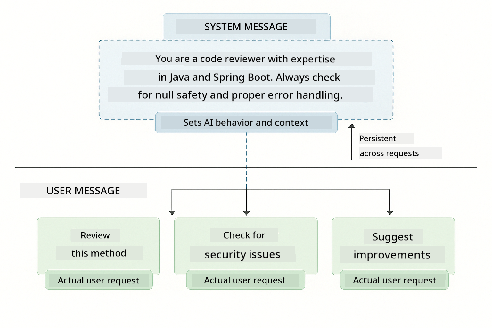
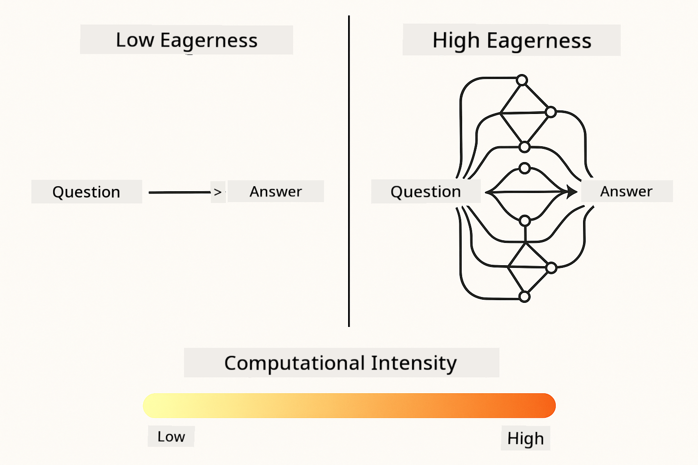
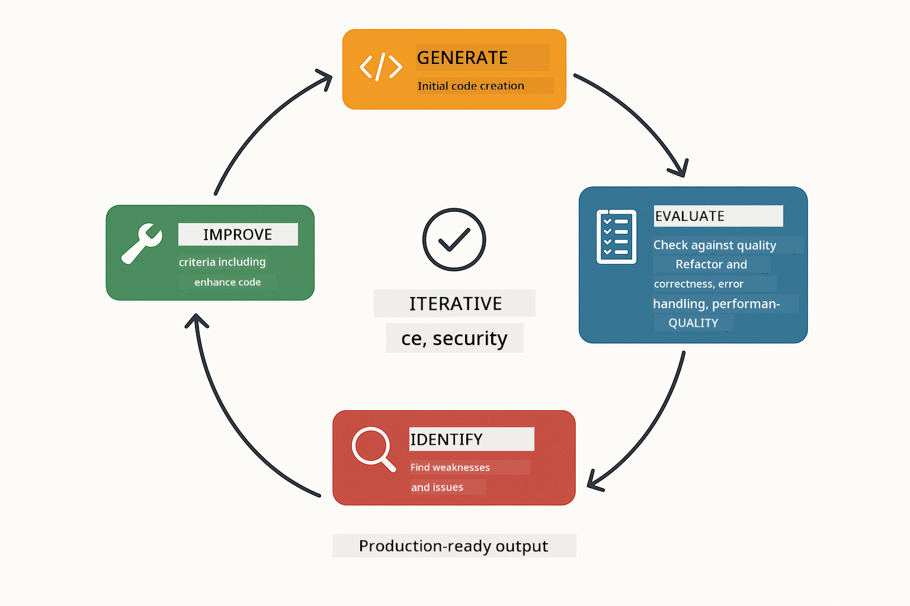
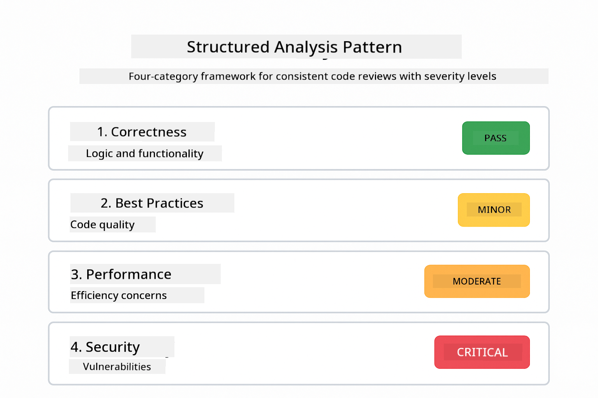
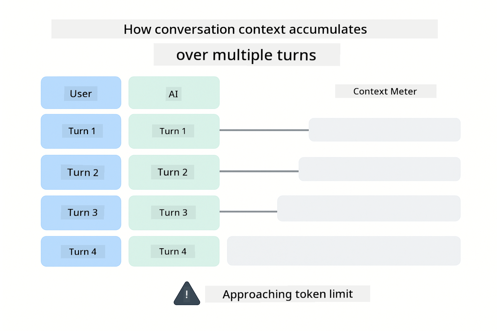
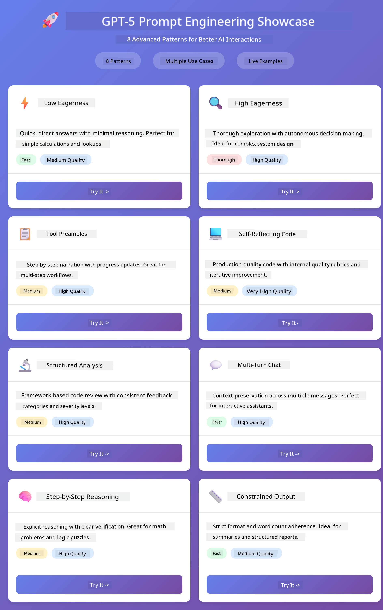
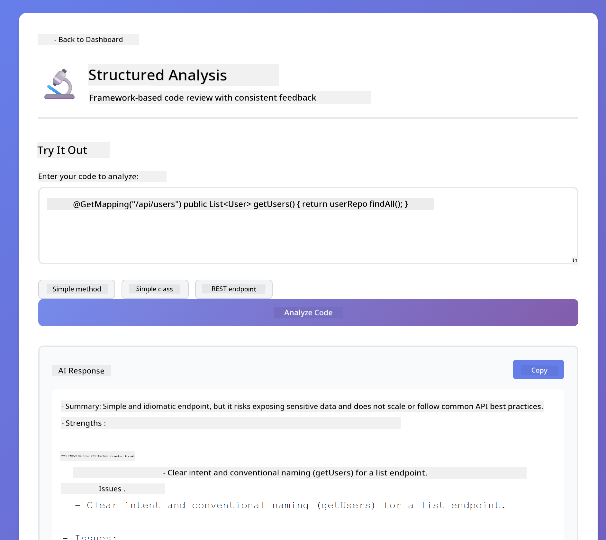
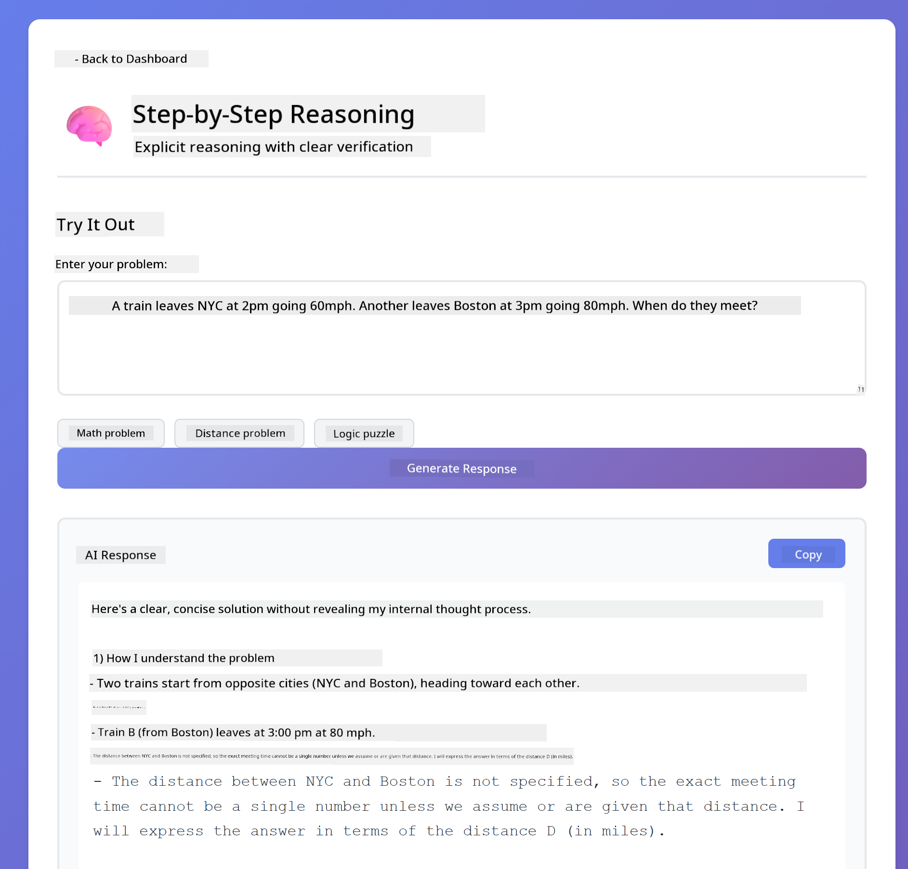
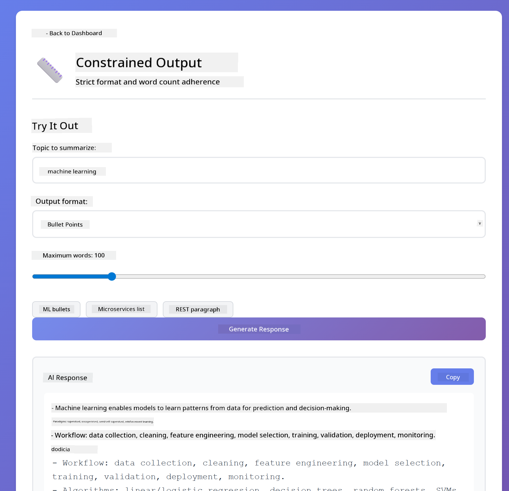
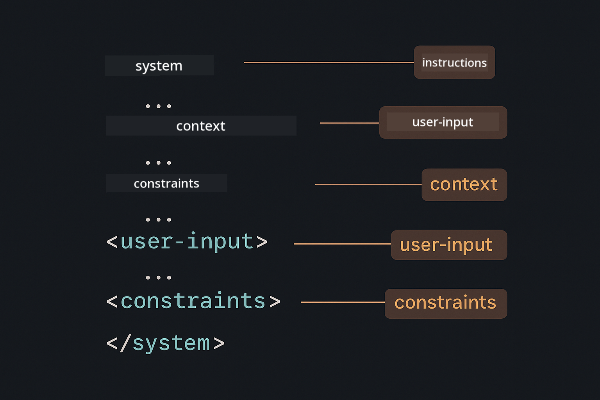

<!--
CO_OP_TRANSLATOR_METADATA:
{
  "original_hash": "8d787826cad7e92bf5cdbd116b1e6116",
  "translation_date": "2025-12-13T15:44:42+00:00",
  "source_file": "02-prompt-engineering/README.md",
  "language_code": "en"
}
-->
# Module 02: Prompt Engineering with GPT-5

## Table of Contents

- [What You'll Learn](../../../02-prompt-engineering)
- [Prerequisites](../../../02-prompt-engineering)
- [Understanding Prompt Engineering](../../../02-prompt-engineering)
- [How This Uses LangChain4j](../../../02-prompt-engineering)
- [The Core Patterns](../../../02-prompt-engineering)
- [Using Existing Azure Resources](../../../02-prompt-engineering)
- [Application Screenshots](../../../02-prompt-engineering)
- [Exploring the Patterns](../../../02-prompt-engineering)
  - [Low vs High Eagerness](../../../02-prompt-engineering)
  - [Task Execution (Tool Preambles)](../../../02-prompt-engineering)
  - [Self-Reflecting Code](../../../02-prompt-engineering)
  - [Structured Analysis](../../../02-prompt-engineering)
  - [Multi-Turn Chat](../../../02-prompt-engineering)
  - [Step-by-Step Reasoning](../../../02-prompt-engineering)
  - [Constrained Output](../../../02-prompt-engineering)
- [What You're Really Learning](../../../02-prompt-engineering)
- [Next Steps](../../../02-prompt-engineering)

## What You'll Learn

In the previous module, you saw how memory enables conversational AI and used GitHub Models for basic interactions. Now we'll focus on how you ask questions - the prompts themselves - using Azure OpenAI's GPT-5. The way you structure your prompts dramatically affects the quality of responses you get.

We'll use GPT-5 because it introduces reasoning control - you can tell the model how much thinking to do before answering. This makes different prompting strategies more apparent and helps you understand when to use each approach. We'll also benefit from Azure's fewer rate limits for GPT-5 compared to GitHub Models.

## Prerequisites

- Completed Module 01 (Azure OpenAI resources deployed)
- `.env` file in root directory with Azure credentials (created by `azd up` in Module 01)

> **Note:** If you haven't completed Module 01, follow the deployment instructions there first.

## Understanding Prompt Engineering

Prompt engineering is about designing input text that consistently gets you the results you need. It's not just about asking questions - it's about structuring requests so the model understands exactly what you want and how to deliver it.

Think of it like giving instructions to a colleague. "Fix the bug" is vague. "Fix the null pointer exception in UserService.java line 45 by adding a null check" is specific. Language models work the same way - specificity and structure matter.

## How This Uses LangChain4j

This module demonstrates advanced prompting patterns using the same LangChain4j foundation from previous modules, with a focus on prompt structure and reasoning control.


*How LangChain4j connects your prompts to Azure OpenAI GPT-5*

**Dependencies** - Module 02 uses the following langchain4j dependencies defined in `pom.xml`:
```xml
<dependency>
    <groupId>dev.langchain4j</groupId>
    <artifactId>langchain4j</artifactId> <!-- Inherited from BOM in root pom.xml -->
</dependency>
<dependency>
    <groupId>dev.langchain4j</groupId>
    <artifactId>langchain4j-open-ai-official</artifactId> <!-- Inherited from BOM in root pom.xml -->
</dependency>
```

**OpenAiOfficialChatModel Configuration** - [LangChainConfig.java](../../../02-prompt-engineering/src/main/java/com/example/langchain4j/prompts/config/LangChainConfig.java)

The chat model is manually configured as a Spring bean using the OpenAI Official client, which supports Azure OpenAI endpoints. The key difference from Module 01 is how we structure the prompts sent to `chatModel.chat()`, not the model setup itself.

**System and User Messages** - [Gpt5PromptService.java](../../../02-prompt-engineering/src/main/java/com/example/langchain4j/prompts/service/Gpt5PromptService.java)

LangChain4j separates message types for clarity. `SystemMessage` sets the AI's behavior and context (like "You are a code reviewer"), while `UserMessage` contains the actual request. This separation lets you maintain consistent AI behavior across different user queries.

```java
SystemMessage systemMsg = SystemMessage.from(
    "You are a helpful Java programming expert."
);

UserMessage userMsg = UserMessage.from(
    "Explain what a List is in Java"
);

String response = chatModel.chat(systemMsg, userMsg);
```



*SystemMessage provides persistent context while UserMessages contain individual requests*

**MessageWindowChatMemory for Multi-Turn** - For the multi-turn conversation pattern, we reuse `MessageWindowChatMemory` from Module 01. Each session gets its own memory instance stored in a `Map<String, ChatMemory>`, allowing multiple concurrent conversations without context mixing.

**Prompt Templates** - The real focus here is prompt engineering, not new LangChain4j APIs. Each pattern (low eagerness, high eagerness, task execution, etc.) uses the same `chatModel.chat(prompt)` method but with carefully structured prompt strings. The XML tags, instructions, and formatting are all part of the prompt text, not LangChain4j features.

**Reasoning Control** - GPT-5's reasoning effort is controlled through prompt instructions like "maximum 2 reasoning steps" or "explore thoroughly". These are prompt engineering techniques, not LangChain4j configurations. The library simply delivers your prompts to the model.

The key takeaway: LangChain4j provides the infrastructure (model connection via [LangChainConfig.java](../../../02-prompt-engineering/src/main/java/com/example/langchain4j/prompts/config/LangChainConfig.java), memory, message handling via [Gpt5PromptService.java](../../../02-prompt-engineering/src/main/java/com/example/langchain4j/prompts/service/Gpt5PromptService.java)), while this module teaches you how to craft effective prompts within that infrastructure.

## The Core Patterns

Not all problems need the same approach. Some questions need quick answers, others need deep thinking. Some need visible reasoning, others just need results. This module covers eight prompting patterns - each optimized for different scenarios. You'll experiment with all of them to learn when each approach works best.


*Overview of the eight prompt engineering patterns and their use cases*



*Low eagerness (fast, direct) vs High eagerness (thorough, exploratory) reasoning approaches*

**Low Eagerness (Quick & Focused)** - For simple questions where you want fast, direct answers. The model does minimal reasoning - maximum 2 steps. Use this for calculations, lookups, or straightforward questions.

```java
String prompt = """
    <reasoning_effort>low</reasoning_effort>
    <instruction>maximum 2 reasoning steps</instruction>
    
    What is 15% of 200?
    """;

String response = chatModel.chat(prompt);
```

> 💡 **Explore with GitHub Copilot:** Open [`Gpt5PromptService.java`](../../../02-prompt-engineering/src/main/java/com/example/langchain4j/prompts/service/Gpt5PromptService.java) and ask:
> - "What's the difference between low eagerness and high eagerness prompting patterns?"
> - "How do the XML tags in prompts help structure the AI's response?"
> - "When should I use self-reflection patterns vs direct instruction?"

**High Eagerness (Deep & Thorough)** - For complex problems where you want comprehensive analysis. The model explores thoroughly and shows detailed reasoning. Use this for system design, architecture decisions, or complex research.

```java
String prompt = """
    <reasoning_effort>high</reasoning_effort>
    <instruction>explore thoroughly, show detailed reasoning</instruction>
    
    Design a caching strategy for a high-traffic REST API.
    """;

String response = chatModel.chat(prompt);
```

**Task Execution (Step-by-Step Progress)** - For multi-step workflows. The model provides an upfront plan, narrates each step as it works, then gives a summary. Use this for migrations, implementations, or any multi-step process.

```java
String prompt = """
    <task>Create a REST endpoint for user registration</task>
    <preamble>Provide an upfront plan</preamble>
    <narration>Narrate each step as you work</narration>
    <summary>Summarize what was accomplished</summary>
    """;

String response = chatModel.chat(prompt);
```

Chain-of-Thought prompting explicitly asks the model to show its reasoning process, improving accuracy for complex tasks. The step-by-step breakdown helps both humans and AI understand the logic.

> **🤖 Try with [GitHub Copilot](https://github.com/features/copilot) Chat:** Ask about this pattern:
> - "How would I adapt the task execution pattern for long-running operations?"
> - "What are best practices for structuring tool preambles in production applications?"
> - "How can I capture and display intermediate progress updates in a UI?"


*Plan → Execute → Summarize workflow for multi-step tasks*

**Self-Reflecting Code** - For generating production-quality code. The model generates code, checks it against quality criteria, and improves it iteratively. Use this when building new features or services.

```java
String prompt = """
    <task>Create an email validation service</task>
    <quality_criteria>
    - Correct logic and error handling
    - Best practices (clean code, proper naming)
    - Performance optimization
    - Security considerations
    </quality_criteria>
    <instruction>Generate code, evaluate against criteria, improve iteratively</instruction>
    """;

String response = chatModel.chat(prompt);
```



*Iterative improvement loop - generate, evaluate, identify issues, improve, repeat*

**Structured Analysis** - For consistent evaluation. The model reviews code using a fixed framework (correctness, practices, performance, security). Use this for code reviews or quality assessments.

```java
String prompt = """
    <code>
    public List getUsers() {
        return database.query("SELECT * FROM users");
    }
    </code>
    
    <framework>
    Evaluate using these categories:
    1. Correctness - Logic and functionality
    2. Best Practices - Code quality
    3. Performance - Efficiency concerns
    4. Security - Vulnerabilities
    </framework>
    """;

String response = chatModel.chat(prompt);
```

> **🤖 Try with [GitHub Copilot](https://github.com/features/copilot) Chat:** Ask about structured analysis:
> - "How can I customize the analysis framework for different types of code reviews?"
> - "What's the best way to parse and act on structured output programmatically?"
> - "How do I ensure consistent severity levels across different review sessions?"



*Four-category framework for consistent code reviews with severity levels*

**Multi-Turn Chat** - For conversations that need context. The model remembers previous messages and builds on them. Use this for interactive help sessions or complex Q&A.

```java
ChatMemory memory = MessageWindowChatMemory.withMaxMessages(10);

memory.add(UserMessage.from("What is Spring Boot?"));
AiMessage aiMessage1 = chatModel.chat(memory.messages()).aiMessage();
memory.add(aiMessage1);

memory.add(UserMessage.from("Show me an example"));
AiMessage aiMessage2 = chatModel.chat(memory.messages()).aiMessage();
memory.add(aiMessage2);
```



*How conversation context accumulates over multiple turns until reaching the token limit*

**Step-by-Step Reasoning** - For problems requiring visible logic. The model shows explicit reasoning for each step. Use this for math problems, logic puzzles, or when you need to understand the thinking process.

```java
String prompt = """
    <instruction>Show your reasoning step-by-step</instruction>
    
    If a train travels 120 km in 2 hours, then stops for 30 minutes,
    then travels another 90 km in 1.5 hours, what is the average speed
    for the entire journey including the stop?
    """;

String response = chatModel.chat(prompt);
```


*Breaking down problems into explicit logical steps*

**Constrained Output** - For responses with specific format requirements. The model strictly follows format and length rules. Use this for summaries or when you need precise output structure.

```java
String prompt = """
    <constraints>
    - Exactly 100 words
    - Bullet point format
    - Technical terms only
    </constraints>
    
    Summarize the key concepts of machine learning.
    """;

String response = chatModel.chat(prompt);
```


*Enforcing specific format, length, and structure requirements*

## Using Existing Azure Resources

**Verify deployment:**

Ensure the `.env` file exists in root directory with Azure credentials (created during Module 01):
```bash
cat ../.env  # Should show AZURE_OPENAI_ENDPOINT, API_KEY, DEPLOYMENT
```

**Start the application:**

> **Note:** If you already started all applications using `./start-all.sh` from Module 01, this module is already running on port 8083. You can skip the start commands below and go directly to http://localhost:8083.

**Option 1: Using Spring Boot Dashboard (Recommended for VS Code users)**

The dev container includes the Spring Boot Dashboard extension, which provides a visual interface to manage all Spring Boot applications. You can find it in the Activity Bar on the left side of VS Code (look for the Spring Boot icon).

From the Spring Boot Dashboard, you can:
- See all available Spring Boot applications in the workspace
- Start/stop applications with a single click
- View application logs in real-time
- Monitor application status

Simply click the play button next to "prompt-engineering" to start this module, or start all modules at once.


**Option 2: Using shell scripts**

Start all web applications (modules 01-04):

**Bash:**
```bash
cd ..  # From root directory
./start-all.sh
```

**PowerShell:**
```powershell
cd ..  # From root directory
.\start-all.ps1
```

Or start just this module:

**Bash:**
```bash
cd 02-prompt-engineering
./start.sh
```

**PowerShell:**
```powershell
cd 02-prompt-engineering
.\start.ps1
```

Both scripts automatically load environment variables from the root `.env` file and will build the JARs if they don't exist.

> **Note:** If you prefer to build all modules manually before starting:
>
> **Bash:**
> ```bash
> cd ..  # Go to root directory
> mvn clean package -DskipTests
> ```
>
> **PowerShell:**
> ```powershell
> cd ..  # Go to root directory
> mvn clean package -DskipTests
> ```

Open http://localhost:8083 in your browser.

**To stop:**

**Bash:**
```bash
./stop.sh  # This module only
# Or
cd .. && ./stop-all.sh  # All modules
```

**PowerShell:**
```powershell
.\stop.ps1  # This module only
# Or
cd ..; .\stop-all.ps1  # All modules
```

## Application Screenshots



*The main dashboard showing all 8 prompt engineering patterns with their characteristics and use cases*

## Exploring the Patterns

The web interface lets you experiment with different prompting strategies. Each pattern solves different problems - try them to see when each approach shines.

### Low vs High Eagerness

Ask a simple question like "What is 15% of 200?" using Low Eagerness. You'll get an instant, direct answer. Now ask something complex like "Design a caching strategy for a high-traffic API" using High Eagerness. Watch how the model slows down and provides detailed reasoning. Same model, same question structure - but the prompt tells it how much thinking to do.


*Quick calculation with minimal reasoning*


*Comprehensive caching strategy (2.8MB)*

### Task Execution (Tool Preambles)

Multi-step workflows benefit from upfront planning and progress narration. The model outlines what it will do, narrates each step, then summarizes results.


*Creating a REST endpoint with step-by-step narration (3.9MB)*

### Self-Reflecting Code

Try "Create an email validation service". Instead of just generating code and stopping, the model generates, evaluates against quality criteria, identifies weaknesses, and improves. You'll see it iterate until the code meets production standards.


*Complete email validation service (5.2MB)*

### Structured Analysis

Code reviews need consistent evaluation frameworks. The model analyzes code using fixed categories (correctness, practices, performance, security) with severity levels.



*Framework-based code review*

### Multi-Turn Chat

Ask "What is Spring Boot?" then immediately follow up with "Show me an example". The model remembers your first question and gives you a Spring Boot example specifically. Without memory, that second question would be too vague.


*Context preservation across questions*

### Step-by-Step Reasoning

Pick a math problem and try it with both Step-by-Step Reasoning and Low Eagerness. Low eagerness just gives you the answer - fast but opaque. Step-by-step shows you every calculation and decision.



*Math problem with explicit steps*

### Constrained Output

When you need specific formats or word counts, this pattern enforces strict adherence. Try generating a summary with exactly 100 words in bullet point format.



*Machine learning summary with format control*

## What You're Really Learning

**Reasoning Effort Changes Everything**

GPT-5 lets you control computational effort through your prompts. Low effort means fast responses with minimal exploration. High effort means the model takes time to think deeply. You're learning to match effort to task complexity - don't waste time on simple questions, but don't rush complex decisions either.

**Structure Guides Behavior**

Notice the XML tags in the prompts? They're not decorative. Models follow structured instructions more reliably than freeform text. When you need multi-step processes or complex logic, structure helps the model track where it is and what comes next.



*Anatomy of a well-structured prompt with clear sections and XML-style organization*

**Quality Through Self-Evaluation**

The self-reflecting patterns work by making quality criteria explicit. Instead of hoping the model "does it right", you tell it exactly what "right" means: correct logic, error handling, performance, security. The model can then evaluate its own output and improve. This turns code generation from a lottery into a process.

**Context Is Finite**

Multi-turn conversations work by including message history with each request. But there's a limit - every model has a maximum token count. As conversations grow, you'll need strategies to keep relevant context without hitting that ceiling. This module shows you how memory works; later you'll learn when to summarize, when to forget, and when to retrieve.

## Next Steps

**Next Module:** [03-rag - RAG (Retrieval-Augmented Generation)](../03-rag/README.md)

---

**Navigation:** [← Previous: Module 01 - Introduction](../01-introduction/README.md) | [Back to Main](../README.md) | [Next: Module 03 - RAG →](../03-rag/README.md)

---

<!-- CO-OP TRANSLATOR DISCLAIMER START -->
**Disclaimer**:
This document has been translated using the AI translation service [Co-op Translator](https://github.com/Azure/co-op-translator). While we strive for accuracy, please be aware that automated translations may contain errors or inaccuracies. The original document in its native language should be considered the authoritative source. For critical information, professional human translation is recommended. We are not liable for any misunderstandings or misinterpretations arising from the use of this translation.
<!-- CO-OP TRANSLATOR DISCLAIMER END -->