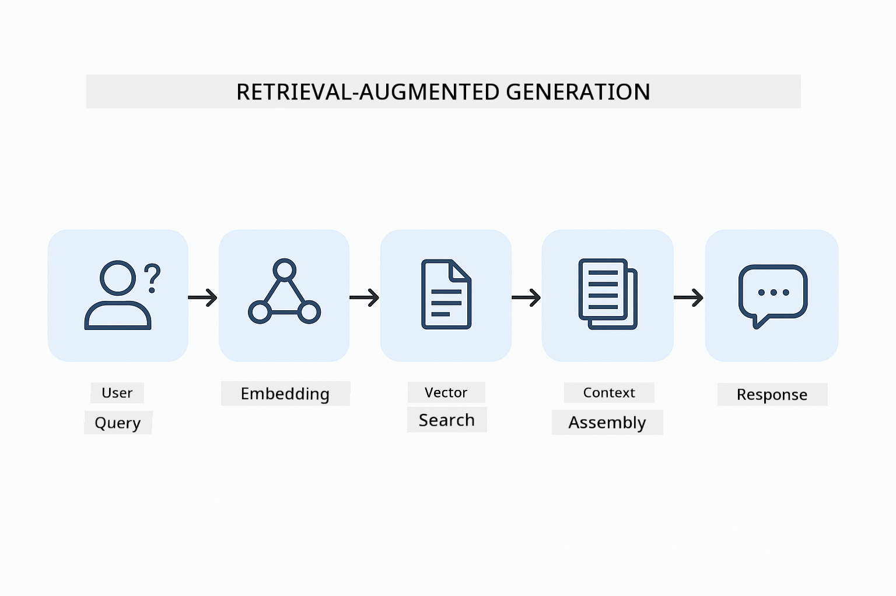
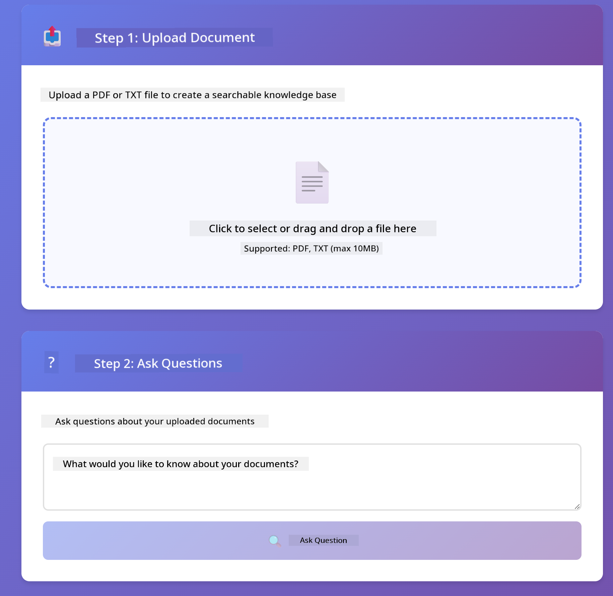

<!--
CO_OP_TRANSLATOR_METADATA:
{
  "original_hash": "f538a51cfd13147d40d84e936a0f485c",
  "translation_date": "2025-12-13T16:41:33+00:00",
  "source_file": "03-rag/README.md",
  "language_code": "en"
}
-->
# Module 03: RAG (Retrieval-Augmented Generation)

## Table of Contents

- [What You'll Learn](../../../03-rag)
- [Prerequisites](../../../03-rag)
- [Understanding RAG](../../../03-rag)
- [How It Works](../../../03-rag)
  - [Document Processing](../../../03-rag)
  - [Creating Embeddings](../../../03-rag)
  - [Semantic Search](../../../03-rag)
  - [Answer Generation](../../../03-rag)
- [Run the Application](../../../03-rag)
- [Using the Application](../../../03-rag)
  - [Upload a Document](../../../03-rag)
  - [Ask Questions](../../../03-rag)
  - [Check Source References](../../../03-rag)
  - [Experiment with Questions](../../../03-rag)
- [Key Concepts](../../../03-rag)
  - [Chunking Strategy](../../../03-rag)
  - [Similarity Scores](../../../03-rag)
  - [In-Memory Storage](../../../03-rag)
  - [Context Window Management](../../../03-rag)
- [When RAG Matters](../../../03-rag)
- [Next Steps](../../../03-rag)

## What You'll Learn

In the previous modules, you learned how to have conversations with AI and structure your prompts effectively. But there's a fundamental limitation: language models only know what they learned during training. They can't answer questions about your company's policies, your project documentation, or any information they weren't trained on.

RAG (Retrieval-Augmented Generation) solves this problem. Instead of trying to teach the model your information (which is expensive and impractical), you give it the ability to search through your documents. When someone asks a question, the system finds relevant information and includes it in the prompt. The model then answers based on that retrieved context.

Think of RAG as giving the model a reference library. When you ask a question, the system:

1. **User Query** - You ask a question
2. **Embedding** - Converts your question to a vector
3. **Vector Search** - Finds similar document chunks
4. **Context Assembly** - Adds relevant chunks to the prompt
5. **Response** - LLM generates an answer based on the context

This grounds the model's responses in your actual data instead of relying on its training knowledge or making up answers.



*RAG workflow - from user query to semantic search to contextual answer generation*

## Prerequisites

- Completed Module 01 (Azure OpenAI resources deployed)
- `.env` file in root directory with Azure credentials (created by `azd up` in Module 01)

> **Note:** If you haven't completed Module 01, follow the deployment instructions there first.


## How It Works

**Document Processing** - [DocumentService.java](../../../03-rag/src/main/java/com/example/langchain4j/rag/service/DocumentService.java)

When you upload a document, the system breaks it into chunks - smaller pieces that fit comfortably in the model's context window. These chunks overlap slightly so you don't lose context at the boundaries.

```java
Document document = FileSystemDocumentLoader.loadDocument("sample-document.txt");

DocumentSplitter splitter = DocumentSplitters
    .recursive(300, 30, new OpenAiTokenizer());

List<TextSegment> segments = splitter.split(document);
```

> **🤖 Try with [GitHub Copilot](https://github.com/features/copilot) Chat:** Open [`DocumentService.java`](../../../03-rag/src/main/java/com/example/langchain4j/rag/service/DocumentService.java) and ask:
> - "How does LangChain4j split documents into chunks and why is overlap important?"
> - "What's the optimal chunk size for different document types and why?"
> - "How do I handle documents in multiple languages or with special formatting?"

**Creating Embeddings** - [LangChainRagConfig.java](../../../03-rag/src/main/java/com/example/langchain4j/rag/config/LangChainRagConfig.java)

Each chunk is converted into a numerical representation called an embedding - essentially a mathematical fingerprint that captures the meaning of the text. Similar text produces similar embeddings.

```java
@Bean
public EmbeddingModel embeddingModel() {
    return OpenAiOfficialEmbeddingModel.builder()
        .baseUrl(azureOpenAiEndpoint)
        .apiKey(azureOpenAiKey)
        .modelName(azureEmbeddingDeploymentName)
        .build();
}

EmbeddingStore<TextSegment> embeddingStore = 
    new InMemoryEmbeddingStore<>();
```


*Documents represented as vectors in embedding space - similar content clusters together*

**Semantic Search** - [RagService.java](../../../03-rag/src/main/java/com/example/langchain4j/rag/service/RagService.java)

When you ask a question, your question also becomes an embedding. The system compares your question's embedding against all the document chunks' embeddings. It finds the chunks with the most similar meanings - not just matching keywords, but actual semantic similarity.

```java
Embedding queryEmbedding = embeddingModel.embed(question).content();

List<EmbeddingMatch<TextSegment>> matches = 
    embeddingStore.findRelevant(queryEmbedding, 5, 0.7);

for (EmbeddingMatch<TextSegment> match : matches) {
    String relevantText = match.embedded().text();
    double score = match.score();
}
```

> **🤖 Try with [GitHub Copilot](https://github.com/features/copilot) Chat:** Open [`RagService.java`](../../../03-rag/src/main/java/com/example/langchain4j/rag/service/RagService.java) and ask:
> - "How does similarity search work with embeddings and what determines the score?"
> - "What similarity threshold should I use and how does it affect results?"
> - "How do I handle cases where no relevant documents are found?"

**Answer Generation** - [RagService.java](../../../03-rag/src/main/java/com/example/langchain4j/rag/service/RagService.java)

The most relevant chunks are included in the prompt to the model. The model reads those specific chunks and answers your question based on that information. This prevents hallucination - the model can only answer from what's in front of it.

## Run the Application

**Verify deployment:**

Ensure the `.env` file exists in root directory with Azure credentials (created during Module 01):
```bash
cat ../.env  # Should show AZURE_OPENAI_ENDPOINT, API_KEY, DEPLOYMENT
```

**Start the application:**

> **Note:** If you already started all applications using `./start-all.sh` from Module 01, this module is already running on port 8081. You can skip the start commands below and go directly to http://localhost:8081.

**Option 1: Using Spring Boot Dashboard (Recommended for VS Code users)**

The dev container includes the Spring Boot Dashboard extension, which provides a visual interface to manage all Spring Boot applications. You can find it in the Activity Bar on the left side of VS Code (look for the Spring Boot icon).

From the Spring Boot Dashboard, you can:
- See all available Spring Boot applications in the workspace
- Start/stop applications with a single click
- View application logs in real-time
- Monitor application status

Simply click the play button next to "rag" to start this module, or start all modules at once.


**Option 2: Using shell scripts**

Start all web applications (modules 01-04):

**Bash:**
```bash
cd ..  # From root directory
./start-all.sh
```

**PowerShell:**
```powershell
cd ..  # From root directory
.\start-all.ps1
```

Or start just this module:

**Bash:**
```bash
cd 03-rag
./start.sh
```

**PowerShell:**
```powershell
cd 03-rag
.\start.ps1
```

Both scripts automatically load environment variables from the root `.env` file and will build the JARs if they don't exist.

> **Note:** If you prefer to build all modules manually before starting:
>
> **Bash:**
> ```bash
> cd ..  # Go to root directory
> mvn clean package -DskipTests
> ```
>
> **PowerShell:**
> ```powershell
> cd ..  # Go to root directory
> mvn clean package -DskipTests
> ```

Open http://localhost:8081 in your browser.

**To stop:**

**Bash:**
```bash
./stop.sh  # This module only
# Or
cd .. && ./stop-all.sh  # All modules
```

**PowerShell:**
```powershell
.\stop.ps1  # This module only
# Or
cd ..; .\stop-all.ps1  # All modules
```

## Using the Application

The application provides a web interface for document upload and questioning.

<a href="images/rag-homepage.png"></a>

*The RAG application interface - upload documents and ask questions*

**Upload a Document**

Start by uploading a document - TXT files work best for testing. A `sample-document.txt` is provided in this directory that contains information about LangChain4j features, RAG implementation, and best practices - perfect for testing the system. 

The system processes your document, breaks it into chunks, and creates embeddings for each chunk. This happens automatically when you upload.

**Ask Questions**

Now ask specific questions about the document content. Try something factual that's clearly stated in the document. The system searches for relevant chunks, includes them in the prompt, and generates an answer.

**Check Source References**

Notice each answer includes source references with similarity scores. These scores (0 to 1) show how relevant each chunk was to your question. Higher scores mean better matches. This lets you verify the answer against the source material.

<a href="images/rag-query-results.png"></a>

*Query results showing answer with source references and relevance scores*

**Experiment with Questions**

Try different types of questions:
- Specific facts: "What is the main topic?"
- Comparisons: "What's the difference between X and Y?"
- Summaries: "Summarize the key points about Z"

Watch how the relevance scores change based on how well your question matches document content.

## Key Concepts

**Chunking Strategy**

Documents are split into 300-token chunks with 30 tokens of overlap. This balance ensures each chunk has enough context to be meaningful while staying small enough to include multiple chunks in a prompt.

**Similarity Scores**

Scores range from 0 to 1:
- 0.7-1.0: Highly relevant, exact match
- 0.5-0.7: Relevant, good context
- Below 0.5: Filtered out, too dissimilar

The system only retrieves chunks above the minimum threshold to ensure quality.

**In-Memory Storage**

This module uses in-memory storage for simplicity. When you restart the application, uploaded documents are lost. Production systems use persistent vector databases like Qdrant or Azure AI Search.

**Context Window Management**

Each model has a maximum context window. You can't include every chunk from a large document. The system retrieves the top N most relevant chunks (default 5) to stay within limits while providing enough context for accurate answers.

## When RAG Matters

**Use RAG when:**
- Answering questions about proprietary documents
- Information changes frequently (policies, prices, specifications)
- Accuracy requires source attribution
- Content is too large to fit in a single prompt
- You need verifiable, grounded responses

**Don't use RAG when:**
- Questions require general knowledge the model already has
- Real-time data is needed (RAG works on uploaded documents)
- Content is small enough to include directly in prompts

## Next Steps

**Next Module:** [04-tools - AI Agents with Tools](../04-tools/README.md)

---

**Navigation:** [← Previous: Module 02 - Prompt Engineering](../02-prompt-engineering/README.md) | [Back to Main](../README.md) | [Next: Module 04 - Tools →](../04-tools/README.md)

---

<!-- CO-OP TRANSLATOR DISCLAIMER START -->
**Disclaimer**:
This document has been translated using the AI translation service [Co-op Translator](https://github.com/Azure/co-op-translator). While we strive for accuracy, please be aware that automated translations may contain errors or inaccuracies. The original document in its native language should be considered the authoritative source. For critical information, professional human translation is recommended. We are not liable for any misunderstandings or misinterpretations arising from the use of this translation.
<!-- CO-OP TRANSLATOR DISCLAIMER END -->