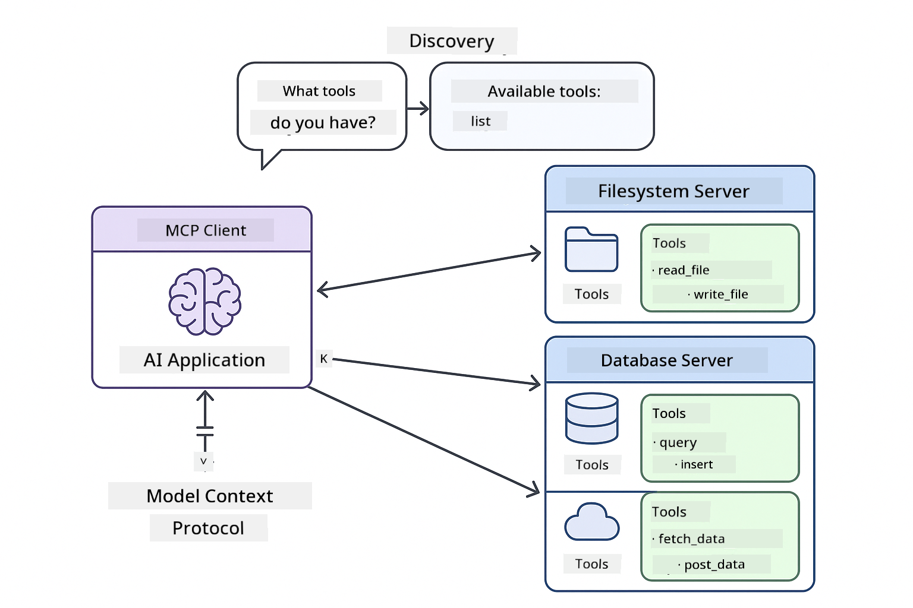

<!--
CO_OP_TRANSLATOR_METADATA:
{
  "original_hash": "c25ec1f10ef156c53e190cdf8b0711ab",
  "translation_date": "2025-12-13T17:34:01+00:00",
  "source_file": "05-mcp/README.md",
  "language_code": "en"
}
-->
# Module 05: Model Context Protocol (MCP)

## Table of Contents

- [What You'll Learn](../../../05-mcp)
- [Understanding MCP](../../../05-mcp)
- [How MCP Works](../../../05-mcp)
  - [Server-Client Architecture](../../../05-mcp)
  - [Tool Discovery](../../../05-mcp)
  - [Transport Mechanisms](../../../05-mcp)
- [Prerequisites](../../../05-mcp)
- [What This Module Covers](../../../05-mcp)
- [Quick Start](../../../05-mcp)
  - [Example 1: Remote Calculator (Streamable HTTP)](../../../05-mcp)
  - [Example 2: File Operations (Stdio)](../../../05-mcp)
  - [Example 3: Git Analysis (Docker)](../../../05-mcp)
- [Key Concepts](../../../05-mcp)
  - [Transport Selection](../../../05-mcp)
  - [Tool Discovery](../../../05-mcp)
  - [Session Management](../../../05-mcp)
  - [Cross-Platform Considerations](../../../05-mcp)
- [When to Use MCP](../../../05-mcp)
- [MCP Ecosystem](../../../05-mcp)
- [Congratulations!](../../../05-mcp)
  - [What's Next?](../../../05-mcp)
- [Troubleshooting](../../../05-mcp)

## What You'll Learn

You've built conversational AI, mastered prompts, grounded responses in documents, and created agents with tools. But all those tools were custom-built for your specific application. What if you could give your AI access to a standardized ecosystem of tools that anyone can create and share?

The Model Context Protocol (MCP) provides exactly that - a standard way for AI applications to discover and use external tools. Instead of writing custom integrations for each data source or service, you connect to MCP servers that expose their capabilities in a consistent format. Your AI agent can then discover and use these tools automatically.


*Before MCP: Complex point-to-point integrations. After MCP: One protocol, endless possibilities.*

## Understanding MCP

MCP solves a fundamental problem in AI development: every integration is custom. Want to access GitHub? Custom code. Want to read files? Custom code. Want to query a database? Custom code. And none of these integrations work with other AI applications.

MCP standardizes this. An MCP server exposes tools with clear descriptions and schemas. Any MCP client can connect, discover available tools, and use them. Build once, use everywhere.



*Model Context Protocol architecture - standardized tool discovery and execution*

## How MCP Works

**Server-Client Architecture**

MCP uses a client-server model. Servers provide tools - reading files, querying databases, calling APIs. Clients (your AI application) connect to servers and use their tools.

**Tool Discovery**

When your client connects to an MCP server, it asks "What tools do you have?" The server responds with a list of available tools, each with descriptions and parameter schemas. Your AI agent can then decide which tools to use based on user requests.

**Transport Mechanisms**

MCP defines two transport mechanisms: HTTP for remote servers, Stdio for local processes (including Docker containers):


*MCP transport mechanisms: HTTP for remote servers, Stdio for local processes (including Docker containers)*

**Streamable HTTP** - [StreamableHttpDemo.java](../../../05-mcp/src/main/java/com/example/langchain4j/mcp/StreamableHttpDemo.java)

For remote servers. Your application makes HTTP requests to a server running somewhere on the network. Uses Server-Sent Events for real-time communication.

```java
McpTransport httpTransport = new StreamableHttpMcpTransport.Builder()
    .url("http://localhost:3001/mcp")
    .timeout(Duration.ofSeconds(60))
    .logRequests(true)
    .logResponses(true)
    .build();
```

> **🤖 Try with [GitHub Copilot](https://github.com/features/copilot) Chat:** Open [`StreamableHttpDemo.java`](../../../05-mcp/src/main/java/com/example/langchain4j/mcp/StreamableHttpDemo.java) and ask:
> - "How does MCP differ from direct tool integration like in Module 04?"
> - "What are the benefits of using MCP for tool sharing across applications?"
> - "How do I handle connection failures or timeouts to MCP servers?"

**Stdio** - [StdioTransportDemo.java](../../../05-mcp/src/main/java/com/example/langchain4j/mcp/StdioTransportDemo.java)

For local processes. Your application spawns a server as a subprocess and communicates through standard input/output. Useful for filesystem access or command-line tools.

```java
McpTransport stdioTransport = new StdioMcpTransport.Builder()
    .command(List.of(
        npmCmd, "exec",
        "@modelcontextprotocol/server-filesystem@0.6.2",
        resourcesDir
    ))
    .logEvents(false)
    .build();
```

> **🤖 Try with [GitHub Copilot](https://github.com/features/copilot) Chat:** Open [`StdioTransportDemo.java`](../../../05-mcp/src/main/java/com/example/langchain4j/mcp/StdioTransportDemo.java) and ask:
> - "How does Stdio transport work and when should I use it vs HTTP?"
> - "How does LangChain4j manage the lifecycle of spawned MCP server processes?"
> - "What are the security implications of giving AI access to the file system?"

**Docker (uses Stdio)** - [GitRepositoryAnalyzer.java](../../../05-mcp/src/main/java/com/example/langchain4j/mcp/GitRepositoryAnalyzer.java)

For containerized services. Uses stdio transport to communicate with a Docker container via `docker run`. Good for complex dependencies or isolated environments.

```java
McpTransport dockerTransport = new StdioMcpTransport.Builder()
    .command(List.of(
        "docker", "run",
        "-e", "GITHUB_PERSONAL_ACCESS_TOKEN=" + System.getenv("GITHUB_TOKEN"),
        "-v", volumeMapping,
        "-i", "mcp/git"
    ))
    .logEvents(true)
    .build();
```

> **🤖 Try with [GitHub Copilot](https://github.com/features/copilot) Chat:** Open [`GitRepositoryAnalyzer.java`](../../../05-mcp/src/main/java/com/example/langchain4j/mcp/GitRepositoryAnalyzer.java) and ask:
> - "How does Docker transport isolate MCP servers and what are the benefits?"
> - "How do I configure volume mounts to share data between host and MCP containers?"
> - "What are best practices for managing Docker-based MCP server lifecycles in production?"

## Running the Examples

### Prerequisites

- Java 21+, Maven 3.9+
- Node.js 16+ and npm (for MCP servers)
- **Docker Desktop** - Must be **RUNNING** for Example 3 (not just installed)
- GitHub Personal Access Token configured in `.env` file (from Module 00)

> **Note:** If you haven't set up your GitHub token yet, see [Module 00 - Quick Start](../00-quick-start/README.md) for instructions.

> **⚠️ Docker Users:** Before running Example 3, verify Docker Desktop is running with `docker ps`. If you see connection errors, start Docker Desktop and wait ~30 seconds for initialization.

## Quick Start

**Using VS Code:** Simply right-click on any demo file in the Explorer and select **"Run Java"**, or use the launch configurations from the Run and Debug panel (make sure you've added your token to the `.env` file first).

**Using Maven:** Alternatively, you can run from the command line with the examples below.

**⚠️ Important:** Some examples have prerequisites (like starting an MCP server or building Docker images). Check each example's requirements before running.

### Example 1: Remote Calculator (Streamable HTTP)

This demonstrates network-based tool integration.

**⚠️ Prerequisite:** You need to start the MCP server first (see Terminal 1 below).

**Terminal 1 - Start the MCP server:**

**Bash:**
```bash
git clone https://github.com/modelcontextprotocol/servers.git
cd servers/src/everything
npm install
node dist/streamableHttp.js
```

**PowerShell:**
```powershell
git clone https://github.com/modelcontextprotocol/servers.git
cd servers/src/everything
npm install
node dist/streamableHttp.js
```

**Terminal 2 - Run the example:**

**Using VS Code:** Right-click on `StreamableHttpDemo.java` and select **"Run Java"**.

**Using Maven:**

**Bash:**
```bash
export GITHUB_TOKEN=your_token_here
cd 05-mcp
mvn compile exec:java -Dexec.mainClass=com.example.langchain4j.mcp.StreamableHttpDemo
```

**PowerShell:**
```powershell
$env:GITHUB_TOKEN=your_token_here
cd 05-mcp
mvn --% compile exec:java -Dexec.mainClass=com.example.langchain4j.mcp.StreamableHttpDemo
```

Watch the agent discover available tools, then use the calculator to perform addition.

### Example 2: File Operations (Stdio)

This demonstrates local subprocess-based tools.

**✅ No prerequisites needed** - the MCP server is spawned automatically.

**Using VS Code:** Right-click on `StdioTransportDemo.java` and select **"Run Java"**.

**Using Maven:**

**Bash:**
```bash
export GITHUB_TOKEN=your_token_here
cd 05-mcp
mvn compile exec:java -Dexec.mainClass=com.example.langchain4j.mcp.StdioTransportDemo
```

**PowerShell:**
```powershell
$env:GITHUB_TOKEN=your_token_here
cd 05-mcp
mvn --% compile exec:java -Dexec.mainClass=com.example.langchain4j.mcp.StdioTransportDemo
```

The application spawns a filesystem MCP server automatically and reads a local file. Notice how the subprocess management is handled for you.

**Expected output:**
```
Assistant response: The content of the file is "Kaboom!".
```

### Example 3: Git Analysis (Docker)

This demonstrates containerized tool servers.

**⚠️ Prerequisites:** 
1. **Docker Desktop must be RUNNING** (not just installed)
2. **Windows users:** WSL 2 mode recommended (Docker Desktop Settings → General → "Use the WSL 2 based engine"). Hyper-V mode requires manual file sharing configuration.
3. You need to build the Docker image first (see Terminal 1 below)

**Verify Docker is running:**

**Bash:**
```bash
docker ps  # Should show container list, not an error
```

**PowerShell:**
```powershell
docker ps  # Should show container list, not an error
```

If you see an error like "Cannot connect to Docker daemon" or "The system cannot find the file specified", start Docker Desktop and wait for it to initialize (~30 seconds).

**Troubleshooting:**
- If the AI reports an empty repository or no files, the volume mount (`-v`) isn't working.
- **Windows Hyper-V users:** Add the project directory to Docker Desktop Settings → Resources → File sharing, then restart Docker Desktop.
- **Recommended solution:** Switch to WSL 2 mode for automatic file sharing (Settings → General → enable "Use the WSL 2 based engine").

**Terminal 1 - Build the Docker image:**

**Bash:**
```bash
cd servers/src/git
docker build -t mcp/git .
```

**PowerShell:**
```powershell
cd servers/src/git
docker build -t mcp/git .
```

**Terminal 2 - Run the analyzer:**

**Using VS Code:** Right-click on `GitRepositoryAnalyzer.java` and select **"Run Java"**.

**Using Maven:**

**Bash:**
```bash
export GITHUB_TOKEN=your_token_here
cd 05-mcp
mvn compile exec:java -Dexec.mainClass=com.example.langchain4j.mcp.GitRepositoryAnalyzer
```

**PowerShell:**
```powershell
$env:GITHUB_TOKEN=your_token_here
cd 05-mcp
mvn --% compile exec:java -Dexec.mainClass=com.example.langchain4j.mcp.GitRepositoryAnalyzer
```

The application launches a Docker container, mounts your repository, and analyzes the repository structure and contents through the AI agent.

## Key Concepts

**Transport Selection**

Choose based on where your tools live:
- Remote services → Streamable HTTP
- Local file system → Stdio
- Complex dependencies → Docker

**Tool Discovery**

MCP clients automatically discover available tools when connecting. Your AI agent sees tool descriptions and decides which ones to use based on the user's request.

**Session Management**

Streamable HTTP transport maintains sessions, allowing stateful interactions with remote servers. Stdio and Docker transports are typically stateless.

**Cross-Platform Considerations**

The examples handle platform differences automatically (Windows vs Unix command differences, path conversions for Docker). This is important for production deployments across different environments.

## When to Use MCP

**Use MCP when:**
- You want to leverage existing tool ecosystems
- Building tools that multiple applications will use
- Integrating third-party services with standard protocols
- You need to swap tool implementations without code changes

**Use custom tools (Module 04) when:**
- Building application-specific functionality
- Performance is critical (MCP adds overhead)
- Your tools are simple and won't be reused
- You need complete control over execution


## MCP Ecosystem

The Model Context Protocol is an open standard with a growing ecosystem:

- Official MCP servers for common tasks (filesystem, Git, databases)
- Community-contributed servers for various services
- Standardized tool descriptions and schemas
- Cross-framework compatibility (works with any MCP client)

This standardization means tools built for one AI application work with others, creating a shared ecosystem of capabilities.

## Congratulations!

You've completed the LangChain4j for Beginners course. You've learned:

- How to build conversational AI with memory (Module 01)
- Prompt engineering patterns for different tasks (Module 02)
- Grounding responses in your documents with RAG (Module 03)
- Creating AI agents with custom tools (Module 04)
- Integrating standardized tools through MCP (Module 05)

You now have the foundation to build production AI applications. The concepts you've learned apply regardless of specific frameworks or models - they're fundamental patterns in AI engineering.

### What's Next?

After completing the modules, explore the [Testing Guide](../docs/TESTING.md) to see LangChain4j testing concepts in action.

**Official Resources:**
- [LangChain4j Documentation](https://docs.langchain4j.dev/) - Comprehensive guides and API reference
- [LangChain4j GitHub](https://github.com/langchain4j/langchain4j) - Source code and examples
- [LangChain4j Tutorials](https://docs.langchain4j.dev/tutorials/) - Step-by-step tutorials for various use cases

Thank you for completing this course!

---

**Navigation:** [← Previous: Module 04 - Tools](../04-tools/README.md) | [Back to Main](../README.md)

---

## Troubleshooting

### PowerShell Maven Command Syntax
**Issue**: Maven commands fail with error `Unknown lifecycle phase ".mainClass=..."`

**Cause**: PowerShell interprets `=` as a variable assignment operator, breaking Maven property syntax

**Solution**: Use the stop-parsing operator `--%` before the Maven command:

**PowerShell:**
```powershell
mvn --% compile exec:java -Dexec.mainClass=com.example.langchain4j.mcp.StreamableHttpDemo
```

**Bash:**
```bash
mvn compile exec:java -Dexec.mainClass=com.example.langchain4j.mcp.StreamableHttpDemo
```

The `--%` operator tells PowerShell to pass all remaining arguments literally to Maven without interpretation.

### Docker Connection Issues

**Issue**: Docker commands fail with "Cannot connect to Docker daemon" or "The system cannot find the file specified"

**Cause**: Docker Desktop is not running or not fully initialized

**Solution**: 
1. Start Docker Desktop
2. Wait ~30 seconds for full initialization
3. Verify with `docker ps` (should show container list, not an error)
4. Then run your example

### Windows Docker Volume Mounting

**Issue**: Git repository analyzer reports empty repository or no files

**Cause**: Volume mount (`-v`) not working due to file sharing configuration

**Solution**:
- **Recommended:** Switch to WSL 2 mode (Docker Desktop Settings → General → "Use the WSL 2 based engine")
- **Alternative (Hyper-V):** Add project directory to Docker Desktop Settings → Resources → File sharing, then restart Docker Desktop

---

<!-- CO-OP TRANSLATOR DISCLAIMER START -->
**Disclaimer**:
This document has been translated using the AI translation service [Co-op Translator](https://github.com/Azure/co-op-translator). While we strive for accuracy, please be aware that automated translations may contain errors or inaccuracies. The original document in its native language should be considered the authoritative source. For critical information, professional human translation is recommended. We are not liable for any misunderstandings or misinterpretations arising from the use of this translation.
<!-- CO-OP TRANSLATOR DISCLAIMER END -->