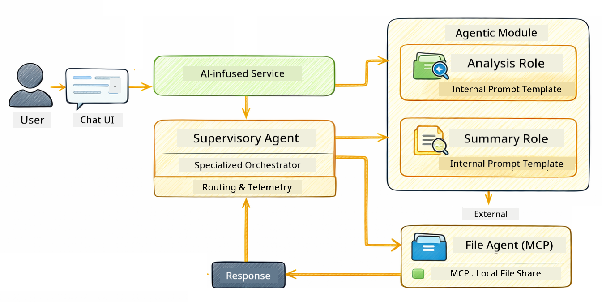

<!--
CO_OP_TRANSLATOR_METADATA:
{
  "original_hash": "f89f4c106d110e4943c055dd1a2f1dff",
  "translation_date": "2025-12-30T19:02:35+00:00",
  "source_file": "05-mcp/README.md",
  "language_code": "en"
}
-->
# Module 05: Model Context Protocol (MCP)

## Table of Contents

- [What You'll Learn](../../../05-mcp)
- [What is MCP?](../../../05-mcp)
- [How MCP Works](../../../05-mcp)
- [The Agentic Module](../../../05-mcp)
- [Running the Examples](../../../05-mcp)
  - [Prerequisites](../../../05-mcp)
- [Quick Start](../../../05-mcp)
  - [File Operations (Stdio)](../../../05-mcp)
  - [Supervisor Agent](../../../05-mcp)
    - [Understanding the Output](../../../05-mcp)
    - [Explanation of Agentic Module Features](../../../05-mcp)
- [Key Concepts](../../../05-mcp)
- [Congratulations!](../../../05-mcp)
  - [What's Next?](../../../05-mcp)

## What You'll Learn

You've built conversational AI, mastered prompts, grounded responses in documents, and created agents with tools. But all those tools were custom-built for your specific application. What if you could give your AI access to a standardized ecosystem of tools that anyone can create and share? In this module, you'll learn how to do just that with the Model Context Protocol (MCP) and LangChain4j's agentic module. We first showcase a simple MCP file reader and then show how it easily integrates into advanced agentic workflows using the Supervisor Agent pattern.

## What is MCP?

The Model Context Protocol (MCP) provides exactly that - a standard way for AI applications to discover and use external tools. Instead of writing custom integrations for each data source or service, you connect to MCP servers that expose their capabilities in a consistent format. Your AI agent can then discover and use these tools automatically.


*Before MCP: Complex point-to-point integrations. After MCP: One protocol, endless possibilities.*

MCP solves a fundamental problem in AI development: every integration is custom. Want to access GitHub? Custom code. Want to read files? Custom code. Want to query a database? Custom code. And none of these integrations work with other AI applications.

MCP standardizes this. An MCP server exposes tools with clear descriptions and schemas. Any MCP client can connect, discover available tools, and use them. Build once, use everywhere.


*Model Context Protocol architecture - standardized tool discovery and execution*

## How MCP Works

**Server-Client Architecture**

MCP uses a client-server model. Servers provide tools - reading files, querying databases, calling APIs. Clients (your AI application) connect to servers and use their tools.

To use MCP with LangChain4j, add this Maven dependency:

```xml
<dependency>
    <groupId>dev.langchain4j</groupId>
    <artifactId>langchain4j-mcp</artifactId>
    <version>${langchain4j.version}</version>
</dependency>
```

**Tool Discovery**

When your client connects to an MCP server, it asks "What tools do you have?" The server responds with a list of available tools, each with descriptions and parameter schemas. Your AI agent can then decide which tools to use based on user requests.

**Transport Mechanisms**

MCP supports different transport mechanisms. This module demonstrates the Stdio transport for local processes:


*MCP transport mechanisms: HTTP for remote servers, Stdio for local processes*

**Stdio** - [StdioTransportDemo.java](../../../05-mcp/src/main/java/com/example/langchain4j/mcp/StdioTransportDemo.java)

For local processes. Your application spawns a server as a subprocess and communicates through standard input/output. Useful for filesystem access or command-line tools.

```java
McpTransport stdioTransport = new StdioMcpTransport.Builder()
    .command(List.of(
        npmCmd, "exec",
        "@modelcontextprotocol/server-filesystem@2025.12.18",
        resourcesDir
    ))
    .logEvents(false)
    .build();
```

> **🤖 Try with [GitHub Copilot](https://github.com/features/copilot) Chat:** Open [`StdioTransportDemo.java`](../../../05-mcp/src/main/java/com/example/langchain4j/mcp/StdioTransportDemo.java) and ask:
> - "How does Stdio transport work and when should I use it vs HTTP?"
> - "How does LangChain4j manage the lifecycle of spawned MCP server processes?"
> - "What are the security implications of giving AI access to the file system?"

## The Agentic Module

While MCP provides standardized tools, LangChain4j's **agentic module** provides a declarative way to build agents that orchestrate those tools. The `@Agent` annotation and `AgenticServices` let you define agent behavior through interfaces rather than imperative code.

In this module, you'll explore the **Supervisor Agent** pattern — an advanced agentic AI approach where a "supervisor" agent dynamically decides which sub-agents to invoke based on user requests. We'll combine both concepts by giving one of our sub-agents MCP-powered file access capabilities.

To use the agentic module, add this Maven dependency:

```xml
<dependency>
    <groupId>dev.langchain4j</groupId>
    <artifactId>langchain4j-agentic</artifactId>
    <version>${langchain4j.mcp.version}</version>
</dependency>
```

> **⚠️ Experimental:** The `langchain4j-agentic` module is **experimental** and subject to change. The stable way to build AI assistants remains `langchain4j-core` with custom tools (Module 04).

## Running the Examples

### Prerequisites

- Java 21+, Maven 3.9+
- Node.js 16+ and npm (for MCP servers)
- Environment variables configured in `.env` file (from the root directory):
  - **For StdioTransportDemo:** `GITHUB_TOKEN` (GitHub Personal Access Token)
  - **For SupervisorAgentDemo:** `AZURE_OPENAI_ENDPOINT`, `AZURE_OPENAI_API_KEY`, `AZURE_OPENAI_DEPLOYMENT` (same as Modules 01-04)

> **Note:** If you haven't set up your environment variables yet, see [Module 00 - Quick Start](../00-quick-start/README.md) for instructions, or copy `.env.example` to `.env` in the root directory and fill in your values.

## Quick Start

**Using VS Code:** Simply right-click on any demo file in the Explorer and select **"Run Java"**, or use the launch configurations from the Run and Debug panel (make sure you've added your token to the `.env` file first).

**Using Maven:** Alternatively, you can run from the command line with the examples below.

### File Operations (Stdio)

This demonstrates local subprocess-based tools.

**✅ No prerequisites needed** - the MCP server is spawned automatically.

**Using VS Code:** Right-click on `StdioTransportDemo.java` and select **"Run Java"**.

**Using Maven:**

**Bash:**
```bash
export GITHUB_TOKEN=your_token_here
cd 05-mcp
mvn compile exec:java -Dexec.mainClass=com.example.langchain4j.mcp.StdioTransportDemo
```

**PowerShell:**
```powershell
$env:GITHUB_TOKEN=your_token_here
cd 05-mcp
mvn --% compile exec:java -Dexec.mainClass=com.example.langchain4j.mcp.StdioTransportDemo
```

The application spawns a filesystem MCP server automatically and reads a local file. Notice how the subprocess management is handled for you.

**Expected output:**
```
Assistant response: The file provides an overview of LangChain4j, an open-source Java library
for integrating Large Language Models (LLMs) into Java applications...
```

### Supervisor Agent




The **Supervisor Agent pattern** is a **flexible** form of agentic AI. Unlike deterministic workflows (sequential, loop, parallel), a Supervisor uses an LLM to autonomously decide which agents to invoke based on the user's request.

**Combining Supervisor with MCP:** In this example, we give the `FileAgent` access to MCP file system tools via `toolProvider(mcpToolProvider)`. When a user asks to "read and analyze a file," the Supervisor analyzes the request and generates an execution plan. It then routes the request to `FileAgent`, which uses MCP's `read_file` tool to retrieve the content. The Supervisor passes that content to `AnalysisAgent` for interpretation, and optionally invokes `SummaryAgent` to condense the results.

This demonstrates how MCP tools integrate seamlessly into agentic workflows — the Supervisor doesn't need to know *how* files are read, only that `FileAgent` can do it. The Supervisor adapts dynamically to different types of requests and returns either the last agent's response or a summary of all operations.

**Using the Start Scripts (Recommended):**

The start scripts automatically load environment variables from the root `.env` file:

**Bash:**
```bash
cd 05-mcp
chmod +x start.sh
./start.sh
```

**PowerShell:**
```powershell
cd 05-mcp
.\start.ps1
```

**Using VS Code:** Right-click on `SupervisorAgentDemo.java` and select **"Run Java"** (ensure your `.env` file is configured).

**How the Supervisor Works:**

```java
// Define multiple agents with specific capabilities
FileAgent fileAgent = AgenticServices.agentBuilder(FileAgent.class)
        .chatModel(model)
        .toolProvider(mcpToolProvider)  // Has MCP tools for file operations
        .build();

AnalysisAgent analysisAgent = AgenticServices.agentBuilder(AnalysisAgent.class)
        .chatModel(model)
        .build();

SummaryAgent summaryAgent = AgenticServices.agentBuilder(SummaryAgent.class)
        .chatModel(model)
        .build();

// Create a Supervisor that orchestrates these agents
SupervisorAgent supervisor = AgenticServices.supervisorBuilder()
        .chatModel(model)  // The "planner" model
        .subAgents(fileAgent, analysisAgent, summaryAgent)
        .responseStrategy(SupervisorResponseStrategy.SUMMARY)
        .build();

// The Supervisor autonomously decides which agents to invoke
// Just pass a natural language request - the LLM plans the execution
String response = supervisor.invoke("Read the file at /path/file.txt and analyze it");
```

See [SupervisorAgentDemo.java](../../../05-mcp/src/main/java/com/example/langchain4j/mcp/SupervisorAgentDemo.java) for the complete implementation.

> **🤖 Try with [GitHub Copilot](https://github.com/features/copilot) Chat:** Open [`SupervisorAgentDemo.java`](../../../05-mcp/src/main/java/com/example/langchain4j/mcp/SupervisorAgentDemo.java) and ask:
> - "How does the Supervisor decide which agents to invoke?"
> - "What's the difference between Supervisor and Sequential workflow patterns?"
> - "How can I customize the Supervisor's planning behavior?"

#### Understanding the Output

When you run the demo, you'll see a structured walkthrough of how the Supervisor orchestrates multiple agents. Here's what each section means:

```
======================================================================
  SUPERVISOR AGENT DEMO
======================================================================

This demo shows how a Supervisor Agent orchestrates multiple specialized agents.
The Supervisor uses an LLM to decide which agent to call based on the task.
```

**The header** introduces the demo and explains the core concept: the Supervisor uses an LLM (not hardcoded rules) to decide which agents to call.

```
--- AVAILABLE AGENTS -------------------------------------------------
  [FILE]     FileAgent     - Reads files using MCP filesystem tools
  [ANALYZE]  AnalysisAgent - Analyzes content for structure, tone, and themes
  [SUMMARY]  SummaryAgent  - Creates concise summaries of content
```

**Available Agents** shows the three specialized agents the Supervisor can choose from. Each agent has a specific capability:
- **FileAgent** can read files using MCP tools (external capability)
- **AnalysisAgent** analyzes content (pure LLM capability)
- **SummaryAgent** creates summaries (pure LLM capability)

```
--- USER REQUEST -----------------------------------------------------
  "Read the file at .../file.txt and analyze what it's about"
```

**User Request** shows what was asked. The Supervisor must parse this and decide which agents to invoke.

```
--- SUPERVISOR ORCHESTRATION -----------------------------------------
  The Supervisor will now decide which agents to invoke and in what order...

  +-- STEP 1: Supervisor chose -> FileAgent (reading file via MCP)
  |
  |   Input: .../file.txt
  |
  |   Result: LangChain4j is an open-source Java library designed to simplify...
  +-- [OK] FileAgent (reading file via MCP) completed

  +-- STEP 2: Supervisor chose -> AnalysisAgent (analyzing content)
  |
  |   Input: LangChain4j is an open-source Java library...
  |
  |   Result: Structure: The content is organized into clear paragraphs that int...
  +-- [OK] AnalysisAgent (analyzing content) completed
```

**Supervisor Orchestration** is where the magic happens. Watch how:
1. The Supervisor **chose FileAgent first** because the request mentioned "read the file"
2. FileAgent used MCP's `read_file` tool to retrieve the file contents
3. The Supervisor then **chose AnalysisAgent** and passed the file contents to it
4. AnalysisAgent analyzed the structure, tone, and themes

Notice the Supervisor made these decisions **autonomously** based on the user's request — no hardcoded workflow!

**Final Response** is the Supervisor's synthesized answer, combining outputs from all agents it invoked. The example dumps the agentic scope showing the summary and analysis results stored by each agent.

```
--- FINAL RESPONSE ---------------------------------------------------
I read the contents of the file and analyzed its structure, tone, and key themes.
The file introduces LangChain4j as an open-source Java library for integrating
large language models...

--- AGENTIC SCOPE (Shared Memory) ------------------------------------
  Agents store their results in a shared scope for other agents to use:
  * summary: LangChain4j is an open-source Java library...
  * analysis: Structure: The content is organized into clear paragraphs that in...
```

### Explanation of Agentic Module Features

The example demonstrates several advanced features of the agentic module. Let's have a closer look at Agentic Scope and Agent Listeners.

**Agentic Scope** shows the shared memory where agents stored their results using `@Agent(outputKey="...")`. This allows:
- Later agents to access earlier agents' outputs
- The Supervisor to synthesize a final response
- You to inspect what each agent produced

```java
ResultWithAgenticScope<String> result = supervisor.invokeWithAgenticScope(request);
AgenticScope scope = result.agenticScope();
String story = scope.readState("story");
List<AgentInvocation> history = scope.agentInvocations("analysisAgent");
```

**Agent Listeners** enable monitoring and debugging of agent execution. The step-by-step output you see in the demo comes from an AgentListener that hooks into each agent invocation:
- **beforeAgentInvocation** - Called when the Supervisor selects an agent, letting you see which agent was chosen and why
- **afterAgentInvocation** - Called when an agent completes, showing its result
- **inheritedBySubagents** - When true, the listener monitors all agents in the hierarchy

```java
AgentListener monitor = new AgentListener() {
    private int step = 0;
    
    @Override
    public void beforeAgentInvocation(AgentRequest request) {
        step++;
        System.out.println("  +-- STEP " + step + ": " + request.agentName());
    }
    
    @Override
    public void afterAgentInvocation(AgentResponse response) {
        System.out.println("  +-- [OK] " + response.agentName() + " completed");
    }
    
    @Override
    public boolean inheritedBySubagents() {
        return true; // Propagate to all sub-agents
    }
};
```

Beyond the Supervisor pattern, the `langchain4j-agentic` module provides several powerful workflow patterns and features:

| Pattern | Description | Use Case |
|---------|-------------|----------|
| **Sequential** | Execute agents in order, output flows to next | Pipelines: research → analyze → report |
| **Parallel** | Run agents simultaneously | Independent tasks: weather + news + stocks |
| **Loop** | Iterate until condition met | Quality scoring: refine until score ≥ 0.8 |
| **Conditional** | Route based on conditions | Classify → route to specialist agent |
| **Human-in-the-Loop** | Add human checkpoints | Approval workflows, content review |

## Key Concepts

**MCP** is ideal when you want to leverage existing tool ecosystems, build tools that multiple applications can share, integrate third-party services with standard protocols, or swap tool implementations without changing code.

**The Agentic Module** works best when you want declarative agent definitions with `@Agent` annotations, need workflow orchestration (sequential, loop, parallel), prefer interface-based agent design over imperative code, or are combining multiple agents that share outputs via `outputKey`.

**The Supervisor Agent pattern** shines when the workflow isn't predictable in advance and you want the LLM to decide, when you have multiple specialized agents that need dynamic orchestration, when building conversational systems that route to different capabilities, or when you want the most flexible, adaptive agent behavior.

## Congratulations!

You've completed the LangChain4j for Beginners course. You've learned:

- How to build conversational AI with memory (Module 01)
- Prompt engineering patterns for different tasks (Module 02)
- Grounding responses in your documents with RAG (Module 03)
- Creating basic AI agents (assistants) with custom tools (Module 04)
- Integrating standardized tools with the LangChain4j MCP and Agentic modules (Module 05)

### What's Next?

After completing the modules, explore the [Testing Guide](../docs/TESTING.md) to see LangChain4j testing concepts in action.

**Official Resources:**
- [LangChain4j Documentation](https://docs.langchain4j.dev/) - Comprehensive guides and API reference
- [LangChain4j GitHub](https://github.com/langchain4j/langchain4j) - Source code and examples
- [LangChain4j Tutorials](https://docs.langchain4j.dev/tutorials/) - Step-by-step tutorials for various use cases

Thank you for completing this course!

---

**Navigation:** [← Previous: Module 04 - Tools](../04-tools/README.md) | [Back to Main](../README.md)

---

<!-- CO-OP TRANSLATOR DISCLAIMER START -->
Disclaimer:
This document was translated using the AI translation service Co-op Translator (https://github.com/Azure/co-op-translator). While we strive for accuracy, please be aware that automated translations may contain errors or inaccuracies. The original document in its native language should be considered the authoritative source. For critical information, professional human translation is recommended. We are not liable for any misunderstandings or misinterpretations arising from the use of this translation.
<!-- CO-OP TRANSLATOR DISCLAIMER END -->