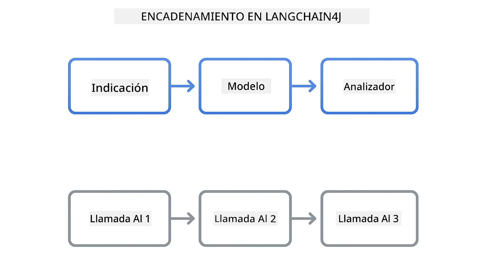
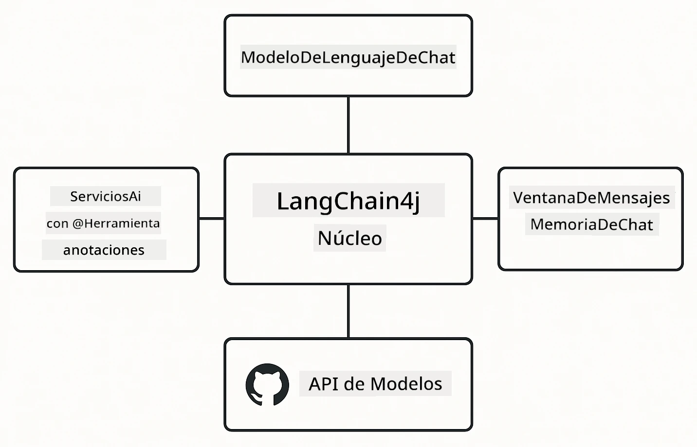

# Módulo 00: Inicio Rápido

## Tabla de Contenidos

- [Introducción](../../../00-quick-start)
- [¿Qué es LangChain4j?](../../../00-quick-start)
- [Dependencias de LangChain4j](../../../00-quick-start)
- [Requisitos Previos](../../../00-quick-start)
- [Configuración](../../../00-quick-start)
  - [1. Obtén Tu Token de GitHub](../../../00-quick-start)
  - [2. Establece Tu Token](../../../00-quick-start)
- [Ejecuta los Ejemplos](../../../00-quick-start)
  - [1. Chat Básico](../../../00-quick-start)
  - [2. Patrones de Prompt](../../../00-quick-start)
  - [3. Llamadas a Funciones](../../../00-quick-start)
  - [4. Preguntas y Respuestas de Documentos (RAG)](../../../00-quick-start)
  - [5. IA Responsable](../../../00-quick-start)
- [Qué Muestra Cada Ejemplo](../../../00-quick-start)
- [Próximos Pasos](../../../00-quick-start)
- [Solución de Problemas](../../../00-quick-start)

## Introducción

Este inicio rápido está diseñado para que comiences a usar LangChain4j lo más pronto posible. Cubre lo básico absoluto para construir aplicaciones de IA con LangChain4j y GitHub Models. En los próximos módulos usarás Azure OpenAI con LangChain4j para crear aplicaciones más avanzadas.

## ¿Qué es LangChain4j?

LangChain4j es una biblioteca de Java que simplifica la construcción de aplicaciones potenciadas por IA. En lugar de lidiar con clientes HTTP y análisis JSON, trabajas con APIs limpias en Java.

La "cadena" en LangChain se refiere a encadenar múltiples componentes: puedes encadenar un prompt a un modelo y después a un analizador, o encadenar múltiples llamadas IA donde una salida alimenta la siguiente entrada. Este inicio rápido se enfoca en los fundamentos antes de explorar cadenas más complejas.



*Componentes encadenados en LangChain4j: bloques de construcción conectados para crear flujos de trabajo de IA poderosos*

Usaremos tres componentes principales:

**ChatLanguageModel** - La interfaz para interacciones con modelos de IA. Llama a `model.chat("prompt")` y obtén una cadena de respuesta. Usamos `OpenAiOfficialChatModel` que funciona con puntos finales compatibles con OpenAI como GitHub Models.

**AiServices** - Crea interfaces de servicio IA tipo-seguro. Define métodos, anótalos con `@Tool`, y LangChain4j maneja la orquestación. La IA llama automáticamente tus métodos Java cuando es necesario.

**MessageWindowChatMemory** - Mantiene el historial de conversación. Sin esto, cada petición es independiente. Con esto, la IA recuerda mensajes previos y mantiene el contexto en múltiples turnos.



*Arquitectura de LangChain4j: componentes centrales trabajando juntos para potenciar tus aplicaciones de IA*

## Dependencias de LangChain4j

Este inicio rápido utiliza dos dependencias Maven en el [`pom.xml`](../../../00-quick-start/pom.xml):

```xml
<!-- Core LangChain4j library -->
<dependency>
    <groupId>dev.langchain4j</groupId>
    <artifactId>langchain4j</artifactId> <!-- Inherited from BOM in root pom.xml -->
</dependency>

<!-- OpenAI integration (works with GitHub Models) -->
<dependency>
    <groupId>dev.langchain4j</groupId>
    <artifactId>langchain4j-open-ai-official</artifactId> <!-- Inherited from BOM in root pom.xml -->
</dependency>
```

El módulo `langchain4j-open-ai-official` provee la clase `OpenAiOfficialChatModel` que se conecta a APIs compatibles con OpenAI. GitHub Models usa el mismo formato de API, así que no se necesita un adaptador especial – solo apunta la URL base a `https://models.github.ai/inference`.

## Requisitos Previos

**¿Usando el Contenedor de Desarrollo?** Java y Maven ya están instalados. Solo necesitas un Token de Acceso Personal de GitHub.

**Desarrollo Local:**
- Java 21+, Maven 3.9+
- Token de Acceso Personal de GitHub (instrucciones abajo)

> **Nota:** Este módulo usa `gpt-4.1-nano` de GitHub Models. No modifiques el nombre del modelo en el código, está configurado para funcionar con los modelos disponibles en GitHub.

## Configuración

### 1. Obtén Tu Token de GitHub

1. Ve a [Configuración de GitHub → Tokens de Acceso Personal](https://github.com/settings/personal-access-tokens)
2. Haz clic en "Generate new token" (Generar nuevo token)
3. Pon un nombre descriptivo (p.ej., "Demo LangChain4j")
4. Establece la expiración (se recomiendan 7 días)
5. Bajo "Permisos de la cuenta", busca "Models" y ponlo en "Solo lectura"
6. Haz clic en "Generate token"
7. Copia y guarda tu token: no lo verás de nuevo

### 2. Establece Tu Token

**Opción 1: Usando VS Code (Recomendado)**

Si usas VS Code, añade tu token al archivo `.env` en la raíz del proyecto:

Si el archivo `.env` no existe, copia `.env.example` a `.env` o crea un archivo `.env` nuevo en la raíz del proyecto.

**Ejemplo de archivo `.env`:**
```bash
# En /workspaces/LangChain4j-for-Beginners/.env
GITHUB_TOKEN=your_token_here
```

Luego puedes hacer clic derecho en cualquier archivo demo (ej., `BasicChatDemo.java`) en el Explorador y seleccionar **"Run Java"** o usar las configuraciones de lanzamiento en el panel de Ejecutar y Depurar.

**Opción 2: Usando Terminal**

Establece el token como variable de entorno:

**Bash:**
```bash
export GITHUB_TOKEN=your_token_here
```

**PowerShell:**
```powershell
$env:GITHUB_TOKEN=your_token_here
```

## Ejecuta los Ejemplos

**Usando VS Code:** Simplemente haz clic derecho en cualquier archivo demo en el Explorador y selecciona **"Run Java"**, o usa las configuraciones de lanzamiento en el panel Ejecutar y Depurar (asegúrate de haber añadido tu token al archivo `.env` primero).

**Usando Maven:** Alternativamente, puedes ejecutar desde línea de comandos:

### 1. Chat Básico

**Bash:**
```bash
mvn compile exec:java -Dexec.mainClass=com.example.langchain4j.quickstart.BasicChatDemo
```

**PowerShell:**
```powershell
mvn --% compile exec:java -Dexec.mainClass=com.example.langchain4j.quickstart.BasicChatDemo
```

### 2. Patrones de Prompt

**Bash:**
```bash
mvn compile exec:java -Dexec.mainClass=com.example.langchain4j.quickstart.PromptEngineeringDemo
```

**PowerShell:**
```powershell
mvn --% compile exec:java -Dexec.mainClass=com.example.langchain4j.quickstart.PromptEngineeringDemo
```

Muestra prompting zero-shot, few-shot, cadena de pensamiento y basado en roles.

### 3. Llamadas a Funciones

**Bash:**
```bash
mvn compile exec:java -Dexec.mainClass=com.example.langchain4j.quickstart.ToolIntegrationDemo
```

**PowerShell:**
```powershell
mvn --% compile exec:java -Dexec.mainClass=com.example.langchain4j.quickstart.ToolIntegrationDemo
```

La IA llama automáticamente tus métodos Java cuando es necesario.

### 4. Preguntas y Respuestas de Documentos (RAG)

**Bash:**
```bash
mvn compile exec:java -Dexec.mainClass=com.example.langchain4j.quickstart.SimpleReaderDemo
```

**PowerShell:**
```powershell
mvn --% compile exec:java -Dexec.mainClass=com.example.langchain4j.quickstart.SimpleReaderDemo
```

Haz preguntas sobre el contenido en `document.txt`.

### 5. IA Responsable

**Bash:**
```bash
mvn compile exec:java -Dexec.mainClass=com.example.langchain4j.quickstart.ResponsibleAIDemo
```

**PowerShell:**
```powershell
mvn --% compile exec:java -Dexec.mainClass=com.example.langchain4j.quickstart.ResponsibleAIDemo
```

Muestra cómo los filtros de seguridad de IA bloquean contenido dañino.

## Qué Muestra Cada Ejemplo

**Chat Básico** - [BasicChatDemo.java](../../../00-quick-start/src/main/java/com/example/langchain4j/quickstart/BasicChatDemo.java)

Empieza aquí para ver LangChain4j en su forma más simple. Crearás un `OpenAiOfficialChatModel`, enviarás un prompt con `.chat()`, y recibirás una respuesta. Esto demuestra la base: cómo inicializar modelos con endpoints personalizados y claves API. Una vez entiendas este patrón, todo lo demás se construye sobre él.

```java
ChatLanguageModel model = OpenAiOfficialChatModel.builder()
    .baseUrl("https://models.github.ai/inference")
    .apiKey(System.getenv("GITHUB_TOKEN"))
    .modelName("gpt-4.1-nano")
    .build();

String response = model.chat("What is LangChain4j?");
System.out.println(response);
```

> **🤖 Prueba con [GitHub Copilot](https://github.com/features/copilot) Chat:** Abre [`BasicChatDemo.java`](../../../00-quick-start/src/main/java/com/example/langchain4j/quickstart/BasicChatDemo.java) y pregunta:
> - "¿Cómo cambiaría de GitHub Models a Azure OpenAI en este código?"
> - "¿Qué otros parámetros puedo configurar en OpenAiOfficialChatModel.builder()?"
> - "¿Cómo agrego respuestas en streaming en lugar de esperar la respuesta completa?"

**Ingeniería de Prompt** - [PromptEngineeringDemo.java](../../../00-quick-start/src/main/java/com/example/langchain4j/quickstart/PromptEngineeringDemo.java)

Ahora que sabes cómo hablar con un modelo, exploremos qué le dices. Este demo usa la misma configuración de modelo pero muestra cuatro patrones distintos de prompting. Prueba prompts zero-shot para instrucciones directas, few-shot que aprenden de ejemplos, cadena de pensamiento que revelan pasos de razonamiento, y prompts basados en roles que establecen contexto. Verás cómo el mismo modelo da resultados muy distintos según cómo formules tu solicitud.

```java
PromptTemplate template = PromptTemplate.from(
    "What's the best time to visit {{destination}} for {{activity}}?"
);

Prompt prompt = template.apply(Map.of(
    "destination", "Paris",
    "activity", "sightseeing"
));

String response = model.chat(prompt.text());
```

> **🤖 Prueba con [GitHub Copilot](https://github.com/features/copilot) Chat:** Abre [`PromptEngineeringDemo.java`](../../../00-quick-start/src/main/java/com/example/langchain4j/quickstart/PromptEngineeringDemo.java) y pregunta:
> - "¿Cuál es la diferencia entre prompting zero-shot y few-shot, y cuándo debería usar cada uno?"
> - "¿Cómo afecta el parámetro temperature las respuestas del modelo?"
> - "¿Qué técnicas existen para prevenir ataques de inyección de prompt en producción?"
> - "¿Cómo puedo crear objetos PromptTemplate reutilizables para patrones comunes?"

**Integración de Herramientas** - [ToolIntegrationDemo.java](../../../00-quick-start/src/main/java/com/example/langchain4j/quickstart/ToolIntegrationDemo.java)

Aquí es donde LangChain4j se vuelve poderoso. Usarás `AiServices` para crear un asistente IA que puede llamar a tus métodos Java. Solo anota métodos con `@Tool("descripcion")` y LangChain4j se encarga del resto: la IA decide automáticamente cuándo usar cada herramienta según lo que el usuario pregunte. Esto demuestra llamadas a funciones, una técnica clave para construir IA que puede actuar, no solo responder preguntas.

```java
@Tool("Performs addition of two numeric values")
public double add(double a, double b) {
    return a + b;
}

MathAssistant assistant = AiServices.create(MathAssistant.class, model);
String response = assistant.chat("What is 25 plus 17?");
```

> **🤖 Prueba con [GitHub Copilot](https://github.com/features/copilot) Chat:** Abre [`ToolIntegrationDemo.java`](../../../00-quick-start/src/main/java/com/example/langchain4j/quickstart/ToolIntegrationDemo.java) y pregunta:
> - "¿Cómo funciona la anotación @Tool y qué hace LangChain4j con ella internamente?"
> - "¿Puede la IA llamar a múltiples herramientas en secuencia para resolver problemas complejos?"
> - "¿Qué pasa si una herramienta lanza una excepción? ¿Cómo debo manejar errores?"
> - "¿Cómo integraría una API real en lugar de este ejemplo de calculadora?"

**Preguntas y Respuestas de Documentos (RAG)** - [SimpleReaderDemo.java](../../../00-quick-start/src/main/java/com/example/langchain4j/quickstart/SimpleReaderDemo.java)

Aquí verás la base de RAG (generación aumentada por recuperación). En lugar de depender de los datos de entrenamiento del modelo, cargas contenido desde [`document.txt`](../../../00-quick-start/document.txt) y lo incluyes en el prompt. La IA responde basada en tu documento, no en su conocimiento general. Este es el primer paso para construir sistemas que trabajan con tus propios datos.

```java
Document document = FileSystemDocumentLoader.loadDocument("document.txt");
String content = document.text();

String prompt = "Based on this document: " + content + 
                "\nQuestion: What is the main topic?";
String response = model.chat(prompt);
```

> **Nota:** Este enfoque simple carga el documento entero en el prompt. Para archivos grandes (>10KB), superarás límites de contexto. El Módulo 03 cubre fragmentación y búsqueda vectorial para sistemas RAG en producción.

> **🤖 Prueba con [GitHub Copilot](https://github.com/features/copilot) Chat:** Abre [`SimpleReaderDemo.java`](../../../00-quick-start/src/main/java/com/example/langchain4j/quickstart/SimpleReaderDemo.java) y pregunta:
> - "¿Cómo previene RAG las alucinaciones de IA comparado con usar los datos de entrenamiento del modelo?"
> - "¿Cuál es la diferencia entre este enfoque simple y usar embeddings vectoriales para recuperación?"
> - "¿Cómo escalaría esto para manejar múltiples documentos o bases de conocimiento más grandes?"
> - "¿Cuáles son las mejores prácticas para estructurar el prompt para asegurar que la IA use solo el contexto proporcionado?"

**IA Responsable** - [ResponsibleAIDemo.java](../../../00-quick-start/src/main/java/com/example/langchain4j/quickstart/ResponsibleAIDemo.java)

Construye seguridad en IA con defensa en profundidad. Este demo muestra dos capas de protección trabajando juntas:

**Parte 1: LangChain4j Input Guardrails** - Bloquea prompts peligrosos antes de llegar al LLM. Crea guardrails personalizados que revisan palabras clave o patrones prohibidos. Estos corren en tu código, por lo que son rápidos y gratuitos.

```java
class DangerousContentGuardrail implements InputGuardrail {
    @Override
    public InputGuardrailResult validate(UserMessage userMessage) {
        String text = userMessage.singleText().toLowerCase();
        if (text.contains("explosives")) {
            return fatal("Blocked: contains prohibited keyword");
        }
        return success();
    }
}
```

**Parte 2: Filtros de Seguridad del Proveedor** - GitHub Models tiene filtros incorporados que atrapan lo que tus guardrails puedan pasar por alto. Verás bloqueos estrictos (errores HTTP 400) para violaciones graves y rechazos suaves donde la IA rechaza amablemente.

> **🤖 Prueba con [GitHub Copilot](https://github.com/features/copilot) Chat:** Abre [`ResponsibleAIDemo.java`](../../../00-quick-start/src/main/java/com/example/langchain4j/quickstart/ResponsibleAIDemo.java) y pregunta:
> - "¿Qué es InputGuardrail y cómo creo la mía?"
> - "¿Cuál es la diferencia entre un bloqueo estricto y un rechazo suave?"
> - "¿Por qué usar tanto guardrails como filtros del proveedor juntos?"

## Próximos Pasos

**Siguiente Módulo:** [01-introducción - Comenzando con LangChain4j y gpt-5 en Azure](../01-introduction/README.md)

---

**Navegación:** [← Volver al Inicio](../README.md) | [Siguiente: Módulo 01 - Introducción →](../01-introduction/README.md)

---

## Solución de Problemas

### Primera Construcción con Maven

**Problema**: La compilación inicial `mvn clean compile` o `mvn package` tarda mucho (10-15 minutos)

**Causa**: Maven necesita descargar todas las dependencias del proyecto (Spring Boot, librerías LangChain4j, SDKs de Azure, etc.) en la primera compilación.

**Solución**: Este comportamiento es normal. Las compilaciones siguientes serán mucho más rápidas porque las dependencias se almacenan en caché localmente. El tiempo de descarga depende de tu velocidad de red.

### Sintaxis del Comando Maven en PowerShell

**Problema**: Los comandos Maven fallan con el error `Unknown lifecycle phase ".mainClass=..."`

**Causa**: PowerShell interpreta `=` como operador de asignación de variable, lo que rompe la sintaxis de propiedad de Maven.
**Solución**: Use el operador de parada de análisis `--%` antes del comando Maven:

**PowerShell:**
```powershell
mvn --% compile exec:java -Dexec.mainClass=com.example.langchain4j.quickstart.BasicChatDemo
```

**Bash:**
```bash
mvn compile exec:java -Dexec.mainClass=com.example.langchain4j.quickstart.BasicChatDemo
```

El operador `--%` indica a PowerShell que pase todos los argumentos restantes literalmente a Maven sin interpretación.

### Visualización de emojis en Windows PowerShell

**Problema**: Las respuestas de la IA muestran caracteres basura (por ejemplo, `????` o `â??`) en lugar de emojis en PowerShell

**Causa**: La codificación predeterminada de PowerShell no soporta emojis UTF-8

**Solución**: Ejecute este comando antes de ejecutar aplicaciones Java:
```cmd
chcp 65001
```

Esto fuerza la codificación UTF-8 en la terminal. Alternativamente, use Windows Terminal, que tiene mejor soporte para Unicode.

### Depuración de llamadas a la API

**Problema**: Errores de autenticación, límites de tasa, o respuestas inesperadas del modelo de IA

**Solución**: Los ejemplos incluyen `.logRequests(true)` y `.logResponses(true)` para mostrar las llamadas a la API en la consola. Esto ayuda a solucionar errores de autenticación, límites de tasa o respuestas inesperadas. Elimine estas opciones en producción para reducir el ruido en los registros.

---

<!-- CO-OP TRANSLATOR DISCLAIMER START -->
**Aviso Legal**:
Este documento ha sido traducido utilizando el servicio de traducción automática [Co-op Translator](https://github.com/Azure/co-op-translator). Aunque nos esforzamos por lograr precisión, tenga en cuenta que las traducciones automáticas pueden contener errores o inexactitudes. El documento original en su idioma nativo debe considerarse la fuente autorizada. Para información crítica, se recomienda una traducción profesional realizada por humanos. No nos hacemos responsables de malentendidos o interpretaciones erróneas derivadas del uso de esta traducción.
<!-- CO-OP TRANSLATOR DISCLAIMER END -->