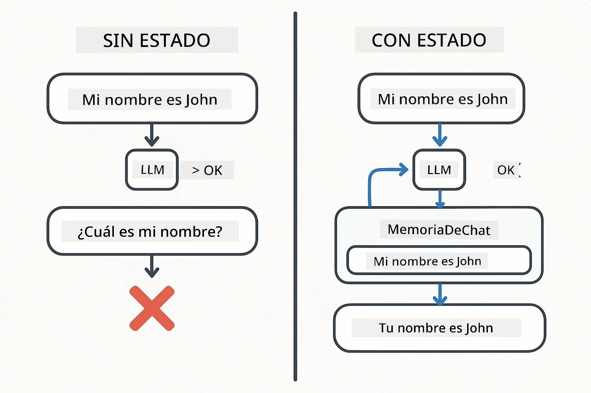
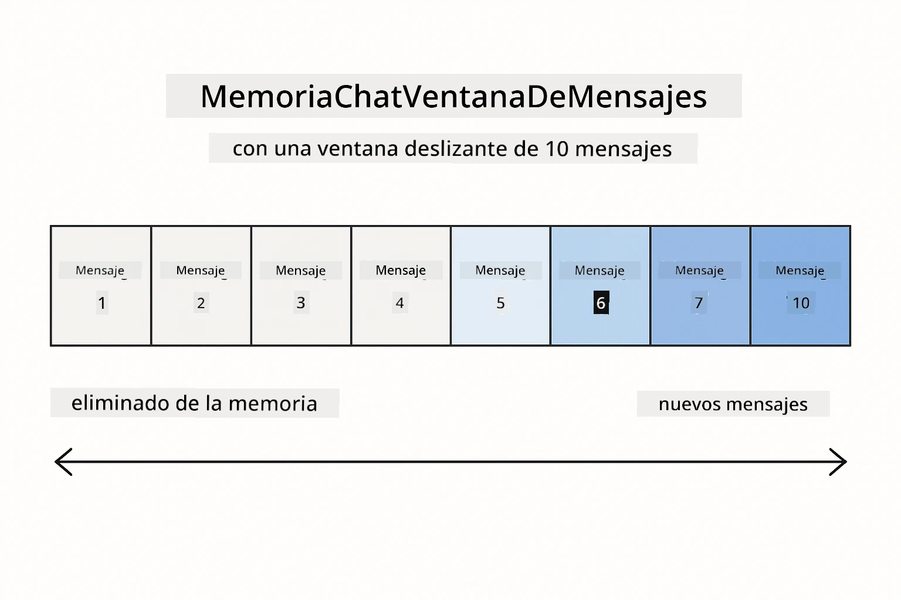
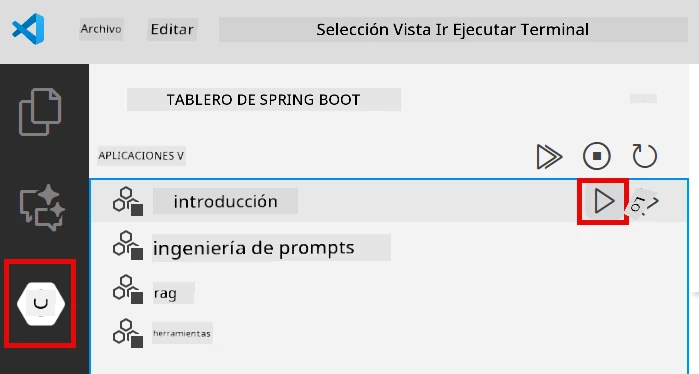
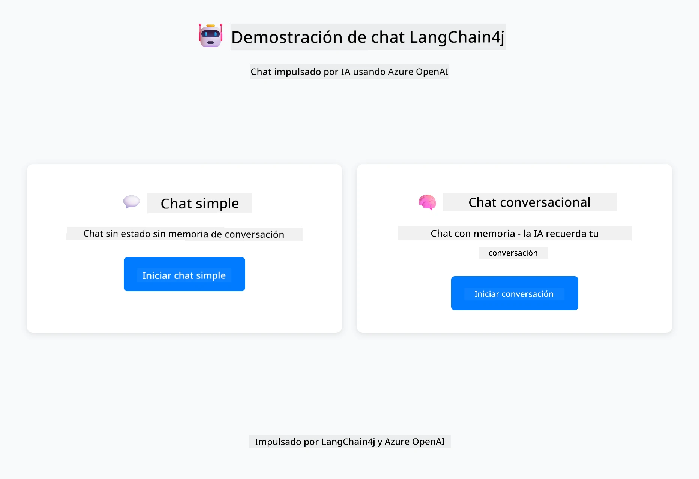
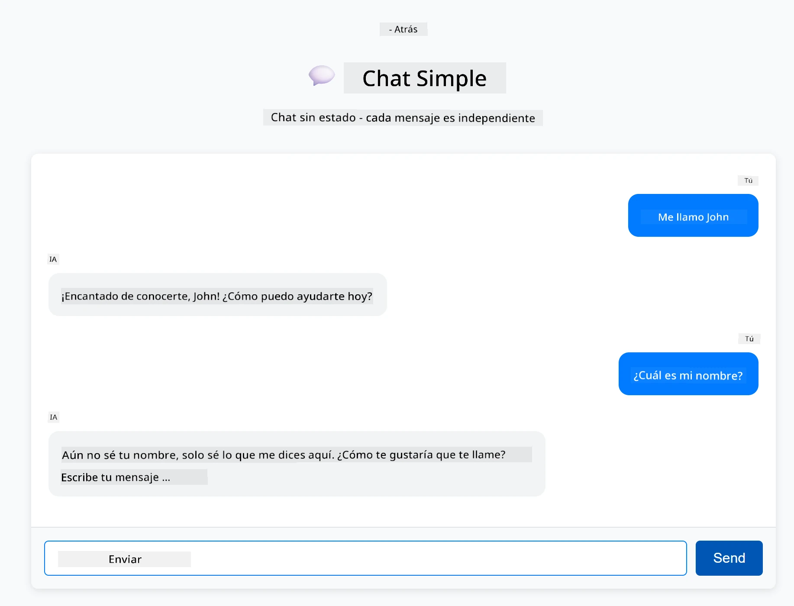
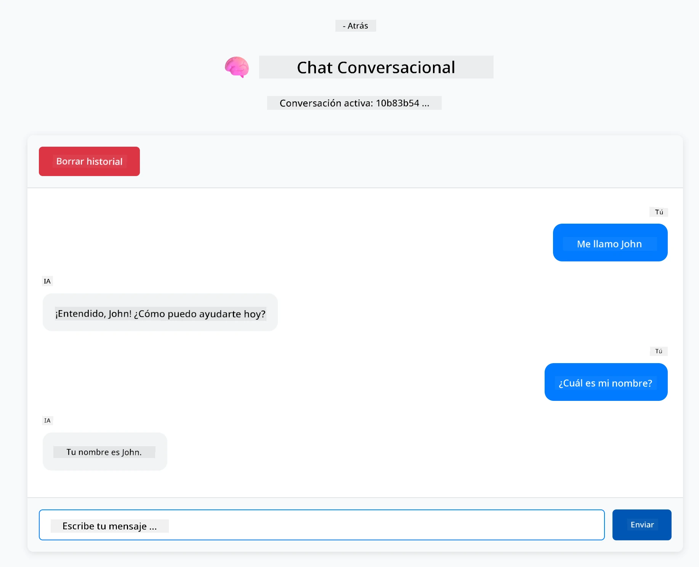

# Módulo 01: Introducción a LangChain4j

## Tabla de Contenidos

- [Video Tutorial](#video-tutorial)
- [Lo que Aprenderás](#lo-que-aprenderás)
- [Requisitos Previos](#requisitos-previos)
- [Comprendiendo el Problema Central](#comprendiendo-el-problema-central)
- [Comprendiendo los Tokens](#comprendiendo-los-tokens)
- [Cómo Funciona la Memoria](#cómo-funciona-la-memoria)
- [Cómo Esto Usa LangChain4j](#cómo-esto-usa-langchain4j)
- [Desplegar Infraestructura Azure OpenAI](#desplegar-infraestructura-azure-openai)
- [Ejecutar la Aplicación Localmente](#ejecutar-la-aplicación-localmente)
- [Usando la Aplicación](#usando-la-aplicación)
  - [Chat Sin Estado (Panel Izquierdo)](#chat-sin-estado-panel-izquierdo)
  - [Chat Con Estado (Panel Derecho)](#chat-con-estado-panel-derecho)
- [Próximos Pasos](#próximos-pasos)

## Video Tutorial

Mira esta sesión en vivo que explica cómo comenzar con este módulo:

<a href="https://www.youtube.com/live/nl_troDm8rQ?si=6b85S8xGjWnT2fX9"></a>

## Lo que Aprenderás

Este es tu punto de partida con LangChain4j y Azure OpenAI. Comenzamos con los fundamentos y empezamos a construir aplicaciones de estilo producción. Este módulo se centra en IA conversacional que recuerda el contexto y mantiene el estado — los conceptos fundamentales sobre los que se construyen todos los módulos posteriores.

Usaremos GPT-5.2 de Azure OpenAI a lo largo de esta guía porque sus capacidades avanzadas de razonamiento hacen que el comportamiento de diferentes patrones sea más evidente. Cuando agregas memoria, verás claramente la diferencia. Esto facilita entender qué aporta cada componente a tu aplicación.

Construirás una aplicación que demuestra ambos patrones:

**Chat Sin Estado** - Cada solicitud es independiente. El modelo no tiene memoria de mensajes anteriores. Este es el punto de partida más simple.

**Conversación Con Estado** - Cada solicitud incluye el historial de la conversación. El modelo mantiene el contexto a través de múltiples intercambios. Esto es lo que requieren las aplicaciones de producción.

## Requisitos Previos

- Suscripción Azure con acceso a Azure OpenAI
- Java 21, Maven 3.9+
- Azure CLI (https://learn.microsoft.com/en-us/cli/azure/install-azure-cli)
- Azure Developer CLI (azd) (https://learn.microsoft.com/en-us/azure/developer/azure-developer-cli/install-azd)

> **Nota:** Java, Maven, Azure CLI y Azure Developer CLI (azd) están preinstalados en el devcontainer proporcionado.

> **Nota:** Este módulo usa GPT-5.2 en Azure OpenAI. El despliegue se configura automáticamente mediante `azd up` - no modifiques el nombre del modelo en el código.

## Comprendiendo el Problema Central

Los modelos de lenguaje son sin estado. Cada llamada a la API es independiente. Si envías "Mi nombre es John" y luego preguntas "¿Cuál es mi nombre?", el modelo no tiene idea de que acabas de presentarte. Trata cada solicitud como si fuera la primera conversación que tienes.

Esto está bien para preguntas y respuestas simples, pero es inútil para aplicaciones reales. Los bots de atención al cliente necesitan recordar lo que les dijiste. Los asistentes personales necesitan contexto. Cualquier conversación con múltiples intercambios requiere memoria.

El siguiente diagrama contrasta los dos enfoques — a la izquierda, una llamada sin estado que olvida tu nombre; a la derecha, una llamada con estado respaldada por ChatMemory que lo recuerda.



*La diferencia entre conversaciones sin estado (llamadas independientes) y con estado (con conocimiento del contexto)*

## Comprendiendo los Tokens

Antes de profundizar en las conversaciones, es importante entender los tokens - las unidades básicas de texto que procesan los modelos de lenguaje:


*Ejemplo de cómo el texto se descompone en tokens - "¡Me encanta la IA!" se convierte en 4 unidades de procesamiento separadas*

Los tokens son cómo los modelos de IA miden y procesan texto. Las palabras, la puntuación e incluso los espacios pueden ser tokens. Tu modelo tiene un límite de cuántos tokens puede procesar a la vez (400,000 para GPT-5.2, con hasta 272,000 tokens de entrada y 128,000 tokens de salida). Entender los tokens te ayuda a manejar la longitud de la conversación y los costos.

## Cómo Funciona la Memoria

La memoria de chat resuelve el problema sin estado manteniendo el historial de la conversación. Antes de enviar tu solicitud al modelo, el framework antepone los mensajes previos relevantes. Cuando preguntas "¿Cuál es mi nombre?", el sistema envía en realidad todo el historial de la conversación, permitiendo que el modelo vea que previamente dijiste "Mi nombre es John."

LangChain4j provee implementaciones de memoria que manejan esto automáticamente. Tú eliges cuántos mensajes conservar y el framework gestiona la ventana de contexto. El diagrama a continuación muestra cómo MessageWindowChatMemory mantiene una ventana deslizante de mensajes recientes.



*MessageWindowChatMemory mantiene una ventana deslizante de mensajes recientes, descartando automáticamente los antiguos*

## Cómo Esto Usa LangChain4j

Este módulo integra Spring Boot y añade memoria de conversación. Así es como encajan las piezas:

**Dependencias** - Agrega dos librerías de LangChain4j:

```xml
<dependency>
    <groupId>dev.langchain4j</groupId>
    <artifactId>langchain4j</artifactId> <!-- Inherited from BOM in root pom.xml -->
</dependency>
<dependency>
    <groupId>dev.langchain4j</groupId>
    <artifactId>langchain4j-open-ai-official</artifactId> <!-- Inherited from BOM in root pom.xml -->
</dependency>
```

**Modelo de Chat** - Configura Azure OpenAI como un bean de Spring ([LangChainConfig.java](../../../01-introduction/src/main/java/com/example/langchain4j/config/LangChainConfig.java)):

```java
@Bean
public OpenAiOfficialChatModel openAiOfficialChatModel() {
    return OpenAiOfficialChatModel.builder()
            .baseUrl(azureEndpoint)
            .apiKey(azureApiKey)
            .modelName(deploymentName)
            .timeout(Duration.ofMinutes(5))
            .maxRetries(3)
            .build();
}
```

El builder lee las credenciales de variables de ambiente establecidas por `azd up`. Configurar `baseUrl` con tu endpoint de Azure hace que el cliente OpenAI funcione con Azure OpenAI.

**Memoria de Conversación** - Rastrea el historial del chat con MessageWindowChatMemory ([ConversationService.java](../../../01-introduction/src/main/java/com/example/langchain4j/service/ConversationService.java)):

```java
ChatMemory memory = MessageWindowChatMemory.withMaxMessages(10);

memory.add(UserMessage.from("My name is John"));
memory.add(AiMessage.from("Nice to meet you, John!"));

memory.add(UserMessage.from("What's my name?"));
AiMessage aiMessage = chatModel.chat(memory.messages()).aiMessage();
memory.add(aiMessage);
```

Crea la memoria con `withMaxMessages(10)` para conservar los últimos 10 mensajes. Añade mensajes de usuario y AI con wrappers tipados: `UserMessage.from(text)` y `AiMessage.from(text)`. Recupera el historial con `memory.messages()` y envíalo al modelo. El servicio almacena instancias de memoria separadas por ID de conversación, permitiendo que múltiples usuarios chateen simultáneamente.

> **🤖 Prueba con [GitHub Copilot](https://github.com/features/copilot) Chat:** Abre [`ConversationService.java`](../../../01-introduction/src/main/java/com/example/langchain4j/service/ConversationService.java) y pregunta:
> - "¿Cómo decide MessageWindowChatMemory qué mensajes descartar cuando la ventana está llena?"
> - "¿Puedo implementar almacenamiento de memoria personalizado usando una base de datos en lugar de memoria en RAM?"
> - "¿Cómo añadiría resumen para comprimir el historial antiguo de la conversación?"

El endpoint de chat sin estado omite la memoria por completo - sólo `chatModel.chat(prompt)` como en el inicio rápido. El endpoint con estado añade mensajes a la memoria, recupera el historial e incluye ese contexto en cada solicitud. Mismo modelo, diferentes patrones.

## Desplegar Infraestructura Azure OpenAI

**Bash:**
```bash
cd 01-introduction
azd up  # Seleccione la suscripción y la ubicación (se recomienda eastus2)
```

**PowerShell:**
```powershell
cd 01-introduction
azd up  # Seleccione la suscripción y la ubicación (se recomienda eastus2)
```

> **Nota:** Si encuentras un error de timeout (`RequestConflict: Cannot modify resource ... provisioning state is not terminal`), simplemente ejecuta `azd up` nuevamente. Los recursos de Azure pueden estar todavía en provisión en segundo plano, y reintentar permite que el despliegue se complete una vez que los recursos alcanzan un estado terminal.

Esto hará:
1. Desplegar el recurso Azure OpenAI con los modelos GPT-5.2 y text-embedding-3-small
2. Generar automáticamente el archivo `.env` en la raíz del proyecto con las credenciales
3. Configurar todas las variables de entorno necesarias

**¿Tienes problemas con el despliegue?** Revisa el [README de Infraestructura](infra/README.md) para resolución detallada de conflictos con nombres de subdominios, pasos manuales para despliegue en Azure Portal y guía de configuración de modelos.

**Verifica que el despliegue haya sido exitoso:**

**Bash:**
```bash
cat ../.env  # Debe mostrar AZURE_OPENAI_ENDPOINT, API_KEY, etc.
```

**PowerShell:**
```powershell
Get-Content ..\.env  # Debe mostrar AZURE_OPENAI_ENDPOINT, API_KEY, etc.
```

> **Nota:** El comando `azd up` genera automáticamente el archivo `.env`. Si necesitas actualizarlo más tarde, puedes editar el archivo `.env` manualmente o regenerarlo ejecutando:
>
> **Bash:**
> ```bash
> cd ..
> bash .azd-env.sh
> ```
>
> **PowerShell:**
> ```powershell
> cd ..
> .\.azd-env.ps1
> ```

## Ejecutar la Aplicación Localmente

**Verifica el despliegue:**

Asegúrate de que el archivo `.env` exista en el directorio raíz con las credenciales de Azure. Ejecuta esto desde el directorio del módulo (`01-introduction/`):

**Bash:**
```bash
cat ../.env  # Debe mostrar AZURE_OPENAI_ENDPOINT, API_KEY, DEPLOYMENT
```

**PowerShell:**
```powershell
Get-Content ..\.env  # Debe mostrar AZURE_OPENAI_ENDPOINT, API_KEY, DEPLOYMENT
```

**Inicia las aplicaciones:**

**Opción 1: Usando Spring Boot Dashboard (Recomendado para usuarios de VS Code)**

El contenedor de desarrollo incluye la extensión Spring Boot Dashboard, que provee una interfaz visual para manejar todas las aplicaciones Spring Boot. Puedes encontrarlo en la Barra de Actividad al lado izquierdo de VS Code (busca el ícono de Spring Boot).

Desde Spring Boot Dashboard puedes:
- Ver todas las aplicaciones Spring Boot disponibles en el espacio de trabajo
- Iniciar/detener aplicaciones con un clic
- Ver logs de aplicación en tiempo real
- Monitorear el estado de la aplicación

Simplemente haz clic en el botón de play al lado de "introduction" para iniciar este módulo, o inicia todos los módulos a la vez.



*El Spring Boot Dashboard en VS Code — inicia, detén y monitorea todos los módulos desde un solo lugar*

**Opción 2: Usando scripts shell**

Inicia todas las aplicaciones web (módulos 01-04):

**Bash:**
```bash
cd ..  # Desde el directorio raíz
./start-all.sh
```

**PowerShell:**
```powershell
cd ..  # Desde el directorio raíz
.\start-all.ps1
```

O inicia sólo este módulo:

**Bash:**
```bash
cd 01-introduction
./start.sh
```

**PowerShell:**
```powershell
cd 01-introduction
.\start.ps1
```

Ambos scripts cargan automáticamente variables de entorno desde el archivo `.env` raíz y construirán los JARs si no existen.

> **Nota:** Si prefieres construir todos los módulos manualmente antes de iniciar:
>
> **Bash:**
> ```bash
> cd ..  # Go to root directory
> mvn clean package -DskipTests
> ```
>
> **PowerShell:**
> ```powershell
> cd ..  # Go to root directory
> mvn clean package -DskipTests
> ```

Abre http://localhost:8080 en tu navegador.

**Para detener la aplicación:**

**Bash:**
```bash
./stop.sh  # Solo este módulo
# O
cd .. && ./stop-all.sh  # Todos los módulos
```

**PowerShell:**
```powershell
.\stop.ps1  # Solo este módulo
# O
cd ..; .\stop-all.ps1  # Todos los módulos
```

## Usando la Aplicación

La aplicación provee una interfaz web con dos implementaciones de chat lado a lado.



*Panel que muestra opciones de Chat Simple (sin estado) y Chat Conversacional (con estado)*

### Chat Sin Estado (Panel Izquierdo)

Prueba esto primero. Di "Mi nombre es John" y luego inmediatamente pregunta "¿Cuál es mi nombre?" El modelo no lo recordará porque cada mensaje es independiente. Esto demuestra el problema central con la integración básica de modelos de lenguaje - sin contexto de conversación.



*La IA no recuerda tu nombre del mensaje anterior*

### Chat Con Estado (Panel Derecho)

Ahora intenta la misma secuencia aquí. Di "Mi nombre es John" y luego "¿Cuál es mi nombre?" Esta vez lo recuerda. La diferencia es MessageWindowChatMemory - mantiene el historial de la conversación e incluye ese contexto en cada solicitud. Así funciona la IA conversacional en producción.



*La IA recuerda tu nombre de la conversación anterior*

Ambos paneles usan el mismo modelo GPT-5.2. La única diferencia es la memoria. Esto hace claro qué aporta la memoria a tu aplicación y por qué es esencial para casos de uso reales.

## Próximos Pasos

**Siguiente Módulo:** [02-prompt-engineering - Ingeniería de Prompts con GPT-5.2](../02-prompt-engineering/README.md)

---

**Navegación:** [← Volver al Principal](../README.md) | [Siguiente: Módulo 02 - Ingeniería de Prompts →](../02-prompt-engineering/README.md)

---

<!-- CO-OP TRANSLATOR DISCLAIMER START -->
**Descargo de responsabilidad**:
Este documento ha sido traducido utilizando el servicio de traducción automática [Co-op Translator](https://github.com/Azure/co-op-translator). Aunque nos esforzamos por la precisión, tenga en cuenta que las traducciones automatizadas pueden contener errores o inexactitudes. El documento original en su idioma nativo debe considerarse la fuente autorizada. Para información crítica, se recomienda una traducción profesional humana. No somos responsables de cualquier malentendido o interpretación errónea que surja del uso de esta traducción.
<!-- CO-OP TRANSLATOR DISCLAIMER END -->