# Módulo 02: Ingeniería de Prompts con GPT-5

## Tabla de Contenidos

- [Lo que Aprenderás](../../../02-prompt-engineering)
- [Prerrequisitos](../../../02-prompt-engineering)
- [Entendiendo la Ingeniería de Prompts](../../../02-prompt-engineering)
- [Cómo Esto Usa LangChain4j](../../../02-prompt-engineering)
- [Los Patrones Clave](../../../02-prompt-engineering)
- [Usando Recursos Existentes de Azure](../../../02-prompt-engineering)
- [Capturas de Pantalla de la Aplicación](../../../02-prompt-engineering)
- [Explorando los Patrones](../../../02-prompt-engineering)
  - [Baja vs Alta Disposición](../../../02-prompt-engineering)
  - [Ejecución de Tareas (Preámbulos de Herramientas)](../../../02-prompt-engineering)
  - [Código Auto-Reflexivo](../../../02-prompt-engineering)
  - [Análisis Estructurado](../../../02-prompt-engineering)
  - [Chat Multi-Turno](../../../02-prompt-engineering)
  - [Razonamiento Paso a Paso](../../../02-prompt-engineering)
  - [Salida Restringida](../../../02-prompt-engineering)
- [Lo que Realmente Estás Aprendiendo](../../../02-prompt-engineering)
- [Próximos Pasos](../../../02-prompt-engineering)

## Lo que Aprenderás

En el módulo anterior, viste cómo la memoria habilita la IA conversacional y usaste Modelos de GitHub para interacciones básicas. Ahora nos enfocaremos en cómo haces preguntas - los prompts en sí - usando GPT-5 de Azure OpenAI. La forma en que estructuras tus prompts afecta dramáticamente la calidad de las respuestas que obtienes.

Usaremos GPT-5 porque introduce control de razonamiento - puedes indicarle al modelo cuánto debe pensar antes de responder. Esto hace que las diferentes estrategias de prompting sean más evidentes y te ayuda a entender cuándo usar cada enfoque. También nos beneficiaremos de los límites de tasa más bajos de Azure para GPT-5 en comparación con los Modelos de GitHub.

## Prerrequisitos

- Haber completado el Módulo 01 (recursos de Azure OpenAI desplegados)
- Archivo `.env` en el directorio raíz con credenciales de Azure (creado por `azd up` en el Módulo 01)

> **Nota:** Si no has completado el Módulo 01, sigue primero las instrucciones de despliegue allí.

## Entendiendo la Ingeniería de Prompts

La ingeniería de prompts consiste en diseñar texto de entrada que consistentemente te dé los resultados que necesitas. No se trata solo de hacer preguntas, sino de estructurar las solicitudes para que el modelo entienda exactamente qué quieres y cómo entregarlo.

Piénsalo como dar instrucciones a un colega. "Arregla el error" es vago. "Arregla la excepción de puntero nulo en UserService.java línea 45 añadiendo una verificación de nulo" es específico. Los modelos de lenguaje funcionan igual: la especificidad y la estructura importan.

## Cómo Esto Usa LangChain4j

Este módulo demuestra patrones avanzados de prompting usando la misma base de LangChain4j de módulos anteriores, con un enfoque en la estructura del prompt y el control del razonamiento.

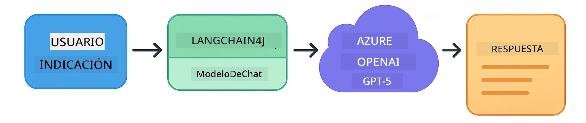

*Cómo LangChain4j conecta tus prompts con Azure OpenAI GPT-5*

**Dependencias** - El Módulo 02 usa las siguientes dependencias de langchain4j definidas en `pom.xml`:
```xml
<dependency>
    <groupId>dev.langchain4j</groupId>
    <artifactId>langchain4j</artifactId> <!-- Inherited from BOM in root pom.xml -->
</dependency>
<dependency>
    <groupId>dev.langchain4j</groupId>
    <artifactId>langchain4j-open-ai-official</artifactId> <!-- Inherited from BOM in root pom.xml -->
</dependency>
```

**Configuración de OpenAiOfficialChatModel** - [LangChainConfig.java](../../../02-prompt-engineering/src/main/java/com/example/langchain4j/prompts/config/LangChainConfig.java)

El modelo de chat se configura manualmente como un bean de Spring usando el cliente oficial de OpenAI, que soporta endpoints de Azure OpenAI. La diferencia clave con el Módulo 01 es cómo estructuramos los prompts enviados a `chatModel.chat()`, no la configuración del modelo en sí.

**Mensajes de Sistema y Usuario** - [Gpt5PromptService.java](../../../02-prompt-engineering/src/main/java/com/example/langchain4j/prompts/service/Gpt5PromptService.java)

LangChain4j separa los tipos de mensajes para mayor claridad. `SystemMessage` establece el comportamiento y contexto de la IA (como "Eres un revisor de código"), mientras que `UserMessage` contiene la solicitud real. Esta separación permite mantener un comportamiento consistente de la IA a través de diferentes consultas de usuario.

```java
SystemMessage systemMsg = SystemMessage.from(
    "You are a helpful Java programming expert."
);

UserMessage userMsg = UserMessage.from(
    "Explain what a List is in Java"
);

String response = chatModel.chat(systemMsg, userMsg);
```

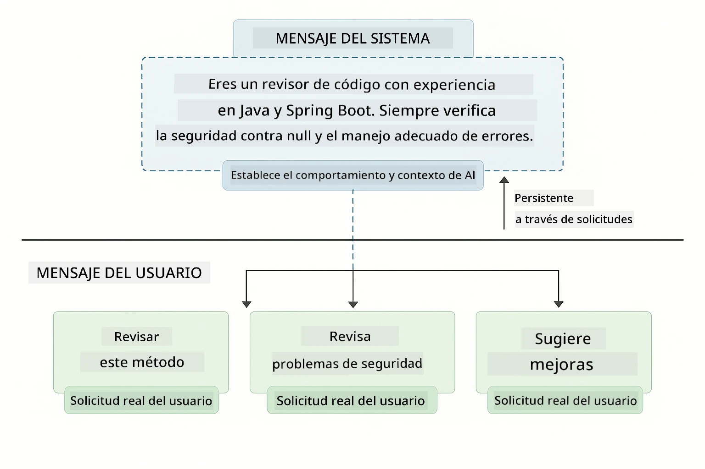

*SystemMessage proporciona contexto persistente mientras UserMessages contienen solicitudes individuales*

**MessageWindowChatMemory para Multi-Turno** - Para el patrón de conversación multi-turno, reutilizamos `MessageWindowChatMemory` del Módulo 01. Cada sesión obtiene su propia instancia de memoria almacenada en un `Map<String, ChatMemory>`, permitiendo múltiples conversaciones concurrentes sin mezclar contexto.

**Plantillas de Prompt** - El verdadero enfoque aquí es la ingeniería de prompts, no nuevas APIs de LangChain4j. Cada patrón (baja disposición, alta disposición, ejecución de tareas, etc.) usa el mismo método `chatModel.chat(prompt)` pero con cadenas de prompt cuidadosamente estructuradas. Las etiquetas XML, instrucciones y formato son parte del texto del prompt, no características de LangChain4j.

**Control de Razonamiento** - El esfuerzo de razonamiento de GPT-5 se controla mediante instrucciones en el prompt como "máximo 2 pasos de razonamiento" o "explora a fondo". Estas son técnicas de ingeniería de prompts, no configuraciones de LangChain4j. La librería simplemente entrega tus prompts al modelo.

La conclusión clave: LangChain4j provee la infraestructura (conexión al modelo vía [LangChainConfig.java](../../../02-prompt-engineering/src/main/java/com/example/langchain4j/prompts/config/LangChainConfig.java), memoria, manejo de mensajes vía [Gpt5PromptService.java](../../../02-prompt-engineering/src/main/java/com/example/langchain4j/prompts/service/Gpt5PromptService.java)), mientras que este módulo te enseña cómo crear prompts efectivos dentro de esa infraestructura.

## Los Patrones Clave

No todos los problemas necesitan el mismo enfoque. Algunas preguntas requieren respuestas rápidas, otras un pensamiento profundo. Algunas necesitan razonamiento visible, otras solo resultados. Este módulo cubre ocho patrones de prompting, cada uno optimizado para diferentes escenarios. Experimentarás con todos para aprender cuándo funciona mejor cada enfoque.

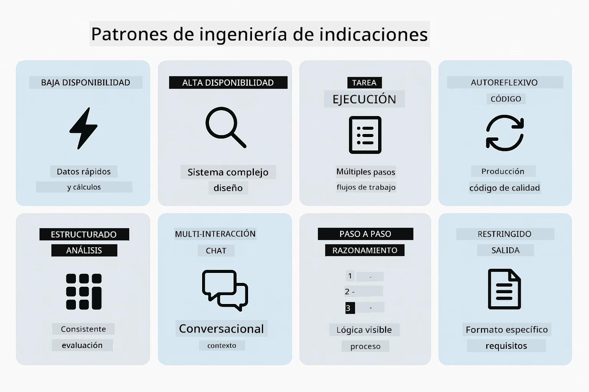

*Resumen de los ocho patrones de ingeniería de prompts y sus casos de uso*

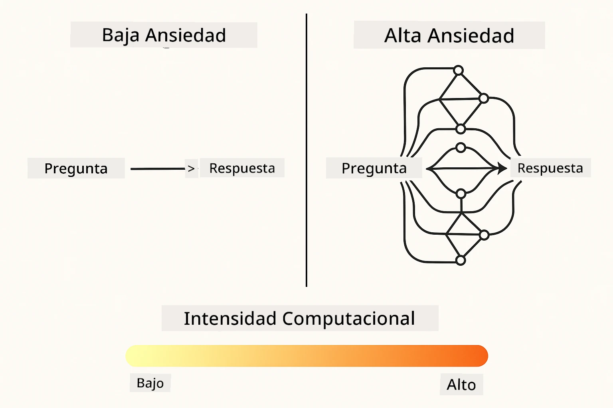

*Disposición baja (rápido, directo) vs disposición alta (exhaustivo, exploratorio) en enfoques de razonamiento*

**Baja Disposición (Rápido y Enfocado)** - Para preguntas simples donde quieres respuestas rápidas y directas. El modelo hace un razonamiento mínimo - máximo 2 pasos. Úsalo para cálculos, búsquedas o preguntas directas.

```java
String prompt = """
    <reasoning_effort>low</reasoning_effort>
    <instruction>maximum 2 reasoning steps</instruction>
    
    What is 15% of 200?
    """;

String response = chatModel.chat(prompt);
```

> 💡 **Explora con GitHub Copilot:** Abre [`Gpt5PromptService.java`](../../../02-prompt-engineering/src/main/java/com/example/langchain4j/prompts/service/Gpt5PromptService.java) y pregunta:
> - "¿Cuál es la diferencia entre los patrones de prompting de baja disposición y alta disposición?"
> - "¿Cómo ayudan las etiquetas XML en los prompts a estructurar la respuesta de la IA?"
> - "¿Cuándo debería usar patrones de auto-reflexión vs instrucciones directas?"

**Alta Disposición (Profundo y Exhaustivo)** - Para problemas complejos donde quieres un análisis completo. El modelo explora a fondo y muestra razonamiento detallado. Úsalo para diseño de sistemas, decisiones de arquitectura o investigación compleja.

```java
String prompt = """
    <reasoning_effort>high</reasoning_effort>
    <instruction>explore thoroughly, show detailed reasoning</instruction>
    
    Design a caching strategy for a high-traffic REST API.
    """;

String response = chatModel.chat(prompt);
```

**Ejecución de Tareas (Progreso Paso a Paso)** - Para flujos de trabajo de múltiples pasos. El modelo provee un plan inicial, narra cada paso mientras trabaja, luego da un resumen. Úsalo para migraciones, implementaciones o cualquier proceso multi-paso.

```java
String prompt = """
    <task>Create a REST endpoint for user registration</task>
    <preamble>Provide an upfront plan</preamble>
    <narration>Narrate each step as you work</narration>
    <summary>Summarize what was accomplished</summary>
    """;

String response = chatModel.chat(prompt);
```

El prompting de Cadena de Pensamiento (Chain-of-Thought) pide explícitamente al modelo mostrar su proceso de razonamiento, mejorando la precisión en tareas complejas. El desglose paso a paso ayuda tanto a humanos como a la IA a entender la lógica.

> **🤖 Prueba con [GitHub Copilot](https://github.com/features/copilot) Chat:** Pregunta sobre este patrón:
> - "¿Cómo adaptaría el patrón de ejecución de tareas para operaciones de larga duración?"
> - "¿Cuáles son las mejores prácticas para estructurar preámbulos de herramientas en aplicaciones de producción?"
> - "¿Cómo puedo capturar y mostrar actualizaciones de progreso intermedias en una interfaz de usuario?"

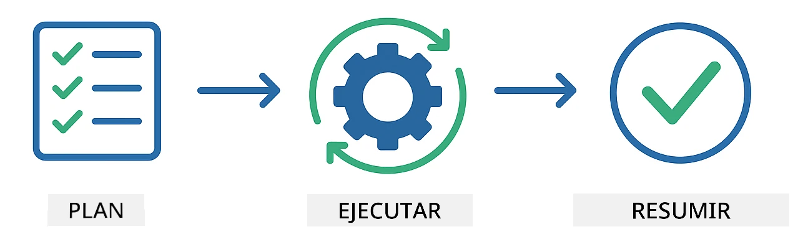

*Flujo Planificar → Ejecutar → Resumir para tareas multi-paso*

**Código Auto-Reflexivo** - Para generar código de calidad de producción. El modelo genera código, lo verifica contra criterios de calidad y lo mejora iterativamente. Úsalo al construir nuevas funcionalidades o servicios.

```java
String prompt = """
    <task>Create an email validation service</task>
    <quality_criteria>
    - Correct logic and error handling
    - Best practices (clean code, proper naming)
    - Performance optimization
    - Security considerations
    </quality_criteria>
    <instruction>Generate code, evaluate against criteria, improve iteratively</instruction>
    """;

String response = chatModel.chat(prompt);
```

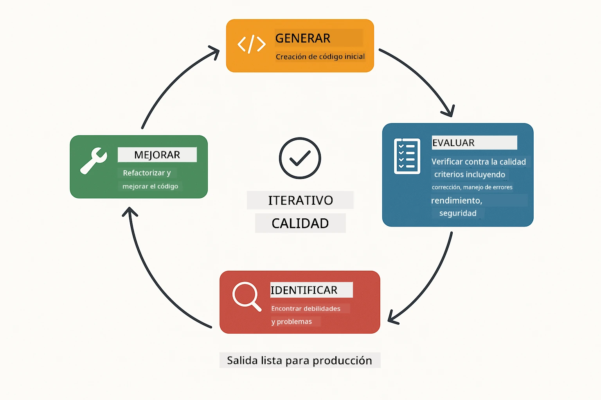

*Ciclo de mejora iterativa - generar, evaluar, identificar problemas, mejorar, repetir*

**Análisis Estructurado** - Para evaluaciones consistentes. El modelo revisa código usando un marco fijo (corrección, prácticas, rendimiento, seguridad). Úsalo para revisiones de código o evaluaciones de calidad.

```java
String prompt = """
    <code>
    public List getUsers() {
        return database.query("SELECT * FROM users");
    }
    </code>
    
    <framework>
    Evaluate using these categories:
    1. Correctness - Logic and functionality
    2. Best Practices - Code quality
    3. Performance - Efficiency concerns
    4. Security - Vulnerabilities
    </framework>
    """;

String response = chatModel.chat(prompt);
```

> **🤖 Prueba con [GitHub Copilot](https://github.com/features/copilot) Chat:** Pregunta sobre análisis estructurado:
> - "¿Cómo puedo personalizar el marco de análisis para diferentes tipos de revisiones de código?"
> - "¿Cuál es la mejor forma de analizar y actuar sobre salidas estructuradas programáticamente?"
> - "¿Cómo aseguro niveles de severidad consistentes en diferentes sesiones de revisión?"

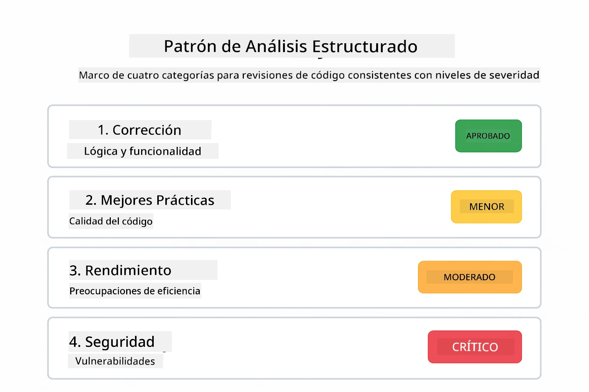

*Marco de cuatro categorías para revisiones de código consistentes con niveles de severidad*

**Chat Multi-Turno** - Para conversaciones que necesitan contexto. El modelo recuerda mensajes previos y construye sobre ellos. Úsalo para sesiones de ayuda interactivas o preguntas y respuestas complejas.

```java
ChatMemory memory = MessageWindowChatMemory.withMaxMessages(10);

memory.add(UserMessage.from("What is Spring Boot?"));
AiMessage aiMessage1 = chatModel.chat(memory.messages()).aiMessage();
memory.add(aiMessage1);

memory.add(UserMessage.from("Show me an example"));
AiMessage aiMessage2 = chatModel.chat(memory.messages()).aiMessage();
memory.add(aiMessage2);
```

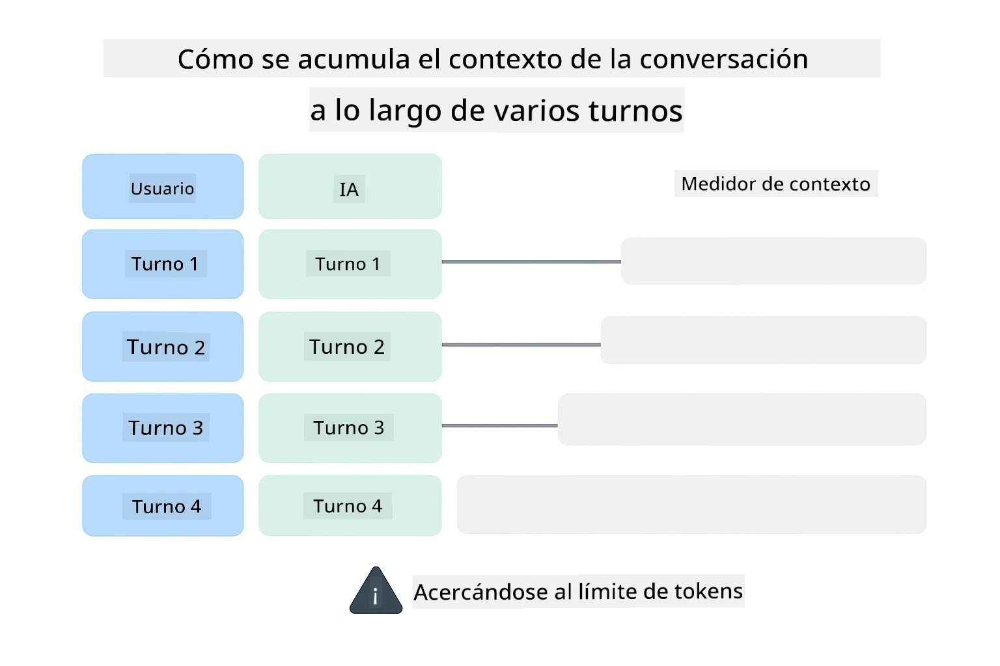

*Cómo el contexto de la conversación se acumula a lo largo de múltiples turnos hasta alcanzar el límite de tokens*

**Razonamiento Paso a Paso** - Para problemas que requieren lógica visible. El modelo muestra razonamiento explícito para cada paso. Úsalo para problemas matemáticos, acertijos lógicos o cuando necesitas entender el proceso de pensamiento.

```java
String prompt = """
    <instruction>Show your reasoning step-by-step</instruction>
    
    If a train travels 120 km in 2 hours, then stops for 30 minutes,
    then travels another 90 km in 1.5 hours, what is the average speed
    for the entire journey including the stop?
    """;

String response = chatModel.chat(prompt);
```

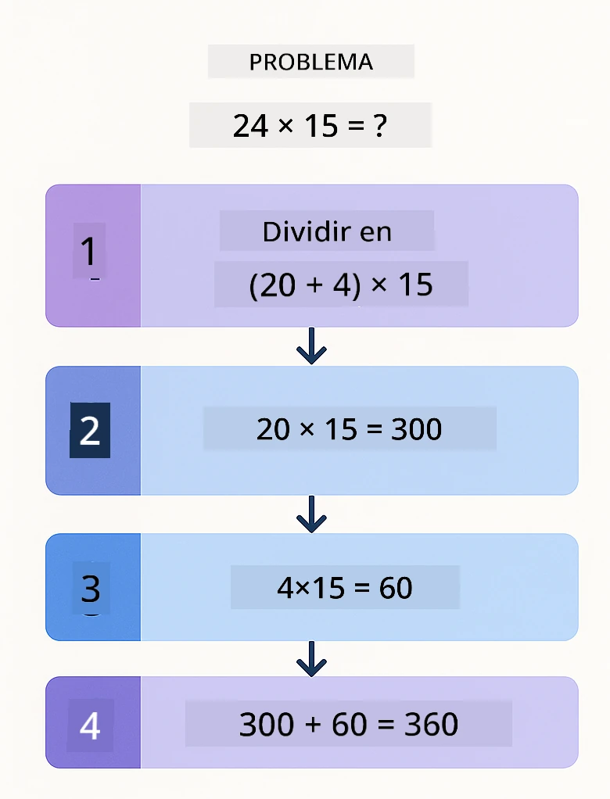

*Desglose de problemas en pasos lógicos explícitos*

**Salida Restringida** - Para respuestas con requisitos específicos de formato. El modelo sigue estrictamente reglas de formato y longitud. Úsalo para resúmenes o cuando necesitas una estructura de salida precisa.

```java
String prompt = """
    <constraints>
    - Exactly 100 words
    - Bullet point format
    - Technical terms only
    </constraints>
    
    Summarize the key concepts of machine learning.
    """;

String response = chatModel.chat(prompt);
```

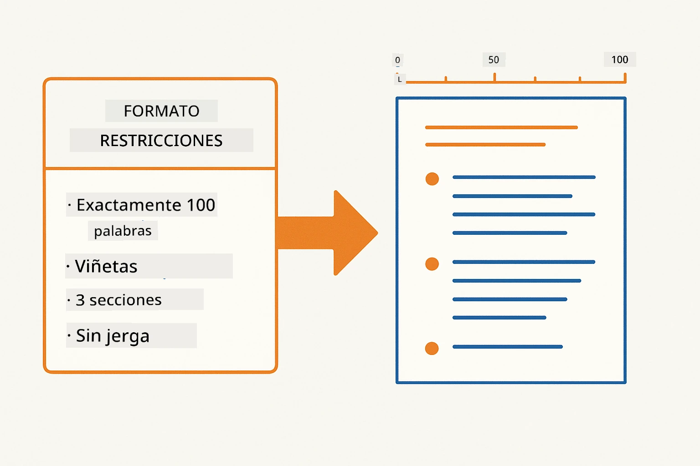

*Aplicando requisitos específicos de formato, longitud y estructura*

## Usando Recursos Existentes de Azure

**Verificar despliegue:**

Asegúrate de que el archivo `.env` exista en el directorio raíz con las credenciales de Azure (creado durante el Módulo 01):
```bash
cat ../.env  # Debe mostrar AZURE_OPENAI_ENDPOINT, API_KEY, DEPLOYMENT
```

**Iniciar la aplicación:**

> **Nota:** Si ya iniciaste todas las aplicaciones usando `./start-all.sh` del Módulo 01, este módulo ya está corriendo en el puerto 8083. Puedes saltarte los comandos de inicio a continuación e ir directamente a http://localhost:8083.

**Opción 1: Usando Spring Boot Dashboard (Recomendado para usuarios de VS Code)**

El contenedor de desarrollo incluye la extensión Spring Boot Dashboard, que provee una interfaz visual para gestionar todas las aplicaciones Spring Boot. La encontrarás en la Barra de Actividad a la izquierda de VS Code (busca el ícono de Spring Boot).

Desde el Spring Boot Dashboard puedes:
- Ver todas las aplicaciones Spring Boot disponibles en el espacio de trabajo
- Iniciar/detener aplicaciones con un solo clic
- Ver logs de la aplicación en tiempo real
- Monitorear el estado de la aplicación

Simplemente haz clic en el botón de play junto a "prompt-engineering" para iniciar este módulo, o inicia todos los módulos a la vez.

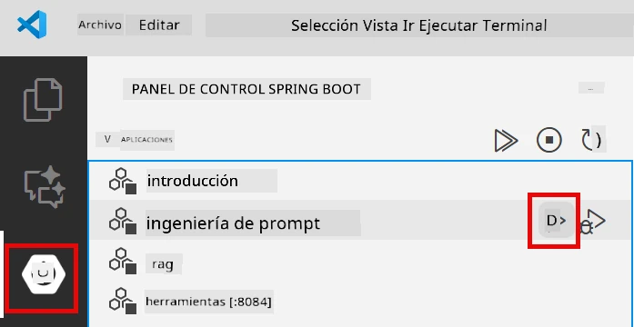

**Opción 2: Usando scripts de shell**

Inicia todas las aplicaciones web (módulos 01-04):

**Bash:**
```bash
cd ..  # Desde el directorio raíz
./start-all.sh
```

**PowerShell:**
```powershell
cd ..  # Desde el directorio raíz
.\start-all.ps1
```

O inicia solo este módulo:

**Bash:**
```bash
cd 02-prompt-engineering
./start.sh
```

**PowerShell:**
```powershell
cd 02-prompt-engineering
.\start.ps1
```

Ambos scripts cargan automáticamente las variables de entorno desde el archivo `.env` raíz y construirán los JARs si no existen.

> **Nota:** Si prefieres construir todos los módulos manualmente antes de iniciar:
>
> **Bash:**
> ```bash
> cd ..  # Go to root directory
> mvn clean package -DskipTests
> ```
>
> **PowerShell:**
> ```powershell
> cd ..  # Go to root directory
> mvn clean package -DskipTests
> ```

Abre http://localhost:8083 en tu navegador.

**Para detener:**

**Bash:**
```bash
./stop.sh  # Solo este módulo
# O
cd .. && ./stop-all.sh  # Todos los módulos
```

**PowerShell:**
```powershell
.\stop.ps1  # Solo este módulo
# O
cd ..; .\stop-all.ps1  # Todos los módulos
```

## Capturas de Pantalla de la Aplicación


*El panel principal mostrando los 8 patrones de ingeniería de prompts con sus características y casos de uso*

## Explorando los Patrones

La interfaz web te permite experimentar con diferentes estrategias de prompting. Cada patrón resuelve problemas distintos - pruébalos para ver cuándo brilla cada enfoque.

### Baja vs Alta Disposición

Haz una pregunta simple como "¿Cuál es el 15% de 200?" usando Baja Disposición. Obtendrás una respuesta instantánea y directa. Ahora haz algo complejo como "Diseña una estrategia de caché para una API de alto tráfico" usando Alta Disposición. Observa cómo el modelo se toma más tiempo y proporciona razonamiento detallado. Mismo modelo, misma estructura de pregunta - pero el prompt le indica cuánto debe pensar.

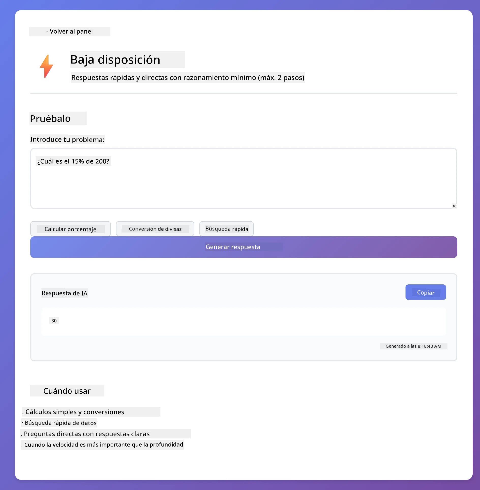
*Cálculo rápido con razonamiento mínimo*

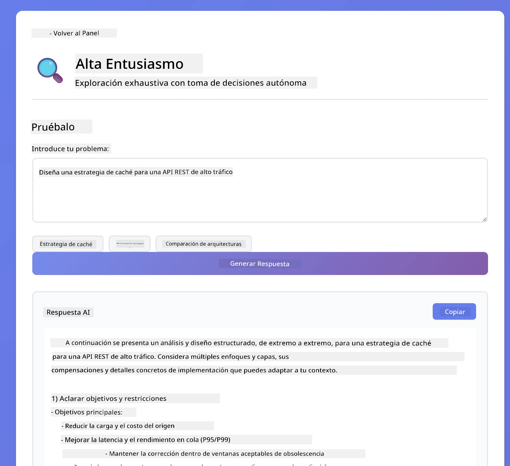

*Estrategia de almacenamiento en caché integral (2.8MB)*

### Ejecución de tareas (Preámbulos de herramientas)

Los flujos de trabajo de múltiples pasos se benefician de la planificación previa y la narración del progreso. El modelo describe lo que hará, narra cada paso y luego resume los resultados.

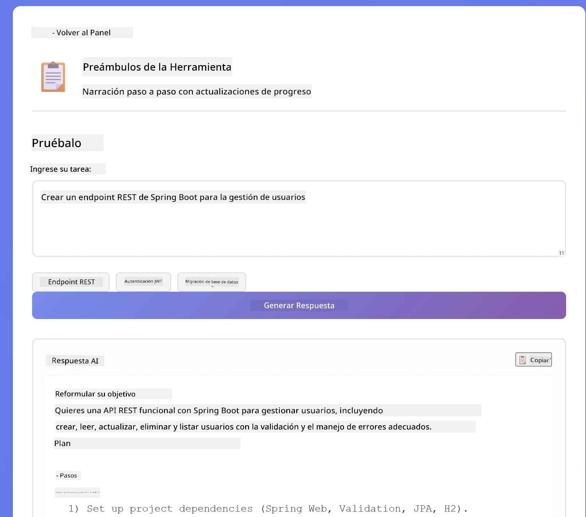

*Creación de un endpoint REST con narración paso a paso (3.9MB)*

### Código autorreflexivo

Prueba "Crear un servicio de validación de correo electrónico". En lugar de solo generar código y detenerse, el modelo genera, evalúa según criterios de calidad, identifica debilidades y mejora. Verás que itera hasta que el código cumple con los estándares de producción.


*Servicio completo de validación de correo electrónico (5.2MB)*

### Análisis estructurado

Las revisiones de código necesitan marcos de evaluación consistentes. El modelo analiza el código usando categorías fijas (corrección, prácticas, rendimiento, seguridad) con niveles de severidad.


*Revisión de código basada en un marco*

### Chat de múltiples turnos

Pregunta "¿Qué es Spring Boot?" y luego sigue inmediatamente con "Muéstrame un ejemplo". El modelo recuerda tu primera pregunta y te da un ejemplo específico de Spring Boot. Sin memoria, esa segunda pregunta sería demasiado vaga.

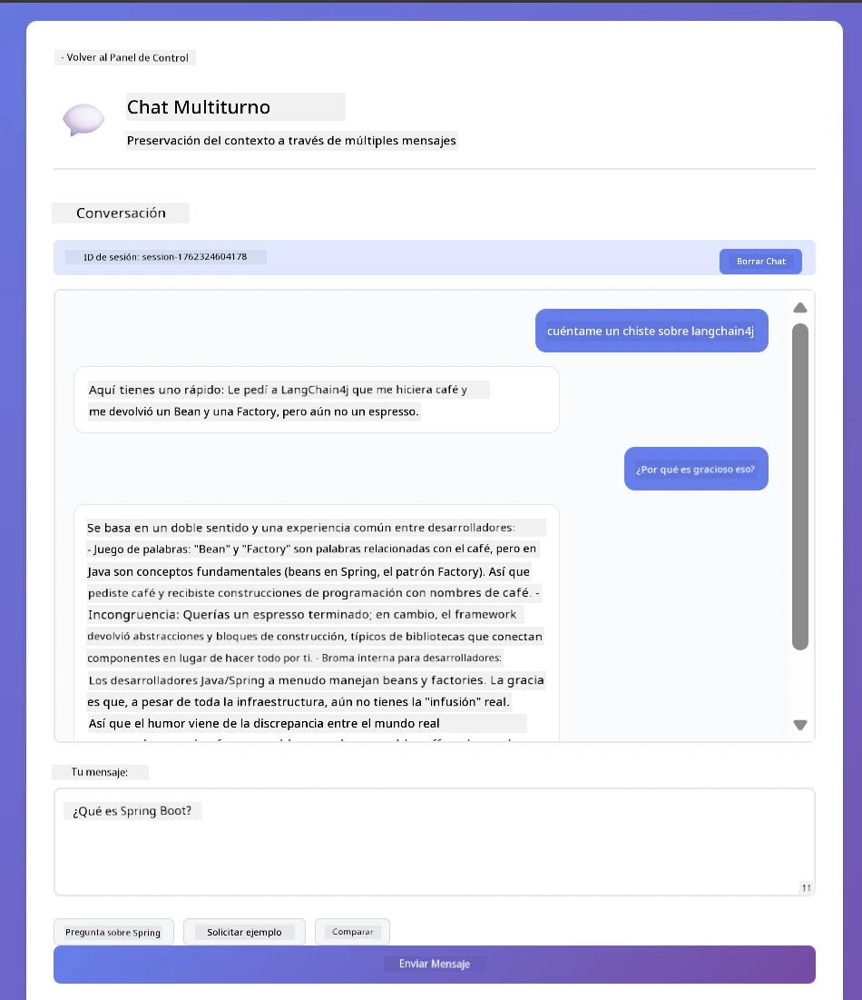

*Preservación del contexto a través de preguntas*

### Razonamiento paso a paso

Elige un problema matemático y pruébalo tanto con Razonamiento paso a paso como con Baja diligencia. La baja diligencia solo te da la respuesta, rápido pero opaco. El paso a paso te muestra cada cálculo y decisión.

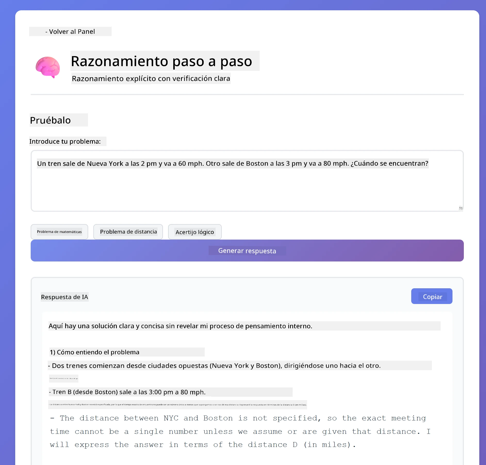

*Problema matemático con pasos explícitos*

### Salida restringida

Cuando necesitas formatos específicos o conteos de palabras, este patrón hace cumplir una estricta adherencia. Prueba generar un resumen con exactamente 100 palabras en formato de viñetas.

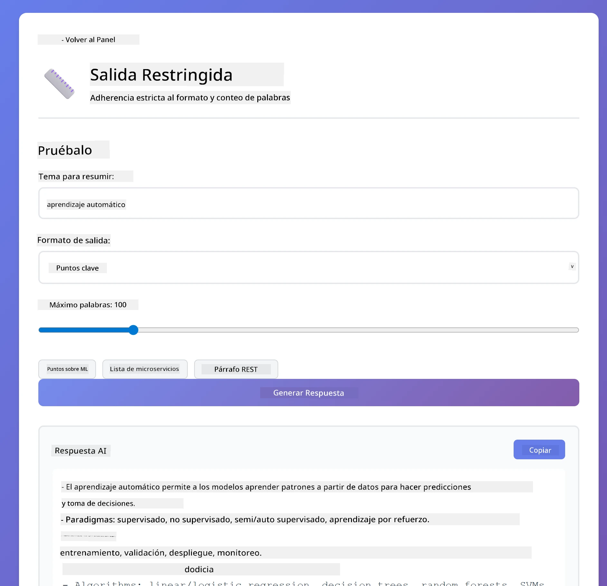

*Resumen de aprendizaje automático con control de formato*

## Lo que realmente estás aprendiendo

**El esfuerzo de razonamiento lo cambia todo**

GPT-5 te permite controlar el esfuerzo computacional a través de tus indicaciones. Bajo esfuerzo significa respuestas rápidas con exploración mínima. Alto esfuerzo significa que el modelo se toma tiempo para pensar profundamente. Estás aprendiendo a ajustar el esfuerzo a la complejidad de la tarea: no pierdas tiempo en preguntas simples, pero tampoco apresures decisiones complejas.

**La estructura guía el comportamiento**

¿Notas las etiquetas XML en las indicaciones? No son decorativas. Los modelos siguen instrucciones estructuradas de manera más confiable que texto libre. Cuando necesitas procesos de múltiples pasos o lógica compleja, la estructura ayuda al modelo a rastrear dónde está y qué sigue.

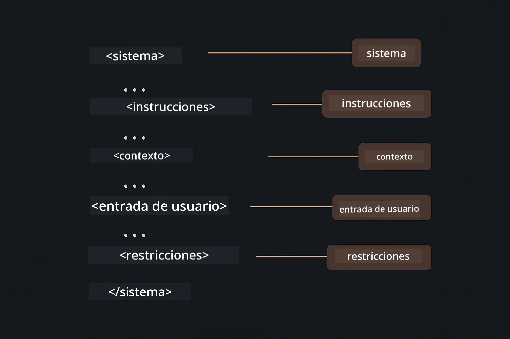

*Anatomía de una indicación bien estructurada con secciones claras y organización estilo XML*

**Calidad mediante autoevaluación**

Los patrones autorreflexivos funcionan haciendo explícitos los criterios de calidad. En lugar de esperar que el modelo "lo haga bien", le dices exactamente qué significa "bien": lógica correcta, manejo de errores, rendimiento, seguridad. El modelo puede entonces evaluar su propia salida y mejorar. Esto convierte la generación de código de una lotería en un proceso.

**El contexto es finito**

Las conversaciones de múltiples turnos funcionan incluyendo el historial de mensajes con cada solicitud. Pero hay un límite: cada modelo tiene un conteo máximo de tokens. A medida que las conversaciones crecen, necesitarás estrategias para mantener el contexto relevante sin alcanzar ese límite. Este módulo te muestra cómo funciona la memoria; más adelante aprenderás cuándo resumir, cuándo olvidar y cuándo recuperar.

## Próximos pasos

**Siguiente módulo:** [03-rag - RAG (Generación aumentada por recuperación)](../03-rag/README.md)

---

**Navegación:** [← Anterior: Módulo 01 - Introducción](../01-introduction/README.md) | [Volver al inicio](../README.md) | [Siguiente: Módulo 03 - RAG →](../03-rag/README.md)

---

<!-- CO-OP TRANSLATOR DISCLAIMER START -->
**Aviso legal**:
Este documento ha sido traducido utilizando el servicio de traducción automática [Co-op Translator](https://github.com/Azure/co-op-translator). Aunque nos esforzamos por la precisión, tenga en cuenta que las traducciones automáticas pueden contener errores o inexactitudes. El documento original en su idioma nativo debe considerarse la fuente autorizada. Para información crítica, se recomienda una traducción profesional realizada por humanos. No nos hacemos responsables de malentendidos o interpretaciones erróneas derivadas del uso de esta traducción.
<!-- CO-OP TRANSLATOR DISCLAIMER END -->