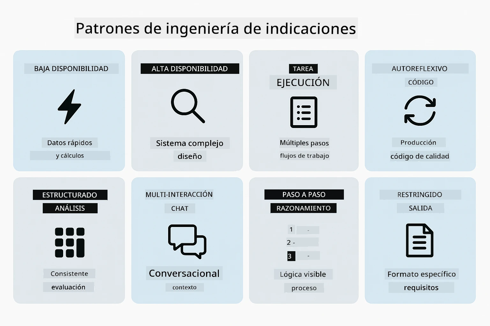
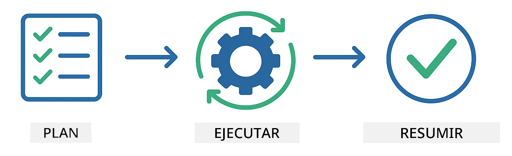
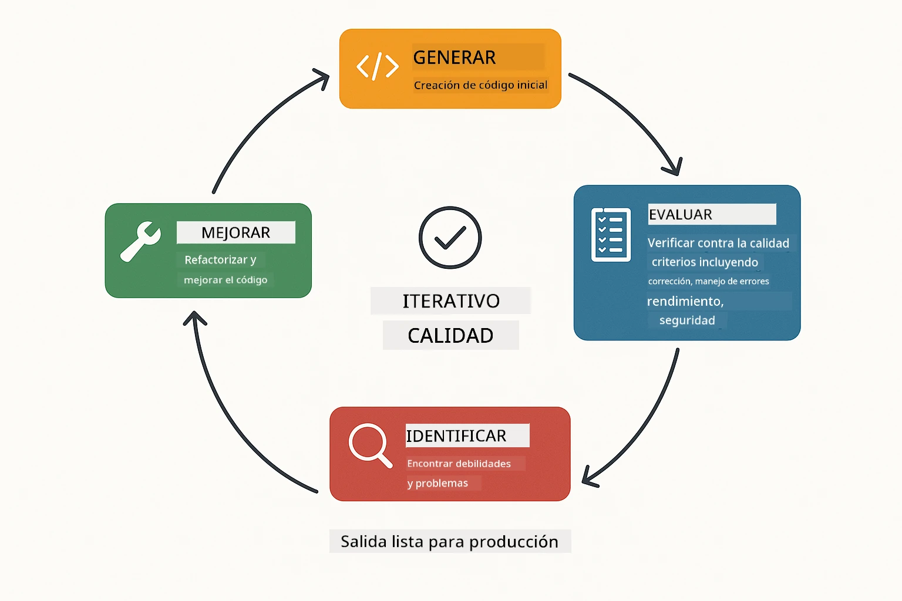
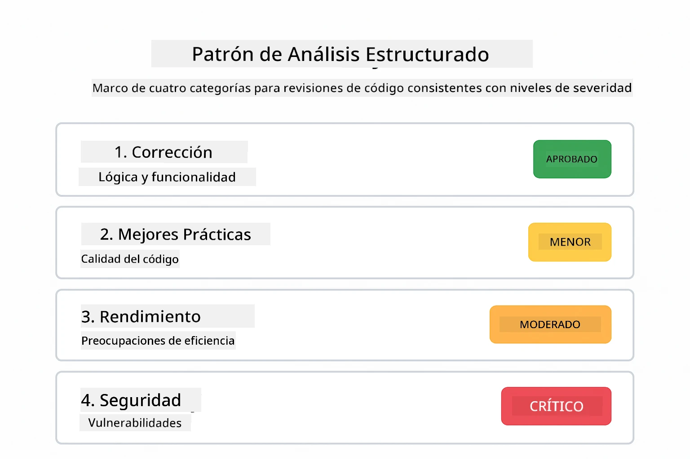
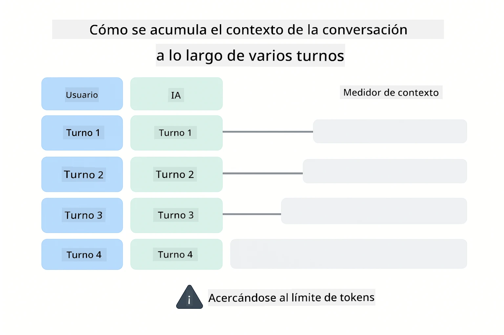
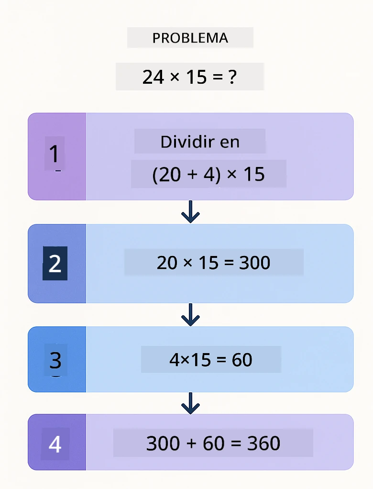
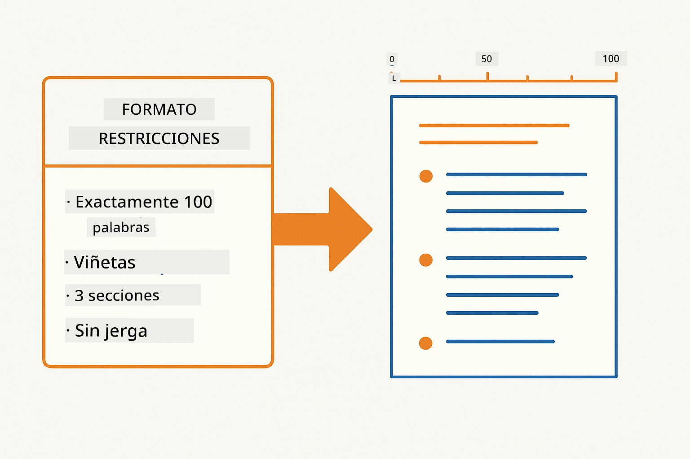
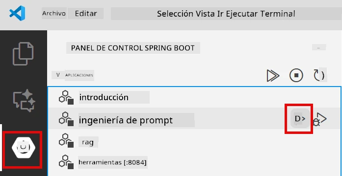
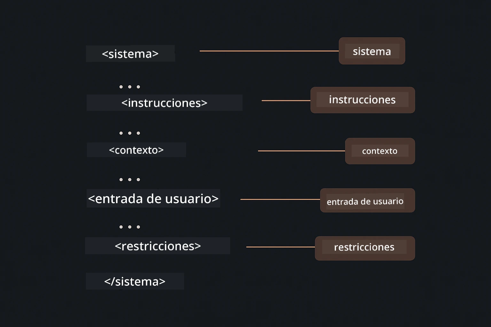

# Módulo 02: Ingeniería de Prompts con GPT-5.2

## Tabla de Contenidos

- [Recorrido en Video](#recorrido-en-video)
- [Lo Que Aprenderás](#lo-que-aprenderás)
- [Prerequisitos](#prerequisitos)
- [Comprendiendo la Ingeniería de Prompts](#comprendiendo-la-ingeniería-de-prompts)
- [Fundamentos de la Ingeniería de Prompts](#fundamentos-de-la-ingeniería-de-prompts)
  - [Prompting Zero-Shot](#prompting-zero-shot)
  - [Prompting Few-Shot](#prompting-few-shot)
  - [Cadena de Pensamiento](#cadena-de-pensamiento)
  - [Prompting Basado en Roles](#prompting-basado-en-roles)
  - [Plantillas de Prompts](#plantillas-de-prompts)
- [Patrones Avanzados](#patrones-avanzados)
- [Ejecutar la Aplicación](#ejecutar-la-aplicación)
- [Capturas de Pantalla de la Aplicación](#capturas-de-pantalla-de-la-aplicación)
- [Explorando los Patrones](#explorando-los-patrones)
  - [Baja vs Alta Entusiasmo](#baja-vs-alta-dedicación)
  - [Ejecución de Tareas (Preámbulos de Herramientas)](#ejecución-de-tareas-preámbulos-de-herramientas)
  - [Código Autorreflexivo](#código-auto-reflexivo)
  - [Análisis Estructurado](#análisis-estructurado)
  - [Chat Multivuelta](#chat-multinivel)
  - [Razonamiento Paso a Paso](#razonamiento-paso-a-paso)
  - [Salida Restringida](#salida-restringida)
- [Lo que Realmente Estás Aprendiendo](#lo-que-realmente-estás-aprendiendo)
- [Próximos Pasos](#próximos-pasos)

## Recorrido en Video

Mira esta sesión en vivo que explica cómo comenzar con este módulo:

<a href="https://www.youtube.com/live/PJ6aBaE6bog?si=LDshyBrTRodP-wke"></a>

## Lo Que Aprenderás

El siguiente diagrama ofrece una vista general de los temas y habilidades clave que desarrollarás en este módulo, desde técnicas de refinamiento de prompts hasta el flujo de trabajo paso a paso que seguirás.


En el módulo anterior viste cómo la memoria habilita IA conversacional con Azure OpenAI. Ahora nos centraremos en cómo haces preguntas — los propios prompts — usando GPT-5.2 de Azure OpenAI. La forma en que estructuras tus prompts afecta drásticamente la calidad de las respuestas que obtienes. Comenzamos revisando las técnicas fundamentales de prompting, luego pasamos a ocho patrones avanzados que aprovechan al máximo las capacidades de GPT-5.2.

Usaremos GPT-5.2 porque introduce control del razonamiento - puedes indicarle al modelo cuánto pensamiento hacer antes de responder. Esto hace que diferentes estrategias de prompting sean más evidentes y te ayuda a entender cuándo usar cada enfoque.

## Prerequisitos

- Haber completado el Módulo 01 (recursos de Azure OpenAI desplegados)
- Archivo `.env` en el directorio raíz con credenciales de Azure (creado por `azd up` en el Módulo 01)

> **Nota:** Si no has completado el Módulo 01, sigue las instrucciones de despliegue ahí primero.

## Comprendiendo la Ingeniería de Prompts

En su esencia, la ingeniería de prompts es la diferencia entre instrucciones vagas y precisas, como ilustra la comparación siguiente.


La ingeniería de prompts se trata de diseñar texto de entrada que consistentemente te dé los resultados que necesitas. No es solo hacer preguntas, sino estructurar solicitudes para que el modelo entienda exactamente qué quieres y cómo entregarlo.

Piénsalo como dar instrucciones a un colega. "Arregla el bug" es vago. "Arregla la excepción de puntero nulo en UserService.java línea 45 añadiendo una comprobación de nulos" es específico. Los modelos de lenguaje funcionan igual — la especificidad y estructura importan.

El diagrama de abajo muestra cómo LangChain4j encaja en esta imagen — conectando tus patrones de prompt con el modelo mediante los bloques constructores SystemMessage y UserMessage.


LangChain4j provee la infraestructura — conexiones al modelo, memoria y tipos de mensajes — mientras que los patrones de prompt son solo texto cuidadosamente estructurado que envías a través de esa infraestructura. Los bloques clave son `SystemMessage` (que establece el comportamiento y rol de la IA) y `UserMessage` (que lleva tu solicitud real).

## Fundamentos de la Ingeniería de Prompts

Las cinco técnicas centrales que se muestran a continuación forman la base de una ingeniería de prompts efectiva. Cada una aborda un aspecto diferente de cómo te comunicas con modelos de lenguaje.


Antes de profundizar en los patrones avanzados de este módulo, repasemos cinco técnicas básicas de prompting. Estos son los bloques constructores que todo ingeniero de prompts debe conocer.

### Prompting Zero-Shot

El enfoque más simple: darle al modelo una instrucción directa sin ejemplos. El modelo se basa completamente en su entrenamiento para entender y ejecutar la tarea. Esto funciona bien para solicitudes directas donde el comportamiento esperado es obvio.


*Instrucción directa sin ejemplos — el modelo infiere la tarea solo con la instrucción*

```java
String prompt = "Classify this sentiment: 'I absolutely loved the movie!'";
String response = model.chat(prompt);
// Respuesta: "Positivo"
```

**Cuándo usarlo:** Clasificaciones simples, preguntas directas, traducciones o cualquier tarea que el modelo pueda manejar sin guía adicional.

### Prompting Few-Shot

Proporciona ejemplos que demuestren el patrón que quieres que el modelo siga. El modelo aprende el formato esperado de entrada-salida a partir de tus ejemplos y lo aplica a nuevas entradas. Esto mejora dramáticamente la consistencia para tareas donde el formato o comportamiento deseado no es obvio.


*Aprender de ejemplos — el modelo identifica el patrón y lo aplica a nuevas entradas*

```java
String prompt = """
    Classify the sentiment as positive, negative, or neutral.
    
    Examples:
    Text: "This product exceeded my expectations!" → Positive
    Text: "It's okay, nothing special." → Neutral
    Text: "Waste of money, very disappointed." → Negative
    
    Now classify this:
    Text: "Best purchase I've made all year!"
    """;
String response = model.chat(prompt);
```

**Cuándo usarlo:** Clasificaciones personalizadas, formateo consistente, tareas específicas de dominio o cuando los resultados zero-shot son inconsistentes.

### Cadena de Pensamiento

Pide al modelo que muestre su razonamiento paso a paso. En lugar de saltar directamente a una respuesta, el modelo descompone el problema y trabaja cada parte explícitamente. Esto mejora la precisión en matemáticas, lógica y razonamiento multi-paso.


*Razonamiento paso a paso — descomponiendo problemas complejos en pasos lógicos explícitos*

```java
String prompt = """
    Problem: A store has 15 apples. They sell 8 apples and then 
    receive a shipment of 12 more apples. How many apples do they have now?
    
    Let's solve this step-by-step:
    """;
String response = model.chat(prompt);
// El modelo muestra: 15 - 8 = 7, luego 7 + 12 = 19 manzanas
```

**Cuándo usarlo:** Problemas matemáticos, acertijos lógicos, depuración o cualquier tarea donde mostrar el proceso de razonamiento improve la precisión y confianza.

### Prompting Basado en Roles

Define una persona o rol para la IA antes de hacer la pregunta. Esto provee contexto que moldea el tono, profundidad y foco de la respuesta. Un "arquitecto de software" ofrece consejos diferentes a un "desarrollador junior" o un "auditor de seguridad".


*Estableciendo contexto y persona — la misma pregunta recibe respuestas diferentes según el rol asignado*

```java
String prompt = """
    You are an experienced software architect reviewing code.
    Provide a brief code review for this function:
    
    def calculate_total(items):
        total = 0
        for item in items:
            total = total + item['price']
        return total
    """;
String response = model.chat(prompt);
```

**Cuándo usarlo:** Revisiones de código, tutoría, análisis específico de dominio o cuando necesitas respuestas adaptadas a un nivel de experiencia o perspectiva particular.

### Plantillas de Prompts

Crea prompts reutilizables con espacios variables. En lugar de escribir un prompt nuevo cada vez, define una plantilla una vez y llena valores diferentes. La clase `PromptTemplate` de LangChain4j facilita esto con la sintaxis `{{variable}}`.


*Prompts reutilizables con espacios variables — una plantilla, muchos usos*

```java
PromptTemplate template = PromptTemplate.from(
    "What's the best time to visit {{destination}} for {{activity}}?"
);

Prompt prompt = template.apply(Map.of(
    "destination", "Paris",
    "activity", "sightseeing"
));

String response = model.chat(prompt.text());
```

**Cuándo usarlo:** Consultas repetidas con diferentes entradas, procesamiento por lotes, construcción de flujos de trabajo AI reutilizables o cualquier escenario donde la estructura del prompt es la misma pero cambian los datos.

---

Estos cinco fundamentos te brindan un conjunto sólido de herramientas para la mayoría de las tareas de prompting. El resto de este módulo se basa en ellos con **ocho patrones avanzados** que aprovechan el control de razonamiento, autoevaluación y la capacidad de salida estructurada de GPT-5.2.

## Patrones Avanzados

Con los fundamentos cubiertos, pasemos a los ocho patrones avanzados que hacen único este módulo. No todos los problemas requieren el mismo enfoque. Algunas preguntas necesitan respuestas rápidas, otras pensamiento profundo. Algunas requieren razonamiento visible, otras solo resultados. Cada patrón abajo está optimizado para un escenario diferente — y el control del razonamiento de GPT-5.2 hace que las diferencias sean aún más pronunciadas.



*Visión general de los ocho patrones de ingeniería de prompts y sus casos de uso*

GPT-5.2 añade otra dimensión a estos patrones: *control de razonamiento*. El control deslizante abajo muestra cómo puedes ajustar el esfuerzo de pensamiento del modelo — desde respuestas rápidas y directas hasta análisis profundo y exhaustivo.


*El control de razonamiento de GPT-5.2 te permite especificar cuánto debe pensar el modelo — desde respuestas rápidas directas hasta exploración profunda*

**Bajo Entusiasmo (Rápido y Enfocado)** - Para preguntas simples donde quieres respuestas rápidas y directas. El modelo hace razonamiento mínimo - máximo 2 pasos. Úsalo para cálculos, consultas o preguntas directas.

```java
String prompt = """
    <context_gathering>
    - Search depth: very low
    - Bias strongly towards providing a correct answer as quickly as possible
    - Usually, this means an absolute maximum of 2 reasoning steps
    - If you think you need more time, state what you know and what's uncertain
    </context_gathering>
    
    Problem: What is 15% of 200?
    
    Provide your answer:
    """;

String response = chatModel.chat(prompt);
```

> 💡 **Explora con GitHub Copilot:** Abre [`Gpt5PromptService.java`](../../../02-prompt-engineering/src/main/java/com/example/langchain4j/prompts/service/Gpt5PromptService.java) y pregunta:
> - "¿Cuál es la diferencia entre los patrones de prompting de bajo entusiasmo y alto entusiasmo?"
> - "¿Cómo ayudan las etiquetas XML en los prompts a estructurar la respuesta de la IA?"
> - "¿Cuándo debería usar patrones de autorreflexión vs instrucción directa?"

**Alto Entusiasmo (Profundo y Exhaustivo)** - Para problemas complejos donde quieres un análisis completo. El modelo explora a fondo y muestra un razonamiento detallado. Úsalo para diseño de sistemas, decisiones arquitectónicas o investigación compleja.

```java
String prompt = """
    Analyze this problem thoroughly and provide a comprehensive solution.
    Consider multiple approaches, trade-offs, and important details.
    Show your analysis and reasoning in your response.
    
    Problem: Design a caching strategy for a high-traffic REST API.
    """;

String response = chatModel.chat(prompt);
```

**Ejecución de Tareas (Progreso Paso a Paso)** - Para flujos de trabajo multi-paso. El modelo provee un plan adelantado, narra cada paso conforme avanza y luego da un resumen. Úsalo para migraciones, implementaciones o cualquier proceso multi-paso.

```java
String prompt = """
    <task_execution>
    1. First, briefly restate the user's goal in a friendly way
    
    2. Create a step-by-step plan:
       - List all steps needed
       - Identify potential challenges
       - Outline success criteria
    
    3. Execute each step:
       - Narrate what you're doing
       - Show progress clearly
       - Handle any issues that arise
    
    4. Summarize:
       - What was completed
       - Any important notes
       - Next steps if applicable
    </task_execution>
    
    <tool_preambles>
    - Always begin by rephrasing the user's goal clearly
    - Outline your plan before executing
    - Narrate each step as you go
    - Finish with a distinct summary
    </tool_preambles>
    
    Task: Create a REST endpoint for user registration
    
    Begin execution:
    """;

String response = chatModel.chat(prompt);
```

El prompting Cadena de Pensamiento explícitamente pide al modelo mostrar su proceso de razonamiento, mejorando la precisión para tareas complejas. La descomposición paso a paso ayuda tanto a humanos como a la IA a entender la lógica.

> **🤖 Prueba con [GitHub Copilot](https://github.com/features/copilot) Chat:** Pregunta sobre este patrón:
> - "¿Cómo adaptaría el patrón de ejecución de tareas para operaciones de larga duración?"
> - "¿Cuáles son las mejores prácticas para estructurar los preámbulos de herramientas en aplicaciones de producción?"
> - "¿Cómo puedo capturar y mostrar actualizaciones de progreso intermedias en una interfaz de usuario?"

El diagrama abajo ilustra este flujo Planificar → Ejecutar → Resumir.



*Flujo Planificar → Ejecutar → Resumir para tareas multi-paso*

**Código Autorreflexivo** - Para generar código con calidad de producción. El modelo genera código siguiendo estándares de producción con manejo adecuado de errores. Úsalo cuando construyas nuevas funcionalidades o servicios.

```java
String prompt = """
    Generate Java code with production-quality standards: Create an email validation service
    Keep it simple and include basic error handling.
    """;

String response = chatModel.chat(prompt);
```

El diagrama a continuación muestra este ciclo iterativo de mejora — generar, evaluar, identificar debilidades y refinar hasta que el código cumpla estándares de producción.



*Ciclo iterativo de mejora - generar, evaluar, identificar problemas, mejorar, repetir*

**Análisis Estructurado** - Para evaluaciones consistentes. El modelo revisa código usando un marco fijo (corrección, prácticas, rendimiento, seguridad, mantenibilidad). Úsalo para revisiones de código o evaluaciones de calidad.

```java
String prompt = """
    <analysis_framework>
    You are an expert code reviewer. Analyze the code for:
    
    1. Correctness
       - Does it work as intended?
       - Are there logical errors?
    
    2. Best Practices
       - Follows language conventions?
       - Appropriate design patterns?
    
    3. Performance
       - Any inefficiencies?
       - Scalability concerns?
    
    4. Security
       - Potential vulnerabilities?
       - Input validation?
    
    5. Maintainability
       - Code clarity?
       - Documentation?
    
    <output_format>
    Provide your analysis in this structure:
    - Summary: One-sentence overall assessment
    - Strengths: 2-3 positive points
    - Issues: List any problems found with severity (High/Medium/Low)
    - Recommendations: Specific improvements
    </output_format>
    </analysis_framework>
    
    Code to analyze:
    ```
    public List getUsers() {
        return database.query("SELECT * FROM users");
    }
    ```
    Provide your structured analysis:
    """;

String response = chatModel.chat(prompt);
```

> **🤖 Prueba con [GitHub Copilot](https://github.com/features/copilot) Chat:** Pregunta sobre análisis estructurado:
> - "¿Cómo puedo personalizar el marco de análisis para diferentes tipos de revisiones de código?"
> - "¿Cuál es la mejor forma de parsear y actuar programáticamente sobre salidas estructuradas?"
> - "¿Cómo garantizo niveles de severidad consistentes en diferentes sesiones de revisión?"

El siguiente diagrama muestra cómo este marco estructurado organiza una revisión de código en categorías consistentes con niveles de severidad.



*Marco para revisiones de código consistentes con niveles de severidad*

**Chat Multivuelta** - Para conversaciones que necesitan contexto. El modelo recuerda mensajes previos y construye sobre ellos. Úsalo para sesiones interactivas de ayuda o Q&A complejos.

```java
ChatMemory memory = MessageWindowChatMemory.withMaxMessages(10);

memory.add(UserMessage.from("What is Spring Boot?"));
AiMessage aiMessage1 = chatModel.chat(memory.messages()).aiMessage();
memory.add(aiMessage1);

memory.add(UserMessage.from("Show me an example"));
AiMessage aiMessage2 = chatModel.chat(memory.messages()).aiMessage();
memory.add(aiMessage2);
```

El diagrama abajo visualiza cómo el contexto de la conversación se acumula con cada turno y cómo se relaciona con el límite de tokens del modelo.



*Cómo el contexto conversacional se acumula a través de múltiples turnos hasta alcanzar el límite de tokens*

**Razonamiento Paso a Paso** - Para problemas que requieren lógica visible. El modelo muestra razonamiento explícito para cada paso. Úsalo para problemas matemáticos, acertijos lógicos o cuando necesitas entender el proceso de pensamiento.

```java
String prompt = """
    <instruction>Show your reasoning step-by-step</instruction>
    
    If a train travels 120 km in 2 hours, then stops for 30 minutes,
    then travels another 90 km in 1.5 hours, what is the average speed
    for the entire journey including the stop?
    """;

String response = chatModel.chat(prompt);
```

El diagrama a continuación ilustra cómo el modelo descompone problemas en pasos lógicos explícitos y numerados.


*Dividiendo problemas en pasos lógicos explícitos*

**Salida Restringida** - Para respuestas con requisitos específicos de formato. El modelo sigue estrictamente las reglas de formato y longitud. Úsalo para resúmenes o cuando necesites una estructura de salida precisa.

```java
String prompt = """
    <constraints>
    - Exactly 100 words
    - Bullet point format
    - Technical terms only
    </constraints>
    
    Summarize the key concepts of machine learning.
    """;

String response = chatModel.chat(prompt);
```

El siguiente diagrama muestra cómo las restricciones guían al modelo para producir una salida que se adhiera estrictamente a tus requisitos de formato y longitud.



*Aplicando requisitos específicos de formato, longitud y estructura*

## Ejecutar la aplicación

**Verificar despliegue:**

Asegúrate de que el archivo `.env` exista en el directorio raíz con las credenciales de Azure (creado durante el Módulo 01). Ejecuta esto desde el directorio del módulo (`02-prompt-engineering/`):

**Bash:**
```bash
cat ../.env  # Debe mostrar AZURE_OPENAI_ENDPOINT, API_KEY, DEPLOYMENT
```

**PowerShell:**
```powershell
Get-Content ..\.env  # Debe mostrar AZURE_OPENAI_ENDPOINT, API_KEY, DEPLOYMENT
```

**Iniciar la aplicación:**

> **Nota:** Si ya iniciaste todas las aplicaciones usando `./start-all.sh` desde el directorio raíz (como se describió en el Módulo 01), este módulo ya está ejecutándose en el puerto 8083. Puedes omitir los comandos de inicio a continuación e ir directamente a http://localhost:8083.

**Opción 1: Usando Spring Boot Dashboard (Recomendado para usuarios de VS Code)**

El contenedor de desarrollo incluye la extensión Spring Boot Dashboard, que ofrece una interfaz visual para administrar todas las aplicaciones Spring Boot. Puedes encontrarla en la Barra de Actividad al lado izquierdo de VS Code (busca el ícono de Spring Boot).

Desde Spring Boot Dashboard, puedes:
- Ver todas las aplicaciones Spring Boot disponibles en el espacio de trabajo
- Iniciar/detener aplicaciones con un solo clic
- Ver los registros de la aplicación en tiempo real
- Monitorear el estado de la aplicación

Simplemente haz clic en el botón de reproducir junto a "prompt-engineering" para iniciar este módulo, o inicia todos los módulos a la vez.



*El Spring Boot Dashboard en VS Code — inicia, detén y monitorea todos los módulos desde un solo lugar*

**Opción 2: Usando scripts de shell**

Inicia todas las aplicaciones web (módulos 01-04):

**Bash:**
```bash
cd ..  # Desde el directorio raíz
./start-all.sh
```

**PowerShell:**
```powershell
cd ..  # Desde el directorio raíz
.\start-all.ps1
```

O inicia solo este módulo:

**Bash:**
```bash
cd 02-prompt-engineering
./start.sh
```

**PowerShell:**
```powershell
cd 02-prompt-engineering
.\start.ps1
```

Ambos scripts cargan automáticamente las variables de entorno del archivo `.env` raíz y construirán los JAR si no existen.

> **Nota:** Si prefieres construir todos los módulos manualmente antes de iniciar:
>
> **Bash:**
> ```bash
> cd ..  # Go to root directory
> mvn clean package -DskipTests
> ```
>
> **PowerShell:**
> ```powershell
> cd ..  # Go to root directory
> mvn clean package -DskipTests
> ```

Abre http://localhost:8083 en tu navegador.

**Para detener:**

**Bash:**
```bash
./stop.sh  # Solo este módulo
# O
cd .. && ./stop-all.sh  # Todos los módulos
```

**PowerShell:**
```powershell
.\stop.ps1  # Solo este módulo
# O
cd ..; .\stop-all.ps1  # Todos los módulos
```

## Capturas de pantalla de la aplicación

Aquí está la interfaz principal del módulo de ingeniería de prompts, donde puedes experimentar con los ocho patrones uno al lado del otro.


*El panel principal mostrando los 8 patrones de ingeniería de prompts con sus características y casos de uso*

## Explorando los patrones

La interfaz web te permite experimentar con diferentes estrategias de prompting. Cada patrón resuelve problemas diferentes; pruébalos para ver cuándo destaca cada enfoque.

> **Nota: Transmisión vs No transmisión** — Cada página de patrón ofrece dos botones: **🔴 Transmitir respuesta (en vivo)** y una opción **No transmisión**. La transmisión utiliza Server-Sent Events (SSE) para mostrar tokens en tiempo real mientras el modelo los genera, así ves el progreso de inmediato. La opción no transmisión espera a que la respuesta completa esté lista para mostrarla. Para prompts que desencadenan razonamientos profundos (ej., Alta Dedicación, Código Auto-Reflexivo), la llamada no transmisión puede tardar mucho tiempo — a veces minutos — sin retroalimentación visible. **Usa la transmisión al experimentar con prompts complejos** para ver cómo trabaja el modelo y evitar la impresión de que la solicitud falló.
>
> **Nota: Requisito de navegador** — La función de transmisión usa Fetch Streams API (`response.body.getReader()`) que requiere un navegador completo (Chrome, Edge, Firefox, Safari). **No** funciona en el Navegador Simple incorporado de VS Code, ya que su vista web no soporta la API ReadableStream. Si usas el Navegador Simple, los botones de no transmisión seguirán funcionando con normalidad; solo los botones de transmisión se ven afectados. Abre `http://localhost:8083` en un navegador externo para la experiencia completa.

### Baja vs Alta Dedicación

Haz una pregunta sencilla como "¿Cuál es el 15% de 200?" usando Baja Dedicación. Obtendrás una respuesta directa e instantánea. Ahora pregunta algo complejo como "Diseña una estrategia de caché para una API de alto tráfico" con Alta Dedicación. Haz clic en **🔴 Transmitir respuesta (en vivo)** y observa cómo el modelo va mostrando su razonamiento detallado token por token. Mismo modelo, misma estructura de pregunta, pero el prompt le indica cuánto debe pensar.

### Ejecución de tareas (Preámbulos de herramientas)

Los flujos de trabajo multi-paso se benefician de una planificación previa y narración del progreso. El modelo describe qué hará, narra cada paso y luego resume los resultados.

### Código Auto-Reflexivo

Prueba "Crear un servicio de validación de email". En lugar de solo generar código y detenerse, el modelo genera, evalúa contra criterios de calidad, identifica debilidades y mejora. Verás cómo itera hasta que el código cumple con los estándares de producción.

### Análisis estructurado

Las revisiones de código necesitan marcos de evaluación consistentes. El modelo analiza el código usando categorías fijas (corrección, prácticas, rendimiento, seguridad) con niveles de severidad.

### Chat multinivel

Pregunta "¿Qué es Spring Boot?" y luego continúa inmediatamente con "Muéstrame un ejemplo". El modelo recuerda tu primera pregunta y te da un ejemplo específico de Spring Boot. Sin memoria, la segunda pregunta sería demasiado vaga.

### Razonamiento paso a paso

Elige un problema matemático y pruébalo con Razonamiento paso a paso y con Baja Dedicación. Baja dedicación solo te da la respuesta — rápido pero opaco. Paso a paso te muestra cada cálculo y decisión.

### Salida restringida

Cuando necesitas formatos o conteos de palabras específicos, este patrón impone una estricta adherencia. Prueba generando un resumen con exactamente 100 palabras en formato de lista.

## Lo que realmente estás aprendiendo

**El esfuerzo de razonamiento lo cambia todo**

GPT-5.2 te permite controlar el esfuerzo computacional por medio de tus prompts. Bajo esfuerzo significa respuestas rápidas con exploración mínima. Alto esfuerzo significa que el modelo toma tiempo para pensar profundamente. Estás aprendiendo a empatar el esfuerzo con la complejidad de la tarea — no malgastes tiempo en preguntas simples, pero tampoco apresures decisiones complejas.

**La estructura guía el comportamiento**

¿Notas las etiquetas XML en los prompts? No son decorativas. Los modelos siguen instrucciones estructuradas más confiablemente que texto libre. Cuando necesitas procesos de múltiples pasos o lógica compleja, la estructura ayuda al modelo a saber dónde está y qué sigue. El diagrama abajo desglosa un prompt bien estructurado, mostrando cómo las etiquetas como `<system>`, `<instructions>`, `<context>`, `<user-input>`, y `<constraints>` organizan tus instrucciones en secciones claras.



*Anatomía de un prompt bien estructurado con secciones claras y organización estilo XML*

**Calidad mediante autoevaluación**

Los patrones auto-reflexivos funcionan haciendo explícitos los criterios de calidad. En lugar de esperar que el modelo "lo haga bien", le dices exactamente qué significa "bien": lógica correcta, manejo de errores, rendimiento, seguridad. El modelo puede luego evaluar su propia salida y mejorarla. Esto convierte la generación de código de una lotería en un proceso.

**El contexto es finito**

Las conversaciones multinivel funcionan incluyendo el historial de mensajes con cada solicitud. Pero hay un límite — cada modelo tiene un máximo de tokens. A medida que crecen las conversaciones, necesitarás estrategias para mantener contexto relevante sin pasar ese límite. Este módulo te muestra cómo funciona la memoria; más adelante aprenderás cuándo resumir, cuándo olvidar y cuándo recuperar.

## Próximos pasos

**Siguiente módulo:** [03-rag - RAG (Generación aumentada por recuperación)](../03-rag/README.md)

---

**Navegación:** [← Anterior: Módulo 01 - Introducción](../01-introduction/README.md) | [Volver al inicio](../README.md) | [Siguiente: Módulo 03 - RAG →](../03-rag/README.md)

---

<!-- CO-OP TRANSLATOR DISCLAIMER START -->
**Descargo de responsabilidad**:
Este documento ha sido traducido utilizando el servicio de traducción automática [Co-op Translator](https://github.com/Azure/co-op-translator). Aunque nos esforzamos por la precisión, tenga en cuenta que las traducciones automatizadas pueden contener errores o inexactitudes. El documento original en su idioma nativo debe considerarse la fuente autorizada. Para información crítica, se recomienda una traducción profesional humana. No somos responsables de cualquier malentendido o interpretación errónea que surja del uso de esta traducción.
<!-- CO-OP TRANSLATOR DISCLAIMER END -->