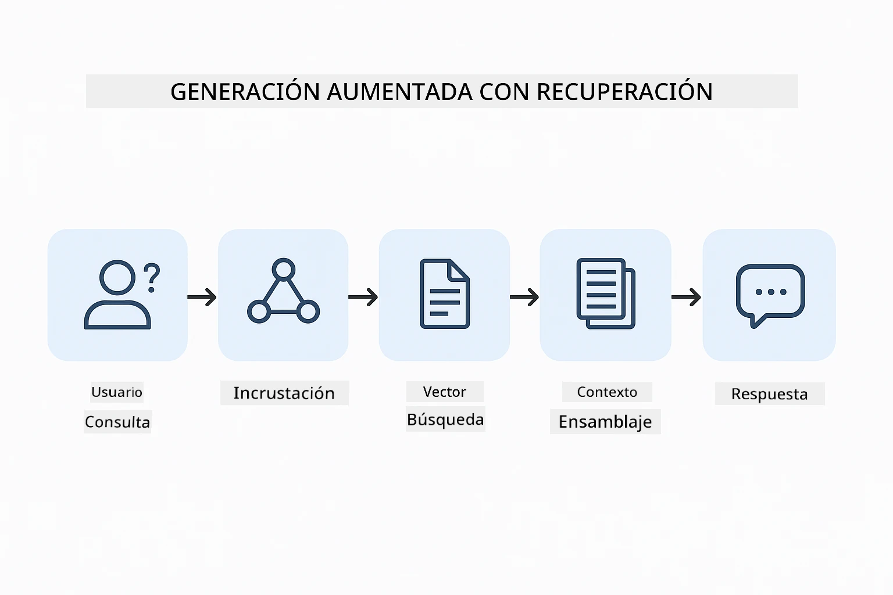
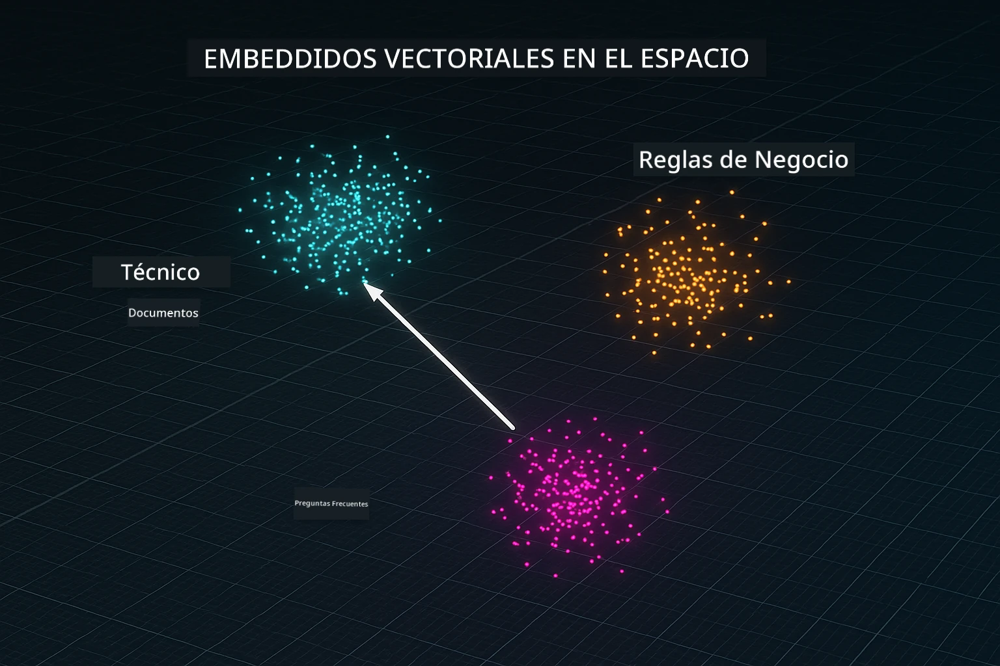
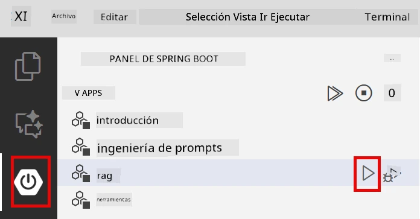
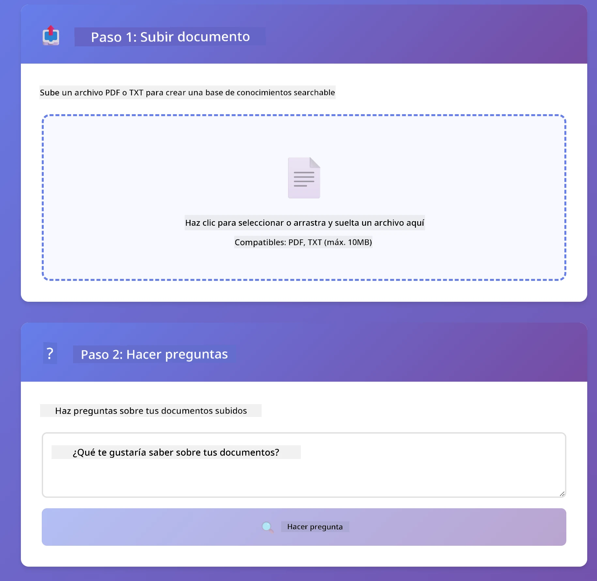
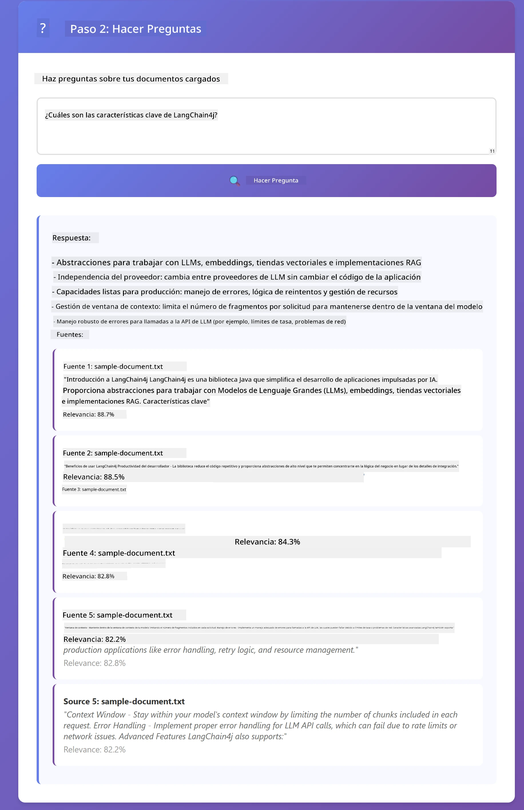

<!--
CO_OP_TRANSLATOR_METADATA:
{
  "original_hash": "81d087662fb3dd7b7124bce1a9c9ec86",
  "translation_date": "2026-01-05T21:19:51+00:00",
  "source_file": "03-rag/README.md",
  "language_code": "es"
}
-->
# Módulo 03: RAG (Generación Aumentada por Recuperación)

## Tabla de Contenidos

- [Qué Aprenderás](../../../03-rag)
- [Requisitos Previos](../../../03-rag)
- [Comprendiendo RAG](../../../03-rag)
- [Cómo Funciona](../../../03-rag)
  - [Procesamiento de Documentos](../../../03-rag)
  - [Creación de Embeddings](../../../03-rag)
  - [Búsqueda Semántica](../../../03-rag)
  - [Generación de Respuestas](../../../03-rag)
- [Ejecutar la Aplicación](../../../03-rag)
- [Usando la Aplicación](../../../03-rag)
  - [Subir un Documento](../../../03-rag)
  - [Hacer Preguntas](../../../03-rag)
  - [Ver Referencias de Fuente](../../../03-rag)
  - [Experimentar con Preguntas](../../../03-rag)
- [Conceptos Clave](../../../03-rag)
  - [Estrategia de División en Chunks](../../../03-rag)
  - [Puntuaciones de Similaridad](../../../03-rag)
  - [Almacenamiento en Memoria](../../../03-rag)
  - [Gestión de la Ventana de Contexto](../../../03-rag)
- [Cuándo importa RAG](../../../03-rag)
- [Próximos Pasos](../../../03-rag)

## Qué Aprenderás

En los módulos anteriores, aprendiste cómo mantener conversaciones con IA y estructurar tus prompts efectivamente. Pero hay una limitación fundamental: los modelos de lenguaje solo saben lo que aprendieron durante el entrenamiento. No pueden responder preguntas sobre las políticas de tu empresa, la documentación de tu proyecto, o cualquier información en la que no hayan sido entrenados.

RAG (Generación Aumentada por Recuperación) resuelve este problema. En lugar de intentar enseñar al modelo tu información (lo cual es costoso e impráctico), le das la capacidad de buscar en tus documentos. Cuando alguien hace una pregunta, el sistema encuentra información relevante e la incluye en el prompt. El modelo luego responde basado en ese contexto recuperado.

Piensa en RAG como brindar al modelo una biblioteca de referencia. Cuando haces una pregunta, el sistema:

1. **Consulta del Usuario** - Haces una pregunta  
2. **Embedding** - Convierte tu pregunta en un vector  
3. **Búsqueda Vectorial** - Encuentra fragmentos similares en los documentos  
4. **Ensamblaje del Contexto** - Añade fragmentos relevantes al prompt  
5. **Respuesta** - El LLM genera una respuesta basada en el contexto  

Esto fundamenta las respuestas del modelo en tus datos reales en lugar de depender solo del conocimiento del entrenamiento o inventar respuestas.



*Flujo de trabajo de RAG: desde la consulta del usuario hasta la búsqueda semántica y generación contextual de respuestas*

## Requisitos Previos

- Completar el Módulo 01 (recursos Azure OpenAI desplegados)  
- Archivo `.env` en el directorio raíz con credenciales Azure (creado por `azd up` en Módulo 01)  

> **Nota:** Si no has completado el Módulo 01, primero sigue las instrucciones de despliegue de ese módulo.

## Cómo Funciona

### Procesamiento de Documentos

[DocumentService.java](../../../03-rag/src/main/java/com/example/langchain4j/rag/service/DocumentService.java)

Cuando subes un documento, el sistema lo divide en fragmentos — piezas más pequeñas que caben cómodamente en la ventana de contexto del modelo. Estos fragmentos se solapan ligeramente para que no se pierda el contexto en los límites.

```java
Document document = FileSystemDocumentLoader.loadDocument("sample-document.txt");

DocumentSplitter splitter = DocumentSplitters
    .recursive(300, 30, new OpenAiTokenizer());

List<TextSegment> segments = splitter.split(document);
```
  
> **🤖 Prueba con [GitHub Copilot](https://github.com/features/copilot) Chat:** Abre [`DocumentService.java`](../../../03-rag/src/main/java/com/example/langchain4j/rag/service/DocumentService.java) y pregunta:  
> - "¿Cómo divide LangChain4j los documentos en fragmentos y por qué es importante el solapamiento?"  
> - "¿Cuál es el tamaño óptimo de fragmento para diferentes tipos de documentos y por qué?"  
> - "¿Cómo manejo documentos en múltiples idiomas o con formato especial?"

### Creación de Embeddings

[LangChainRagConfig.java](../../../03-rag/src/main/java/com/example/langchain4j/rag/config/LangChainRagConfig.java)

Cada fragmento se convierte en una representación numérica llamada embedding — esencialmente una huella digital matemática que captura el significado del texto. Textos similares producen embeddings similares.

```java
@Bean
public EmbeddingModel embeddingModel() {
    return OpenAiOfficialEmbeddingModel.builder()
        .baseUrl(azureOpenAiEndpoint)
        .apiKey(azureOpenAiKey)
        .modelName(azureEmbeddingDeploymentName)
        .build();
}

EmbeddingStore<TextSegment> embeddingStore = 
    new InMemoryEmbeddingStore<>();
```
  


*Documentos representados como vectores en el espacio de embeddings - contenido similar se agrupa*

### Búsqueda Semántica

[RagService.java](../../../03-rag/src/main/java/com/example/langchain4j/rag/service/RagService.java)

Cuando haces una pregunta, tu pregunta también se convierte en un embedding. El sistema compara el embedding de tu pregunta con todos los embeddings de los fragmentos de documentos. Encuentra los fragmentos con significados más similares — no solo coincidencias de palabras clave, sino similitud semántica real.

```java
Embedding queryEmbedding = embeddingModel.embed(question).content();

List<EmbeddingMatch<TextSegment>> matches = 
    embeddingStore.findRelevant(queryEmbedding, 5, 0.7);

for (EmbeddingMatch<TextSegment> match : matches) {
    String relevantText = match.embedded().text();
    double score = match.score();
}
```
  
> **🤖 Prueba con [GitHub Copilot](https://github.com/features/copilot) Chat:** Abre [`RagService.java`](../../../03-rag/src/main/java/com/example/langchain4j/rag/service/RagService.java) y pregunta:  
> - "¿Cómo funciona la búsqueda por similitud con embeddings y qué determina la puntuación?"  
> - "¿Qué umbral de similitud debo usar y cómo afecta a los resultados?"  
> - "¿Cómo manejo casos donde no se encuentran documentos relevantes?"

### Generación de Respuestas

[RagService.java](../../../03-rag/src/main/java/com/example/langchain4j/rag/service/RagService.java)

Los fragmentos más relevantes se incluyen en el prompt para el modelo. El modelo lee esos fragmentos específicos y responde tu pregunta basado en esa información. Esto previene la alucinación — el modelo solo puede responder con lo que tiene delante.

## Ejecutar la Aplicación

**Verifica el despliegue:**  

Asegúrate de que el archivo `.env` exista en el directorio raíz con las credenciales Azure (creado durante el Módulo 01):  
```bash
cat ../.env  # Debe mostrar AZURE_OPENAI_ENDPOINT, API_KEY, DEPLOYMENT
```
  
**Inicia la aplicación:**  

> **Nota:** Si ya iniciaste todas las aplicaciones usando `./start-all.sh` del Módulo 01, este módulo ya está corriendo en el puerto 8081. Puedes saltarte los comandos de inicio abajo y entrar directamente a http://localhost:8081.

**Opción 1: Usando el Spring Boot Dashboard (Recomendado para usuarios de VS Code)**

El contenedor dev incluye la extensión Spring Boot Dashboard, que provee una interfaz visual para manejar todas las aplicaciones Spring Boot. La encontrarás en la Barra de Actividad al lado izquierdo de VS Code (busca el ícono de Spring Boot).

Desde el Spring Boot Dashboard, puedes:  
- Ver todas las aplicaciones Spring Boot disponibles en el espacio de trabajo  
- Iniciar/detener aplicaciones con un solo clic  
- Ver logs de aplicaciones en tiempo real  
- Monitorear el estado de la aplicación  

Simplemente haz clic en el botón de play al lado de "rag" para iniciar este módulo, o inicia todos los módulos de una vez.



**Opción 2: Usando scripts shell**

Inicia todas las aplicaciones web (módulos 01-04):

**Bash:**  
```bash
cd ..  # Desde el directorio raíz
./start-all.sh
```
  
**PowerShell:**  
```powershell
cd ..  # Desde el directorio raíz
.\start-all.ps1
```
  
O inicia solo este módulo:

**Bash:**  
```bash
cd 03-rag
./start.sh
```
  
**PowerShell:**  
```powershell
cd 03-rag
.\start.ps1
```
  
Ambos scripts cargan automáticamente variables de entorno desde el archivo `.env` raíz y construirán los JARs si no existen.

> **Nota:** Si prefieres construir todos los módulos manualmente antes de iniciar:  
>  
> **Bash:**  
> ```bash
> cd ..  # Go to root directory
> mvn clean package -DskipTests
> ```
>  
> **PowerShell:**  
> ```powershell
> cd ..  # Go to root directory
> mvn clean package -DskipTests
> ```
  
Abre http://localhost:8081 en tu navegador.

**Para detener:**  

**Bash:**  
```bash
./stop.sh  # Solo este módulo
# O
cd .. && ./stop-all.sh  # Todos los módulos
```
  
**PowerShell:**  
```powershell
.\stop.ps1  # Solo este módulo
# O
cd ..; .\stop-all.ps1  # Todos los módulos
```
  
## Usando la Aplicación

La aplicación provee una interfaz web para subir documentos y hacer preguntas.

<a href="images/rag-homepage.png"></a>

*Interfaz de la aplicación RAG - sube documentos y haz preguntas*

### Subir un Documento

Comienza subiendo un documento — archivos TXT funcionan mejor para las pruebas. Se provee un `sample-document.txt` en este directorio que contiene información sobre características de LangChain4j, implementación RAG y mejores prácticas — perfecto para probar el sistema.

El sistema procesa tu documento, lo divide en fragmentos y crea embeddings para cada fragmento. Esto sucede automáticamente al subirlo.

### Hacer Preguntas

Ahora haz preguntas específicas sobre el contenido del documento. Intenta con algo factual que esté claramente indicado en el documento. El sistema busca fragmentos relevantes, los incluye en el prompt y genera una respuesta.

### Ver Referencias de Fuente

Observa que cada respuesta incluye referencias de fuente con puntuaciones de similitud. Estas puntuaciones (de 0 a 1) indican qué tan relevante fue cada fragmento para tu pregunta. Puntuaciones más altas significan mejores coincidencias. Esto te permite verificar la respuesta contra el material original.

<a href="images/rag-query-results.png"></a>

*Resultados de consulta mostrando respuesta con referencias de fuente y puntuaciones de relevancia*

### Experimentar con Preguntas

Prueba diferentes tipos de preguntas:  
- Hechos específicos: "¿Cuál es el tema principal?"  
- Comparaciones: "¿Cuál es la diferencia entre X y Y?"  
- Resúmenes: "Resume los puntos clave sobre Z"

Observa cómo cambian las puntuaciones de relevancia según cómo tu pregunta coincida con el contenido del documento.

## Conceptos Clave

### Estrategia de División en Chunks

Los documentos se dividen en fragmentos de 300 tokens con un solapamiento de 30 tokens. Este equilibrio asegura que cada fragmento tenga contexto suficiente para ser significativo, manteniéndose pequeño para incluir múltiples fragmentos en un prompt.

### Puntuaciones de Similaridad

Las puntuaciones varían de 0 a 1:  
- 0.7-1.0: Muy relevante, coincidencia exacta  
- 0.5-0.7: Relevante, buen contexto  
- Por debajo de 0.5: Filtrado, demasiado disímil  

El sistema solo recupera fragmentos por encima del umbral mínimo para garantizar calidad.

### Almacenamiento en Memoria

Este módulo usa almacenamiento en memoria para simplicidad. Cuando reinicias la aplicación, los documentos subidos se pierden. Sistemas en producción usan bases de datos vectoriales persistentes como Qdrant o Azure AI Search.

### Gestión de la Ventana de Contexto

Cada modelo tiene una ventana máxima de contexto. No puedes incluir todos los fragmentos de un documento grande. El sistema recupera los N fragmentos más relevantes (por defecto 5) para mantenerse dentro de los límites mientras provee suficiente contexto para respuestas precisas.

## Cuándo importa RAG

**Usa RAG cuando:**  
- Responder preguntas sobre documentos propietarios  
- La información cambia frecuentemente (políticas, precios, especificaciones)  
- Se requiere precisión con atribución de la fuente  
- El contenido es demasiado grande para un solo prompt  
- Necesitas respuestas verificables y fundamentadas

**No uses RAG cuando:**  
- Las preguntas requieren conocimiento general que el modelo ya tiene  
- Se necesitan datos en tiempo real (RAG trabaja con documentos subidos)  
- El contenido es lo suficientemente pequeño para incluirse directamente en prompts

## Próximos Pasos

**Próximo Módulo:** [04-tools - Agentes de IA con Herramientas](../04-tools/README.md)

---

**Navegación:** [← Anterior: Módulo 02 - Ingeniería de Prompts](../02-prompt-engineering/README.md) | [Volver al Inicio](../README.md) | [Siguiente: Módulo 04 - Herramientas →](../04-tools/README.md)

---

<!-- CO-OP TRANSLATOR DISCLAIMER START -->
**Aviso legal**:
Este documento ha sido traducido utilizando el servicio de traducción por IA [Co-op Translator](https://github.com/Azure/co-op-translator). Aunque nos esforzamos por la exactitud, tenga en cuenta que las traducciones automáticas pueden contener errores o inexactitudes. El documento original en su idioma nativo debe considerarse la fuente autorizada. Para información crítica, se recomienda la traducción profesional realizada por humanos. No somos responsables por malentendidos o interpretaciones erróneas derivadas del uso de esta traducción.
<!-- CO-OP TRANSLATOR DISCLAIMER END -->