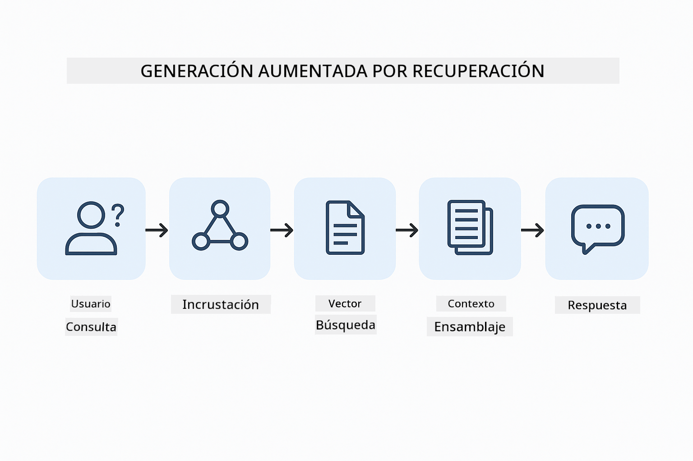
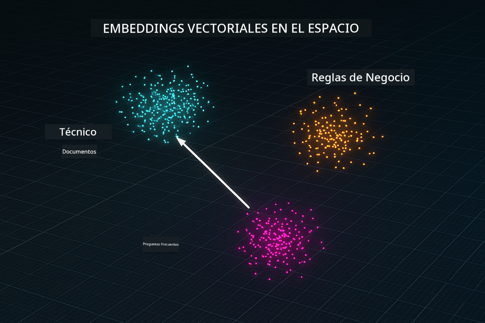
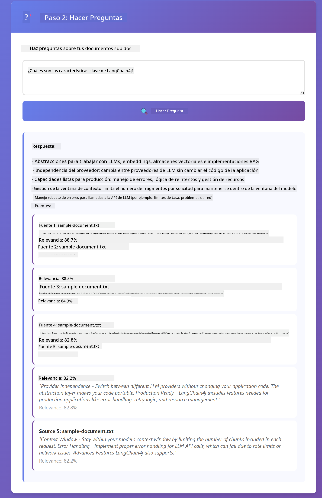

<!--
CO_OP_TRANSLATOR_METADATA:
{
  "original_hash": "f538a51cfd13147d40d84e936a0f485c",
  "translation_date": "2025-12-13T16:42:45+00:00",
  "source_file": "03-rag/README.md",
  "language_code": "es"
}
-->
# Módulo 03: RAG (Generación Aumentada por Recuperación)

## Tabla de Contenidos

- [Lo que aprenderás](../../../03-rag)
- [Requisitos previos](../../../03-rag)
- [Entendiendo RAG](../../../03-rag)
- [Cómo funciona](../../../03-rag)
  - [Procesamiento de documentos](../../../03-rag)
  - [Creación de embeddings](../../../03-rag)
  - [Búsqueda semántica](../../../03-rag)
  - [Generación de respuestas](../../../03-rag)
- [Ejecutar la aplicación](../../../03-rag)
- [Uso de la aplicación](../../../03-rag)
  - [Subir un documento](../../../03-rag)
  - [Hacer preguntas](../../../03-rag)
  - [Ver referencias de la fuente](../../../03-rag)
  - [Experimentar con preguntas](../../../03-rag)
- [Conceptos clave](../../../03-rag)
  - [Estrategia de fragmentación](../../../03-rag)
  - [Puntuaciones de similitud](../../../03-rag)
  - [Almacenamiento en memoria](../../../03-rag)
  - [Gestión de la ventana de contexto](../../../03-rag)
- [Cuándo importa RAG](../../../03-rag)
- [Próximos pasos](../../../03-rag)

## Lo que aprenderás

En los módulos anteriores, aprendiste cómo tener conversaciones con IA y estructurar tus prompts de manera efectiva. Pero hay una limitación fundamental: los modelos de lenguaje solo saben lo que aprendieron durante el entrenamiento. No pueden responder preguntas sobre las políticas de tu empresa, la documentación de tu proyecto o cualquier información en la que no fueron entrenados.

RAG (Generación Aumentada por Recuperación) resuelve este problema. En lugar de intentar enseñar al modelo tu información (lo cual es costoso e impráctico), le das la capacidad de buscar en tus documentos. Cuando alguien hace una pregunta, el sistema encuentra información relevante e la incluye en el prompt. El modelo entonces responde basándose en ese contexto recuperado.

Piensa en RAG como darle al modelo una biblioteca de referencia. Cuando haces una pregunta, el sistema:

1. **Consulta del usuario** - Haces una pregunta  
2. **Embedding** - Convierte tu pregunta en un vector  
3. **Búsqueda vectorial** - Encuentra fragmentos de documentos similares  
4. **Ensamblaje del contexto** - Añade fragmentos relevantes al prompt  
5. **Respuesta** - El LLM genera una respuesta basada en el contexto  

Esto fundamenta las respuestas del modelo en tus datos reales en lugar de depender de su conocimiento de entrenamiento o inventar respuestas.



*Flujo de trabajo RAG - desde la consulta del usuario hasta la búsqueda semántica y la generación contextual de respuestas*

## Requisitos previos

- Completar el Módulo 01 (recursos Azure OpenAI desplegados)  
- Archivo `.env` en el directorio raíz con credenciales de Azure (creado por `azd up` en el Módulo 01)  

> **Nota:** Si no has completado el Módulo 01, sigue primero las instrucciones de despliegue allí.

## Cómo funciona

**Procesamiento de documentos** - [DocumentService.java](../../../03-rag/src/main/java/com/example/langchain4j/rag/service/DocumentService.java)

Cuando subes un documento, el sistema lo divide en fragmentos — piezas más pequeñas que caben cómodamente en la ventana de contexto del modelo. Estos fragmentos se superponen ligeramente para que no se pierda contexto en los límites.

```java
Document document = FileSystemDocumentLoader.loadDocument("sample-document.txt");

DocumentSplitter splitter = DocumentSplitters
    .recursive(300, 30, new OpenAiTokenizer());

List<TextSegment> segments = splitter.split(document);
```
  
> **🤖 Prueba con [GitHub Copilot](https://github.com/features/copilot) Chat:** Abre [`DocumentService.java`](../../../03-rag/src/main/java/com/example/langchain4j/rag/service/DocumentService.java) y pregunta:  
> - "¿Cómo divide LangChain4j los documentos en fragmentos y por qué es importante la superposición?"  
> - "¿Cuál es el tamaño óptimo de fragmento para diferentes tipos de documentos y por qué?"  
> - "¿Cómo manejo documentos en varios idiomas o con formato especial?"

**Creación de embeddings** - [LangChainRagConfig.java](../../../03-rag/src/main/java/com/example/langchain4j/rag/config/LangChainRagConfig.java)

Cada fragmento se convierte en una representación numérica llamada embedding — esencialmente una huella matemática que captura el significado del texto. Textos similares producen embeddings similares.

```java
@Bean
public EmbeddingModel embeddingModel() {
    return OpenAiOfficialEmbeddingModel.builder()
        .baseUrl(azureOpenAiEndpoint)
        .apiKey(azureOpenAiKey)
        .modelName(azureEmbeddingDeploymentName)
        .build();
}

EmbeddingStore<TextSegment> embeddingStore = 
    new InMemoryEmbeddingStore<>();
```
  


*Documentos representados como vectores en el espacio de embeddings - contenido similar se agrupa*

**Búsqueda semántica** - [RagService.java](../../../03-rag/src/main/java/com/example/langchain4j/rag/service/RagService.java)

Cuando haces una pregunta, tu pregunta también se convierte en un embedding. El sistema compara el embedding de tu pregunta con los embeddings de todos los fragmentos del documento. Encuentra los fragmentos con significados más similares — no solo palabras clave coincidentes, sino similitud semántica real.

```java
Embedding queryEmbedding = embeddingModel.embed(question).content();

List<EmbeddingMatch<TextSegment>> matches = 
    embeddingStore.findRelevant(queryEmbedding, 5, 0.7);

for (EmbeddingMatch<TextSegment> match : matches) {
    String relevantText = match.embedded().text();
    double score = match.score();
}
```
  
> **🤖 Prueba con [GitHub Copilot](https://github.com/features/copilot) Chat:** Abre [`RagService.java`](../../../03-rag/src/main/java/com/example/langchain4j/rag/service/RagService.java) y pregunta:  
> - "¿Cómo funciona la búsqueda por similitud con embeddings y qué determina la puntuación?"  
> - "¿Qué umbral de similitud debería usar y cómo afecta los resultados?"  
> - "¿Cómo manejo casos donde no se encuentran documentos relevantes?"

**Generación de respuestas** - [RagService.java](../../../03-rag/src/main/java/com/example/langchain4j/rag/service/RagService.java)

Los fragmentos más relevantes se incluyen en el prompt para el modelo. El modelo lee esos fragmentos específicos y responde tu pregunta basándose en esa información. Esto previene alucinaciones — el modelo solo puede responder con lo que tiene delante.

## Ejecutar la aplicación

**Verificar despliegue:**

Asegúrate de que el archivo `.env` exista en el directorio raíz con las credenciales de Azure (creado durante el Módulo 01):  
```bash
cat ../.env  # Debe mostrar AZURE_OPENAI_ENDPOINT, API_KEY, DEPLOYMENT
```
  
**Iniciar la aplicación:**

> **Nota:** Si ya iniciaste todas las aplicaciones usando `./start-all.sh` del Módulo 01, este módulo ya está corriendo en el puerto 8081. Puedes saltarte los comandos de inicio a continuación e ir directamente a http://localhost:8081.

**Opción 1: Usar Spring Boot Dashboard (Recomendado para usuarios de VS Code)**

El contenedor de desarrollo incluye la extensión Spring Boot Dashboard, que proporciona una interfaz visual para gestionar todas las aplicaciones Spring Boot. La encontrarás en la barra de actividades a la izquierda de VS Code (busca el ícono de Spring Boot).

Desde el Spring Boot Dashboard puedes:  
- Ver todas las aplicaciones Spring Boot disponibles en el espacio de trabajo  
- Iniciar/detener aplicaciones con un solo clic  
- Ver logs de la aplicación en tiempo real  
- Monitorear el estado de la aplicación  

Simplemente haz clic en el botón de reproducir junto a "rag" para iniciar este módulo, o inicia todos los módulos a la vez.


**Opción 2: Usar scripts de shell**

Inicia todas las aplicaciones web (módulos 01-04):

**Bash:**  
```bash
cd ..  # Desde el directorio raíz
./start-all.sh
```
  
**PowerShell:**  
```powershell
cd ..  # Desde el directorio raíz
.\start-all.ps1
```
  
O inicia solo este módulo:

**Bash:**  
```bash
cd 03-rag
./start.sh
```
  
**PowerShell:**  
```powershell
cd 03-rag
.\start.ps1
```
  
Ambos scripts cargan automáticamente las variables de entorno desde el archivo `.env` raíz y construirán los JARs si no existen.

> **Nota:** Si prefieres construir todos los módulos manualmente antes de iniciar:  
>  
> **Bash:**  
> ```bash
> cd ..  # Go to root directory
> mvn clean package -DskipTests
> ```
  
> **PowerShell:**  
> ```powershell
> cd ..  # Go to root directory
> mvn clean package -DskipTests
> ```
  
Abre http://localhost:8081 en tu navegador.

**Para detener:**

**Bash:**  
```bash
./stop.sh  # Solo este módulo
# O
cd .. && ./stop-all.sh  # Todos los módulos
```
  
**PowerShell:**  
```powershell
.\stop.ps1  # Solo este módulo
# O
cd ..; .\stop-all.ps1  # Todos los módulos
```
  
## Uso de la aplicación

La aplicación proporciona una interfaz web para subir documentos y hacer preguntas.

<a href="images/rag-homepage.png"></a>

*Interfaz de la aplicación RAG - sube documentos y haz preguntas*

**Subir un documento**

Comienza subiendo un documento — los archivos TXT funcionan mejor para pruebas. Se proporciona un `sample-document.txt` en este directorio que contiene información sobre las características de LangChain4j, implementación de RAG y mejores prácticas — perfecto para probar el sistema.

El sistema procesa tu documento, lo divide en fragmentos y crea embeddings para cada fragmento. Esto ocurre automáticamente al subirlo.

**Hacer preguntas**

Ahora haz preguntas específicas sobre el contenido del documento. Prueba con algo factual que esté claramente indicado en el documento. El sistema busca fragmentos relevantes, los incluye en el prompt y genera una respuesta.

**Ver referencias de la fuente**

Observa que cada respuesta incluye referencias a las fuentes con puntuaciones de similitud. Estas puntuaciones (de 0 a 1) muestran qué tan relevante fue cada fragmento para tu pregunta. Puntuaciones más altas significan mejores coincidencias. Esto te permite verificar la respuesta contra el material fuente.

<a href="images/rag-query-results.png"></a>

*Resultados de consulta mostrando respuesta con referencias a fuentes y puntuaciones de relevancia*

**Experimentar con preguntas**

Prueba diferentes tipos de preguntas:  
- Hechos específicos: "¿Cuál es el tema principal?"  
- Comparaciones: "¿Cuál es la diferencia entre X y Y?"  
- Resúmenes: "Resume los puntos clave sobre Z"  

Observa cómo cambian las puntuaciones de relevancia según qué tan bien tu pregunta coincida con el contenido del documento.

## Conceptos clave

**Estrategia de fragmentación**

Los documentos se dividen en fragmentos de 300 tokens con 30 tokens de superposición. Este equilibrio asegura que cada fragmento tenga suficiente contexto para ser significativo mientras se mantiene lo suficientemente pequeño para incluir múltiples fragmentos en un prompt.

**Puntuaciones de similitud**

Las puntuaciones van de 0 a 1:  
- 0.7-1.0: Altamente relevante, coincidencia exacta  
- 0.5-0.7: Relevante, buen contexto  
- Por debajo de 0.5: Filtrado, demasiado disímil  

El sistema solo recupera fragmentos por encima del umbral mínimo para asegurar calidad.

**Almacenamiento en memoria**

Este módulo usa almacenamiento en memoria para simplicidad. Cuando reinicias la aplicación, los documentos subidos se pierden. Los sistemas de producción usan bases de datos vectoriales persistentes como Qdrant o Azure AI Search.

**Gestión de la ventana de contexto**

Cada modelo tiene una ventana de contexto máxima. No puedes incluir todos los fragmentos de un documento grande. El sistema recupera los N fragmentos más relevantes (por defecto 5) para mantenerse dentro de los límites mientras proporciona suficiente contexto para respuestas precisas.

## Cuándo importa RAG

**Usa RAG cuando:**  
- Respondes preguntas sobre documentos propietarios  
- La información cambia frecuentemente (políticas, precios, especificaciones)  
- La precisión requiere atribución de fuentes  
- El contenido es demasiado grande para caber en un solo prompt  
- Necesitas respuestas verificables y fundamentadas

**No uses RAG cuando:**  
- Las preguntas requieren conocimiento general que el modelo ya tiene  
- Se necesita información en tiempo real (RAG funciona con documentos subidos)  
- El contenido es lo suficientemente pequeño para incluirse directamente en los prompts

## Próximos pasos

**Siguiente módulo:** [04-tools - Agentes de IA con herramientas](../04-tools/README.md)

---

**Navegación:** [← Anterior: Módulo 02 - Ingeniería de prompts](../02-prompt-engineering/README.md) | [Volver al inicio](../README.md) | [Siguiente: Módulo 04 - Herramientas →](../04-tools/README.md)

---

<!-- CO-OP TRANSLATOR DISCLAIMER START -->
**Aviso legal**:
Este documento ha sido traducido utilizando el servicio de traducción automática [Co-op Translator](https://github.com/Azure/co-op-translator). Aunque nos esforzamos por la precisión, tenga en cuenta que las traducciones automáticas pueden contener errores o inexactitudes. El documento original en su idioma nativo debe considerarse la fuente autorizada. Para información crítica, se recomienda una traducción profesional realizada por humanos. No nos hacemos responsables de malentendidos o interpretaciones erróneas derivadas del uso de esta traducción.
<!-- CO-OP TRANSLATOR DISCLAIMER END -->