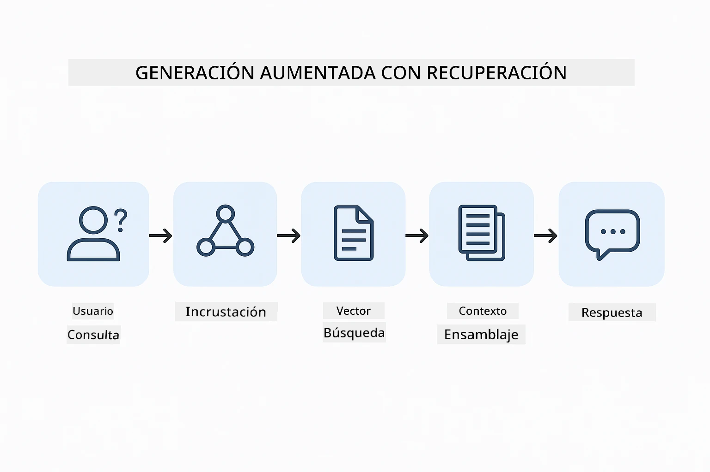
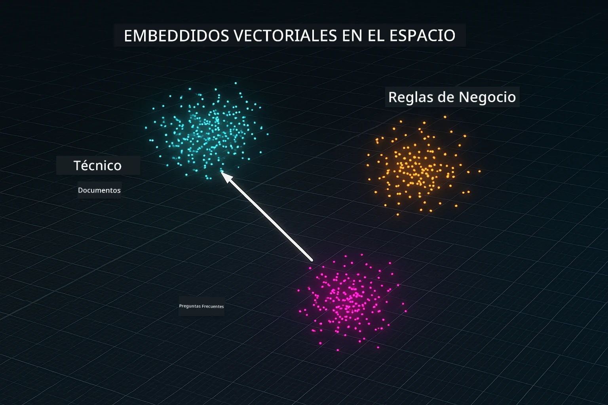
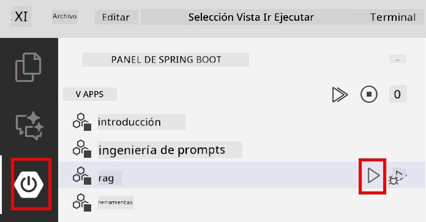
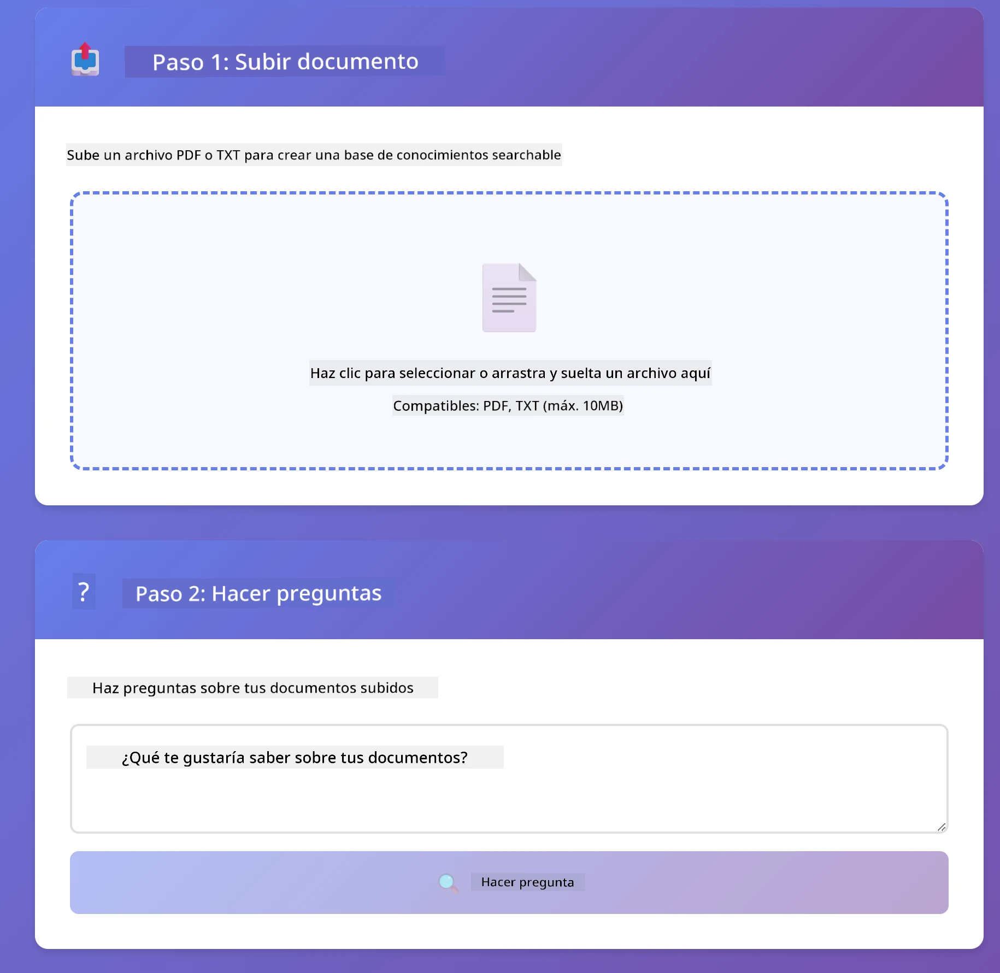
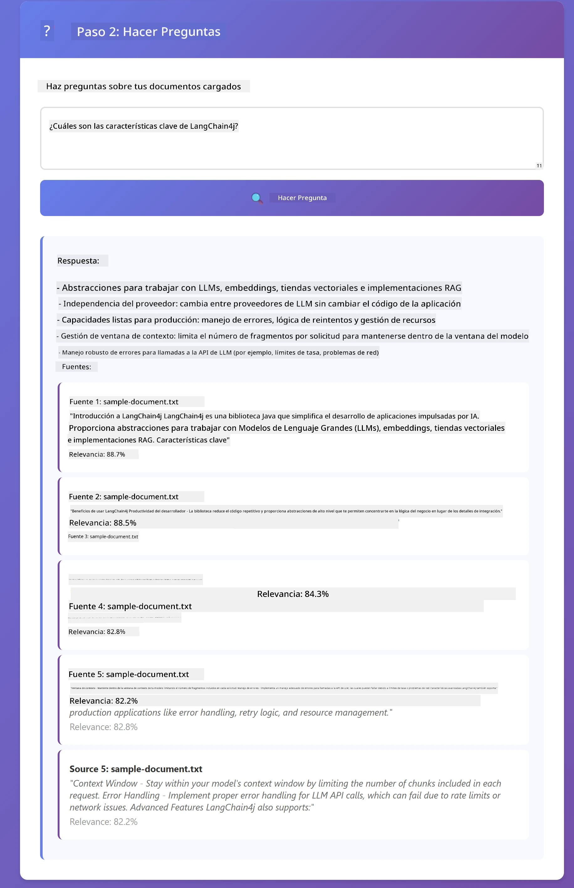

# Módulo 03: RAG (Generación Aumentada por Recuperación)

## Tabla de Contenidos

- [Video Explicativo](#video-explicativo)
- [Lo Que Aprenderás](#lo-que-aprenderás)
- [Requisitos Previos](#requisitos-previos)
- [Entendiendo RAG](#entendiendo-rag)
  - [¿Qué Enfoque RAG Usa Este Tutorial?](#qué-enfoque-rag-usa-este-tutorial)
- [Cómo Funciona](#cómo-funciona)
  - [Procesamiento de Documentos](#procesamiento-de-documentos)
  - [Creación de Embeddings](#creación-de-embeddings)
  - [Búsqueda Semántica](#búsqueda-semántica)
  - [Generación de Respuestas](#generación-de-respuestas)
- [Ejecutar la Aplicación](#ejecutar-la-aplicación)
- [Usando la Aplicación](#uso-de-la-aplicación)
  - [Subir un Documento](#subir-un-documento)
  - [Hacer Preguntas](#hacer-preguntas)
  - [Consultar Referencias de la Fuente](#revisar-referencias-de-fuente)
  - [Experimentar con Preguntas](#experimenta-con-preguntas)
- [Conceptos Clave](#conceptos-clave)
  - [Estrategia de División en Fragmentos](#estrategia-de-fragmentación)
  - [Puntajes de Similitud](#puntuaciones-de-similitud)
  - [Almacenamiento en Memoria](#almacenamiento-en-memoria)
  - [Gestión de la Ventana de Contexto](#gestión-de-ventana-de-contexto)
- [Cuándo Importa RAG](#cuándo-importa-rag)
- [Próximos Pasos](#próximos-pasos)

## Video Explicativo

Mira esta sesión en vivo que explica cómo comenzar con este módulo:

<a href="https://www.youtube.com/watch?v=_olq75ZH_eY"></a>

## Lo Que Aprenderás

En los módulos anteriores, aprendiste a tener conversaciones con IA y a estructurar tus prompts de manera efectiva. Pero hay una limitación fundamental: los modelos de lenguaje solo saben lo que aprendieron durante el entrenamiento. No pueden responder preguntas sobre las políticas de tu empresa, la documentación de tu proyecto o cualquier información con la que no fueron entrenados.

RAG (Generación Aumentada por Recuperación) resuelve este problema. En lugar de intentar enseñar al modelo tu información (lo cual es costoso e impráctico), le das la capacidad de buscar en tus documentos. Cuando alguien hace una pregunta, el sistema encuentra la información relevante y la incluye en el prompt. El modelo entonces responde basándose en ese contexto recuperado.

Piensa en RAG como darle al modelo una biblioteca de referencia. Cuando haces una pregunta, el sistema:

1. **Consulta del usuario** - Haces una pregunta  
2. **Embedding** - Convierte tu pregunta en un vector  
3. **Búsqueda vectorial** - Encuentra fragmentos de documentos similares  
4. **Montaje del contexto** - Añade fragmentos relevantes al prompt  
5. **Respuesta** - El LLM genera una respuesta basada en el contexto  

Esto fundamenta las respuestas del modelo en tus datos reales en lugar de depender solo en su conocimiento de entrenamiento o inventar respuestas.

## Requisitos Previos

- Haber completado [Módulo 01 - Introducción](../01-introduction/README.md) (recursos Azure OpenAI desplegados, incluyendo el modelo embedding `text-embedding-3-small`)  
- Archivo `.env` en el directorio raíz con credenciales de Azure (creado por `azd up` en el Módulo 01)

> **Nota:** Si no has completado el Módulo 01, sigue primero las instrucciones de despliegue allí. El comando `azd up` despliega tanto el modelo de chat GPT como el modelo embedding usado por este módulo.

## Entendiendo RAG

El diagrama a continuación ilustra el concepto central: en lugar de depender solo en los datos de entrenamiento del modelo, RAG le da una biblioteca de referencia con tus documentos para consultar antes de generar cada respuesta.


*Este diagrama muestra la diferencia entre un LLM estándar (que adivina basado en datos de entrenamiento) y un LLM mejorado con RAG (que consulta primero tus documentos).*

Así es como las piezas se conectan de extremo a extremo. La pregunta de un usuario pasa por cuatro etapas: embedding, búsqueda vectorial, montaje del contexto y generación de respuestas — cada una construyendo sobre la anterior:



*Este diagrama muestra la canalización RAG de extremo a extremo — una consulta de usuario pasa por embedding, búsqueda vectorial, montaje del contexto y generación de respuesta.*

El resto de este módulo recorre cada etapa con detalle, con código que puedes ejecutar y modificar.

### ¿Qué Enfoque RAG Usa Este Tutorial?

LangChain4j ofrece tres formas de implementar RAG, cada una con un nivel diferente de abstracción. El diagrama a continuación las compara lado a lado:


*Este diagrama compara los tres enfoques RAG de LangChain4j — Fácil, Nativo y Avanzado — mostrando sus componentes clave y cuándo usar cada uno.*

| Enfoque | Qué Hace | Compensación |
|---|---|---|
| **Easy RAG** | Conecta todo automáticamente a través de `AiServices` y `ContentRetriever`. Anotas una interfaz, adjuntas un recuperador, y LangChain4j maneja embedding, búsqueda y ensamblaje del prompt detrás de escena. | Código mínimo, pero no ves lo que pasa en cada paso. |
| **Native RAG** | Llamas al modelo embedding, buscas en la tienda, construyes el prompt y generas la respuesta tú mismo — un paso explícito a la vez. | Más código, pero cada etapa es visible y modificable. |
| **Advanced RAG** | Usa el framework `RetrievalAugmentor` con transformadores de consulta plug-ins, rutadores, reordenadores y inyectores de contenido para canalizaciones de grado producción. | Máxima flexibilidad, pero mucha más complejidad. |

**Este tutorial usa el enfoque Nativo.** Cada paso de la canalización RAG — embedding de la consulta, búsqueda en la tienda vectorial, montaje del contexto y generación de la respuesta — está explicitado en [`RagService.java`](../../../03-rag/src/main/java/com/example/langchain4j/rag/service/RagService.java). Esto es intencionado: como recurso didáctico, es más importante que veas y entiendas cada etapa que minimizar el código. Una vez cómodo con cómo encajan las piezas, puedes pasar a Easy RAG para prototipos rápidos o Advanced RAG para sistemas de producción.

> **💡 ¿Curioso sobre Easy RAG?** LangChain4j también ofrece un enfoque *Easy RAG* donde `AiServices` y un `ContentRetriever` manejan automáticamente embedding, búsqueda y ensamblaje del prompt. Este módulo toma la ruta más explícita — desarmando esa canalización para que veas y controles cada etapa.

El diagrama a continuación muestra la canalización Easy RAG. Observa cómo `AiServices` y `EmbeddingStoreContentRetriever` ocultan toda la complejidad — cargas un documento, adjuntas un recuperador y obtienes respuestas. El enfoque Nativo de este módulo abre cada uno de esos pasos ocultos:


*Este diagrama muestra la canalización Easy RAG. Compárala con el enfoque Nativo usado en este módulo: Easy RAG oculta embedding, recuperación y ensamblaje del prompt detrás de `AiServices` y `ContentRetriever` — cargas un documento, adjuntas un recuperador y obtienes respuestas. El enfoque Nativo de este módulo desarma esa canalización para que llames cada etapa (embed, buscar, ensamblar contexto, generar) tú mismo, dándote visibilidad y control completos.*

## Cómo Funciona

La canalización RAG en este módulo se divide en cuatro etapas que se ejecutan secuencialmente cada vez que un usuario hace una pregunta. Primero, un documento subido es **analizado y dividido en fragmentos** manejables. Esos fragmentos luego se convierten en **embeddings vectoriales** y se almacenan para que puedan compararse matemáticamente. Cuando llega una consulta, el sistema realiza una **búsqueda semántica** para encontrar los fragmentos más relevantes, y finalmente los pasa como contexto al LLM para la **generación de la respuesta**. Las secciones a continuación describen cada etapa con código y diagramas. Comencemos con el primer paso.

### Procesamiento de Documentos

[DocumentService.java](../../../03-rag/src/main/java/com/example/langchain4j/rag/service/DocumentService.java)

Cuando subes un documento, el sistema lo analiza (PDF o texto plano), adjunta metadatos como el nombre del archivo, y luego lo divide en fragmentos — piezas más pequeñas que caben cómodamente en la ventana de contexto del modelo. Estos fragmentos se solapan ligeramente para no perder contexto en los límites.

```java
// Analizar el archivo subido y envolverlo en un Documento de LangChain4j
Document document = Document.from(content, metadata);

// Dividir en fragmentos de 300 tokens con una superposición de 30 tokens
DocumentSplitter splitter = DocumentSplitters
    .recursive(300, 30);

List<TextSegment> segments = splitter.split(document);
```

El diagrama a continuación muestra cómo funciona visualmente. Observa cómo cada fragmento comparte algunos tokens con sus vecinos — el solapamiento de 30 tokens asegura que no se pierda contexto importante entre los fragmentos:


*Este diagrama muestra un documento dividiéndose en fragmentos de 300 tokens con un solapamiento de 30 tokens, preservando el contexto en los límites de los fragmentos.*

> **🤖 Prueba con [GitHub Copilot](https://github.com/features/copilot) Chat:** Abre [`DocumentService.java`](../../../03-rag/src/main/java/com/example/langchain4j/rag/service/DocumentService.java) y pregunta:  
> - "¿Cómo divide LangChain4j documentos en fragmentos y por qué es importante el solapamiento?"  
> - "¿Cuál es el tamaño óptimo de fragmento para diferentes tipos de documentos y por qué?"  
> - "¿Cómo manejo documentos en múltiples idiomas o con formato especial?"

### Creación de Embeddings

[LangChainRagConfig.java](../../../03-rag/src/main/java/com/example/langchain4j/rag/config/LangChainRagConfig.java)

Cada fragmento se convierte en una representación numérica llamada embedding — esencialmente un convertidor de significado a números. El modelo embedding no es "inteligente" como un modelo de chat; no puede seguir instrucciones, razonar ni responder preguntas. Lo que sí puede hacer es mapear el texto en un espacio matemático donde significados similares quedan cerca — "auto" cerca de "automóvil," "política de reembolso" cerca de "devolver mi dinero." Piensa en un modelo de chat como una persona con quien puedes hablar; un modelo embedding es un sistema de archivo ultra eficiente.

El diagrama a continuación visualiza este concepto — el texto entra, vectores numéricos salen, y significados similares producen vectores cercanos:


*Este diagrama muestra cómo un modelo embedding convierte texto en vectores numéricos, colocando significados similares — como "auto" y "automóvil" — cerca uno del otro en el espacio vectorial.*

```java
@Bean
public EmbeddingModel embeddingModel() {
    return OpenAiOfficialEmbeddingModel.builder()
        .baseUrl(azureOpenAiEndpoint)
        .apiKey(azureOpenAiKey)
        .modelName(azureEmbeddingDeploymentName)
        .build();
}

EmbeddingStore<TextSegment> embeddingStore = 
    new InMemoryEmbeddingStore<>();
```

El diagrama de clases muestra los dos flujos separados en una canalización RAG y las clases LangChain4j que los implementan. El **flujo de ingestión** (se ejecuta una vez al subir) divide el documento, embebe los fragmentos y los almacena vía `.addAll()`. El **flujo de consulta** (se ejecuta cada vez que un usuario pregunta) embebe la pregunta, busca en la tienda vía `.search()` y pasa el contexto coincidente al modelo chat. Ambos flujos convergen en la interfaz compartida `EmbeddingStore<TextSegment>`:


*Este diagrama muestra los dos flujos en una canalización RAG — ingestión y consulta — y cómo se conectan a través de un EmbeddingStore compartido.*

Una vez almacenados los embeddings, el contenido similar naturalmente se agrupa en el espacio vectorial. La visualización a continuación muestra cómo documentos sobre temas relacionados terminan como puntos cercanos, lo que hace posible la búsqueda semántica:



*Esta visualización muestra cómo documentos relacionados se agrupan en 3D en el espacio vectorial, con temas como Documentos Técnicos, Reglas de Negocio y FAQs formando grupos distintos.*

Cuando un usuario busca, el sistema sigue cuatro pasos: embeddear los documentos una vez, embeddear la consulta en cada búsqueda, comparar el vector de la consulta contra todos los vectores almacenados usando similitud coseno, y devolver los fragmentos con las mejores puntuaciones top-K. El diagrama a continuación describe cada paso y las clases LangChain4j involucradas:


*Este diagrama muestra el proceso de búsqueda embedding en cuatro pasos: embeddear documentos, embeddear la consulta, comparar vectores con similitud coseno, y devolver los mejores resultados top-K.*

### Búsqueda Semántica

[RagService.java](../../../03-rag/src/main/java/com/example/langchain4j/rag/service/RagService.java)

Cuando haces una pregunta, tu pregunta también se convierte en embedding. El sistema compara el embedding de tu pregunta con todos los embeddings de los fragmentos de documento. Encuentra los fragmentos con los significados más similares — no solo palabras clave coincidentes, sino similitud semántica real.

```java
Embedding queryEmbedding = embeddingModel.embed(question).content();

EmbeddingSearchRequest searchRequest = EmbeddingSearchRequest.builder()
    .queryEmbedding(queryEmbedding)
    .maxResults(5)
    .minScore(0.5)
    .build();

EmbeddingSearchResult<TextSegment> searchResult = embeddingStore.search(searchRequest);
List<EmbeddingMatch<TextSegment>> matches = searchResult.matches();

for (EmbeddingMatch<TextSegment> match : matches) {
    String relevantText = match.embedded().text();
    double score = match.score();
}
```

El diagrama a continuación compara la búsqueda semántica con la búsqueda tradicional por palabras clave. Una búsqueda por palabra clave de "vehículo" no encuentra un fragmento sobre "autos y camiones," pero la búsqueda semántica entiende que significan lo mismo y lo devuelve con alta puntuación:


*Este diagrama compara la búsqueda basada en palabras clave con la búsqueda semántica, mostrando cómo la búsqueda semántica recupera contenido conceptualmente relacionado incluso cuando las palabras clave exactas difieren.*

Internamente, la similitud se mide usando similitud coseno — esencialmente preguntando "¿apuntan estas dos flechas en la misma dirección?" Dos fragmentos pueden usar palabras completamente diferentes, pero si significan lo mismo sus vectores apuntan en la misma dirección y la puntuación es cercana a 1.0:


*Este diagrama ilustra la similitud del coseno como el ángulo entre vectores de incrustación: los vectores más alineados obtienen una puntuación más cercana a 1.0, lo que indica una mayor similitud semántica.*

> **🤖 Prueba con [GitHub Copilot](https://github.com/features/copilot) Chat:** Abre [`RagService.java`](../../../03-rag/src/main/java/com/example/langchain4j/rag/service/RagService.java) y pregunta:
> - "¿Cómo funciona la búsqueda por similitud con embeddings y qué determina la puntuación?"
> - "¿Qué umbral de similitud debo usar y cómo afecta los resultados?"
> - "¿Cómo manejo casos donde no se encuentran documentos relevantes?"

### Generación de Respuestas

[RagService.java](../../../03-rag/src/main/java/com/example/langchain4j/rag/service/RagService.java)

Los fragmentos más relevantes se ensamblan en un prompt estructurado que incluye instrucciones explícitas, el contexto recuperado y la pregunta del usuario. El modelo lee esos fragmentos específicos y responde basándose en esa información: solo puede usar lo que tiene delante, lo que previene la alucinación.

```java
String context = matches.stream()
    .map(match -> match.embedded().text())
    .collect(Collectors.joining("\n\n"));

String prompt = String.format("""
    Answer the question based on the following context.
    If the answer cannot be found in the context, say so.

    Context:
    %s

    Question: %s

    Answer:""", context, request.question());

String answer = chatModel.chat(prompt);
```

El diagrama a continuación muestra este ensamblaje en acción: los fragmentos con mayor puntuación del paso de búsqueda se inyectan en la plantilla del prompt, y el `OpenAiOfficialChatModel` genera una respuesta fundamentada:


*Este diagrama muestra cómo los fragmentos con mayor puntuación se ensamblan en un prompt estructurado, permitiendo que el modelo genere una respuesta fundamentada a partir de tus datos.*

## Ejecutar la Aplicación

**Verificar el despliegue:**

Asegúrate de que el archivo `.env` exista en el directorio raíz con las credenciales de Azure (creado durante el Módulo 01). Ejecuta esto desde el directorio del módulo (`03-rag/`):

**Bash:**
```bash
cat ../.env  # Debe mostrar AZURE_OPENAI_ENDPOINT, API_KEY, DEPLOYMENT
```

**PowerShell:**
```powershell
Get-Content ..\.env  # Debería mostrar AZURE_OPENAI_ENDPOINT, API_KEY, DEPLOYMENT
```

**Iniciar la aplicación:**

> **Nota:** Si ya iniciaste todas las aplicaciones usando `./start-all.sh` desde el directorio raíz (como se describe en el Módulo 01), este módulo ya está ejecutándose en el puerto 8081. Puedes omitir los comandos de inicio a continuación e ir directamente a http://localhost:8081.

**Opción 1: Usar Spring Boot Dashboard (Recomendado para usuarios de VS Code)**

El contenedor de desarrollo incluye la extensión Spring Boot Dashboard, que proporciona una interfaz visual para gestionar todas las aplicaciones Spring Boot. Puedes encontrarlo en la Barra de Actividades al lado izquierdo de VS Code (busca el ícono de Spring Boot).

Desde el Spring Boot Dashboard, puedes:
- Ver todas las aplicaciones Spring Boot disponibles en el espacio de trabajo
- Iniciar/detener aplicaciones con un solo clic
- Ver los registros de la aplicación en tiempo real
- Monitorear el estado de la aplicación

Simplemente haz clic en el botón de reproducir al lado de "rag" para iniciar este módulo, o inicia todos los módulos a la vez.



*Esta captura de pantalla muestra el Spring Boot Dashboard en VS Code, donde puedes iniciar, detener y monitorear aplicaciones visualmente.*

**Opción 2: Usar scripts de shell**

Inicia todas las aplicaciones web (módulos 01-04):

**Bash:**
```bash
cd ..  # Desde el directorio raíz
./start-all.sh
```

**PowerShell:**
```powershell
cd ..  # Desde el directorio raíz
.\start-all.ps1
```

O inicia solo este módulo:

**Bash:**
```bash
cd 03-rag
./start.sh
```

**PowerShell:**
```powershell
cd 03-rag
.\start.ps1
```

Ambos scripts cargan automáticamente variables de entorno desde el archivo `.env` raíz y construirán los JAR si no existen.

> **Nota:** Si prefieres compilar todos los módulos manualmente antes de iniciar:
>
> **Bash:**
> ```bash
> cd ..  # Go to root directory
> mvn clean package -DskipTests
> ```
>
> **PowerShell:**
> ```powershell
> cd ..  # Go to root directory
> mvn clean package -DskipTests
> ```

Abre http://localhost:8081 en tu navegador.

**Para detener:**

**Bash:**
```bash
./stop.sh  # Este módulo solamente
# O
cd .. && ./stop-all.sh  # Todos los módulos
```

**PowerShell:**
```powershell
.\stop.ps1  # Solo este módulo
# O
cd ..; .\stop-all.ps1  # Todos los módulos
```

## Uso de la Aplicación

La aplicación ofrece una interfaz web para subir documentos y hacer preguntas.

<a href="images/rag-homepage.png"></a>

*Esta captura de pantalla muestra la interfaz de la aplicación RAG donde cargas documentos y haces preguntas.*

### Subir un Documento

Comienza subiendo un documento: los archivos TXT funcionan mejor para pruebas. Se ofrece un `sample-document.txt` en este directorio que contiene información sobre características de LangChain4j, implementación de RAG y mejores prácticas, ideal para probar el sistema.

El sistema procesa tu documento, lo divide en fragmentos y crea embeddings para cada fragmento. Esto ocurre automáticamente al subirlo.

### Hacer Preguntas

Ahora formula preguntas específicas sobre el contenido del documento. Prueba con algo factual que esté claramente indicado en el documento. El sistema busca fragmentos relevantes, los incluye en el prompt y genera una respuesta.

### Revisar Referencias de Fuente

Observa que cada respuesta incluye referencias a las fuentes con puntuaciones de similitud. Estas puntuaciones (de 0 a 1) muestran qué tan relevante fue cada fragmento para tu pregunta. Las puntuaciones más altas significan mejores coincidencias. Esto te permite verificar la respuesta con el material fuente.

<a href="images/rag-query-results.png"></a>

*Esta captura de pantalla muestra resultados de consulta con la respuesta generada, referencias a fuentes y puntuaciones de relevancia para cada fragmento recuperado.*

### Experimenta con Preguntas

Prueba diferentes tipos de preguntas:
- Hechos específicos: "¿Cuál es el tema principal?"
- Comparaciones: "¿Cuál es la diferencia entre X y Y?"
- Resúmenes: "Resume los puntos clave sobre Z"

Observa cómo cambian las puntuaciones de relevancia según qué tan bien tu pregunta coincida con el contenido del documento.

## Conceptos Clave

### Estrategia de Fragmentación

Los documentos se dividen en fragmentos de 300 tokens con 30 tokens de solapamiento. Este equilibrio asegura que cada fragmento tenga suficiente contexto para ser significativo mientras se mantiene lo suficientemente pequeño para incluir múltiples fragmentos en un prompt.

### Puntuaciones de Similitud

Cada fragmento recuperado viene con una puntuación de similitud entre 0 y 1 que indica qué tan de cerca coincide con la pregunta del usuario. El diagrama a continuación visualiza los rangos de puntuación y cómo el sistema los usa para filtrar resultados:


*Este diagrama muestra rangos de puntuación de 0 a 1, con un umbral mínimo de 0.5 que filtra fragmentos irrelevantes.*

Las puntuaciones van de 0 a 1:
- 0.7-1.0: Altamente relevante, coincidencia exacta
- 0.5-0.7: Relevante, buen contexto
- Por debajo de 0.5: Filtrado, demasiado diferente

El sistema solo recupera fragmentos por encima del umbral mínimo para garantizar calidad.

Los embeddings funcionan bien cuando el significado está claramente agrupado, pero tienen puntos ciegos. El diagrama a continuación muestra los modos comunes de fallo: fragmentos demasiado grandes producen vectores confusos, fragmentos demasiado pequeños carecen de contexto, términos ambiguos apuntan a múltiples grupos, y las búsquedas de coincidencia exacta (IDs, números de parte) no funcionan con embeddings en absoluto:


*Este diagrama muestra modos comunes de falla de embeddings: fragmentos demasiado grandes, fragmentos demasiado pequeños, términos ambiguos que apuntan a múltiples grupos y búsquedas de coincidencia exacta como IDs.*

### Almacenamiento en Memoria

Este módulo usa almacenamiento en memoria para simplificar. Cuando reinicias la aplicación, se pierden los documentos subidos. Los sistemas en producción usan bases de datos de vectores persistentes como Qdrant o Azure AI Search.

### Gestión de Ventana de Contexto

Cada modelo tiene una ventana máxima de contexto. No puedes incluir cada fragmento de un documento grande. El sistema recupera los N fragmentos más relevantes (por defecto 5) para mantenerse dentro de los límites y proveer suficiente contexto para respuestas precisas.

## Cuándo Importa RAG

RAG no siempre es el enfoque adecuado. La guía de decisión abajo te ayuda a determinar cuándo RAG aporta valor frente a cuándo enfoques más simples —como incluir contenido directamente en el prompt o confiar en el conocimiento interno del modelo— son suficientes:


*Este diagrama muestra una guía de decisión para cuándo RAG aporta valor frente a cuándo enfoques más simples son suficientes.*

## Próximos Pasos

**Siguiente Módulo:** [04-tools - Agentes de IA con Herramientas](../04-tools/README.md)

---

**Navegación:** [← Prev: Módulo 02 - Ingeniería de Prompts](../02-prompt-engineering/README.md) | [Volver al Inicio](../README.md) | [Siguiente: Módulo 04 - Herramientas →](../04-tools/README.md)

---

<!-- CO-OP TRANSLATOR DISCLAIMER START -->
**Descargo de responsabilidad**:
Este documento ha sido traducido utilizando el servicio de traducción automática [Co-op Translator](https://github.com/Azure/co-op-translator). Aunque nos esforzamos por la precisión, tenga en cuenta que las traducciones automatizadas pueden contener errores o inexactitudes. El documento original en su idioma nativo debe considerarse la fuente autorizada. Para información crítica, se recomienda una traducción profesional humana. No somos responsables de cualquier malentendido o interpretación errónea que surja del uso de esta traducción.
<!-- CO-OP TRANSLATOR DISCLAIMER END -->