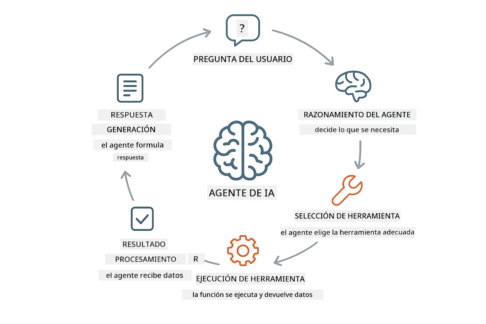
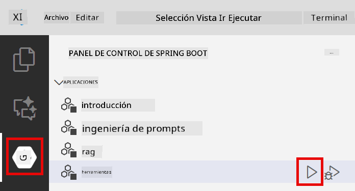

<!--
CO_OP_TRANSLATOR_METADATA:
{
  "original_hash": "aa23f106e7f53270924c9dd39c629004",
  "translation_date": "2025-12-13T18:20:05+00:00",
  "source_file": "04-tools/README.md",
  "language_code": "es"
}
-->
# Módulo 04: Agentes de IA con Herramientas

## Tabla de Contenidos

- [Lo que aprenderás](../../../04-tools)
- [Requisitos previos](../../../04-tools)
- [Entendiendo los agentes de IA con herramientas](../../../04-tools)
- [Cómo funciona la llamada a herramientas](../../../04-tools)
  - [Definiciones de herramientas](../../../04-tools)
  - [Toma de decisiones](../../../04-tools)
  - [Ejecución](../../../04-tools)
  - [Generación de respuestas](../../../04-tools)
- [Encadenamiento de herramientas](../../../04-tools)
- [Ejecutar la aplicación](../../../04-tools)
- [Usar la aplicación](../../../04-tools)
  - [Prueba de uso simple de herramientas](../../../04-tools)
  - [Prueba de encadenamiento de herramientas](../../../04-tools)
  - [Ver flujo de conversación](../../../04-tools)
  - [Observar el razonamiento](../../../04-tools)
  - [Experimentar con diferentes solicitudes](../../../04-tools)
- [Conceptos clave](../../../04-tools)
  - [Patrón ReAct (Razonar y Actuar)](../../../04-tools)
  - [Las descripciones de herramientas importan](../../../04-tools)
  - [Gestión de sesiones](../../../04-tools)
  - [Manejo de errores](../../../04-tools)
- [Herramientas disponibles](../../../04-tools)
- [Cuándo usar agentes basados en herramientas](../../../04-tools)
- [Próximos pasos](../../../04-tools)

## Lo que aprenderás

Hasta ahora, has aprendido cómo tener conversaciones con IA, estructurar prompts de manera efectiva y fundamentar respuestas en tus documentos. Pero aún existe una limitación fundamental: los modelos de lenguaje solo pueden generar texto. No pueden consultar el clima, realizar cálculos, consultar bases de datos o interactuar con sistemas externos.

Las herramientas cambian esto. Al darle al modelo acceso a funciones que puede llamar, lo transformas de un generador de texto en un agente que puede tomar acciones. El modelo decide cuándo necesita una herramienta, qué herramienta usar y qué parámetros pasar. Tu código ejecuta la función y devuelve el resultado. El modelo incorpora ese resultado en su respuesta.

## Requisitos previos

- Haber completado el Módulo 01 (recursos de Azure OpenAI desplegados)
- Archivo `.env` en el directorio raíz con credenciales de Azure (creado por `azd up` en el Módulo 01)

> **Nota:** Si no has completado el Módulo 01, sigue primero las instrucciones de despliegue allí.

## Entendiendo los agentes de IA con herramientas

Un agente de IA con herramientas sigue un patrón de razonamiento y acción (ReAct):

1. El usuario hace una pregunta
2. El agente razona sobre lo que necesita saber
3. El agente decide si necesita una herramienta para responder
4. Si es así, el agente llama a la herramienta apropiada con los parámetros correctos
5. La herramienta se ejecuta y devuelve datos
6. El agente incorpora el resultado y proporciona la respuesta final



*El patrón ReAct - cómo los agentes de IA alternan entre razonar y actuar para resolver problemas*

Esto sucede automáticamente. Defines las herramientas y sus descripciones. El modelo maneja la toma de decisiones sobre cuándo y cómo usarlas.

## Cómo funciona la llamada a herramientas

**Definiciones de herramientas** - [WeatherTool.java](../../../04-tools/src/main/java/com/example/langchain4j/agents/tools/WeatherTool.java) | [TemperatureTool.java](../../../04-tools/src/main/java/com/example/langchain4j/agents/tools/TemperatureTool.java)

Defines funciones con descripciones claras y especificaciones de parámetros. El modelo ve estas descripciones en su prompt del sistema y entiende qué hace cada herramienta.

```java
@Component
public class WeatherTool {
    
    @Tool("Get the current weather for a location")
    public String getCurrentWeather(@P("Location name") String location) {
        // Tu lógica de búsqueda del clima
        return "Weather in " + location + ": 22°C, cloudy";
    }
}

@AiService
public interface Assistant {
    String chat(@MemoryId String sessionId, @UserMessage String message);
}

// El asistente está conectado automáticamente por Spring Boot con:
// - Bean ChatModel
// - Todos los métodos @Tool de las clases @Component
// - ChatMemoryProvider para la gestión de sesiones
```

> **🤖 Prueba con [GitHub Copilot](https://github.com/features/copilot) Chat:** Abre [`WeatherTool.java`](../../../04-tools/src/main/java/com/example/langchain4j/agents/tools/WeatherTool.java) y pregunta:
> - "¿Cómo integraría una API real del clima como OpenWeatherMap en lugar de datos simulados?"
> - "¿Qué hace que una descripción de herramienta sea buena y ayude a la IA a usarla correctamente?"
> - "¿Cómo manejo errores de API y límites de tasa en implementaciones de herramientas?"

**Toma de decisiones**

Cuando un usuario pregunta "¿Cuál es el clima en Seattle?", el modelo reconoce que necesita la herramienta del clima. Genera una llamada a función con el parámetro de ubicación establecido en "Seattle".

**Ejecución** - [AgentService.java](../../../04-tools/src/main/java/com/example/langchain4j/agents/service/AgentService.java)

Spring Boot inyecta automáticamente la interfaz declarativa `@AiService` con todas las herramientas registradas, y LangChain4j ejecuta las llamadas a herramientas automáticamente.

> **🤖 Prueba con [GitHub Copilot](https://github.com/features/copilot) Chat:** Abre [`AgentService.java`](../../../04-tools/src/main/java/com/example/langchain4j/agents/service/AgentService.java) y pregunta:
> - "¿Cómo funciona el patrón ReAct y por qué es efectivo para agentes de IA?"
> - "¿Cómo decide el agente qué herramienta usar y en qué orden?"
> - "¿Qué pasa si falla la ejecución de una herramienta - cómo debo manejar errores de forma robusta?"

**Generación de respuestas**

El modelo recibe los datos del clima y los formatea en una respuesta en lenguaje natural para el usuario.

### ¿Por qué usar servicios de IA declarativos?

Este módulo usa la integración de LangChain4j con Spring Boot y las interfaces declarativas `@AiService`:

- **Inyección automática de Spring Boot** - ChatModel y herramientas inyectados automáticamente
- **Patrón @MemoryId** - Gestión automática de memoria basada en sesión
- **Instancia única** - Asistente creado una vez y reutilizado para mejor rendimiento
- **Ejecución con seguridad de tipos** - Métodos Java llamados directamente con conversión de tipos
- **Orquestación multi-turno** - Maneja encadenamiento de herramientas automáticamente
- **Cero código repetitivo** - Sin llamadas manuales a AiServices.builder() ni HashMap de memoria

Enfoques alternativos (manual `AiServices.builder()`) requieren más código y pierden beneficios de integración con Spring Boot.

## Encadenamiento de herramientas

**Encadenamiento de herramientas** - La IA puede llamar a múltiples herramientas en secuencia. Pregunta "¿Cuál es el clima en Seattle y debería llevar un paraguas?" y observa cómo encadena `getCurrentWeather` con razonamiento sobre equipo para lluvia.

<a href="images/tool-chaining.png"></a>

*Llamadas secuenciales a herramientas - la salida de una herramienta alimenta la siguiente decisión*

**Fallos elegantes** - Pide el clima en una ciudad que no está en los datos simulados. La herramienta devuelve un mensaje de error y la IA explica que no puede ayudar. Las herramientas fallan de forma segura.

Esto ocurre en un solo turno de conversación. El agente orquesta múltiples llamadas a herramientas de forma autónoma.

## Ejecutar la aplicación

**Verificar despliegue:**

Asegúrate de que el archivo `.env` exista en el directorio raíz con las credenciales de Azure (creado durante el Módulo 01):
```bash
cat ../.env  # Debe mostrar AZURE_OPENAI_ENDPOINT, API_KEY, DEPLOYMENT
```

**Iniciar la aplicación:**

> **Nota:** Si ya iniciaste todas las aplicaciones usando `./start-all.sh` del Módulo 01, este módulo ya está corriendo en el puerto 8084. Puedes saltarte los comandos de inicio a continuación e ir directamente a http://localhost:8084.

**Opción 1: Usar Spring Boot Dashboard (Recomendado para usuarios de VS Code)**

El contenedor de desarrollo incluye la extensión Spring Boot Dashboard, que proporciona una interfaz visual para gestionar todas las aplicaciones Spring Boot. Puedes encontrarla en la Barra de Actividad a la izquierda de VS Code (busca el ícono de Spring Boot).

Desde el Spring Boot Dashboard, puedes:
- Ver todas las aplicaciones Spring Boot disponibles en el espacio de trabajo
- Iniciar/detener aplicaciones con un solo clic
- Ver logs de la aplicación en tiempo real
- Monitorear el estado de la aplicación

Simplemente haz clic en el botón de reproducir junto a "tools" para iniciar este módulo, o inicia todos los módulos a la vez.



**Opción 2: Usar scripts de shell**

Inicia todas las aplicaciones web (módulos 01-04):

**Bash:**
```bash
cd ..  # Desde el directorio raíz
./start-all.sh
```

**PowerShell:**
```powershell
cd ..  # Desde el directorio raíz
.\start-all.ps1
```

O inicia solo este módulo:

**Bash:**
```bash
cd 04-tools
./start.sh
```

**PowerShell:**
```powershell
cd 04-tools
.\start.ps1
```

Ambos scripts cargan automáticamente las variables de entorno desde el archivo `.env` raíz y construirán los JARs si no existen.

> **Nota:** Si prefieres construir todos los módulos manualmente antes de iniciar:
>
> **Bash:**
> ```bash
> cd ..  # Go to root directory
> mvn clean package -DskipTests
> ```
>
> **PowerShell:**
> ```powershell
> cd ..  # Go to root directory
> mvn clean package -DskipTests
> ```

Abre http://localhost:8084 en tu navegador.

**Para detener:**

**Bash:**
```bash
./stop.sh  # Solo este módulo
# O
cd .. && ./stop-all.sh  # Todos los módulos
```

**PowerShell:**
```powershell
.\stop.ps1  # Solo este módulo
# O
cd ..; .\stop-all.ps1  # Todos los módulos
```

## Usar la aplicación

La aplicación proporciona una interfaz web donde puedes interactuar con un agente de IA que tiene acceso a herramientas de clima y conversión de temperatura.

<a href="images/tools-homepage.png"></a>

*Interfaz de herramientas del agente de IA - ejemplos rápidos e interfaz de chat para interactuar con herramientas*

**Prueba de uso simple de herramientas**

Comienza con una solicitud sencilla: "Convierte 100 grados Fahrenheit a Celsius". El agente reconoce que necesita la herramienta de conversión de temperatura, la llama con los parámetros correctos y devuelve el resultado. Nota lo natural que se siente: no especificaste qué herramienta usar ni cómo llamarla.

**Prueba de encadenamiento de herramientas**

Ahora prueba algo más complejo: "¿Cuál es el clima en Seattle y conviértelo a Fahrenheit?" Observa cómo el agente trabaja esto en pasos. Primero obtiene el clima (que devuelve en Celsius), reconoce que necesita convertir a Fahrenheit, llama a la herramienta de conversión y combina ambos resultados en una sola respuesta.

**Ver flujo de conversación**

La interfaz de chat mantiene el historial de conversación, permitiéndote tener interacciones multi-turno. Puedes ver todas las consultas y respuestas previas, facilitando seguir la conversación y entender cómo el agente construye contexto a lo largo de múltiples intercambios.

<a href="images/tools-conversation-demo.png"></a>

*Conversación multi-turno mostrando conversiones simples, consultas de clima y encadenamiento de herramientas*

**Experimentar con diferentes solicitudes**

Prueba varias combinaciones:
- Consultas de clima: "¿Cuál es el clima en Tokio?"
- Conversiones de temperatura: "¿Cuánto es 25°C en Kelvin?"
- Consultas combinadas: "Consulta el clima en París y dime si está por encima de 20°C"

Observa cómo el agente interpreta el lenguaje natural y lo mapea a llamadas apropiadas a herramientas.

## Conceptos clave

**Patrón ReAct (Razonar y Actuar)**

El agente alterna entre razonar (decidir qué hacer) y actuar (usar herramientas). Este patrón permite resolver problemas de forma autónoma en lugar de solo responder instrucciones.

**Las descripciones de herramientas importan**

La calidad de las descripciones de tus herramientas afecta directamente qué tan bien el agente las usa. Descripciones claras y específicas ayudan al modelo a entender cuándo y cómo llamar cada herramienta.

**Gestión de sesiones**

La anotación `@MemoryId` habilita la gestión automática de memoria basada en sesión. Cada ID de sesión obtiene su propia instancia de `ChatMemory` gestionada por el bean `ChatMemoryProvider`, eliminando la necesidad de seguimiento manual de memoria.

**Manejo de errores**

Las herramientas pueden fallar: APIs pueden agotar tiempo, parámetros pueden ser inválidos, servicios externos pueden caerse. Los agentes en producción necesitan manejo de errores para que el modelo pueda explicar problemas o intentar alternativas.

## Herramientas disponibles

**Herramientas de clima** (datos simulados para demostración):
- Obtener clima actual para una ubicación
- Obtener pronóstico de varios días

**Herramientas de conversión de temperatura**:
- Celsius a Fahrenheit
- Fahrenheit a Celsius
- Celsius a Kelvin
- Kelvin a Celsius
- Fahrenheit a Kelvin
- Kelvin a Fahrenheit

Estos son ejemplos simples, pero el patrón se extiende a cualquier función: consultas a bases de datos, llamadas a APIs, cálculos, operaciones con archivos o comandos del sistema.

## Cuándo usar agentes basados en herramientas

**Usa herramientas cuando:**
- Responder requiere datos en tiempo real (clima, precios de acciones, inventario)
- Necesitas realizar cálculos más allá de matemáticas simples
- Acceder a bases de datos o APIs
- Tomar acciones (enviar correos, crear tickets, actualizar registros)
- Combinar múltiples fuentes de datos

**No uses herramientas cuando:**
- Las preguntas pueden responderse con conocimiento general
- La respuesta es puramente conversacional
- La latencia de la herramienta haría la experiencia demasiado lenta

## Próximos pasos

**Próximo módulo:** [05-mcp - Protocolo de Contexto de Modelo (MCP)](../05-mcp/README.md)

---

**Navegación:** [← Anterior: Módulo 03 - RAG](../03-rag/README.md) | [Volver al inicio](../README.md) | [Siguiente: Módulo 05 - MCP →](../05-mcp/README.md)

---

<!-- CO-OP TRANSLATOR DISCLAIMER START -->
**Aviso legal**:
Este documento ha sido traducido utilizando el servicio de traducción automática [Co-op Translator](https://github.com/Azure/co-op-translator). Aunque nos esforzamos por la precisión, tenga en cuenta que las traducciones automáticas pueden contener errores o inexactitudes. El documento original en su idioma nativo debe considerarse la fuente autorizada. Para información crítica, se recomienda una traducción profesional realizada por humanos. No nos hacemos responsables de malentendidos o interpretaciones erróneas derivadas del uso de esta traducción.
<!-- CO-OP TRANSLATOR DISCLAIMER END -->