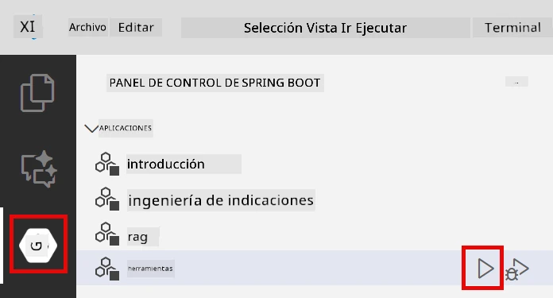
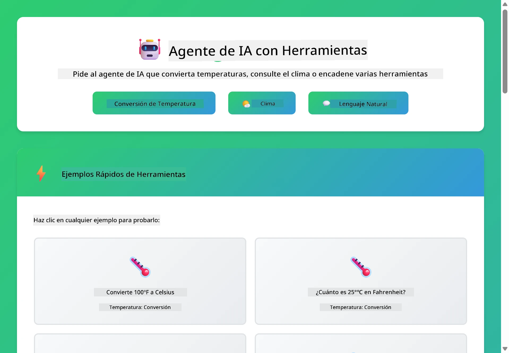
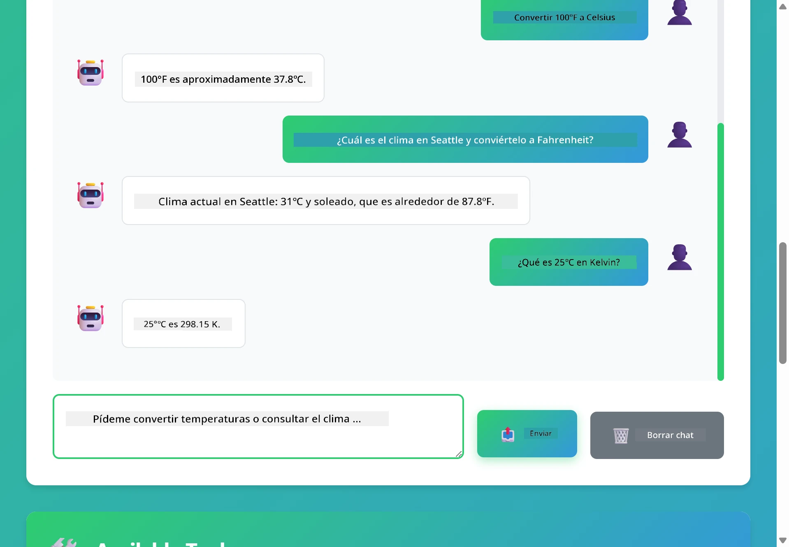

# Módulo 04: Agentes de IA con Herramientas

## Tabla de Contenidos

- [Video Tutorial](#video-tutorial)
- [Lo Que Aprenderás](#lo-que-aprenderás)
- [Prerequisitos](#prerequisitos)
- [Entendiendo Agentes de IA con Herramientas](#entendiendo-agentes-de-ia-con-herramientas)
- [Cómo Funciona la Llamada a Herramientas](#cómo-funciona-la-llamada-a-herramientas)
  - [Definiciones de Herramientas](#definiciones-de-herramientas)
  - [Toma de Decisiones](#toma-de-decisiones)
  - [Ejecución](#ejecución)
  - [Generación de la Respuesta](#generación-de-la-respuesta)
  - [Arquitectura: Auto-conexión con Spring Boot](#arquitectura-auto-conexión-con-spring-boot)
- [Encadenamiento de Herramientas](#encadenamiento-de-herramientas)
- [Ejecutar la Aplicación](#ejecutar-la-aplicación)
- [Usar la Aplicación](#uso-de-la-aplicación)
  - [Prueba de Uso Simple de Herramientas](#prueba-el-uso-simple-de-herramientas)
  - [Prueba el Encadenamiento de Herramientas](#prueba-la-cadena-de-herramientas)
  - [Ver Flujo de Conversación](#observa-el-flujo-de-conversación)
  - [Experimenta con Diferentes Solicitudes](#experimenta-con-diferentes-solicitudes)
- [Conceptos Clave](#conceptos-clave)
  - [Patrón ReAct (Razonar y Actuar)](#patrón-react-razonar-y-actuar)
  - [Las Descripciones de las Herramientas Importan](#las-descripciones-de-herramientas-importan)
  - [Gestión de Sesiones](#gestión-de-sesiones)
  - [Manejo de Errores](#manejo-de-errores)
- [Herramientas Disponibles](#herramientas-disponibles)
- [Cuándo Usar Agentes Basados en Herramientas](#cuándo-usar-agentes-basados-en-herramientas)
- [Herramientas vs RAG](#herramientas-vs-rag)
- [Próximos Pasos](#próximos-pasos)

## Video Tutorial

Mira esta sesión en vivo que explica cómo comenzar con este módulo:

<a href="https://www.youtube.com/watch?v=O_J30kZc0rw"></a>

## Lo Que Aprenderás

Hasta ahora, has aprendido cómo mantener conversaciones con IA, estructurar prompts de manera efectiva y fundamentar respuestas en tus documentos. Pero todavía hay una limitación fundamental: los modelos de lenguaje solo pueden generar texto. No pueden consultar el clima, realizar cálculos, consultar bases de datos ni interactuar con sistemas externos.

Las herramientas cambian esto. Al darle al modelo acceso a funciones que puede llamar, lo transformas de un generador de texto a un agente que puede tomar acciones. El modelo decide cuándo necesita una herramienta, qué herramienta usar y qué parámetros pasar. Tu código ejecuta la función y devuelve el resultado. El modelo incorpora ese resultado en su respuesta.

## Prerequisitos

- Haber completado [Módulo 01 - Introducción](../01-introduction/README.md) (recursos Azure OpenAI desplegados)
- Se recomiendan módulos previos completados (este módulo refiere a [conceptos de RAG del Módulo 03](../03-rag/README.md) en la comparación Herramientas vs RAG)
- Archivo `.env` en el directorio raíz con credenciales Azure (creado por `azd up` en el Módulo 01)

> **Nota:** Si no has completado el Módulo 01, sigue primero las instrucciones de despliegue ahí.

## Entendiendo Agentes de IA con Herramientas

> **📝 Nota:** El término "agentes" en este módulo se refiere a asistentes de IA mejorados con capacidad de llamada a herramientas. Esto es diferente a los patrones de **Agentes Autónomos** (agentes autónomos con planificación, memoria y razonamiento multietapa) que cubriremos en [Módulo 05: MCP](../05-mcp/README.md).

Sin herramientas, un modelo de lenguaje solo puede generar texto de sus datos de entrenamiento. Pregúntale por el clima actual, y debe adivinar. Dale herramientas, y puede llamar a una API del clima, realizar cálculos o consultar una base de datos — luego teje esos resultados reales en su respuesta.


*Sin herramientas el modelo solo puede adivinar — con herramientas puede llamar APIs, hacer cálculos y devolver datos en tiempo real.*

Un agente de IA con herramientas sigue un patrón de **Razonar y Actuar (ReAct)**. El modelo no solo responde — piensa en lo que necesita, actúa llamando a una herramienta, observa el resultado, y luego decide si actuar de nuevo o entregar la respuesta final:

1. **Razonar** — El agente analiza la pregunta del usuario y determina qué información necesita
2. **Actuar** — El agente selecciona la herramienta correcta, genera los parámetros adecuados y la llama
3. **Observar** — El agente recibe el resultado de la herramienta y evalúa
4. **Repetir o Responder** — Si necesita más datos, vuelve al paso 1; si no, compone una respuesta en lenguaje natural


*El ciclo ReAct — el agente razona qué hacer, actúa llamando una herramienta, observa el resultado y repite hasta entregar la respuesta final.*

Esto sucede automáticamente. Definiste las herramientas y sus descripciones. El modelo maneja la toma de decisiones sobre cuándo y cómo usarlas.

## Cómo Funciona la Llamada a Herramientas

### Definiciones de Herramientas

[WeatherTool.java](../../../04-tools/src/main/java/com/example/langchain4j/agents/tools/WeatherTool.java) | [TemperatureTool.java](../../../04-tools/src/main/java/com/example/langchain4j/agents/tools/TemperatureTool.java)

Defines funciones con descripciones claras y especificaciones de parámetros. El modelo ve estas descripciones en su prompt de sistema y entiende qué hace cada herramienta.

```java
@Component
public class WeatherTool {
    
    @Tool("Get the current weather for a location")
    public String getCurrentWeather(@P("Location name") String location) {
        // Tu lógica de búsqueda del clima
        return "Weather in " + location + ": 22°C, cloudy";
    }
}

@AiService
public interface Assistant {
    String chat(@MemoryId String sessionId, @UserMessage String message);
}

// El asistente está automáticamente conectado por Spring Boot con:
// - Bean ChatModel
// - Todos los métodos @Tool de las clases @Component
// - ChatMemoryProvider para la gestión de sesiones
```

El diagrama a continuación desglosa cada anotación y muestra cómo cada parte ayuda a la IA a entender cuándo llamar a la herramienta y qué argumentos pasar:


*Anatomía de una definición de herramienta — @Tool le dice a la IA cuándo usarla, @P describe cada parámetro, y @AiService conecta todo junto al iniciar.*

> **🤖 Prueba con [GitHub Copilot](https://github.com/features/copilot) Chat:** Abre [`WeatherTool.java`](../../../04-tools/src/main/java/com/example/langchain4j/agents/tools/WeatherTool.java) y pregunta:
> - "¿Cómo integraría una API real del clima como OpenWeatherMap en lugar de datos simulados?"
> - "¿Qué hace una buena descripción de herramienta que ayuda a la IA a usarla correctamente?"
> - "¿Cómo manejo errores de API y límites de tasa en la implementación de herramientas?"

### Toma de Decisiones

Cuando un usuario pregunta "¿Cuál es el clima en Seattle?", el modelo no elige una herramienta al azar. Compara la intención del usuario con todas las descripciones de herramientas a las que tiene acceso, califica cada una en relevancia y selecciona la mejor. Luego genera una llamada de función estructurada con los parámetros correctos — en este caso, ajustando `location` a `"Seattle"`.

Si ninguna herramienta coincide con la solicitud del usuario, el modelo responde con base en su propio conocimiento. Si múltiples herramientas coinciden, elige la más específica.


*El modelo evalúa cada herramienta disponible contra la intención del usuario y selecciona la mejor coincidencia — por eso es importante escribir descripciones claras y específicas de herramientas.*

### Ejecución

[AgentService.java](../../../04-tools/src/main/java/com/example/langchain4j/agents/service/AgentService.java)

Spring Boot conecta automáticamente la interfaz declarativa `@AiService` con todas las herramientas registradas, y LangChain4j ejecuta las llamadas a herramientas automáticamente. Detrás de escena, una llamada completa a herramienta atraviesa seis etapas — desde la pregunta en lenguaje natural del usuario hasta la respuesta también en lenguaje natural:


*El flujo de extremo a extremo — el usuario hace una pregunta, el modelo selecciona una herramienta, LangChain4j la ejecuta y el modelo integra el resultado en una respuesta natural.*

Por detrás, `AiServices` ejecuta el mismo ciclo de llamada a herramientas para cualquier herramienta — aquí ilustrado con un simple `Calculator`. El diagrama de secuencia a continuación muestra exactamente qué sucede internamente:


*El ciclo de llamada a herramientas — `AiServices` envía tu mensaje y esquemas de herramientas al LLM, el LLM responde con una llamada de función como `add(42, 58)`, LangChain4j ejecuta el método `Calculator` localmente y envía el resultado para la respuesta final.*

> **🤖 Prueba con [GitHub Copilot](https://github.com/features/copilot) Chat:** Abre [`AgentService.java`](../../../04-tools/src/main/java/com/example/langchain4j/agents/service/AgentService.java) y pregunta:
> - "¿Cómo funciona el patrón ReAct y por qué es efectivo para agentes de IA?"
> - "¿Cómo decide el agente qué herramienta usar y en qué orden?"
> - "¿Qué pasa si falla la ejecución de una herramienta — cómo manejar errores de forma robusta?"

### Generación de la Respuesta

El modelo recibe los datos del clima y los formatea en una respuesta en lenguaje natural para el usuario.

### Arquitectura: Auto-conexión con Spring Boot

Este módulo usa la integración de LangChain4j con Spring Boot mediante interfaces declarativas `@AiService`. Al iniciar, Spring Boot descubre cada `@Component` que contiene métodos `@Tool`, tu bean `ChatModel` y el `ChatMemoryProvider` — luego los conecta todos en una sola interfaz `Assistant` sin código repetitivo.


*La interfaz @AiService une el ChatModel, componentes de herramientas y el proveedor de memoria — Spring Boot maneja toda la conexión automáticamente.*

Aquí está el ciclo completo de la solicitud como diagrama de secuencia — desde la petición HTTP pasando por el controlador, servicio y proxy auto-conectado, hasta la ejecución de la herramienta y regreso:


*Ciclo completo de solicitud Spring Boot — la petición HTTP pasa por el controlador y servicio al proxy Assistant auto-conectado, que orquesta el LLM y llamadas a herramientas automáticamente.*

Beneficios clave de este enfoque:

- **Auto-conexión en Spring Boot** — ChatModel y herramientas inyectadas automáticamente
- **Patrón @MemoryId** — Gestión automática de memoria por sesión
- **Instancia única** — Assistant creado una vez y reutilizado para mejor rendimiento
- **Ejecución segura en tipos** — Métodos Java llamados directamente con conversión de tipos
- **Orquestación multivuelta** — Maneja encadenamiento de herramientas automáticamente
- **Cero boilerplate** — Sin llamadas manuales a `AiServices.builder()` ni mapas de memoria

Enfoques alternativos (manual `AiServices.builder()`) requieren más código y pierden beneficios de integración con Spring Boot.

## Encadenamiento de Herramientas

**Encadenamiento de Herramientas** — El poder real de agentes basados en herramientas se muestra cuando una sola pregunta requiere múltiples herramientas. Pregunta "¿Cuál es el clima en Seattle en Fahrenheit?" y el agente encadena automáticamente dos herramientas: primero llama a `getCurrentWeather` para obtener la temperatura en Celsius, luego pasa ese valor a `celsiusToFahrenheit` para convertirlo — todo en una sola vuelta de conversación.


*Encadenamiento de herramientas en acción — el agente llama primero getCurrentWeather, luego pasa el resultado en Celsius a celsiusToFahrenheit y entrega una respuesta combinada.*

**Fallas Graceful** — Pide el clima en una ciudad que no está en los datos simulados. La herramienta devuelve un mensaje de error, y la IA explica que no puede ayudar en lugar de fallar. Las herramientas fallan de forma segura. El diagrama a continuación contrasta los dos enfoques — con manejo adecuado de errores, el agente captura la excepción y responde con ayuda, mientras que sin él la aplicación entera falla:


*Cuando una herramienta falla, el agente atrapa el error y responde con una explicación útil en lugar de fallar.*

Esto ocurre en una sola vuelta de conversación. El agente orquesta múltiples llamadas a herramientas autónomamente.

## Ejecutar la Aplicación

**Verifica el despliegue:**

Asegúrate de que el archivo `.env` exista en el directorio raíz con credenciales Azure (creado durante el Módulo 01). Ejecuta esto desde el directorio del módulo (`04-tools/`):

**Bash:**
```bash
cat ../.env  # Debe mostrar AZURE_OPENAI_ENDPOINT, API_KEY, DEPLOYMENT
```

**PowerShell:**
```powershell
Get-Content ..\.env  # Debe mostrar AZURE_OPENAI_ENDPOINT, API_KEY, DEPLOYMENT
```

**Inicia la aplicación:**

> **Nota:** Si ya iniciaste todas las aplicaciones usando `./start-all.sh` desde el directorio raíz (como se describió en el Módulo 01), este módulo ya está corriendo en el puerto 8084. Puedes saltarte los comandos de inicio y abrir directamente http://localhost:8084.

**Opción 1: Usar el Spring Boot Dashboard (Recomendado para usuarios de VS Code)**

El contenedor de desarrollo incluye la extensión Spring Boot Dashboard, que ofrece una interfaz visual para manejar todas las aplicaciones Spring Boot. Puedes encontrarla en la Barra de Actividades al lado izquierdo de VS Code (busca el ícono de Spring Boot).

Desde Spring Boot Dashboard puedes:
- Ver todas las aplicaciones Spring Boot disponibles en el área de trabajo
- Iniciar/detener aplicaciones con un solo click
- Ver logs de la aplicación en tiempo real
- Monitorear el estado de las aplicaciones

Solo haz clic en el botón de reproducir junto a "tools" para iniciar este módulo, o inicia todos los módulos a la vez.

Así se ve Spring Boot Dashboard en VS Code:


*El Panel de Spring Boot en VS Code: inicia, detén y monitorea todos los módulos desde un solo lugar*

**Opción 2: Usando scripts shell**

Inicia todas las aplicaciones web (módulos 01-04):

**Bash:**
```bash
cd ..  # Desde el directorio raíz
./start-all.sh
```

**PowerShell:**
```powershell
cd ..  # Desde el directorio raíz
.\start-all.ps1
```

O inicia solo este módulo:

**Bash:**
```bash
cd 04-tools
./start.sh
```

**PowerShell:**
```powershell
cd 04-tools
.\start.ps1
```

Ambos scripts cargan automáticamente las variables de entorno desde el archivo `.env` raíz y compilarán los JAR si no existen.

> **Nota:** Si prefieres compilar todos los módulos manualmente antes de iniciar:
>
> **Bash:**
> ```bash
> cd ..  # Go to root directory
> mvn clean package -DskipTests
> ```
>
> **PowerShell:**
> ```powershell
> cd ..  # Go to root directory
> mvn clean package -DskipTests
> ```

Abre http://localhost:8084 en tu navegador.

**Para detener:**

**Bash:**
```bash
./stop.sh  # Solo este módulo
# O
cd .. && ./stop-all.sh  # Todos los módulos
```

**PowerShell:**
```powershell
.\stop.ps1  # Solo este módulo
# O
cd ..; .\stop-all.ps1  # Todos los módulos
```

## Uso de la Aplicación

La aplicación ofrece una interfaz web donde puedes interactuar con un agente de IA que tiene acceso a herramientas de clima y conversión de temperatura. Así es como se ve la interfaz: incluye ejemplos de inicio rápido y un panel de chat para enviar solicitudes:

<a href="images/tools-homepage.png"></a>

*La interfaz de Herramientas del Agente IA - ejemplos rápidos e interfaz de chat para interactuar con las herramientas*

### Prueba el Uso Simple de Herramientas

Comienza con una solicitud sencilla: "Convierte 100 grados Fahrenheit a Celsius". El agente reconoce que necesita la herramienta de conversión de temperatura, la usa con los parámetros correctos y devuelve el resultado. Observa lo natural que se siente: no especificaste qué herramienta usar ni cómo llamarla.

### Prueba la Cadena de Herramientas

Ahora intenta algo más complejo: "¿Cuál es el clima en Seattle y conviértelo a Fahrenheit?" Mira cómo el agente trabaja paso a paso. Primero obtiene el clima (que devuelve en Celsius), reconoce que debe convertir a Fahrenheit, llama a la herramienta de conversión y combina ambos resultados en una sola respuesta.

### Observa el Flujo de Conversación

La interfaz de chat mantiene el historial de la conversación, permitiéndote tener interacciones de varios turnos. Puedes ver todas las consultas y respuestas anteriores, facilitando seguir la conversación y entender cómo el agente construye contexto a través de múltiples intercambios.

<a href="images/tools-conversation-demo.png"></a>

*Conversación de múltiples turnos mostrando conversiones simples, consultas del clima y encadenamiento de herramientas*

### Experimenta con Diferentes Solicitudes

Prueba varias combinaciones:
- Consultas del clima: "¿Cuál es el clima en Tokio?"
- Conversiones de temperatura: "¿Cuánto es 25°C en Kelvin?"
- Consultas combinadas: "Consulta el clima en París y dime si está arriba de 20°C"

Observa cómo el agente interpreta el lenguaje natural y lo mapea a llamadas apropiadas a herramientas.

## Conceptos Clave

### Patrón ReAct (Razonar y Actuar)

El agente alterna entre razonar (decidir qué hacer) y actuar (usar herramientas). Este patrón permite resolver problemas de forma autónoma en lugar de solo responder instrucciones.

### Las Descripciones de Herramientas Importan

La calidad de las descripciones de tus herramientas afecta directamente qué tan bien el agente las usa. Descripciones claras y específicas ayudan al modelo a entender cuándo y cómo llamar cada herramienta.

### Gestión de Sesiones

La anotación `@MemoryId` permite la gestión automática de memoria basada en sesiones. Cada ID de sesión obtiene su propia instancia de `ChatMemory` gestionada por el bean `ChatMemoryProvider`, por lo que múltiples usuarios pueden interactuar con el agente simultáneamente sin mezclar sus conversaciones. El siguiente diagrama muestra cómo múltiples usuarios son dirigidos a almacenes de memoria aislados según sus IDs de sesión:


*Cada ID de sesión se mapea a un historial de conversación aislado — los usuarios nunca ven los mensajes de los demás.*

### Manejo de Errores

Las herramientas pueden fallar — las APIs pueden tener tiempo de espera, parámetros podrían ser inválidos, servicios externos pueden caerse. Los agentes en producción necesitan manejo de errores para que el modelo pueda explicar problemas o intentar alternativas en vez de que toda la aplicación falle. Cuando una herramienta lanza una excepción, LangChain4j la captura y envía el mensaje de error de vuelta al modelo, el cual puede explicar el problema en lenguaje natural.

## Herramientas Disponibles

El diagrama a continuación muestra el amplio ecosistema de herramientas que puedes construir. Este módulo demuestra herramientas de clima y temperatura, pero el mismo patrón `@Tool` funciona para cualquier método Java — desde consultas a bases de datos hasta procesamiento de pagos.


*Cualquier método Java anotado con @Tool está disponible para la IA — el patrón se extiende a bases de datos, APIs, correo, operaciones de archivos y más.*

## Cuándo Usar Agentes Basados en Herramientas

No todas las solicitudes necesitan herramientas. La decisión depende de si la IA necesita interactuar con sistemas externos o puede responder desde su propio conocimiento. La guía siguiente resume cuándo las herramientas agregan valor y cuándo no son necesarias:


*Guía rápida de decisión: las herramientas son para datos en tiempo real, cálculos y acciones; el conocimiento general y tareas creativas no las necesitan.*

## Herramientas vs RAG

Los módulos 03 y 04 amplían lo que la IA puede hacer, pero de formas fundamentalmente diferentes. RAG le da al modelo acceso a **conocimiento** recuperando documentos. Las herramientas le dan la capacidad de tomar **acciones** llamando funciones. El diagrama a continuación compara estos dos enfoques lado a lado — desde cómo funciona cada flujo de trabajo hasta sus compromisos:


*RAG recupera información de documentos estáticos — Herramientas ejecutan acciones y obtienen datos dinámicos en tiempo real. Muchos sistemas en producción combinan ambos.*

En la práctica, muchos sistemas de producción combinan ambos enfoques: RAG para fundamentar respuestas en tu documentación, y Herramientas para obtener datos en vivo o realizar operaciones.

## Próximos Pasos

**Siguiente módulo:** [05-mcp - Protocolo de Contexto de Modelo (MCP)](../05-mcp/README.md)

---

**Navegación:** [← Anterior: Módulo 03 - RAG](../03-rag/README.md) | [Volver al Inicio](../README.md) | [Siguiente: Módulo 05 - MCP →](../05-mcp/README.md)

---

<!-- CO-OP TRANSLATOR DISCLAIMER START -->
**Descargo de responsabilidad**:
Este documento ha sido traducido utilizando el servicio de traducción automática [Co-op Translator](https://github.com/Azure/co-op-translator). Aunque nos esforzamos por la precisión, tenga en cuenta que las traducciones automatizadas pueden contener errores o inexactitudes. El documento original en su idioma nativo debe considerarse la fuente autorizada. Para información crítica, se recomienda una traducción profesional humana. No somos responsables de cualquier malentendido o interpretación errónea que surja del uso de esta traducción.
<!-- CO-OP TRANSLATOR DISCLAIMER END -->