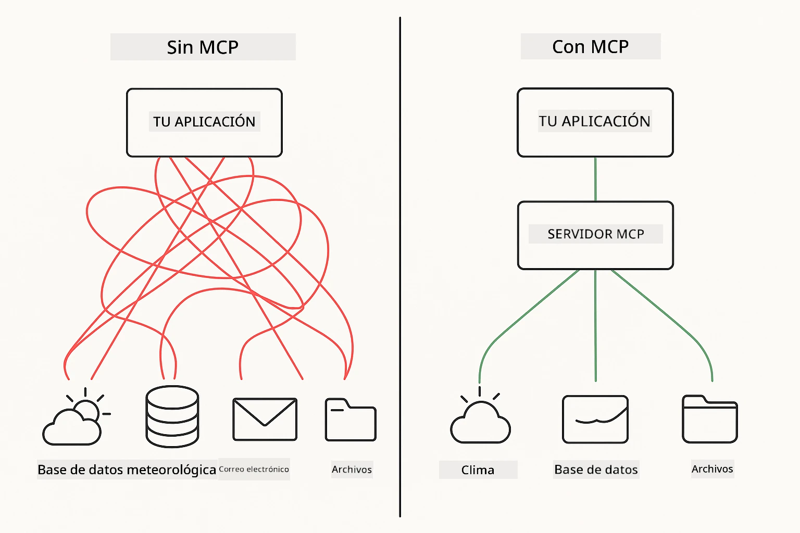
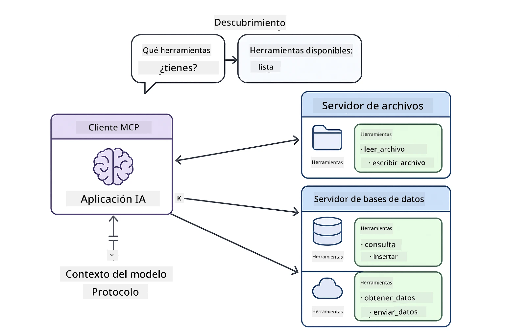
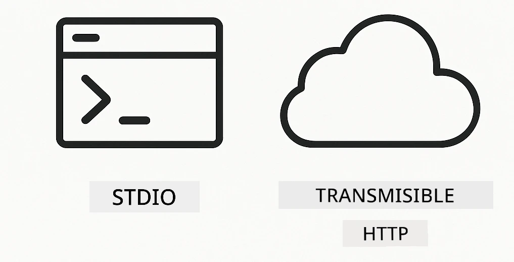
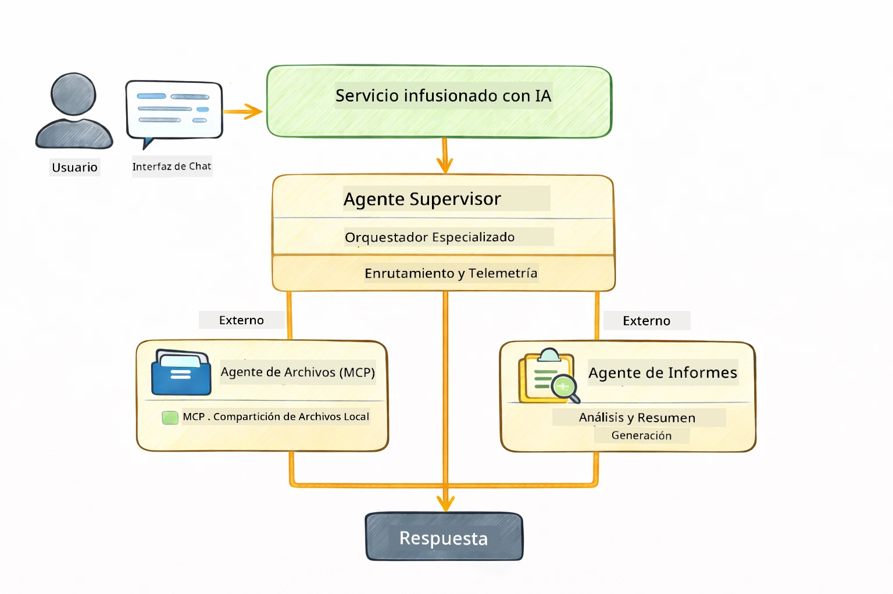

# Módulo 05: Protocolo de Contexto del Modelo (MCP)

## Tabla de Contenidos

- [Lo que Aprenderás](../../../05-mcp)
- [¿Qué es MCP?](../../../05-mcp)
- [Cómo Funciona MCP](../../../05-mcp)
- [El Módulo Agéntico](../../../05-mcp)
- [Ejecutando los Ejemplos](../../../05-mcp)
  - [Prerrequisitos](../../../05-mcp)
- [Inicio Rápido](../../../05-mcp)
  - [Operaciones con Archivos (Stdio)](../../../05-mcp)
  - [Agente Supervisor](../../../05-mcp)
    - [Entendiendo la Salida](../../../05-mcp)
    - [Estrategias de Respuesta](../../../05-mcp)
    - [Explicación de las Características del Módulo Agéntico](../../../05-mcp)
- [Conceptos Clave](../../../05-mcp)
- [¡Felicidades!](../../../05-mcp)
  - [¿Qué Sigue?](../../../05-mcp)

## Lo que Aprenderás

Has construido inteligencia artificial conversacional, dominado los prompts, fundamentado respuestas en documentos, y creado agentes con herramientas. Pero todas esas herramientas fueron hechas a medida para tu aplicación específica. ¿Y si pudieras darle a tu IA acceso a un ecosistema estandarizado de herramientas que cualquiera pueda crear y compartir? En este módulo, aprenderás a hacer justo eso con el Protocolo de Contexto del Modelo (MCP) y el módulo agéntico de LangChain4j. Primero mostramos un lector de archivos MCP simple y luego cómo se integra fácilmente en flujos de trabajo agénticos avanzados usando el patrón Agente Supervisor.

## ¿Qué es MCP?

El Protocolo de Contexto del Modelo (MCP) proporciona exactamente eso: una forma estándar para que aplicaciones de IA descubran y usen herramientas externas. En lugar de escribir integraciones personalizadas para cada fuente de datos o servicio, te conectas a servidores MCP que exponen sus capacidades en un formato consistente. Tu agente de IA puede entonces descubrir y usar estas herramientas automáticamente.



*Antes de MCP: Integraciones punto a punto complejas. Después de MCP: Un protocolo, infinitas posibilidades.*

MCP resuelve un problema fundamental en el desarrollo de IA: cada integración es personalizada. ¿Quieres acceder a GitHub? Código personalizado. ¿Quieres leer archivos? Código personalizado. ¿Quieres consultar una base de datos? Código personalizado. Y ninguna de estas integraciones funciona con otras aplicaciones de IA.

MCP estandariza esto. Un servidor MCP expone herramientas con descripciones claras y esquemas. Cualquier cliente MCP puede conectarse, descubrir herramientas disponibles y usarlas. Construye una vez, usa en todas partes.



*Arquitectura del Protocolo de Contexto del Modelo: descubrimiento y ejecución de herramientas estandarizadas*

## Cómo Funciona MCP

**Arquitectura Cliente-Servidor**

MCP usa un modelo cliente-servidor. Los servidores proveen herramientas - lectura de archivos, consultas a bases de datos, llamadas a APIs. Los clientes (tu aplicación IA) se conectan a los servidores y usan sus herramientas.

Para usar MCP con LangChain4j, agrega esta dependencia Maven:

```xml
<dependency>
    <groupId>dev.langchain4j</groupId>
    <artifactId>langchain4j-mcp</artifactId>
    <version>${langchain4j.version}</version>
</dependency>
```

**Descubrimiento de Herramientas**

Cuando tu cliente se conecta a un servidor MCP, pregunta "¿Qué herramientas tienes?" El servidor responde con una lista de herramientas disponibles, cada una con descripciones y esquemas de parámetros. Tu agente de IA puede entonces decidir qué herramientas usar basándose en las solicitudes del usuario.

**Mecanismos de Transporte**

MCP soporta diferentes mecanismos de transporte. Este módulo demuestra el transporte Stdio para procesos locales:



*Mecanismos de transporte MCP: HTTP para servidores remotos, Stdio para procesos locales*

**Stdio** - [StdioTransportDemo.java](../../../05-mcp/src/main/java/com/example/langchain4j/mcp/StdioTransportDemo.java)

Para procesos locales. Tu aplicación inicia un servidor como un subproceso y se comunica a través de entrada/salida estándar. Útil para acceso al sistema de archivos o herramientas de línea de comandos.

```java
McpTransport stdioTransport = new StdioMcpTransport.Builder()
    .command(List.of(
        npmCmd, "exec",
        "@modelcontextprotocol/server-filesystem@2025.12.18",
        resourcesDir
    ))
    .logEvents(false)
    .build();
```

> **🤖 Prueba con el Chat de [GitHub Copilot](https://github.com/features/copilot):** Abre [`StdioTransportDemo.java`](../../../05-mcp/src/main/java/com/example/langchain4j/mcp/StdioTransportDemo.java) y pregunta:
> - "¿Cómo funciona el transporte Stdio y cuándo debo usarlo en lugar de HTTP?"
> - "¿Cómo maneja LangChain4j el ciclo de vida de los procesos de servidores MCP lanzados?"
> - "¿Cuáles son las implicaciones de seguridad al darle a la IA acceso al sistema de archivos?"

## El Módulo Agéntico

Mientras MCP provee herramientas estandarizadas, el **módulo agéntico** de LangChain4j proporciona una forma declarativa de construir agentes que orquestan esas herramientas. La anotación `@Agent` y `AgenticServices` te permiten definir el comportamiento del agente mediante interfaces en lugar de código imperativo.

En este módulo, explorarás el patrón **Agente Supervisor** — un enfoque avanzado de IA agéntica donde un agente "supervisor" decide dinámicamente qué sub-agentes invocar basándose en las solicitudes del usuario. Combinaremos ambos conceptos dando a uno de nuestros sub-agentes capacidades de acceso a archivos impulsadas por MCP.

Para usar el módulo agéntico, agrega esta dependencia Maven:

```xml
<dependency>
    <groupId>dev.langchain4j</groupId>
    <artifactId>langchain4j-agentic</artifactId>
    <version>${langchain4j.mcp.version}</version>
</dependency>
```

> **⚠️ Experimental:** El módulo `langchain4j-agentic` es **experimental** y está sujeto a cambios. La forma estable de construir asistentes IA sigue siendo `langchain4j-core` con herramientas personalizadas (Módulo 04).

## Ejecutando los Ejemplos

### Prerrequisitos

- Java 21+, Maven 3.9+
- Node.js 16+ y npm (para servidores MCP)
- Variables de entorno configuradas en archivo `.env` (desde el directorio raíz):
  - `AZURE_OPENAI_ENDPOINT`, `AZURE_OPENAI_API_KEY`, `AZURE_OPENAI_DEPLOYMENT` (igual que en Módulos 01-04)

> **Nota:** Si aún no has configurado tus variables de entorno, consulta [Módulo 00 - Inicio Rápido](../00-quick-start/README.md) para instrucciones, o copia `.env.example` a `.env` en el directorio raíz y completa tus valores.

## Inicio Rápido

**Usando VS Code:** Simplemente haz clic derecho en cualquier archivo demo en el Explorador y selecciona **"Run Java"**, o usa las configuraciones de lanzamiento desde el panel Ejecutar y Depurar (asegúrate primero de haber agregado tu token al archivo `.env`).

**Usando Maven:** Alternativamente, puedes ejecutar desde la línea de comandos con los ejemplos a continuación.

### Operaciones con Archivos (Stdio)

Esto demuestra herramientas basadas en subprocesos locales.

**✅ No se necesitan prerrequisitos** - el servidor MCP se inicia automáticamente.

**Usando los Scripts de Inicio (Recomendado):**

Los scripts de inicio cargan automáticamente las variables de entorno desde el archivo `.env` raíz:

**Bash:**
```bash
cd 05-mcp
chmod +x start-stdio.sh
./start-stdio.sh
```

**PowerShell:**
```powershell
cd 05-mcp
.\start-stdio.ps1
```

**Usando VS Code:** Haz clic derecho en `StdioTransportDemo.java` y selecciona **"Run Java"** (asegúrate que tu archivo `.env` esté configurado).

La aplicación inicia un servidor MCP de sistema de archivos automáticamente y lee un archivo local. Observa cómo se maneja la gestión del subproceso para ti.

**Salida esperada:**
```
Assistant response: The file provides an overview of LangChain4j, an open-source Java library
for integrating Large Language Models (LLMs) into Java applications...
```

### Agente Supervisor

El **patrón Agente Supervisor** es una forma **flexible** de IA agéntica. Un Supervisor usa un LLM para decidir autónomamente qué agentes invocar basándose en la solicitud del usuario. En el siguiente ejemplo, combinamos acceso a archivos impulsado por MCP con un agente LLM para crear un flujo de trabajo supervisado de lectura de archivos → reporte.

En la demo, `FileAgent` lee un archivo usando herramientas MCP de sistema de archivos, y `ReportAgent` genera un reporte estructurado con un resumen ejecutivo (1 oración), 3 puntos clave y recomendaciones. El Supervisor orquesta este flujo automáticamente:



```
┌─────────────┐      ┌──────────────┐
│  FileAgent  │ ───▶ │ ReportAgent  │
│ (MCP tools) │      │  (pure LLM)  │
└─────────────┘      └──────────────┘
   outputKey:           outputKey:
  'fileContent'         'report'
```

Cada agente almacena su salida en el **Alcance Agéntico** (memoria compartida), permitiendo que agentes posteriores accedan a resultados anteriores. Esto demuestra cómo las herramientas MCP se integran de forma fluida en flujos de trabajo agénticos — el Supervisor no necesita saber *cómo* se leen los archivos, solo que `FileAgent` puede hacerlo.

#### Ejecutando la Demo

Los scripts de inicio cargan automáticamente las variables de entorno desde el archivo `.env` raíz:

**Bash:**
```bash
cd 05-mcp
chmod +x start-supervisor.sh
./start-supervisor.sh
```

**PowerShell:**
```powershell
cd 05-mcp
.\start-supervisor.ps1
```

**Usando VS Code:** Haz clic derecho en `SupervisorAgentDemo.java` y selecciona **"Run Java"** (asegúrate que tu archivo `.env` esté configurado).

#### Cómo Funciona el Supervisor

```java
// Paso 1: FileAgent lee archivos usando herramientas MCP
FileAgent fileAgent = AgenticServices.agentBuilder(FileAgent.class)
        .chatModel(model)
        .toolProvider(mcpToolProvider)  // Tiene herramientas MCP para operaciones de archivos
        .build();

// Paso 2: ReportAgent genera informes estructurados
ReportAgent reportAgent = AgenticServices.agentBuilder(ReportAgent.class)
        .chatModel(model)
        .build();

// El Supervisor organiza el flujo de trabajo archivo → informe
SupervisorAgent supervisor = AgenticServices.supervisorBuilder()
        .chatModel(model)
        .subAgents(fileAgent, reportAgent)
        .responseStrategy(SupervisorResponseStrategy.LAST)  // Devuelve el informe final
        .build();

// El Supervisor decide qué agentes invocar según la solicitud
String response = supervisor.invoke("Read the file at /path/file.txt and generate a report");
```

#### Estrategias de Respuesta

Cuando configuras un `SupervisorAgent`, especificas cómo debe formular su respuesta final al usuario después de que los sub-agentes hayan completado sus tareas. Las estrategias disponibles son:

| Estrategia | Descripción |
|------------|-------------|
| **LAST** | El supervisor retorna la salida del último sub-agente o herramienta llamada. Esto es útil cuando el agente final en el flujo está específicamente diseñado para producir la respuesta completa final (por ejemplo, un "Agente resumen" en una canalización de investigación). |
| **SUMMARY** | El supervisor usa su propio Modelo de Lenguaje Interno (LLM) para sintetizar un resumen de toda la interacción y todas las salidas de los sub-agentes, luego retorna ese resumen como respuesta final. Esto proporciona una respuesta limpia y agregada al usuario. |
| **SCORED** | El sistema usa un LLM interno para puntuar tanto la respuesta LAST como el SUMMARY de la interacción contra la solicitud original del usuario, retornando la salida que obtenga la calificación más alta. |

Consulta [SupervisorAgentDemo.java](../../../05-mcp/src/main/java/com/example/langchain4j/mcp/SupervisorAgentDemo.java) para la implementación completa.

> **🤖 Prueba con el Chat de [GitHub Copilot](https://github.com/features/copilot):** Abre [`SupervisorAgentDemo.java`](../../../05-mcp/src/main/java/com/example/langchain4j/mcp/SupervisorAgentDemo.java) y pregunta:
> - "¿Cómo decide el Supervisor qué agentes invocar?"
> - "¿Cuál es la diferencia entre los patrones de flujo de trabajo Supervisor y Secuencial?"
> - "¿Cómo puedo personalizar el comportamiento de planificación del Supervisor?"

#### Entendiendo la Salida

Cuando ejecutes la demo, verás un recorrido estructurado de cómo el Supervisor orquesta múltiples agentes. Esto es lo que significa cada sección:

```
======================================================================
  FILE → REPORT WORKFLOW DEMO
======================================================================

This demo shows a clear 2-step workflow: read a file, then generate a report.
The Supervisor orchestrates the agents automatically based on the request.
```

**El encabezado** introduce el concepto del flujo de trabajo: una canalización enfocada desde la lectura del archivo hasta la generación del reporte.

```
--- WORKFLOW ---------------------------------------------------------
  ┌─────────────┐      ┌──────────────┐
  │  FileAgent  │ ───▶ │ ReportAgent  │
  │ (MCP tools) │      │  (pure LLM)  │
  └─────────────┘      └──────────────┘
   outputKey:           outputKey:
   'fileContent'        'report'

--- AVAILABLE AGENTS -------------------------------------------------
  [FILE]   FileAgent   - Reads files via MCP → stores in 'fileContent'
  [REPORT] ReportAgent - Generates structured report → stores in 'report'
```

**Diagrama del Flujo de Trabajo** muestra el flujo de datos entre agentes. Cada agente tiene un rol específico:
- **FileAgent** lee archivos usando herramientas MCP y almacena el contenido bruto en `fileContent`
- **ReportAgent** consume ese contenido y produce un reporte estructurado en `report`

```
--- USER REQUEST -----------------------------------------------------
  "Read the file at .../file.txt and generate a report on its contents"
```

**Solicitud del Usuario** muestra la tarea. El Supervisor la analiza y decide invocar FileAgent → ReportAgent.

```
--- SUPERVISOR ORCHESTRATION -----------------------------------------
  The Supervisor decides which agents to invoke and passes data between them...

  +-- STEP 1: Supervisor chose -> FileAgent (reading file via MCP)
  |
  |   Input: .../file.txt
  |
  |   Result: LangChain4j is an open-source, provider-agnostic Java framework for building LLM...
  +-- [OK] FileAgent (reading file via MCP) completed

  +-- STEP 2: Supervisor chose -> ReportAgent (generating structured report)
  |
  |   Input: LangChain4j is an open-source, provider-agnostic Java framew...
  |
  |   Result: Executive Summary...
  +-- [OK] ReportAgent (generating structured report) completed
```

**Orquestación del Supervisor** muestra el flujo de 2 pasos en acción:
1. **FileAgent** lee el archivo vía MCP y almacena el contenido
2. **ReportAgent** recibe el contenido y genera un reporte estructurado

El Supervisor tomó estas decisiones **autónomamente** basado en la solicitud del usuario.

```
--- FINAL RESPONSE ---------------------------------------------------
Executive Summary
...

Key Points
...

Recommendations
...

--- AGENTIC SCOPE (Data Flow) ----------------------------------------
  Each agent stores its output for downstream agents to consume:
  * fileContent: LangChain4j is an open-source, provider-agnostic Java framework...
  * report: Executive Summary...
```

#### Explicación de las Características del Módulo Agéntico

El ejemplo demuestra varias características avanzadas del módulo agéntico. Veamos de cerca Agentic Scope y Agent Listeners.

**Agentic Scope** muestra la memoria compartida donde los agentes guardaron sus resultados usando `@Agent(outputKey="...")`. Esto permite:
- Que agentes posteriores accedan a las salidas de agentes anteriores
- Que el Supervisor sintetice una respuesta final
- Que inspecciones lo que produjo cada agente

```java
ResultWithAgenticScope<String> result = supervisor.invokeWithAgenticScope(request);
AgenticScope scope = result.agenticScope();
String fileContent = scope.readState("fileContent");  // Datos sin procesar del archivo desde FileAgent
String report = scope.readState("report");            // Informe estructurado desde ReportAgent
```

**Agent Listeners** habilitan la monitorización y depuración de la ejecución de agentes. La salida paso a paso que ves en la demo proviene de un AgentListener que se engancha en cada invocación de agente:
- **beforeAgentInvocation** - Llamado cuando el Supervisor selecciona un agente, permitiéndote ver qué agente fue elegido y por qué
- **afterAgentInvocation** - Llamado cuando un agente completa, mostrando su resultado
- **inheritedBySubagents** - Cuando es true, el listener monitorea todos los agentes en la jerarquía

```java
AgentListener monitor = new AgentListener() {
    private int step = 0;
    
    @Override
    public void beforeAgentInvocation(AgentRequest request) {
        step++;
        System.out.println("  +-- STEP " + step + ": " + request.agentName());
    }
    
    @Override
    public void afterAgentInvocation(AgentResponse response) {
        System.out.println("  +-- [OK] " + response.agentName() + " completed");
    }
    
    @Override
    public boolean inheritedBySubagents() {
        return true; // Propagar a todos los subagentes
    }
};
```

Además del patrón Supervisor, el módulo `langchain4j-agentic` provee varios patrones y características poderosos para flujos de trabajo:

| Patrón | Descripción | Caso de Uso |
|--------|-------------|-------------|
| **Secuencial** | Ejecuta agentes en orden, la salida fluye al siguiente | Canalizaciones: investigar → analizar → reportar |
| **Paralelo** | Ejecuta agentes simultáneamente | Tareas independientes: clima + noticias + acciones |
| **Bucle** | Itera hasta que se cumpla condición | Evaluación de calidad: refinar hasta que puntuación ≥ 0.8 |
| **Condicional** | Dirige según condiciones | Clasificar → dirigir a agente especializado |
| **Humano en el Bucle** | Añade puntos de control humanos | Flujos de aprobación, revisión de contenido |

## Conceptos Clave

Ahora que exploraste MCP y el módulo agéntico en acción, resumamos cuándo usar cada enfoque.

**MCP** es ideal cuando quieres aprovechar ecosistemas de herramientas existentes, construir herramientas que múltiples aplicaciones puedan compartir, integrar servicios de terceros con protocolos estándar, o intercambiar implementaciones de herramientas sin cambiar código.

**El Módulo Agéntico** funciona mejor cuando quieres definiciones declarativas de agentes con anotaciones `@Agent`, necesitas orquestación de flujos de trabajo (secuencial, bucle, paralelo), prefieres diseño basado en interfaces en lugar de código imperativo, o combinas múltiples agentes que comparten salidas mediante `outputKey`.

**El patrón Agente Supervisor** brilla cuando el flujo de trabajo no es predecible de antemano y quieres que el LLM decida, cuando tienes múltiples agentes especializados que requieren orquestación dinámica, cuando construyes sistemas conversacionales que enrutan a diferentes capacidades, o cuando quieres el comportamiento agéntico más flexible y adaptativo.

## ¡Felicitaciones!

Has completado el curso LangChain4j para Principiantes. Has aprendido:

- Cómo construir IA conversacional con memoria (Módulo 01)
- Patrones de ingeniería de prompts para diferentes tareas (Módulo 02)
- Fundamentar respuestas en tus documentos con RAG (Módulo 03)
- Crear agentes básicos de IA (asistentes) con herramientas personalizadas (Módulo 04)
- Integrar herramientas estandarizadas con los módulos MCP y Agentic de LangChain4j (Módulo 05)

### ¿Qué sigue?

Después de completar los módulos, explora la [Guía de Pruebas](../docs/TESTING.md) para ver conceptos de prueba de LangChain4j en acción.

**Recursos Oficiales:**
- [Documentación de LangChain4j](https://docs.langchain4j.dev/) - Guías completas y referencia de API
- [GitHub de LangChain4j](https://github.com/langchain4j/langchain4j) - Código fuente y ejemplos
- [Tutoriales de LangChain4j](https://docs.langchain4j.dev/tutorials/) - Tutoriales paso a paso para varios casos de uso

¡Gracias por completar este curso!

---

**Navegación:** [← Anterior: Módulo 04 - Herramientas](../04-tools/README.md) | [Volver al Inicio](../README.md)

---

<!-- CO-OP TRANSLATOR DISCLAIMER START -->
**Aviso legal**:
Este documento ha sido traducido utilizando el servicio de traducción automática [Co-op Translator](https://github.com/Azure/co-op-translator). Aunque nos esforzamos por la precisión, tenga en cuenta que las traducciones automáticas pueden contener errores o imprecisiones. El documento original en su idioma nativo debe considerarse la fuente autorizada. Para información crítica, se recomienda una traducción profesional realizada por humanos. No nos responsabilizamos por malentendidos o interpretaciones erróneas que puedan derivarse del uso de esta traducción.
<!-- CO-OP TRANSLATOR DISCLAIMER END -->