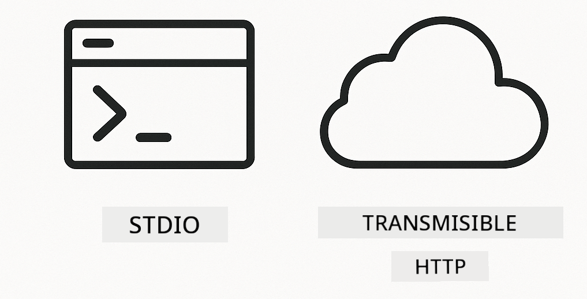

<!--
CO_OP_TRANSLATOR_METADATA:
{
  "original_hash": "c25ec1f10ef156c53e190cdf8b0711ab",
  "translation_date": "2025-12-13T17:35:19+00:00",
  "source_file": "05-mcp/README.md",
  "language_code": "es"
}
-->
# Módulo 05: Protocolo de Contexto de Modelo (MCP)

## Tabla de Contenidos

- [Lo que aprenderás](../../../05-mcp)
- [Entendiendo MCP](../../../05-mcp)
- [Cómo funciona MCP](../../../05-mcp)
  - [Arquitectura Cliente-Servidor](../../../05-mcp)
  - [Descubrimiento de Herramientas](../../../05-mcp)
  - [Mecanismos de Transporte](../../../05-mcp)
- [Requisitos Previos](../../../05-mcp)
- [Qué cubre este módulo](../../../05-mcp)
- [Inicio Rápido](../../../05-mcp)
  - [Ejemplo 1: Calculadora Remota (HTTP Transmisible)](../../../05-mcp)
  - [Ejemplo 2: Operaciones de Archivos (Stdio)](../../../05-mcp)
  - [Ejemplo 3: Análisis de Git (Docker)](../../../05-mcp)
- [Conceptos Clave](../../../05-mcp)
  - [Selección de Transporte](../../../05-mcp)
  - [Descubrimiento de Herramientas](../../../05-mcp)
  - [Gestión de Sesiones](../../../05-mcp)
  - [Consideraciones Multiplataforma](../../../05-mcp)
- [Cuándo usar MCP](../../../05-mcp)
- [Ecosistema MCP](../../../05-mcp)
- [¡Felicidades!](../../../05-mcp)
  - [¿Qué sigue?](../../../05-mcp)
- [Solución de Problemas](../../../05-mcp)

## Lo que aprenderás

Has construido IA conversacional, dominado los prompts, fundamentado respuestas en documentos y creado agentes con herramientas. Pero todas esas herramientas fueron hechas a medida para tu aplicación específica. ¿Y si pudieras darle a tu IA acceso a un ecosistema estandarizado de herramientas que cualquiera pueda crear y compartir?

El Protocolo de Contexto de Modelo (MCP) ofrece exactamente eso: una forma estándar para que las aplicaciones de IA descubran y usen herramientas externas. En lugar de escribir integraciones personalizadas para cada fuente de datos o servicio, te conectas a servidores MCP que exponen sus capacidades en un formato consistente. Tu agente de IA puede entonces descubrir y usar estas herramientas automáticamente.


*Antes de MCP: Integraciones complejas punto a punto. Después de MCP: Un protocolo, infinitas posibilidades.*

## Entendiendo MCP

MCP resuelve un problema fundamental en el desarrollo de IA: cada integración es personalizada. ¿Quieres acceder a GitHub? Código personalizado. ¿Quieres leer archivos? Código personalizado. ¿Quieres consultar una base de datos? Código personalizado. Y ninguna de estas integraciones funciona con otras aplicaciones de IA.

MCP estandariza esto. Un servidor MCP expone herramientas con descripciones claras y esquemas. Cualquier cliente MCP puede conectarse, descubrir las herramientas disponibles y usarlas. Construye una vez, usa en todas partes.


*Arquitectura del Protocolo de Contexto de Modelo - descubrimiento y ejecución estandarizados de herramientas*

## Cómo funciona MCP

**Arquitectura Cliente-Servidor**

MCP usa un modelo cliente-servidor. Los servidores proveen herramientas: lectura de archivos, consultas a bases de datos, llamadas a APIs. Los clientes (tu aplicación de IA) se conectan a los servidores y usan sus herramientas.

**Descubrimiento de Herramientas**

Cuando tu cliente se conecta a un servidor MCP, pregunta "¿Qué herramientas tienes?" El servidor responde con una lista de herramientas disponibles, cada una con descripciones y esquemas de parámetros. Tu agente de IA puede entonces decidir qué herramientas usar según las solicitudes del usuario.

**Mecanismos de Transporte**

MCP define dos mecanismos de transporte: HTTP para servidores remotos, Stdio para procesos locales (incluyendo contenedores Docker):



*Mecanismos de transporte MCP: HTTP para servidores remotos, Stdio para procesos locales (incluyendo contenedores Docker)*

**HTTP Transmisible** - [StreamableHttpDemo.java](../../../05-mcp/src/main/java/com/example/langchain4j/mcp/StreamableHttpDemo.java)

Para servidores remotos. Tu aplicación hace solicitudes HTTP a un servidor que corre en alguna parte de la red. Usa Server-Sent Events para comunicación en tiempo real.

```java
McpTransport httpTransport = new StreamableHttpMcpTransport.Builder()
    .url("http://localhost:3001/mcp")
    .timeout(Duration.ofSeconds(60))
    .logRequests(true)
    .logResponses(true)
    .build();
```

> **🤖 Prueba con [GitHub Copilot](https://github.com/features/copilot) Chat:** Abre [`StreamableHttpDemo.java`](../../../05-mcp/src/main/java/com/example/langchain4j/mcp/StreamableHttpDemo.java) y pregunta:
> - "¿En qué se diferencia MCP de la integración directa de herramientas como en el Módulo 04?"
> - "¿Cuáles son los beneficios de usar MCP para compartir herramientas entre aplicaciones?"
> - "¿Cómo manejo fallos de conexión o tiempos de espera con servidores MCP?"

**Stdio** - [StdioTransportDemo.java](../../../05-mcp/src/main/java/com/example/langchain4j/mcp/StdioTransportDemo.java)

Para procesos locales. Tu aplicación lanza un servidor como un subproceso y se comunica a través de entrada/salida estándar. Útil para acceso al sistema de archivos o herramientas de línea de comandos.

```java
McpTransport stdioTransport = new StdioMcpTransport.Builder()
    .command(List.of(
        npmCmd, "exec",
        "@modelcontextprotocol/server-filesystem@0.6.2",
        resourcesDir
    ))
    .logEvents(false)
    .build();
```

> **🤖 Prueba con [GitHub Copilot](https://github.com/features/copilot) Chat:** Abre [`StdioTransportDemo.java`](../../../05-mcp/src/main/java/com/example/langchain4j/mcp/StdioTransportDemo.java) y pregunta:
> - "¿Cómo funciona el transporte Stdio y cuándo debería usarlo en lugar de HTTP?"
> - "¿Cómo maneja LangChain4j el ciclo de vida de los procesos de servidores MCP lanzados?"
> - "¿Cuáles son las implicaciones de seguridad al dar acceso a la IA al sistema de archivos?"

**Docker (usa Stdio)** - [GitRepositoryAnalyzer.java](../../../05-mcp/src/main/java/com/example/langchain4j/mcp/GitRepositoryAnalyzer.java)

Para servicios en contenedores. Usa transporte stdio para comunicarse con un contenedor Docker vía `docker run`. Bueno para dependencias complejas o entornos aislados.

```java
McpTransport dockerTransport = new StdioMcpTransport.Builder()
    .command(List.of(
        "docker", "run",
        "-e", "GITHUB_PERSONAL_ACCESS_TOKEN=" + System.getenv("GITHUB_TOKEN"),
        "-v", volumeMapping,
        "-i", "mcp/git"
    ))
    .logEvents(true)
    .build();
```

> **🤖 Prueba con [GitHub Copilot](https://github.com/features/copilot) Chat:** Abre [`GitRepositoryAnalyzer.java`](../../../05-mcp/src/main/java/com/example/langchain4j/mcp/GitRepositoryAnalyzer.java) y pregunta:
> - "¿Cómo aísla el transporte Docker a los servidores MCP y cuáles son los beneficios?"
> - "¿Cómo configuro los montajes de volúmenes para compartir datos entre el host y los contenedores MCP?"
> - "¿Cuáles son las mejores prácticas para manejar el ciclo de vida de servidores MCP basados en Docker en producción?"

## Ejecutando los Ejemplos

### Requisitos Previos

- Java 21+, Maven 3.9+
- Node.js 16+ y npm (para servidores MCP)
- **Docker Desktop** - Debe estar **EJECUTÁNDOSE** para el Ejemplo 3 (no solo instalado)
- Token de Acceso Personal de GitHub configurado en el archivo `.env` (del Módulo 00)

> **Nota:** Si aún no has configurado tu token de GitHub, consulta [Módulo 00 - Inicio Rápido](../00-quick-start/README.md) para instrucciones.

> **⚠️ Usuarios de Docker:** Antes de ejecutar el Ejemplo 3, verifica que Docker Desktop esté corriendo con `docker ps`. Si ves errores de conexión, inicia Docker Desktop y espera ~30 segundos para la inicialización.

## Inicio Rápido

**Usando VS Code:** Simplemente haz clic derecho en cualquier archivo demo en el Explorador y selecciona **"Run Java"**, o usa las configuraciones de lanzamiento desde el panel de Ejecutar y Depurar (asegúrate de haber agregado tu token al archivo `.env` primero).

**Usando Maven:** Alternativamente, puedes ejecutar desde la línea de comandos con los ejemplos a continuación.

**⚠️ Importante:** Algunos ejemplos tienen requisitos previos (como iniciar un servidor MCP o construir imágenes Docker). Revisa los requisitos de cada ejemplo antes de ejecutar.

### Ejemplo 1: Calculadora Remota (HTTP Transmisible)

Esto demuestra integración de herramientas basada en red.

**⚠️ Requisito previo:** Necesitas iniciar el servidor MCP primero (ver Terminal 1 abajo).

**Terminal 1 - Iniciar el servidor MCP:**

**Bash:**
```bash
git clone https://github.com/modelcontextprotocol/servers.git
cd servers/src/everything
npm install
node dist/streamableHttp.js
```

**PowerShell:**
```powershell
git clone https://github.com/modelcontextprotocol/servers.git
cd servers/src/everything
npm install
node dist/streamableHttp.js
```

**Terminal 2 - Ejecutar el ejemplo:**

**Usando VS Code:** Haz clic derecho en `StreamableHttpDemo.java` y selecciona **"Run Java"**.

**Usando Maven:**

**Bash:**
```bash
export GITHUB_TOKEN=your_token_here
cd 05-mcp
mvn compile exec:java -Dexec.mainClass=com.example.langchain4j.mcp.StreamableHttpDemo
```

**PowerShell:**
```powershell
$env:GITHUB_TOKEN=your_token_here
cd 05-mcp
mvn --% compile exec:java -Dexec.mainClass=com.example.langchain4j.mcp.StreamableHttpDemo
```

Observa cómo el agente descubre las herramientas disponibles y luego usa la calculadora para realizar sumas.

### Ejemplo 2: Operaciones de Archivos (Stdio)

Esto demuestra herramientas basadas en subprocesos locales.

**✅ No se necesitan requisitos previos** - el servidor MCP se lanza automáticamente.

**Usando VS Code:** Haz clic derecho en `StdioTransportDemo.java` y selecciona **"Run Java"**.

**Usando Maven:**

**Bash:**
```bash
export GITHUB_TOKEN=your_token_here
cd 05-mcp
mvn compile exec:java -Dexec.mainClass=com.example.langchain4j.mcp.StdioTransportDemo
```

**PowerShell:**
```powershell
$env:GITHUB_TOKEN=your_token_here
cd 05-mcp
mvn --% compile exec:java -Dexec.mainClass=com.example.langchain4j.mcp.StdioTransportDemo
```

La aplicación lanza automáticamente un servidor MCP de sistema de archivos y lee un archivo local. Observa cómo se maneja la gestión del subproceso por ti.

**Salida esperada:**
```
Assistant response: The content of the file is "Kaboom!".
```

### Ejemplo 3: Análisis de Git (Docker)

Esto demuestra servidores de herramientas en contenedores.

**⚠️ Requisitos previos:** 
1. **Docker Desktop debe estar EJECUTÁNDOSE** (no solo instalado)
2. **Usuarios de Windows:** Se recomienda modo WSL 2 (Configuración Docker Desktop → General → "Usar el motor basado en WSL 2"). El modo Hyper-V requiere configuración manual de compartición de archivos.
3. Necesitas construir la imagen Docker primero (ver Terminal 1 abajo)

**Verifica que Docker esté corriendo:**

**Bash:**
```bash
docker ps  # Debería mostrar la lista de contenedores, no un error
```

**PowerShell:**
```powershell
docker ps  # Debería mostrar la lista de contenedores, no un error
```

Si ves un error como "Cannot connect to Docker daemon" o "The system cannot find the file specified", inicia Docker Desktop y espera a que se inicialice (~30 segundos).

**Solución de problemas:**
- Si la IA reporta un repositorio vacío o sin archivos, el montaje de volumen (`-v`) no está funcionando.
- **Usuarios Windows con Hyper-V:** Agrega el directorio del proyecto en Configuración Docker Desktop → Recursos → Compartición de archivos, luego reinicia Docker Desktop.
- **Solución recomendada:** Cambia a modo WSL 2 para compartición automática de archivos (Configuración → General → habilitar "Usar el motor basado en WSL 2").

**Terminal 1 - Construir la imagen Docker:**

**Bash:**
```bash
cd servers/src/git
docker build -t mcp/git .
```

**PowerShell:**
```powershell
cd servers/src/git
docker build -t mcp/git .
```

**Terminal 2 - Ejecutar el analizador:**

**Usando VS Code:** Haz clic derecho en `GitRepositoryAnalyzer.java` y selecciona **"Run Java"**.

**Usando Maven:**

**Bash:**
```bash
export GITHUB_TOKEN=your_token_here
cd 05-mcp
mvn compile exec:java -Dexec.mainClass=com.example.langchain4j.mcp.GitRepositoryAnalyzer
```

**PowerShell:**
```powershell
$env:GITHUB_TOKEN=your_token_here
cd 05-mcp
mvn --% compile exec:java -Dexec.mainClass=com.example.langchain4j.mcp.GitRepositoryAnalyzer
```

La aplicación lanza un contenedor Docker, monta tu repositorio y analiza la estructura y contenido del repositorio a través del agente de IA.

## Conceptos Clave

**Selección de Transporte**

Elige según dónde vivan tus herramientas:
- Servicios remotos → HTTP Transmisible
- Sistema de archivos local → Stdio
- Dependencias complejas → Docker

**Descubrimiento de Herramientas**

Los clientes MCP descubren automáticamente las herramientas disponibles al conectarse. Tu agente de IA ve las descripciones de las herramientas y decide cuáles usar según la solicitud del usuario.

**Gestión de Sesiones**

El transporte HTTP Transmisible mantiene sesiones, permitiendo interacciones con estado con servidores remotos. Los transportes Stdio y Docker suelen ser sin estado.

**Consideraciones Multiplataforma**

Los ejemplos manejan automáticamente diferencias de plataforma (diferencias de comandos Windows vs Unix, conversiones de rutas para Docker). Esto es importante para despliegues en producción en diferentes entornos.

## Cuándo usar MCP

**Usa MCP cuando:**
- Quieras aprovechar ecosistemas de herramientas existentes
- Construyas herramientas que múltiples aplicaciones usarán
- Integres servicios de terceros con protocolos estándar
- Necesites cambiar implementaciones de herramientas sin cambiar código

**Usa herramientas personalizadas (Módulo 04) cuando:**
- Construyas funcionalidades específicas de la aplicación
- El rendimiento sea crítico (MCP añade sobrecarga)
- Tus herramientas sean simples y no se reutilizarán
- Necesites control total sobre la ejecución


## Ecosistema MCP

El Protocolo de Contexto de Modelo es un estándar abierto con un ecosistema en crecimiento:

- Servidores MCP oficiales para tareas comunes (sistema de archivos, Git, bases de datos)
- Servidores contribuidos por la comunidad para varios servicios
- Descripciones y esquemas de herramientas estandarizados
- Compatibilidad entre frameworks (funciona con cualquier cliente MCP)

Esta estandarización significa que las herramientas construidas para una aplicación de IA funcionan con otras, creando un ecosistema compartido de capacidades.

## ¡Felicidades!

Has completado el curso LangChain4j para Principiantes. Has aprendido:

- Cómo construir IA conversacional con memoria (Módulo 01)
- Patrones de ingeniería de prompts para diferentes tareas (Módulo 02)
- Fundamentar respuestas en tus documentos con RAG (Módulo 03)
- Crear agentes de IA con herramientas personalizadas (Módulo 04)
- Integrar herramientas estandarizadas a través de MCP (Módulo 05)

Ahora tienes la base para construir aplicaciones de IA en producción. Los conceptos que aprendiste aplican independientemente de frameworks o modelos específicos: son patrones fundamentales en ingeniería de IA.

### ¿Qué sigue?

Después de completar los módulos, explora la [Guía de Pruebas](../docs/TESTING.md) para ver conceptos de pruebas en LangChain4j en acción.

**Recursos Oficiales:**
- [Documentación LangChain4j](https://docs.langchain4j.dev/) - Guías completas y referencia API
- [LangChain4j GitHub](https://github.com/langchain4j/langchain4j) - Código fuente y ejemplos
- [Tutoriales LangChain4j](https://docs.langchain4j.dev/tutorials/) - Tutoriales paso a paso para varios casos de uso

¡Gracias por completar este curso!

---

**Navegación:** [← Anterior: Módulo 04 - Herramientas](../04-tools/README.md) | [Volver al Inicio](../README.md)

---

## Solución de Problemas

### Sintaxis del Comando Maven en PowerShell
**Problema**: Los comandos de Maven fallan con el error `Unknown lifecycle phase ".mainClass=..."`

**Causa**: PowerShell interpreta `=` como un operador de asignación de variable, rompiendo la sintaxis de propiedad de Maven

**Solución**: Use el operador de detención de análisis `--%` antes del comando Maven:

**PowerShell:**
```powershell
mvn --% compile exec:java -Dexec.mainClass=com.example.langchain4j.mcp.StreamableHttpDemo
```

**Bash:**
```bash
mvn compile exec:java -Dexec.mainClass=com.example.langchain4j.mcp.StreamableHttpDemo
```

El operador `--%` indica a PowerShell que pase todos los argumentos restantes literalmente a Maven sin interpretación.

### Problemas de conexión con Docker

**Problema**: Los comandos de Docker fallan con "Cannot connect to Docker daemon" o "The system cannot find the file specified"

**Causa**: Docker Desktop no está en ejecución o no está completamente inicializado

**Solución**: 
1. Inicie Docker Desktop
2. Espere ~30 segundos para la inicialización completa
3. Verifique con `docker ps` (debería mostrar la lista de contenedores, no un error)
4. Luego ejecute su ejemplo

### Montaje de volúmenes Docker en Windows

**Problema**: El analizador del repositorio Git reporta repositorio vacío o sin archivos

**Causa**: El montaje de volumen (`-v`) no funciona debido a la configuración de uso compartido de archivos

**Solución**:
- **Recomendado:** Cambiar al modo WSL 2 (Configuración de Docker Desktop → General → "Use the WSL 2 based engine")
- **Alternativa (Hyper-V):** Agregar el directorio del proyecto en Configuración de Docker Desktop → Recursos → Uso compartido de archivos, luego reiniciar Docker Desktop

---

<!-- CO-OP TRANSLATOR DISCLAIMER START -->
**Aviso Legal**:  
Este documento ha sido traducido utilizando el servicio de traducción automática [Co-op Translator](https://github.com/Azure/co-op-translator). Aunque nos esforzamos por la precisión, tenga en cuenta que las traducciones automáticas pueden contener errores o inexactitudes. El documento original en su idioma nativo debe considerarse la fuente autorizada. Para información crítica, se recomienda una traducción profesional realizada por humanos. No nos hacemos responsables de malentendidos o interpretaciones erróneas derivadas del uso de esta traducción.
<!-- CO-OP TRANSLATOR DISCLAIMER END -->